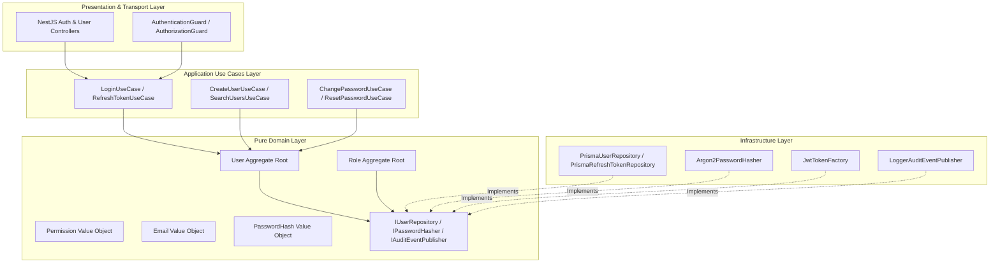
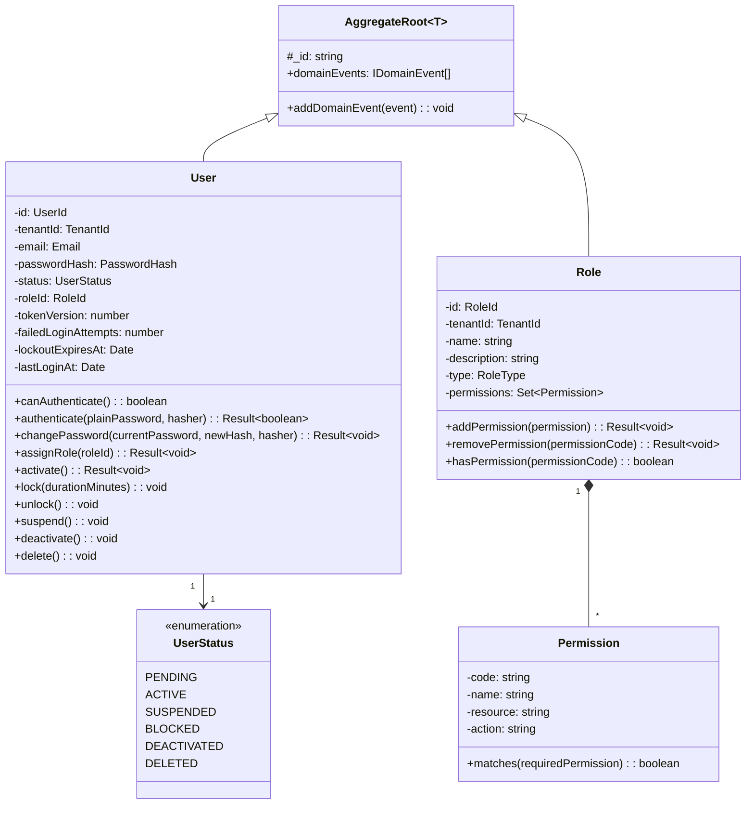
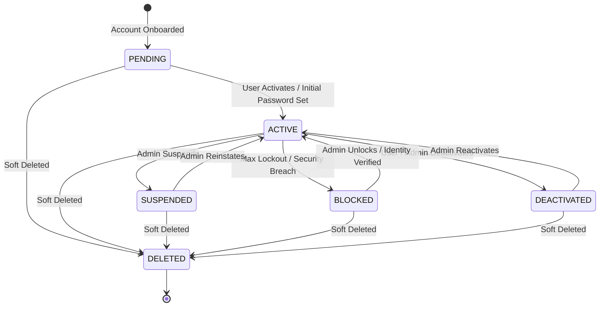
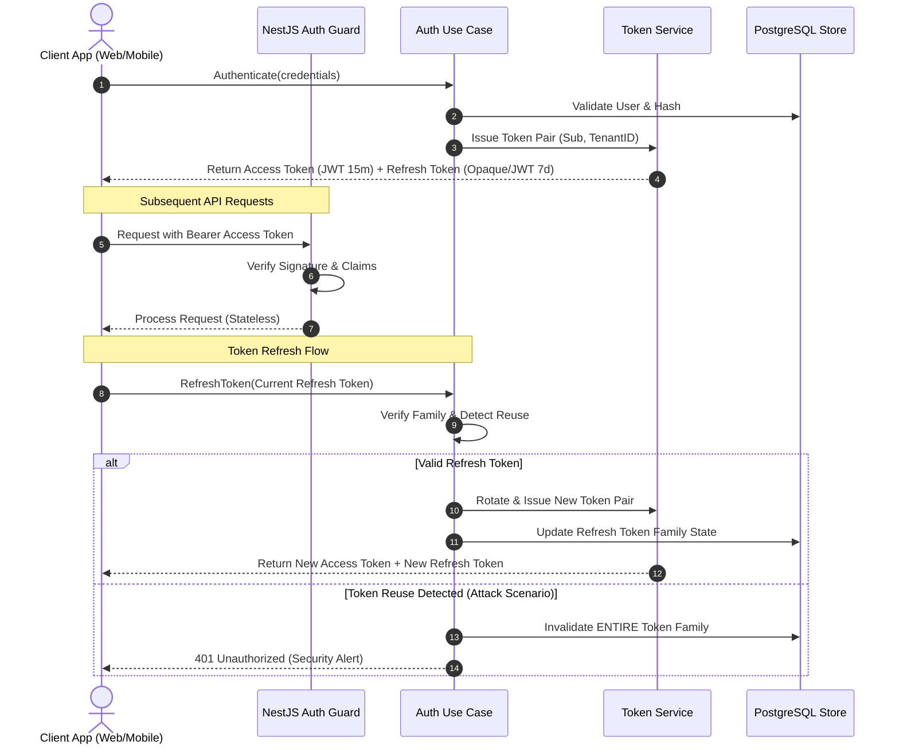

# Identity Bounded Context Architecture & Domain Model Specification

- **Status:** Approved Architecture Specification (Authoritative Single Source of Truth)
- **Date:** 2026-07-29
- **Domain:** Identity & Access Management (IAM)
- **Bounded Context:** Identity Context (`apps/api/src/platform/identity`)

---

## 1. Executive Summary & Bounded Context Overview

The **Identity Bounded Context** is the foundational security boundary of the Kinergy Platform. It is responsible for identity verification, credential management, security account status lifecycles, role-based and permission-based authorization (RBAC/ABAC), and security telemetry publishing.

In accordance with **Domain-Driven Design (DDD)** and **Clean Architecture** principles:

- **Pure Domain Layer**: The domain layer is pure TypeScript, completely framework-agnostic, and has zero dependencies on NestJS, Prisma, TypeORM, or external web frameworks.
- **Encapsulated Invariants**: Business rules, security policies, and account state transitions are enforced exclusively within Aggregate Roots, Entities, and Value Objects.
- **Dependency Inversion**: External operations (database persistence, password hashing, token generation, logging, telemetry) are abstracted behind explicit **Domain Ports** (interfaces).



---

## 2. Context Responsibilities & Non-Responsibilities

To prevent security hazards, data leakage, and domain coupling, the Identity bounded context strictly demarcates inside responsibilities from outside business domain concerns.

```
┌─────────────────────────────────────────────────────────────────────────┐
│                       IDENTITY BOUNDED CONTEXT                          │
│                                                                         │
│  ┌─────────────────────────┐           ┌─────────────────────────────┐  │
│  │   User Aggregate Root   │           │   Prisma Persistence Model  │  │
│  │  - id                   │           │  - id                       │  │
│  │  - email                │           │  - email                    │  │
│  │  - passwordHash         │  ───────► │  - password_hash             │  │
│  │  - status               │           │  - status                   │  │
│  │  - roles / permissions  │           │  - role_id / tenant_id      │  │
│  │  - tenantId / tokenVer  │           │  - created_at / updated_at  │  │
│  └─────────────────────────┘           └─────────────────────────────┘  │
│                                                                         │
│  ZERO Profile Data (No Names, Phones, Avatars, Payroll, or Schedules)   │
└─────────────────────────────────────────────────────────────────────────┘
```

### 2.1 Inside Identity Context Responsibilities

- **Authentication Credentials**: User email, hashed Argon2id passwords, temporary CSPRNG reset tokens, token versioning.
- **Session & Token Management**: JWT access token creation, opaque refresh token issuance, sliding-window Refresh Token Rotation (RTR), family reuse detection, and session revocation.
- **Account Security Lifecycle**: Enforcing account status state machine (`PENDING`, `ACTIVE`, `SUSPENDED`, `BLOCKED`, `DEACTIVATED`, `DELETED`), lockout timers, and failed attempt counters.
- **Authorization Engine**: Role definitions (`Role` aggregate), permission string mappings, wildcard permission resolution (`*`, `users.*`), and security decorators (`@Roles()`, `@RequirePermissions()`).
- **Security Audit Telemetry**: Emitting structured `SecurityEvent` and normalized `IAuditEvent` records (`LOGIN_SUCCEEDED`, `LOGIN_FAILED`, `SECURITY_ALERT`).

### 2.2 Outside Identity Context Non-Responsibilities (Explicitly Rejected)

| Category                         | Prohibited Attributes & Concerns                                 | Managing Context                  |
| :------------------------------- | :--------------------------------------------------------------- | :-------------------------------- |
| **Personal Identifiers**         | `firstName`, `lastName`, `middleName`, `displayName`, `nickname` | `User Profile` Context            |
| **Contact Data**                 | `phoneNumber`, `mobilePhone`, `homeAddress`, `emergencyContact`  | `User Profile` Context            |
| **Profile Assets**               | `avatarUrl`, `profilePicture`, `bio`, `mediaGallery`             | `User Profile` Context            |
| **Employee & Staff Data**        | `employeeId`, `jobTitle`, `department`, `hireDate`, `managerId`  | `Staff / HR` Context              |
| **Trainer Data**                 | `specialties`, `certifications`, `hourlyRate`, `commissionTier`  | `Trainer / Operations` Context    |
| **Billing & SaaS Subscriptions** | `taxId`, `bankAccount`, `subscriptionTier`, `billingAddress`     | `Tenant / Billing` Context        |
| **Schedules & Operations**       | `shiftSchedule`, `workingHours`, `assignedBranches`              | `Operations / Scheduling` Context |

---

## 3. Core Domain Model Specification

### 3.1 Domain Model Class Diagram



### 3.2 User Aggregate Root (`User`)

The `User` aggregate root is the core security entity. It encapsulates:

- **`id`**: Unique string identifier (`usr_...`).
- **`email`**: `Email` value object enforcing RFC 5322 validation.
- **`passwordHash`**: `PasswordHash` value object encapsulating Argon2id hashes (`$argon2id$v=19$...`).
- **`status`**: `UserStatus` enum governed by `UserStatusStateMachine`.
- **`tokenVersion`**: Integer incremented on password changes or security resets to revoke all outstanding JWT access tokens.
- **`tenantId`**: String tenant identifier enabling multi-tenant SaaS context isolation.

#### Core Domain Methods

- `canAuthenticate()`: Returns `true` only if `status === UserStatus.ACTIVE` and account is not locked.
- `authenticate(plainPassword, hasher)`: Validates plain password against `passwordHash` via `IPasswordHasher` port.
- `changePassword(currentPassword, newHash, hasher)`: Validates current password, updates hash, increments `tokenVersion`, and emits `PasswordChangedEvent`.
- `activate()`, `suspend()`, `lock()`, `unlock()`, `deactivate()`, `delete()`: Governed by state machine rules.

---

## 4. Account Lifecycle & State Machine

Account statuses are governed by the `UserStatusStateMachine` to enforce strict security state transition rules.



### Allowed State Transition Invariants

| Current Status         | Target Status | Transition Trigger                  | Validation Invariants                        |
| :--------------------- | :------------ | :---------------------------------- | :------------------------------------------- |
| `PENDING`              | `ACTIVE`      | Initial login / password set        | Verification code validated                  |
| `ACTIVE`               | `SUSPENDED`   | Temporary administrative block      | Reason required in audit log                 |
| `ACTIVE`               | `BLOCKED`     | Automated lockout / fraud detection | Exceeds max failed attempts or replay attack |
| `ACTIVE`               | `DEACTIVATED` | Account closure                     | Revokes all active refresh token families    |
| Any (except `DELETED`) | `DELETED`     | Soft delete requested               | Sets `deletedAt`, increments `tokenVersion`  |
| `DELETED`              | Any           | **PROHIBITED**                      | Immutable end state                          |

---

## 5. Roles & Permissions Model (RBAC / ABAC)

Authorization is implemented using a hybrid Role-Based and Permission-Based Access Control model.

### 5.1 System Built-in Roles

| Role Code      | Description                   | Default Permissions Scope                        |
| :------------- | :---------------------------- | :----------------------------------------------- |
| `OWNER`        | Platform SaaS Super Admin     | Wildcard full control (`*`)                      |
| `ADMIN`        | Tenant Administrative Manager | `users.*`, `roles.*`, `sustainability.*`         |
| `OPERATOR`     | Facility Energy Manager       | `assets.read`, `assets.update`, `telemetry.read` |
| `TRAINER`      | Operational Field Staff       | `appointments.read`, `clients.read`              |
| `CLIENT`       | End Consumer / Customer       | `profile.me`, `telemetry.read_own`               |
| `RECEPTIONIST` | Front Desk Support            | `appointments.*`, `clients.read`                 |

### 5.2 Permission Resolution Engine (`DefaultPermissionResolver`)

Permissions are represented as structured strings (`resource:action` e.g., `users:create`, `assets:update`). Wildcard evaluation is supported:

- `*` matches any permission across the system.
- `users.*` matches `users:create`, `users:read`, `users:update`, `users:delete`.
- `users:read` matches only exact `users:read` requests.

---

## 6. Dual-Token Authentication & Refresh Token Rotation Sequence



---

## 7. Application & Infrastructure Layer Mapping

### 7.1 Application Layer Use Cases (`apps/api/src/platform/identity/use-cases`)

- **`LoginUseCase`**: Validates credentials via `canAuthenticate()`, executes dummy Argon2id hash verification on missing users to prevent timing attacks, and issues token pairs.
- **`LogoutUseCase`**: Revokes active refresh token family and purges session context.
- **`RefreshTokenUseCase`**: Performs sliding-window token rotation and family reuse detection.
- **`ChangePasswordUseCase`**: Validates current password, updates hash, and increments `tokenVersion`.
- **`ResetPasswordUseCase`**: Admin-initiated CSPRNG temporary password generation.
- **`CreateUserUseCase`**, **`UpdateUserUseCase`**, **`DeactivateUserUseCase`**, **`DeleteUserUseCase`**, **`SearchUsersUseCase`**: Identity administration use cases.

### 7.2 Infrastructure Adapters (`apps/api/src/platform/identity/*`)

| Port Interface            | Infrastructure Implementation  | Responsibilities                                               |
| :------------------------ | :----------------------------- | :------------------------------------------------------------- |
| `IUserRepository`         | `PrismaUserRepository`         | Persistence mapping to `users` PostgreSQL table via Prisma ORM |
| `IRefreshTokenRepository` | `PrismaRefreshTokenRepository` | Persistence mapping to `refresh_tokens` table                  |
| `IPasswordHasher`         | `Argon2PasswordHasher`         | Memory-hard password hashing ($m=64\text{MB}, t=3, p=4$)       |
| `ISecurityEventPublisher` | `LoggerSecurityEventPublisher` | Structured JSON log output for security events                 |
| `IAuditEventPublisher`    | `LoggerAuditEventPublisher`    | Standardized audit logging dispatcher                          |

---

## 8. Relationships with Future Bounded Contexts

Future application modules (`User Profile`, `Staff / HR`, `Asset Monitoring`, `Billing`) consume `Identity` as an **Authentication and Authorization Provider** by referencing `User.id` as a loose foreign key without direct ORM table coupling or circular domain dependencies.

```mermaid
graph TB
    subgraph Identity Bounded Context
        UserAgg[User Aggregate Root (id, email, tenantId)]
        AuthGuard[Authentication & Authorization Guards]
    end

    subgraph Downstream Bounded Contexts
        ProfileBC[User Profile Context]
        StaffBC[Staff & HR Context]
        AssetBC[Asset Telemetry Context]
        BillingBC[SaaS Tenant Billing Context]
    end

    AuthGuard -->|Injects Security Context| ProfileBC
    AuthGuard -->|Injects Security Context| StaffBC
    AuthGuard -->|Injects Security Context| AssetBC
    AuthGuard -->|Injects Security Context| BillingBC

    ProfileBC -.->|References User.id (String)| UserAgg
    StaffBC -.->|References User.id (String)| UserAgg
    AssetBC -.->|References User.id (String)| UserAgg
    BillingBC -.->|References Tenant.id (String)| UserAgg
```

---

## 9. Architecture Extension Guidelines

### 9.1 Adding a New Permission

1. Add the permission code string to `PermissionCode` enum/type in `apps/api/src/platform/identity/authorization/types`.
2. Register the permission mapping in `DefaultPermissionResolver` or seed configuration in `prisma/seeds/identity.seed.ts`.
3. Use `@RequirePermissions('resource:action')` on controller routes.

### 9.2 Adding a New Role

1. Register role code in `RoleType` enum.
2. Define default permissions set in `RoleTestFactory` and Prisma seed file.
3. Update RBAC evaluation tests in `authorization.guard.spec.ts`.

### 9.3 Adding a Federated Identity Provider (OAuth2 / OIDC)

1. Implement domain port `IFederatedIdentityProviderPort` (`authenticateWithProvider(token)`).
2. Create infrastructure adapter (e.g. `GoogleOidcIdentityProviderService`).
3. Map external OIDC `sub` and `email` to existing `User` aggregate without modifying core identity invariants.
