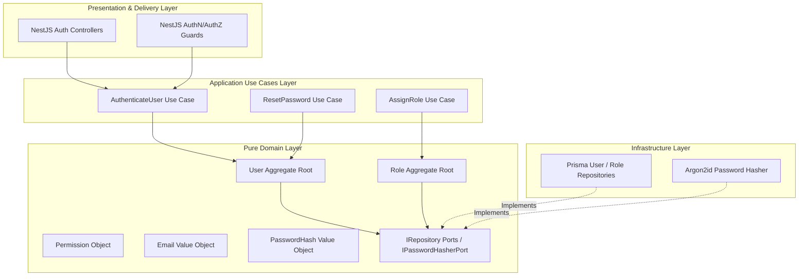
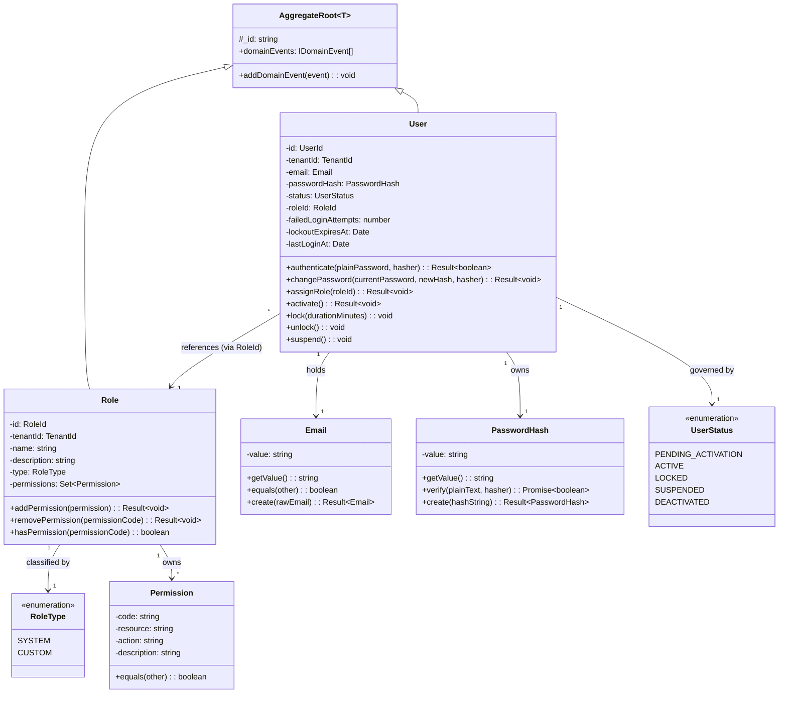
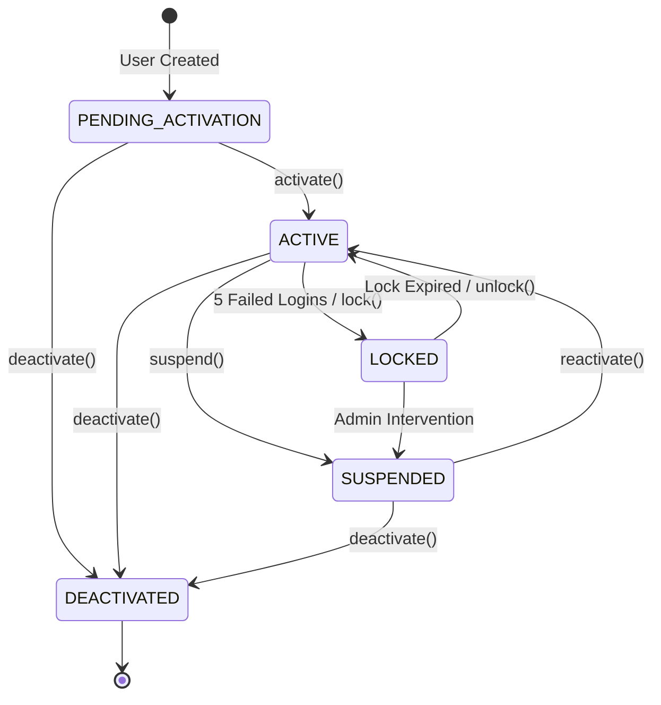
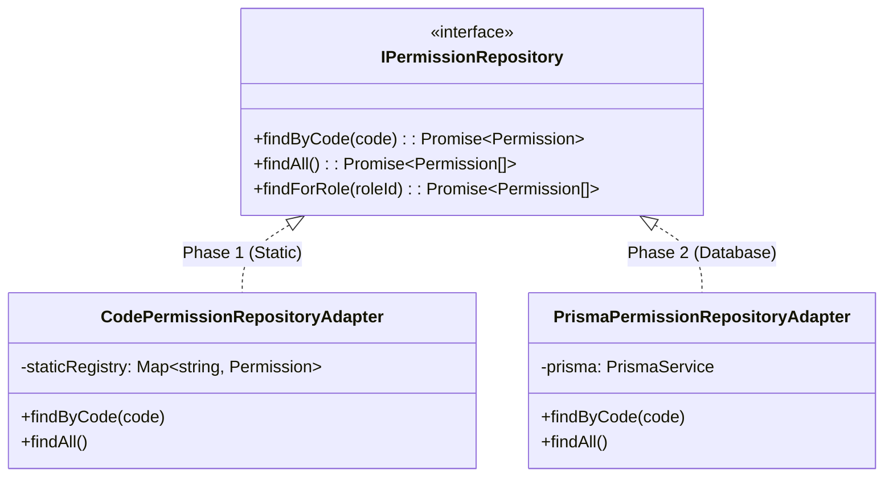

# Identity Bounded Context Domain Model Specification

- **Status:** Approved Architecture
- **Date:** 2026-07-25
- **Domain:** Identity & Access Management (IAM)
- **Bounded Context:** Identity Context

---

## 1. Domain Architectural Overview

The **Identity Bounded Context** is the primary domain boundary in the Kinergy Platform responsible for identity verification, credential management, security status lifecycles, and authorization role/permission definitions.

In accordance with **Domain-Driven Design (DDD)** and **Clean Architecture** principles:

- The domain layer is pure TypeScript, completely framework-agnostic, and has zero dependencies on NestJS, Prisma, TypeORM, or external web frameworks.
- Business rules and invariants are encapsulated entirely inside Aggregate Roots, Entities, and Value Objects.
- Persistence and external operations (hashing, email delivery) are abstracted behind explicit **Domain Ports** (interfaces).



---

## 2. Tactical DDD Model Overview



---

## 3. Aggregate Root: User

### 3.1 Responsibilities

The `User` aggregate root is the transactional boundary representing a human or system actor credential account. It is responsible for:

1. Safeguarding credential access and delegating password verification.
2. Managing failed authentication attempts and enforcing security lockouts.
3. Executing account status transitions (`PENDING_ACTIVATION`, `ACTIVE`, `LOCKED`, `SUSPENDED`, `DEACTIVATED`).
4. Maintaining reference assignment to authorized `RoleId`s.
5. Recording and clearing domain events (`UserAuthenticatedEvent`, `UserPasswordChangedEvent`, `UserLockedEvent`, `UserStatusChangedEvent`).

### 3.2 Identity & Key Attributes

- **`id` (`UserId`):** Globally unique domain identity (UUID v4).
- **`tenantId` (`TenantId`):** Multi-tenant organization boundary reference.
- **`email` (`Email`):** Unique, normalized email address Value Object.
- **`passwordHash` (`PasswordHash`):** Encapsulated PHC password hash Value Object.
- **`status` (`UserStatus`):** Current account state.
- **`roleId` (`RoleId`):** Assigned role aggregate identifier reference.
- **`failedLoginAttempts` (`number`):** Counter tracking consecutive failed logins.
- **`lockoutExpiresAt` (`Date | null`):** Expiration timestamp if account is currently locked.
- **`lastLoginAt` (`Date | null`):** Timestamp of last successful authentication.

### 3.3 Invariants & Business Rules

1. **Authentication State Rule:** A user can ONLY authenticate successfully if `status === UserStatus.ACTIVE`. Attempting to authenticate a `PENDING_ACTIVATION`, `LOCKED`, `SUSPENDED`, or `DEACTIVATED` user returns an explicit `Result.fail(UserAccountNotActiveError)`.
2. **Lockout Policy Rule:**
   - 5 consecutive failed password verifications automatically transition `status` to `UserStatus.LOCKED` for 15 minutes (`lockoutExpiresAt = now + 15m`).
   - Re-authenticating while `lockoutExpiresAt` is in the future returns `AccountLockedError`.
   - Once `lockoutExpiresAt` has passed, an authentication attempt automatically resets `failedLoginAttempts` to 0 and unlocks the user.
3. **Password Change Rule:**
   - Changing a password requires verifying the existing current password using `IPasswordHasherPort`.
   - Successful password change updates `passwordHash`, increments `tokenVersion`, and emits `UserPasswordChangedEvent`.
4. **Role Assignment Rule:**
   - A user cannot be assigned a null or invalid `RoleId`.
   - Assigning a role emits `UserRoleAssignedEvent`.

### 3.4 Aggregate Boundary & Ownership

- `User` owns its credentials (`PasswordHash`), failed login state, and status machine.
- `User` maintains a direct reference to `RoleId` (by ID), NOT a direct reference to the `Role` aggregate object. This prevents bloated aggregate trees and ensures transactional independence between User and Role aggregates.

### 3.5 User Lifecycle State Machine



---

## 4. Aggregate Root / Entity: Role

### 4.1 Purpose & Responsibilities

The `Role` entity encapsulates a named authorization bundle mapping domain permissions to user identity groups.
It is responsible for:

1. Maintaining an immutable set of domain permissions (`Permission`).
2. Distinguishing system-defined default roles from tenant-defined custom roles.
3. Enforcing permission assignment rules.

### 4.2 Attributes

- **`id` (`RoleId`):** Domain identity (UUID or system key string, e.g. `role-super-admin`).
- **`tenantId` (`TenantId | null`):** `null` for global system roles; non-null for tenant-specific custom roles.
- **`name` (`string`):** Unique human-readable role name (e.g. "Energy Operations Manager").
- **`description` (`string`):** Explanatory text describing role entitlements.
- **`type` (`RoleType`):** Classification enum (`SYSTEM` vs `CUSTOM`).
- **`permissions` (`Set<Permission>`):** Unique set of permissions granted to this role.

### 4.3 Invariants & Immutable Behavior

1. **System Role Immutability Rule:** Roles defined with `type === RoleType.SYSTEM` are globally immutable. Attempting to add, remove, or clear permissions from a `SYSTEM` role returns `Result.fail(SystemRoleImmutableError)`.
2. **Tenant Scope Rule:** Roles with `type === RoleType.CUSTOM` MUST be bound to a valid `tenantId`. Global system roles MUST have `tenantId === null`.
3. **Permission Uniqueness Rule:** A role cannot contain duplicate permissions. Permissions are stored in a Set keyed by unique permission code.

### 4.4 Future Database Flexibility

Role definitions are completely independent of persistence mechanisms. Whether loaded from static code definitions or dynamically from a `roles` table in PostgreSQL via Prisma, the `Role` aggregate behavior remains identical.

---

## 5. Domain Object: Permission (Code-Defined to Database-Managed)

### 5.1 Overview & Responsibilities

A `Permission` represents a single fine-grained authorization entitlement defined as a string formatted as `<resource>:<action>` (e.g., `identity:users:create`, `assets:devices:configure`).

### 5.2 Decoupling Strategy: Code-Defined to Database-Managed

To prevent breaking changes when transitioning from static, code-defined permissions to dynamic database-driven permissions:

1. **Domain Abstraction:** `Permission` is modeled as an immutable domain object containing:
   - `code`: String identifier (e.g., `identity:users:create`).
   - `resource`: Target domain resource (`identity:users`).
   - `action`: Action verb (`create`).
   - `description`: Human-readable entitlement description.

2. **Repository Port Decoupling:** Use cases query permissions via the `IPermissionRepository` port.



- **Phase 1 (Code-Defined):** `CodePermissionRepositoryAdapter` serves permissions from an in-memory TypeScript registry (`PERMISSIONS_REGISTRY`).
- **Phase 2 (Database-Managed):** `PrismaPermissionRepositoryAdapter` implements `IPermissionRepository`, fetching permissions dynamically from database tables.
- **Result:** Zero changes required in Domain Entities, NestJS Policy Guards, or Application Use Cases during the migration.

---

## 6. Value Objects

### 6.1 `Email`

#### Responsibilities

Encapsulates string validation, lowercasing normalization, and structural equality for email addresses.

#### Validation & Normalization Rules

- Validated against RFC 5322 standard format regex.
- Maximum length: 254 characters.
- Automatically trimmed and converted to lowercase upon creation (`John.Doe@Example.COM` $\rightarrow$ `john.doe@example.com`).

#### Immutability & Equality

- Properties are frozen (`Object.freeze`).
- Equality is structural:
  ```typescript
  public equals(other: Email): boolean {
    return this.props.value === other.props.value;
  }
  ```

---

### 6.2 `PasswordHash`

#### Responsibilities

Encapsulates hashed password security representation, preventing raw plaintext passwords from ever polluting domain entities.

#### Validation & Immutability Rules

- Validated to ensure it matches standard PHC hash string format (`$argon2id$...` or `$2b$...`).
- Purely immutable; contains zero setter methods.

#### Hasher Service Delegation

Verification of plaintext passwords against the hash is executed by delegating to an injected `IPasswordHasherPort`:

```typescript
public async verify(plainTextPassword: string, hasher: IPasswordHasherPort): Promise<boolean> {
  return hasher.verify(plainTextPassword, this.props.value);
}
```

---

## 7. Enums & Rationale

### 7.1 `UserStatus`

```typescript
export enum UserStatus {
  PENDING_ACTIVATION = 'PENDING_ACTIVATION',
  ACTIVE = 'ACTIVE',
  LOCKED = 'LOCKED',
  SUSPENDED = 'SUSPENDED',
  DEACTIVATED = 'DEACTIVATED',
}
```

### 7.2 `RoleType`

```typescript
export enum RoleType {
  SYSTEM = 'SYSTEM',
  CUSTOM = 'CUSTOM',
}
```

### 7.3 Rationale for Enum Usage

Enums are strictly appropriate for `UserStatus` and `RoleType` because:

1. **Closed Domain State Classification:** Both status lifecycles and role types represent fixed, finite sets of states defined by core business domain rules.
2. **Compile-Time Type Safety:** Enums enable strict TypeScript compile-time type checking, preventing invalid strings from entering domain logic.
3. **Exhaustive State Machine Guarding:** Switch statements in domain use cases can enforce exhaustive pattern matching, guaranteeing every account state transition is explicitly handled.

---

## 8. Domain Ports (Dependency Inversion)

The Identity domain defines clean interfaces for all infrastructure dependencies:

```typescript
// Core Domain Ports (Abstract Interfaces)

export interface IUserRepository {
  findById(id: UserId): Promise<User | null>;
  findByEmail(email: Email): Promise<User | null>;
  save(user: User): Promise<void>;
}

export interface IRoleRepository {
  findById(id: RoleId): Promise<Role | null>;
  findByName(name: string, tenantId: TenantId | null): Promise<Role | null>;
  save(role: Role): Promise<void>;
}

export interface IPasswordHasherPort {
  hash(plainTextPassword: string): Promise<PasswordHash>;
  verify(plainTextPassword: string, hash: PasswordHash): Promise<boolean>;
}

---

## 9. User Administration & Context Boundary Isolation

### 9.1 Boundary Isolation Guarantee

The `User` aggregate in the Identity Bounded Context owns **only** credential attributes and security state:
- `id`, `email`, `passwordHash`, `status`, `roles`, `permissions`, `tenantId`, `tokenVersion`, `createdAt`, `updatedAt`, `deletedAt`.

Personal profile data (`firstName`, `lastName`, `phone`, `avatar`, `birthDate`, `employeeInfo`) is strictly excluded from `platform/identity` and resides in future domain contexts (e.g. Employee Profile, Trainer Context).

### 9.2 Administrative Application Use Cases

Administrative identity account management is executed via 6 application use cases in `platform/identity/use-cases/admin`:
1. `CreateUserUseCase`: Validates email uniqueness & format, hashes password, saves `User` instance.
2. `UpdateUserUseCase`: Updates email or roles with uniqueness validation.
3. `ActivateUserUseCase`: Transitions status to `ACTIVE`.
4. `DeactivateUserUseCase`: Transitions status to `DEACTIVATED`, revokes tokens.
5. `DeleteUserUseCase`: Soft-deletes user (`deletedAt = now()`), revokes active tokens.
6. `SearchUsersUseCase`: Searches identity accounts with pagination (`page`, `limit`) and filters (`email`, `role`, `status`).

```
