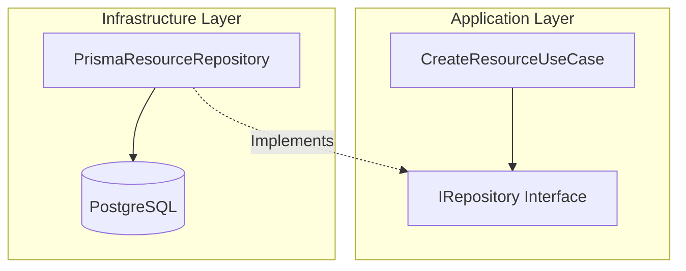
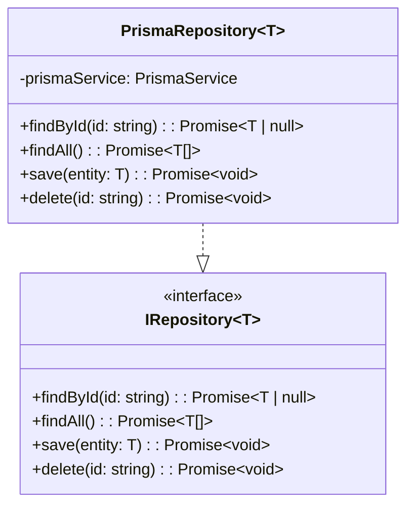
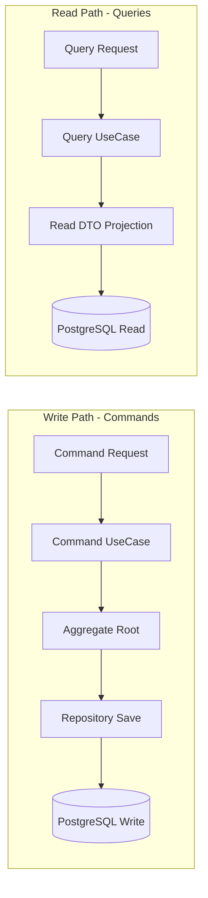

# Architectural Patterns & Design Decisions

This document details core architectural patterns applied across the Kinergy Platform monorepo.

---

## 1. Dependency Inversion Principle (DIP)

High-level domain and application use cases **never depend directly** on low-level infrastructure details (database ORMs, external APIs, logger frameworks). Instead, both depend on abstract **interface ports**.

---

## 2. Generic Repository Pattern

Repositories encapsulate the logic required to access domain aggregates. The application layer consumes generic repository port interfaces (`IRepository<T>`), allowing infrastructure adapters to fulfill persistence operations transparently.

---

## 3. CQRS (Command Query Responsibility Segregation) Alignment

The architecture prepares for **Command Query Responsibility Segregation (CQRS)** by separating mutation state flows (Commands) from read-only data fetching (Queries).

### Rationale

- **Commands**: Alter domain state, enforce business invariants through Aggregate Roots, record domain events, and return `Result<void, E>`.
- **Queries**: Bypasses heavy domain entity instantiation for fast read-only projections, returning optimized DTO payloads.

---

## 4. Architectural Decision Records (ADR) Methodology

Every significant architectural, framework, or structural decision in the Kinergy Platform is recorded as a numbered markdown document in `docs/adr/`.

### ADR Workflow

1. **Identify Decision**: When introducing structural changes or tool choices.
2. **Author ADR**: Create `docs/adr/NNNN-title.md` detailing Context, Decision Drivers, Outcome, and Consequences.
3. **Register Index**: Append to the ADR index table in `docs/adr/README.md`.
