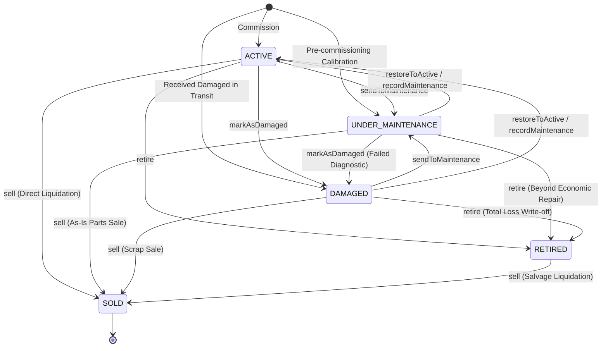

# ADR-0085: Fixed Asset Operational Lifecycle State Machine & Terminal Disposal Policy

- **Status**: Accepted
- **Deciders**: Principal Architect, Principal Domain Architect, Lead Full-Stack Engineer, Principal Backend Engineer
- **Date**: 2026-08-25 (Updated 2026-08-26 for Milestone 6.2 Canonical State Vocabulary)
- **Context/Milestone**: Phase 6.2 — Fixed Asset Lifecycle Architecture & State Machine

---

## Context and Problem Statement

Fixed assets represent non-fungible capital property that transitions through distinct physical and operational stages over years of service. An unconstrained status field or ad-hoc status updates lead to invalid business states (e.g. servicing a sold asset, transferring retired equipment, or putting a dead asset back into active service without audit trail).

We must define the explicit finite state machine (FSM) for `FixedAsset` and establish the deterministic rules governing lifecycle transitions, initial states, terminal disposal, and history tracking.

---

## Decision Drivers

- **Operational Safety & Clarity**: Clinicians and gym staff must have reliable visibility into whether equipment is operational (`ACTIVE`) or down for service (`UNDER_MAINTENANCE`, `DAMAGED`).
- **Audit & Accounting Permanence**: Asset write-offs (`RETIRED`) and liquidations (`SOLD`) carry legal, regulatory, and tax depreciation implications.
- **Terminal State Immutability**: Liquidated / sold assets (`SOLD`) must be strictly irreversible and immutable.
- **Atomic History Enforcement**: Every state transition must atomically record an immutable history event with the authenticated actor and justification reason.

---

## Decision Outcome

We define a strict **5-State Finite State Machine** for `FixedAsset`, implemented in `AssetLifecycleStateMachine` and enforced in `FixedAsset`:

### Transition Invariants:

1. **Valid Initial States**: An asset can be registered in `ACTIVE`, `UNDER_MAINTENANCE`, or `DAMAGED`. Registration directly as `RETIRED` or `SOLD` is strictly prohibited.
2. **`SOLD` is an Absolute Terminal Sink State (`[AST-INV-1]`)**: No further status changes, location transfers, condition changes, maintenance records, or details updates are permitted on a sold asset. Direct assignment via `changeStatus` is prohibited; liquidation must use `sell(saleAmount, actorId, reason)`.
3. **`RETIRED` Invariants (`[AST-INV-2]`)**: Retired assets cannot undergo physical location transfers or maintenance servicing. Decommissioned assets can only transition to `SOLD` via liquidation. Reactivation to `ACTIVE` is prohibited by accounting standards.
4. **Mandatory Audit Reason (`[AST-INV-4]`)**: All status mutations require an authenticated `actorId` and a mandatory descriptive `reason` ($\ge 3$ characters).
5. **Condition Orthogonality (`[AST-INV-9]`)**: An asset in `OUT_OF_SERVICE` condition cannot be restored to `ACTIVE` status without prior repair.

---

## Alternatives Considered

1. **Free-form String Status (`status: string`)**:
   - _Rejected_: Zero invariant protection; prone to silent corruption.
2. **Reversible Disposal / Reversible Retirement**:
   - _Rejected_: Violates physical accounting and tax depreciation standards. Decommissioned or scrapped property cannot be silently "un-retired"; re-acquired items must be registered under a new asset tag with audit references.
3. **Generic `updateAsset({ status })`**:
   - _Rejected_: Bypasses state machine validation. Status transitions must occur through explicit domain methods (`sendToMaintenance`, `markAsDamaged`, `restoreToActive`, `retire`, `sell`).

---

## Consequences

- **Positive**: Complete lifecycle determinism, compile-time and runtime transition safety, and immutable compliance audit trail.
- **Negative**: Requires explicit domain methods for state mutations.

---

## Related Documents & Decisions

- [Fixed Asset Lifecycle Specification](../asset-lifecycle.md)
- [ADR-0090: Fixed Asset Classification, Lifecycle State, & Condition Rating Strategy](./0090-fixed-asset-classification-lifecycle-state-and-condition-rating-strategy.md)
- [ADR-0082: Fixed Asset Domain Modeling & Complete Segregation from Inventory](./0082-fixed-asset-domain-modeling-and-complete-segregation-from-inventory.md)
