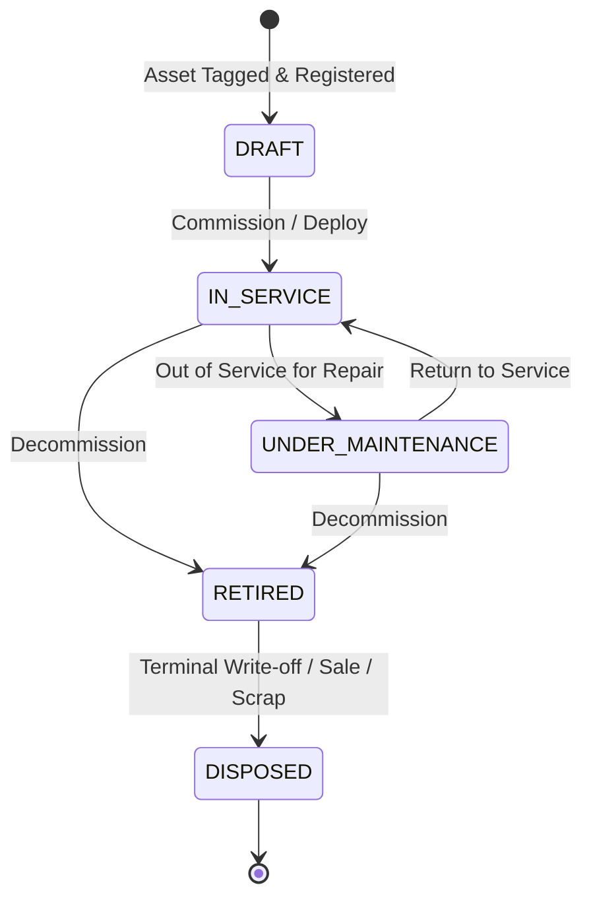

# ADR-0085: Fixed Asset Operational Lifecycle State Machine & Terminal Disposal Policy

- **Status**: Accepted
- **Deciders**: Principal Architect, Principal Domain Architect, Lead Full-Stack Engineer
- **Date**: 2026-08-25
- **Context/Milestone**: Phase 6 — Fixed Asset Lifecycle Architecture

---

## Context and Problem Statement

Fixed assets represent capital property that transitions through distinct physical and operational stages over years of service. An unconstrained status field leads to invalid business states (e.g. servicing a disposed asset, or putting a draft asset directly into retirement).

We must define the explicit finite state machine for `FixedAsset` and establish the rules governing lifecycle transitions and terminal disposal.

---

## Decision Drivers

- **Operational Clarity**: Staff must clearly know whether a machine is available for treatment or down for repair.
- **Audit Permanence**: Asset write-offs and disposals carry legal and accounting implications.
- **Terminal Immutability**: Disposed assets must never be reactivated.

---

## Decision Outcome

We define a strict **5-State Finite State Machine** for `FixedAsset`:

### Transition Invariants:

1. **`DRAFT` $\rightarrow$ `IN_SERVICE`**: Asset is physically commissioned and assigned a valid `LocationRef`.
2. **`IN_SERVICE` $\leftrightarrow$ `UNDER_MAINTENANCE`**: Requires a non-empty maintenance reason or linked `AssetMaintenanceRecord`.
3. **`RETIRED` $\rightarrow$ `DISPOSED`**: Requires mandatory `disposalReason`, `disposalDate`, and optional `salvageAmount`.
4. **`DISPOSED` is an Irreversible Terminal Sink State**: No further status changes, location moves, or maintenance logs are permitted on a disposed asset.

---

## Alternatives Considered

1. **Free-form String Status (`status: string`)**:
   - _Rejected_: Zero invariant protection; prone to data corruption.
2. **Reversible Disposal**:
   - _Rejected_: Violates physical accounting rules. A scrapped or sold asset cannot be "un-disposed"; re-acquired items must be registered under a new asset tag.

---

## Consequences

- **Positive**: Strict lifecycle governance preventing invalid operational states; complete compliance audit trail.
- **Negative**: Requires explicit domain methods for every state transition (`sendToMaintenance`, `returnFromMaintenance`, `retire`, `dispose`).
