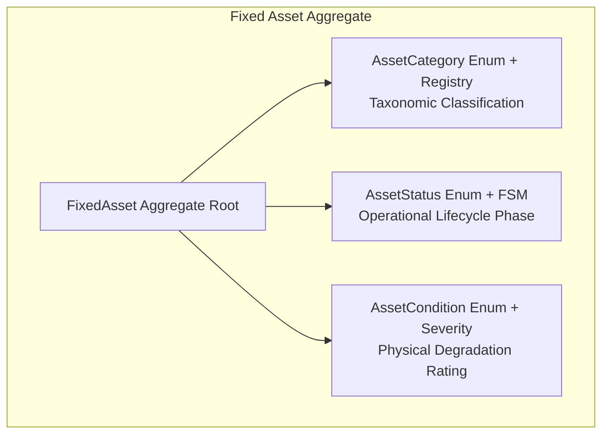

# ADR-0090: Fixed Asset Classification, Lifecycle State, and Condition Rating Strategy

- **Status**: Accepted
- **Deciders**: Principal Domain Architect, Lead Financial Architect, Principal Backend Engineer
- **Date**: 2026-08-26
- **Context/Milestone**: Phase 6.2 — Fixed Asset Domain Model & State Vocabulary

---

## Context and Problem Statement

The Fixed Asset domain model within the `resources` bounded context manages capital equipment, clinical apparatus, and facility infrastructure. The domain requires distinct mechanisms to classify:

1. **What the asset is** (Category: e.g., Gym Equipment, Therapy Equipment, Kitchen Equipment, Office Furniture, Electronics, Cleaning Equipment).
2. **Where the asset is in its operational lifecycle** (Status: `ACTIVE`, `UNDER_MAINTENANCE`, `DAMAGED`, `RETIRED`, `SOLD`).
3. **The physical/functional degradation rating of the asset** (Condition: `EXCELLENT`, `GOOD`, `FAIR`, `NEEDS_REPAIR`, `OUT_OF_SERVICE`).

We must establish the architectural representations for Category, Status, and Condition, evaluating whether each should be a **code-defined domain enum**, a **code-defined constant/registry**, or a **database-managed entity**. We must also formalize the semantic boundaries and operational rules governing statuses and condition ratings.

---

## Decision Drivers

- **Semantic Disambiguation**: Category, Status, and Condition serve fundamentally distinct architectural purposes:
  - _Category_ is a static taxonomic classification for balance-sheet grouping and regulatory depreciation.
  - _Status_ is an active finite state machine controlling domain aggregate operation permissions.
  - _Condition_ is a point-in-time qualitative wear rating assessed during inspections and maintenance.
- **Domain Invariants & Terminal Safety**: State transitions to terminal states (`SOLD`) must be strictly irreversible and guard against invalid operations at compile time and runtime.
- **Reporting & Asset Valuation Consistency**: Financial auditing, depreciation calculation, and cross-facility uptime reporting require deterministic, canonical boundaries without user-created taxonomy fragmentation.
- **Kinergy Architectural Consistency**: Across all platform bounded contexts (`UserRole`, `UserStatus`, `MembershipStatus`, `AppointmentStatus`, `InventoryCategory`), lifecycle states and core taxonomies are code-defined domain enums backed by native PostgreSQL enums rather than runtime lookup tables.
- **YAGNI & Zero Accidental Complexity**: Avoid unnecessary database lookup tables, foreign keys, cache invalidation, and CRUD management screens for static business concepts.

---

## Decision Outcome

We choose a **Triple Code-Defined Architecture** with distinct semantic implementations tailored to each concept:

### 1. Category Strategy: Code-Defined Domain Enum with In-Memory Metadata Registry

- **Domain Type**: `AssetCategory` enum (`GYM_EQUIPMENT`, `THERAPY_EQUIPMENT`, `KITCHEN_EQUIPMENT`, `OFFICE_FURNITURE`, `ELECTRONICS`, `CLEANING_EQUIPMENT`).
- **Metadata Registry**: `ASSET_CATEGORY_REGISTRY` providing type-safe operational metadata (`displayName`, `description`, `requiresMaintenance`, `defaultInspectionIntervalDays`).
- **Persistence**: Mapped to native PostgreSQL enum `AssetCategory` with B-tree index `@@index([category])`.
- **Rationale**: Categories represent fixed accounting asset classes defined by corporate financial policy. They do not require runtime CRUD.

### 2. Status Strategy: Code-Defined Domain Enum with Strict Finite State Machine

- **Domain Type**: `AssetStatus` enum (`ACTIVE`, `UNDER_MAINTENANCE`, `DAMAGED`, `RETIRED`, `SOLD`).
- **Capabilities Registry**: `ASSET_STATUS_REGISTRY` declaring boolean capability flags (`isOperational`, `isTerminal`, `allowsLocationTransfer`, `allowsMaintenance`, `allowsRevaluation`).
- **Aggregate Enforcement**:
  - `SOLD` is an absolute terminal state; all mutations are permanently prohibited (`[AST-INV-1]`). Direct assignment to `SOLD` via `changeStatus` is blocked; liquidation must occur via `asset.sell(saleAmount, actorId, reason)`.
  - `RETIRED` assets cannot undergo physical location transfers (`[AST-INV-2]`) or maintenance servicing.
  - Every status change emits an immutable `AssetHistoryEvent` (`STATUS_CHANGED`) and raises an `AssetStatusChangedDomainEvent` (`[AST-INV-4]`).
- **Persistence**: Mapped to native PostgreSQL enum `AssetStatus` with `@@index([status])`.

### 3. Condition Strategy: Code-Defined Domain Enum with Severity Hierarchy

- **Domain Type**: `AssetCondition` enum (`EXCELLENT`, `GOOD`, `FAIR`, `NEEDS_REPAIR`, `OUT_OF_SERVICE`).
- **Metadata Registry**: `ASSET_CONDITION_REGISTRY` providing severity rankings (1 to 5), serviceability flags, and technician intervention requirements.
- **Orthogonality & Independence**: Condition is orthogonal to Status:
  - An asset in `ACTIVE` status may have condition `GOOD` or `FAIR`.
  - An asset in `UNDER_MAINTENANCE` status can have condition `FAIR` (scheduled servicing) or `NEEDS_REPAIR` (corrective work).
  - An asset in `DAMAGED` status typically holds condition `NEEDS_REPAIR` or `OUT_OF_SERVICE`.
- **Transition Policy**: Condition is updated explicitly through:
  - `asset.updateCondition(newCondition, actorId, reason)`
  - `asset.recordMaintenance({ ..., updateConditionTo: newCondition }, actorId)`
  - Maintenance servicing does not magically guess a new condition unless the technician explicitly provides `updateConditionTo`.
- **Persistence**: Mapped to native PostgreSQL enum `AssetCondition` with `@@index([condition])`.

---

## Detailed Status Semantics & Operational Matrix

| Status                  | Meaning                                                                                        | Allowed Operations                                                                                                                                           | Prohibited Operations                                                                                                                                  | Transition Implications                                                                                                        |
| :---------------------- | :--------------------------------------------------------------------------------------------- | :----------------------------------------------------------------------------------------------------------------------------------------------------------- | :----------------------------------------------------------------------------------------------------------------------------------------------------- | :----------------------------------------------------------------------------------------------------------------------------- |
| **`ACTIVE`**            | Fully operational and commissioned for facility, gym, or clinical use.                         | `transferLocation`, `updateCondition`, `changeStatus`, `updateEstimatedValue`, `recordMaintenance`, `retire`, `sell`, `updateDetails`.                       | None.                                                                                                                                                  | Normal operational state.                                                                                                      |
| **`UNDER_MAINTENANCE`** | Temporarily offline for scheduled servicing, preventive maintenance, calibration, or overhaul. | `transferLocation`, `updateCondition`, `recordMaintenance`, `changeStatus`, `updateEstimatedValue`, `retire`, `sell`.                                        | Clinical scheduling / member check-in assignment.                                                                                                      | Recording successful maintenance automatically restores status to `ACTIVE` if condition is serviceable.                        |
| **`DAMAGED`**           | Impaired due to mechanical malfunction, breakdown, or safety defect pending diagnostic repair. | `transferLocation` (to workshop), `updateCondition`, `recordMaintenance`, `changeStatus` (to `UNDER_MAINTENANCE`), `updateEstimatedValue`, `retire`, `sell`. | Operational use in gym/clinic.                                                                                                                         | Can transition to `UNDER_MAINTENANCE` or directly to `ACTIVE` upon completing maintenance with a serviceable condition rating. |
| **`RETIRED`**           | Permanently decommissioned from active service due to obsolescence or end of lifecycle.        | `updateEstimatedValue`, `sell` (salvage liquidation), read-only audit.                                                                                       | `transferLocation` (`[AST-INV-2]`), `recordMaintenance`, returning to `ACTIVE` / `UNDER_MAINTENANCE` / `DAMAGED`.                                      | Preserved for historic audit until salvage liquidation.                                                                        |
| **`SOLD`**              | Permanently liquidated or sold for salvage value. Terminal state.                              | Read-only audit inspection.                                                                                                                                  | ALL mutations (`transferLocation`, `changeStatus`, `updateCondition`, `updateEstimatedValue`, `recordMaintenance`, `retire`, `sell`, `updateDetails`). | Irreversible. Final book valuation equals realized liquidation proceeds (`[AST-INV-1]`).                                       |

---

## Detailed Condition Semantics & Operational Matrix

| Condition            | Severity Rank | Serviceable | Meaning                                                                                           | Coexistence Rules with Status                                                     | Maintenance Transition Rule                                  |
| :------------------- | :-----------: | :---------: | :------------------------------------------------------------------------------------------------ | :-------------------------------------------------------------------------------- | :----------------------------------------------------------- |
| **`EXCELLENT`**      |       1       |     Yes     | Like-new condition with zero mechanical or aesthetic degradation.                                 | Valid in `ACTIVE`, `UNDER_MAINTENANCE`.                                           | Set upon new registration or comprehensive factory overhaul. |
| **`GOOD`**           |       2       |     Yes     | Normal operational condition with minimal superficial wear and flawless performance.              | Valid in `ACTIVE`, `UNDER_MAINTENANCE`.                                           | Standard operating rating.                                   |
| **`FAIR`**           |       3       |     Yes     | Noticeable wear or minor cosmetic degradation; fully functional but nearing service interval.     | Valid in `ACTIVE`, `UNDER_MAINTENANCE`.                                           | Warning indicator for scheduled preventive maintenance.      |
| **`NEEDS_REPAIR`**   |       4       |     No      | Mechanical faults, calibration drift, or component wear requiring prompt technician intervention. | Coexists with `ACTIVE` (with warning), `UNDER_MAINTENANCE`, `DAMAGED`, `RETIRED`. | Triggers dispatch of maintenance order.                      |
| **`OUT_OF_SERVICE`** |       5       |     No      | Complete breakdown, structural failure, or safety hazard prohibiting any operation.               | Coexists with `DAMAGED`, `UNDER_MAINTENANCE`, `RETIRED`.                          | Prohibits returning asset to `ACTIVE` until repaired.        |

---

## Alternatives Considered

### Option B: Database-Managed Categories, Statuses, and Conditions (`*_types` Tables)

- **Rejected Reasons**:
  - **Accidental Complexity**: Would introduce three additional database tables, join overhead, foreign key constraints, and dynamic CRUD screens with zero business necessity.
  - **State Machine Corruption**: Dynamic runtime status creation breaks hardcoded state machine invariants (e.g. `[AST-INV-1]` terminal sold rules).
  - **Degraded Performance**: Requires multi-table relational joins for basic asset queries.

---

## Consequences

- **Positive**:
  - Compile-time type safety across domain, application, and persistence layers.
  - Zero relational join overhead for asset filtering, categorization, and sorting.
  - Clear separation of concerns between _What it is_ (Category), _Where it is in its lifecycle_ (Status), and _How healthy it is_ (Condition).
  - Terminal state `SOLD` and retirement state `RETIRED` are deterministically protected against illegal mutations.
- **Negative**:
  - Adding a new category or status requires a code deployment and migration (standard for core domain logic).

---

## Related Decisions

- [ADR-0081: Resources Bounded Context Topology & Domain Segregation](./0081-resources-bounded-context-topology-and-domain-segregation.md)
- [ADR-0082: Fixed Asset Domain Modeling & Complete Segregation from Inventory](./0082-fixed-asset-domain-modeling-and-complete-segregation-from-inventory.md)
- [ADR-0085: Fixed Asset Operational Lifecycle State Machine & Terminal Disposal Policy](./0085-fixed-asset-operational-lifecycle-state-machine-and-terminal-disposal-policy.md)
- [ADR-0086: Fixed Asset Maintenance History & Service Tracking Model](./0086-fixed-asset-maintenance-history-and-service-tracking-model.md)
- [ADR-0088: Inventory Category Classification Strategy](./0088-inventory-category-classification-strategy.md)
