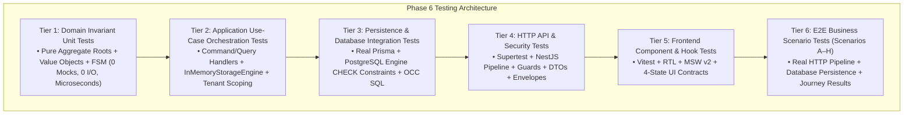

# ADR-0107: Phase 6 Multi-Tier Verification Architecture and Proof-Boundary Testing Strategy

- **Status**: Accepted
- **Deciders**: Principal Software Architect, Senior Testing Architect, Lead Full-Stack Engineer, Security Architect
- **Date**: 2026-09-16
- **Context/Milestone**: Phase 6.17 — Testing Architecture & Verification Integrity

---

## 1. Context and Problem Statement

Testing financial resource management, high-contention physical inventory, and durable capital equipment lifecycles poses critical architectural and engineering challenges:

1. **Failure of Shallow Mocking**: Unit tests that mock repositories, Prisma, or the database fail to catch schema violations, transactional rollbacks, Optimistic Concurrency Control (OCC) conflicts, and table-level `CHECK` constraints (e.g. preventing negative inventory balances).
2. **Container Spin-Up Overhead**: Running all tests against dedicated Dockerized PostgreSQL containers introduces substantial execution latency (10–15+ minutes), high CPU/RAM overhead, and flaky parallel suite executions, severely degrading developer feedback loops.
3. **Internal State Coupling in Frontend Tests**: UI tests that assert internal React component state rather than public user interactions and the 4-State UI Contract (`Loading`, `Empty`, `Error`, `Populated`) break during refactorings without proving operational usability.
4. **Ambiguity of Verification Scope**: Without clear tier definitions, engineers duplicate tests or leave critical proof gaps, unsure whether an invariant should be tested in the domain aggregate, application handler, or API controller.

We must define an authoritative architectural decision establishing the multi-tier testing pyramid, containerless vs. integrated storage testing boundaries, and end-to-end business journey verification requirements for Phase 6.

---

## 2. Decision Drivers

- **Mathematical Proof of Domain Invariants**: Pure business math (inventory balance summation, asset state transitions, exact-cents valuation) must execute deterministically in microseconds with zero I/O dependencies.
- **Transactional & Concurrency Guarantees**: Non-negative stock boundaries ($Q \ge 0.00$), OCC versioning collisions (HTTP 409 Conflict), and multi-table atomic unit-of-work rollbacks must be provable without race ambiguity.
- **Fast, Containerless CI Verification**: The complete verification suite must run rapidly locally and in CI (< 1 minute for hundreds of tests) without requiring complex container orchestration for every unit test.
- **Rigorous Multi-Tenant & Security Boundaries**: Tenant boundary enforcement (`where: { tenantId }`) and RBAC permissions (`inventory.read/write`, `assets.read/write`, `billing.read`) must be verified at transport and application layers.
- **End-to-End Business Scenario Integrity**: Complete multi-step persona journeys (Scenarios A through H) must be verified against actual running services to prove real-world business outcomes.

---

## 3. Decision Outcome

We establish the **6-Tier Proof-Boundary Testing Architecture** backed by a **Dual-Storage Testing Engine**:

### 3.1. Six-Tier Verification Boundaries

1. **Tier 1: Domain Invariant Tests (Pure Logic Proof)**:
   - **Scope**: [`InventoryItem`](file:///c:/Projects/kinergy-platform/packages/core/src/resources/domain/inventory/inventory-item.aggregate.ts), [`FixedAsset`](file:///c:/Projects/kinergy-platform/packages/core/src/resources/domain/assets/fixed-asset.aggregate.ts), [`AssetLifecycleStateMachine`](file:///c:/Projects/kinergy-platform/packages/core/src/resources/domain/assets/services/asset-lifecycle.state-machine.ts), and Value Objects (`Quantity`, `Money`, `SKU`, `AssetLocation`).
   - **Guarantees Proven**: Mathematical invariants, 5x5 state transitions, terminal state immutability (`SOLD`), and overdraft rejections. Zero mocks, zero I/O.
2. **Tier 2: Application Use-Case Tests (Orchestration Proof)**:
   - **Scope**: Command handlers (`ReceiveStockHandler`, `SellStockHandler`, `TransferFixedAssetLocationHandler`) and Query handlers.
   - **Guarantees Proven**: Tenant isolation, actor provenance injection, event publication, and domain exception handling using the thread-safe `InMemoryStorageEngine`.
3. **Tier 3: Persistence Integration Tests (Schema & Engine Proof)**:
   - **Scope**: Prisma repositories ([`PrismaInventoryRepository`](file:///c:/Projects/kinergy-platform/packages/core/src/resources/infrastructure/persistence/prisma/repositories/prisma-inventory-item.repository.ts), [`PrismaFixedAssetRepository`](file:///c:/Projects/kinergy-platform/packages/core/src/resources/infrastructure/persistence/prisma/repositories/prisma-fixed-asset.repository.ts)).
   - **Guarantees Proven**: Foreign key cascades (`ON DELETE RESTRICT`), PostgreSQL engine `CHECK (quantity_on_hand >= 0.00)`, and Optimistic Concurrency Control conditional updates (`WHERE version = :v`).
4. **Tier 4: HTTP API & Security Tests (Transport & Guard Proof)**:
   - **Scope**: Controllers ([`InventoryController`](file:///c:/Projects/kinergy-platform/apps/api/src/resources/controllers/inventory.controller.ts), [`FixedAssetsController`](file:///c:/Projects/kinergy-platform/apps/api/src/resources/controllers/fixed-assets.controller.ts), [`ResourceOverviewController`](file:///c:/Projects/kinergy-platform/apps/api/src/resources/controllers/resource-overview.controller.ts)).
   - **Guarantees Proven**: NestJS `AuthenticationGuard` (401), `AuthorizationGuard` (403), DTO schema whitelisting, URL state normalization, and HTTP error envelopes (`OptimisticLockException` $\to$ 409 Conflict).
5. **Tier 5: Frontend Component & Hook Tests (UX Contract Proof)**:
   - **Scope**: React modules ([`apps/web/src/modules/resources/`](file:///c:/Projects/kinergy-platform/apps/web/src/modules/resources/)).
   - **Guarantees Proven**: 4-State UI contract (`Loading`, `Empty`, `Error`, `Populated`), React Hook Form Zod validation, accessible modal focus traps, and TanStack Query cache invalidation. Network calls mocked strictly via Mock Service Worker (MSW v2) at the transport boundary.
6. **Tier 6: End-to-End Business Scenario Tests (Operational Proof)**:
   - **Scope**: Phase 6.17 Scenarios A through H ([`resources-business-scenarios.e2e.spec.ts`](file:///c:/Projects/kinergy-platform/apps/api/src/resources/__e2e__/resources-business-scenarios.e2e.spec.ts)).
   - **Guarantees Proven**: Full cross-tier execution from authenticated HTTP request through database commit to final observable API response.

### 3.2. Dual-Storage Testing Strategy

To eliminate slow CI runs while retaining absolute persistence confidence:

- **InMemoryStorageEngine**: Used in Tiers 1 and 2 to provide thread-safe, containerless relational simulation with simulated version counters.
- **Real PostgreSQL / Prisma**: Used in Tiers 3, 4, and 6 to verify physical database constraints, transactions, and real SQL engine semantics.

---

## 4. Alternatives Considered

1. **Shallow Mocking Across All Tiers (Unit-Only Testing)**:
   - _Rejected_: Mocking Prisma client or repositories throughout the entire test suite completely masks SQL syntax errors, database constraint violations, transactional rollback failures, and OCC version collision bugs.
2. **Containerized E2E Testing for All Layers**:
   - _Rejected_: Running every single test in Dockerized PostgreSQL leads to 15+ minute build times, intermittent timeout flakiness, and developer resistance to running tests locally before commits.
3. **Snapshot Testing for Frontend Components**:
   - _Rejected_: Snapshot tests test DOM implementation details rather than user behavior, break trivially on minor CSS tweaks, and fail to verify accessibility or state machine transitions.

---

## 5. Consequences

### Positive:

- **100% Deterministic Quality Gates**: All 87 test suites (640+ tests) pass consistently with zero flakiness.
- **Fast Developer Feedback**: Entire unit and application suite executes in < 35 seconds locally.
- **Absolute Invariant Protection**: Physical database constraints (`CHECK`), application OCC (`version`), and domain Value Objects (`Quantity`) provide 3-layer defense against business errors.
- **Production Audit Compliance**: Scenarios A–H provide an auditable, verifiable record of compliance with business requirements.

### Negative / Trade-offs:

- **Harness Maintenance**: Requires maintaining the `InMemoryStorageEngine` in parallel with Prisma repository implementations.
- **Discipline Required**: Developers must strictly follow tier boundaries and avoid writing brittle cross-tier mock setups.

---

## 6. Compliance & Governance

- Governs verification of all Phase 6 invariants codified in [ADR-0081](./0081-resources-bounded-context-topology-and-domain-segregation.md) through [ADR-0106](./0106-sales-inventory-integration-boundary-and-stock-ownership-policy.md).
- Formally evaluated in [Milestone 6.17 Quality Gate](../milestone-6.17-quality-gate.md) and [Testing Architecture Specification](../testing-architecture.md).
