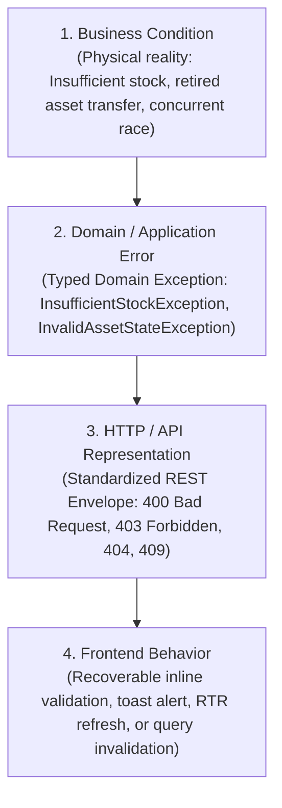

# Resources Management — API Error & Failure Documentation

- **Status**: Authoritative Failure Contract Baseline (APPROVED & ACTIVE)
- **Bounded Context**: Resources Management (`packages/core/src/resources/`, `apps/api/src/resources/`)
- **Author**: Principal Systems Architect & Lead Reliability Engineer
- **Governing ADRs**:
  - [ADR-0081: Resources Bounded Context Topology & Domain Segregation](./adr/0081-resources-bounded-context-topology-and-domain-segregation.md)
  - [ADR-0091: Resources Persistence Architecture & Atomic Ledger Isolation](./adr/0091-resources-persistence-architecture-postgresql-constraints-and-atomic-ledger-isolation.md)
  - [ADR-0094: Resources Authorization & Permission Taxonomy Model](./adr/0094-resources-authorization-and-permission-taxonomy-model.md)
  - [ADR-0099: Explicit Sub-Resource State Mutation Endpoints vs. Generic PATCH](./adr/0099-explicit-subresource-state-mutation-endpoints-vs-generic-patch.md)

---

## 1. Executive Summary & Failure Model Architecture

In a distributed multi-tenant healthcare, gym, and wellness platform, failures are inevitable. A robust system distinguishes between **expected business failures** (e.g. running out of stock, attempting to transfer a retired machine, concurrent checkout races) and **system defects** (e.g. unhandled exceptions, database deadlocks).

All business failures in Phase 6 follow a strict, predictable four-tier representation pipeline:



### Architectural Guarantees

1. **Zero Stack Trace Leaks**: No internal database queries, file paths, or framework stack traces are ever exposed in production API responses.
2. **Deterministic Envelopes**: All failures serialize into the standardized Kinergy error envelope formatted by `GlobalExceptionFilter`.
3. **Atomic Rollback**: Every failed mutation rolls back completely in PostgreSQL (`$transaction`), guaranteeing zero balance drift and zero orphaned ledger rows.

---

## 2. Standard Platform Error Response Envelope

All API failure responses adhere to the unified platform envelope:

```json
{
  "statusCode": 400,
  "timestamp": "2026-09-16T11:00:00.000Z",
  "path": "/api/v1/resources/inventory/c1f7a01a-86c4-4d8e-9d21-4f114631aa01/sell",
  "error": {
    "statusCode": 400,
    "message": "Insufficient stock for item with SKU 'SUP-TAPE-001'. Current stock is 2.00, but requested reduction is 5.00. Invariant [INV-INV-2] violated.",
    "error": "Bad Request"
  }
}
```

---

## 3. Comprehensive Failure Taxonomy & Mapping Matrix

---

### 3.1 Insufficient Stock

- **Business Condition**: A staff member or therapist attempts to record a retail counter sale (`POST :id/sell`), clinical treatment usage (`POST :id/consume`), disposal write-off (`POST :id/scrap`), or negative audit adjustment (`POST :id/adjust`) for an amount exceeding available physical stock on hand ($\Delta Q > \text{quantityOnHand}$).
- **Domain / Application Error**:
  - `InventoryItem` aggregate root validates quantity and throws:
    [`InsufficientStockException`](file:///c:/Projects/kinergy-platform/packages/core/src/resources/domain/inventory/exceptions/insufficient-stock.exception.ts):
    `"Insufficient stock for item with SKU 'SUP-TAPE-001'. Current stock is 2.00, but requested reduction is 5.00. Invariant [INV-INV-2] violated."`
- **HTTP / API Representation**:
  - **Status Code**: `400 Bad Request`
  - **Response Payload**:
    ```json
    {
      "statusCode": 400,
      "timestamp": "2026-09-16T11:05:00.000Z",
      "path": "/api/v1/resources/inventory/c1f7a01a-86c4-4d8e-9d21-4f114631aa01/sell",
      "error": {
        "statusCode": 400,
        "message": "Insufficient stock for item with SKU 'SUP-TAPE-001'. Current stock is 2.00, but requested reduction is 5.00. Invariant [INV-INV-2] violated.",
        "error": "Bad Request"
      }
    }
    ```
- **Frontend Behavior**:
  - **Classification**: Recoverable input error.
  - **UI Interaction**:
    - Dialog / form modal remains open.
    - Inline field validation renders under the quantity input: `"Quantity exceeds current stock on hand (2 available)"`.
    - Dispatches toast notification: `toast.error("Insufficient Stock: Only 2 units available")`.
    - User adjusts quantity or cancels without losing form state.

---

### 3.2 Invalid Movement / Inactive Catalog Mutation

- **Business Condition**: An operator attempts to record physical inventory movements (`receive`, `sell`, `consume`, `scrap`, `adjust`) against an item whose catalog status is `INACTIVE` or `ARCHIVED`.
- **Domain / Application Error**:
  - `InventoryItem.assertActiveCatalogStatus()` evaluates catalog state and throws:
    [`InvalidInventoryItemStateException`](file:///c:/Projects/kinergy-platform/packages/core/src/resources/domain/inventory/exceptions/invalid-inventory-item-state.exception.ts):
    `"Cannot sell stock on an inactive or archived inventory item."`
- **HTTP / API Representation**:
  - **Status Code**: `400 Bad Request`
  - **Response Payload**:
    ```json
    {
      "statusCode": 400,
      "timestamp": "2026-09-16T11:06:00.000Z",
      "path": "/api/v1/resources/inventory/c1f7a01a-86c4-4d8e-9d21-4f114631aa01/sell",
      "error": {
        "statusCode": 400,
        "message": "Cannot sell stock on an inactive or archived inventory item.",
        "error": "Bad Request"
      }
    }
    ```
- **Frontend Behavior**:
  - **Classification**: Recoverable action failure.
  - **UI Interaction**:
    - Renders `<Alert variant="destructive">` indicating product catalog suspension.
    - Action buttons (`Sell`, `Consume`, `Receive`) are disabled.
    - Suggests reactivating the item via `POST :id/activate` if the user holds `inventory.write` privileges.

---

### 3.3 Archive With Positive Stock Violation

- **Business Condition**: A manager attempts to archive a product catalog item (`POST :id/archive`) while physical units still remain in the facility ($\text{quantityOnHand} > 0$).
- **Domain / Application Error**:
  - `InventoryItem.archive()` verifies zero stock balance and throws:
    [`InvalidInventoryItemStateException`](file:///c:/Projects/kinergy-platform/packages/core/src/resources/domain/inventory/exceptions/invalid-inventory-item-state.exception.ts):
    `"Cannot archive an inventory item with remaining stock on hand. Stock must be zero."`
- **HTTP / API Representation**:
  - **Status Code**: `400 Bad Request`
  - **Response Payload**:
    ```json
    {
      "statusCode": 400,
      "timestamp": "2026-09-16T11:07:00.000Z",
      "path": "/api/v1/resources/inventory/c1f7a01a-86c4-4d8e-9d21-4f114631aa01/archive",
      "error": {
        "statusCode": 400,
        "message": "Cannot archive an inventory item with remaining stock on hand. Stock must be zero.",
        "error": "Bad Request"
      }
    }
    ```
- **Frontend Behavior**:
  - **Classification**: Recoverable action failure.
  - **UI Interaction**:
    - Archive confirmation dialog displays warning banner: `"Item currently holds 14 units on hand. You must deplete, transfer, or scrap all inventory before archiving."`
    - Archive button remains disabled until stock reaches zero.

---

### 3.4 Invalid Fixed Asset Lifecycle Transition

- **Business Condition**: An operator attempts an illegal transition on the authoritative 5x5 state machine (e.g. attempting to re-commission a `RETIRED` asset back to `ACTIVE`, self-transitioning `ACTIVE` $\rightarrow$ `ACTIVE`, or attempting any mutation on a `SOLD` asset).
- **Domain / Application Error**:
  - [`AssetLifecycleStateMachine.assertTransitionValid()`](file:///c:/Projects/kinergy-platform/packages/core/src/resources/domain/assets/services/asset-lifecycle.state-machine.ts) throws:
    [`InvalidAssetStateException`](file:///c:/Projects/kinergy-platform/packages/core/src/resources/domain/assets/exceptions/invalid-asset-state.exception.ts):
    - On `RETIRED`: `"Invalid status transition: Asset is RETIRED and cannot transition back to 'ACTIVE'. Decommissioned assets can only be liquidated via sale (SOLD)."`
    - On `SOLD`: `"Invalid status transition: Asset has been permanently SOLD and is in an irreversible terminal state. Cannot transition from 'SOLD' to 'ACTIVE'. [AST-INV-1]"`
- **HTTP / API Representation**:
  - **Status Code**: `400 Bad Request`
  - **Response Payload**:
    ```json
    {
      "statusCode": 400,
      "timestamp": "2026-09-16T11:08:00.000Z",
      "path": "/api/v1/resources/assets/a9e2c11b-55d3-4f8e-8a12-7f339184cb02/status",
      "error": {
        "statusCode": 400,
        "message": "Invalid status transition: Asset is RETIRED and cannot transition back to 'ACTIVE'. Decommissioned assets can only be liquidated via sale (SOLD).",
        "error": "Bad Request"
      }
    }
    ```
- **Frontend Behavior**:
  - **Classification**: Recoverable validation error.
  - **UI Interaction**:
    - Status transition dialog renders an inline error alert explaining the accounting restriction.
    - Status selection dropdown dynamically filters out forbidden destination states based on `getAllowedTransitions()`.
    - Dispatches `toast.error("Illegal Status Transition: Retired assets cannot return to active service")`.

---

### 3.5 Serviceability Guard Failure (`OUT_OF_SERVICE` $\rightarrow$ `ACTIVE`)

- **Business Condition**: An operator attempts to force an asset's status to `ACTIVE` (`POST :id/status`) while its physical condition remains rated `OUT_OF_SERVICE`.
- **Domain / Application Error**:
  - `FixedAsset.changeStatus()` enforces safety guard `[AST-INV-9]`, throwing:
    [`InvalidAssetStateException`](file:///c:/Projects/kinergy-platform/packages/core/src/resources/domain/assets/exceptions/invalid-asset-state.exception.ts):
    `"Cannot restore fixed asset 'AST-KNE-001' to ACTIVE while condition is 'OUT_OF_SERVICE'. Perform repairs and update condition first."`
- **HTTP / API Representation**:
  - **Status Code**: `400 Bad Request`
  - **Response Payload**:
    ```json
    {
      "statusCode": 400,
      "timestamp": "2026-09-16T11:09:00.000Z",
      "path": "/api/v1/resources/assets/a9e2c11b-55d3-4f8e-8a12-7f339184cb02/status",
      "error": {
        "statusCode": 400,
        "message": "Cannot restore fixed asset 'AST-KNE-001' to ACTIVE while condition is 'OUT_OF_SERVICE'. Perform repairs and update condition first.",
        "error": "Bad Request"
      }
    }
    ```
- **Frontend Behavior**:
  - **Classification**: Recoverable workflow error.
  - **UI Interaction**:
    - Displays modal banner: `"Safety Hazard: Equipment is marked OUT_OF_SERVICE. Log maintenance servicing work order and update condition before activating."`
    - Provides a direct link button: `"Log Maintenance Work Order"`.

---

### 3.6 Invalid Fixed Asset Location Transfer

- **Business Condition**: An operator attempts to relocate an asset that has been `RETIRED` or `SOLD` (`POST :id/transfer`), or omits the mandatory `facilityId`.
- **Domain / Application Error**:
  - `FixedAsset.transferLocation()` enforces `assertNotRetired` and `assertNotSold`, throwing:
    [`InvalidAssetStateException`](file:///c:/Projects/kinergy-platform/packages/core/src/resources/domain/assets/exceptions/invalid-asset-state.exception.ts):
    `"Cannot transfer decommissioned fixed asset 'AST-GYM-001' in state 'RETIRED'. [AST-INV-2]"`
- **HTTP / API Representation**:
  - **Status Code**: `400 Bad Request`
  - **Response Payload**:
    ```json
    {
      "statusCode": 400,
      "timestamp": "2026-09-16T11:10:00.000Z",
      "path": "/api/v1/resources/assets/a9e2c11b-55d3-4f8e-8a12-7f339184cb02/transfer",
      "error": {
        "statusCode": 400,
        "message": "Cannot transfer decommissioned fixed asset 'AST-GYM-001' in state 'RETIRED'. [AST-INV-2]",
        "error": "Bad Request"
      }
    }
    ```
- **Frontend Behavior**:
  - **Classification**: Recoverable action failure.
  - **UI Interaction**:
    - Transfer dialog closes and triggers `toast.error("Transfer Prohibited: Decommissioned assets are locked in surplus holding")`.
    - Relocation action button is permanently hidden for retired/sold assets on the asset detail view.

---

### 3.7 Unauthorized Mutation (Missing or Expired Token)

- **Business Condition**: A client sends an API request with an expired JWT token, missing `Authorization` header, or invalid cryptographic signature.
- **Domain / Application Error**:
  - Intercepted by [`AuthenticationGuard`](file:///c:/Projects/kinergy-platform/apps/api/src/platform/identity/guards/authentication.guard.ts), throwing:
    `InvalidTokenException` / `UnauthorizedException`.
- **HTTP / API Representation**:
  - **Status Code**: `401 Unauthorized`
  - **Response Payload**:
    ```json
    {
      "statusCode": 401,
      "timestamp": "2026-09-16T11:11:00.000Z",
      "path": "/api/v1/resources/inventory",
      "error": {
        "statusCode": 401,
        "message": "Invalid or expired token.",
        "error": "Unauthorized"
      }
    }
    ```
- **Frontend Behavior**:
  - **Classification**: Recoverable via background token refresh.
  - **UI Interaction**:
    - Axios/Fetch HTTP interceptor catches the `401` response.
    - Pauses pending mutations and executes the Refresh Token Rotation (RTR) flow (`POST /api/v1/auth/refresh`).
    - If refresh succeeds: Re-plays the original request transparently; user experiences zero interruption.
    - If refresh fails (or token reuse alert detected): Flushes auth cache, displays `toast.error("Session expired. Please log in again.")`, and redirects user to `/login?returnUrl=...`.

---

### 3.8 Forbidden Mutation (Insufficient Privileges)

- **Business Condition**: An authenticated user (e.g. `TRAINER` or `RECEPTIONIST`) attempts an action restricted to `ADMIN` (e.g. `POST /api/v1/resources/assets`, `POST :id/archive`, or accessing sensitive financial valuation without `billing.read`).
- **Domain / Application Error**:
  - Intercepted by [`AuthorizationGuard`](file:///c:/Projects/kinergy-platform/apps/api/src/platform/identity/authorization/authorization.guard.ts), throwing:
    `ForbiddenException`.
- **HTTP / API Representation**:
  - **Status Code**: `403 Forbidden`
  - **Response Payload**:
    ```json
    {
      "statusCode": 403,
      "timestamp": "2026-09-16T11:12:00.000Z",
      "path": "/api/v1/resources/inventory/valuation",
      "error": {
        "statusCode": 403,
        "message": "Forbidden: Requires inventory.read AND billing.read permissions.",
        "error": "Forbidden"
      }
    }
    ```
- **Frontend Behavior**:
  - **Classification**: Flow-terminating for that feature.
  - **UI Interaction**:
    - In page views: Renders `<ForbiddenState title="Access Restricted" message="Viewing valuation totals requires billing.read permission." />`.
    - In action buttons: Mutation buttons requiring write permissions are disabled or hidden based on user permissions context.
    - If bypassed: Displays `toast.error("Access Denied: You do not have permission to perform this operation")`.

---

### 3.9 Validation Failure (DTO Schema Breach)

- **Business Condition**: Client submits a request with missing required fields, a negative cost, an alphanumeric SKU violating regex `^[A-Z0-9_-]{3,50}$`, or a reason string $< 3$ characters.
- **Domain / Application Error**:
  - Intercepted by NestJS `ValidationPipe` with `class-validator` before handler execution, throwing:
    `BadRequestException`.
- **HTTP / API Representation**:
  - **Status Code**: `400 Bad Request`
  - **Response Payload**:
    ```json
    {
      "statusCode": 400,
      "timestamp": "2026-09-16T11:13:00.000Z",
      "path": "/api/v1/resources/inventory",
      "error": {
        "statusCode": 400,
        "message": [
          "sku must match /^[A-Z0-9_-]{3,50}$/ regular expression",
          "unitCost must not be less than 0"
        ],
        "error": "Bad Request"
      }
    }
    ```
- **Frontend Behavior**:
  - **Classification**: Recoverable form input error.
  - **UI Interaction**:
    - React Hook Form maps validation messages to the corresponding form controls.
    - Fields highlight with red border and display helper text: `<FieldError message="SKU must be 3-50 alphanumeric characters (e.g. SUP-TAPE-001)" />`.
    - Focuses the first invalid field automatically; form state is preserved.

---

### 3.10 Missing Resource (Entity Not Found)

- **Business Condition**: Client submits a query or mutation with a UUID that does not exist in the database or belongs to a different tenant partition.
- **Domain / Application Error**:
  - Repository lookup returns `null`, handler returns `ApplicationResult.fail("Fixed asset with ID '...' was not found.")`, controller throws:
    `NotFoundException`.
- **HTTP / API Representation**:
  - **Status Code**: `404 Not Found`
  - **Response Payload**:
    ```json
    {
      "statusCode": 404,
      "timestamp": "2026-09-16T11:14:00.000Z",
      "path": "/api/v1/resources/assets/00000000-0000-0000-0000-000000000000",
      "error": {
        "statusCode": 404,
        "message": "Fixed asset with ID '00000000-0000-0000-0000-000000000000' was not found.",
        "error": "Not Found"
      }
    }
    ```
- **Frontend Behavior**:
  - **Classification**: Flow-terminating for detail views; recoverable in scanners.
  - **UI Interaction**:
    - In route views: Renders `<NotFoundView title="Asset Not Found" message="The requested asset could not be found." backUrl="/resources/assets" />`.
    - In barcode/RFID scanner inputs: Plays error alert tone and displays scanner toast: `toast.error("Asset Tag 'AST-999' not recognized in facility registry")`.

---

### 3.11 Optimistic Concurrency Control (OCC) Collision

- **Business Condition**: Two staff members or automated processes concurrently mutate the same inventory item balance or asset record. The second update arrives with a stale `version`.
- **Domain / Application Error**:
  - Repository atomic update (`WHERE id = :id AND version = :priorVersion`) matches 0 rows, throwing:
    [`OptimisticLockException`](file:///c:/Projects/kinergy-platform/packages/core/src/resources/domain/inventory/exceptions/optimistic-lock.exception.ts):
    `"Optimistic lock conflict on InventoryItem [c1f7a01a...]: expected version 3, but entity was modified concurrently."`
- **HTTP / API Representation**:
  - **Status Code**: `409 Conflict` (or `400 Bad Request` with OCC message).
  - **Response Payload**:
    ```json
    {
      "statusCode": 409,
      "timestamp": "2026-09-16T11:15:00.000Z",
      "path": "/api/v1/resources/inventory/c1f7a01a-86c4-4d8e-9d21-4f114631aa01/sell",
      "error": {
        "statusCode": 409,
        "message": "Optimistic lock conflict on InventoryItem [c1f7a01a...]: expected version 3, but entity was modified concurrently.",
        "error": "Conflict"
      }
    }
    ```
- **Frontend Behavior**:
  - **Classification**: Recoverable background race.
  - **UI Interaction**:
    - Dispatches non-blocking toast: `toast.warning("Concurrent update detected: Data was updated by another user. Reloading latest balances...")`.
    - Triggers automatic TanStack Query cache invalidation (`queryClient.invalidateQueries(['resources', 'inventory', itemId])`).
    - Re-fetches the latest balance and prompts user to confirm the mutation against fresh data.
