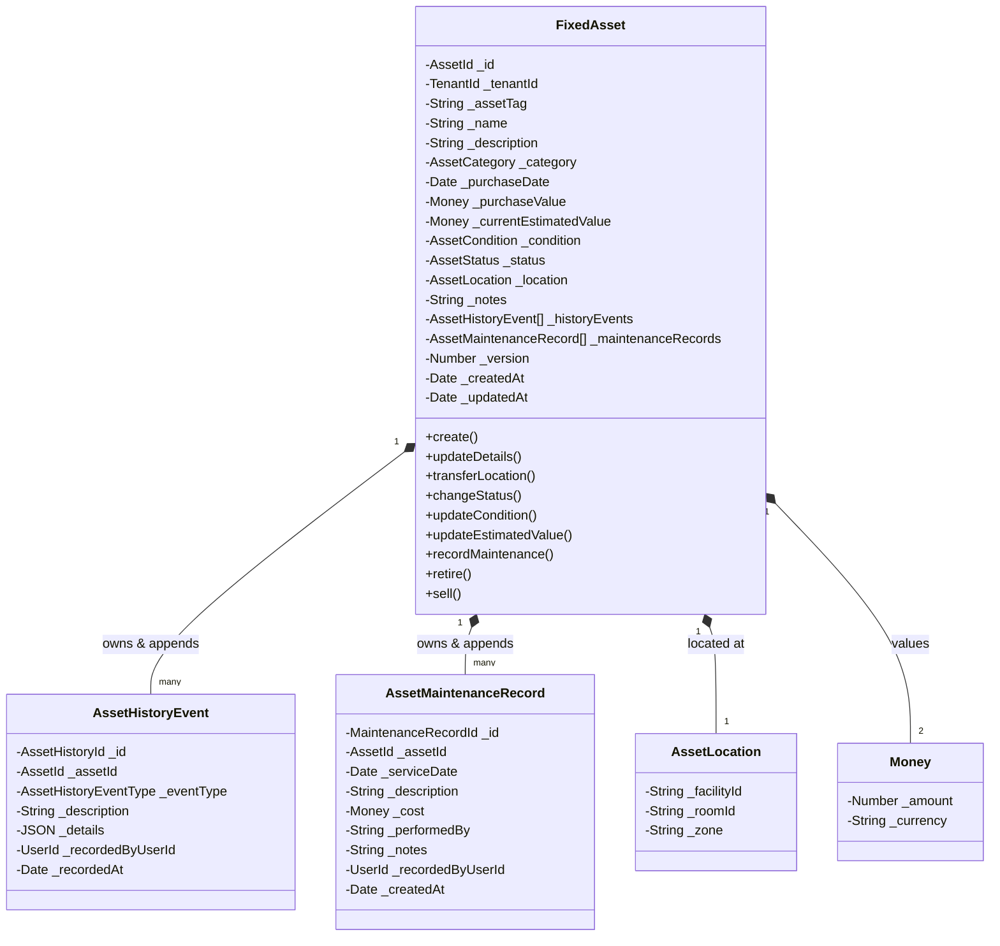
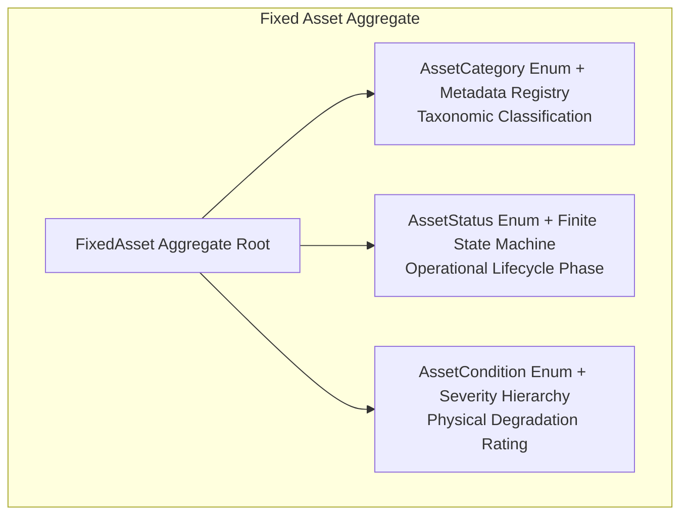
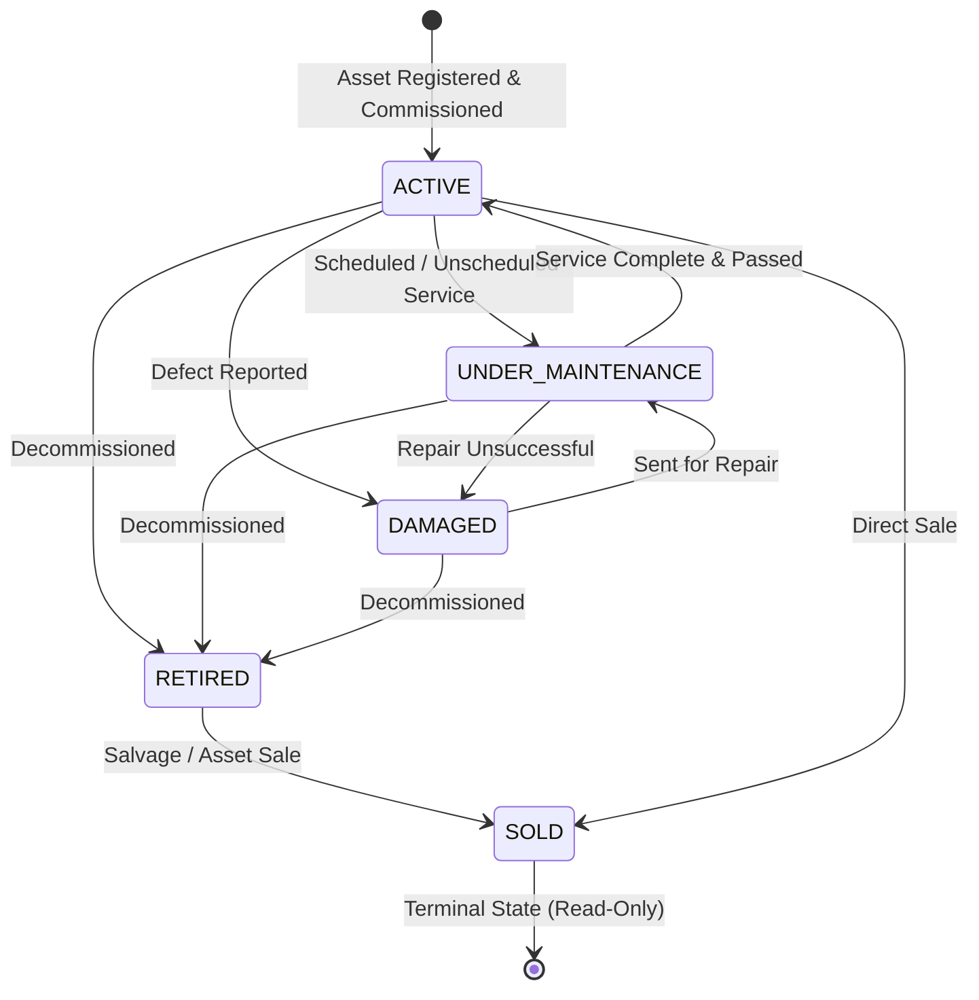

# Fixed Asset Domain Model & Lifecycle Specification (Milestone 6.2)

**Status**: Approved Specification  
**Bounded Context**: `resources` (Subdomain: `fixed-assets`)  
**Deciders**: Principal Domain Architect, Lead Financial Architect, Principal Engineer  
**Date**: 2026-08-25

---

## 1. Purpose

The **Fixed Asset Domain Model** governs non-fungible capital physical equipment, clinical devices, gym machinery, furniture, electronics, and facility apparatus across Kinergy wellness and sports clinics.

Unlike consumable inventory items (which are fungible, tracked in aggregate quantity balances, and depleted through sales or treatment consumption), fixed assets are **individually identified, non-fungible physical units** that possess an operational lifecycle spanning years, incur ongoing maintenance costs, undergo location transfers between rooms and branches, and require accurate balance sheet valuation tracking.

---

## 2. Asset Domain Vocabulary

- **Fixed Asset**: An identifiable physical item of durable capital property owned or operated by Kinergy facilities.
- **Asset Category**: A code-defined classification grouping assets by operational domain (e.g. gym machinery, laser devices).
- **Asset Status**: The primary operational lifecycle state of the asset (`ACTIVE`, `UNDER_MAINTENANCE`, `DAMAGED`, `RETIRED`, `SOLD`).
- **Asset Condition**: The physical health rating of the asset (`EXCELLENT`, `GOOD`, `FAIR`, `NEEDS_REPAIR`, `OUT_OF_SERVICE`).
- **Asset Location**: A value object capturing the current physical placement (facility, branch, room, or zone).
- **Asset History Event**: An immutable, chronological audit entry capturing every meaningful operational transition.
- **Asset Maintenance Record**: An immutable record of servicing, inspection, calibration, or repair performed on the asset.
- **Purchase Value / Acquisition Cost**: The initial gross financial cost paid to acquire the asset.
- **Current Estimated Value / Book Value**: The real-time estimated economic value of the asset.

---

## 3. Fixed Asset Aggregate Root



### 3.1 Aggregate Attributes

| Field Name              | Type / VO        | Multiplicity | Nullable | Business Invariant & Meaning                                       |
| :---------------------- | :--------------- | :----------: | :------: | :----------------------------------------------------------------- |
| `id`                    | `AssetId`        |      1       |    No    | Strongly typed UUID v4 unique aggregate identifier.                |
| `tenantId`              | `TenantId`       |      1       |    No    | Multi-tenant isolation partition boundary.                         |
| `assetTag`              | `String`         |      1       |    No    | Alphanumeric unique barcode/tag identifier (e.g. `AST-GYM-00123`). |
| `name`                  | `String`         |      1       |    No    | Human-readable name (2–120 characters).                            |
| `description`           | `String`         |     0..1     |   Yes    | Optional detailed equipment description ($\le 500$ characters).    |
| `category`              | `AssetCategory`  |      1       |    No    | Closed code-defined classification enum.                           |
| `purchaseDate`          | `Date`           |      1       |    No    | UTC timestamp when asset was acquired.                             |
| `purchaseValue`         | `Money`          |      1       |    No    | Fixed Scale 2 acquisition cost ($\ge 0.00$).                       |
| `currentEstimatedValue` | `Money`          |      1       |    No    | Fixed Scale 2 current valuation ($\ge 0.00$).                      |
| `condition`             | `AssetCondition` |      1       |    No    | Physical rating (`EXCELLENT` through `OUT_OF_SERVICE`).            |
| `status`                | `AssetStatus`    |      1       |    No    | Operational lifecycle state (`ACTIVE` through `SOLD`).             |
| `location`              | `AssetLocation`  |      1       |    No    | Value object representing facility, room, and zone.                |
| `notes`                 | `String`         |     0..1     |   Yes    | General administrative notes.                                      |
| `version`               | `Number`         |      1       |    No    | Integer for Optimistic Concurrency Control (OCC).                  |
| `createdAt`             | `Date`           |      1       |    No    | Immutable UTC creation timestamp.                                  |
| `updatedAt`             | `Date`           |      1       |    No    | Auto-updating UTC modification timestamp.                          |

---

## 4. Classification & State Architectural Strategy

In accordance with **[ADR-0090](./adr/0090-fixed-asset-classification-lifecycle-state-and-condition-rating-strategy.md)**, Fixed Asset attributes are partitioned into three distinct semantic dimensions that are strictly **non-interchangeable**:

1. **Category**: _What the asset is_ (Capital taxonomy for balance-sheet grouping, depreciation schedules, and facility audits).
2. **Status**: _Where the asset is in its operational lifecycle_ (Finite state machine governing domain aggregate mutation permissions).
3. **Condition**: _Physical and functional degradation rating_ (Wear-and-tear score assessed during inspections and maintenance).



### 4.1 Category Strategy

- **Representation**: Code-defined domain enum (`AssetCategory`) coupled with an in-memory descriptor registry (`ASSET_CATEGORY_REGISTRY`).
- **Required Categories**:
  - `GYM_EQUIPMENT`: Heavy machinery, cardio machines, free weights, functional training stations.
  - `THERAPY_EQUIPMENT`: Clinical lasers, ultrasound devices, shockwave therapy units, treatment tables.
  - `KITCHEN_EQUIPMENT`: Commercial blenders, refrigeration, athlete shake bar appliances, ice machines.
  - `OFFICE_FURNITURE`: Desks, consultation chairs, reception counters, filing cabinets.
  - `ELECTRONICS`: POS terminals, sound systems, computers, check-in tablets, network infrastructure.
  - `CLEANING_EQUIPMENT`: Industrial floor scrubbers, sanitization foggers, wet-dry vacuums.
- **Why Code-Defined Enum (No Database CRUD)**: Categories define corporate financial accounting classes and standardized cross-facility performance reporting. Introducing runtime database CRUD introduces relational join overhead, cascade/deletion ambiguities, and breaks reporting consistency.
- **Persistence Mapping**: Native PostgreSQL enum `AssetCategory` with B-tree index `@@index([category])`.

### 4.2 Status Strategy

- **Representation**: Code-defined domain enum (`AssetStatus`) governed by a strict finite state machine.
- **Required Statuses**:
  - `ACTIVE`
  - `UNDER_MAINTENANCE`
  - `DAMAGED`
  - `RETIRED`
  - `SOLD`
- **Capabilities Registry**: `ASSET_STATUS_REGISTRY` provides type-safe capability query helpers (`isOperational`, `isTerminal`, `allowsLocationTransfer`, `allowsMaintenance`, `allowsRevaluation`).
- **Terminal & Invariant Guarantees**:
  - `SOLD` is an absolute terminal state; all mutations are permanently prohibited (`[AST-INV-1]`). Liquidation proceeds equal final estimated book value.
  - `RETIRED` assets cannot undergo physical location transfers (`[AST-INV-2]`) or maintenance servicing.
  - Direct assignment to `SOLD` via `changeStatus` is blocked; liquidation must occur via `asset.sell(saleAmount, actorId, reason)`.
- **Persistence Mapping**: Native PostgreSQL enum `AssetStatus` with B-tree index `@@index([status])`.

### 4.3 Condition Strategy

- **Representation**: Code-defined domain enum (`AssetCondition`) structured as a 5-point severity ranking.
- **Required Conditions**:
  - `EXCELLENT` (Severity Rank: 1 — Best)
  - `GOOD` (Severity Rank: 2)
  - `FAIR` (Severity Rank: 3)
  - `NEEDS_REPAIR` (Severity Rank: 4)
  - `OUT_OF_SERVICE` (Severity Rank: 5 — Worst)
- **Metadata Registry**: `ASSET_CONDITION_REGISTRY` provides severity ranking, serviceability flags (`isServiceable`), and technician intervention indicators (`requiresTechnicianAttention`).
- **Persistence Mapping**: Native PostgreSQL enum `AssetCondition` with B-tree index `@@index([condition])`.

---

## 5. Semantic Definitions

### 5.1 Status Operational Semantics Matrix

| Status                  | Meaning                                                                                        | Allowed Operations                                                                                                                                           | Prohibited Operations                                                                                                                                  | Transition Implications                                                                                                 |
| :---------------------- | :--------------------------------------------------------------------------------------------- | :----------------------------------------------------------------------------------------------------------------------------------------------------------- | :----------------------------------------------------------------------------------------------------------------------------------------------------- | :---------------------------------------------------------------------------------------------------------------------- |
| **`ACTIVE`**            | Fully operational and commissioned for facility, gym, or clinical treatment use.               | `transferLocation`, `updateCondition`, `changeStatus`, `updateEstimatedValue`, `recordMaintenance`, `retire`, `sell`, `updateDetails`.                       | None.                                                                                                                                                  | Normal operational state.                                                                                               |
| **`UNDER_MAINTENANCE`** | Temporarily offline for scheduled servicing, preventive maintenance, calibration, or overhaul. | `transferLocation` (to workshop), `updateCondition`, `recordMaintenance`, `changeStatus`, `updateEstimatedValue`, `retire`, `sell`.                          | Clinical appointment scheduling / member check-in assignment.                                                                                          | Completing maintenance automatically restores status to `ACTIVE` if post-service condition is serviceable.              |
| **`DAMAGED`**           | Impaired due to mechanical malfunction, breakdown, or safety defect pending diagnostic repair. | `transferLocation` (to workshop), `updateCondition`, `recordMaintenance`, `changeStatus` (to `UNDER_MAINTENANCE`), `updateEstimatedValue`, `retire`, `sell`. | Operational use in gym/clinic.                                                                                                                         | Can transition to `UNDER_MAINTENANCE` or directly to `ACTIVE` upon completing maintenance with a serviceable condition. |
| **`RETIRED`**           | Permanently decommissioned from active service due to obsolescence or end of lifecycle.        | `updateEstimatedValue`, `sell` (salvage liquidation), read-only audit.                                                                                       | `transferLocation` (`[AST-INV-2]`), `recordMaintenance`, returning to `ACTIVE` / `UNDER_MAINTENANCE` / `DAMAGED`.                                      | Preserved for historic audit until salvage liquidation.                                                                 |
| **`SOLD`**              | Permanently liquidated or sold for salvage value. Terminal state.                              | Read-only audit inspection.                                                                                                                                  | ALL mutations (`transferLocation`, `changeStatus`, `updateCondition`, `updateEstimatedValue`, `recordMaintenance`, `retire`, `sell`, `updateDetails`). | Irreversible. Final book valuation equals realized liquidation proceeds (`[AST-INV-1]`).                                |

### 5.2 Condition Semantics & Status Orthogonality Matrix

| Condition            | Severity Rank | Serviceable | Meaning                                                                                           | Coexistence Rules with Status                                                     | Maintenance Transition Rule                                                  |
| :------------------- | :-----------: | :---------: | :------------------------------------------------------------------------------------------------ | :-------------------------------------------------------------------------------- | :--------------------------------------------------------------------------- |
| **`EXCELLENT`**      |       1       |     Yes     | Like-new condition with zero mechanical or aesthetic degradation.                                 | Valid in `ACTIVE`, `UNDER_MAINTENANCE`.                                           | Assigned upon initial asset commissioning or comprehensive factory overhaul. |
| **`GOOD`**           |       2       |     Yes     | Normal operational condition with minimal superficial wear and flawless performance.              | Valid in `ACTIVE`, `UNDER_MAINTENANCE`.                                           | Standard operating rating for active equipment.                              |
| **`FAIR`**           |       3       |     Yes     | Noticeable wear or minor cosmetic degradation; fully functional but nearing service interval.     | Valid in `ACTIVE`, `UNDER_MAINTENANCE`.                                           | Serves as early warning indicator for scheduled preventive maintenance.      |
| **`NEEDS_REPAIR`**   |       4       |     No      | Mechanical faults, calibration drift, or component wear requiring prompt technician intervention. | Coexists with `ACTIVE` (with warning), `UNDER_MAINTENANCE`, `DAMAGED`, `RETIRED`. | Triggers dispatch of maintenance order.                                      |
| **`OUT_OF_SERVICE`** |       5       |     No      | Complete breakdown, structural failure, or safety hazard prohibiting any operation.               | Coexists with `DAMAGED`, `UNDER_MAINTENANCE`, `RETIRED`.                          | Prohibits returning asset to `ACTIVE` until repaired.                        |

### 5.3 Independence of Status and Condition

- **Status and Condition are Orthogonal**: Status represents the _governance state_ (e.g. is it commissioned, in the shop, or decommissioned?), whereas Condition represents the _physical wear_ score.
- **Coexistence Examples**:
  - An asset in `ACTIVE` status can be in `FAIR` condition without immediately shutting down the machine.
  - An asset in `UNDER_MAINTENANCE` can be in `FAIR` condition (routine 90-day inspection) or `NEEDS_REPAIR` condition (corrective repair).
  - An asset in `DAMAGED` status typically holds `NEEDS_REPAIR` or `OUT_OF_SERVICE` condition.
- **Explicit Maintenance Transitions**: Condition is **never mutated implicitly or guessed by the system**. When maintenance is performed via `recordMaintenance(...)`, the technician or manager can explicitly provide `updateConditionTo?: AssetCondition`. If omitted, the existing condition is preserved. If the resulting condition is serviceable (`EXCELLENT`, `GOOD`, `FAIR`), an asset under maintenance or damaged is automatically returned to `ACTIVE`.

---

## 7. Location Semantics

Asset physical placement is encapsulated in the **`AssetLocation`** Value Object:

```typescript
export class AssetLocation extends ValueObject<{
  facilityId: string;
  roomId?: string;
  zone?: string;
}> {
  get facilityId(): string;
  get roomId(): string | undefined;
  get zone(): string | undefined;
}
```

- **Immutability**: Location changes require instantiating a new `AssetLocation` and calling `asset.transferLocation(...)`.
- **Cross-Context Reference**: `facilityId` and `roomId` are scalar identifiers referencing facility and room master records without direct ORM coupling.

---

## 8. Monetary Semantics

In accordance with [ADR-0089](./adr/0089-inventory-monetary-quantity-and-unit-precision-semantics.md):

1. **Scale 2 Fixed Precision**: All monetary values (`purchaseValue`, `currentEstimatedValue`, `maintenanceCost`, `saleAmount`) use the `Money` Value Object with Scale 2 fixed decimal precision (`DECIMAL(10, 2)`).
2. **Zero-Float Arithmetic**: Prevents binary floating-point drift.
3. **Non-Negative Constraints**: `purchaseValue >= 0.00` and `currentEstimatedValue >= 0.00`.
4. **Currency Invariant**: All values must share the same ISO-4217 currency (`USD`).

---

## 9. Lifecycle State Machine & Transition Rules



### Transition Governance Rules

1. **Commissioning**: Asset is created in `ACTIVE` status with a valid initial location.
2. **Maintenance Dispatch**: Moving to `UNDER_MAINTENANCE` requires a non-empty reason and stamps history.
3. **Decommissioning**: Retiring an asset blocks scheduling availability and flags for removal.
4. **Terminal Liquidation (`SOLD`)**: Terminal state. Sold assets **cannot** be transferred, repaired, or reactivated.

---

## 10. History Semantics

Meaningful historical events are appended to the immutable `AssetHistoryEvent` log:

```typescript
export enum AssetHistoryEventType {
  CREATED = 'CREATED',
  UPDATED = 'UPDATED',
  TRANSFERRED = 'TRANSFERRED',
  STATUS_CHANGED = 'STATUS_CHANGED',
  CONDITION_CHANGED = 'CONDITION_CHANGED',
  VALUE_UPDATED = 'VALUE_UPDATED',
  MAINTENANCE_RECORDED = 'MAINTENANCE_RECORDED',
  RETIRED = 'RETIRED',
  SOLD = 'SOLD',
}
```

### History Invariants

- **Append-Only Immutability**: Historical events are write-once; updates and deletions are strictly forbidden.
- **Audit Provenance**: Every event captures `recordedByUserId`, UTC `recordedAt`, `description`, and contextual `details` (e.g. prior location $\rightarrow$ new location).

---

## 11. Maintenance Semantics

Maintenance is modeled as an aggregate child entity **`AssetMaintenanceRecord`**:

```typescript
export class AssetMaintenanceRecord {
  readonly id: MaintenanceRecordId;
  readonly assetId: AssetId;
  readonly serviceDate: Date;
  readonly description: string;
  readonly cost: Money;
  readonly performedBy: string;
  readonly notes?: string;
  readonly recordedByUserId: UserId;
  readonly createdAt: Date;
}
```

- **Scope Defense**: Maintenance logs capture service date, cost, technician/vendor, and description. Full work order dispatch and technician scheduling are explicit non-goals.
- **Historical Linkage**: Recording maintenance automatically triggers an `AssetHistoryEventType.MAINTENANCE_RECORDED` event on the parent aggregate.

---

## 12. Business Invariants

| Code             | Invariant Name                       | Enforcing Rule                                                                |
| :--------------- | :----------------------------------- | :---------------------------------------------------------------------------- |
| **[AST-INV-1]**  | **Terminal Sold Immutability**       | Assets in `SOLD` status cannot be transferred, repaired, or updated.          |
| **[AST-INV-2]**  | **Retired Transfer Restriction**     | Assets in `RETIRED` status cannot undergo location transfers.                 |
| **[AST-INV-3]**  | **Audited Location Transfer**        | Every location transfer MUST append an immutable `TRANSFERRED` history event. |
| **[AST-INV-4]**  | **Audited Status Transition**        | Every status transition MUST append a `STATUS_CHANGED` history event.         |
| **[AST-INV-5]**  | **Audited Condition Transition**     | Every condition change MUST append a `CONDITION_CHANGED` history event.       |
| **[AST-INV-6]**  | **Maintenance Audit Linkage**        | Every maintenance record MUST append a `MAINTENANCE_RECORDED` history event.  |
| **[AST-INV-7]**  | **Non-Negative Acquisition Value**   | `purchaseValue.amount >= 0.00`.                                               |
| **[AST-INV-8]**  | **Non-Negative Estimated Valuation** | `currentEstimatedValue.amount >= 0.00`.                                       |
| **[AST-INV-9]**  | **Unique Asset Tag per Tenant**      | `assetTag` must be unique across all active assets within a tenant.           |
| **[AST-INV-10]** | **Optimistic Concurrency Control**   | Aggregate root increments integer `version` upon every mutation.              |

---

## 13. Aggregate Boundaries & Clean Architecture Isolation

```
packages/core/src/resources/
├── domain/
│   ├── inventory/                   <-- Completely Segregated
│   │   └── ...
│   ├── assets/                      <-- Fixed Asset Subdomain
│   │   ├── fixed-asset.aggregate.ts
│   │   ├── asset-history-event.entity.ts
│   │   ├── asset-maintenance-record.entity.ts
│   │   ├── enums/
│   │   │   ├── asset-category.enum.ts
│   │   │   ├── asset-status.enum.ts
│   │   │   ├── asset-condition.enum.ts
│   │   │   └── asset-history-event-type.enum.ts
│   │   ├── value-objects/
│   │   │   ├── asset-id.vo.ts
│   │   │   ├── maintenance-record-id.vo.ts
│   │   │   ├── asset-history-id.vo.ts
│   │   │   └── asset-location.vo.ts
│   │   ├── events/
│   │   │   ├── asset-created.event.ts
│   │   │   ├── asset-transferred.event.ts
│   │   │   ├── asset-status-changed.event.ts
│   │   │   ├── asset-maintenance-recorded.event.ts
│   │   │   └── asset-sold.event.ts
│   │   ├── exceptions/
│   │   │   ├── invalid-asset-state.exception.ts
│   │   │   └── asset-not-found.exception.ts
│   │   └── repositories/
│   │       └── fixed-asset.repository.interface.ts
│   └── shared/                      <-- Shared Value Objects (Money, TenantId, UserId)
```

---

## 14. Persistence Principles

1. **Table Isolation**: Fixed assets are persisted to `fixed_assets`, `asset_history_events`, and `asset_maintenance_records`. No shared tables with inventory.
2. **Transaction Atomicity**: Updating an asset and appending child history/maintenance records executes inside an atomic `prisma.$transaction`.
3. **Database Constraints**: Engine-level `CHECK (purchase_value >= 0)` and `CHECK (current_estimated_value >= 0)`.

---

## 15. Explicit Non-Goals

- ❌ **No CRUD REST Endpoints**: API controllers and routes belong to Phase 6.3.
- ❌ **No Frontend UI**: React screens, DataTables, and forms belong to Phase 6.3.
- ❌ **No CMMS Work Order Dispatch**: Automated technician dispatching and parts inventory allocation are out of scope.
- ❌ **No Generic Resource Model**: Zero class inheritance or polymorphic database tables shared between inventory and assets.

---

## 16. Open Questions & Resolutions

- **Q1: Should assetTag be mandatory or optional?**  
  _Resolution_: Mandatory string (e.g., `AST-00123`). Every physical asset requires an authoritative tag/barcode for audit compliance.
- **Q2: Does changing estimated value trigger a general ledger accounting journal?**  
  _Resolution_: No. Kinergy computes valuations on-demand. Accounting journal posting is handled via downstream financial exports.
