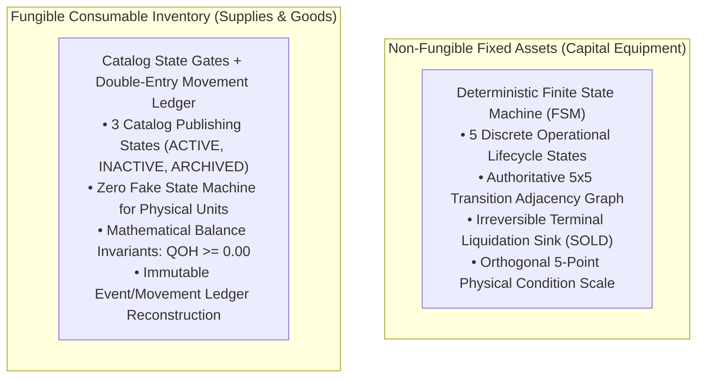
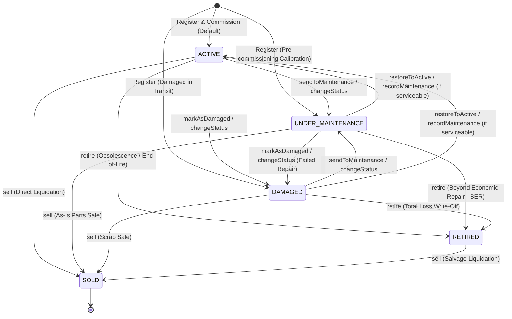
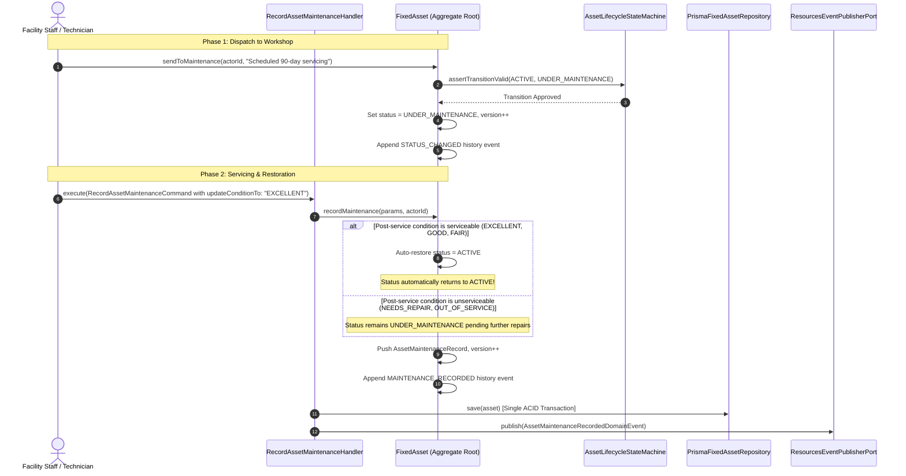

# Phase 6: State Machine & Lifecycle Specification — Consumables & Fixed Assets

- **Status**: Authoritative Behavioral & State Contract Baseline (APPROVED & ACTIVE)
- **Bounded Context**: Resources Management (`packages/core/src/resources/`, `apps/api/src/resources/`)
- **Sub-Domains**: Fixed Assets (FSM Lifecycle) & Consumable Inventory (Catalog State & Ledger Invariants)
- **Governing ADRs**:
  - [ADR-0085: Fixed Asset Operational Lifecycle State Machine & Terminal Disposal Policy](./adr/0085-fixed-asset-operational-lifecycle-state-machine-and-terminal-disposal-policy.md)
  - [ADR-0090: Fixed Asset Classification, Lifecycle State, & Condition Rating Strategy](./adr/0090-fixed-asset-classification-lifecycle-state-and-condition-rating-strategy.md)
  - [ADR-0092: Consumable Inventory Application Orchestration & Atomic Stock Mutation Pattern](./adr/0092-consumable-inventory-application-orchestration-and-atomic-stock-mutation-pattern.md)
  - [ADR-0093: Fixed Asset Application Layer Orchestration & Atomic Lifecycle Mutation Pattern](./adr/0093-fixed-asset-application-layer-orchestration-and-atomic-lifecycle-mutation-pattern.md)
- **Engine Implementations**:
  - [`AssetLifecycleStateMachine`](file:///c:/Projects/kinergy-platform/packages/core/src/resources/domain/assets/services/asset-lifecycle.state-machine.ts)
  - [`FixedAsset`](file:///c:/Projects/kinergy-platform/packages/core/src/resources/domain/assets/fixed-asset.aggregate.ts)
  - [`InventoryItem`](file:///c:/Projects/kinergy-platform/packages/core/src/resources/domain/inventory/inventory-item.aggregate.ts)

---

## 1. Architectural Overview & Conceptual Boundary

Resources Management handles two fundamentally different resource classes that require completely distinct state modeling strategies:



1. **Non-Fungible Fixed Assets**: Individually serialized, high-value capital assets (e.g. Pilates Reformers, Shockwave Therapy units, Commercial Treadmills) governed by an explicit **5x5 Finite State Machine** (`AssetLifecycleStateMachine`), terminal accounting sinks, and an orthogonal 5-level physical condition rating.
2. **Fungible Consumable Inventory**: Interchangeable goods (e.g. massage oils, therapeutic tape, protein supplements) tracked in bulk quantities. They do **not** possess individual lifecycle state machines. Instead, they are governed by **catalog operational gates** and **immutable double-entry stock ledger invariants**.

---

## 2. Fixed Asset Operational Lifecycle State Machine

The operational lifecycle of a capital fixed asset is modeled as a deterministic finite state machine with five discrete states:



### 2.1 Exhaustive Status Inventory & Transition Rules

Every status is governed by explicit domain invariants. Invalid transitions are rejected deterministically with `InvalidAssetStateException`.

#### 1. `ACTIVE`

- **Business Meaning**: Fully operational, commissioned, and available for clinical scheduling, member training, or facility use.
- **Initial Registration**: **Allowed** (default status upon initial asset registration).
- **Valid Outgoing Transitions**:
  - $\rightarrow$ `UNDER_MAINTENANCE`: Asset taken offline for routine servicing, preventive overhaul, or calibration.
  - $\rightarrow$ `DAMAGED`: In-service breakdown, structural fault, or safety incident discovered during operation.
  - $\rightarrow$ `RETIRED`: Decommissioned due to age, technical obsolescence, or facility replacement.
  - $\rightarrow$ `SOLD`: Direct commercial sale or liquidation of operational capital equipment.
- **Explicit Invalid Transitions**:
  - $\rightarrow$ `ACTIVE`: **REJECTED**. Self-transition is an invalid no-op. Throws `InvalidAssetStateException("Invalid status transition: Asset is already in 'ACTIVE' status.")`.
- **Triggering Application Use Cases & Endpoints**:
  - `CreateFixedAssetCommand` $\rightarrow$ `POST /api/v1/resources/assets` (initial creation).
  - `ChangeFixedAssetStatusCommand` (`status: "ACTIVE"`) $\rightarrow$ `POST /api/v1/resources/assets/:id/status`.
  - `RecordAssetMaintenanceCommand` $\rightarrow$ `POST /api/v1/resources/assets/:id/maintenance` (automatic restoration upon completing servicing if condition is serviceable).

#### 2. `UNDER_MAINTENANCE`

- **Business Meaning**: Asset is temporarily removed from service for scheduled servicing, preventive maintenance, calibration, workshop overhaul, or contractor inspection. Excluded from appointment and session scheduling.
- **Initial Registration**: **Allowed** (e.g. newly acquired complex machinery requiring initial assembly, safety certification, or calibration before commissioning).
- **Valid Outgoing Transitions**:
  - $\rightarrow$ `ACTIVE`: Servicing successfully completed. Requires condition $\neq$ `OUT_OF_SERVICE` and $\neq$ `NEEDS_REPAIR`.
  - $\rightarrow$ `DAMAGED`: Diagnostic disassembly reveals irreversible structural breakdown or unrepairable fault.
  - $\rightarrow$ `RETIRED`: Declared Beyond Economic Repair (BER); written off from active maintenance.
  - $\rightarrow$ `SOLD`: Liquidated "as-is" from workshop for salvage or spare parts.
- **Explicit Invalid Transitions**:
  - $\rightarrow$ `UNDER_MAINTENANCE`: **REJECTED**. Self-transition no-op throws `InvalidAssetStateException`.
- **Triggering Application Use Cases & Endpoints**:
  - `CreateFixedAssetCommand` (`status: "UNDER_MAINTENANCE"`) $\rightarrow$ `POST /api/v1/resources/assets`.
  - `ChangeFixedAssetStatusCommand` (`status: "UNDER_MAINTENANCE"`) $\rightarrow$ `POST /api/v1/resources/assets/:id/status`.
  - `FixedAsset.sendToMaintenance(actorId, reason)`.

#### 3. `DAMAGED`

- **Business Meaning**: Impaired due to mechanical breakdown, component defect, or safety hazard pending evaluation. Strictly prohibited from active member or clinical use.
- **Initial Registration**: **Allowed** (e.g. secondhand capital donation or goods delivered damaged in transit for warranty tracking).
- **Valid Outgoing Transitions**:
  - $\rightarrow$ `UNDER_MAINTENANCE`: Dispatched to workshop, internal technician, or third-party vendor for repair.
  - $\rightarrow$ `ACTIVE`: Immediate on-the-spot remediation or clearing of false-alarm diagnostic. Guard: Prohibited if condition is `OUT_OF_SERVICE`.
  - $\rightarrow$ `RETIRED`: Declared a total economic loss; permanently written off.
  - $\rightarrow$ `SOLD`: Liquidated for scrap value.
- **Explicit Invalid Transitions**:
  - $\rightarrow$ `DAMAGED`: **REJECTED**. Self-transition no-op throws `InvalidAssetStateException`.
- **Triggering Application Use Cases & Endpoints**:
  - `CreateFixedAssetCommand` (`status: "DAMAGED"`) $\rightarrow$ `POST /api/v1/resources/assets`.
  - `ChangeFixedAssetStatusCommand` (`status: "DAMAGED"`) $\rightarrow$ `POST /api/v1/resources/assets/:id/status`.
  - `FixedAsset.markAsDamaged(actorId, reason)`.

#### 4. `RETIRED`

- **Business Meaning**: Permanently decommissioned from active service due to end-of-life, wear-out, or technological obsolescence. Depreciation halted. Stored in holding surplus. Location transfers (`[AST-INV-2]`), maintenance servicing (`[AST-INV-4]`), and condition updates (`[AST-INV-8]`) are strictly locked.
- **Initial Registration**: **STRICTLY PROHIBITED**. `assertValidInitialStatus` rejects direct creation as `RETIRED`.
- **Valid Outgoing Transitions**:
  - $\rightarrow$ `SOLD`: Scrap salvage auction or liquidation of decommissioned property.
- **Explicit Invalid Transitions**:
  - $\rightarrow$ `ACTIVE`: **STRICTLY PROHIBITED BY ACCOUNTING STANDARDS**. Decommissioned capital assets cannot be silently un-retired. Re-commissioning requires new aggregate registration referencing the legacy serial/asset tag. Throws `InvalidAssetStateException`.
  - $\rightarrow$ `UNDER_MAINTENANCE`: **STRICTLY PROHIBITED**. Decommissioned assets cannot incur maintenance or servicing expenses.
  - $\rightarrow$ `DAMAGED`: **STRICTLY PROHIBITED**. Retired assets are outside operational tracking.
  - $\rightarrow$ `RETIRED`: **REJECTED**. Self-transition no-op throws `InvalidAssetStateException`.
- **Triggering Application Use Cases & Endpoints**:
  - `ChangeFixedAssetStatusCommand` (`status: "RETIRED"`) $\rightarrow$ `POST /api/v1/resources/assets/:id/status`.
  - `FixedAsset.retire(actorId, reason)` (requires mandatory justification reason $\ge 3$ characters).

#### 5. `SOLD`

- **Business Meaning**: **Absolute Terminal Sink State `[AST-INV-1]`**. Legal and economic ownership permanently transferred outside company boundary upon commercial sale, scrap auction, or salvage realization.
- **Initial Registration**: **STRICTLY PROHIBITED**. `assertValidInitialStatus` rejects direct creation as `SOLD`.
- **Valid Outgoing Transitions**: **NONE ($\emptyset$)**. Once entered, no further state transitions are permitted under any circumstance.
- **Explicit Invalid Transitions**:
  - $\rightarrow$ `ACTIVE`: **STRICTLY PROHIBITED**. Cannot reactivate an asset no longer owned.
  - $\rightarrow$ `UNDER_MAINTENANCE`: **STRICTLY PROHIBITED**. Cannot service sold property.
  - $\rightarrow$ `DAMAGED`: **STRICTLY PROHIBITED**. Cannot modify damage state on sold property.
  - $\rightarrow$ `RETIRED`: **STRICTLY PROHIBITED**. Cannot retire an asset already liquidated.
  - $\rightarrow$ `SOLD`: **REJECTED**. Self-transition no-op throws `InvalidAssetStateException`.
  - **ALL MUTATIONS LOCKED**: `transferLocation()`, `updateCondition()`, `updateEstimatedValue()`, `recordMaintenance()`, `updateDetails()`, and `changeStatus()` unconditionally throw `InvalidAssetStateException("Cannot ... fixed asset in terminal state 'SOLD'. [AST-INV-1]")`.
- **Triggering Application Use Cases & Endpoints**:
  - `FixedAsset.sell(saleAmount, actorId, reason)`. Requires non-negative `Money`, authenticated `actorId`, and justification reason.
  - Note: Direct status change to `SOLD` via `changeStatus("SOLD")` is rejected; sale requires explicit liquidation amount.

---

## 3. Authoritative 5x5 Transition Matrix

The `AssetLifecycleStateMachine` validates every transition against this deterministic 5x5 adjacency matrix:

| Source (`FROM`) \ Target (`TO`) | `ACTIVE` | `UNDER_MAINTENANCE` | `DAMAGED` | `RETIRED` | `SOLD`  |
| :------------------------------ | :------: | :-----------------: | :-------: | :-------: | :-----: |
| **`ACTIVE`**                    |  **NO**  |       **YES**       |  **YES**  |  **YES**  | **YES** |
| **`UNDER_MAINTENANCE`**         | **YES**  |       **NO**        |  **YES**  |  **YES**  | **YES** |
| **`DAMAGED`**                   | **YES**  |       **YES**       |  **NO**   |  **YES**  | **YES** |
| **`RETIRED`**                   |  **NO**  |       **NO**        |  **NO**   |  **NO**   | **YES** |
| **`SOLD` (Terminal Sink)**      |  **NO**  |       **NO**        |  **NO**   |  **NO**   | **NO**  |

### Complete State Pair Evaluation

| Transition Pair                                       | Allowed? | Domain Rationale & Enforcement Mechanism                                                                    |
| :---------------------------------------------------- | :------: | :---------------------------------------------------------------------------------------------------------- |
| `ACTIVE` $\rightarrow$ `ACTIVE`                       |  **NO**  | Self-transition rejected as invalid no-op. Throws `InvalidAssetStateException`.                             |
| `ACTIVE` $\rightarrow$ `UNDER_MAINTENANCE`            | **YES**  | Dispatched for routine servicing or calibration. Emits `AssetStatusChangedDomainEvent`.                     |
| `ACTIVE` $\rightarrow$ `DAMAGED`                      | **YES**  | In-service mechanical failure or safety defect discovered. Emits event.                                     |
| `ACTIVE` $\rightarrow$ `RETIRED`                      | **YES**  | Decommissioned due to age or obsolescence. Halts depreciation; locks transfers.                             |
| `ACTIVE` $\rightarrow$ `SOLD`                         | **YES**  | Direct commercial liquidation. Sets terminal lock `[AST-INV-1]`; emits `AssetSoldDomainEvent`.              |
| `UNDER_MAINTENANCE` $\rightarrow$ `ACTIVE`            | **YES**  | Servicing completed. Guard: Condition must be serviceable ($\neq$ `OUT_OF_SERVICE`, $\neq$ `NEEDS_REPAIR`). |
| `UNDER_MAINTENANCE` $\rightarrow$ `UNDER_MAINTENANCE` |  **NO**  | Self-transition rejected as invalid no-op.                                                                  |
| `UNDER_MAINTENANCE` $\rightarrow$ `DAMAGED`           | **YES**  | Workshop diagnostic reveals structural defect or unrepairable fault.                                        |
| `UNDER_MAINTENANCE` $\rightarrow$ `RETIRED`           | **YES**  | Declared Beyond Economic Repair (BER). Decommissioned from maintenance.                                     |
| `UNDER_MAINTENANCE` $\rightarrow$ `SOLD`              | **YES**  | Sold "as-is" from workshop for spare parts. Sets terminal lock `[AST-INV-1]`.                               |
| `DAMAGED` $\rightarrow$ `ACTIVE`                      | **YES**  | On-the-spot remedy or false alarm cleared. Guard: Blocked if condition is `OUT_OF_SERVICE`.                 |
| `DAMAGED` $\rightarrow$ `UNDER_MAINTENANCE`           | **YES**  | Dispatched to technician or workshop for repairs.                                                           |
| `DAMAGED` $\rightarrow$ `DAMAGED`                     |  **NO**  | Self-transition rejected as invalid no-op.                                                                  |
| `DAMAGED` $\rightarrow$ `RETIRED`                     | **YES**  | Declared a total loss; permanently written off.                                                             |
| `DAMAGED` $\rightarrow$ `SOLD`                        | **YES**  | Liquidated for scrap salvage proceeds. Sets terminal lock `[AST-INV-1]`.                                    |
| `RETIRED` $\rightarrow$ `ACTIVE`                      |  **NO**  | **PROHIBITED BY ACCOUNTING STANDARDS**. Cannot re-commission retired assets.                                |
| `RETIRED` $\rightarrow$ `UNDER_MAINTENANCE`           |  **NO**  | **PROHIBITED**. Decommissioned assets cannot incur maintenance expenses.                                    |
| `RETIRED` $\rightarrow$ `DAMAGED`                     |  **NO**  | **PROHIBITED**. Decommissioned assets are outside operational tracking.                                     |
| `RETIRED` $\rightarrow$ `RETIRED`                     |  **NO**  | Self-transition rejected as invalid no-op.                                                                  |
| `RETIRED` $\rightarrow$ `SOLD`                        | **YES**  | Scrap salvage liquidation of decommissioned property. Sets terminal lock `[AST-INV-1]`.                     |
| `SOLD` $\rightarrow$ Any Status                       |  **NO**  | **ABSOLUTE TERMINAL SINK STATE `[AST-INV-1]`**. Zero mutations or transitions allowed.                      |

---

## 4. Asset Physical Condition Rating Taxonomy & Semantics

The physical condition rating (`AssetCondition`) is an orthogonal dimension measuring physical wear and serviceability.

```
+--------------------------------------------------------------------------------+
|                                 FIXED ASSET                                    |
|                                                                                |
|   +------------------------------------+   +-------------------------------+   |
|   |         ASSET STATUS (FSM)         |   |     ASSET CONDITION RATING    |   |
|   |------------------------------------|   |-------------------------------|   |
|   | ACTIVE                             |   | EXCELLENT (Rank 1)            |   |
|   | UNDER_MAINTENANCE                  |   | GOOD      (Rank 2)            |   |
|   | DAMAGED                            |   | FAIR      (Rank 3)            |   |
|   | RETIRED                            |   | NEEDS_REPAIR   (Rank 4)       |   |
|   | SOLD                               |   | OUT_OF_SERVICE (Rank 5)       |   |
|   +------------------------------------+   +-------------------------------+   |
|                                                                                |
|   INVARIANT COUPLING & SERVICEABILITY GUARDS:                                  |
|   - [AST-INV-9]: OUT_OF_SERVICE condition strictly blocks transition to ACTIVE |
|   - NEEDS_REPAIR does NOT automatically force UNDER_MAINTENANCE status         |
|   - Maintenance auto-restores to ACTIVE only if condition is serviceable       |
+--------------------------------------------------------------------------------+
```

### 4.1 Condition Rating Registry (`ASSET_CONDITION_REGISTRY`)

| Condition Code       | Display Name   | Severity Rank | Serviceable? | Requires Technician? | Operational Semantics & Domain Meaning                                                            |
| :------------------- | :------------- | :-----------: | :----------: | :------------------: | :------------------------------------------------------------------------------------------------ |
| **`EXCELLENT`**      | Excellent      |     **1**     |   **Yes**    |          No          | Like-new or newly commissioned condition with zero mechanical or aesthetic degradation.           |
| **`GOOD`**           | Good           |     **2**     |   **Yes**    |          No          | Normal operational condition with minimal superficial wear and flawless performance.              |
| **`FAIR`**           | Fair           |     **3**     |   **Yes**    |          No          | Noticeable wear or minor cosmetic degradation; fully functional but nearing scheduled servicing.  |
| **`NEEDS_REPAIR`**   | Needs Repair   |     **4**     |    **No**    |       **Yes**        | Mechanical faults, calibration drift, or component wear requiring prompt technician intervention. |
| **`OUT_OF_SERVICE`** | Out of Service |     **5**     |    **No**    |       **Yes**        | Complete breakdown, structural failure, or safety hazard prohibiting any operation.               |

### 4.2 Invariant Coupling Between Status and Condition

1. **Serviceability Guard `[AST-INV-9]`**:
   ```typescript
   if (
     validatedStatus === AssetStatus.ACTIVE &&
     this._condition === AssetCondition.OUT_OF_SERVICE
   ) {
     throw new InvalidAssetStateException(
       `Cannot restore fixed asset '${this._assetTag}' to ACTIVE while condition is 'OUT_OF_SERVICE'. Perform repairs and update condition first.`,
     );
   }
   ```
2. **Non-Coupled Degradation**:
   - Marking an asset as `NEEDS_REPAIR` does **not** silently mutate its status to `UNDER_MAINTENANCE`.
   - The asset remains in `ACTIVE` or its current status until an authorized staff member explicitly executes `sendToMaintenance()` or `ChangeFixedAssetStatusCommand`.
3. **Idempotent Condition Updates**:
   - Calling `updateCondition()` with the asset's current condition is an idempotent no-op (produces no history event and does not increment `version`).

---

## 5. Maintenance Lifecycle (`ACTIVE` $\rightarrow$ `UNDER_MAINTENANCE` $\rightarrow$ `ACTIVE`)

The system implements a deterministic closed-loop maintenance lifecycle:



### 5.1 Exact Automatic Restoration Rule in Code

Inside `FixedAsset.recordMaintenance()`:

```typescript
// 1. Update condition if explicitly provided
if (params.updateConditionTo) {
  this._condition = FixedAsset.validateCondition(params.updateConditionTo);
}

// 2. Automatically return from UNDER_MAINTENANCE or DAMAGED to ACTIVE upon servicing
// completion IF the resulting condition is serviceable (EXCELLENT, GOOD, or FAIR)
if (
  (this._status === AssetStatus.UNDER_MAINTENANCE || this._status === AssetStatus.DAMAGED) &&
  this._condition !== AssetCondition.OUT_OF_SERVICE &&
  this._condition !== AssetCondition.NEEDS_REPAIR
) {
  this._status = AssetStatus.ACTIVE;
}
```

### 5.2 Key Maintenance Scenarios

|   Initial Status    | Initial Condition | `updateConditionTo` |    Resulting Status     | Resulting Condition | Explanation                                                                           |
| :-----------------: | :---------------: | :-----------------: | :---------------------: | :-----------------: | :------------------------------------------------------------------------------------ |
|      `ACTIVE`       |      `GOOD`       |     _(omitted)_     |        `ACTIVE`         |       `GOOD`        | Routine on-site servicing completed; asset remained operational throughout.           |
| `UNDER_MAINTENANCE` |  `NEEDS_REPAIR`   |     `EXCELLENT`     |      **`ACTIVE`**       |     `EXCELLENT`     | Workshop overhaul completed and verified; automatically restored to active service.   |
| `UNDER_MAINTENANCE` | `OUT_OF_SERVICE`  |   `NEEDS_REPAIR`    | **`UNDER_MAINTENANCE`** |   `NEEDS_REPAIR`    | Partial repair completed; parts still awaited. Asset stays offline under maintenance. |
|      `DAMAGED`      | `OUT_OF_SERVICE`  |       `GOOD`        |      **`ACTIVE`**       |       `GOOD`        | Physical defect fully repaired; automatically restored to active service.             |
|      `RETIRED`      |        Any        |         Any         |      **REJECTED**       |          —          | `assertNotRetired` blocks maintenance on decommissioned assets (`[AST-INV-4]`).       |
|       `SOLD`        |        Any        |         Any         |      **REJECTED**       |          —          | `assertNotSold` blocks maintenance on sold assets (`[AST-INV-1]`).                    |

---

## 6. Consumable Inventory State & Non-FSM Stock Invariants

### 6.1 Why Consumable Inventory Has No Lifecycle State Machine

A common architectural anti-pattern is attempting to force individual lifecycle state machines onto fungible consumable supplies.

In Kinergy:

- **Consumables are fungible goods** measured in bulk continuous quantities (e.g. `12.5` liters of disinfectant, `50` rolls of kinesiology tape).
- Individual tape rolls or fluid ounces do **not** have unique identity, warranty terms, serial numbers, or lifecycle stages.
- Modeling inventory units with state machines (e.g. `BOUGHT` $\rightarrow$ `STOCKED` $\rightarrow$ `SOLD`) violates DDD principles by creating phantom aggregate boundaries.

Instead, Consumable Inventory is governed by **two clean, orthogonal mechanisms**:

1. **Catalog Publishing States**: Governs item availability in the catalog.
2. **Double-Entry Stock Ledger Invariants**: Governs physical quantities on hand.

```mermaid
flowchart TD
    subgraph CS["Catalog Publishing States (InventoryItemStatus)"]
        ACTIVE["ACTIVE<br/>• Full mutations allowed<br/>• Browsable in POS / clinic"]
        INACTIVE["INACTIVE<br/>• Mutations blocked<br/>• Hidden from POS / clinic"]
        ARCHIVED["ARCHIVED (Terminal)<br/>• Immutable historical tombstone<br/>• Invariant: Requires QOH == 0.00"]

        ACTIVE <-->|deactivate / activate| INACTIVE
        ACTIVE -->|archive (if QOH == 0)| ARCHIVED
        INACTIVE -->|archive (if QOH == 0)| ARCHIVED
    end

    subgraph SL["Physical Stock Ledger Invariants"]
        QOH["quantityOnHand >= 0.00 [INV-INV-2]<br/>• Strict non-negative balance<br/>• DB CHECK constraint"]
        REV["Immutable Movement Ledger<br/>• Double-entry delta log<br/>• QOH = Sum(deltas)"]
        LOW["Low Stock Guard<br/>• QOH <= minimumStock<br/>• Emits alert domain event"]

        CS -.->|Operational Guard| SL
    end
```

### 6.2 Catalog States (`InventoryItemStatus`)

| Status         | Meaning                                                                                                                 |                 Stock Mutations Allowed?                  |                Catalog Edits Allowed?                | Allowed Transitions                                                       |
| :------------- | :---------------------------------------------------------------------------------------------------------------------- | :-------------------------------------------------------: | :--------------------------------------------------: | :------------------------------------------------------------------------ |
| **`ACTIVE`**   | Live catalog product. Visible to reception POS, inventory ordering, and clinical consumption.                           | **YES** (`receive`, `sell`, `consume`, `scrap`, `adjust`) |                       **YES**                        | $\rightarrow$ `INACTIVE`, $\rightarrow$ `ARCHIVED` (if $\text{QOH} = 0$). |
| **`INACTIVE`** | Temporarily suspended catalog product. Inventory remains physically in warehouse, but operational mutations are halted. |   **NO** (throws `InvalidInventoryItemStateException`)    |                       **YES**                        | $\rightarrow$ `ACTIVE`, $\rightarrow$ `ARCHIVED` (if $\text{QOH} = 0$).   |
| **`ARCHIVED`** | Permanently retired catalog product. Read-only historical tombstone.                                                    |                          **NO**                           | **NO** (throws `InvalidInventoryItemStateException`) | **NONE** (Terminal state).                                                |

#### The Archive Zero-Stock Invariant

An inventory item **cannot be archived while physical stock remains in the warehouse**:

```typescript
public archive(actorId: string, reason?: string): void {
  if (this._status === InventoryItemStatus.ARCHIVED) {
    return;
  }
  if (this._quantityOnHand.isPositive()) {
    throw new InvalidInventoryItemStateException(
      'Cannot archive an inventory item with remaining stock on hand. Stock must be zero.',
    );
  }
  // Transition to ARCHIVED...
}
```

### 6.3 Physical Stock Invariants

1. **Strict Non-Negative Balance `[INV-INV-2]`**:
   $$\text{quantityOnHand} \ge 0.00$$
   - Enforced by `Quantity.of(val)` throwing `InvalidQuantityException`.
   - Enforced by PostgreSQL table constraint: `CHECK (quantity_on_hand >= 0.00)`.
2. **Deterministic Double-Entry Equality**:
   $$\text{quantityOnHand} \equiv \sum_{i=1}^{n} \text{quantityDelta}_i$$
   - Every mutation creates exactly one immutable `StockMovement` entry.
   - Physical stock balance is mathematically reconstructible from inception at all times.
3. **Low Stock Threshold Invariant**:
   $$\text{quantityOnHand} \le \text{minimumStock}$$
   - Includes the **exact equality case** ($\text{QOH} = \text{minimumStock}$).
   - Automatically raises `LowStockThresholdReachedDomainEvent` and surfaces the SKU in `/api/v1/resources/inventory/low-stock`.
4. **Zero Phantom Movements**:
   - Any transaction aborted due to insufficient stock, unauthorized access, or OCC concurrency collision rolls back completely via Prisma `$transaction`.

---

## 7. Traceability Matrix: Use Cases $\rightarrow$ Domain Operations $\rightarrow$ Tests

| Domain Operation / State Event        | Aggregate Method                    | Application Command                 | Public HTTP API Endpoint                            | Verifying Test Suite                                      |
| :------------------------------------ | :---------------------------------- | :---------------------------------- | :-------------------------------------------------- | :-------------------------------------------------------- |
| **Asset Creation**                    | `FixedAsset.create()`               | `CreateFixedAssetCommand`           | `POST /api/v1/resources/assets`                     | `fixed-asset-application-persistence-integration.spec.ts` |
| **Asset Status Transition**           | `FixedAsset.changeStatus()`         | `ChangeFixedAssetStatusCommand`     | `POST /api/v1/resources/assets/:id/status`          | `asset-lifecycle-transition-enforcement.spec.ts`          |
| **Asset Condition Update**            | `FixedAsset.updateCondition()`      | `UpdateFixedAssetConditionCommand`  | `POST /api/v1/resources/assets/:id/condition`       | `asset-business-operations-invariants.spec.ts`            |
| **Asset Location Transfer**           | `FixedAsset.transferLocation()`     | `TransferFixedAssetLocationCommand` | `POST /api/v1/resources/assets/:id/transfer`        | `asset-business-operations-invariants.spec.ts`            |
| **Asset Servicing & Auto-Restore**    | `FixedAsset.recordMaintenance()`    | `RecordAssetMaintenanceCommand`     | `POST /api/v1/resources/assets/:id/maintenance`     | `asset-lifecycle-state-machine.spec.ts`                   |
| **Asset Retirement**                  | `FixedAsset.retire()`               | `ChangeFixedAssetStatusCommand`     | `POST /api/v1/resources/assets/:id/status`          | `asset-lifecycle-transition-enforcement.spec.ts`          |
| **Asset Liquidation (Terminal)**      | `FixedAsset.sell()`                 | Direct Aggregate / Domain Command   | `POST /api/v1/resources/assets/:id/sell` (ADR-0099) | `asset-lifecycle-state-machine.spec.ts`                   |
| **Inventory Catalog Deactivate**      | `InventoryItem.deactivate()`        | `DeactivateInventoryItemCommand`    | `PATCH /api/v1/resources/inventory/:id`             | `inventory-catalog-operations.spec.ts`                    |
| **Inventory Catalog Archive**         | `InventoryItem.archive()`           | `ArchiveInventoryItemCommand`       | `PATCH /api/v1/resources/inventory/:id`             | `inventory-catalog-operations.spec.ts`                    |
| **Stock Receipt (`PURCHASE`)**        | `InventoryItem.receiveStock()`      | `ReceiveStockCommand`               | `POST /api/v1/resources/inventory/:id/receive`      | `inventory-stock-mutation-invariants.spec.ts`             |
| **Stock Sale (`SALE`)**               | `InventoryItem.sellStock()`         | `SellStockCommand`                  | `POST /api/v1/resources/inventory/:id/sell`         | `inventory-stock-mutation-invariants.spec.ts`             |
| **Stock Consumption (`CONSUMPTION`)** | `InventoryItem.consumeStock()`      | `ConsumeStockCommand`               | `POST /api/v1/resources/inventory/:id/consume`      | `inventory-stock-mutation-invariants.spec.ts`             |
| **Stock Adjustment**                  | `InventoryItem.adjustStockIn/Out()` | `AdjustStockIn/OutCommand`          | `POST /api/v1/resources/inventory/:id/adjust`       | `inventory-stock-mutation-invariants.spec.ts`             |
