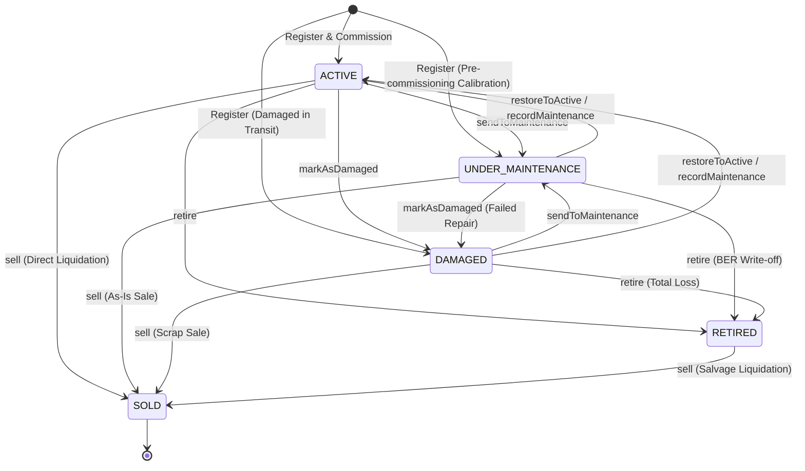

# Fixed Asset Lifecycle State Machine Specification

- **Module**: `packages/core/src/resources/domain/assets`
- **Specification Status**: **APPROVED & ACTIVE**
- **Governing ADRs**: [ADR-0085: Fixed Asset Operational Lifecycle State Machine & Terminal Disposal Policy](./adr/0085-fixed-asset-operational-lifecycle-state-machine-and-terminal-disposal-policy.md), [ADR-0090: Fixed Asset Classification, Lifecycle State, & Condition Rating Strategy](./adr/0090-fixed-asset-classification-lifecycle-state-and-condition-rating-strategy.md)
- **Engine Implementation**: [`AssetLifecycleStateMachine`](file:///c:/Projects/kinergy-platform/packages/core/src/resources/domain/assets/services/asset-lifecycle.state-machine.ts)

---

## 1. Overview & Architectural Principles

The Fixed Asset lifecycle is governed by an explicit, deterministic **Finite State Machine (FSM)**. The lifecycle states govern operational availability, clinical scheduling eligibility, maintenance scheduling, and strict corporate accounting disposal rules.



---

## 2. State Definitions

| Status                  | Meaning                                                                                        | Operational Availability | Allowed Aggregate Mutations                                                                                                                                  | Prohibited Operations                                                                                                                                  |
| :---------------------- | :--------------------------------------------------------------------------------------------- | :----------------------: | :----------------------------------------------------------------------------------------------------------------------------------------------------------- | :----------------------------------------------------------------------------------------------------------------------------------------------------- |
| **`ACTIVE`**            | Fully operational and commissioned for facility, gym, or clinical treatment use.               |         **Yes**          | `transferLocation`, `updateCondition`, `changeStatus`, `updateEstimatedValue`, `recordMaintenance`, `retire`, `sell`, `updateDetails`.                       | None.                                                                                                                                                  |
| **`UNDER_MAINTENANCE`** | Temporarily offline for scheduled servicing, preventive maintenance, calibration, or overhaul. |          **No**          | `transferLocation` (to workshop), `updateCondition`, `recordMaintenance`, `changeStatus`, `updateEstimatedValue`, `retire`, `sell`.                          | Clinical appointment scheduling / member check-in assignment.                                                                                          |
| **`DAMAGED`**           | Impaired due to mechanical malfunction, breakdown, or safety defect pending diagnostic repair. |          **No**          | `transferLocation` (to workshop), `updateCondition`, `recordMaintenance`, `changeStatus` (to `UNDER_MAINTENANCE`), `updateEstimatedValue`, `retire`, `sell`. | Operational use in gym/clinic.                                                                                                                         |
| **`RETIRED`**           | Permanently decommissioned from active service due to obsolescence or end of lifecycle.        |          **No**          | `updateEstimatedValue`, `sell` (salvage liquidation), read-only audit.                                                                                       | `transferLocation` (`[AST-INV-2]`), `recordMaintenance`, returning to `ACTIVE` / `UNDER_MAINTENANCE` / `DAMAGED`.                                      |
| **`SOLD`**              | Permanently liquidated or sold for salvage value. Terminal sink state.                         |          **No**          | Read-only audit inspection.                                                                                                                                  | ALL mutations (`transferLocation`, `changeStatus`, `updateCondition`, `updateEstimatedValue`, `recordMaintenance`, `retire`, `sell`, `updateDetails`). |

---

## 3. State Transition Matrix

The complete transition matrix evaluating all source-destination pairs:

| FROM                | ACTION                 | TO                  | ALLOWED | SIDE EFFECTS & BUSINESS INVARIANTS                                                                                                                                                   |
| :------------------ | :--------------------- | :------------------ | :-----: | :----------------------------------------------------------------------------------------------------------------------------------------------------------------------------------- |
| `ACTIVE`            | `sendToMaintenance`    | `UNDER_MAINTENANCE` | **YES** | Asset taken offline; records history `STATUS_CHANGED`; emits `AssetStatusChangedDomainEvent`.                                                                                        |
| `ACTIVE`            | `markAsDamaged`        | `DAMAGED`           | **YES** | Prohibits operational use; records defect diagnosis and reason in history; emits event.                                                                                              |
| `ACTIVE`            | `retire`               | `RETIRED`           | **YES** | Halts depreciation schedule; locks location transfers (`[AST-INV-2]`); records history `RETIRED`; emits `AssetRetiredDomainEvent`.                                                   |
| `ACTIVE`            | `sell`                 | `SOLD`              | **YES** | Sets terminal immutability lock (`[AST-INV-1]`); records realization amount; emits `AssetSoldDomainEvent`.                                                                           |
| `ACTIVE`            | `changeStatus(ACTIVE)` | `ACTIVE`            | **NO**  | Self-transition rejected as invalid no-op.                                                                                                                                           |
| `UNDER_MAINTENANCE` | `restoreToActive`      | `ACTIVE`            | **YES** | Verifies non-`OUT_OF_SERVICE` condition; restores operational availability; emits event.                                                                                             |
| `UNDER_MAINTENANCE` | `markAsDamaged`        | `DAMAGED`           | **YES** | Repair inspection reveals catastrophic structural flaw; records diagnostic history.                                                                                                  |
| `UNDER_MAINTENANCE` | `retire`               | `RETIRED`           | **YES** | Beyond Economic Repair (BER) write-off; locks future maintenance; emits `AssetRetiredDomainEvent`.                                                                                   |
| `UNDER_MAINTENANCE` | `sell`                 | `SOLD`              | **YES** | Sold "as-is" for spare parts; sets terminal lock (`[AST-INV-1]`); emits `AssetSoldDomainEvent`.                                                                                      |
| `UNDER_MAINTENANCE` | `changeStatus`         | `UNDER_MAINTENANCE` | **NO**  | Self-transition rejected as invalid.                                                                                                                                                 |
| `DAMAGED`           | `sendToMaintenance`    | `UNDER_MAINTENANCE` | **YES** | Dispatches asset to internal workshop or external vendor for servicing.                                                                                                              |
| `DAMAGED`           | `restoreToActive`      | `ACTIVE`            | **YES** | Requires condition to be serviceable (`EXCELLENT`, `GOOD`, `FAIR`); restores operational use.                                                                                        |
| `DAMAGED`           | `retire`               | `RETIRED`           | **YES** | Total loss write-off; decommissions asset permanently.                                                                                                                               |
| `DAMAGED`           | `sell`                 | `SOLD`              | **YES** | Liquidates damaged asset for scrap salvage proceeds; sets terminal lock.                                                                                                             |
| `DAMAGED`           | `changeStatus`         | `DAMAGED`           | **NO**  | Self-transition rejected as invalid.                                                                                                                                                 |
| `RETIRED`           | `sell`                 | `SOLD`              | **YES** | Realizes salvage liquidation proceeds; sets terminal lock (`[AST-INV-1]`); emits `AssetSoldDomainEvent`.                                                                             |
| `RETIRED`           | `recommission`         | `ACTIVE`            | **NO**  | **PROHIBITED BY ACCOUNTING STANDARDS**. Decommissioned capital assets cannot be silently un-retired. Re-commissioning requires new aggregate registration with historical reference. |
| `RETIRED`           | `sendToMaintenance`    | `UNDER_MAINTENANCE` | **NO**  | **PROHIBITED**. Decommissioned assets cannot incur maintenance or servicing expenses.                                                                                                |
| `RETIRED`           | `markAsDamaged`        | `DAMAGED`           | **NO**  | **PROHIBITED**. Decommissioned assets are no longer in operational state tracking.                                                                                                   |
| `RETIRED`           | `retire`               | `RETIRED`           | **NO**  | Self-transition rejected as invalid.                                                                                                                                                 |
| `SOLD`              | Any mutation           | Any Status          | **NO**  | **ABSOLUTE TERMINAL SINK STATE**. Legal and accounting ownership transferred outside company boundary (`[AST-INV-1]`).                                                               |

---

## 4. Explicit Architectural Determinations

1. **Can SOLD transition to RETIRED?**
   - **NO**. `SOLD` is an absolute terminal state. Once an asset has been sold and ownership transferred to a third party, it cannot be retired internally.
2. **Can RETIRED transition to SOLD?**
   - **YES**. A retired asset stored in decommissioning surplus can be liquidated or auctioned for scrap salvage proceeds (`asset.sell(saleAmount, actorId, reason)`).
3. **Can SOLD transition to ACTIVE?**
   - **NO**. `SOLD` is irreversible.
4. **Can RETIRED transition to ACTIVE?**
   - **NO**. Once an asset is formally decommissioned, financial depreciation ceases. It cannot be unilaterally reactivated in the same ledger identity. A re-acquired or re-commissioned unit requires registering a fresh `FixedAsset` aggregate with audit notes referencing the predecessor.
5. **Can DAMAGED transition to UNDER_MAINTENANCE?**
   - **YES**. This represents dispatching the damaged asset to a technician or workshop.
6. **Can UNDER_MAINTENANCE transition to ACTIVE?**
   - **YES**. Upon completing servicing (via `recordMaintenance` or `restoreToActive`), provided condition is serviceable.
7. **Can ACTIVE transition to DAMAGED?**
   - **YES**. When equipment suffers an in-service breakdown or defect.
8. **Can ACTIVE transition directly to RETIRED?**
   - **YES**. When equipment reaches end-of-life or is obsoleted directly without prior mechanical failure.
9. **Can an asset be created directly as DAMAGED or UNDER_MAINTENANCE?**
   - **YES**. An asset acquired secondhand or delivered damaged from transit can be registered as `DAMAGED`. An asset requiring pre-commissioning calibration/assembly can be registered as `UNDER_MAINTENANCE`. Creating directly as `RETIRED` or `SOLD` is strictly **PROHIBITED**.

---

## 5. Status vs Condition Orthogonality

Status (Lifecycle governance) and Condition (Physical degradation rating) are orthogonal and strictly non-interchangeable:

```typescript
// Coexistence Examples:
asset.status === AssetStatus.ACTIVE && asset.condition === AssetCondition.FAIR; // Valid: In active use with minor cosmetic wear
asset.status === AssetStatus.UNDER_MAINTENANCE && asset.condition === AssetCondition.GOOD; // Valid: Scheduled routine 90-day servicing
asset.status === AssetStatus.UNDER_MAINTENANCE && asset.condition === AssetCondition.NEEDS_REPAIR; // Valid: Corrective repair overhaul
asset.status === AssetStatus.DAMAGED && asset.condition === AssetCondition.OUT_OF_SERVICE; // Valid: Critical breakdown prohibiting operation
```

### Maintenance Condition Transition Rule

Condition is **never mutated implicitly or guessed by the system**. When maintenance is performed via `recordMaintenance(...)`:

- If `updateConditionTo` is explicitly supplied, condition is updated to the verified post-service rating.
- If `updateConditionTo` is omitted, the existing condition rating is preserved.
- If the post-service condition is serviceable (`EXCELLENT`, `GOOD`, `FAIR`), an asset in `UNDER_MAINTENANCE` or `DAMAGED` status is restored to `ACTIVE`.

---

## 6. Atomicity & History Guarantees

Every lifecycle state transition enforces atomic execution:

1. **In-Memory Aggregate Atomicity**:
   - The status mutation and corresponding `AssetHistoryEvent` appending occur synchronously within the aggregate boundary.
   - If validation fails, no history entry is created, no domain events are published, and the aggregate state remains pristine.
2. **Database Persistence Atomicity**:
   - In `PrismaFixedAssetRepository.save(asset)`, the aggregate root update, maintenance records upserts, and history event appends are executed in a single PostgreSQL transaction (`prisma.$transaction`).
   - If history insertion fails (e.g. constraint violation), the entire aggregate state change is rolled back.

---

## 7. Transition Invariants & Guard Checks

- **`[AST-INV-1]`**: `SOLD` assets cannot be mutated in any way.
- **`[AST-INV-2]`**: `RETIRED` assets cannot undergo physical location transfers (`transferLocation`).
- **`[AST-INV-4]`**: Every status change must record an authenticated `actorId` and a mandatory descriptive `reason` ($\ge 3$ characters).
- **`[AST-INV-7]`**: Direct status change to `SOLD` via `changeStatus` is prohibited; liquidation must use `sell(saleAmount, actorId, reason)`.
- **`[AST-INV-9]`**: Out-of-service assets (`condition === OUT_OF_SERVICE`) cannot transition to `ACTIVE` without repair.
