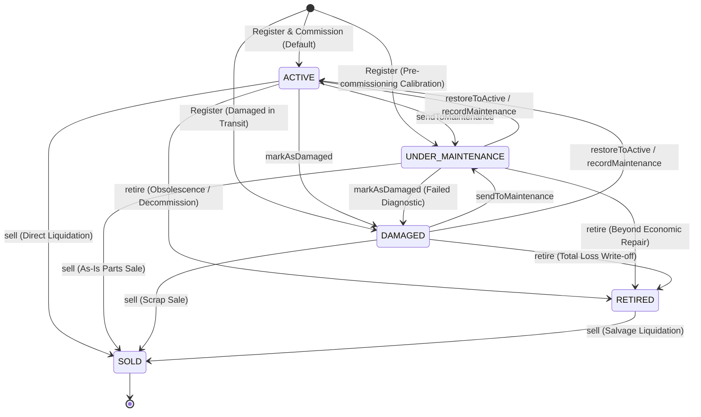

# Fixed Asset Status State Machine Specification

- **Module**: `packages/core/src/resources/domain/assets`
- **Status**: **AUTHORITATIVE SPECIFICATION (APPROVED & ACTIVE)**
- **Governing ADRs**: [ADR-0085: Fixed Asset Operational Lifecycle State Machine & Terminal Disposal Policy](./adr/0085-fixed-asset-operational-lifecycle-state-machine-and-terminal-disposal-policy.md), [ADR-0090: Fixed Asset Classification, Lifecycle State, & Condition Rating Strategy](./adr/0090-fixed-asset-classification-lifecycle-state-and-condition-rating-strategy.md)
- **Domain Engine**: [`AssetLifecycleStateMachine`](file:///c:/Projects/kinergy-platform/packages/core/src/resources/domain/assets/services/asset-lifecycle.state-machine.ts)
- **Aggregate Enforcement**: [`FixedAsset`](file:///c:/Projects/kinergy-platform/packages/core/src/resources/domain/assets/fixed-asset.aggregate.ts)

---

## 1. Executive Summary & Design Principles

The Fixed Asset status model represents an explicit, deterministic **Finite State Machine (FSM)** governing physical deployment, servicing, and terminal accounting disposal.

### Core Principles

1. **Zero Ad-Hoc Mutations**: Status transitions must execute through explicit aggregate methods (`sendToMaintenance`, `markAsDamaged`, `restoreToActive`, `retire`, `sell`, `changeStatus`).
2. **Actor & Provenance Requirement**: Every transition requires an authenticated `actorId` and a mandatory justification reason ($\ge 3$ characters).
3. **Atomic History Logging**: Every state change atomically emits an immutable history event (`STATUS_CHANGED`, `RETIRED`, `SOLD`) within the aggregate and database transaction.
4. **Terminal Immutability**: `SOLD` is an absolute terminal sink state. `RETIRED` prevents physical transfers and servicing, permitting only salvage liquidation to `SOLD`.
5. **Orthogonality of State & Condition**: `AssetStatus` (operational lifecycle) and `AssetCondition` (physical rating) are distinct domain concepts. Physical condition does not silently force state transitions without explicit operational commands, except when safety invariants block hazardous operations.

---

## 2. Finite State Graph



---

## 3. Explicit Business Confirmations

|   #    | Business Question                                    | Resolution & Rationale                                                                                                                                                                                                                | Invariant Rule |
| :----: | :--------------------------------------------------- | :------------------------------------------------------------------------------------------------------------------------------------------------------------------------------------------------------------------------------------ | :------------- |
| **1**  | **Can `ACTIVE` $\rightarrow$ `UNDER_MAINTENANCE`?**  | **YES**. Asset taken offline for routine servicing, preventive maintenance, calibration, or overhaul.                                                                                                                                 | `[AST-INV-5]`  |
| **2**  | **Can `ACTIVE` $\rightarrow$ `DAMAGED`?**            | **YES**. In-service mechanical failure, breakdown, or physical defect discovered during operation.                                                                                                                                    | `[AST-INV-5]`  |
| **3**  | **Can `ACTIVE` $\rightarrow$ `SOLD`?**               | **YES**. Direct commercial liquidation of working capital equipment.                                                                                                                                                                  | `[AST-INV-1]`  |
| **4**  | **Can `ACTIVE` $\rightarrow$ `RETIRED`?**            | **YES**. Permanent decommissioning due to obsolescence or end of operational lifespan.                                                                                                                                                | `[AST-INV-2]`  |
| **5**  | **Can `UNDER_MAINTENANCE` $\rightarrow$ `ACTIVE`?**  | **YES**. Maintenance/repairs completed successfully. Requires serviceable condition (`EXCELLENT`, `GOOD`, `FAIR`).                                                                                                                    | `[AST-INV-9]`  |
| **6**  | **Can `UNDER_MAINTENANCE` $\rightarrow$ `DAMAGED`?** | **YES**. Diagnostic inspection during maintenance reveals structural failure or unrepairable fault.                                                                                                                                   | `[AST-INV-5]`  |
| **7**  | **Can `UNDER_MAINTENANCE` $\rightarrow$ `RETIRED`?** | **YES**. Asset declared Beyond Economic Repair (BER) during maintenance; written off.                                                                                                                                                 | `[AST-INV-2]`  |
| **8**  | **Can `DAMAGED` $\rightarrow$ `UNDER_MAINTENANCE`?** | **YES**. Damaged asset dispatched to technician, workshop, or external service provider.                                                                                                                                              | `[AST-INV-5]`  |
| **9**  | **Can `DAMAGED` $\rightarrow$ `ACTIVE`?**            | **YES**. On-the-spot remediation or clearance of false alarm defect, provided condition is serviceable.                                                                                                                               | `[AST-INV-9]`  |
| **10** | **Can `DAMAGED` $\rightarrow$ `RETIRED`?**           | **YES**. Total loss write-off following catastrophic physical damage.                                                                                                                                                                 | `[AST-INV-2]`  |
| **11** | **Can `RETIRED` ever transition?**                   | **STRICTLY TO `SOLD` ONLY**. Decommissioned surplus in storage may be liquidated for scrap salvage proceeds. Reactivation to `ACTIVE`, `UNDER_MAINTENANCE`, or `DAMAGED` is strictly prohibited by accounting depreciation standards. | `[AST-INV-2]`  |
| **12** | **Can `SOLD` ever transition?**                      | **NO**. `SOLD` is an absolute terminal sink state. Ownership is transferred outside the organization.                                                                                                                                 | `[AST-INV-1]`  |

---

## 4. Initial State & Auxiliary Mutation Rules

### 4.1 Initial Creation State

- **Default Initial State**: `ACTIVE` (commissioned for service).
- **Alternative Allowed Initial States**:
  - `UNDER_MAINTENANCE`: Capital asset acquired but requires initial calibration, assembly, or certification before commissioning.
  - `DAMAGED`: Asset received damaged in transit, recorded for warranty claim.
- **Prohibited Initial States**: Direct creation as `RETIRED` or `SOLD` is strictly prohibited (`[AST-INV-3]`).

### 4.2 Required Data & Side Effects by Operation

- **`SOLD` Requirements**:
  - Requires `saleAmount` (`Money` $\ge 0.00$ USD).
  - Requires `actorId` (authenticated user).
  - Requires `reason` ($\ge 3$ characters).
  - Side effect: Locks asset from **ALL** subsequent mutations (`transferLocation`, `updateCondition`, `updateEstimatedValue`, `recordMaintenance`, `updateDetails`, `changeStatus`).
- **`RETIRED` Requirements**:
  - Requires `actorId` and `reason` ($\ge 3$ characters).
  - Side effect: Blocks location transfers (`[AST-INV-6]`), blocks maintenance records (`[AST-INV-7]`), blocks condition changes (`[AST-INV-8]`). Permits only `updateEstimatedValue` and salvage sale to `SOLD`.
- **`UNDER_MAINTENANCE` / `DAMAGED`**:
  - Requires `actorId` and `reason`.
  - Permits workshop location transfer, condition updates, maintenance records, and valuation updates.

---

## 5. State vs. Condition Orthogonality

`AssetStatus` and `AssetCondition` represent orthogonal dimensions:

```
+--------------------------------------------------------------------------------+
|                                 FIXED ASSET                                    |
|                                                                                |
|   +------------------------------------+   +-------------------------------+   |
|   |         ASSET STATUS (FSM)         |   |     ASSET CONDITION RATING    |   |
|   |------------------------------------|   |-------------------------------|   |
|   | ACTIVE                             |   | EXCELLENT                     |   |
|   | UNDER_MAINTENANCE                  |   | GOOD                          |   |
|   | DAMAGED                            |   | FAIR                          |   |
|   | RETIRED                            |   | NEEDS_REPAIR                  |   |
|   | SOLD                               |   | OUT_OF_SERVICE                |   |
|   +------------------------------------+   +-------------------------------+   |
|                                                                                |
|   INVARIANT COUPLING:                                                          |
|   - An asset in OUT_OF_SERVICE condition cannot transition to ACTIVE status.   |
|   - NEEDS_REPAIR does NOT automatically force UNDER_MAINTENANCE status.        |
+--------------------------------------------------------------------------------+
```

---

## 6. Complete Deterministic 5x5 Transition Matrix

Every possible state pair evaluated deterministically:

| Current State (`FROM`)  | Target State (`TO`)     | Allowed? | Reason / Business Semantics                            | Side Effects & Invariants                                         |
| :---------------------- | :---------------------- | :------: | :----------------------------------------------------- | :---------------------------------------------------------------- |
| **`ACTIVE`**            | **`ACTIVE`**            |  **NO**  | Self-transition no-op is invalid.                      | Throws `InvalidAssetStateException`.                              |
| **`ACTIVE`**            | **`UNDER_MAINTENANCE`** | **YES**  | Dispatched for routine servicing or overhaul.          | History `STATUS_CHANGED`; emits `AssetStatusChangedDomainEvent`.  |
| **`ACTIVE`**            | **`DAMAGED`**           | **YES**  | Breakdown or damage discovered during operations.      | History `STATUS_CHANGED`; emits `AssetStatusChangedDomainEvent`.  |
| **`ACTIVE`**            | **`RETIRED`**           | **YES**  | Decommissioned due to age or obsolescence.             | History `RETIRED`; halts depreciation; locks transfers.           |
| **`ACTIVE`**            | **`SOLD`**              | **YES**  | Direct commercial sale of operational asset.           | Sets terminal lock; history `SOLD`; emits `AssetSoldDomainEvent`. |
| **`UNDER_MAINTENANCE`** | **`ACTIVE`**            | **YES**  | Servicing completed successfully.                      | Requires non-`OUT_OF_SERVICE` condition; emits event.             |
| **`UNDER_MAINTENANCE`** | **`UNDER_MAINTENANCE`** |  **NO**  | Self-transition no-op is invalid.                      | Throws `InvalidAssetStateException`.                              |
| **`UNDER_MAINTENANCE`** | **`DAMAGED`**           | **YES**  | Structural defect detected during overhaul.            | History `STATUS_CHANGED`; emits `AssetStatusChangedDomainEvent`.  |
| **`UNDER_MAINTENANCE`** | **`RETIRED`**           | **YES**  | Declared Beyond Economic Repair (BER).                 | History `RETIRED`; locks future maintenance servicing.            |
| **`UNDER_MAINTENANCE`** | **`SOLD`**              | **YES**  | Sold as-is from maintenance workshop.                  | Sets terminal lock; history `SOLD`; emits event.                  |
| **`DAMAGED`**           | **`ACTIVE`**            | **YES**  | Defect remediated / false alarm cleared.               | Requires non-`OUT_OF_SERVICE` condition; emits event.             |
| **`DAMAGED`**           | **`UNDER_MAINTENANCE`** | **YES**  | Dispatched to technician or workshop.                  | History `STATUS_CHANGED`; emits `AssetStatusChangedDomainEvent`.  |
| **`DAMAGED`**           | **`DAMAGED`**           |  **NO**  | Self-transition no-op is invalid.                      | Throws `InvalidAssetStateException`.                              |
| **`DAMAGED`**           | **`RETIRED`**           | **YES**  | Total loss write-off.                                  | History `RETIRED`; decommissions asset permanently.               |
| **`DAMAGED`**           | **`SOLD`**              | **YES**  | Liquidated for scrap salvage proceeds.                 | Sets terminal lock; history `SOLD`; emits event.                  |
| **`RETIRED`**           | **`ACTIVE`**            |  **NO**  | Prohibited by tax/depreciation standards.              | Throws `InvalidAssetStateException` (`[AST-INV-2]`).              |
| **`RETIRED`**           | **`UNDER_MAINTENANCE`** |  **NO**  | Decommissioned items cannot incur servicing costs.     | Throws `InvalidAssetStateException` (`[AST-INV-2]`).              |
| **`RETIRED`**           | **`DAMAGED`**           |  **NO**  | Decommissioned items are outside operational tracking. | Throws `InvalidAssetStateException` (`[AST-INV-2]`).              |
| **`RETIRED`**           | **`RETIRED`**           |  **NO**  | Self-transition no-op is invalid.                      | Throws `InvalidAssetStateException`.                              |
| **`RETIRED`**           | **`SOLD`**              | **YES**  | Scrap salvage liquidation of decommissioned property.  | Sets terminal lock; history `SOLD`; emits event.                  |
| **`SOLD`**              | **`ACTIVE`**            |  **NO**  | Absolute terminal sink state; ownership transferred.   | Throws `InvalidAssetStateException` (`[AST-INV-1]`).              |
| **`SOLD`**              | **`UNDER_MAINTENANCE`** |  **NO**  | Absolute terminal sink state; ownership transferred.   | Throws `InvalidAssetStateException` (`[AST-INV-1]`).              |
| **`SOLD`**              | **`DAMAGED`**           |  **NO**  | Absolute terminal sink state; ownership transferred.   | Throws `InvalidAssetStateException` (`[AST-INV-1]`).              |
| **`SOLD`**              | **`RETIRED`**           |  **NO**  | Absolute terminal sink state; ownership transferred.   | Throws `InvalidAssetStateException` (`[AST-INV-1]`).              |
| **`SOLD`**              | **`SOLD`**              |  **NO**  | Absolute terminal sink state; ownership transferred.   | Throws `InvalidAssetStateException` (`[AST-INV-1]`).              |

---

## 7. Transition Semantics & Invariant Enforcement

### 7.1 Preconditions & Invariant Assertions

1. **`assertNotSold()`**: Evaluated before all mutating operations.
2. **`assertNotRetired()`**: Evaluated before `transferLocation()`, `recordMaintenance()`, `updateCondition()`, and status transitions back to active/servicing.
3. **`assertConditionServiceableForActive()`**: Blocks `restoreToActive()` if condition is `OUT_OF_SERVICE`.
4. **`assertJustificationValid()`**: Ensures `reason` is a non-empty string of $\ge 3$ characters.

### 7.2 Domain Exceptions

- All invalid transitions throw `InvalidAssetStateException` with explicit context:
  ```typescript
  throw new InvalidAssetStateException(
    `Cannot transition FixedAsset from ${currentStatus} to ${targetStatus}: Transition is invalid.`,
  );
  ```

---

## 8. Architectural Pattern Decision

- **Pattern**: Domain Service (`AssetLifecycleStateMachine`) + Encapsulated Aggregate Enforcement (`FixedAsset`).
- **Rationale**:
  1. Keeps the state machine transition table centralized and statically discoverable.
  2. Protects the aggregate root boundary from invalid mutations.
  3. Avoids bloated state-pattern class hierarchies or external workflow libraries.
  4. 100% compliant with existing Kinergy Hexagonal/DDD architecture.

---

## 9. ADR Alignment & Review

- **[ADR-0085: Fixed Asset Operational Lifecycle State Machine & Terminal Disposal Policy](./adr/0085-fixed-asset-operational-lifecycle-state-machine-and-terminal-disposal-policy.md)**: Governs all lifecycle states, terminal locks, and transition rules.
- **[ADR-0090: Fixed Asset Classification, Lifecycle State, & Condition Rating Strategy](./adr/0090-fixed-asset-classification-lifecycle-state-and-condition-rating-strategy.md)**: Governs condition ratings and category metadata.
- **Decision**: No new ADR required; existing ADR-0085 and ADR-0090 completely cover the formal state machine architecture.

---

## 10. Direct Mutation & Bypass Vector Audit

The codebase was audited to verify that no direct mutation or repository-level bypass vectors exist:

| Potential Bypass Vector                                                           | Architectural Safeguard & Enforcement                                                                                               |    Result     |
| :-------------------------------------------------------------------------------- | :---------------------------------------------------------------------------------------------------------------------------------- | :-----------: |
| **Direct Field Assignment** (`asset.status = ...`)                                | Private encapsulated fields (`_status`, `_condition`); no public setters on `FixedAsset`.                                           | **PROTECTED** |
| **Bypassing Serviceability Guard** (`changeStatus(ACTIVE)` when `OUT_OF_SERVICE`) | Invariant assertion inside `changeStatus` rejects transition if condition is `OUT_OF_SERVICE`.                                      | **PROTECTED** |
| **Direct Assignment to `SOLD`**                                                   | `changeStatus(SOLD)` rejected; liquidation requires explicit `sell(saleAmount, actorId, reason)`.                                   | **PROTECTED** |
| **Mutations on `RETIRED` Asset**                                                  | Invariant assertions (`assertNotRetired`) protect `transferLocation`, `recordMaintenance`, and `updateCondition`.                   | **PROTECTED** |
| **Generic Repository Updates**                                                    | `FixedAssetRepositoryInterface` exposes only `save(asset: FixedAsset)`, ensuring all persistence originates from aggregate roots.   | **PROTECTED** |
| **Partial Transaction Failures**                                                  | `PrismaFixedAssetRepository.save()` executes aggregate update, history logging, and maintenance records in a single `$transaction`. | **PROTECTED** |

---

## 11. Automated Test Suite Verification

1. **Unit & Invariant Suite**: [`packages/core/src/resources/domain/__tests__/asset-lifecycle-transition-enforcement.spec.ts`](file:///c:/Projects/kinergy-platform/packages/core/src/resources/domain/__tests__/asset-lifecycle-transition-enforcement.spec.ts) (31 tests).
2. **State Machine Graph Suite**: [`packages/core/src/resources/domain/__tests__/asset-lifecycle-state-machine.spec.ts`](file:///c:/Projects/kinergy-platform/packages/core/src/resources/domain/__tests__/asset-lifecycle-state-machine.spec.ts) (27 tests).
3. **Business Operations Matrix Suite**: [`packages/core/src/resources/domain/__tests__/asset-business-operations-invariants.spec.ts`](file:///c:/Projects/kinergy-platform/packages/core/src/resources/domain/__tests__/asset-business-operations-invariants.spec.ts) (15 tests).
4. **Persistence & Atomicity Rollback Suite**: [`packages/core/src/resources/infrastructure/persistence/prisma/repositories/prisma-fixed-asset-persistence.spec.ts`](file:///c:/Projects/kinergy-platform/packages/core/src/resources/infrastructure/persistence/prisma/repositories/prisma-fixed-asset-persistence.spec.ts) (3 tests).
