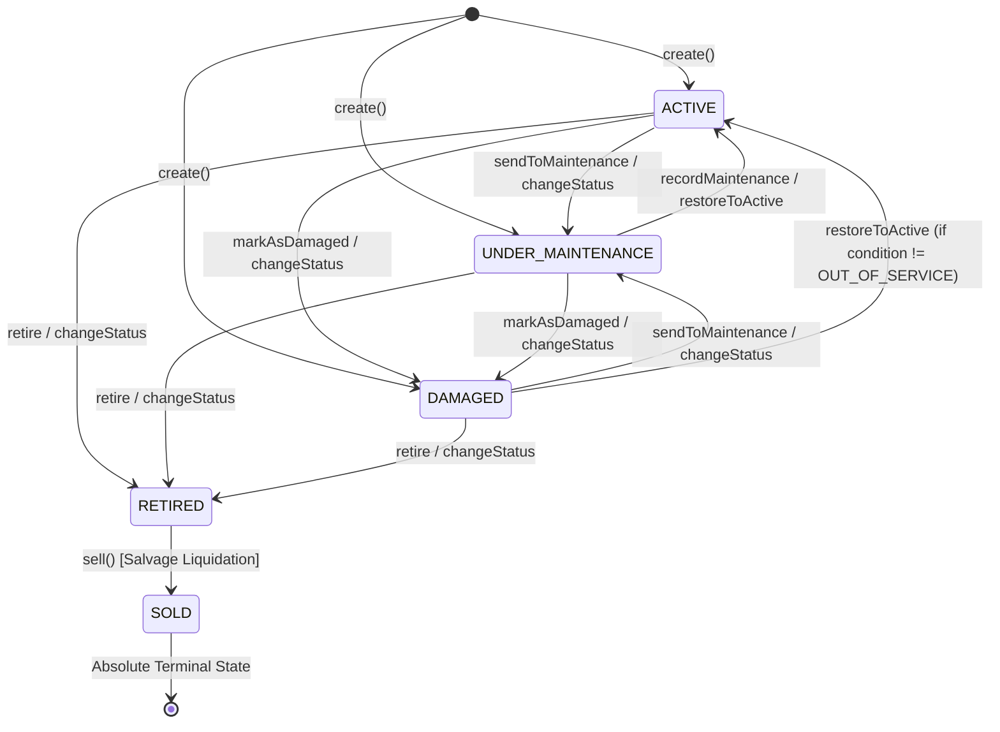

# Phase 6: Fixed Asset Frontend Implementation Baseline & Verification

**Status**: `APPROVED — PROCEED TO MILESTONE 6.13 IMPLEMENTATION`  
**Milestone**: Milestone 6.13 — Fixed Asset Frontend Implementation  
**Bounded Context**: `Resources Management`  
**Sub-Domain**: `Fixed Assets`  
**Date**: September 3, 2026  
**Author**: Principal Frontend Architect, Senior React Engineer, Fixed Asset Domain Engineer & Kinergy ARB  
**Governing Documents**:

- [**ADR-0084: Resources Subsystem Architecture & Boundaries**](./adr/0084-resources-subsystem-architecture-and-boundaries.md)
- [**ADR-0095: Three-Layer Concurrency Defense Strategy**](./adr/0095-three-layer-concurrency-defense-for-inventory-mutations.md)
- [**ADR-0099: Explicit Sub-Resource State Mutation Endpoints vs. Generic PATCH**](./adr/0099-explicit-subresource-state-mutation-endpoints-vs-generic-patch.md)
- [**ADR-0100: Frontend Resources Feature-Module Boundaries & Encapsulation**](./adr/0100-frontend-resources-feature-module-boundaries.md)
- [**Fixed Asset HTTP API Contracts & Lifecycle Architecture**](./fixed-asset-api-contracts.md)
- [**Milestone 6.11 Quality Gate & Frontend Architecture Baseline**](./milestone-6.11-quality-gate.md)
- [**Milestone 6.12 Quality Gate & Sign-off**](./milestone-6.12-quality-gate.md)

---

## 1. Implementation Prerequisites Verification

All upstream Phase 6 milestones governing Fixed Assets have completed, passed automated validation, and been committed to `main`:

| Prerequisite Milestone                      | Scope & Deliverable                                                                    | Status      |
| :------------------------------------------ | :------------------------------------------------------------------------------------- | :---------- |
| **Phase 6.0 — Discovery Baseline**          | System taxonomy & bounded context definition                                           | `COMPLETED` |
| **Phase 6.2 — Fixed Asset Domain Model**    | `FixedAsset` aggregate, `AssetLocation`, `AssetHistoryEvent`, `AssetMaintenanceRecord` | `COMPLETED` |
| **Phase 6.3 — State Machines & Invariants** | `AssetLifecycleStateMachine` with invariants `[AST-INV-1]` through `[AST-INV-9]`       | `COMPLETED` |
| **Phase 6.4 — Persistence Layer**           | PostgreSQL Prisma models, OCC versioning, atomic location history                      | `COMPLETED` |
| **Phase 6.6 — Application Layer**           | CQRS command & query handlers, DTO mappers, domain event dispatchers                   | `COMPLETED` |
| **Phase 6.7 — Authorization & Security**    | RBAC permission model (`assets.read`, `assets.write`, `billing.read`)                  | `COMPLETED` |
| **Phase 6.8 — Resource Valuation**          | Capital equipment carrying value, CAPEX purchase valuation & inclusion rules           | `COMPLETED` |
| **Phase 6.9 — Backend REST API**            | NestJS `FixedAssetsController` (11 endpoints under `/api/v1/resources/assets`)         | `COMPLETED` |
| **Phase 6.10 — Backend Testing Suite**      | Unit, persistence, concurrency, and security test suites                               | `COMPLETED` |
| **Phase 6.11 — Frontend Preparation**       | Feature boundaries, routing, query keys, types, URL state, & 4-state UX                | `COMPLETED` |
| **Phase 6.12 — Inventory Frontend Gate**    | Consumable Inventory production gate sign-off (`APPROVED`)                             | `COMPLETED` |

---

## 2. Actual Backend Contract Inventory

The Fixed Assets frontend consumes the following verified NestJS REST endpoints (`/api/v1/resources/assets`):

| Operation                | Method  | Route Path           | Request Payload                                                                                                                         | Response Body                           | Required Permissions            |
| :----------------------- | :------ | :------------------- | :-------------------------------------------------------------------------------------------------------------------------------------- | :-------------------------------------- | :------------------------------ |
| **Category Taxonomy**    | `GET`   | `/categories`        | None                                                                                                                                    | `AssetCategoryMetadataDto[]`            | `assets.read`                   |
| **Barcode / Tag Lookup** | `GET`   | `/tag/:tag`          | None (URL parameter: `tag`)                                                                                                             | `FixedAssetResponseDto`                 | `assets.read`                   |
| **List Catalog Table**   | `GET`   | `/`                  | `?search=&category=&status=&condition=&facilityId=&roomId=&includeDecommissioned=&page=&limit=&sortBy=&sortOrder=`                      | `PaginatedFixedAssetResponseDto`        | `assets.read`                   |
| **Get Asset Detail**     | `GET`   | `/:id`               | None (URL parameter: `id`)                                                                                                              | `FixedAssetResponseDto`                 | `assets.read`                   |
| **Asset Audit History**  | `GET`   | `/:id/history`       | `?eventType=&recordedByUserId=&fromDate=&toDate=&page=&limit=&sortOrder=`                                                               | `PaginatedAssetHistoryResponseDto`      | `assets.read`                   |
| **Maintenance History**  | `GET`   | `/:id/maintenance`   | `?performedBy=&fromDate=&toDate=&page=&limit=&sortOrder=`                                                                               | `PaginatedMaintenanceResponseDto`       | `assets.read`                   |
| **Estate Valuation**     | `GET`   | `/valuation/summary` | `?category=&includeDecommissioned=`                                                                                                     | `FixedAssetValuationSummaryResponseDto` | `assets.read` + `billing.read`  |
| **Get Asset Valuation**  | `GET`   | `/:id/valuation`     | None (URL parameter: `id`)                                                                                                              | `FixedAssetValuationResponseDto`        | `assets.read` + `billing.read`  |
| **Create Asset**         | `POST`  | `/`                  | `CreateFixedAssetRequestDto`                                                                                                            | `FixedAssetResponseDto` (`201 Created`) | `assets.write`                  |
| **Update Metadata**      | `PATCH` | `/:id`               | `UpdateFixedAssetDetailsRequestDto` (`{ name?, description?, notes?, reason? }`)                                                        | `FixedAssetResponseDto`                 | `assets.write`                  |
| **Transfer Location**    | `POST`  | `/:id/transfer`      | `TransferFixedAssetLocationRequestDto` (`{ location, reason? }`)                                                                        | `FixedAssetResponseDto`                 | `assets.write`                  |
| **Change Status**        | `POST`  | `/:id/status`        | `ChangeFixedAssetStatusRequestDto` (`{ status, reason }`)                                                                               | `FixedAssetResponseDto`                 | `assets.write`                  |
| **Update Condition**     | `POST`  | `/:id/condition`     | `UpdateFixedAssetConditionRequestDto` (`{ condition, reason? }`)                                                                        | `FixedAssetResponseDto`                 | `assets.write`                  |
| **Record Maintenance**   | `POST`  | `/:id/maintenance`   | `RecordAssetMaintenanceRequestDto` (`{ serviceDate, description, costAmount, costCurrency?, performedBy, updateConditionTo?, notes? }`) | `AssetMaintenanceRecordDto`             | `assets.write`                  |
| **Update Fair Value**    | `POST`  | `/:id/valuation`     | `UpdateFixedAssetValuationRequestDto` (`{ estimatedValueAmount, currency?, reason? }`)                                                  | `FixedAssetResponseDto`                 | `assets.write` + `billing.read` |

### Key Contract Observations:

1. **Financial Confidentiality Masking**: `FixedAssetResponseDto` (returned by `GET /` and `GET /:id`) deliberately **omits** purchase acquisition cost and estimated carrying value. Financial figures are strictly encapsulated within `GET /:id/valuation` and require the composite permission `assets.read` + `billing.read`.
2. **Generic Update Boundary**: `PATCH /:id` is restricted to descriptive metadata (`name`, `description`, `notes`, `reason`). Mutating status, condition, location, or valuation via `PATCH` is prohibited by design.
3. **Pagination Structure**: List endpoints return uniform envelope `{ items, total, page, limit, totalPages, hasNextPage, hasPreviousPage }`.

---

## 3. Asset Lifecycle Summary & State Machine

Fixed asset operational states are governed by the deterministic domain finite state machine (`AssetLifecycleStateMachine`):



### State Definitions:

- **`ACTIVE`**: Fully operational and commissioned for facility, gym, or clinical treatment use.
- **`UNDER_MAINTENANCE`**: Temporarily taken offline for scheduled servicing, preventive maintenance, calibration, or overhaul.
- **`DAMAGED`**: Impaired due to mechanical breakdown, component failure, or safety defect pending diagnostic inspection.
- **`RETIRED`**: Permanently decommissioned from active service due to obsolescence, age, or being beyond economic repair (BER).
- **`SOLD`**: Permanently liquidated or sold for salvage value. Irreversible terminal lock.

---

## 4. Terminal-State Rules

1. **`SOLD` Invariant `[AST-INV-1]`**:
   - `SOLD` is the absolute terminal state.
   - Once an asset is `SOLD`, all operations are strictly forbidden: no metadata edits, no location transfers, no condition updates, no maintenance logging, and no revaluation.
   - **Contract Boundary**: Direct transition to `SOLD` via `POST /:id/status` is rejected by the domain aggregate. The domain enforces that liquidation requires recording realization value via `sell()`. The frontend `ChangeStatusDialog` must strictly exclude `SOLD` from status dropdown options.
2. **`RETIRED` Invariant `[AST-INV-2]`**:
   - `RETIRED` halts active operational use, location transfers, and maintenance.
   - Retired assets remain in the inventory catalog (accessible when `includeDecommissioned=true`).
   - Retired assets can still be revalued for salvage accounting or liquidated to `SOLD`.

---

## 5. Transfer Rules & Physical Location Auditability

1. **Active State Requirement `[AST-INV-2]`**:
   - Only operational assets (`ACTIVE`, `UNDER_MAINTENANCE`, `DAMAGED`) can be physically transferred between facilities, rooms, or zones.
   - Attempting to transfer a `RETIRED` or `SOLD` asset throws `InvalidAssetStateException`.
2. **Idempotence & No-Op Prevention**:
   - If the target location matches the current location (`location.equals(newLocation)`), the operation is an idempotent no-op and produces no duplicate audit record.
3. **Immutable History Audit Record `[AST-INV-3]`**:
   - A successful location transfer automatically appends a `TRANSFERRED` event to the asset's history ledger, recording `priorLocation`, `newLocation`, `actorId`, and operational `reason`.

---

## 6. Maintenance Rules & Work Orders

1. **Eligibility `[AST-INV-6]`**:
   - Maintenance work orders can only be recorded on non-decommissioned assets (`ACTIVE`, `UNDER_MAINTENANCE`, `DAMAGED`).
   - Maintenance cannot be recorded on `RETIRED` or `SOLD` equipment.
2. **Required Service Attributes**:
   - Work order logging requires: `serviceDate` (ISO string), `description` (min 3 chars), `costAmount` ($\ge 0$), and `performedBy` (min 2 chars).
3. **Automatic Operational Recovery**:
   - If an asset is `UNDER_MAINTENANCE` or `DAMAGED` and maintenance is completed with a serviceable condition (`EXCELLENT`, `GOOD`, `FAIR`), the domain aggregate **automatically transitions the asset status to `ACTIVE`**.
   - If the condition remains `NEEDS_REPAIR` or `OUT_OF_SERVICE`, the asset remains offline.
4. **Audit History Generation**:
   - A permanent `AssetMaintenanceRecord` is appended to the asset's servicing ledger and an associated `MAINTENANCE_RECORDED` event is written to the audit history.

---

## 7. Asset History Behavior

1. **Append-Only Immutable Ledger**:
   - History records can never be updated, edited, or deleted via the API.
2. **Event Types (`AssetHistoryEventType`)**:
   - `CREATED`, `UPDATED`, `TRANSFERRED`, `STATUS_CHANGED`, `CONDITION_CHANGED`, `VALUE_UPDATED`, `MAINTENANCE_RECORDED`, `RETIRED`, `SOLD`.
3. **Noise Suppression**:
   - Descriptive updates (`PATCH /:id`) where submitted values equal current values produce no history events.
4. **Contextual JSON Payload**:
   - Each event carries structured before/after diffs (`changedFields`, `priorStatus`, `newStatus`, `priorLocation`, `newLocation`, `cost`, `performedBy`).

---

## 8. Valuation Visibility & Security Rules

1. **Dual-Permission Defense-in-Depth**:
   - Viewing financial valuation (`GET /:id/valuation` and `GET /valuation/summary`) requires **both** `assets.read` AND `billing.read`.
   - Updating estimated fair value (`POST /:id/valuation`) requires **both** `assets.write` AND `billing.read`.
2. **Frontend Masking & Progressive Disclosure**:
   - Staff with `assets.read` only: Can view equipment specifications, location, status, condition, and maintenance history. Acquisition cost and current estimated value are masked with `••••••` or restricted badges.
   - Staff with composite permissions (`assets.read` + `billing.read`): Full access to CAPEX acquisition costs, carrying values, and valuation summaries.

---

## 9. Approved Frontend Architecture Constraints

In accordance with [ADR-0100](./adr/0100-frontend-resources-feature-module-boundaries.md), the Fixed Asset frontend will be encapsulated in:

```
apps/web/src/modules/resources/assets/
├── api/
│   ├── assets-api.ts               # Axios HTTP client matching FixedAssetsController
│   ├── assets-query-keys.ts        # Hierarchical TanStack Query key factories
│   └── index.ts
├── components/
│   ├── asset-status-badge.tsx      # Color-coded operational status pills
│   ├── asset-condition-badge.tsx   # Condition rating indicators (Rank 1 to 5)
│   ├── asset-category-badge.tsx    # Equipment taxonomy classification badges
│   ├── transfer-location-dialog.tsx# Physical relocation modal
│   ├── change-status-dialog.tsx    # Lifecycle status transition modal
│   ├── update-condition-dialog.tsx # Condition re-rating modal
│   ├── record-maintenance-dialog.tsx# Servicing work order modal
│   ├── update-valuation-dialog.tsx # Fair value appraisal modal (billing.read)
│   ├── retire-asset-dialog.tsx     # Decommissioning confirmation modal
│   └── index.ts
├── hooks/
│   ├── use-assets-filters.ts       # URL state controller for catalog table
│   ├── use-assets-queries.ts       # TanStack query hooks (list, detail, history, maintenance, valuation)
│   ├── use-assets-mutations.ts     # TanStack mutation hooks with server-state invalidation
│   └── index.ts
├── routes/
│   ├── assets-list-page.tsx        # Main DataTable catalog view
│   ├── asset-detail-page.tsx       # Equipment cockpit & operational status
│   ├── asset-create-page.tsx       # Equipment commissioning form
│   ├── asset-edit-page.tsx         # Descriptive metadata update form
│   ├── asset-history-page.tsx      # Chronological audit event ledger
│   ├── asset-maintenance-page.tsx  # Servicing history & work orders
│   └── index.ts
├── schemas/
│   ├── assets.schema.ts            # Zod validation schemas matching DTO contracts
│   └── index.ts
├── types/
│   ├── assets.types.ts             # ViewModels, DTOs, filter params, enums
│   └── index.ts
└── index.ts                         # Public feature module barrel export
```

### Route Mappings in `app-router.tsx`:

- `/resources/assets` -> `AssetsListPage` (`assets.read`)
- `/resources/assets/new` -> `AssetCreatePage` (`assets.write`)
- `/resources/assets/:id` -> `AssetDetailPage` (`assets.read`)
- `/resources/assets/:id/edit` -> `AssetEditPage` (`assets.write`)
- `/resources/assets/:id/history` -> `AssetHistoryPage` (`assets.read`)
- `/resources/assets/:id/maintenance` -> `AssetMaintenancePage` (`assets.read`)

---

## 10. Required Reusable Infrastructure

1. **UI Primitives (`@kinergy-platform/ui`)**: `Button`, `Badge`, `Card`, `Dialog`, `Skeleton`, `Toast`, `Alert`, `StateView`.
2. **DataTable Infrastructure (`src/shared/table`)**: `DataTable`, `useTableUrlState`, `DataTableToolbar`, `DataTableSearch`, `DataTableFacetedFilter`, `DataTableRowActions`, `DataTablePagination`.
3. **Form Infrastructure (`src/shared/forms`)**: `FormLayout`, `FormSection`, `FormFieldGroup`, `FormSubmitButton`, `useDirtyDialogGuard`, `useApplyServerErrors`.
4. **Authorization Framework (`src/shared/auth` / `app/routes`)**: `<HasPermission />`, `<RequirePermission />`, `useAuth()`.
5. **Notification Provider (`src/app/providers`)**: `useNotification().success()`, `useNotification().error()`.

---

## 11. Known Risks & Mitigations

| Risk                                                         | Impact                                                                           | Architecture Mitigation                                                                                                                   |
| :----------------------------------------------------------- | :------------------------------------------------------------------------------- | :---------------------------------------------------------------------------------------------------------------------------------------- |
| **Attempting direct transition to `SOLD` via status dialog** | Server returns `400 Bad Request` (`Direct status change to SOLD is prohibited`). | `ChangeStatusDialog` strictly filters out `AssetStatus.SOLD` from selection options.                                                      |
| **Transferring decommissioned/retired equipment**            | Server returns `400 Bad Request` (`[AST-INV-2]`).                                | Frontend hides/disables the _"Transfer Location"_ button when status is `RETIRED` or `SOLD`.                                              |
| **Financial acquisition cost leakage**                       | Unauthorized users viewing CAPEX purchase invoice amounts.                       | Dual-permission composition: `FixedAssetResponseDto` strips financial numbers; detail cockpit requires `billing.read` to fetch valuation. |
| **Overwriting metadata during concurrent maintenance**       | Lost updates or state drift.                                                     | Aggregate OCC versioning (`version`); frontend rolls back and refetches on `409 Conflict`.                                                |

---

## 12. Contract Gaps

- **None**: All 15 required operations across taxonomy, hardware scanner lookup, catalog listing, detail cockpit, location transfer, status transition, condition rating, maintenance work orders, audit history, and valuation are fully exposed by the backend NestJS controller.

---

## 13. Blocking Issues

- **Zero Blocking Issues**: Upstream milestones 6.0 through 6.12 are fully signed off. Automated tests pass across all projects in the monorepo.

---

## 14. Explicit Implementation Readiness Decision

# **APPROVED — PROCEED TO MILESTONE 6.13 IMPLEMENTATION**

The Fixed Asset domain model, REST contracts, state machine rules, permission hierarchy, and frontend architecture constraints are 100% verified, consistent, and ready for frontend module implementation.
