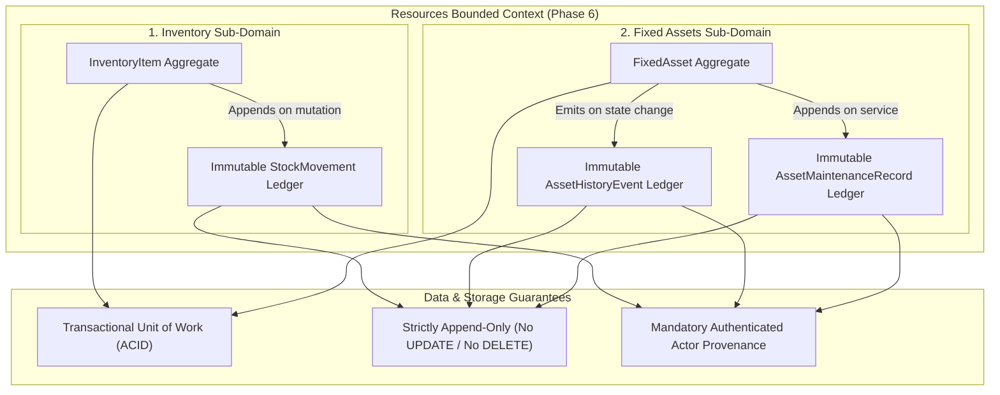

# Phase 6: Resources Management — Audit & History Strategy

## 1. Executive Summary & Purpose

In healthcare, wellness, and clinical operations, operational traceability is a regulatory, financial, and clinical requirement. Facilities must be able to prove:

- **Physical Custody**: Where capital equipment has been moved throughout its operational life.
- **Service Compliance**: When devices were calibrated, repaired, or inspected, by whom, and at what cost.
- **Stock Lineage**: Every single consumable pill, bandage, or supplement received, sold, consumed, or written off.
- **Financial Integrity**: How asset valuations and inventory capital have changed over time.

This specification details how the **Kinergy Platform** models, separates, and guarantees operational traceability across all resources.

---

## 2. Fundamental Architectural Distinction: Current State vs. Historical Record

A critical design principle of the Kinergy architecture is the strict separation between **Current State** (the active scalar properties of an aggregate) and the **Historical Record** (the immutable ledger of events that led to that state):

```
┌────────────────────────────────────────────────────────────────────────┐
│             CURRENT STATE          ≠          HISTORICAL RECORD        │
├────────────────────────────────────┼───────────────────────────────────┤
│ • Mutable entity properties        │ • Immutable, append-only records  │
│ • "What is the status right now?"  │ • "How did it get here, and why?" │
│ • Queried by operational workflows │ • Queried by audit, reconciliation│
│ • Single row in primary table      │ • Chronological sequence in ledger│
└────────────────────────────────────┴───────────────────────────────────┘
```

### Concrete Comparative Examples

| Domain Dimension     | Current State (Aggregate Property)                                | Historical Record (Audit Ledger)                                                                                    | Why They Are Distinct                                                                                                                                        |
| :------------------- | :---------------------------------------------------------------- | :------------------------------------------------------------------------------------------------------------------ | :----------------------------------------------------------------------------------------------------------------------------------------------------------- |
| **Asset Location**   | `asset.location`<br/>(`"Treatment Room 102"`)                     | `AssetHistoryEvent` (`TRANSFERRED`)<br/>`{ prior: "Main Gym", new: "Room 102", reason: "Physio allocation" }`       | Current location directs daily staff operations. The transfer record establishes physical chain-of-custody, asset transit history, and relocation rationale. |
| **Asset Status**     | `asset.status`<br/>(`UNDER_MAINTENANCE`)                          | `AssetHistoryEvent` (`STATUS_CHANGED`)<br/>`{ prior: "ACTIVE", new: "UNDER_MAINTENANCE", reason: "Motor failure" }` | Current status gates booking and availability. The status history proves equipment downtime patterns, reliability, and incident frequency.                   |
| **Asset Condition**  | `asset.condition`<br/>(`FAIR`)                                    | `AssetHistoryEvent` (`CONDITION_CHANGED`)<br/>`{ prior: "GOOD", new: "FAIR", reason: "Quarterly inspection" }`      | Current condition drives safety decisions. The condition history tracks physical wear-and-tear progression over time.                                        |
| **Asset Valuation**  | `asset.currentEstimatedValue`<br/>(`$12,500.00`)                  | `AssetHistoryEvent` (`VALUE_UPDATED`)<br/>`{ prior: "$15,000", new: "$12,500", diff: "-$2,500" }`                   | Current value drives balance sheet equity. Value history provides auditors with scheduled depreciation and fair-market write-down evidence.                  |
| **Consumable Stock** | `item.quantityOnHand`<br/>(`42 units`)                            | `StockMovement` ledger<br/>`[ +50 PURCHASE, -5 SALE, -3 CONSUMPTION ]`                                              | Current stock checks immediate availability for checkout. The movement ledger proves double-entry accounting reconciliation and prevents inventory fraud.    |
| **Maintenance Work** | `asset.condition` / `asset.status`<br/>(Operational after repair) | `AssetMaintenanceRecord`<br/>`{ serviceDate, cost: "$450", technician: "MedEquip", work: "Replaced belt" }`         | Aggregate status reflects readiness. Maintenance records preserve warranty compliance, servicing expenditure, and contractor accountability.                 |

---

## 3. The Three Audit Ledgers of Phase 6

Phase 6 maintains three distinct historical ledgers, each with specialized data contracts and retention policies:



---

## 4. Ledger 1: Consumable Inventory Movements (`StockMovement`)

**Entity**: [`StockMovement`](file:///c:/Projects/kinergy-platform/packages/core/src/resources/domain/inventory/entities/stock-movement.entity.ts)  
**Storage**: Table `stock_movements`  
**Immutability**: **Absolute**. Once written, movement rows are never updated (`update: {}`) or deleted.

### 4.1. What Events Are Recorded?

Every transaction that alters physical stock quantity generates exactly one movement record:

- **`PURCHASE`**: Delivery receipt from external supplier.
- **`SALE`**: Point-of-sale retail purchase by client or member.
- **`CONSUMPTION`**: Internal facility/clinical use during treatment or maintenance.
- **`ADJUSTMENT_IN`**: Physical cycle-count discovery (found surplus).
- **`ADJUSTMENT_OUT`**: Expiration disposal, shrinkage, or damaged product write-off.

### 4.2. Retained Audit Payload

```typescript
export interface StockMovementProps {
  readonly id: string; // Unique movement UUID v4
  readonly inventoryItemId: string; // Target SKU identifier
  readonly movementType: StockMovementType;
  readonly quantityDelta: number; // Signed integer (+50, -5)
  readonly balanceAfter: number; // Materialized stock balance immediately after mutation
  readonly unitCostAmount?: number; // Unit cost at time of purchase/movement
  readonly unitCostCurrency?: string; // Currency ISO code (USD)
  readonly reason?: string; // Operational or clinical justification
  readonly recordedByUserId: string; // Authenticated staff member ID
  readonly referenceId?: string; // External reference (PO #, Sales Receipt ID, Appointment ID)
  readonly recordedAt: Date; // Immutable UTC timestamp
}
```

### 4.3. Mathematical Reconciliation Guarantee

The movement ledger guarantees the **Double-Entry Reconciliation Invariant**:
$$\text{Current Stock on Hand} = \text{Opening Balance} + \sum_{i=1}^{n} \text{quantityDelta}_i$$
If physical stock differs from the sum of movements, the system identifies this as data corruption or unrecorded shrinkage.

---

## 5. Ledger 2: Fixed Asset Lifecycle History (`AssetHistoryEvent`)

**Entity**: [`AssetHistoryEvent`](file:///c:/Projects/kinergy-platform/packages/core/src/resources/domain/assets/entities/asset-history-event.entity.ts)  
**Storage**: Table `asset_history_events`  
**Immutability**: **Absolute**. Entity instances are frozen upon instantiation (`Object.freeze(this)`).

### 5.1. Event Types & Recorded Information

| Event Type                 | Triggering Domain Action     | Information Retained in `details` JSON Payload                                              | Why It Is Recorded                                                                  |
| :------------------------- | :--------------------------- | :------------------------------------------------------------------------------------------ | :---------------------------------------------------------------------------------- |
| **`CREATED`**              | `FixedAsset.create`          | `{ assetTag, category, purchaseValue, currentEstimatedValue, condition, status, location }` | Proves original asset commissioning baseline and initial acquisition parameters.    |
| **`UPDATED`**              | `asset.updateDetails`        | `{ changedFields: { [field]: { from, to } }, reason }`                                      | Tracks changes to asset naming, specifications, or serial numbers.                  |
| **`TRANSFERRED`**          | `asset.transferLocation`     | `{ priorLocation, newLocation, reason }`                                                    | Complete chain-of-custody tracking across rooms, facilities, and departments.       |
| **`STATUS_CHANGED`**       | `asset.changeStatus`         | `{ priorStatus, newStatus, reason }`                                                        | Operational lifecycle transitions (`ACTIVE`, `UNDER_MAINTENANCE`, `DAMAGED`).       |
| **`CONDITION_CHANGED`**    | `asset.updateCondition`      | `{ priorCondition, newCondition, reason }`                                                  | Physical degradation history across inspections (`EXCELLENT` $\to$ `NEEDS_REPAIR`). |
| **`VALUE_UPDATED`**        | `asset.updateEstimatedValue` | `{ priorValue, newValue, difference, reason }`                                              | Book revaluations, scheduled depreciation, or impairment write-downs.               |
| **`MAINTENANCE_RECORDED`** | `asset.recordMaintenance`    | `{ maintenanceRecordId, cost, performedBy, serviceDate, notes }`                            | Cross-links lifecycle events with specific servicing interventions.                 |
| **`RETIRED`**              | `asset.retire`               | `{ priorStatus, newStatus: 'RETIRED', reason }`                                             | Permanent decommissioning record; preserves legal disposal justification.           |
| **`SOLD`**                 | `asset.sell`                 | `{ priorStatus, newStatus: 'SOLD', priorEstimatedValue, saleAmount, reason }`               | Final liquidation record; captures salvage proceeds and transfer of legal title.    |

### 5.2. Provenance Dimensions (The 6 W's)

Every history record captures:

1. **What happened?** (`eventType`, human-readable `description`)
2. **When did it happen?** (Immutable ISO-8601 UTC timestamp `recordedAt`)
3. **To which asset?** (`assetId`, `assetTag`)
4. **Who performed it?** (`recordedByUserId`)
5. **What changed?** (Structured `details` payload containing before-and-after diffs)
6. **Why was it performed?** (`reason` justification string)

---

## 6. Ledger 3: Fixed Asset Maintenance Records (`AssetMaintenanceRecord`)

**Entity**: [`AssetMaintenanceRecord`](file:///c:/Projects/kinergy-platform/packages/core/src/resources/domain/assets/entities/asset-maintenance-record.entity.ts)  
**Storage**: Table `asset_maintenance_records`  
**Immutability**: **Absolute**. Maintenance entries represent completed historical facts.

### 6.1. Retained Information

- **`serviceDate`**: Timestamp when maintenance took place.
- **`description`**: Summary of servicing, calibration, or repairs performed.
- **`cost`**: Monetary expenditure ($ Scale 2 Decimal).
- **`performedBy`**: Technician, certified vendor, or external contractor identifier.
- **`notes`**: Optional warranty numbers, parts replaced, or diagnostic measurements.
- **`recordedByUserId`**: Authenticated staff member who logged the record.

### 6.2. Non-Interference Invariant

Recording maintenance **does not mutate historical purchase value (`purchaseValue`)**. Acquisition cost is an immutable historical financial fact. If maintenance alters the asset's fair-market valuation, an explicit `VALUE_UPDATED` event is executed independently.

---

## 7. Anti-Noise & Meaningful Audit Policy

To maintain high audit signal-to-noise ratio and prevent database bloat, the platform enforces strict **Anti-Noise Rules**:

1. **No-Op Updates Do Not Generate History**:
   If an administrator submits an update form without altering any values (e.g. `asset.updateDetails({ name: 'SameName' })`), the aggregate detects zero changes and **emits no history event**.
2. **Technical ORM Touches Are Ignored**:
   Database updates that refresh `updatedAt` timestamps or update internal indexing do not create domain history events.
3. **Failed Mutations Produce Zero History**:
   If an operation is rejected by domain validation (e.g. invalid status transition or overdraft), no history record or movement is written.
4. **Structured Diffs Over Full Snapshots**:
   Except for initial creation, events record only the mutated fields (`{ prior, new }`) rather than full entity copies, keeping storage compact and diffs instantly human-readable.

---

## 8. Correction Strategy: No Retrospective Rewriting

In accounting and clinical governance, historical ledgers must never be retroactively rewritten. If an erroneous record is entered:

```
WRONG:  DELETE FROM asset_history_events WHERE id = 'bad-entry';
WRONG:  UPDATE stock_movements SET quantity_delta = 5 WHERE id = 'mistake';

CORRECT: Preserve the original entry AND append a Compensating Transaction.
```

### Protocol for Correcting Errors:

1. **The Original Record Stands**: The erroneous movement or history event remains unaltered in the chronological ledger.
2. **Append a Compensating Record**:
   - For Inventory: An `ADJUSTMENT_IN` or `ADJUSTMENT_OUT` is recorded with clear rationale: `reason: "Correction: Reversal of incorrect sale entry ref #1029"`.
   - For Fixed Assets: A compensating status, condition, or valuation event is appended: `reason: "Correction: Reverting mistaken status change from damaged to active"`.
3. **Audit Trail Transparency**: External auditors see both the initial mistake and the corrective action, establishing complete operational honesty.

---

## 9. Developer Guidelines: How to Preserve Traceability in Future Features

When extending Phase 6 with new mutations (e.g., adding asset calibration, lease agreements, or stock transfers between warehouses), senior engineers must follow this **Traceability Checklist**:

```
┌────────────────────────────────────────────────────────────────────────┐
│               FUTURE MUTATION AUDITABILITY CHECKLIST                   │
├────────────────────────────────────────────────────────────────────────┤
│ [ ] 1. Separate Current State from History                             │
│     Update the aggregate's scalar properties (current location, stock).│
│ [ ] 2. Append an Immutable History Entity                              │
│     Inside the SAME domain method, instantiate and push a movement or  │
│     history event to the internal collection.                          │
│ [ ] 3. Capture All 6 Provenance Dimensions                             │
│     Ensure What, When, Who, To Which Entity, What Changed, and Why     │
│     are populated. Actor ID is mandatory.                              │
│ [ ] 4. Atomic Transactional Persistence                                │
│     Persist the aggregate and the history entity inside the same       │
│     prisma.$transaction. If history fails, rollback the mutation.     │
│ [ ] 5. Implement Anti-Noise Guards                                     │
│     Check for actual state differences before creating history records.│
│ [ ] 6. Enforce Append-Only Storage                                     │
│     Never provide UPDATE or DELETE repository methods for ledgers.     │
└────────────────────────────────────────────────────────────────────────┘
```
