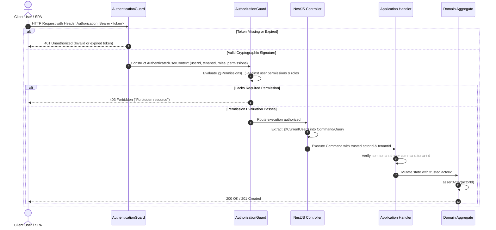

# Phase 6: Resources Management — Authorization & Security Model

## 1. Executive Summary & Architectural Ownership

The authorization architecture for **Phase 6: Resources Management** integrates directly into the platform-wide **Phase 1 Identity & Access Management (IAM)** security kernel. It enforces strict Role-Based Access Control (RBAC), tenant data isolation, and compositional financial security without creating permission explosion or introducing duplicated security infrastructure.

### Boundary & Ownership Definition:

- **IAM Bounded Context (`Phase 1`) Owns**: User identities, credential hashing (Argon2id), JWT token issuance, Refresh Token Rotation (RTR), role hierarchies, and the central permission catalog. For complete IAM architectural specifications, see:
  - [Phase 1 Security Architecture Guide](file:///c:/Projects/kinergy-platform/docs/security/README.md)
  - [Token & Session Architecture Specification](file:///c:/Projects/kinergy-platform/docs/security/token-strategy.md)
  - [Web Security & Threat Model](file:///c:/Projects/kinergy-platform/docs/security/web-security-cors-and-headers.md)
- **Resources Bounded Context (`Phase 6`) Owns**: Consuming IAM identity tokens, declaring endpoint permission requirements (`inventory.*`, `assets.*`), enforcing multi-tenant boundaries on resource entities, and recording authenticated actor provenance in audit ledgers.

> [!IMPORTANT]
> **Core Architectural Security Law**:  
> **Frontend permission checks are a user-experience mechanism; backend authorization is the security boundary.**  
> Hiding a button, disabling a menu option, or masking a form in the React SPA prevents user confusion, but the backend API rigorously evaluates every request independently. Any attempt to bypass frontend UX via direct HTTP calls is unconditionally rejected by NestJS guards.

---

## 2. Authentication Mechanism & Identity Flow

Phase 6 services are stateless and rely exclusively on cryptographically signed JSON Web Tokens (JWT) issued by Phase 1 IAM.



### Identity Invariants:

1. **Zero Client Trust for Identity**: Request DTOs strictly prohibit client-supplied `actorId` or `tenantId` in request bodies or query parameters. The backend controller extracts these parameters directly from the validated `req.user` payload via the `@CurrentUser()` decorator.
2. **Mandatory Actor Provenance**: Domain aggregates execute `assertActor(actorId)`. State changes cannot be recorded anonymously; every movement and history record requires a valid, verified user ID.

---

## 3. Role & Permission Architecture

The authorization model follows Kinergy's coarse-grained `<resource>.<action>` taxonomy codified in [ADR-0094](./adr/0094-resources-authorization-and-permission-taxonomy-model.md).

To prevent permission explosion while strictly upholding Least Privilege, Phase 6 defines **exactly four core permissions**, complemented by **compositional financial valuation permissions**:

```
┌────────────────────────────────────────────────────────────────────────┐
│                   PHASE 6 PERMISSION TAXONOMY                          │
├──────────────────────┬─────────────────────────────────────────────────┤
│ Sub-Domain           │ Permissions                                     │
├──────────────────────┼─────────────────────────────────────────────────┤
│ Consumable Inventory │ inventory.read, inventory.write                 │
│ Fixed Capital Assets │ assets.read, assets.write                       │
│ Financial Valuation  │ Composed with Phase 1 billing.read              │
└──────────────────────┴─────────────────────────────────────────────────┘
```

---

## 4. Phase 6 Permission Matrix & Scope

### 4.1. Consumable Inventory Permissions

- **`inventory.read`**:
  - **Grants**: Browsing the consumable catalog, viewing product details, inspecting current stock levels on hand, viewing the historical movement ledger (`/movements`), and viewing operational low-stock attention alerts.
  - **Authorized Roles**: `ADMIN`, `SUPER_ADMIN`, `OWNER`, `KITCHEN_STAFF`, `RECEPTIONIST`, `TRAINER`.
- **`inventory.write`**:
  - **Grants**: Registering new catalog SKUs, editing product descriptions/selling prices, archiving products, and executing stock ledger mutations (`/purchase`, `/sale`, `/consumption`, `/scrap`, `/adjust`).
  - **Authorized Roles**: `ADMIN`, `SUPER_ADMIN`, `OWNER`, `KITCHEN_STAFF`.

### 4.2. Fixed Assets Permissions

- **`assets.read`**:
  - **Grants**: Browsing physical equipment catalogs, searching by barcode/RFID asset tags (`/tag/:tag`), viewing asset specifications, current location, condition ratings, servicing history, and chronological lifecycle audit events.
  - **Authorized Roles**: `ADMIN`, `SUPER_ADMIN`, `OWNER`, `RECEPTIONIST`, `TRAINER`.
- **`assets.write`**:
  - **Grants**: Commissioning new equipment, editing asset metadata, executing location transfers (`/transfer`), transitioning lifecycle status (`ACTIVE`, `UNDER_MAINTENANCE`, `DAMAGED`), updating physical condition ratings, logging maintenance servicing records (`/maintenance`), and decommissioning/disposing equipment (`/retire`, `/sell`).
  - **Authorized Roles**: `ADMIN`, `SUPER_ADMIN`, `OWNER`.

### 4.3. Sensitive Financial Valuation & Compositional Security

In facility operations, kitchen staff or trainers require daily access to view supplement stock levels (`inventory.read`) or verify treadmill room locations (`assets.read`). However, granting them visibility into total facility working capital or balance sheet equipment assets violates financial governance.

Rather than creating separate financial permissions, Phase 6 uses **compositional authorization**, requiring sub-domain read access **AND** Phase 1 `billing.read`:

| Endpoint                                 | Method  | Required Permission Composition                               | Allowed Personas                                  |
| :--------------------------------------- | :-----: | :------------------------------------------------------------ | :------------------------------------------------ |
| `/api/v1/resources/inventory/valuation`  |  `GET`  | `inventory.read` **AND** `billing.read`                       | General Managers, Owners, Finance Officers        |
| `/api/v1/resources/assets/:id/valuation` |  `GET`  | `assets.read` **AND** `billing.read`                          | General Managers, Owners, Finance Officers        |
| `/api/v1/resources/assets/:id/valuation` | `PATCH` | `assets.write` **AND** `billing.read`                         | Certified Asset Appraisers, Owners, Senior Admins |
| `/api/v1/resources/overview`             |  `GET`  | `inventory.read` **AND** `assets.read` **AND** `billing.read` | C-Suite Executives, Platform Owners, Admins       |
| `/api/v1/resources/valuation`            |  `GET`  | `inventory.read` **AND** `assets.read` **AND** `billing.read` | C-Suite Executives, Platform Owners, Admins       |

---

## 5. Three-Tier Backend Authorization Enforcement

Backend authorization is enforced across three sequential defensive tiers:

```
┌────────────────────────────────────────────────────────────────────────┐
│                   THREE-TIER BACKEND ENFORCEMENT                       │
├────────────────────────────────────────────────────────────────────────┤
│ Tier 1: Transport Guards (NestJS)                                      │
│   • @UseGuards(AuthenticationGuard, AuthorizationGuard)                │
│   • @Permissions('inventory.read', 'billing.read')                     │
│   • Rejects unauthorized requests with 401 or 403 before handler runs  │
├────────────────────────────────────────────────────────────────────────┤
│ Tier 2: Application CQRS Handler Layer                                 │
│   • Enforces tenant isolation: item.tenantId === command.tenantId      │
│   • Masks sensitive financial fields for unauthorized actors           │
├────────────────────────────────────────────────────────────────────────┤
│ Tier 3: Domain Kernel Invariant Enforcement                            │
│   • Aggregate roots assert valid actor: assertActor(actorId)           │
│   • Binds actor identity permanently to append-only audit ledgers      │
└────────────────────────────────────────────────────────────────────────┘
```

### 5.1. Tier 1: Transport Guard Implementation

Controllers declare access requirements using declarative metadata decorators:

```typescript
@Controller('resources/inventory')
@UseGuards(AuthenticationGuard, AuthorizationGuard)
export class InventoryController {
  @Post(':id/purchase')
  @Permissions('inventory.write')
  async purchaseStock(
    @Param('id') id: string,
    @Body() dto: PurchaseStockDto,
    @CurrentUser() user: AuthenticatedUserContext,
  ) {
    return this.commandBus.execute(
      new PurchaseStockCommand({
        tenantId: user.tenantId,
        itemId: id,
        quantity: dto.quantity,
        unitCost: dto.unitCost,
        actorId: user.userId,
      }),
    );
  }
}
```

### 5.2. Tier 2: Application Tenant Boundary Enforcement

Even if an authenticated user possesses `inventory.write`, the application handler verifies that the target item belongs to their active tenant:

```typescript
if (item.tenantId !== command.tenantId) {
  return ApplicationResult.fail(`Inventory item with ID ${command.itemId} not found`);
}
```

Cross-tenant access attempts return `404 Not Found`, preventing cross-tenant existence disclosure.

### 5.3. Tier 3: Domain Invariant Assertion

```typescript
private assertActor(actorId: string): void {
  if (!actorId || actorId.trim().length === 0) {
    throw new DomainException('Actor ID is required to perform an inventory stock mutation.');
  }
}
```

---

## 6. Frontend UX Enforcement: Progressive Disclosure

Frontend checks exist solely to streamline the user experience, eliminating cognitive load and preventing users from initiating doomed actions.

### 6.1. Route Guards

Routes in `app-router.tsx` are wrapped with `<RequirePermission>`:

```tsx
<Route
  path="inventory/new"
  element={
    <RequirePermission permission="inventory.write">
      <InventoryCreatePage />
    </RequirePermission>
  }
/>
```

If an unauthorized user navigates directly to `/resources/inventory/new`, the router renders a user-friendly `<ForbiddenState message="Access Denied: You lack write permissions for consumable inventory." />` instead of a blank white screen.

### 6.2. Interactive Progressive Disclosure

Components use the `useAuth()` hook to selectively render or disable action buttons:

```tsx
const { hasPermission, hasRole } = useAuth();
const canWrite = hasPermission('inventory.write') || hasRole('ADMIN') || hasRole('OWNER');

return (
  <div>
    {canWrite && (
      <Button onClick={() => setReceiveDialogOpen(true)}>
        <PackagePlus className="mr-2 h-4 w-4" /> Receive Stock
      </Button>
    )}
  </div>
);
```

### 6.3. Sensitive Financial Field Shielding

Financial costs (e.g. unit purchase cost) are masked on the client when the user lacks `billing.read`:

```tsx
const canViewCost = hasPermission('billing.read') || hasRole('ADMIN') || hasRole('OWNER');

return (
  <div>
    {canViewCost ? (
      <span>Unit Cost: ${product.unitCost.toFixed(2)}</span>
    ) : (
      <span className="text-muted-foreground italic">Restricted data</span>
    )}
  </div>
);
```

---

## 7. Cross-Reference to Phase 1 IAM Specifications

For deep implementation details regarding IAM infrastructure, token encryption, password policies, and security headers, consult the following Phase 1 authoritative specifications:

- **[Phase 1 Security Architecture Guide](file:///c:/Projects/kinergy-platform/docs/security/README.md)**: Overall security boundaries, encryption at rest and in transit.
- **[Token Architecture Specification](file:///c:/Projects/kinergy-platform/docs/security/token-strategy.md)**: Cryptographic signature algorithms (HS256/RS256), token expiration, and Refresh Token Rotation (RTR).
- **[Web Security Specification](file:///c:/Projects/kinergy-platform/docs/security/web-security-cors-and-headers.md)**: CSRF mitigation, CORS headers, Helmet policies, and brute-force rate limiting.
- **[ADR-0094: Resources Authorization Taxonomy](file:///c:/Projects/kinergy-platform/docs/architecture/resources/adr/0094-resources-authorization-and-permission-taxonomy-model.md)**: ARB decision record ratifying the Phase 6 permission model.
