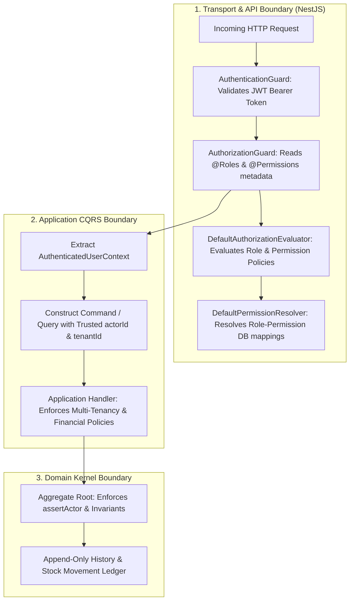

# Resources Management: Authorization & Security Baseline

**Bounded Context**: `Resources Management`  
**Sub-Domains**: `Consumable Inventory` & `Fixed Assets`  
**Milestone**: Phase 6.7 — Authorization & Security  
**Document**: Authoritative Architectural Baseline & Phase 1 Security Integration Specification  
**Status**: `APPROVED & ACTIVE`  
**Date**: August 31, 2026

---

## 1. Existing Phase 1 Security Architecture

The Kinergy platform operates on a defense-in-depth, declarative, and layered security architecture established in Phase 1 (Identity, Authentication & Security Kernel).



### Key Architectural Characteristics

1. **Separation of Authentication & Authorization**:
   - **Authentication (`AuthenticationGuard`)**: Validates cryptographic signature and validity of the Bearer JWT, building the `AuthenticatedUserContext`.
   - **Authorization (`AuthorizationGuard`)**: Acts as a thin NestJS execution guard that reads `@Roles()` and `@Permissions()` route metadata and delegates evaluation to the `IAuthorizationEvaluator` abstraction.
2. **Decoupled Evaluation**:
   - `DefaultAuthorizationEvaluator` implements policy matching logic supporting exact strings, global administrative wildcard (`*`), and namespace wildcards (e.g. `settings:*`).
   - `DefaultPermissionResolver` resolves both direct and role-assigned permissions from the database/context.
3. **Immutability & Statelessness**:
   - Security contexts (`AuthenticatedUserContext`) are immutable value objects attached to the request lifecycle (`req.user`) and available via `RequestContext.currentContext()`.

---

## 2. Authentication Flow Relevant to Backend Authorization

1. **Token Ingestion**: The client provides an `Authorization: Bearer <token>` HTTP header.
2. **Decryption & Validation**: `AuthenticationGuard` extracts the token, verifies the cryptographic signature against the secret/key provider, and checks token expiration.
3. **Context Construction**: Upon successful verification, an `AuthenticatedUserContext` is instantiated with:
   - `userId: string` (e.g. `usr_123`)
   - `email: string` (e.g. `staff@kinergy.platform`)
   - `status: string` (e.g. `ACTIVE`)
   - `roles: string[]` (e.g. `['OWNER']`, `['TRAINER']`, `['KITCHEN_STAFF']`)
   - `permissions: string[]` (e.g. `['inventory.read', 'inventory.write']`)
   - `tenantId?: string` (e.g. `tenant_flagship`)
4. **Request Attachment**: Attached to Express `req.user` and populated in async local storage via `RequestContext`.

---

## 3. Authorization Enforcement Points

Authorization in Kinergy is enforced across three distinct structural tiers:

| Tier                            | Mechanism                                                                                      | Enforcement Level           | Responsibility                                                                                                                                        |
| ------------------------------- | ---------------------------------------------------------------------------------------------- | --------------------------- | ----------------------------------------------------------------------------------------------------------------------------------------------------- |
| **Tier 1: Transport Guard**     | `@UseGuards(AuthenticationGuard, AuthorizationGuard)` with `@Permissions(...)` & `@Roles(...)` | Declarative / Pre-execution | Blocks unauthorized HTTP requests before handler execution with `401 Unauthorized` or `403 Forbidden`.                                                |
| **Tier 2: Application Handler** | `ApplicationResult` / Business Validation                                                      | Imperative / In-Use-Case    | Enforces multi-tenant isolation (`item.tenantId === command.tenantId`) and composite authorization (e.g. requiring `finance.read` to view valuation). |
| **Tier 3: Domain Aggregate**    | `assertActor(actorId)` in Aggregate Root                                                       | Invariant Assertion         | Guarantees that every physical state mutation is permanently attributed to a valid, non-empty actor ID in the append-only audit ledger.               |

---

## 4. Existing Permission Naming Conventions

The Phase 1 IAM seed catalog (`prisma/seeds/identity.seed.ts`) and platform security specifications define permissions using a standard **hierarchical dot notation**:

$$\text{<resource>}.\text{<action>}\quad\text{or}\quad\text{<resource>}.\text{<sub-resource>}.\text{<action>}$$

### Phase 1 Permission Precedents

- **Users**: `users.read`, `users.write`, `users.delete`
- **Clients**: `clients.read`, `clients.write`, `clients.delete`
- **Appointments**: `appointments.read`, `appointments.create`, `appointments.update`, `appointments.delete`
- **Kitchen**: `kitchen.read`, `kitchen.orders.manage`
- **Inventory (Legacy Consumable)**: `inventory.read`, `inventory.write`
- **Billing**: `billing.read`, `billing.write`
- **Reports**: `reports.read`, `reports.export`
- **Settings**: `settings.read`, `settings.write`
- **Identity**: `identity.roles.read`, `identity.roles.write`, `identity.permissions.read`

---

## 5. Existing Role Mapping Strategy

Permissions are persistence-managed in PostgreSQL via `Permission`, `Role`, and `RolePermission` tables and seeded via `prisma/seeds/identity.seed.ts`:

| Role Name         | Role Type | Seeded Permission Grants                                                             | Operational Scope                                                                        |
| ----------------- | --------- | ------------------------------------------------------------------------------------ | ---------------------------------------------------------------------------------------- |
| **Owner**         | `SYSTEM`  | `*` (All permissions in catalog)                                                     | Unrestricted executive and administrative access across all modules.                     |
| **Trainer**       | `SYSTEM`  | `clients.read/write`, `appointments.read/create/update`, `reports.read`              | Clinical kinesiology treatments, class instruction, and appointment tracking.            |
| **Kitchen Staff** | `SYSTEM`  | `kitchen.read`, `kitchen.orders.manage`, `inventory.read`, `inventory.write`         | Kitchen queue management, meal preparation, and food/supplement inventory replenishment. |
| **Receptionist**  | `SYSTEM`  | `clients.read/write`, `appointments.read/create/update/delete`, `billing.read/write` | Front desk check-ins, client intake, scheduling, and retail POS payment collection.      |

---

## 6. Actor Propagation Strategy

### Zero Client Trust Principle

- **No Client-Supplied IDs**: DTOs submitted in request bodies **must never** accept `actorId`, `userId`, or `tenantId`.
- **Controller Context Extraction**: The transport controller extracts the verified user identity via `@CurrentUser()` and injects it into the CQRS Command:

```typescript
@Post(':id/transfer')
@Permissions('assets.transfer')
async transferLocation(
  @Param('id') id: string,
  @Body() dto: TransferLocationDto,
  @CurrentUser() user: AuthenticatedUserContext,
) {
  return this.transferHandler.execute(
    new TransferFixedAssetLocationCommand({
      id,
      tenantId: user.tenantId, // Injected from verified JWT
      location: dto.location,
      reason: dto.reason,
      actorId: user.userId,   // Injected from verified JWT
    }),
  );
}
```

---

## 7. Existing Ownership & Business-Boundary Model

1. **Multi-Tenancy**: All resources (`InventoryItem`, `FixedAsset`, `StockMovement`, `AssetHistoryEvent`, `AssetMaintenanceRecord`) carry a mandatory `tenantId`.
2. **Tenant Isolation Invariant**: Handlers load aggregates by ID and immediately assert `aggregate.tenantId === command.tenantId`. Mismatches return `ApplicationResult.fail('Not found or unauthorized across tenant boundary')`.
3. **Actor Provability**:
   - `StockMovement.recordedByUserId`: Bound to the user executing the stock change.
   - `AssetHistoryEvent.recordedByUserId`: Bound to the user executing the lifecycle mutation.
   - `AssetMaintenanceRecord.recordedByUserId`: Bound to the user submitting the servicing record.
   - `AssetMaintenanceRecord.performedBy`: Represents the external/internal physical service technician (which may differ from the recording administrative actor).

---

## 8. Existing Sensitive-Data Protection Conventions

1. **Financial Valuation Boundary**:
   - In Kinergy, operational staff (e.g. Receptionists, Kitchen Staff, Trainers) have legitimate operational requirements to view stock levels (`inventory.read`) and asset locations (`assets.read`).
   - However, **monetary valuations** (aggregate inventory acquisition cost, balance sheet book value, capital equipment purchase invoices, and cumulative write-downs) constitute confidential commercial data.
   - **Enforcement Pattern**: Dedicated valuation queries (`GetInventoryValuationQuery`, `GetAssetValueQuery`) require composite permissions:
     - `GetInventoryValuation`: Requires `inventory.read` **AND** `billing.read` (or `finance.read`).
     - `GetAssetValue`: Requires `assets.read` **AND** `finance.read` (or `billing.read`).
2. **Response DTO Filtering**:
   - Standard operational listing DTOs (`FixedAssetSummaryDTO`, `InventoryItemSummaryDTO`) exclude cost prices and total valuation aggregates unless explicitly requested through authorized valuation endpoints.

---

## 9. Existing Security Testing Conventions

Testing in Kinergy follows a multi-tier authorization testing methodology:

1. **Guard Unit Tests** (e.g. `rooms.authorization.spec.ts`):
   - Mocks `IAuthorizationEvaluator` and `Reflector`.
   - Asserts that decorated controller handlers declare exact required permissions.
   - Asserts that missing permissions or unauthenticated requests trigger `ForbiddenException` / `UnauthorizedException`.
2. **Application Handler Invariant Tests** (e.g. `fixed-assets-workflows-qa-hardening.spec.ts`):
   - Asserts that empty `actorId` strings throw domain exceptions (`assertActor`).
   - Asserts that cross-tenant access attempts fail deterministically.
   - Asserts that generic update commands cannot bypass dedicated workflow handlers.
3. **Subsystem E2E Tests** (e.g. `identity-subsystem.e2e.spec.ts`):
   - Executes real HTTP requests against NestJS test servers with signed JWT tokens across different role personas (`Owner`, `Trainer`, `Receptionist`, `Kitchen Staff`).

---

## 10. Resources-Specific Architectural Implications

### 10.1 Consumable Inventory vs. Fixed Assets Segregation

- **Consumable Inventory**: High-frequency operational items (supplements, retail goods, treatment oils, kitchen produce) managed by Kitchen Staff, Receptionists, and Inventory Clerks.
  - Required Permissions: `inventory.read`, `inventory.write`, `inventory.adjust`.
- **Fixed Assets**: High-value capital equipment (cryo chambers, reformers, ultrasound devices, furniture) managed by Facility Managers, Lead Technicians, and Owners.
  - Required Permissions: `assets.read`, `assets.write`, `assets.transfer`, `assets.status`, `assets.condition`, `assets.maintenance`, `assets.revalue`, `assets.admin`.

### 10.2 Role Capabilities Breakdown

- **Owner**: Full access to all inventory and fixed asset operations, transfers, write-downs, and financial portfolio valuations.
- **Facility / Maintenance Manager**: `assets.read`, `assets.write`, `assets.transfer`, `assets.status`, `assets.condition`, `assets.maintenance`.
- **Technician**: `assets.read`, `assets.condition`, `assets.maintenance`, `assets.status`.
- **Kitchen Staff**: `kitchen.read`, `kitchen.orders.manage`, `inventory.read`, `inventory.write` (No access to Fixed Assets or Capital Valuation).
- **Receptionist**: `appointments.*`, `clients.*`, `billing.*`, `inventory.read`, `assets.read` (Can read locations for room assignment; cannot revalue or transfer equipment).

---

## 11. Security Risks Discovered & Mitigations

| Risk ID        | Security Risk                                |  Severity  | Root Cause                                                                                                                                                         | Architectural Mitigation                                                                                                                                    |
| -------------- | -------------------------------------------- | :--------: | ------------------------------------------------------------------------------------------------------------------------------------------------------------------ | ----------------------------------------------------------------------------------------------------------------------------------------------------------- |
| **SEC-RES-01** | **Permission Granularity Gap**               |   `HIGH`   | Seed catalog only defines legacy `inventory.read` and `inventory.write`. Dedicated Fixed Asset operations (`assets.*`) are not yet registered in IAM seed catalog. | Formally register the `Assets` and refined `Inventory` permission definitions in `PERMISSION_CATALOG` and seed mappings.                                    |
| **SEC-RES-02** | **Valuation Information Disclosure**         |   `HIGH`   | Operational staff querying asset or inventory details might observe sensitive balance sheet book values.                                                           | Segregate valuation queries into dedicated endpoints protected by `finance.read` / `billing.read`. Strip purchase prices from public summaries.             |
| **SEC-RES-03** | **Actor Impersonation via Body Overrides**   |   `HIGH`   | If controller DTOs accept `actorId`, clients could attribute mutations to other staff.                                                                             | Enforce that all controller handlers construct commands using `user.userId` extracted strictly from verified `@CurrentUser()`.                              |
| **SEC-RES-04** | **Generic Metadata Update Invariant Bypass** | `CRITICAL` | A generic `PATCH /assets/:id` could allow modifying status, location, or value without specific permissions.                                                       | Whitelist `UpdateFixedAssetDetailsCommand` strictly to `name`, `description`, `notes`. All state/location/value changes must go through dedicated handlers. |
| **SEC-RES-05** | **Terminal Asset Reactivation**              |   `HIGH`   | Malicious or accidental status changes on `SOLD` or `RETIRED` equipment.                                                                                           | Hard-lock enforced by `AssetLifecycleStateMachine` [AST-INV-1] inside domain aggregate root.                                                                |

---

## 12. Proposed Milestone 6.7 Implementation Sequence

1. **Phase 1 Alignment & Permission Catalog Registration**:
   - Update `prisma/seeds/identity.seed.ts` to register `Assets` module permissions (`assets.read`, `assets.write`, `assets.transfer`, `assets.status`, `assets.condition`, `assets.maintenance`, `assets.revalue`, `assets.admin`) and assign them to system roles according to least-privilege principles.
2. **API Controller Security & RBAC Decorators**:
   - Implement NestJS REST controllers for Resources (Consumable Inventory & Fixed Assets) in `apps/api/src/resources/controllers/`.
   - Apply `@UseGuards(AuthenticationGuard, AuthorizationGuard)` and precise `@Permissions(...)` decorators across every route.
3. **Actor Ingestion & Context Binding**:
   - Bind `@CurrentUser()` to all command constructions, guaranteeing verified `actorId` and `tenantId` propagation.
4. **Sensitive Valuation Query Protection**:
   - Protect valuation endpoints with dual-permission checks (`assets.read` / `inventory.read` + `billing.read` / `finance.read`).
5. **Authorization Test Suite**:
   - Create comprehensive unit and integration authorization test suites (`resources.authorization.spec.ts`) asserting 401/403 behavior on unauthorized role attempts.
6. **Milestone 6.7 Quality Gate & ADR**:
   - Author ADR documenting the Resources permission catalog extension and compile the Milestone 6.7 Quality Gate verification report.
