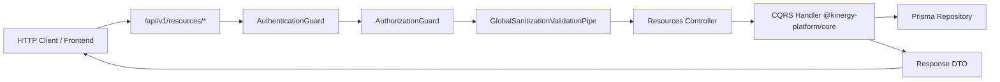

# Backend API Architecture Baseline & Conventions for Phase 6.9

**Bounded Context**: `Resources Management`  
**Sub-Domains**: `Consumable Inventory`, `Fixed Assets`, `Resource Valuation`  
**Milestone**: Phase 6.9 — Backend API Layer  
**Document**: Authoritative API Architecture Discovery, System Conventions & Gap Analysis  
**Status**: `APPROVED & ACTIVE`  
**Date**: August 31, 2026

---

## 1. Executive Summary & Architectural Directive

Phase 6.9 exposes the approved **Resources Management** application services (Consumable Inventory, Fixed Assets, and Cross-Domain Valuation) to HTTP clients via NestJS controllers.

To protect the Kinergy Platform from **API drift**, Phase 6.9 strictly conforms to existing platform-wide API conventions established across Phase 1 (IAM), Phase 2 (Clients), Phase 3 (Scheduling), and Phase 5 (Gym).

> **Architectural Law**: Phase 6 endpoints must feel like a natural continuation of the Kinergy REST API—not a parallel API framework.

---

## 2. Existing API Architecture Discovery

### 2.1 Monorepo & Module Topology

- **API Entrypoint**: [`apps/api/src/main.ts`](file:///c:/Projects/kinergy-platform/apps/api/src/main.ts) boots the NestJS application with a unified global prefix (`api/v1`), global exception filters, global sanitization pipes, and Swagger documentation at `/api/docs`.
- **Resources Module**: [`apps/api/src/resources/resources.module.ts`](file:///c:/Projects/kinergy-platform/apps/api/src/resources/resources.module.ts) encapsulates HTTP controllers, CQRS command/query handlers from `@kinergy-platform/core`, and domain repository providers.
- **Context Boundaries**: Controllers act as thin HTTP adapters that deserialize request DTOs, extract authenticated actor provenance from `@CurrentUser()`, delegate to Core Application Handlers, and serialize typed Response DTOs.



---

## 3. Controller & Route Conventions

| Architectural Element | Kinergy Platform Standard                                      | Phase 6 Resources Application                                                                                  |
| :-------------------- | :------------------------------------------------------------- | :------------------------------------------------------------------------------------------------------------- |
| **Directory Path**    | `apps/api/src/<bounded_context>/controllers/`                  | `apps/api/src/resources/controllers/`                                                                          |
| **File Naming**       | `<resource>.controller.ts`                                     | `inventory.controller.ts`, `fixed-assets.controller.ts`, `resource-valuation.controller.ts`                    |
| **Route Prefix**      | `api/v1/<bounded_context>/<resource>`                          | `api/v1/resources/inventory`, `api/v1/resources/assets`, `api/v1/resources/valuation`                          |
| **Route Versioning**  | Explicit URI path versioning (`/api/v1/...`)                   | Follows `/api/v1/resources/*`                                                                                  |
| **HTTP Verbs**        | RESTful semantics: `GET`, `POST`, `PATCH`, `DELETE`            | `GET` for queries; `POST` for creations and state transitions; `PATCH` for metadata updates                    |
| **State Mutations**   | Sub-resource action endpoints (`POST :id/<action>`)            | `POST :id/archive`, `POST :id/activate`, `POST :id/transfer`, `POST :id/status`, `POST :id/condition`          |
| **Plurality**         | Plural collections (`/assets`), aggregate roots (`/inventory`) | `/assets` for Fixed Assets; `/inventory` for Consumable Inventory; `/valuation` for Cross-Domain Balance Sheet |

---

## 4. DTO & Validation Architecture

### 4.1 Request DTO Conventions

All incoming request payloads are defined in `apps/api/src/resources/dto/` and strictly validated using `class-validator` and `class-transformer`:

```typescript
export class CreateInventoryItemRequestDto {
  @ApiProperty({ description: 'Unique Stock Keeping Unit (SKU)', example: 'PROT-WHEY-VAN-1KG' })
  @IsString()
  @MinLength(3)
  sku!: string;

  @ApiProperty({ description: 'Product title / name', example: 'Organic Grass-Fed Whey Isolate' })
  @IsString()
  @MinLength(3)
  name!: string;

  @ApiProperty({ enum: InventoryCategory, description: 'Inventory category classification' })
  @IsEnum(InventoryCategory)
  category!: InventoryCategory;

  @ApiProperty({ description: 'Purchase acquisition cost per unit', example: 25.5 })
  @IsNumber()
  @Min(0)
  unitCost!: number;

  @ApiProperty({ description: 'Retail / catalog selling price per unit', example: 45.0 })
  @IsNumber()
  @Min(0)
  sellingPrice!: number;
}
```

### 4.2 Validation Pipe Settings

Configured globally in [`GlobalSanitizationValidationPipe`](file:///c:/Projects/kinergy-platform/apps/api/src/common/pipes/global-sanitization-validation.pipe.ts):

- `whitelist: true` (strips undeclared properties)
- `forbidNonWhitelisted: true` (rejects unapproved properties with `400 Bad Request`)
- `transform: true` with `enableImplicitConversion: true`
- Input sanitization (trims strings, strips control characters, neutralizes XSS injection)

---

## 5. Authentication & Authorization Conventions

### 5.1 Defense-in-Depth Pipeline

1. **Controller-Level Guards**: Every resource controller is decorated with:
   ```typescript
   @ApiBearerAuth()
   @UseGuards(AuthenticationGuard, AuthorizationGuard)
   ```
2. **Method-Level Permissions**:
   - `@Permissions('inventory.read')` / `@Permissions('inventory.write')`
   - `@Permissions('assets.read')` / `@Permissions('assets.write')`
   - Composed Financial Valuation: `@Permissions('inventory.read', 'billing.read')`, `@Permissions('assets.read', 'billing.read')`, and `@Permissions('inventory.read', 'assets.read', 'billing.read')`
3. **Actor Provenance**:
   - Injected via `@CurrentUser() user: AuthenticatedUserContext`.
   - Tenant scoping (`user.tenantId`) is injected by the controller into the query/command—never trusted from the request body.

---

## 6. Error Response & Exception Handling Conventions

### 6.1 Standard Error Envelope

All error responses adhere to the standard Kinergy JSON error shape generated by [`GlobalExceptionFilter`](file:///c:/Projects/kinergy-platform/apps/api/src/common/filters/global-exception.filter.ts):

```json
{
  "statusCode": 403,
  "timestamp": "2026-08-31T14:30:00.000Z",
  "path": "/api/v1/resources/inventory/valuation",
  "error": {
    "statusCode": 403,
    "error": "Forbidden",
    "message": "Forbidden: Requires inventory.read AND billing.read permissions."
  }
}
```

### 6.2 HTTP Status Code Semantics

- `200 OK`: Successful read query or in-place update.
- `201 Created`: Successful creation of product, asset, or stock movement.
- `400 Bad Request`: Validation failure, negative stock violation, or invalid business payload.
- `401 Unauthorized`: Missing, invalid, or expired JWT, or inactive user account.
- `403 Forbidden`: Authenticated user lacking required RBAC/ABAC permissions.
- `404 Not Found`: Targeted item, asset, tag, or movement record does not exist.
- `409 Conflict`: Concurrency conflict (OCC version mismatch) or unique constraint violation (duplicate SKU/AssetTag).
- `422 Unprocessable Entity`: Invalid lifecycle state machine transition.

---

## 7. Pagination, Filtering, & Sorting Conventions

### 7.1 Pagination Request Parameters

Consistent across all Kinergy collection endpoints:

- `page`: 1-indexed integer (default: `1`, minimum: `1`).
- `limit` (or `pageSize`): integer (default: `20`, minimum: `1`, maximum: `100`).

### 7.2 Pagination Response Metadata

```typescript
export class PaginationMetadataDto {
  @ApiProperty({ example: 1 })
  page!: number;

  @ApiProperty({ example: 20 })
  limit!: number;

  @ApiProperty({ example: 100 })
  totalItems!: number;

  @ApiProperty({ example: 5 })
  totalPages!: number;

  @ApiProperty({ example: true })
  hasNextPage!: boolean;

  @ApiProperty({ example: false })
  hasPreviousPage!: boolean;
}
```

### 7.3 Filtering & Search Conventions

- `search`: String for case-insensitive partial text matching against name, SKU, asset tag, or description.
- `category`: Single enum value or comma-separated list of enum values.
- `status`: Single enum value or comma-separated list of enum values.
- `condition`: Single enum value or comma-separated list of enum values (Fixed Assets).
- `includeArchived` / `includeDecommissioned`: Boolean flag (`true`/`false`) to include soft-archived items.

### 7.4 Sorting Conventions

- `sortBy`: Whitelisted string enum of sortable column fields (e.g. `'name' | 'sku' | 'quantityOnHand' | 'createdAt' | 'purchaseCost'`).
- `sortOrder`: `'ASC' | 'DESC'` (default: `'ASC'`).

---

## 8. Swagger / OpenAPI Conventions

- Every controller is tagged via `@ApiTags('Resources - ...')`.
- All secured endpoints include `@ApiBearerAuth()`.
- Explicit `@ApiOperation({ summary, description })` on every route.
- Documented `@ApiResponse({ status, description, type })` for all standard outcomes (200, 201, 400, 401, 403, 404, 409).
- `@ApiParam` on path parameters with format and descriptions.

---

## 9. Phase 6 Application Capabilities Inventory

| Capability                  | Core CQRS Command / Query            | Core Handler                           | Controller Route Mapping                          |            Status             |
| :-------------------------- | :----------------------------------- | :------------------------------------- | :------------------------------------------------ | :---------------------------: |
| **Create Product**          | `CreateInventoryItemCommand`         | `CreateInventoryItemHandler`           | `POST /api/v1/resources/inventory`                |        ✅ Implemented         |
| **Update Product**          | `UpdateInventoryItemCommand`         | `UpdateInventoryItemHandler`           | `PATCH /api/v1/resources/inventory/:id`           |        ✅ Implemented         |
| **Archive Product**         | `ArchiveInventoryItemCommand`        | `ArchiveInventoryItemHandler`          | `POST /api/v1/resources/inventory/:id/archive`    |        ✅ Implemented         |
| **Activate Product**        | `ActivateInventoryItemCommand`       | `ActivateInventoryItemHandler`         | `POST /api/v1/resources/inventory/:id/activate`   |        ✅ Implemented         |
| **Deactivate Product**      | `DeactivateInventoryItemCommand`     | `DeactivateInventoryItemHandler`       | `POST /api/v1/resources/inventory/:id/deactivate` | ⚠️ Route Gap (Handler exists) |
| **Receive Stock**           | `ReceiveStockCommand`                | `ReceiveStockHandler`                  | `POST /api/v1/resources/inventory/:id/receive`    |        ✅ Implemented         |
| **Sell Stock (POS)**        | `SellStockCommand`                   | `SellStockHandler`                     | `POST /api/v1/resources/inventory/:id/sell`       |        ✅ Implemented         |
| **Consume Stock**           | `ConsumeStockCommand`                | `ConsumeStockHandler`                  | `POST /api/v1/resources/inventory/:id/consume`    |        ✅ Implemented         |
| **Scrap Stock**             | `ScrapStockCommand`                  | `ScrapStockHandler`                    | `POST /api/v1/resources/inventory/:id/scrap`      | ⚠️ Route Gap (Handler exists) |
| **Adjust Stock**            | `AdjustStockCommand`                 | `AdjustStockHandler`                   | `POST /api/v1/resources/inventory/:id/adjust`     |        ✅ Implemented         |
| **Get Product by ID**       | `GetInventoryItemByIdQuery`          | `GetInventoryItemByIdHandler`          | `GET /api/v1/resources/inventory/:id`             |        ✅ Implemented         |
| **List Products**           | `ListInventoryItemsQuery`            | `ListInventoryItemsHandler`            | `GET /api/v1/resources/inventory`                 |        ✅ Implemented         |
| **Get Stock Level**         | `GetStockLevelQuery`                 | `GetStockLevelHandler`                 | `GET /api/v1/resources/inventory/:id/stock-level` |        ✅ Implemented         |
| **List Movements**          | `ListStockMovementsQuery`            | `ListStockMovementsHandler`            | `GET /api/v1/resources/inventory/:id/movements`   |        ✅ Implemented         |
| **Get Low Stock**           | `GetLowStockItemsQuery`              | `GetLowStockItemsHandler`              | `GET /api/v1/resources/inventory/low-stock`       |        ✅ Implemented         |
| **Get Inventory Value**     | `GetInventoryValuationQuery`         | `GetInventoryValuationHandler`         | `GET /api/v1/resources/inventory/valuation`       |        ✅ Implemented         |
| **Create Asset**            | `CreateFixedAssetCommand`            | `CreateFixedAssetHandler`              | `POST /api/v1/resources/assets`                   |        ✅ Implemented         |
| **Update Asset Details**    | `UpdateFixedAssetDetailsCommand`     | `UpdateFixedAssetDetailsHandler`       | `PATCH /api/v1/resources/assets/:id`              |        ✅ Implemented         |
| **Transfer Asset**          | `TransferFixedAssetLocationCommand`  | `TransferFixedAssetLocationHandler`    | `POST /api/v1/resources/assets/:id/transfer`      |        ✅ Implemented         |
| **Change Asset Status**     | `ChangeFixedAssetStatusCommand`      | `ChangeFixedAssetStatusHandler`        | `POST /api/v1/resources/assets/:id/status`        |        ✅ Implemented         |
| **Change Asset Condition**  | `UpdateFixedAssetConditionCommand`   | `UpdateFixedAssetConditionHandler`     | `POST /api/v1/resources/assets/:id/condition`     |        ✅ Implemented         |
| **Record Maintenance**      | `RecordAssetMaintenanceCommand`      | `RecordAssetMaintenanceHandler`        | `POST /api/v1/resources/assets/:id/maintenance`   |        ✅ Implemented         |
| **Update Asset Value**      | `UpdateFixedAssetValuationCommand`   | `UpdateFixedAssetValuationHandler`     | `POST /api/v1/resources/assets/:id/valuation`     |        ✅ Implemented         |
| **Get Asset by ID**         | `GetFixedAssetByIdQuery`             | `GetFixedAssetByIdHandler`             | `GET /api/v1/resources/assets/:id`                |        ✅ Implemented         |
| **Get Asset by Tag**        | `GetFixedAssetByTagQuery`            | `GetFixedAssetByTagHandler`            | `GET /api/v1/resources/assets/tag/:tag`           | ⚠️ Route Gap (Handler exists) |
| **List Assets**             | `ListFixedAssetsQuery`               | `ListFixedAssetsHandler`               | `GET /api/v1/resources/assets`                    |        ✅ Implemented         |
| **Get Asset History**       | `GetAssetHistoryQuery`               | `GetAssetHistoryHandler`               | `GET /api/v1/resources/assets/:id/history`        |        ✅ Implemented         |
| **Get Maintenance History** | `GetMaintenanceHistoryQuery`         | `GetMaintenanceHistoryHandler`         | `GET /api/v1/resources/assets/:id/maintenance`    |        ✅ Implemented         |
| **Get Asset Value**         | `GetAssetValueQuery`                 | `GetAssetValueHandler`                 | `GET /api/v1/resources/assets/:id/valuation`      |        ✅ Implemented         |
| **Get Asset Summary Value** | `GetFixedAssetValuationSummaryQuery` | `GetFixedAssetValuationSummaryHandler` | `GET /api/v1/resources/assets/valuation/summary`  |        ✅ Implemented         |
| **Get Combined Valuation**  | `GetCombinedResourceValuationQuery`  | `GetCombinedResourceValuationHandler`  | `GET /api/v1/resources/valuation/summary`         |        ✅ Implemented         |

---

## 10. API Gap Analysis

### 10.1 Identified Route Gaps

1. **Deactivate Inventory Product (`POST /api/v1/resources/inventory/:id/deactivate`)**:
   - `DeactivateInventoryItemHandler` exists in Core but was not explicitly mapped as a route in `inventory.controller.ts`.
2. **Scrap Stock (`POST /api/v1/resources/inventory/:id/scrap`)**:
   - `ScrapStockHandler` exists in Core for damaged/spoiled inventory disposal with ledger logging, but lacks an HTTP route in `inventory.controller.ts`.
3. **Get Asset by Tag (`GET /api/v1/resources/assets/tag/:tag`)**:
   - `GetFixedAssetByTagHandler` exists in Core for barcode/RFID barcode scanning, but lacks an explicit endpoint in `fixed-assets.controller.ts`.

### 10.2 Intentionally Omitted Capabilities

- **Category Dynamic CRUD (`/api/v1/resources/categories`)**:
  - `InventoryCategory` and `AssetCategory` are strictly code-defined domain enums (governed by [ADR-0088](./adr/0088-inventory-category-classification-strategy.md) and [ADR-0090](./adr/0090-fixed-asset-classification-lifecycle-state-and-condition-rating-strategy.md)).
  - Dynamic category mutation is intentionally prohibited to prevent unclassified balance sheet anomalies.

---

## 11. Explicit Constraints for Phase 6.9 Implementation

1. **No Invented DTO Envelopes**: All collection and paginated queries must return `{ items, pagination }` conforming to standard `PaginationMetadataDto`.
2. **Strict Multi-Permission Valuation**: All valuation endpoints must maintain composed permission guards (`inventory.read + billing.read`, `assets.read + billing.read`, and `inventory.read + assets.read + billing.read`).
3. **Zero Controller Business Logic**: Controllers must only map DTOs to Core Commands/Queries and translate `Result<T, E>` into standard HTTP responses or exceptions.
4. **Idempotency & Non-Negative Invariants**: All stock mutations must be protected by the double-entry movement ledger and non-negative stock invariants.
5. **No Denormalized Aggregates**: No endpoint may attempt to persist or cache aggregate balance sheet numbers in tenant or facility records.
