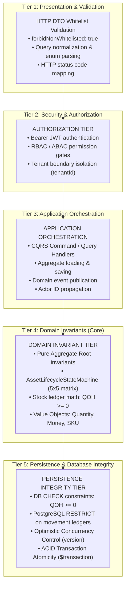

# Resources Management — Executable Business Rules & Invariants Specification

- **Status**: Authoritative Behavioral Contract Baseline (APPROVED & EXECUTABLE)
- **Bounded Context**: Resources Management (`packages/core/src/resources/`, `apps/api/src/resources/`)
- **Sub-Domains**: Consumable Inventory & Fixed Assets
- **Author**: Principal Software Architect & Lead Domain Engineer
- **Governing ADRs**: [ADR-0081](./adr/0081-resources-bounded-context-topology-and-domain-segregation.md) through [ADR-0106](./adr/0106-sales-inventory-integration-boundary-and-stock-ownership-policy.md)

---

## 1. Architectural Responsibility & Invariant Tiers

To maintain strict Clean Architecture boundaries and eliminate misplaced domain logic, all business rules within Resources Management are classified into five explicit architectural tiers:



---

## 2. Consumable Inventory Invariants & Business Rules

### 2.1 Product & Catalog Item Rules

| Rule ID       | Rule Statement                                                                                                                                                                                                          | Architectural Layer                | Enforcement Mechanism                                                                                                                           |
| :------------ | :---------------------------------------------------------------------------------------------------------------------------------------------------------------------------------------------------------------------- | :--------------------------------- | :---------------------------------------------------------------------------------------------------------------------------------------------- |
| **`PROD-01`** | **SKU Format Invariant `[INV-INV-1]`**: Every inventory item must possess a standardized alphanumeric SKU matching `^[A-Z0-9_-]{3,50}$`.                                                                                | `DOMAIN INVARIANT`                 | [`SKU`](file:///c:/Projects/kinergy-platform/packages/core/src/resources/domain/inventory/value-objects/sku.vo.ts) Value Object.                |
| **`PROD-02`** | **SKU Tenant Uniqueness**: An SKU must be unique per tenant across all catalog statuses (`ACTIVE`, `INACTIVE`, `ARCHIVED`).                                                                                             | `PERSISTENCE INTEGRITY`            | Database unique index `UNIQUE(tenant_id, sku)`.                                                                                                 |
| **`PROD-03`** | **Item Name Length**: Product display name must be non-empty and between 2 and 120 characters.                                                                                                                          | `DOMAIN INVARIANT`                 | `InventoryItem.create()`.                                                                                                                       |
| **`PROD-04`** | **Catalog State Taxonomy**: Allowed statuses are strictly: `ACTIVE`, `INACTIVE`, `ARCHIVED`.                                                                                                                            | `DOMAIN INVARIANT`                 | [`InventoryItemStatus`](file:///c:/Projects/kinergy-platform/packages/core/src/resources/domain/inventory/enums/inventory-item-status.enum.ts). |
| **`PROD-05`** | **Operational State Guard**: Mutations (`PURCHASE`, `SALE`, `CONSUMPTION`, `SCRAP`, `ADJUSTMENT`) are strictly forbidden on `INACTIVE` or `ARCHIVED` items.                                                             | `DOMAIN INVARIANT`                 | `InventoryItem.assertActiveCatalogStatus()` throws `InvalidInventoryItemStateException`.                                                        |
| **`PROD-06`** | **Minimum Stock Non-Negative `[INV-INV-3]`**: Minimum safety stock threshold must be a non-negative decimal quantity ($\ge 0.00$).                                                                                      | `DOMAIN INVARIANT`                 | [`Quantity`](file:///c:/Projects/kinergy-platform/packages/core/src/resources/domain/inventory/value-objects/quantity.vo.ts) Value Object.      |
| **`PROD-07`** | **Low Stock Operational Invariant**: When $\text{quantityOnHand} \le \text{minimumStock}$ (including the exact equality case), the item enters low-stock standing and triggers a `LowStockThresholdReachedDomainEvent`. | `DOMAIN INVARIANT` & `APPLICATION` | `InventoryItem.checkAndRaiseLowStockAlert()`; evaluated in queries via `get-low-stock-items.query.ts`.                                          |

### 2.2 Stock Mutation & Movement Invariants

| Rule ID      | Rule Statement                                                                                                                                                                                                                                                  | Architectural Layer                | Enforcement Mechanism                                                                             |
| :----------- | :-------------------------------------------------------------------------------------------------------------------------------------------------------------------------------------------------------------------------------------------------------------- | :--------------------------------- | :------------------------------------------------------------------------------------------------ |
| **`STK-01`** | **Strict Non-Negative Balance `[INV-INV-2]`**: Stock on hand can never drop below zero under any circumstance: $$\text{quantityOnHand} \ge 0.00$$                                                                                                               | `DOMAIN INVARIANT` & `PERSISTENCE` | `Quantity.of()` throws `InvalidQuantityException`; PostgreSQL `CHECK (quantity_on_hand >= 0.00)`. |
| **`STK-02`** | **Purchase Receipt (`PURCHASE`)**: Increases physical stock balance: $\text{QOH}_{\text{new}} = \text{QOH}_{\text{prior}} + \Delta Q$. Requires positive quantity ($> 0.00$) and receipt reason.                                                                | `DOMAIN INVARIANT`                 | `InventoryItem.receiveStock()`.                                                                   |
| **`STK-03`** | **Retail Sale (`SALE`)**: Decreases physical stock balance: $\text{QOH}_{\text{new}} = \text{QOH}_{\text{prior}} - \Delta Q$. Allowed only when item is `ACTIVE` and $\text{QOH} \ge \Delta Q$. Throws `InsufficientStockException` if $\Delta Q > \text{QOH}$. | `DOMAIN INVARIANT`                 | `InventoryItem.sellStock()`.                                                                      |
| **`STK-04`** | **Clinical Consumption (`CONSUMPTION`)**: Decreases physical stock balance: $\text{QOH}_{\text{new}} = \text{QOH}_{\text{prior}} - \Delta Q$. Requires treatment or operational correlation ID. Throws `InsufficientStockException` if $\Delta Q > \text{QOH}$. | `DOMAIN INVARIANT`                 | `InventoryItem.consumeStock()`.                                                                   |
| **`STK-05`** | **Positive Adjustment (`ADJUSTMENT_IN`)**: Increases stock balance: $\text{QOH}_{\text{new}} = \text{QOH}_{\text{prior}} + \Delta Q$. Used for audited cycle count discoveries. Requires explanation note.                                                      | `DOMAIN INVARIANT`                 | `InventoryItem.adjustStockIn()`.                                                                  |
| **`STK-06`** | **Negative Adjustment (`ADJUSTMENT_OUT`)**: Decreases stock balance: $\text{QOH}_{\text{new}} = \text{QOH}_{\text{prior}} - \Delta Q$. Throws `InsufficientStockException` if $\Delta Q > \text{QOH}$.                                                          | `DOMAIN INVARIANT`                 | `InventoryItem.adjustStockOut()`.                                                                 |
| **`STK-07`** | **Disposal Write-Off (`SCRAP`)**: Decreases physical stock balance: $\text{QOH}_{\text{new}} = \text{QOH}_{\text{prior}} - \Delta Q$. Used for spoiled, expired, or contaminated items. Throws `InsufficientStockException` if $\Delta Q > \text{QOH}$.         | `DOMAIN INVARIANT`                 | `InventoryItem.scrapStock()`.                                                                     |
| **`STK-08`** | **Audit Baseline Correction (`CORRECTION`)**: Sets $\text{QOH}_{\text{new}} = Q_{\text{target}}$. Records signed delta: $\Delta Q = Q_{\text{target}} - Q_{\text{prior}}$. Restricted to authorized audit managers.                                             | `DOMAIN INVARIANT`                 | `InventoryItem.correctStock()`.                                                                   |
| **`STK-09`** | **Atomic Ledger Creation**: Every successful stock mutation produces exactly one corresponding immutable `StockMovement` ledger entry.                                                                                                                          | `DOMAIN INVARIANT` & `PERSISTENCE` | Atomic transaction in `PrismaInventoryItemRepository.save()`.                                     |
| **`STK-10`** | **Zero Phantom Movements**: Any rejected mutation (due to insufficient stock, OCC collision, or auth failure) aborts completely, creating zero movement records and causing zero balance drift.                                                                 | `PERSISTENCE INTEGRITY`            | ACID Transaction Rollback (`$transaction`).                                                       |
| **`STK-11`** | **Fundamental Historical Parity**: Current stock is mathematically verifiable at all times by summing all historical ledger movements: $$\text{quantityOnHand} \equiv \sum_{i=1}^{n} \text{quantityDelta}_i$$                                                   | `DOMAIN INVARIANT` & `PERSISTENCE` | Reconstitution test verification (`inventory-stock-mutation-invariants.spec.ts`).                 |

### 2.3 Inventory Working Capital Valuation Invariant

$$\text{\bf Consumable Inventory Valuation} = \sum_{i \in \text{Items}} (\text{currentStock}_i \times \text{purchaseCostAmount}_i)$$

- **Status Inclusion Policy**:
  - **By Default (`includeArchived: false`)**: Applies to all items in **`ACTIVE`** and **`INACTIVE`** statuses. Inactive products physically remain in the warehouse or shelf and represent committed working capital until sold, consumed, or scrapped.
  - **Archived Items**: Excluded from default valuation queries. Included only when `includeArchived: true` is explicitly passed.
- **Arithmetic Precision**: Calculated using **exact integer-cents arithmetic** ($\text{round}(Q \times \text{cost} \times 100)$) before summing, completely eliminating floating-point rounding errors.

---

## 3. Fixed Assets Invariants & Business Rules

### 3.1 Taxonomy & Valid Classifications

- **Valid Operational Statuses (`AssetStatus`)**:
  - `ACTIVE`: Commissioned and operational for gym members or patients.
  - `UNDER_MAINTENANCE`: Temporarily taken offline for servicing, preventive overhaul, or calibration.
  - `DAMAGED`: Impaired due to breakdown or safety hazard pending evaluation.
  - `RETIRED`: Decommissioned due to age or obsolescence. Prohibits transfers and maintenance.
  - `SOLD`: **Terminal State `[AST-INV-1]`**. Permanently liquidated. Prohibits all future mutations.
- **Valid Condition Ratings (`AssetCondition`)**:
  - `EXCELLENT` (Rank 1): Pristine, like-new condition, zero wear.
  - `GOOD` (Rank 2): Normal operational wear, fully functional.
  - `FAIR` (Rank 3): Noticeable cosmetic/mechanical wear; nearing scheduled servicing.
  - `NEEDS_REPAIR` (Rank 4): Unserviceable; requires prompt technician intervention.
  - `OUT_OF_SERVICE` (Rank 5): Complete breakdown or safety hazard; prohibited from operation.
- **Valid Categories (`AssetCategory`)**:
  - `GYM_EQUIPMENT`, `THERAPY_EQUIPMENT`, `KITCHEN_EQUIPMENT`, `OFFICE_FURNITURE`, `ELECTRONICS`, `CLEANING_EQUIPMENT`.

---

### 3.2 Authoritative 5x5 Lifecycle State Transition Matrix

The `AssetLifecycleStateMachine` strictly enforces the allowed operational transitions between lifecycle states:

```
From \ To            ACTIVE    UNDER_MAINTENANCE   DAMAGED   RETIRED     SOLD
─────────────────────────────────────────────────────────────────────────────
ACTIVE                 —            ALLOWED        ALLOWED   ALLOWED    ALLOWED
UNDER_MAINTENANCE   ALLOWED            —           ALLOWED   ALLOWED    ALLOWED
DAMAGED             ALLOWED         ALLOWED           —      ALLOWED    ALLOWED
RETIRED            FORBIDDEN       FORBIDDEN      FORBIDDEN     —       ALLOWED
SOLD (Terminal)    FORBIDDEN       FORBIDDEN      FORBIDDEN  FORBIDDEN     —
```

- **Terminal Sink Rule `[AST-INV-1]`**: Once an asset enters `SOLD`, it can **never** transition to any other state. All attempts to change status, transfer location, record maintenance, or update valuation on a `SOLD` asset are unconditionally rejected.
- **Retirement Rule**: An asset in `RETIRED` cannot return to active service, maintenance, or damaged states. It may only transition to `SOLD` (liquidation).

---

### 3.3 Fixed Asset Operation Invariants

| Rule ID          | Statement                                                                                                                                                                                                                                   | Architectural Layer     | Enforcement Mechanism                                                                                                                           |
| :--------------- | :------------------------------------------------------------------------------------------------------------------------------------------------------------------------------------------------------------------------------------------ | :---------------------- | :---------------------------------------------------------------------------------------------------------------------------------------------- |
| **`AST-TRF-01`** | **Location Transfer Eligibility `[AST-INV-2]`**: Transfers are allowed **only** when an asset is in `ACTIVE`, `UNDER_MAINTENANCE`, or `DAMAGED` status.                                                                                     | `DOMAIN INVARIANT`      | `FixedAsset.transferLocation()` throws `InvalidAssetStateException` if status is `RETIRED` or `SOLD`.                                           |
| **`AST-TRF-02`** | **Transfer Anti-Noise Suppression**: Attempting to transfer an asset to its current location is a no-op; it does not increment version and produces no audit event.                                                                         | `DOMAIN INVARIANT`      | `FixedAsset.transferLocation()` equality check.                                                                                                 |
| **`AST-TRF-03`** | **Transfer Audit Side Effect**: A valid transfer updates `location` and appends an immutable `TRANSFERRED` `AssetHistoryEvent` recording `{ priorLocation, newLocation, reason }`.                                                          | `DOMAIN INVARIANT`      | Atomic aggregate method execution.                                                                                                              |
| **`AST-MNT-01`** | **Maintenance Servicing Eligibility `[AST-INV-4]`**: Servicing logs can be added **only** to assets in `ACTIVE`, `UNDER_MAINTENANCE`, or `DAMAGED` status. Forbidden on `RETIRED` or `SOLD`.                                                | `DOMAIN INVARIANT`      | `FixedAsset.recordMaintenance()` throws `InvalidAssetStateException`.                                                                           |
| **`AST-MNT-02`** | **Automatic Status Restoration**: If maintenance is recorded on an `UNDER_MAINTENANCE` or `DAMAGED` asset, and the resulting condition is serviceable (`EXCELLENT`, `GOOD`, `FAIR`), the asset's status automatically restores to `ACTIVE`. | `DOMAIN INVARIANT`      | `FixedAsset.recordMaintenance()` status auto-reconciliation.                                                                                    |
| **`AST-MNT-03`** | **Maintenance Immutability**: Historical maintenance records in `asset_maintenance_records` cannot be edited or deleted (`onDelete: Restrict`).                                                                                             | `PERSISTENCE INTEGRITY` | Database relational mapping.                                                                                                                    |
| **`AST-VAL-01`** | **Asset Valuation Non-Negative**: `purchaseValue` and `currentEstimatedValue` must be non-negative `Money` amounts ($\ge 0.00$).                                                                                                            | `DOMAIN INVARIANT`      | [`Money`](file:///c:/Projects/kinergy-platform/packages/core/src/resources/domain/inventory/value-objects/money.vo.ts) Value Object validation. |
| **`AST-VAL-02`** | **Revaluation Audit**: Updating `currentEstimatedValue` is allowed for any non-sold asset and appends a `VALUE_UPDATED` `AssetHistoryEvent`. Forbidden on `SOLD` assets.                                                                    | `DOMAIN INVARIANT`      | `FixedAsset.updateEstimatedValue()`.                                                                                                            |

---

### 3.4 Fixed Asset Carrying Valuation Policy (ADR-0097)

$$\text{\bf Fixed Asset Carrying Value} = \sum_{a \in \text{Assets}} \text{currentEstimatedValue}_a$$

- **Inclusion Rules**:
  - `ACTIVE`: **INCLUDED**. Capital equipment in active operational use.
  - `UNDER_MAINTENANCE`: **INCLUDED**. Equipment offline for servicing remains a capital facility asset.
  - `DAMAGED`: **INCLUDED**. Impaired equipment retains its estimated residual/salvage carrying value.
- **Exclusion Rules ($0.00 Contribution)**:
  - `RETIRED`: **EXCLUDED ($0.00)**. Fully decommissioned from the operational balance sheet.
  - `SOLD`: **EXCLUDED ($0.00)**. Property rights liquidated and transferred away from the facility.
- **Arithmetic Precision**: Evaluated using integer-cents arithmetic to prevent fractional cent drift.

---

## 4. Combined Resource Value

$$\text{\bf Combined Resource Value} = \text{\bf Consumable Inventory Value} + \text{\bf Fixed Asset Carrying Value}$$

- **Strict Separation Invariant ([ADR-0102](./adr/0102-resource-overview-synthesized-read-query-architecture.md))**:
  - Consumable supplies and Fixed assets represent fundamentally distinct economic classes.
  - The Combined Resource Value is a synthesized presentation metric.
  - Under no circumstances may Consumables and Assets be merged into a single database table or called simply "Inventory."

---

## 5. Authorization & Permission Governance Matrix

Every Phase 6 operation is strictly protected by Phase 1 IAM infrastructure:

| Endpoint Route                               | HTTP Method | Required Permissions                            | Purpose & Scope                                                                   |
| :------------------------------------------- | :---------: | :---------------------------------------------- | :-------------------------------------------------------------------------------- |
| `/api/v1/resources/inventory`                |    `GET`    | `inventory.read`                                | Browse inventory catalog with filters and pagination.                             |
| `/api/v1/resources/inventory/:id`            |    `GET`    | `inventory.read`                                | Retrieve single inventory item details.                                           |
| `/api/v1/resources/inventory/low-stock`      |    `GET`    | `inventory.read`                                | Inspect operational low-stock attention items ($\text{QOH} \le \text{minStock}$). |
| `/api/v1/resources/inventory/:id/movements`  |    `GET`    | `inventory.read`                                | View immutable audit ledger for a specific SKU.                                   |
| `/api/v1/resources/inventory/valuation`      |    `GET`    | `inventory.read`, `billing.read`                | Access sensitive inventory financial valuation totals.                            |
| `/api/v1/resources/inventory`                |   `POST`    | `inventory.write`                               | Register new inventory SKU.                                                       |
| `/api/v1/resources/inventory/:id`            |   `PATCH`   | `inventory.write`                               | Update catalog metadata, reorder thresholds, or pricing.                          |
| `/api/v1/resources/inventory/:id/receive`    |   `POST`    | `inventory.write`                               | Record purchase stock receipt (`PURCHASE`).                                       |
| `/api/v1/resources/inventory/:id/sell`       |   `POST`    | `inventory.write`                               | Record counter retail sale (`SALE`).                                              |
| `/api/v1/resources/inventory/:id/consume`    |   `POST`    | `inventory.write`                               | Record clinical/facility usage (`CONSUMPTION`).                                   |
| `/api/v1/resources/inventory/:id/scrap`      |   `POST`    | `inventory.write`                               | Record disposal of spoiled or broken stock (`SCRAP`).                             |
| `/api/v1/resources/inventory/:id/adjust`     |   `POST`    | `inventory.write`                               | Record audited inventory reconciliation adjustments.                              |
| `/api/v1/resources/assets`                   |    `GET`    | `assets.read`                                   | Browse fixed asset registry with filters and pagination.                          |
| `/api/v1/resources/assets/:id`               |    `GET`    | `assets.read`                                   | Retrieve single fixed asset details.                                              |
| `/api/v1/resources/assets/:id/history`       |    `GET`    | `assets.read`                                   | View chronological audit timeline for an asset.                                   |
| `/api/v1/resources/assets/:id/maintenance`   |    `GET`    | `assets.read`                                   | Inspect maintenance and servicing logs.                                           |
| `/api/v1/resources/assets/valuation/summary` |    `GET`    | `assets.read`, `billing.read`                   | Access sensitive capital asset valuation totals.                                  |
| `/api/v1/resources/assets/:id/valuation`     |    `GET`    | `assets.read`, `billing.read`                   | Inspect individual asset valuation and depreciation.                              |
| `/api/v1/resources/assets`                   |   `POST`    | `assets.write`                                  | Register new capital asset.                                                       |
| `/api/v1/resources/assets/:id`               |   `PATCH`   | `assets.write`                                  | Update asset description or operational notes.                                    |
| `/api/v1/resources/assets/:id/status`        |   `POST`    | `assets.write`                                  | Transition lifecycle state (enforces 5x5 matrix).                                 |
| `/api/v1/resources/assets/:id/condition`     |   `POST`    | `assets.write`                                  | Update physical condition rating.                                                 |
| `/api/v1/resources/assets/:id/transfer`      |   `POST`    | `assets.write`                                  | Transfer physical placement location.                                             |
| `/api/v1/resources/assets/:id/maintenance`   |   `POST`    | `assets.write`                                  | Log servicing, calibration, or repair expenditure.                                |
| `/api/v1/resources/assets/:id/valuation`     |   `POST`    | `assets.write`, `billing.read`                  | Record official economic revaluation.                                             |
| `/api/v1/resources/overview`                 |    `GET`    | `inventory.read`, `assets.read`, `billing.read` | Executive dashboard: Combined metrics and valuations.                             |
| `/api/v1/resources/valuation/summary`        |    `GET`    | `inventory.read`, `assets.read`, `billing.read` | Synthesized combined valuation endpoint.                                          |

---

## 6. Concurrency & Race Condition Defense Strategy

### 6.1 What is Protected & Why

The platform protects the **integrity of physical stock balances (`quantityOnHand`)** and **preventing negative stock balances**.

In a fast-paced sports and wellness clinic:

- Multiple front-desk receptionists may simultaneously process sales of the last remaining units of a retail supplement.
- Clinical therapists may concurrently log consumption of therapeutic tape while reception records a purchase receipt.

Without concurrency protection, standard read-modify-write interleavings would cause **lost updates** and allow physical stock to drop below zero, creating phantom inventory and unfulfillable physical transactions.

```
THREAD A (Sell 2 units)           THREAD B (Sell 2 units)           DATABASE (Balance = 2)
──────────────────────────────────────────────────────────────────────────────────────────
Read Balance (2, Version 1)       Read Balance (2, Version 1)       Balance = 2, Version = 1
Check 2 >= 2 (OK)                 Check 2 >= 2 (OK)
Deduct 2 -> Balance = 0           Deduct 2 -> Balance = 0
Commit UPDATE (Version 1 -> 2) ───────────────────────────────────► Balance = 0, Version = 2
                                  Commit UPDATE (Version 1 -> 2) ──► CONFLICT DETECTED!
                                                                     (Expected Version 1,
                                                                      Found Version 2)
                                                                     ABORT & ROLLBACK!
```

---

### 6.2 The Dual-Layer Defense Mechanism

#### Layer 1: Optimistic Concurrency Control (OCC)

- Both `InventoryItem` and `FixedAsset` maintain an integer `version` field (initialized at `1`).
- When saving an aggregate, the repository executes an atomic version check:
  ```sql
  UPDATE inventory_items
  SET quantity_on_hand = :newQty, version = :priorVersion + 1, ...
  WHERE id = :id AND version = :priorVersion;
  ```
- If a competing transaction committed first, `:priorVersion` does not match, affecting `0` rows (`count === 0`).
- The repository immediately aborts and throws `OptimisticLockException('InventoryItem', id, priorVersion)`.
- The exception bubbles up to the presentation layer and is mapped to `HTTP 409 Conflict`.

#### Layer 2: PostgreSQL Database Engine CHECK Constraint

- Even if an application bug, bypass vector, or direct SQL script bypassed the domain layer, the relational database guarantees that stock can never become negative:
  ```sql
  ALTER TABLE inventory_items
  ADD CONSTRAINT chk_inventory_items_qoh_non_negative
  CHECK (quantity_on_hand >= 0.00);
  ```
- Any write attempting to force `quantity_on_hand < 0` is rejected with a fatal database constraint violation.

---

### 6.3 Expected Consistency Guarantees

1. **ACID Unit of Work**:
   - `PrismaInventoryItemRepository.save()` executes the stock balance update and the append-only `stock_movements` insertion within a single Prisma interactive transaction (`this.prisma.$transaction(...)`).
2. **Zero Partial Failures / Zero Phantoms**:
   - If writing to `stock_movements` fails, the `quantityOnHand` change is rolled back.
   - If the version check fails, no movement row is created.
3. **Deterministic Double-Entry Equality**:
   - Physical balance on hand is provably reconstructible from the movement ledger at any point in time:
     $$\text{quantityOnHand} \equiv \sum_{i=1}^{n} \text{quantityDelta}_i$$
