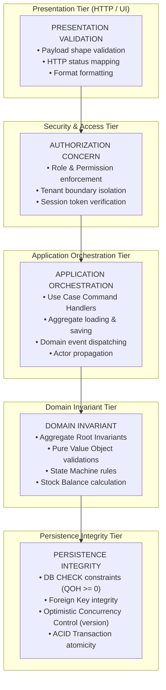

# Resources Management — Executable Business Rules & Invariants Specification

**Document Version**: 1.0.0  
**Status**: APPROVED & EXECUTABLE  
**Context**: Kinergy Platform — Resources Bounded Context (Consumable Inventory Subsystem)  
**Author**: Staff Domain & Backend Engineering

---

## 1. Architectural Responsibility Boundaries

To maintain strict Clean Architecture boundaries and avoid misplaced domain logic, all rules within the Resources Management domain are classified into five explicit architectural tiers:

---

## 2. Product Rules (Catalog Items)

| Rule ID     | Statement                                                                                                             | Architectural Layer                                   | Enforcement Mechanism                                                                                                                                                                                                              |
| :---------- | :-------------------------------------------------------------------------------------------------------------------- | :---------------------------------------------------- | :--------------------------------------------------------------------------------------------------------------------------------------------------------------------------------------------------------------------------------- |
| **PROD-01** | Every inventory product must possess a globally non-empty, alphanumeric SKU.                                          | `DOMAIN INVARIANT`                                    | [`SKU`](file:///c:/Projects/kinergy-platform/packages/core/src/resources/domain/inventory/value-objects/sku.vo.ts) Value Object (regex: `^[A-Z0-9_-]{3,32}$`).                                                                     |
| **PROD-02** | SKU must be unique per tenant across all active, inactive, and archived products.                                     | `APPLICATION ORCHESTRATION` & `PERSISTENCE INTEGRITY` | `InventoryItemRepository.findBySku()` check + DB unique index `UNIQUE(tenant_id, sku)`.                                                                                                                                            |
| **PROD-03** | Product display name must be non-empty and between 2 and 120 characters.                                              | `DOMAIN INVARIANT`                                    | [`InventoryItem.create()`](file:///c:/Projects/kinergy-platform/packages/core/src/resources/domain/inventory/inventory-item.aggregate.ts).                                                                                         |
| **PROD-04** | Product lifecycle states are strictly governed: `ACTIVE`, `INACTIVE`, `ARCHIVED`.                                     | `DOMAIN INVARIANT`                                    | [`InventoryItemStatus`](file:///c:/Projects/kinergy-platform/packages/core/src/resources/domain/inventory/enums/inventory-item-status.enum.ts) enum.                                                                               |
| **PROD-05** | Mutations (`PURCHASE`, `SALE`, `CONSUMPTION`, `ADJUSTMENT`) are strictly forbidden on `INACTIVE` or `ARCHIVED` items. | `DOMAIN INVARIANT`                                    | `InventoryItem.assertActiveCatalogStatus()` throws [`InvalidInventoryItemStateException`](file:///c:/Projects/kinergy-platform/packages/core/src/resources/domain/inventory/exceptions/invalid-inventory-item-state.exception.ts). |
| **PROD-06** | Minimum safety stock threshold must be a non-negative decimal quantity ($\ge 0.00$).                                  | `DOMAIN INVARIANT`                                    | [`Quantity`](file:///c:/Projects/kinergy-platform/packages/core/src/resources/domain/inventory/value-objects/quantity.vo.ts) Value Object.                                                                                         |
| **PROD-07** | When `quantityOnHand <= minimumStock`, a `LowStockThresholdReachedDomainEvent` is raised.                             | `DOMAIN INVARIANT`                                    | `InventoryItem.checkAndRaiseLowStockAlert()`.                                                                                                                                                                                      |

---

## 3. Category Rules

| Rule ID    | Statement                                                                                                                                                                                      | Architectural Layer | Enforcement Mechanism                                                                                                                           |
| :--------- | :--------------------------------------------------------------------------------------------------------------------------------------------------------------------------------------------- | :------------------ | :---------------------------------------------------------------------------------------------------------------------------------------------- |
| **CAT-01** | Inventory category classification is closed and code-defined via domain enum.                                                                                                                  | `DOMAIN INVARIANT`  | [`InventoryCategory`](file:///c:/Projects/kinergy-platform/packages/core/src/resources/domain/inventory/enums/inventory-category.enum.ts) enum. |
| **CAT-02** | The minimum canonical categories are: `HEALTHY_MEALS`, `HEALTHY_DRINKS`, `CLEANING_SUPPLIES`, `OFFICE_SUPPLIES`, `SUPPLEMENTS`, `CLINICAL_SUPPLIES`, `THERAPY_CONSUMABLES`, `RETAIL_PRODUCTS`. | `DOMAIN INVARIANT`  | `INVENTORY_CATEGORY_REGISTRY` metadata map.                                                                                                     |
| **CAT-03** | Retail sales operations are restricted to categories flagged `isRetailEligible: true`.                                                                                                         | `DOMAIN INVARIANT`  | `INVENTORY_CATEGORY_REGISTRY[category].isRetailEligible`.                                                                                       |
| **CAT-04** | Categorization cannot be null or empty upon catalog creation or updates.                                                                                                                       | `DOMAIN INVARIANT`  | `isValidInventoryCategory()` runtime check.                                                                                                     |

---

## 4. Quantity Rules

| Rule ID    | Statement                                                                                                                                                            | Architectural Layer                              | Enforcement Mechanism                                                                                                                                         |
| :--------- | :------------------------------------------------------------------------------------------------------------------------------------------------------------------- | :----------------------------------------------- | :------------------------------------------------------------------------------------------------------------------------------------------------------------ |
| **QTY-01** | All physical stock balances (`quantityOnHand`, `minimumStock`) must have Scale 2 fixed decimal precision.                                                            | `DOMAIN INVARIANT`                               | [`Quantity`](file:///c:/Projects/kinergy-platform/packages/core/src/resources/domain/inventory/value-objects/quantity.vo.ts) (`Math.round(val * 100) / 100`). |
| **QTY-02** | Stock on hand balance can never be negative ($QOH \ge 0.00$).                                                                                                        | `DOMAIN INVARIANT` & `PERSISTENCE INTEGRITY`     | `Quantity.of()` throws `InvalidQuantityException`; DB `CHECK (quantity_on_hand >= 0)`.                                                                        |
| **QTY-03** | Discrete items must have integer quantities (e.g. `10.00` bottles, `5.00` boxes). Continuous items may have fractional decimals (e.g. `1.25` liters, `25.50` grams). | `DOMAIN INVARIANT`                               | `UnitOfMeasure` classification (`isContinuous`).                                                                                                              |
| **QTY-04** | Mutation input quantities must be strictly positive ($> 0.00$). Zero or negative inputs are rejected.                                                                | `APPLICATION ORCHESTRATION` & `DOMAIN INVARIANT` | `InventoryItem.parsePositiveQuantity()` throws `InvalidQuantityException`.                                                                                    |
| **QTY-05** | Outbound movements record negative quantity deltas ($-\Delta$), inbound record positive ($+\Delta$), and corrections record signed deltas ($\pm\Delta$).             | `DOMAIN INVARIANT`                               | `Quantity.ofDelta(val)` Value Object factory.                                                                                                                 |

---

## 5. Monetary Rules

| Rule ID    | Statement                                                                                                                                                                                                                                | Architectural Layer | Enforcement Mechanism                                                                                                                                                       |
| :--------- | :--------------------------------------------------------------------------------------------------------------------------------------------------------------------------------------------------------------------------------------- | :------------------ | :-------------------------------------------------------------------------------------------------------------------------------------------------------------------------- |
| **MON-01** | Monetary values (`purchaseCost`, `sellingPrice`, `unitCost`) must be represented as strongly typed [`Money`](file:///c:/Projects/kinergy-platform/packages/core/src/resources/domain/inventory/value-objects/money.vo.ts) Value Objects. | `DOMAIN INVARIANT`  | `Money` Value Object (Scale 2, half-up rounding).                                                                                                                           |
| **MON-02** | Floating-point binary arithmetic on monetary numbers is strictly prohibited.                                                                                                                                                             | `DOMAIN INVARIANT`  | `Money.add()`, `Money.subtract()`, `Money.multiply()`.                                                                                                                      |
| **MON-03** | Monetary amounts cannot be negative ($< 0.00$). Zero amounts ($0.00$) are permitted for internal/clinical consumables.                                                                                                                   | `DOMAIN INVARIANT`  | `Money.create()` throws [`InvalidMoneyException`](file:///c:/Projects/kinergy-platform/packages/core/src/resources/domain/inventory/exceptions/invalid-money.exception.ts). |
| **MON-04** | Currency codes must adhere to ISO-4217 3-letter uppercase standard. Cross-currency addition/subtraction is rejected.                                                                                                                     | `DOMAIN INVARIANT`  | `Money.assertSameCurrency()` validation.                                                                                                                                    |
| **MON-05** | Inventory asset valuation on hand is derived deterministically: $\text{Valuation} = QOH \times \text{purchaseCost}$.                                                                                                                     | `DOMAIN INVARIANT`  | Pure domain calculation.                                                                                                                                                    |

---

## 6. Movement Rules (Stock Ledger)

| Rule ID    | Statement                                                                                                                                                     | Architectural Layer                          | Enforcement Mechanism                                                                                                                                                              |
| :--------- | :------------------------------------------------------------------------------------------------------------------------------------------------------------ | :------------------------------------------- | :--------------------------------------------------------------------------------------------------------------------------------------------------------------------------------- |
| **MOV-01** | The canonical stock movement types are: `PURCHASE`, `SALE`, `CONSUMPTION`, `ADJUSTMENT_IN`, `ADJUSTMENT_OUT`, `CORRECTION`, `SCRAP`.                          | `DOMAIN INVARIANT`                           | [`StockMovementType`](file:///c:/Projects/kinergy-platform/packages/core/src/resources/domain/inventory/enums/stock-movement-type.enum.ts) enum.                                   |
| **MOV-02** | Movements are immutable historical ledger entries. Update and Delete operations are prohibited.                                                               | `DOMAIN INVARIANT` & `PERSISTENCE INTEGRITY` | Read-only [`StockMovement`](file:///c:/Projects/kinergy-platform/packages/core/src/resources/domain/inventory/entities/stock-movement.entity.ts) entity; no update SQL statements. |
| **MOV-03** | Every movement must record: `id`, `inventoryItemId`, `movementType`, `quantityDelta`, `balanceAfter`, `unitCost`, `reason`, `recordedByUserId`, `recordedAt`. | `DOMAIN INVARIANT`                           | `StockMovement.create()` factory invariant checks.                                                                                                                                 |
| **MOV-04** | Every movement must be stamped with the authenticated user ID (`recordedByUserId`) who performed the mutation.                                                | `APPLICATION ORCHESTRATION`                  | Propagated through Use Case Commands (`actorId`).                                                                                                                                  |
| **MOV-05** | Movements cannot be created independently outside of aggregate stock mutation workflows.                                                                      | `DOMAIN INVARIANT`                           | Encapsulated within `InventoryItem` aggregate root methods.                                                                                                                        |

---

## 7. Stock Rules & Mutation Semantics

| Rule ID    | Statement                                                                                                                      | Architectural Layer | Enforcement Mechanism                                                                                                                                                                            |
| :--------- | :----------------------------------------------------------------------------------------------------------------------------- | :------------------ | :----------------------------------------------------------------------------------------------------------------------------------------------------------------------------------------------- |
| **STK-01** | `PURCHASE` strictly increases stock: $QOH_{\text{new}} = QOH_{\text{prior}} + \text{qty}$.                                     | `DOMAIN INVARIANT`  | `InventoryItem.receiveStock()`.                                                                                                                                                                  |
| **STK-02** | `SALE` strictly decreases stock: $QOH_{\text{new}} = QOH_{\text{prior}} - \text{qty}$. Throws if $\text{qty} > QOH$.           | `DOMAIN INVARIANT`  | `InventoryItem.sellStock()` throws [`InsufficientStockException`](file:///c:/Projects/kinergy-platform/packages/core/src/resources/domain/inventory/exceptions/insufficient-stock.exception.ts). |
| **STK-03** | `CONSUMPTION` strictly decreases stock: $QOH_{\text{new}} = QOH_{\text{prior}} - \text{qty}$. Throws if $\text{qty} > QOH$.    | `DOMAIN INVARIANT`  | `InventoryItem.consumeStock()` throws `InsufficientStockException`.                                                                                                                              |
| **STK-04** | `ADJUSTMENT_IN` strictly increases stock: $QOH_{\text{new}} = QOH_{\text{prior}} + \text{qty}$.                                | `DOMAIN INVARIANT`  | `InventoryItem.adjustStockIn()`.                                                                                                                                                                 |
| **STK-05** | `ADJUSTMENT_OUT` strictly decreases stock: $QOH_{\text{new}} = QOH_{\text{prior}} - \text{qty}$. Throws if $\text{qty} > QOH$. | `DOMAIN INVARIANT`  | `InventoryItem.adjustStockOut()` throws `InsufficientStockException`.                                                                                                                            |
| **STK-06** | Every valid stock mutation produces exactly one corresponding `StockMovement` ledger entry.                                    | `DOMAIN INVARIANT`  | Atomic aggregate method execution.                                                                                                                                                               |

---

## 8. Transaction & Persistence Rules

| Rule ID   | Statement                                                                                                    | Architectural Layer         | Enforcement Mechanism                                                                                                                                                                                         |
| :-------- | :----------------------------------------------------------------------------------------------------------- | :-------------------------- | :------------------------------------------------------------------------------------------------------------------------------------------------------------------------------------------------------------ |
| **TX-01** | Stock balance update and movement ledger insertion must execute within a single atomic database transaction. | `PERSISTENCE INTEGRITY`     | [`PrismaInventoryItemRepository.save()`](file:///c:/Projects/kinergy-platform/packages/core/src/resources/infrastructure/persistence/prisma/repositories/prisma-inventory-item.repository.ts) `$transaction`. |
| **TX-02** | A failed stock mutation must roll back completely, leaving zero movement rows and unmutated balance.         | `PERSISTENCE INTEGRITY`     | ACID Transaction Rollback.                                                                                                                                                                                    |
| **TX-03** | Domain events must be dispatched only after successful transaction commit.                                   | `APPLICATION ORCHESTRATION` | Handler dispatches uncommitted events after `repository.save()`.                                                                                                                                              |

---

## 9. Concurrency & Isolation Rules

| Rule ID     | Statement                                                                                                                                                                                                                                       | Architectural Layer                          | Enforcement Mechanism                                                                                              |
| :---------- | :---------------------------------------------------------------------------------------------------------------------------------------------------------------------------------------------------------------------------------------------- | :------------------------------------------- | :----------------------------------------------------------------------------------------------------------------- |
| **CONC-01** | All aggregate mutations must use Optimistic Concurrency Control (OCC) via integer `version`.                                                                                                                                                    | `DOMAIN INVARIANT` & `PERSISTENCE INTEGRITY` | `InventoryItem.version` increment on mutation; repository `UPDATE ... WHERE id = :id AND version = :priorVersion`. |
| **CONC-02** | If a concurrent transaction commits first, competing transactions fail immediately with [`OptimisticLockException`](file:///c:/Projects/kinergy-platform/packages/core/src/resources/domain/inventory/exceptions/optimistic-lock.exception.ts). | `PERSISTENCE INTEGRITY`                      | Prisma `P2025` / OCC version mismatch check.                                                                       |
| **CONC-03** | Under extreme concurrency race conditions, physical stock depletion is mathematically protected by the database engine `CHECK (quantity_on_hand >= 0)`.                                                                                         | `PERSISTENCE INTEGRITY`                      | PostgreSQL table constraint.                                                                                       |

---

## 10. History & Ledger Audit Rules

| Rule ID                                                                              | Statement                                                                                                       | Architectural Layer                       | Enforcement Mechanism                                      |
| :----------------------------------------------------------------------------------- | :-------------------------------------------------------------------------------------------------------------- | :---------------------------------------- | :--------------------------------------------------------- |
| **HIST-01**                                                                          | Movement historical ordering is deterministic and monotonically increasing by `recordedAt` and sequential `id`. | `PERSISTENCE INTEGRITY`                   | Repository query order `ORDER BY recorded_at ASC, id ASC`. |
| **HIST-02**                                                                          | **Fundamental Invariant of Stock History**: For every committed product:                                        |
| $$QOH = \text{initialStock} + \sum_{m \in \text{movements}} m.\text{quantityDelta}$$ | `DOMAIN INVARIANT` & `PERSISTENCE INTEGRITY`                                                                    | Reconstitution mathematical verification. |

---

## 11. Error Conditions

| Error Condition                                   | Thrown Domain Exception                                                                                                                                                        | HTTP Status Code (Mapping)                     |
| :------------------------------------------------ | :----------------------------------------------------------------------------------------------------------------------------------------------------------------------------- | :--------------------------------------------- |
| Attempt to mutate an inactive or archived product | [`InvalidInventoryItemStateException`](file:///c:/Projects/kinergy-platform/packages/core/src/resources/domain/inventory/exceptions/invalid-inventory-item-state.exception.ts) | `400 Bad Request` / `422 Unprocessable Entity` |
| Attempt to reduce stock beyond current balance    | [`InsufficientStockException`](file:///c:/Projects/kinergy-platform/packages/core/src/resources/domain/inventory/exceptions/insufficient-stock.exception.ts)                   | `409 Conflict` / `422 Unprocessable Entity`    |
| Invalid SKU syntax or length                      | [`InvalidSKUException`](file:///c:/Projects/kinergy-platform/packages/core/src/resources/domain/inventory/exceptions/invalid-sku.exception.ts)                                 | `400 Bad Request`                              |
| Negative quantity input or invalid decimal scale  | [`InvalidQuantityException`](file:///c:/Projects/kinergy-platform/packages/core/src/resources/domain/inventory/exceptions/invalid-quantity.exception.ts)                       | `400 Bad Request`                              |
| Negative monetary amount or invalid currency      | [`InvalidMoneyException`](file:///c:/Projects/kinergy-platform/packages/core/src/resources/domain/inventory/exceptions/invalid-money.exception.ts)                             | `400 Bad Request`                              |
| Concurrent update conflict (OCC)                  | [`OptimisticLockException`](file:///c:/Projects/kinergy-platform/packages/core/src/resources/domain/inventory/exceptions/optimistic-lock.exception.ts)                         | `409 Conflict`                                 |

---

## 12. Non-Goals (Consumable Inventory)

1. **No Independent Movement CRUD**: Movements are exclusively generated by domain mutation methods. No direct REST `POST /movements` or `PUT /movements` endpoints will ever exist.
2. **No Floating-Point Storage**: Double/float arithmetic is prohibited for financial and inventory quantity attributes.
3. **No Multi-Currency Conversions**: The platform operates in fixed local tenant currencies (defaulting to `USD`). Premature multi-currency exchange engines are explicitly out of scope.
4. **No Direct Database Writes Outside Repositories**: All writes must flow through `InventoryItemRepository` to ensure OCC and invariant enforcement.

---

## 13. Fixed Asset Invariants & Deterministic Business Rules

### 13.1 Business Operation Permission Matrix

| Operation                  |  `ACTIVE`   | `UNDER_MAINTENANCE` |  `DAMAGED`  |           `RETIRED`           |            `SOLD`             |
| :------------------------- | :---------: | :-----------------: | :---------: | :---------------------------: | :---------------------------: |
| **`transferLocation`**     | **ALLOWED** |     **ALLOWED**     | **ALLOWED** | **FORBIDDEN (`[AST-INV-6]`)** | **FORBIDDEN (`[AST-INV-1]`)** |
| **`changeStatus` (FSM)**   | **ALLOWED** |     **ALLOWED**     | **ALLOWED** |   **FORBIDDEN (Terminal)**    |   **FORBIDDEN (Terminal)**    |
| **`updateCondition`**      | **ALLOWED** |     **ALLOWED**     | **ALLOWED** |    **ALLOWED (Auditing)**     | **FORBIDDEN (`[AST-INV-1]`)** |
| **`updateEstimatedValue`** | **ALLOWED** |     **ALLOWED**     | **ALLOWED** |   **ALLOWED (Book Value)**    | **FORBIDDEN (`[AST-INV-1]`)** |
| **`recordMaintenance`**    | **ALLOWED** |     **ALLOWED**     | **ALLOWED** | **FORBIDDEN (`[AST-INV-6]`)** | **FORBIDDEN (`[AST-INV-1]`)** |
| **`updateDetails`**        | **ALLOWED** |     **ALLOWED**     | **ALLOWED** |          **ALLOWED**          | **FORBIDDEN (`[AST-INV-1]`)** |

---

### 13.2 Deterministic Fixed Asset Rules

| Rule ID          | Condition                                                                                                                        | Allowed Operation                                        | Resulting State                                                                                                                                    | History Side Effect                                                                   |
| :--------------- | :------------------------------------------------------------------------------------------------------------------------------- | :------------------------------------------------------- | :------------------------------------------------------------------------------------------------------------------------------------------------- | :------------------------------------------------------------------------------------ |
| **`AST-TRF-01`** | Asset is in `ACTIVE`, `UNDER_MAINTENANCE`, or `DAMAGED` status. Target location differs from current location.                   | `asset.transferLocation(newLocation, actorId, reason?)`  | `asset.location` updated to `newLocation`.                                                                                                         | Appends `TRANSFERRED` history with `{ priorLocation, newLocation, reason? }`.         |
| **`AST-TRF-02`** | Asset is in `RETIRED` or `SOLD` status.                                                                                          | `asset.transferLocation(...)`                            | **Rejected** with `InvalidAssetStateException`. State unmodified.                                                                                  | **None** (atomic abort).                                                              |
| **`AST-TRF-03`** | Target location is identical to current location.                                                                                | `asset.transferLocation(...)`                            | **No-op**. Location and version unchanged.                                                                                                         | **None** (anti-noise suppression).                                                    |
| **`AST-VAL-01`** | Asset is in any non-terminal state, or `RETIRED`. New valuation is finite, non-negative `Money` ($\ge 0.00$ USD).                | `asset.updateEstimatedValue(newValue, actorId, reason?)` | `asset.currentEstimatedValue` updated.                                                                                                             | Appends `VALUE_UPDATED` history with `{ priorValue, newValue, reason? }`.             |
| **`AST-VAL-02`** | Asset is in `SOLD` terminal state.                                                                                               | `asset.updateEstimatedValue(...)`                        | **Rejected** with `InvalidAssetStateException`. State unmodified.                                                                                  | **None** (atomic abort).                                                              |
| **`AST-VAL-03`** | Initial valuation upon asset creation.                                                                                           | `FixedAsset.create(...)`                                 | Initial purchase and estimated values set.                                                                                                         | Snapshot captured in `CREATED` event. No duplicate `VALUE_UPDATED` event generated.   |
| **`AST-CND-01`** | Asset is in any non-sold state. Valid `AssetCondition` supplied (`EXCELLENT`, `GOOD`, `FAIR`, `NEEDS_REPAIR`, `OUT_OF_SERVICE`). | `asset.updateCondition(newCondition, actorId, reason?)`  | `asset.condition` updated.                                                                                                                         | Appends `CONDITION_CHANGED` history with `{ priorCondition, newCondition, reason? }`. |
| **`AST-CND-02`** | Asset is in `SOLD` terminal state.                                                                                               | `asset.updateCondition(...)`                             | **Rejected** with `InvalidAssetStateException`. State unmodified.                                                                                  | **None** (atomic abort).                                                              |
| **`AST-STS-01`** | Valid transition according to `AssetLifecycleStateMachine` transition matrix. Non-empty `reason` ($\ge 3$ chars).                | `asset.changeStatus(newStatus, actorId, reason)`         | `asset.status` updated to `newStatus`.                                                                                                             | Appends `STATUS_CHANGED` history with `{ priorStatus, newStatus, reason }`.           |
| **`AST-STS-02`** | Invalid state transition attempted (e.g. `SOLD -> ACTIVE` or `RETIRED -> UNDER_MAINTENANCE`).                                    | `asset.changeStatus(...)`                                | **Rejected** with `InvalidAssetStateException`. State unmodified.                                                                                  | **None** (atomic abort).                                                              |
| **`AST-MNT-01`** | Asset in `ACTIVE`, `UNDER_MAINTENANCE`, or `DAMAGED`. Valid servicing payload supplied.                                          | `asset.recordMaintenance(params, actorId)`               | New `AssetMaintenanceRecord` appended. If status was `UNDER_MAINTENANCE`/`DAMAGED` and condition is serviceable, status auto-restores to `ACTIVE`. | Appends `MAINTENANCE_RECORDED` history with servicing details and cost.               |
| **`AST-MNT-02`** | Asset in `RETIRED` or `SOLD` state.                                                                                              | `asset.recordMaintenance(...)`                           | **Rejected** with `InvalidAssetStateException`. State unmodified.                                                                                  | **None** (atomic abort).                                                              |
| **`AST-TRM-01`** | Asset in `ACTIVE` or `DAMAGED` state. Valid decommissioning reason ($\ge 3$ chars).                                              | `asset.retire(actorId, reason)`                          | `asset.status` transitions to `RETIRED`. Terminal state entered.                                                                                   | Appends `RETIRED` history with `{ priorStatus, newStatus: 'RETIRED', reason }`.       |
| **`AST-TRM-02`** | Asset in any state except `SOLD`. Valid liquidation proceeds `Money` and reason.                                                 | `asset.sell(saleAmount, actorId, reason)`                | `asset.status` transitions to `SOLD`. Absolute terminal sink entered.                                                                              | Appends `SOLD` history with `{ priorStatus, newStatus: 'SOLD', saleAmount, reason }`. |
