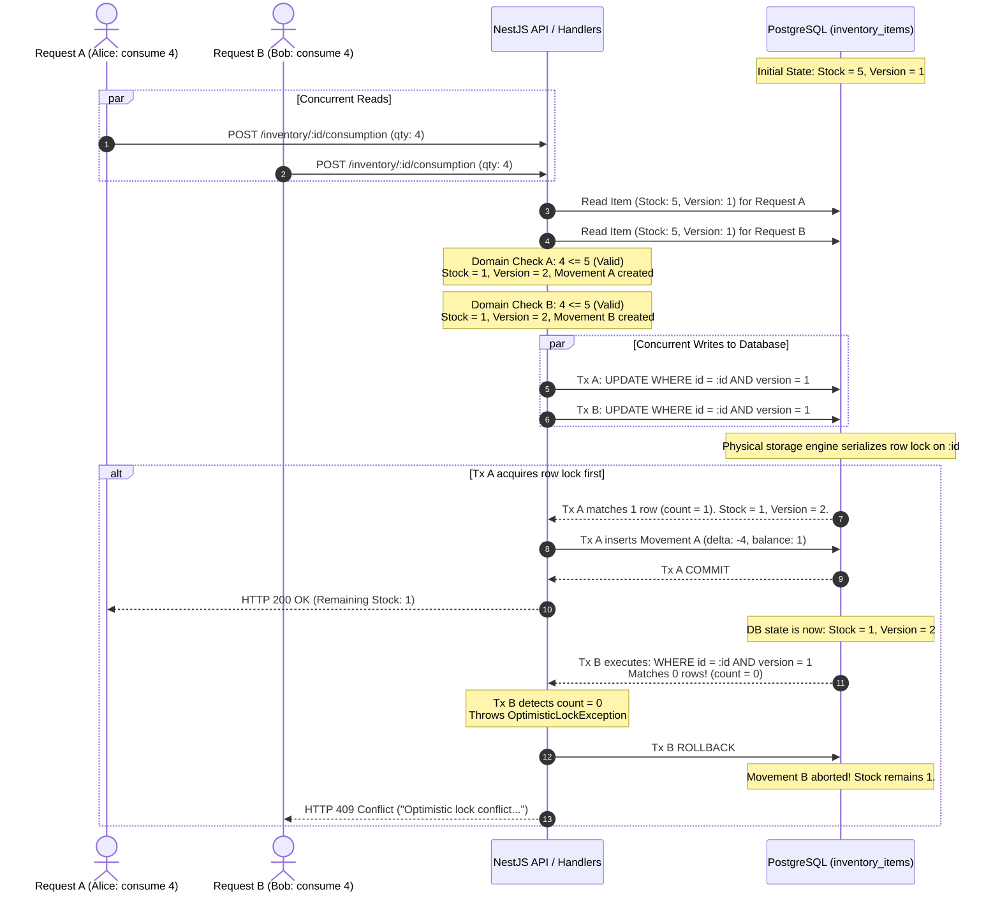

# Phase 6: Resources Management — Concurrency Strategy & Stock Guarantees

## 1. Executive Summary

In a high-throughput, multi-user clinical and wellness facility, front-desk retail cashiers, physiotherapists in treatment rooms, and warehouse operators frequently record stock transactions simultaneously.

Without rigorous concurrency controls, concurrent requests against the same consumable stock keeping unit (SKU) create severe failure modes:

1. **Lost Updates**: Cashier A and Cashier B simultaneously decrement stock; Cashier B's write overwrites Cashier A's write, resulting in unaccounted physical shrinkage.
2. **Negative Stock Balances (Double-Spend / Overdraw)**: If available stock is 5, and Request A attempts to consume 4 while Request B attempts to consume 4, both requests read stock as 5, pass memory checks, decrement 4, and drive persisted stock to $-3$.
3. **Orphaned Movement Audit Records**: A transaction writes a movement log but fails during stock mutation, producing an irreconcilable audit trail.

This document provides the authoritative, implementation-accurate specification of the **Three-Layer Defense-in-Depth Concurrency Strategy** implemented in Phase 6, codified in [ADR-0084](./adr/0084-inventory-concurrency-control-and-race-condition-prevention.md), and empirically proven in `inventory-concurrency-race-conditions.spec.ts`.

---

## 2. Three-Layer Defense-in-Depth Architecture

The system enforces non-negative stock and transactional consistency across three distinct structural boundaries:

```
┌────────────────────────────────────────────────────────────────────────┐
│               THREE-LAYER CONCURRENCY DEFENSE-IN-DEPTH                 │
├────────────────────────────────────────────────────────────────────────┤
│ Layer 1: Domain Aggregate Memory Floor                                 │
│   • In-memory quantity check: qty <= quantityOnHand                    │
│   • Throws typed InsufficientStockException before events emit         │
├────────────────────────────────────────────────────────────────────────┤
│ Layer 2: Application / ORM Optimistic Concurrency Control (OCC)        │
│   • Integer version field on InventoryItem aggregate                   │
│   • Atomic conditional update: WHERE id = :id AND version = :priorVer  │
│   • Throws OptimisticLockException (HTTP 409 Conflict) on zero match   │
├────────────────────────────────────────────────────────────────────────┤
│ Layer 3: Database Engine Floor (PostgreSQL Storage Layer)              │
│   • Atomic ACID transaction boundary (prisma.$transaction)             │
│   • Hard database schema constraint: CHECK (quantity_on_hand >= 0)     │
│   • Immutable append-only stock_movements table                        │
└────────────────────────────────────────────────────────────────────────┘
```

---

## 3. Transaction Boundaries & Atomicity

### 3.1. The Unit-of-Work Scope

Every stock mutation (`PURCHASE`, `SALE`, `CONSUMPTION`, `SCRAP`, `ADJUSTMENT`) executes within a single, isolated PostgreSQL database transaction managed via `prisma.$transaction`:

```typescript
// packages/core/src/resources/infrastructure/persistence/prisma/repositories/prisma-inventory-item.repository.ts
await this.prisma.$transaction(async (tx) => {
  // 1. Execute atomic conditional OCC update on the inventory item
  const priorVersion = item.version - 1;
  const result = await tx.inventoryItem.updateMany({
    where: {
      id: data.id,
      version: priorVersion,
    },
    data: {
      ...data,
      version: data.version,
    },
  });

  if (result.count === 0) {
    throw new OptimisticLockException('InventoryItem', data.id, priorVersion);
  }

  // 2. Persist append-only StockMovements in the same transaction
  for (const mv of movementsData) {
    await tx.stockMovement.upsert({
      where: { id: mv.id },
      create: { ...mv },
      update: {}, // Stock movements are strictly immutable once created
    });
  }
});
```

### 3.2. Atomicity Invariants

- **`[INV-STK-4]` Atomic Coupling**: The balance mutation on `inventory_items` and the audit record creation on `stock_movements` commit or abort together as an atomic unit.
- **`[INV-STK-5]` Zero Phantom Movements**: If the aggregate rejects a mutation (e.g. `InsufficientStockException`), no movement entity is ever created or sent to the repository.
- **`[INV-STK-6]` Zero Partial Mutations**: If persisting the movement ledger fails or the OCC check fails, the transaction rolls back completely. The stock balance reverts, and zero movement rows are written.

---

## 4. Read/Write Behavior & Locking Model

### 4.1. Non-Blocking MVCC Reads

- **Isolation Level**: Standard PostgreSQL default `READ COMMITTED`.
- **Query Strategy**: Standard `SELECT` queries without locking clauses (`SELECT ... FROM inventory_items WHERE id = ?`).
- **Performance Rationale**: Read operations (catalogs, stock lookups, detail pages) never acquire shared or exclusive locks. Readers never block writers, and writers never block readers.
- **What We Do NOT Use**:
  - We **do not** use PostgreSQL `SERIALIZABLE` transaction isolation. Full serializability across concurrent reads and writes causes massive transaction abort rates under mixed reporting and transaction workloads.
  - We **do not** use pessimistic read locks (`SELECT ... FOR UPDATE` or `SELECT ... FOR SHARE`) as the primary concurrency mechanism, avoiding distributed deadlocks during batch operations.

### 4.2. Atomic Conditional Write Strategy (OCC)

Writes rely on **Optimistic Concurrency Control (OCC)** using an integer `version` counter:

1. When an aggregate is loaded into memory, its `version` is captured (e.g. `version = 1`).
2. The domain mutation increments the aggregate's in-memory version (e.g. `version = 2`).
3. During `save()`, the repository executes an atomic conditional SQL update:
   $$\text{UPDATE } \texttt{inventory\_items} \text{ SET } \texttt{quantity\_on\_hand} = Q_{\text{new}}, \texttt{version} = 2 \text{ WHERE } \texttt{id} = \text{itemId} \text{ AND } \texttt{version} = 1$$
4. At the database storage engine level, row-level write locks are acquired momentarily during the `UPDATE` execution:
   - If the row still has `version = 1`, exactly 1 row is modified (`count = 1`). The lock is released upon transaction commit.
   - If a concurrent transaction already updated `version = 2`, zero rows match the `WHERE` clause (`count = 0`). The repository detects `count === 0` and throws `OptimisticLockException`.

---

## 5. Concrete Concurrency Race Scenario

To illustrate the exact operational mechanics, consider the standard concurrent consumption race:

### The Scenario

- **Product**: Clinical Resistance Bands (SKU: `BAND-RES-01`)
- **Initial State**: $\text{Quantity On Hand} = 5$, $\text{Version} = 1$.
- **Concurrent Influx**:
  - **Request A**: Therapist Alice records consumption of $4\text{ units}$ in Treatment Room 1.
  - **Request B**: Therapist Bob records consumption of $4\text{ units}$ in Treatment Room 2.
  - **Total Requested**: $4 + 4 = 8\text{ units} > 5\text{ units}$ available.



### Detailed Trace Analysis: Why Only Valid Operations Mutate Stock

1. **Step 1 & 2 (Concurrent Ingestion)**:
   Both requests hit separate worker threads. Both query `inventory_items` simultaneously via non-blocking `SELECT`. Both receive identical snapshots: `quantityOnHand = 5`, `version = 1`.
2. **Step 3 & 4 (Domain Invariant Evaluation)**:
   - Request A executes `itemA.consumeStock(4, 'Alice')`. Because $4 \le 5$, the domain invariant passes. `itemA` sets `quantityOnHand = 1`, appends Movement A (delta $-4$, balanceAfter $1$), and advances `version = 2`.
   - Request B executes `itemB.consumeStock(4, 'Bob')`. Because $4 \le 5$, the domain invariant passes. `itemB` sets `quantityOnHand = 1`, appends Movement B (delta $-4$, balanceAfter $1$), and advances `version = 2`.
3. **Step 5 (Database Serialization & Contention)**:
   Both transactions initiate their commit via `prisma.$transaction`. Both execute:
   $$\text{UPDATE inventory\_items SET quantity\_on\_hand = 1, version = 2 WHERE id = :id AND version = 1}$$
   The PostgreSQL storage engine serializes access to the physical row lock for `:id`.
4. **Step 6 (Winner Commits — Request A)**:
   Assuming Request A acquires the lock first, PostgreSQL evaluates `WHERE id = :id AND version = 1`. The condition evaluates to `TRUE`. The row is updated to `quantityOnHand = 1` and `version = 2`. Movement A is inserted into `stock_movements`. Transaction A commits. Alice receives `200 OK`.
5. **Step 7 (Loser Rolls Back — Request B)**:
   Request B now acquires the row lock. PostgreSQL evaluates `WHERE id = :id AND version = 1`. However, because Transaction A committed, the row currently has `version = 2`. The condition evaluates to `FALSE`. Zero rows are updated (`count === 0`).
6. **Step 8 (OCC Exception & Rollback)**:
   The repository inspects `result.count`. Since it is `0`, it immediately throws:
   ```typescript
   throw new OptimisticLockException('InventoryItem', data.id, 1);
   ```
   This triggers an immediate `ROLLBACK` of Transaction B. Movement B is never inserted into the database. Bob's thread catches the exception, and the NestJS controller returns `HTTP 409 Conflict`.
7. **Final Guaranteed State**:
   - Stock balance: **Exactly 1 unit** ($5 - 4 = 1$).
   - Stock **NEVER dropped to $-3$**.
   - Ledger movements: **Exactly 1 movement** (Movement A). Movement B leaves zero residue.
   - Ledger reconciliation: $\sum (\text{Movements } \Delta Q) = -4$, exactly matching the net delta from initial stock.

---

## 6. What Happens When the Rejected Client Retries?

If Bob's client application re-attempts the request after receiving `HTTP 409 Conflict`:

1. Bob's client queries the latest state of the item: `quantityOnHand = 1`, `version = 2`.
2. Bob's client submits a new consumption request for $4\text{ units}$.
3. The domain aggregate loads the fresh state (`quantityOnHand = 1`).
4. `item.consumeStock(4)` executes:
   - Evaluates: $\text{requested } (4) \le \text{available } (1) \implies \mathbf{FALSE}$.
   - The aggregate throws typed `InsufficientStockException("Insufficient stock: requested 4, available 1")`.
5. The application layer catches the exception and returns `ApplicationResult.fail(...)`.
6. The API returns `HTTP 400 Bad Request` with message:
   `"Insufficient stock: requested 4, available 1"`.
7. **Result**: The second request is cleanly and permanently rejected by the **Domain Floor (Layer 1)** without ever generating database write contention.

---

## 7. Negative-Stock Prevention: The Database Floor (Layer 3)

Even in the hypothetical event of a catastrophic software regression—such as a developer bypassing the aggregate root, writing a raw SQL query, or disabling OCC—the physical storage layer provides a mathematically absolute backstop:

```sql
-- PostgreSQL Table Schema Floor
ALTER TABLE inventory_items
ADD CONSTRAINT chk_inventory_items_quantity_non_negative
CHECK (quantity_on_hand >= 0);
```

If any query attempts to execute `UPDATE inventory_items SET quantity_on_hand = -1`, the PostgreSQL engine aborts the transaction with error code `23514 (check_violation)`. Physical negative stock is an impossibility in the Kinergy Platform.

---

## 8. Summary of System Guarantees

| Invariant / Property            |   Guarantee Level    | Architectural Mechanism                                                                                                         |
| :------------------------------ | :------------------: | :------------------------------------------------------------------------------------------------------------------------------ |
| **Non-Negative Stock**          | **Absolute (100%)**  | 3-Layer Defense: Domain check $\to$ OCC conditional update $\to$ PostgreSQL `CHECK (quantity_on_hand >= 0)`                     |
| **Zero Lost Updates**           | **Absolute (100%)**  | Atomic conditional update (`WHERE version = :priorVersion`). Concurrent writes cannot overwrite unseen changes.                 |
| **Audit Ledger Fidelity**       | **Absolute (100%)**  | All movements committed inside the same ACID `prisma.$transaction` as the stock update. Aborted mutations write 0 movements.    |
| **Double-Entry Reconciliation** | **Absolute (100%)**  | $\text{Current Stock} = \sum (\text{Ledger Deltas})$ holds true across all transactions.                                        |
| **Locking Strategy**            | **Optimistic (OCC)** | Non-blocking reads (`READ COMMITTED`); row-level serialization only during atomic `UPDATE`. Zero reader-writer lock contention. |
| **Failure Representation**      |   **Standardized**   | Concurrency contention $\to$ `HTTP 409 Conflict`. Domain overdraft $\to$ `HTTP 400 Bad Request`.                                |
