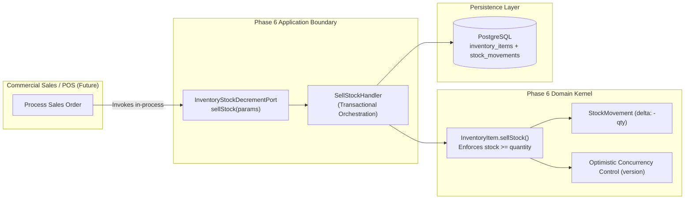
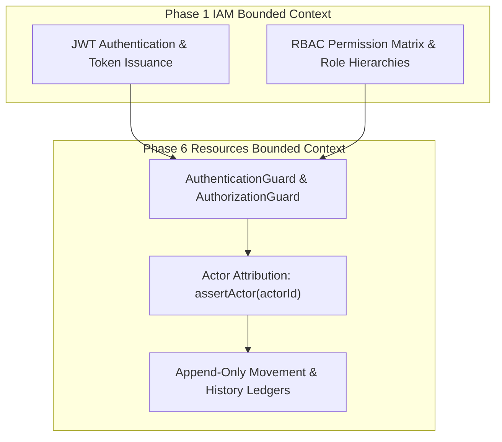

# Phase 6: Resources Management — Cross-Domain Integration Specification

## 1. Executive Summary & Architectural Law

The **Phase 6: Resources Management** bounded context governs consumable inventory and physical capital assets across all Kinergy facilities. In accordance with Clean Architecture and Domain-Driven Design (DDD) principles, its integration with surrounding platform contexts (Client, Scheduling, Sales, IAM) is guided by a foundational architectural law established in Milestone 6.16:

> [!IMPORTANT]
> **The Fundamental Rule of Cross-Domain Integration**:  
> **Bounded contexts remain completely decoupled by default unless a concrete, production business workflow proves an integration dependency is necessary.**  
> Under no circumstances are relational foreign keys, shared persistence models, or direct database mutations created between bounded contexts simply because they appear "technically convenient."

This specification outlines the integration decisions ratified in Milestone 6.16, explicitly classifying each cross-domain relationship as **Real**, **Deferred**, or **Intentionally Absent**.

---

## 2. Integration Boundary Classification Matrix

| Bounded Context          | Integration Status                                            | Integration Mechanism                                          | Ownership & Invariant Rule                                                                                                                         |
| :----------------------- | :------------------------------------------------------------ | :------------------------------------------------------------- | :------------------------------------------------------------------------------------------------------------------------------------------------- |
| **IAM (Phase 1)**        | **Real & Active**                                             | JWT Bearer Tokens, `AuthenticationGuard`, `AuthorizationGuard` | Resources consumes IAM identities and permissions; IAM owns user credentials, sessions, and token issuance.                                        |
| **Client (Phase 2)**     | **Intentionally Absent**                                      | Unconstrained scalar string reference (`referenceId`) only     | Resources contains zero client models and zero foreign keys. Facility owns resources; clients never own facility inventory or fixed assets.        |
| **Scheduling (Phase 3)** | **Status: Deferred / Not Required by Current Business Model** | Informational `AssetLocation` Value Object                     | Equipment is an amenity inside spaces, not an independently bookable calendar line. Relational foreign keys between assets and rooms are deferred. |
| **Sales (Future)**       | **Contract Defined / Speculative DB Avoided**                 | In-process application port (`InventoryStockDecrementPort`)    | Inventory strictly owns all stock mutation rules. Sales must never directly manipulate inventory persistence.                                      |

---

## 3. Client Management ↔ Resources: Intentionally Decoupled

### 3.1. Does Phase 6 Reference Client Records?

**No.** The Resources domain does not maintain any direct relational foreign keys to the `clients` table. The database tables `inventory_items`, `stock_movements`, `fixed_assets`, `asset_history_events`, and `asset_maintenance_records` have **zero foreign keys** to Phase 2 `clients`.

### 3.2. Why No Direct Relationship Exists

1. **Resource Ownership vs. Personal Identity**:
   - Capital assets (treadmills, cryotherapy chambers, treatment tables) and consumable inventory (supplements, therapeutic tape, sanitation supplies) are owned by the **wellness facility**, not by individual clients.
2. **Transaction Ownership**:
   - When a client purchases a supplement at the front desk or receives clinical tape during a kinesiology session, the client relationship is owned by the **Sales Transaction** or the **Treatment Session**, not by the Inventory catalog.
   - The inventory movement ledger merely captures an unconstrained, informational scalar reference string (`referenceId?: string` and `reason?: string`), such as `"sale_receipt_9921"` or `"session_kinesiology_441"`.
3. **Zero Person/Customer/Patient Duplication**:
   - The Resources bounded context contains **zero** `Client`, `Customer`, `Patient`, `Member`, or duplicate person models. All person identities are resolved through Phase 2 Client Management or Phase 1 IAM.
4. **GDPR & Cascade Delete Immunity**:
   - If a client exercises their "Right to be Forgotten" (GDPR) and their client record is anonymized or purged, the facility's inventory stock balances, historical movement ledgers, and fixed asset maintenance histories remain **100% intact and uncorrupted**.

---

## 4. Scheduling (Rooms & Areas) ↔ Fixed Assets: Deferred Integration

### 4.1. Integration Status

> **Status: Deferred / Not Required by Current Business Model**

### 4.2. Current Implementation: Informational `AssetLocation`

Rather than binding fixed assets to database `rooms` via relational foreign keys, physical asset placement is modeled as an **informational Value Object (`AssetLocation`)**:

```typescript
export class AssetLocation {
  readonly facilityId: string;
  readonly roomId?: string; // Optional unconstrained room identifier
  readonly zone?: string; // e.g. "Free Weights Area", "Cardio Deck"
  readonly description?: string; // e.g. "South wall near emergency exit"
}
```

When an asset is relocated across rooms or facilities, the aggregate executes `transferLocation(newLocation, actorId, reason)` and emits an immutable `AssetHistoryEvent` (`TRANSFERRED`).

### 4.3. Why Relational Foreign Keys Were Intentionally Deferred

1. **Amenities vs. Bookable Lines**:
   - In Kinergy's operational model, appointments reserve a **Space** (`Room`), a **Practitioner** (`User`), and a **Client**.
   - Equipment represents an **amenity** within the space. Clients and therapists do not book a treadmill or treatment table as an independent line on the calendar.
2. **Cascading Availability Hazards**:
   - If an asset breaks or enters servicing (`UNDER_MAINTENANCE`), the physical room remains open and available for general consultations, yoga sessions, or alternative therapies.
   - Relational coupling would cause equipment downtime to artificially cancel appointments or block room calendars.
3. **Non-Schedulable Physical Placement**:
   - Fixed assets frequently reside in locations that have zero representation on scheduling calendars: storage closets, repair workshops, reception lounges, or off-site maintenance facilities. A relational foreign key would require creating artificial "dummy rooms" in the scheduling system.

---

## 5. Sales ↔ Consumable Inventory: Application Boundary Port

### 5.1. Current Architectural Status

**No Sales module currently exists** in the repository. In accordance with Kinergy's anti-speculative engineering standards, no premature `sales_orders` or `pos_invoices` database tables were created.

However, to guarantee that future commercial modules (POS, Online Store, Cafe) cannot violate inventory invariants, Milestone 6.16 designed, implemented, and verified the in-process integration boundary port:
[`InventoryStockDecrementPort`](file:///c:/Projects/kinergy-platform/packages/core/src/resources/application/ports/inventory-stock-decrement.port.ts).

### 5.2. Integration Lineage

Any future commercial sales or point-of-sale system must integrate strictly through the application boundary:

$$\text{Commercial Sales / POS} \longrightarrow \text{InventoryStockDecrementPort (Application)} \longrightarrow \text{InventoryItem (Domain Aggregate)} \longrightarrow \text{PostgreSQL}$$



### 5.3. Inviolable Stock Ownership Rule

> [!CAUTION]
> **The Inventory Bounded Context Strictly Owns All Stock Mutation Rules.**  
> External modules (Sales, POS, Clinical Sessions) **must NEVER directly manipulate inventory persistence** (`prisma.inventoryItem.update(...)` or raw SQL).

- **Inventory Owns**:
  - Physical balance calculation (`quantityOnHand`).
  - Negative-stock prevention (`quantityOnHand >= quantity`).
  - The immutable double-entry movement ledger (`StockMovement`).
  - Optimistic Concurrency Control (`version` checks and conflict resolution).
- **Sales Owns**:
  - Order lines, customer billing, payment gateway processing, tax calculations, and invoices.
- **In-Process vs. HTTP Loopback**:
  - In Kinergy's modular monolith, backend modules call `InventoryStockDecrementPort` **directly in-process**. Internal services must never make loopback HTTP requests (`POST /api/v1/...`) to deduct stock. The HTTP endpoint is reserved exclusively for authenticated human users at the front desk.

---

## 6. Identity & Access Management (IAM): Upstream Security Provider

Phase 6 treats Phase 1 IAM as an upstream security provider:



- **Authentication**: Phase 6 validates cryptographic JWT signatures using `AuthenticationGuard`, extracting user identities into `AuthenticatedUserContext`.
- **Authorization**: `AuthorizationGuard` evaluates server-side permissions (`inventory.read`, `inventory.write`, `assets.read`, `assets.write`, and compositional `billing.read`).
- **Zero Duplication**: Resources contains **zero** custom User, Password, Session, or Token entities.
- **Audit Attribution**: Verified user IDs (`userId`) are injected into command payloads by controllers and permanently stored in immutable history records (`recordedByUserId`).

---

## 7. Future Extension Rules for Senior Engineers

When implementing new cross-domain features involving Resources, engineers must adhere to these four architectural rules:

1. **Do Not Add Relational Foreign Keys to Other Contexts**:
   Maintain unconstrained scalar string IDs (`clientId: string`, `roomId?: string`, `referenceId?: string`). Bounded contexts must be deployable and testable in isolation.
2. **Always Use In-Process Ports for Internal Commands**:
   If another domain needs to consume or reserve stock, define an application port interface in `packages/core/src/resources/application/ports/`. Never expose raw repository write access.
3. **Never Duplicate Domain Entities**:
   Never create a `ResourceClient` or `EquipmentRoom` entity inside the resources context. Consume existing identifiers or informational value objects.
4. **Preserve Transactional Independence**:
   Do not initiate distributed two-phase commit (2PC) transactions across bounded contexts. Use local transactions with compensating actions if cross-domain workflows fail.
