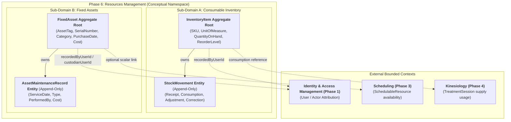
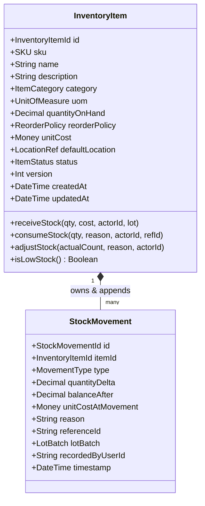
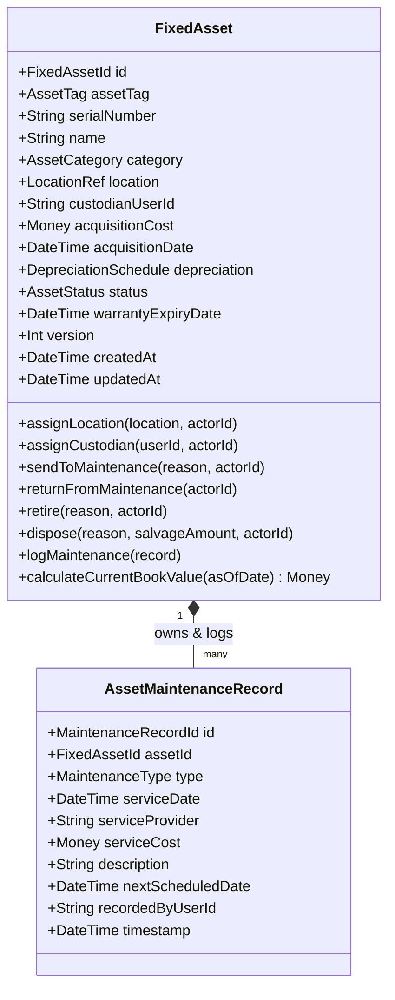
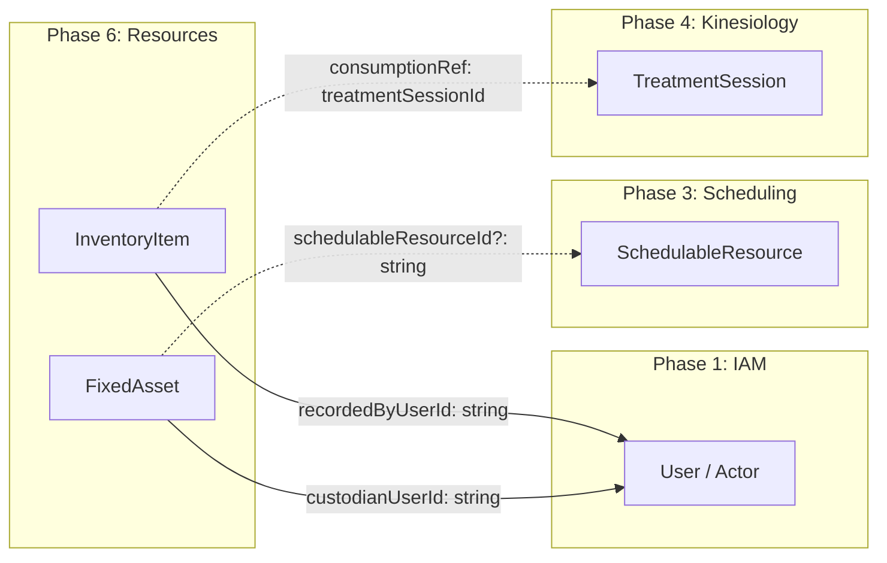
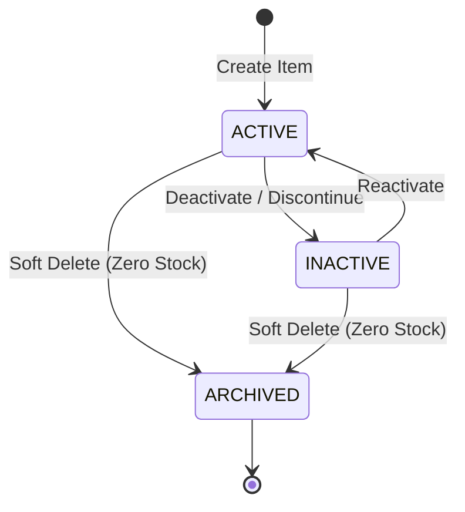
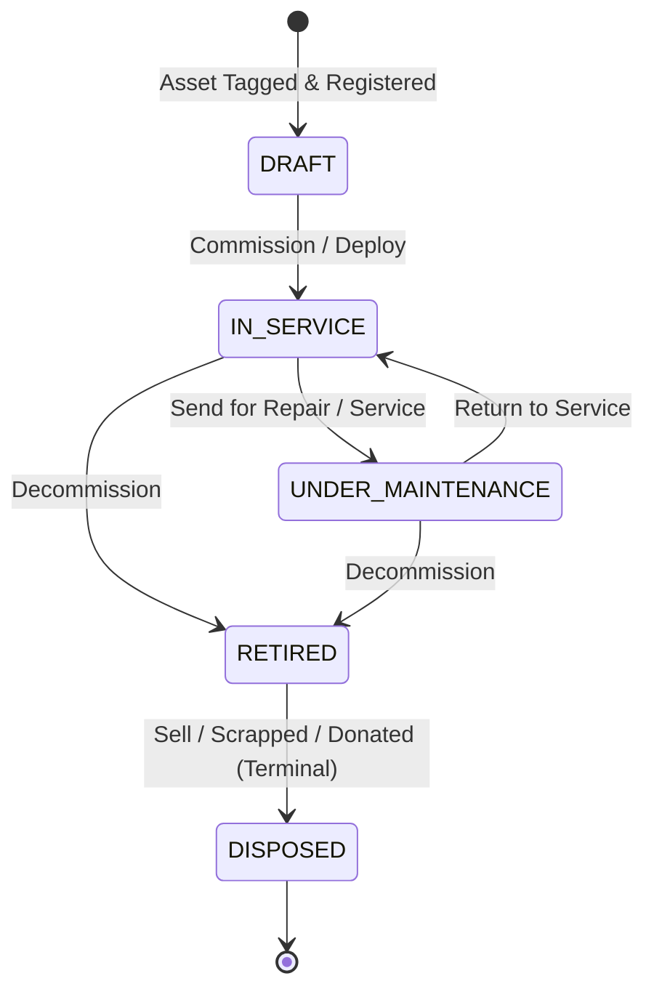

# Phase 6: Resources Management — Domain Boundary Design

**Author**: Principal Domain Architect & Platform System Architect  
**Status**: **PROPOSED / BASELINE DESIGN**  
**Domain**: Phase 6 — Resources Management (Consumable Inventory & Fixed Assets)  
**Document Version**: 1.0.0

---

## 1. Purpose

This document establishes the authoritative **Domain Boundary Design** for **Phase 6: Resources Management** within the Kinergy Platform.

The core business goal of Phase 6 is to:

> **Provide complete visibility into everything the business owns and consumes.**

To ensure long-term architectural health, maintainability, and domain clarity over the next 5+ years, this design creates the **smallest correct domain model** that:

- Preserves all business invariants and physical accounting rules.
- Eliminates duplicate concepts across existing bounded contexts.
- Avoids premature ERP complexity by strictly focusing on Kinergy's actual operational workflows (gym facilities, clinical kinesiology, administrative wellness centers).
- Establishes rock-solid transactional and concurrency boundaries.
- Adheres strictly to Kinergy's 4-layer Clean Architecture and Domain-Driven Design (DDD) rules.

---

## 2. Domain Context & Answers to 14 Core Domain Questions

### The 14 Foundational Domain Questions

#### 1. What is a Consumable Inventory Item?

- **[FACT]**: In Kinergy, a consumable inventory item is a fungible physical supply that is depleted, used up, or sold during operations (e.g. kinesiology tape, disposable electrodes, massage oils, disinfectant spray, gym chalk, nutritional supplements, retail drinks).
- **[DECISION]**: An `InventoryItem` is defined by its _fungibility_ and _continuous quantity balance_. Individual units are not individually tracked by identity; the system tracks the aggregate _Quantity On Hand_ for a specific SKU/item definition at a specific storage location.

#### 2. What is a Fixed Asset?

- **[FACT]**: A fixed asset is a non-fungible, durable physical property owned by the business that is retained for long-term operational use (over 1+ years) and is not intended for direct consumption or immediate resale (e.g. rehabilitation ultrasound machines, Pilates reformers, cable crossover machines, treatment tables, office laptops).
- **[DECISION]**: A `FixedAsset` is uniquely defined by its _discrete physical identity_ (Asset Tag / Serial Number), its _operational status lifecycle_, its _maintenance log_, and its _financial acquisition cost and depreciation_.

#### 3. What is shared between them?

- **[DECISION]**: Conceptually, both represent physical resources located within a facility and managed by staff under the organizational umbrella.
- **[FACT]**: Shared primitive attributes include:
  - Human-readable name & description.
  - Organization / Location identifier (e.g. "Main Clinic", "Room 3 Cabinet", "Gym Floor").
  - Actor attribution (`recordedByUserId`, `updatedByUserId`).
  - Money value objects (`Money { amount: Decimal, currency: Currency }`) for financial valuation.
  - Supplier/Vendor reference strings.

#### 4. What must remain separate?

- **[DECISION]**: Everything related to identity, state mutation, lifecycle, accounting, and concurrency must remain strictly separated:
  - **Identity**: `InventoryItem` has one ID for an entire pool of fungible units (`SKU`). `FixedAsset` has a unique ID for a single physical machine (`AssetTag`).
  - **Quantity vs State**: Inventory changes quantity (`quantityOnHand: number`); Assets change operational state (`status: AssetStatus`).
  - **Depletion vs Depreciation**: Inventory is consumed to zero; Assets remain physically present while losing monetary book value over years.
  - **Maintenance**: Inventory is never serviced/repaired; Assets undergo scheduled preventive maintenance and calibration.

#### 5. Is "Resource" a real domain entity or merely a conceptual umbrella?

- **[DECISION]**: `"Resource"` is **merely a conceptual namespace and bounded context title**, NOT a polymorphic domain entity or database table.
- **[FACT]**: In Phase 3, `SchedulableResource` exists specifically for calendar time-slot booking. Attempting to force Consumables and Fixed Assets into a polymorphic `Resource` base class would introduce severe table-inheritance anti-patterns, muddy aggregate invariants, and create unnecessary coupling.

#### 6. Should inventory and assets share a base entity or database table?

- **[DECISION]**: **NO. Under no circumstances will Inventory and Assets share a Single Table Inheritance (STI) or polymorphic base table.**
- **[FACT]**: The attributes, query patterns, indexing requirements, and lifecycle state machines of `InventoryItem` and `FixedAsset` have a disjoint property overlap of less than 20%. They will be modeled as two completely distinct Aggregate Roots and persisted into dedicated tables (`inventory_items`, `fixed_assets`).

#### 7. What defines identity?

- **[DECISION]**:
  - `InventoryItem`: Technical ID (`InventoryItemId` UUID) + Natural Business Key (`SKU` / Barcode unique per tenant).
  - `FixedAsset`: Technical ID (`FixedAssetId` UUID) + Physical Natural Key (`AssetTag` unique per tenant, optional manufacturer `SerialNumber`).

#### 8. What defines lifecycle?

- **[DECISION]**:
  - `InventoryItem`: Inventory does not transition through operational health states. Its lifecycle is **Catalog State**: `ACTIVE` (can be received/consumed) $\leftrightarrow$ `INACTIVE` / `DISCONTINUED` (cannot be received or consumed).
  - `FixedAsset`: Assets transition through an **Operational State Machine**: `DRAFT` $\rightarrow$ `IN_SERVICE` $\leftrightarrow$ `UNDER_MAINTENANCE` $\rightarrow$ `RETIRED` $\rightarrow$ `DISPOSED`.

#### 9. What defines ownership?

- **[DECISION]**: Ownership is organizational and multi-tenant.
  - For Inventory: Owned by the business entity; allocated to physical storage locations.
  - For Fixed Assets: Owned by the business entity; optionally assigned to a human custodian (`custodianUserId`) or dedicated treatment room (`roomId`).

#### 10. What defines quantity?

- **[DECISION]**:
  - `InventoryItem`: Non-negative integer or decimal quantity (`Quantity { value: Decimal, unit: UnitOfMeasure }`). Quantity is strictly mutated through signed, append-only `StockMovement` records.
  - `FixedAsset`: Exactly **1**. An asset represents a single discrete item. Multi-item purchases (e.g. 10 kettlebells) generate 10 individual asset records with distinct asset tags.

#### 11. What defines valuation?

- **[DECISION]**:
  - `InventoryItem`: **Inventory Asset Value = Quantity On Hand $\times$ Unit Cost**. Unit cost represents current standard replacement cost or last purchase price.
  - `FixedAsset`: **Book Value = Acquisition Cost $-$ Accumulated Depreciation**.

#### 12. What defines history?

- **[DECISION]**:
  - `InventoryItem`: An append-only, immutable **`StockMovement` ledger** (`RECEIPT`, `CONSUMPTION`, `ADJUSTMENT`, `CORRECTION`). Balance is derived or verified against movement sums.
  - `FixedAsset`: An append-only **`AssetMaintenanceRecord` ledger** combined with an immutable **Audit Event log** capturing status transitions and custodian reassignments.

#### 13. What defines maintenance?

- **[DECISION]**:
  - `InventoryItem`: N/A (Not applicable).
  - `FixedAsset`: Tracked through `AssetMaintenanceRecord` entities containing service date, maintenance type (`PREVENTIVE`, `CORRECTIVE`, `CALIBRATION`), technician/vendor details, total cost, and next scheduled service date.

#### 14. What defines disposal / retirement?

- **[DECISION]**:
  - `InventoryItem`: Quantity write-off recorded as a negative `StockMovement` with reason `WASTE`, `DAMAGE`, `EXPIRED`, or `THEFT`.
  - `FixedAsset`: Irreversible terminal state transition to `RETIRED` or `DISPOSED` requiring mandatory `disposalReason`, `disposalDate`, and optional `salvageAmount`.

---

## 3. Canonical Domain Vocabulary

| Term                         | Category                | Domain Definition                                                                                                                                                                            |
| :--------------------------- | :---------------------- | :------------------------------------------------------------------------------------------------------------------------------------------------------------------------------------------- |
| **`InventoryItem`**          | **Aggregate Root**      | The canonical catalog definition of a fungible consumable supply tracking total stock balance, SKU, unit of measure, and reorder levels.                                                     |
| **`StockMovement`**          | **Domain Entity**       | An immutable, append-only record representing a physical change in an inventory item's stock level.                                                                                          |
| **`MovementType`**           | **Enum**                | Classification of stock change: `RECEIPT` (inbound), `CONSUMPTION` (used in session/service), `ADJUSTMENT` (physical count audit), `CORRECTION` (data entry fix), `SCRAP` (damaged/expired). |
| **`UnitOfMeasure`**          | **Value Object / Enum** | The physical unit used to quantify stock: `UNIT` (pieces), `BOX`, `BOTTLE`, `ROLL`, `ML` (milliliters), `GRAM`, `PAIR`.                                                                      |
| **`ReorderPolicy`**          | **Value Object**        | Invariant rule defining `minQuantity` (reorder trigger) and `targetStockLevel` (par level).                                                                                                  |
| **`LotBatch`**               | **Value Object**        | Optional lot number and expiration date for clinical supplies requiring regulatory traceability.                                                                                             |
| **`FixedAsset`**             | **Aggregate Root**      | A discrete, non-fungible capital item tracking identity, financial valuation, operational lifecycle status, and physical location.                                                           |
| **`AssetTag`**               | **Value Object**        | Human-readable barcode/QR identifier physically attached to an asset (e.g. `AST-00482`), unique within the organization.                                                                     |
| **`AssetCategory`**          | **Enum / VO**           | Classification of asset: `CLINICAL_EQUIPMENT`, `FITNESS_MACHINE`, `FACILITY_FIXTURE`, `ELECTRONIC_IT`, `FURNITURE`.                                                                          |
| **`AssetStatus`**            | **State Enum**          | Operational state: `DRAFT`, `IN_SERVICE`, `UNDER_MAINTENANCE`, `RETIRED`, `DISPOSED`.                                                                                                        |
| **`DepreciationSchedule`**   | **Value Object**        | Financial schedule defining method (`STRAIGHT_LINE`), useful life in months, acquisition cost, and estimated salvage value.                                                                  |
| **`AssetMaintenanceRecord`** | **Domain Entity**       | An immutable record of a maintenance, repair, or calibration service performed on an asset.                                                                                                  |
| **`MaintenanceType`**        | **Enum**                | `PREVENTIVE_INSPECTION`, `REPAIR`, `CALIBRATION_CERTIFICATION`, `SAFETY_AUDIT`.                                                                                                              |
| **`LocationRef`**            | **Value Object**        | Physical placement tag within a facility (`facilityName`, `roomName`, `cabinetOrZone`).                                                                                                      |

---

## 4. Consumable Inventory Bounded Domain

### 4.1 Purpose & Scope

The Consumable Inventory domain manages all physical supplies that are repeatedly used, depleted, or administered across the business (clinic, gym, front desk).

### 4.2 Candidate Entities & Concepts

### 4.3 Invariants for Consumable Inventory

1. **[INV-1] Non-Negative Stock Balance**:
   - `quantityOnHand` can never drop below `0`. A consumption command requesting `qty > quantityOnHand` must throw `InsufficientStockException`.
2. **[INV-2] Mathematical Integrity of Stock Movements**:
   - For every appended `StockMovement`, `balanceAfter == previousBalance + quantityDelta`.
3. **[INV-3] Unique SKU per Tenant**:
   - An `InventoryItem` SKU must be unique across all active and inactive items within the tenant.
4. **[INV-4] Immutability of Movements**:
   - Once persisted, a `StockMovement` can never be edited or deleted. Errors are corrected via offsetting `CORRECTION` movements.
5. **[INV-5] Active Status for Transactions**:
   - Inactive or discontinued items cannot accept `RECEIPT` or `CONSUMPTION` operations.

---

## 5. Fixed Asset Bounded Domain

### 5.1 Purpose & Scope

The Fixed Asset domain manages high-value, durable capital assets that require individual identification, routine maintenance, location tracking, and financial depreciation.

### 5.2 Candidate Entities & Concepts

### 5.3 Invariants for Fixed Assets

1. **[INV-6] Unique Asset Tag**:
   - `AssetTag` must be unique across all non-disposed assets within the tenant.
2. **[INV-7] Valid Lifecycle State Transitions**:
   - State transitions must strictly follow the allowed state graph:
     - `DRAFT` $\rightarrow$ `IN_SERVICE`
     - `IN_SERVICE` $\leftrightarrow$ `UNDER_MAINTENANCE`
     - `IN_SERVICE` $\rightarrow$ `RETIRED`
     - `UNDER_MAINTENANCE` $\rightarrow$ `RETIRED`
     - `RETIRED` $\rightarrow$ `DISPOSED` (Terminal State; irreversible)
3. **[INV-8] Acquisition Cost Positivity**:
   - `acquisitionCost.amount` must be $\ge 0$.
4. **[INV-9] Book Value Floor**:
   - `currentBookValue` cannot depreciate below the `salvageValue` specified in the `DepreciationSchedule`.
5. **[INV-10] Mandatory Disposal Reason**:
   - Transitioning an asset to `DISPOSED` requires a non-empty `disposalReason` and `disposalDate`.

---

## 6. Shared Concepts vs Segregation Matrix

| Concept               | Consumable Inventory Handling                   | Fixed Asset Handling                                | Architectural Determination                          |
| :-------------------- | :---------------------------------------------- | :-------------------------------------------------- | :--------------------------------------------------- |
| **Identity**          | Categorical identifier (`SKU`), fungible pool   | Individual identifier (`AssetTag` + `SerialNumber`) | **[DECISION] Strictly Segregated**                   |
| **Quantity**          | Variable aggregate count ($0 \dots N$)          | Exactly $1$ per asset entity                        | **[DECISION] Strictly Segregated**                   |
| **Location**          | Stock storage bin / shelf / room                | Operational station / room / custodian              | **[DECISION] Shared Value Object (`LocationRef`)**   |
| **Monetary Value**    | Unit purchase price & total inventory valuation | Acquisition cost & depreciated net book value       | **[DECISION] Shared VO (`Money`), Segregated Model** |
| **Maintenance**       | None (items are consumed or discarded)          | Detailed history & scheduled servicing              | **[DECISION] Strictly Segregated (Assets only)**     |
| **Vendor / Supplier** | Inbound supplier references                     | Vendor & manufacturer warranty contacts             | **[DECISION] Shared scalar reference strings**       |
| **Audit / History**   | Append-only `StockMovement` ledger              | Append-only `AssetMaintenanceRecord` + state audit  | **[DECISION] Segregated aggregate ledgers**          |

---

## 7. Existing Domain References & Integration Contracts

To maintain loose coupling and architectural purity, Phase 6 connects to external bounded contexts exclusively via **scalar references** and **asynchronous domain events**:

1. **Identity & Access Management (Phase 1)**:
   - **Contract**: Scalar `recordedByUserId: string` on all stock movements and asset lifecycle actions; optional `custodianUserId: string` on `FixedAsset`. Zero relational foreign keys.
2. **Scheduling Bounded Context (Phase 3)**:
   - **Contract**: If a `FixedAsset` (e.g. an Ultrasound unit or Cryotherapy chamber) is bookable on the calendar, it holds an optional scalar reference `schedulableResourceId?: string`. Scheduling queries its own `SchedulableResource` table; Phase 6 manages the physical machine's lifecycle.
3. **Kinesiology Bounded Context (Phase 4)**:
   - **Contract**: When a clinical treatment session uses supplies, Kinesiology dispatches a `TreatmentSessionCompletedEvent` containing `{ treatmentSessionId, suppliesUsed: [{ sku, quantity }] }`. An application event handler in Resources processes `ConsumeStockCommand` referencing `referenceId = treatmentSessionId`.

---

## 8. Aggregate Boundaries & Concurrency Design

### 8.1 Aggregate 1: `InventoryItem` (Consumable Inventory)

- **Root**: `InventoryItem`
- **Internal Entities**: `StockMovement[]`
- **Transactional Boundary**: All mutations to stock balance (`quantityOnHand`) and movement history append occur in a single atomic transaction.
- **Concurrency Strategy**: **Optimistic Concurrency Control (OCC)**.
  - Every `InventoryItem` possesses an integer `version` field.
  - Concurrent stock adjustments or receipts must assert `version == expectedVersion`. On version mismatch, an `OptimisticLockException` is thrown, prompting the client to refetch current stock.

### 8.2 Aggregate 2: `FixedAsset` (Fixed Assets)

- **Root**: `FixedAsset`
- **Internal Entities**: `AssetMaintenanceRecord[]`
- **Transactional Boundary**: Asset status modifications, location reassignments, and maintenance record additions are encapsulated within the `FixedAsset` aggregate.
- **Concurrency Strategy**: **Optimistic Concurrency Control (OCC)** via `version` field.

---

## 9. Boundary Classification of Candidate Entities

| Candidate Entity             | Domain Classification        | Architectural Reasoning                                                                                                                                                |
| :--------------------------- | :--------------------------- | :--------------------------------------------------------------------------------------------------------------------------------------------------------------------- |
| **`InventoryItem`**          | **Consumable Inventory**     | Core Aggregate Root for consumable stock tracking.                                                                                                                     |
| **`StockMovement`**          | **Consumable Inventory**     | Append-only ledger entity owned by `InventoryItem`.                                                                                                                    |
| **`LotBatch`**               | **Consumable Inventory**     | Value object for clinical expiration and lot tracking.                                                                                                                 |
| **`FixedAsset`**             | **Fixed Assets**             | Core Aggregate Root for capital asset tracking.                                                                                                                        |
| **`AssetMaintenanceRecord`** | **Fixed Assets**             | Append-only history entity owned by `FixedAsset`.                                                                                                                      |
| **`DepreciationSchedule`**   | **Fixed Assets**             | Value object modeling financial depreciation formula and schedule.                                                                                                     |
| **`LocationRef`**            | **Shared Concept (VO)**      | Value object describing physical facility/room/shelf placement.                                                                                                        |
| **`Money`**                  | **Shared Kernel (VO)**       | Universal monetary value object (`Decimal` amount + ISO currency code).                                                                                                |
| **`Supplier`**               | **Not Required for Phase 6** | A full supplier directory/contract management entity is premature. Stored as string metadata (`supplierName`, `contactInfo`) on items/movements.                       |
| **`PurchaseOrder`**          | **Not Required for Phase 6** | Formal procurement approval pipelines belong to a future Supply Chain phase. Inbound receipts record supplier invoice numbers directly in `StockMovement.referenceId`. |
| **`Warehouse`**              | **Not Required for Phase 6** | Multi-facility logistics with inter-warehouse routing is out of scope. Captured via simple `LocationRef` tags.                                                         |

---

## 10. Lifecycle State Machines

### 10.1 Inventory Item Lifecycle

### 10.2 Fixed Asset Operational Lifecycle

---

## 11. Explicit Non-Goals (Scope Defenses)

To safeguard against ERP feature bloat, the following features are **explicitly excluded** from Phase 6:

1. **No Multi-Warehouse Transfer Orders**: No complex inter-facility transit tracking, bills of lading, or shipping manifest systems.
2. **No Procurement / Purchase Order Approval Workflows**: Phase 6 receives stock directly into inventory via `RECEIPT` movements without multi-tier managerial PO approval chains.
3. **No Automatic Barcode Scanner Hardware Integration**: Data entry accepts manual input or standard USB HID keyboard-wedge barcode scanner inputs directly into web input fields.
4. **No Double-Entry General Ledger Integration**: Depreciation and inventory valuations provide standard business calculation reports without generating raw accounting journal debit/credit postings.
5. **No Direct Relational FKs Across Bounded Contexts**: Schedulable resources, clinical sessions, and user custodians are coupled solely via scalar identifiers.

---

## 12. Open Questions & Resolution Strategy

| #        | Question                                                                   | Working Assumption                                                                                                                                                                      | Resolution Milestone       |
| :------- | :------------------------------------------------------------------------- | :-------------------------------------------------------------------------------------------------------------------------------------------------------------------------------------- | :------------------------- |
| **OQ-1** | Should `UnitOfMeasure` be a fixed enum or a user-extensible database list? | **[ASSUMPTION]**: A rich predefined standard enum (`UNIT`, `BOX`, `BOTTLE`, `ROLL`, `ML`, `GRAM`, `PAIR`, `PACK`) satisfies 99% of health/wellness needs while maintaining type safety. | Milestone 6.1 Domain Specs |
| **OQ-2** | Does the platform require automated batch FIFO/LIFO depletion logic?       | **[ASSUMPTION]**: No. Standard weighted-average cost or latest purchase cost is sufficient. FIFO batch depletion creates excessive accounting overhead for small clinics/gyms.          | Milestone 6.1 Domain Specs |
| **OQ-3** | How should asset depreciation frequencies be computed?                     | **[ASSUMPTION]**: Monthly straight-line depreciation calculated on-demand via pure domain value object formula rather than cron-scheduled database mutation jobs.                       | Milestone 6.1 Domain Specs |

---

## 13. Architectural Risks & Mitigations

| #      | Risk                                       | Impact                                                                       | Architectural Mitigation                                                                                                         |
| :----- | :----------------------------------------- | :--------------------------------------------------------------------------- | :------------------------------------------------------------------------------------------------------------------------------- |
| **R1** | **Stock Depletion Race Conditions**        | Two simultaneous consumptions causing negative stock.                        | Enforce OCC (`version` increment) + database row-level locking during `StockMovement` creation within aggregate transaction.     |
| **R2** | **Polymorphic Database Schema Temptation** | Developers attempt to merge `InventoryItem` and `FixedAsset` into one table. | Enforce separate aggregate root specifications and distinct tables in persistence design.                                        |
| **R3** | **Stale Book Value Computations**          | Storing pre-computed daily depreciated values leads to data drift.           | Compute depreciation on-demand using pure value object functions based on `acquisitionDate`, `cost`, and `salvageValue`.         |
| **R4** | **Unbounded Movement Ledger Growth**       | High-volume stock movements slow down inventory balance queries.             | Maintain materialized `quantityOnHand` directly on the `InventoryItem` aggregate root, updated atomically with movement inserts. |

---

## 14. Domain Boundary Verdict

> ### ARCHITECTURAL VERDICT: **SUFFICIENTLY EXPLICIT TO PROCEED**
>
> The domain boundaries for **Phase 6: Resources Management** are fully defined, mathematically coherent, cleanly partitioned between Consumables and Fixed Assets, and decoupled from existing contexts.
>
> **The domain boundary design is officially complete and ready for Milestone 6.1 (Domain Specifications & Persistence Design).**
