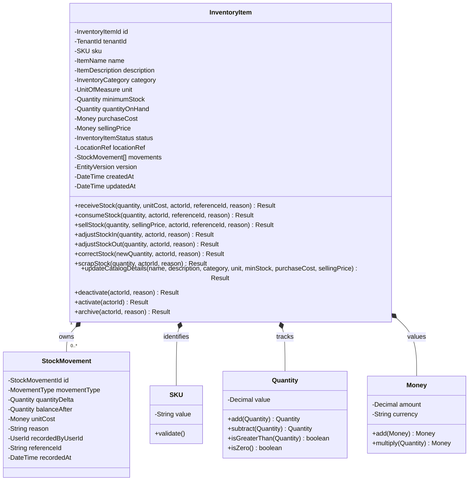
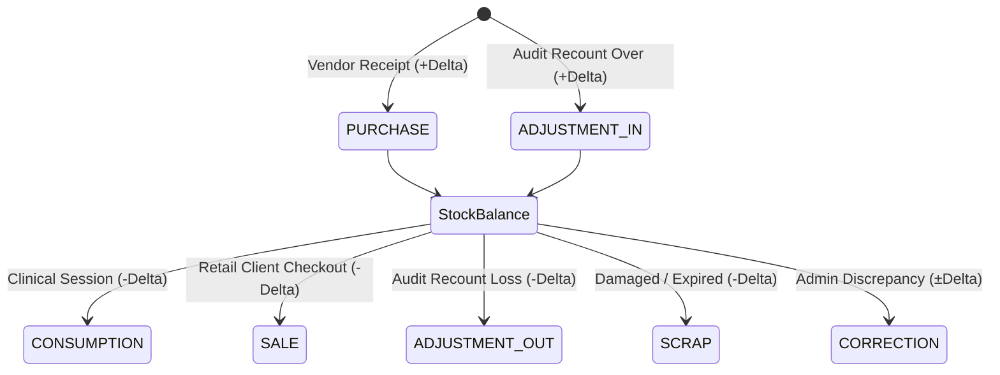
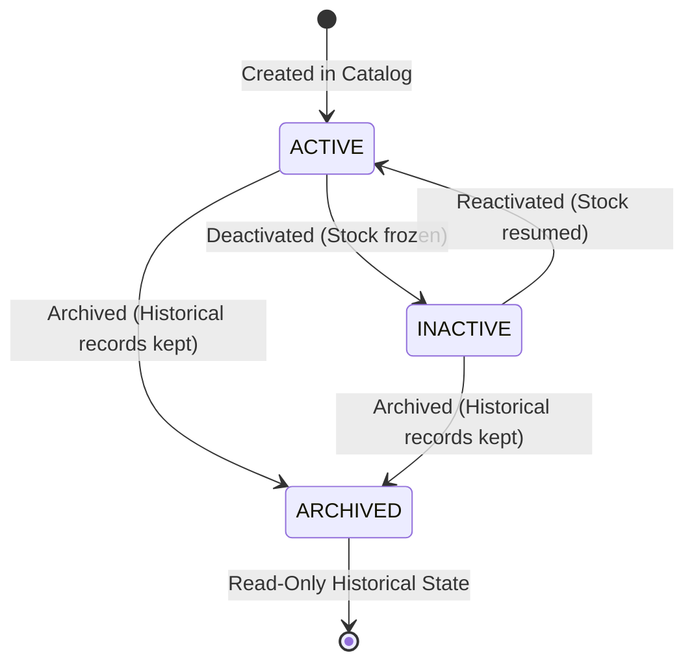

# Phase 6: Consumable Inventory — Domain Model & Business Rules

**Bounded Context**: `Resources` (`packages/core/src/resources/inventory/`)  
**Milestone**: Phase 6.1 — Domain Model & Business Rules  
**Scope**: Consumable Inventory (Products, Categories, Movements, Stock Semantics, Valuation)  
**Author**: Principal Domain Engineer  
**Status**: **APPROVED DOMAIN SPECIFICATION**  
**Document Version**: 1.0.0

---

## 1. Domain Purpose

The **Consumable Inventory** sub-domain within the `Resources` bounded context is responsible for managing, tracking, and maintaining the lifecycle, valuation, and continuous physical availability of all consumable items, medical/clinical supplies, physical retail products, and therapy equipment consumed or sold across Kinergy's multi-tenant operations.

### Core Domain Mission

1. **Accurate Stock Accountability**: Provide an authoritative, deterministic real-time accounting of physical goods on hand at every clinical facility and gym floor.
2. **Strict Invariant Protection**: Guarantee mathematically that physical inventory can never drop below zero (`quantity_on_hand >= 0`) under any circumstances, including concurrent clinical consumptions or point-of-sale transactions.
3. **Immutable Provenance Ledger**: Record every physical alteration in stock through an append-only inventory movement ledger that captures full operational context: what changed, when it changed, how much changed, why it changed, and who authorized it.
4. **Clean Domain Segregation**: Strictly isolate fungible, continuous inventory tracking from discrete, capitalized fixed asset tracking ([ADR-0082](./adr/0082-fixed-asset-domain-modeling-and-complete-segregation-from-inventory.md)).

---

## 2. Domain Vocabulary

| Term                                  | Domain Classification             | Definition                                                                                                                                                                                    |
| :------------------------------------ | :-------------------------------- | :-------------------------------------------------------------------------------------------------------------------------------------------------------------------------------------------- |
| **Inventory Item / Product**          | **Aggregate Root**                | A distinct consumable supply, therapeutic retail good, or clinical material identified by a unique SKU, tracked as a continuous fungible quantity on hand.                                    |
| **SKU (Stock Keeping Unit)**          | **Value Object**                  | The unique, standardized, alphanumeric business identifier assigned to an inventory item (e.g., `SUP-TAPE-001`, `SUP-LOT-100ML`).                                                             |
| **Inventory Category**                | **Value Object / Classification** | The taxonomy bucket grouping related inventory items (e.g., `CLINICAL_SUPPLIES`, `THERAPY_CONSUMABLES`, `RETAIL_PRODUCTS`, `OFFICE_FACILITIES`).                                              |
| **Unit of Measurement (UOM)**         | **Value Object**                  | The standardized physical metric by which stock is counted (e.g., `UNITS`, `BOXES`, `BOTTLES`, `ROLLS`, `MILLILITERS`, `GRAMS`).                                                              |
| **Stock Movement**                    | **Child Entity**                  | An immutable, timestamped record of a physical stock change, capturing delta quantity, post-movement balance, movement type, financial cost, reason, actor, and cross-context correlation ID. |
| **Quantity on Hand (QOH)**            | **Value Object / Balance**        | The authoritative, real-time physical balance of items currently available for consumption or sale at the facility.                                                                           |
| **Minimum Stock / Reorder Threshold** | **Value Object**                  | The minimum safe quantity threshold below which automated replenishment alerts and restock warnings are triggered.                                                                            |
| **Purchase Cost**                     | **Value Object (Money)**          | The monetary amount paid to acquire a single unit of the product from a vendor or distributor.                                                                                                |
| **Selling Price**                     | **Value Object (Money)**          | The monetary price charged to a client or patient when purchasing a unit of retail inventory.                                                                                                 |
| **Movement Type**                     | **Domain Enum**                   | The operational classification of a stock change: `PURCHASE`, `SALE`, `CONSUMPTION`, `ADJUSTMENT_IN`, `ADJUSTMENT_OUT`, `CORRECTION`, `SCRAP`.                                                |
| **Inventory Status**                  | **Domain Enum**                   | The operational catalog availability state: `ACTIVE`, `INACTIVE`, `ARCHIVED`.                                                                                                                 |

---

## 3. Product / Inventory Item Definition

### 3.1 Conceptual vs. Domain Mapping

The conceptual requirements for an inventory product are mapped into strict Clean Architecture domain primitives:



### 3.2 Field Specifications & Semantic Rules

1. **`id` (`InventoryItemId`)**: Strongly typed UUID v4 identifying the aggregate root.
2. **`sku` (`SKU`)**: Uppercase, normalized, trimmed alphanumeric string (3–32 characters, regex `^[A-Z0-9_-]{3,32}$`). Globally unique per tenant.
3. **`name` (`ItemName`)**: Non-empty, sanitized string (1–120 characters).
4. **`description` (`ItemDescription`)**: Optional sanitized markdown or plain text (0–500 characters).
5. **`category` (`InventoryCategory`)**: Domain classification value object ensuring valid taxonomic grouping.
6. **`unit` (`UnitOfMeasure`)**: Standardized measurement enum/VO (`UNITS`, `BOXES`, `BOTTLES`, `ROLLS`, `MILLILITERS`, `GRAMS`).
7. **`minimumStock` (`Quantity`)**: Non-negative decimal threshold. Triggers `LowStockAlertTriggeredDomainEvent` when `quantityOnHand <= minimumStock`.
8. **`quantityOnHand` (`Quantity`)**: Real-time non-negative physical balance. Mutated strictly through domain methods that append a corresponding `StockMovement`.
9. **`purchaseCost` (`Money`)**: Non-negative monetary value object (`Decimal(10, 2)`, currency code `CAD`/`USD`).
10. **`sellingPrice` (`Money`)**: Non-negative monetary value object (`Decimal(10, 2)`). Represents clinical retail price or zero if strictly clinical consumption only.
11. **`status` (`InventoryItemStatus`)**: `ACTIVE`, `INACTIVE`, `ARCHIVED`. Stock movements can only be applied to `ACTIVE` items.
12. **`locationRef` (`LocationRef`)**: Structural value object specifying facility room, shelf, aisle, or bin (`facilityId`, `roomRef`, `binCode`).
13. **`version` (`EntityVersion`)**: Integer counter incremented on every aggregate state mutation for Optimistic Concurrency Control (OCC).

---

## 4. Inventory Category Definition

Categories group inventory items for catalog organization, reporting, clinical supply allocation, and filtering.

### Category Taxonomy

- `HEALTHY_MEALS`: Fresh and prepared nutritional meal portions for clients and athletes (perishable, retail eligible).
- `HEALTHY_DRINKS`: Electrolyte beverages, smoothies, juices, and functional wellness drinks (perishable, retail eligible).
- `CLEANING_SUPPLIES`: Disinfectants, sanitizing wipes, detergents, and facility hygiene materials (non-perishable, operational).
- `OFFICE_SUPPLIES`: Administrative consumables, paper goods, printing items, and stationery (non-perishable, operational).
- `SUPPLEMENTS`: Nutritional powders, vitamins, protein bars, and performance supplements (non-perishable, retail eligible).
- `CLINICAL_SUPPLIES`: Acupuncture needles, ultrasound gel, massage lotions, and exam disposables.
- `THERAPY_CONSUMABLES`: Kinesiology tape, resistance bands, massage creams, rehabilitation grips.
- `RETAIL_PRODUCTS`: Commercial merchandise, foam rollers, branded apparel, and gear for sale.

### Design Decision (ADR-0088)

In accordance with [ADR-0088](./adr/0088-inventory-category-classification-strategy.md) and Kinergy's architectural conventions, `InventoryCategory` is implemented as a **code-defined domain enum** backed by a domain metadata registry and native PostgreSQL enum, avoiding unnecessary CRUD infrastructure and ensuring strict report aggregation consistency.

---

## 5. Inventory Movement Definition

Every physical or balance change in inventory is permanently recorded as an immutable `StockMovement` child entity.

### 5.1 Movement Attributes

- **`id` (`StockMovementId`)**: UUID v4 uniquely identifying the ledger entry.
- **`inventoryItemId` (`InventoryItemId`)**: Parent aggregate reference.
- **`movementType` (`MovementType`)**: Operational reason for mutation.
- **`quantityDelta` (`Quantity`)**: Signed decimal indicating stock delta:
  - Positive ($+\Delta$) for stock increases (`PURCHASE`, `ADJUSTMENT_IN`).
  - Negative ($-\Delta$) for stock decreases (`SALE`, `CONSUMPTION`, `ADJUSTMENT_OUT`, `SCRAP`).
  - Signed ($+\Delta$ or $-\Delta$) for `CORRECTION`.
- **`balanceAfter` (`Quantity`)**: Authoritative stock balance immediately following the mutation.
- **`unitCost` (`Money`)**: The unit cost at the time of the transaction.
- **`reason` (`String`)**: Non-empty explanation or clinical rationale (3–255 characters).
- **`recordedByUserId` (`UserId`)**: Authenticated identity of the staff member or clinician executing the change.
- **`referenceId` (`String?`)**: Optional correlation identifier linking to external contexts (e.g., `TreatmentSession.id`, `POS_INVOICE_123`, `PO_9876`).
- **`recordedAt` (`DateTime`)**: Immutable UTC timestamp.

### 5.2 Movement Type Taxonomy



### 5.3 Inventory Movement Semantics

The `StockMovement` child entity serves as the authoritative, immutable audit ledger for every stock mutation across Kinergy facilities. It strictly implements the following operational semantics:

| Dimension               | Domain Specification                                                                                                                                                                 | Implementation & Governance Rule                                                                 |
| :---------------------- | :----------------------------------------------------------------------------------------------------------------------------------------------------------------------------------- | :----------------------------------------------------------------------------------------------- |
| **Type**                | Canonical `StockMovementType` enum (`PURCHASE`, `SALE`, `CONSUMPTION`, `ADJUSTMENT_IN`, `ADJUSTMENT_OUT`, `CORRECTION`, `SCRAP`).                                                    | Explicitly classified; prevents generic or unclassified inventory mutations.                     |
| **Direction**           | `INCREASE` ($+\Delta$), `DECREASE` ($-\Delta$), or `VARIABLE` ($\pm\Delta$ for `CORRECTION`).                                                                                        | Deterministic directional mapping governed by domain aggregate methods.                          |
| **Quantity Meaning**    | Mutation methods accept strictly positive scalar quantities (`quantity > 0`). The aggregate computes signed `quantityDelta` and resulting non-negative `balanceAfter` ($QOH \ge 0$). | Makes invalid states unrepresentable; avoids ambiguity over who supplies the sign.               |
| **Actor**               | Reuses Kinergy's unified `UserId` string format (`recordedByUserId`).                                                                                                                | Non-empty string mandatory for every single movement; complete audit provenance.                 |
| **Reason**              | Non-empty string ($\ge 3$ characters, max 255). Mandatory for all manual adjustments, vendor receipts, clinical consumptions, sales, and scraps.                                     | Answers _why_ the stock mutation occurred without free-form ambiguous metadata.                  |
| **Timestamp**           | Immutable UTC `DateTime` (`recordedAt = Clock.now()`).                                                                                                                               | Chronologically ordered and immutable timestamp recording _when_ mutation occurred.              |
| **Immutability**        | `Object.freeze(this)` enforced in domain entity; database rows are write-once append-only (`onDelete: Restrict`, no `UPDATE` or `DELETE` endpoints).                                 | The movement ledger is an immutable historical record; past records cannot be edited or deleted. |
| **Correction Strategy** | Historical errors are corrected exclusively via **compensating movements** (`CORRECTION` or `ADJUSTMENT_IN` / `ADJUSTMENT_OUT`) rather than mutating past rows.                      | Preserves complete forensic auditability and prevents silent revision of accounting history.     |

---

## 6. Stock Semantics

1. **Materialized Authoritative Balance**: `InventoryItem.quantityOnHand` is the materialized authoritative balance. It is never allowed to drift from the cumulative sum of `StockMovement.quantityDelta`:
   $$\text{quantityOnHand} \equiv \sum_{m \in \text{movements}} m.\text{quantityDelta}$$
2. **Non-Negative Invariant [INV-1]**: At no point in time may `quantityOnHand` be less than zero ($QOH \ge 0.00$). Any operation that would result in $QOH - \Delta < 0.00$ is rejected at the domain boundary with an `InsufficientStockException`.
3. **Atomic Balance and Ledger Update**: The modification of `quantityOnHand` and the creation of the `StockMovement` ledger entry are performed within the same aggregate method and persisted atomically inside `prisma.$transaction`.
4. **Reorder Alert Threshold**: When `quantityOnHand` drops below `minimumStock`, the aggregate raises a `LowStockThresholdReachedDomainEvent` to notify clinical managers.
5. **Concrete Operational Example**:
   - Initial physical inventory: `quantityOnHand = 15.00`
   - Clinical treatment consumes 3 units: `consumeStock({ quantity: 3.00, ... })`
   - New physical balance: `quantityOnHand = 12.00`
   - Appended ledger movement: `quantityDelta = -3.00`, `balanceAfter = 12.00`.

---

## 7. Quantity Semantics

In accordance with **[ADR-0089](./adr/0089-inventory-monetary-quantity-and-unit-precision-semantics.md)**, all quantities across the Consumable Inventory domain follow strict fixed-point decimal rules:

1. **Fixed Scale 2 Representation**: All quantities are modeled using the `Quantity` Value Object backed by `Prisma.Decimal` / `Decimal.js` with **Scale 2** (`DECIMAL(10, 2)`).
   - Arbitrary precision floating-point numbers are strictly forbidden.
   - Minimum discrete step / precision is `0.01` (hundredths).
   - Excess decimal precision is normalized via half-up rounding (`Math.round(value * 100) / 100`).
2. **Discrete Count vs Continuous Physical Quantities**:
   - **Discrete Counts**: Represented as whole numbers with `.00` (e.g., `10.00` boxes of needles, `24.00` bottles of recovery drink).
   - **Continuous Physical Metrics**: Represented as fractional hundredths (e.g., `2.50` bottles of sanitizer, `250.00` milliliters of ultrasound gel, `0.75` kg of powder).
3. **Zero Behavior**:
   - `quantityOnHand = 0.00` is permitted and indicates an out-of-stock item (`isOutOfStock() === true`).
   - `minimumStock = 0.00` is permitted and indicates that no automated safety threshold is set for this SKU.
   - Stock mutation delta magnitude `quantity` must be strictly positive ($> 0.00$). Zero-quantity mutations are rejected.
4. **Negative Value Behavior**:
   - Negative values are strictly forbidden for `quantityOnHand` and `minimumStock`.
   - Negative inputs for `receiveStock`, `consumeStock`, `sellStock`, `adjustStockIn`, `adjustStockOut`, or `scrapStock` throw `InvalidInventoryItemStateException` or `InvalidQuantityException`.
   - Negative quantities are permitted _exclusively_ within the immutable `StockMovement.quantityDelta` field for outbound stock decreases (`SALE`, `CONSUMPTION`, `ADJUSTMENT_OUT`, `SCRAP`).
5. **Concrete Operational Examples**:
   - `"Quantity 1.00"` means exactly one discrete unit, box, bottle, or roll.
   - `"Quantity 1.25"` means one and a quarter units (e.g., 1.25 bottles of sanitizer consumed across two treatment rooms).
   - `"Quantity 0.50"` means half a box or half a container (e.g., 0.50 box of 100 sterile gauze swabs, representing 50 swabs).
   - `"Quantity 25.50"` means 25.50 grams of nutritional supplement or electrolyte powder.

---

## 8. Monetary Semantics

In accordance with **[ADR-0089](./adr/0089-inventory-monetary-quantity-and-unit-precision-semantics.md)**, all financial values (`purchaseCost`, `sellingPrice`, `unitCost`) follow strict banking and valuation standards:

1. **Explicit Currency Value Object**: Modeled via the `Money` Value Object wrapping `amount: number` (fixed Scale 2) and `currency: string` (ISO-4217, uppercase 3-letter code, baseline default `USD`).
2. **Zero Float Financial Arithmetic**: IEEE-754 floating point arithmetic is strictly prohibited for persistent financial calculations. All operations (`add`, `subtract`, `multiply`) round half-up to exact cents.
3. **Non-Negative Valuation**: `purchaseCost` and `sellingPrice` must be $\ge 0.00$. Negative monetary amounts throw `InvalidMoneyException`.
4. **Zero-Priced Items**:
   - `sellingPrice = Money.zero("USD")` is explicitly permitted for non-retail clinical supplies (e.g., disposable gloves, acupuncture needles) that are used internally in treatment sessions and never sold directly to clients.
   - `purchaseCost = Money.zero("USD")` is permitted for promotional samples, donated items, or bundled supplier kits.
5. **Dynamic Inventory Valuation Formula**:
   $$\text{TotalStockValuation} = \text{quantityOnHand} \times \text{purchaseCost}$$
   Example: `12.50` units $\times$ `10.00 USD` purchase cost $= \$125.00\text{ USD}$.
6. **Concrete Operational Examples**:
   - `"Purchase cost 12.50 USD"` means the clinic acquired the item for twelve dollars and fifty cents per unit of measure.
   - `"Selling price 24.99 USD"` means the retail price charged to a client at point-of-sale is twenty-four dollars and ninety-nine cents.
   - `"Selling price 0.00 USD"` means the item is strictly a clinical or facility consumable not available for retail sale.

---

## 9. Unit of Measure (UOM) Semantics

In accordance with **[ADR-0089](./adr/0089-inventory-monetary-quantity-and-unit-precision-semantics.md)**, units of measure are classified via the canonical `UnitOfMeasure` domain enum:

1. **Standardized Taxonomy**:
   - `UNITS`: Discrete individual items (e.g., single meal portion, resistance band, foam roller).
   - `BOXES`: Multi-item packaging cartons (e.g., box of 100 gloves, box of 50 needles).
   - `BOTTLES`: Individual liquid or spray containers (e.g., 500ml beverage bottle, 1L disinfectant spray).
   - `ROLLS`: Rolled continuous goods (e.g., 5m roll of kinesiology tape, exam table paper).
   - `MILLILITERS`: Volumetric clinical liquids and gels (e.g., ultrasound transmission gel, massage oil).
   - `GRAMS`: Continuous mass measurements (e.g., electrolyte powder, whey protein tubs).
2. **Discrete vs Continuous Enforcement**:
   - Discrete units (`UNITS`, `BOXES`, `BOTTLES`, `ROLLS`) typically transact in integer or half-unit increments.
   - Continuous units (`MILLILITERS`, `GRAMS`) support fractional hundredths precision (`0.01` ml / g).
3. **Consistency with Architectural Baseline**: Implemented as a pure code-defined domain enum with validation metadata (`UNIT_OF_MEASURE_REGISTRY`), avoiding unneeded CRUD infrastructure while ensuring type-safe database storage via PostgreSQL enum.
4. **Concrete Operational Examples**:
   - An item with `name: "Electrolyte Recovery Drink"`, `unit: UnitOfMeasure.BOTTLES`, `quantityOnHand: 24.00` represents 24 discrete bottles in the retail refrigerator.
   - An item with `name: "Therapeutic Ultrasound Gel"`, `unit: UnitOfMeasure.MILLILITERS`, `quantityOnHand: 1500.00` represents 1,500 ml of bulk gel across clinical treatment carts.

---

## 10. Status Semantics & Catalog Lifecycle



- **`ACTIVE`**: Item is active in the catalog. Can be received, consumed, sold, adjusted, or scrapped.
- **`INACTIVE`**: Item is temporarily unavailable or suspended. Mutations are blocked except administrative reconciliation.
- **`ARCHIVED`**: Item is permanently discontinued. Read-only for historical auditing; cannot be mutated or reactivated.

---

## 11. Business Invariants

The Consumable Inventory domain strictly enforces the following ten invariants:

| Invariant Code | Invariant Name                        | Enforcing Rule                                                                                       |
| :------------- | :------------------------------------ | :--------------------------------------------------------------------------------------------------- |
| **[INV-1]**    | **Non-Negative Stock Balance**        | $QOH \ge 0$. Stock can never be decremented below zero.                                              |
| **[INV-2]**    | **Mandatory Movement Provenance**     | Every change to `quantityOnHand` MUST generate exactly one immutable `StockMovement`.                |
| **[INV-3]**    | **Strict Quantity Delta Positivity**  | Mutation inputs must be $> 0$. Zero-quantity or negative-quantity mutation arguments are rejected.   |
| **[INV-4]**    | **Unique SKU per Tenant**             | SKU must be unique across all non-deleted inventory items within a tenant.                           |
| **[INV-5]**    | **Active Catalog State Required**     | Stock additions and deductions can only be performed on items with `status === ACTIVE`.              |
| **[INV-6]**    | **Monetary Non-Negativity**           | `purchaseCost.amount >= 0` and `sellingPrice.amount >= 0`.                                           |
| **[INV-7]**    | **Immutable Movement History**        | `StockMovement` records can never be updated, soft-deleted, or removed.                              |
| **[INV-8]**    | **Audit Trail Provenance**            | Every `StockMovement` must have a valid `recordedByUserId`, `reason` ($\ge 3$ chars), and timestamp. |
| **[INV-9]**    | **Deterministic Balance After**       | `movement.balanceAfter` must equal `movement.quantityDelta + previousBalance` exactly.               |
| **[INV-10]**   | **Optimistic Concurrency Protection** | Every aggregate state transition increments `version`, protecting against lost updates.              |

---

## 12. Stock Mutation Rules

### 12.1 Purchase Receipt (`receiveStock`)

- **Operation**: `PURCHASE`
- **Formula**: $QOH_{\text{new}} = QOH_{\text{current}} + \Delta$
- **Invariants**: $\Delta > 0$, Item is `ACTIVE`, valid vendor/invoice reference provided.
- **Resulting Movement**: Positive $\Delta$, updated `unitCost`.

### 12.2 Clinical Consumption (`consumeStock`)

- **Operation**: `CONSUMPTION`
- **Formula**: $QOH_{\text{new}} = QOH_{\text{current}} - \Delta$
- **Invariants**: $\Delta > 0$, Item is `ACTIVE`, $QOH_{\text{current}} - \Delta \ge 0$, valid clinician actor and optional `TreatmentSession.id`.
- **Resulting Movement**: Negative $-\Delta$.

### 12.3 Retail Sale (`sellStock`)

- **Operation**: `SALE`
- **Formula**: $QOH_{\text{new}} = QOH_{\text{current}} - \Delta$
- **Invariants**: $\Delta > 0$, Item is `ACTIVE`, $QOH_{\text{current}} - \Delta \ge 0$, selling price recorded.
- **Resulting Movement**: Negative $-\Delta$.

### 12.4 Positive Stock Adjustment (`adjustStockIn`)

- **Operation**: `ADJUSTMENT_IN`
- **Formula**: $QOH_{\text{new}} = QOH_{\text{current}} + \Delta$
- **Invariants**: Physical count higher than ledger; explicit audit reason required.
- **Resulting Movement**: Positive $+\Delta$.

### 12.5 Negative Stock Adjustment (`adjustStockOut`)

- **Operation**: `ADJUSTMENT_OUT`
- **Formula**: $QOH_{\text{new}} = QOH_{\text{current}} - \Delta$
- **Invariants**: Physical count lower than ledger; $QOH_{\text{current}} - \Delta \ge 0$; explicit audit reason required.
- **Resulting Movement**: Negative $-\Delta$.

### 12.6 Discrepancy Correction (`correctStock`)

- **Operation**: `CORRECTION`
- **Formula**: Sets $QOH_{\text{new}} = \text{targetCount}$, where $\Delta = \text{targetCount} - QOH_{\text{current}}$.
- **Invariants**: $\text{targetCount} \ge 0$, explicit managerial reason required.
- **Resulting Movement**: Signed $\Delta$ with type `CORRECTION`.

### 12.7 Stock Scrap / Spoilage (`scrapStock`)

- **Operation**: `SCRAP`
- **Formula**: $QOH_{\text{new}} = QOH_{\text{current}} - \Delta$
- **Invariants**: Expired, contaminated, or broken supply discarded; $QOH_{\text{current}} - \Delta \ge 0$; scrap reason required.
- **Resulting Movement**: Negative $-\Delta$.

---

## 13. History & Audit Requirements

1. **Zero Data Destruction**: No `StockMovement` may ever be deleted or edited.
2. **Discrepancy Resolution**: If an erroneous movement was entered (e.g., recorded 100 boxes received instead of 10), the error is rectified exclusively by issuing a compensating `CORRECTION` or `ADJUSTMENT_OUT` movement with a referenced audit reason.
3. **Audit Log Reconstruction**: The complete historical timeline of an item can be reconstructed by querying:
   ```sql
   SELECT * FROM stock_movements
   WHERE inventory_item_id = $1
   ORDER BY recorded_at ASC;
   ```

---

## 14. Aggregate Boundaries & Clean Architecture Isolation

```
packages/core/src/resources/
├── domain/
│   ├── inventory/
│   │   ├── inventory-item.aggregate.ts        <-- Aggregate Root
│   │   ├── stock-movement.entity.ts           <-- Child Entity
│   │   ├── value-objects/
│   │   │   ├── sku.vo.ts
│   │   │   ├── quantity.vo.ts
│   │   │   ├── money.vo.ts
│   │   │   ├── inventory-category.vo.ts
│   │   │   ├── unit-of-measure.vo.ts
│   │   │   └── location-ref.vo.ts
│   │   ├── events/
│   │   │   ├── stock-received.event.ts
│   │   │   ├── stock-consumed.event.ts
│   │   │   ├── stock-depleted.event.ts
│   │   │   └── low-stock-threshold-reached.event.ts
│   │   ├── exceptions/
│   │   │   ├── insufficient-stock.exception.ts
│   │   │   ├── invalid-sku.exception.ts
│   │   │   ├── inventory-inactive.exception.ts
│   │   │   └── optimistic-lock.exception.ts
│   │   └── repositories/
│   │       └── inventory-item.repository.interface.ts
│   └── shared/
├── application/
│   └── inventory/
│       ├── commands/
│       ├── queries/
│       └── services/
└── infrastructure/
    └── persistence/
        └── prisma/
```

### Boundary Rules

- **No Direct Table Mutation**: `StockMovement` cannot be created outside of `InventoryItem`.
- **Zero Framework Annotations**: Domain entities and value objects contain zero NestJS, Prisma, TypeORM, or React imports.
- **Cross-Context Decoupling**: External aggregates (e.g., `User`, `TreatmentSession`) are referenced strictly via scalar string IDs (`UserId`, `referenceId`).

---

## 15. Domain vs. Application Responsibility Split

| Responsibility                          | Domain Layer (`InventoryItem`, VOs)   | Application Layer (Use Cases, Handlers) |
| :-------------------------------------- | :------------------------------------ | :-------------------------------------- |
| **Enforce Non-Negative Stock**          | **YES** (`consumeStock`, `sellStock`) | No (delegates to domain)                |
| **Validate SKU Format**                 | **YES** (`SKU.create()`)              | No (delegates to VO)                    |
| **Calculate New Balance & Delta**       | **YES** (`quantityOnHand.subtract()`) | No (delegates to domain)                |
| **Raise Domain Events**                 | **YES** (`this.addDomainEvent(...)`)  | No (dispatches after commit)            |
| **Database Transaction ($transaction)** | No (Ignorant of DB)                   | **YES** (Unit of Work orchestration)    |
| **Optimistic Lock Retry**               | No (Fails fast on version mismatch)   | **YES** (Retries on conflict)           |
| **Publish Security Audit Logs**         | No (Ignorant of Audit Service)        | **YES** (`IAuditService.record()`)      |
| **Authorize Permissions**               | No (Ignorant of RBAC)                 | **YES** (Guards / Handler security)     |

---

## 16. Persistence Mapping Principles & Implementation Reality

1. **Table Isolation**: Maps directly to `inventory_items` and `stock_movements` PostgreSQL tables in `prisma/schema.prisma`.
2. **OCC Mapping**: Aggregate `version` maps to `inventory_items.version INT NOT NULL DEFAULT 1` with atomic transactional increment in `PrismaInventoryItemRepository`.
3. **Database Constraint Parity**: The database schema defines strict non-null fields, relational integrity (`onDelete: Restrict`), unique constraints (`sku`), and composite B-Tree indexes (`[sku]`, `[tenantId]`, `[status]`, `[category]`, `[quantityOnHand]`, `[inventoryItemId, recordedAt]`).
4. **Prisma Mapper Pattern**:
   - `PrismaInventoryItemMapper`: Reconstitutes `InventoryItem` aggregate roots from Prisma query records with strict decimal precision and strongly typed Value Objects.
   - `PrismaStockMovementMapper`: Reconstitutes immutable `StockMovement` child entities.
5. **Atomic Transaction Scope**: `PrismaInventoryItemRepository.save()` commits aggregate updates and append-only movement ledger entries within a single `prisma.$transaction`.
6. **Architecture Boundary Purity**: Validated via `resources-architecture-boundaries.spec.ts` ensuring zero leaky abstractions or framework couplings inside the pure domain.

---

## 17. Explicit Non-Goals

The following features are intentionally **out of scope** for Phase 6.1:

- ❌ Multi-warehouse transfer orders and in-transit routing.
- ❌ Purchase order (PO) approval workflows and vendor electronic invoicing.
- ❌ Automated barcode/RFID hardware scanner driver integrations.
- ❌ Double-entry general ledger journal balance sheets.
- ❌ Fixed asset tracking (addressed separately under Fixed Assets domain).

---

## 18. Open Questions & Resolutions

| #     | Architectural Question                                       | Domain Resolution                                                                                                                                        |
| :---- | :----------------------------------------------------------- | :------------------------------------------------------------------------------------------------------------------------------------------------------- |
| **1** | _Should selling price be mandatory for all inventory items?_ | **No.** Many items are clinical-only consumables (e.g., disposable gloves, sanitizer). Selling price defaults to `Money.zero()` for non-retail supplies. |
| **2** | _Should quantity be an integer or decimal?_                  | **Decimal(10, 2).** Necessary for fractional clinical liquids, gels, and continuous bulk supplies.                                                       |
| **3** | _Can stock movements be backdated?_                          | **No.** All movements are recorded with the current UTC timestamp `Clock.now()` to ensure immutable chronological ordering.                              |
