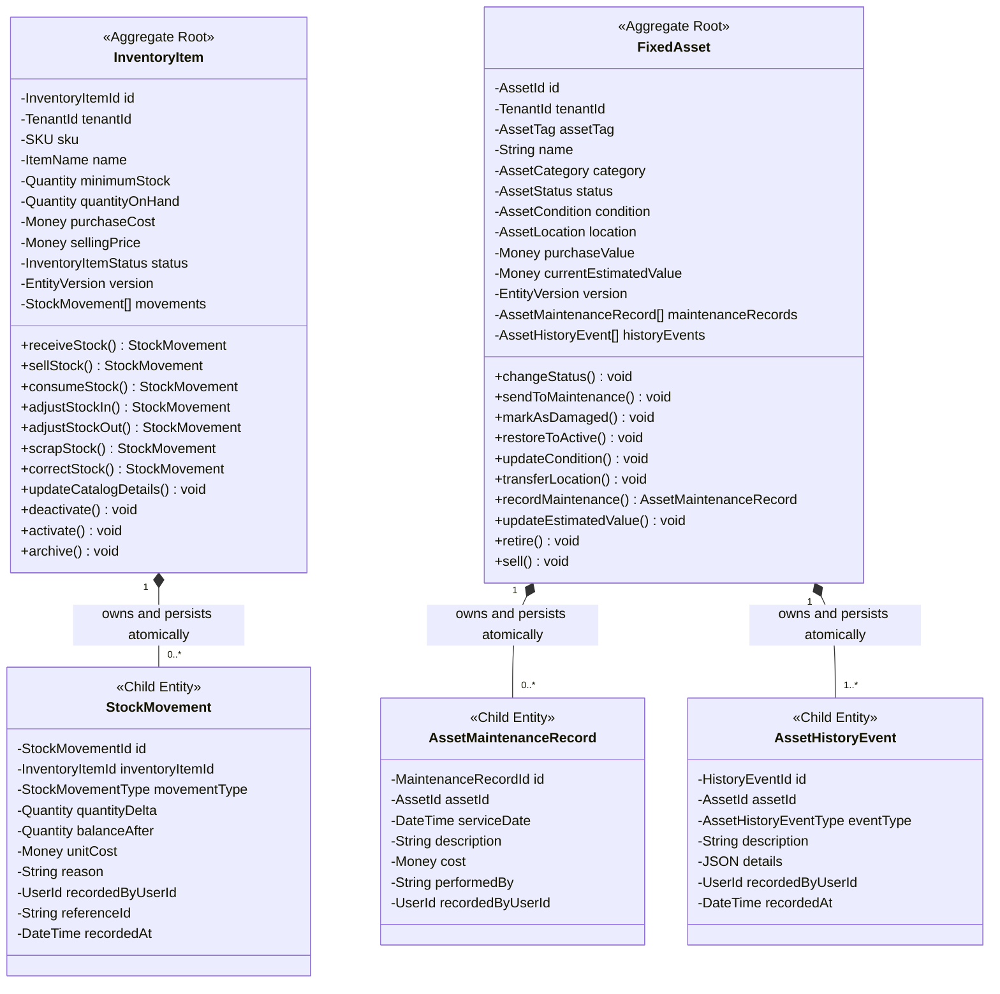
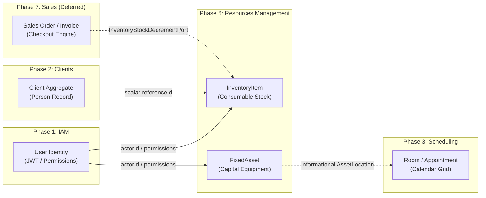
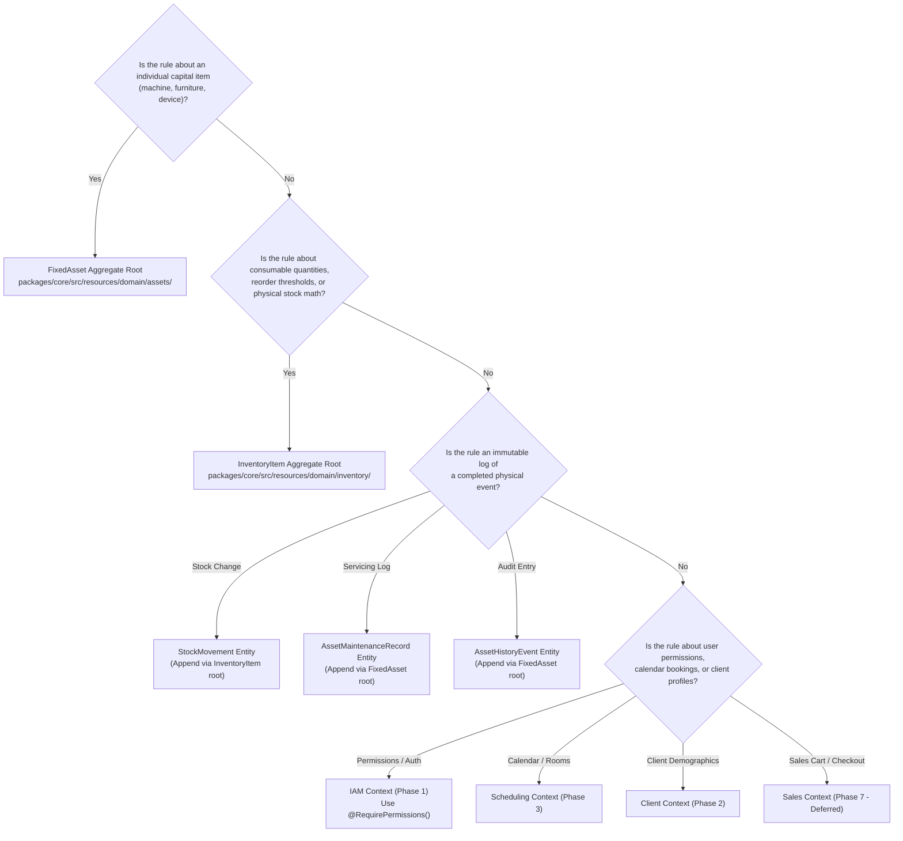

# Resources Management — Entity Responsibility Matrix & Placement Guide

- **Status**: Authoritative Behavioral Contract Baseline (APPROVED & ACTIVE)
- **Bounded Context**: Resources Management (`packages/core/src/resources/`, `apps/api/src/resources/`)
- **Author**: Principal Software Architect & Lead Domain Engineer
- **Governing ADRs**: [ADR-0081](./adr/0081-resources-bounded-context-topology-and-domain-segregation.md) through [ADR-0106](./adr/0106-sales-inventory-integration-boundary-and-stock-ownership-policy.md)

---

## 1. Objective & Architectural Purpose

The primary failure mode in maturing enterprise systems is **domain logic misplacement**—placing business logic where it is convenient rather than where it belongs. When an engineer places sales billing math inside an inventory entity, calendar room-locking logic inside an asset model, or direct database mutations inside an API controller, the bounded context degenerates into a tangled, unmaintainable monolith.

This document serves as an **authoritative behavioral contract** and **rule placement guide**. It enables any senior engineer to determine precisely where a new business rule, validation guard, or state mutation belongs before writing code.

---

## 2. Master Entity Responsibility Matrix

| Entity / Concept             | Boundary & Type                                | Owns                                                                                                                                                                                                                                                                                                                                                                                                                                                                                                                                    | Does NOT Own                                                                                                                                                                                                                                                                   |
| :--------------------------- | :--------------------------------------------- | :-------------------------------------------------------------------------------------------------------------------------------------------------------------------------------------------------------------------------------------------------------------------------------------------------------------------------------------------------------------------------------------------------------------------------------------------------------------------------------------------------------------------------------------- | :----------------------------------------------------------------------------------------------------------------------------------------------------------------------------------------------------------------------------------------------------------------------------- |
| **`InventoryItem`**          | **Aggregate Root** _(Consumables)_         | • SKU validation & format `[INV-INV-1]` • Physical stock balance (`quantityOnHand`) • Negative stock defense `[INV-INV-2]` • Reorder threshold & low-stock alerts • Catalog publishing states (`ACTIVE`, `INACTIVE`, `ARCHIVED`) • Acquisition purchase cost & selling price values • Unit of Measure (`UOM`) • Atomic generation of `StockMovement` child entities • Optimistic Concurrency Control (`version`)                                                                                        | • Point-of-Sale (POS) transactions • Sales checkout, invoicing & payments • Client purchase history & billing profiles • Supplier vendor management & purchase orders • Physical warehouse bay/rack routing algorithms • User authentication & permissions |
| **`StockMovement`**          | **Child Entity** _(Double-Entry Ledger)_   | • Immutable physical delta quantity ($\pm \Delta Q$) • Post-movement balance snapshot (`balanceAfter`) • Valuation cost snapshot (`unitCost`) • Movement classification semantics (`PURCHASE`, `SALE`, etc.) • Audit attribution (`recordedByUserId`, `reason`, `referenceId`) • Ledger immutability (`onDelete: Restrict`)                                                                                                                                                                                         | • Product catalog metadata (name, description) • SKU reassignment or price updates • Balance mutation (cannot alter its own balance) • Stock replenishment triggering • External order fulfillment logic                                                       |
| **`FixedAsset`**             | **Aggregate Root** _(Capital Assets)_      | • Physical asset tag & serial number uniqueness • Discrete capital equipment identity • 5x5 Lifecycle State Machine (`AssetLifecycleStateMachine`) • Physical condition rating (`AssetCondition`) • Physical placement location (`AssetLocation` VO) • Acquisition purchase value & current estimated book value • Serviceability guard `[AST-INV-9]` • Terminal liquidation lock `[AST-INV-1]` (`SOLD`) • Atomic history & maintenance record logging • Optimistic Concurrency Control (`version`) | • Appointment calendar bookings • Room availability & conflict resolution • Therapist clinical scheduling • Member gym check-ins & pass validations • Depreciation accounting journal entries • User authentication & credential management                |
| **`AssetMaintenanceRecord`** | **Child Entity** _(Historical Log)_        | • Maintenance servicing date & description • Direct servicing financial cost (`Money`) • Technician / vendor attribution (`performedBy`) • Operational servicing notes • Immutable record creation & user provenance                                                                                                                                                                                                                                                                                                    | • Asset lifecycle state transitions (evaluated by root) • Room reservation or calendar closure • External invoice payment or AP accounting • Technician work-shift scheduling                                                                                      |
| **`AssetHistoryEvent`**      | **Child Entity** _(Audit Trail)_           | • Historical event classification (`AssetHistoryEventType`) • Structured change payload (`details` JSON) • Human-readable event description • Immutable audit timestamp & actor attribution • Anti-noise suppression (no events for no-op changes)                                                                                                                                                                                                                                                                      | • Asset state validation or mutation logic • Security audit telemetry shipping • Reverting or undoing historical operations                                                                                                                                            |
| **`Client`**                 | **External Aggregate** _(Phase 2 Context)_ | • Business person record & identity • Demographics, contact info & emergency contacts • Membership status & clinical profile                                                                                                                                                                                                                                                                                                                                                                                                    | • Consumable inventory mutations or stock balances • Facility capital asset tracking • Warehouse stock deductions                                                                                                                                                      |
| **`User` / `Identity`**      | **External Aggregate** _(Phase 1 Context)_ | • User authentication credentials & Argon2id hashes • Dual-token JWT issuance & Refresh Token Rotation (RTR) • RBAC / ABAC permissions (`inventory.read`, `assets.write`, etc.) • Tenant membership boundary                                                                                                                                                                                                                                                                                                                | • Domain resource lifecycles or state machines • Inventory stock counts or catalog pricing • Capital asset condition ratings                                                                                                                                           |
| **`Appointment` / `Room`**   | **External Aggregate** _(Phase 3 Context)_ | • Calendar time-slots & therapist availability • Room capacity & double-booking conflict prevention • Recurrence series generation & DST clamping                                                                                                                                                                                                                                                                                                                                                                               | • Capital asset condition or maintenance logs • Asset liquidation or salvage realization • Equipment purchase cost tracking                                                                                                                                            |
| **`SalesOrder` / `Invoice`** | **External Context** _(Phase 7 Deferred)_  | • Shopping cart, checkout flow & line items • Payment gateway integration (Stripe) & receipts • Tax calculation & customer billing accounts                                                                                                                                                                                                                                                                                                                                                                                     | • Physical warehouse stock balances • Negative stock prevention rules • Direct database updates to `inventory_items`                                                                                                                                                   |

---

## 3. Detailed Entity Specifications

---

### 3.1 `InventoryItem` (Aggregate Root)

- **Purpose**: Authoritative entity governing a fungible consumable supply or retail catalog item. Enforces stock balance invariants, prevents negative stock, and manages catalog availability.
- **Invariants**:
  1. `[INV-INV-1]`: Alphanumeric SKU matching `^[A-Z0-9_-]{3,50}$`. Unique per tenant.
  2. `[INV-INV-2]`: $\text{quantityOnHand} \ge 0.00$ at all times. Physical stock cannot drop below zero.
  3. `[INV-INV-3]`: $\text{minimumStock} \ge 0.00$. Low stock alert triggers when $\text{QOH} \le \text{minimumStock}$ (including exact equality).
  4. Operational Catalog State Guard: Stock mutations (`PURCHASE`, `SALE`, `CONSUMPTION`, `SCRAP`, `ADJUSTMENT`) are strictly forbidden on `INACTIVE` or `ARCHIVED` items.
  5. Archive Zero-Stock Guard: An item can transition to `ARCHIVED` **only** if $\text{quantityOnHand} == 0.00$.
  6. Unit of Measure Immutability: UOM cannot be changed if the item has positive stock on hand or existing movement ledger records.
- **Lifecycle**:
  - Initial: Created in `ACTIVE` (default) or `INACTIVE` status.
  - Operational: Toggled between `ACTIVE` $\leftrightarrow$ `INACTIVE` via `activate()` / `deactivate()`.
  - Terminal: Transitioned to `ARCHIVED` via `archive()` once stock is fully depleted ($\text{QOH} = 0.00$).
- **Relationships**:
  - Composition parent of 1..* `StockMovement` child entities.
  - Scalar string reference `recordedByUserId` (User identity in Phase 1 IAM).
  - Informational value object `LocationRef` (`room`, `aisle`, `shelf`, `bin`).
- **Mutation Entry Points**:
  - `receiveStock()`, `sellStock()`, `consumeStock()`, `adjustStockIn()`, `adjustStockOut()`, `scrapStock()`, `correctStock()`, `updateCatalogDetails()`, `deactivate()`, `activate()`, `archive()`.
- **Repository Ownership**:
  - `InventoryItemRepositoryInterface` / `PrismaInventoryItemRepository`.
  - Atomically saves item updates and appends new `StockMovement` records in a single Prisma `$transaction`.
- **Test Coverage**:
  - Unit: [`inventory-item.aggregate.spec.ts`](file:///c:/Projects/kinergy-platform/packages/core/src/resources/domain/inventory/__tests__/inventory-item.aggregate.spec.ts)
  - Invariants: [`inventory-stock-mutation-invariants.spec.ts`](file:///c:/Projects/kinergy-platform/packages/core/src/resources/domain/__tests__/inventory-stock-mutation-invariants.spec.ts)
  - Integration: [`inventory-application-persistence-integration.spec.ts`](file:///c:/Projects/kinergy-platform/packages/core/src/resources/application/__tests__/inventory-application-persistence-integration.spec.ts)

---

### 3.2 `StockMovement` (Child Entity — Double-Entry Ledger)

- **Purpose**: Authoritative, append-only historical ledger record of every physical stock balance change. Guarantees deterministic auditability from inception.
- **Invariants**:
  1. Absolute Immutability: Once created, movement records cannot be updated or deleted (`onDelete: Restrict` in database).
  2. Signed Delta Alignment: `PURCHASE` and `ADJUSTMENT_IN` have positive deltas ($> 0$); `SALE`, `CONSUMPTION`, `SCRAP`, and `ADJUSTMENT_OUT` have negative deltas ($< 0$).
  3. Snapshot Integrity: Captures post-movement balance ($\text{balanceAfter} \ge 0.00$) and acquisition unit cost snapshot (`unitCost`).
  4. Mandatory Attribution: Requires non-empty `reason` string and authenticated `recordedByUserId`.
- **Lifecycle**:
  - Append-only on creation. Persists perpetually; never deleted or transitioned.
- **Relationships**:
  - Belongs exclusively to exactly 1 `InventoryItem` aggregate root (`inventoryItemId`).
  - Scalar string reference `recordedByUserId` (IAM User).
  - Optional scalar string `referenceId` (correlation to treatment session or sales checkout).
- **Mutation Entry Points**:
  - Private constructor / static factory `StockMovement.create(...)` invoked **exclusively** by `InventoryItem` aggregate root methods.
  - Zero public mutation methods on `StockMovement`.
- **Repository Ownership**:
  - Has **no standalone repository**. Persisted exclusively through `InventoryItemRepositoryInterface.save()`.
- **Test Coverage**:
  - Unit: [`stock-movement.entity.spec.ts`](file:///c:/Projects/kinergy-platform/packages/core/src/resources/domain/inventory/entities/__tests__/stock-movement.entity.spec.ts)
  - Ledger Reconstitution: [`inventory-stock-mutation-invariants.spec.ts`](file:///c:/Projects/kinergy-platform/packages/core/src/resources/domain/__tests__/inventory-stock-mutation-invariants.spec.ts)

---

### 3.3 `FixedAsset` (Aggregate Root)

- **Purpose**: Authoritative entity governing a discrete, non-fungible capital asset (equipment, machines, furniture). Enforces the 5x5 lifecycle state machine, condition ratings, servicing history, and terminal liquidation rules.
- **Invariants**:
  1. Asset Tag Format: Alphanumeric string matching `^[A-Z0-9_-]{3,32}$`. Unique per tenant.
  2. `[AST-INV-1]`: `SOLD` is an absolute irreversible terminal sink state. All mutations on `SOLD` assets are rejected.
  3. `[AST-INV-2]`: `RETIRED` assets cannot undergo physical location transfers (`transferLocation`).
  4. `[AST-INV-3]`: Initial asset creation is permitted **only** in `ACTIVE`, `UNDER_MAINTENANCE`, or `DAMAGED` status. Creating directly as `RETIRED` or `SOLD` is prohibited.
  5. `[AST-INV-4]`: Mandatory authenticated `actorId` and justification `reason` ($\ge 3$ characters) on all status transitions.
  6. `[AST-INV-9]`: An asset whose condition is `OUT_OF_SERVICE` **cannot** transition to `ACTIVE` without undergoing repair.
  7. Non-Negative Monetary Values: `purchaseValue` and `currentEstimatedValue` must be $\ge 0.00$.
- **Lifecycle**:
  - Governed by `AssetLifecycleStateMachine` across 5 states: `ACTIVE`, `UNDER_MAINTENANCE`, `DAMAGED`, `RETIRED`, `SOLD`.
- **Relationships**:
  - Composition parent of 0..* `AssetMaintenanceRecord` and 1..* `AssetHistoryEvent` child entities.
  - Scalar string references `recordedByUserId` and `custodianUserId` (IAM User).
  - Informational value object `AssetLocation` (`facilityId`, `roomId`, `zone`, `description`).
- **Mutation Entry Points**:
  - `changeStatus()`, `sendToMaintenance()`, `markAsDamaged()`, `restoreToActive()`, `updateCondition()`, `transferLocation()`, `recordMaintenance()`, `updateEstimatedValue()`, `updateDetails()`, `retire()`, `sell()`.
- **Repository Ownership**:
  - `FixedAssetRepositoryInterface` / `PrismaFixedAssetRepository`.
  - Atomically saves asset attributes and appends maintenance/history child records in a single Prisma `$transaction`.
- **Test Coverage**:
  - Lifecycle: [`asset-lifecycle-transition-enforcement.spec.ts`](file:///c:/Projects/kinergy-platform/packages/core/src/resources/domain/__tests__/asset-lifecycle-transition-enforcement.spec.ts)
  - State Graph: [`asset-lifecycle-state-machine.spec.ts`](file:///c:/Projects/kinergy-platform/packages/core/src/resources/domain/__tests__/asset-lifecycle-state-machine.spec.ts)
  - Operations: [`asset-business-operations-invariants.spec.ts`](file:///c:/Projects/kinergy-platform/packages/core/src/resources/domain/__tests__/asset-business-operations-invariants.spec.ts)
  - Integration: [`fixed-asset-application-persistence-integration.spec.ts`](file:///c:/Projects/kinergy-platform/packages/core/src/resources/application/__tests__/fixed-asset-application-persistence-integration.spec.ts)

---

### 3.4 `AssetMaintenanceRecord` (Child Entity)

- **Purpose**: Authoritative record of completed physical maintenance, preventive calibration, inspection, or repair servicing performed on a fixed asset.
- **Invariants**:
  1. Immutability: Servicing records cannot be updated or deleted (`onDelete: Restrict`).
  2. Non-Negative Cost: Servicing cost must be a non-negative `Money` amount ($\ge 0.00$).
  3. Mandatory Fields: Non-empty description ($\ge 3$ characters), valid service date, and mandatory `performedBy` technician or vendor string.
  4. Eligibility: Servicing records can be added **only** to assets in `ACTIVE`, `UNDER_MAINTENANCE`, or `DAMAGED` status. Prohibited on `RETIRED` and `SOLD` assets (`[AST-INV-1]`, `[AST-INV-4]`).
- **Lifecycle**:
  - Append-only on creation via `FixedAsset.recordMaintenance()`. Never updated or deleted.
- **Relationships**:
  - Belongs exclusively to exactly 1 `FixedAsset` aggregate root (`assetId`).
  - Scalar string reference `recordedByUserId` (IAM User).
- **Mutation Entry Points**:
  - Static factory `AssetMaintenanceRecord.create(...)` invoked **exclusively** by `FixedAsset.recordMaintenance()`.
- **Repository Ownership**:
  - Has **no standalone repository**. Persisted through `FixedAssetRepositoryInterface.save()`.
- **Test Coverage**:
  - Unit: [`asset-maintenance.entity.spec.ts`](file:///c:/Projects/kinergy-platform/packages/core/src/resources/domain/assets/entities/__tests__/asset-maintenance.entity.spec.ts)
  - Integration: [`fixed-asset-application-persistence-integration.spec.ts`](file:///c:/Projects/kinergy-platform/packages/core/src/resources/application/__tests__/fixed-asset-application-persistence-integration.spec.ts)

---

### 3.5 `AssetHistoryEvent` (Child Entity)

- **Purpose**: Append-only audit record capturing every significant state transition, location move, condition change, valuation update, or servicing log on a fixed asset.
- **Invariants**:
  1. Absolute Immutability: Event entries cannot be edited, altered, or removed.
  2. Anti-Noise Suppression: If an update results in no effective field change (e.g. transferring to the identical location or setting identical notes), **zero** history events are appended and `version` is not bumped.
  3. Structured Payload: Metadata changes are captured in a structured `details` JSON object with `{ prior, next, reason }`.
- **Lifecycle**:
  - Append-only on creation. Persists perpetually.
- **Relationships**:
  - Belongs exclusively to exactly 1 `FixedAsset` aggregate root (`assetId`).
  - Scalar string reference `recordedByUserId` (IAM User).
- **Mutation Entry Points**:
  - Private helper `appendHistoryAndTouch()` inside `FixedAsset` aggregate root.
- **Repository Ownership**:
  - Has **no standalone repository**. Persisted through `FixedAssetRepositoryInterface.save()`.
- **Test Coverage**:
  - Unit: [`asset-history.entity.spec.ts`](file:///c:/Projects/kinergy-platform/packages/core/src/resources/domain/assets/entities/__tests__/asset-history.entity.spec.ts)
  - Suppression & Invariants: [`asset-business-operations-invariants.spec.ts`](file:///c:/Projects/kinergy-platform/packages/core/src/resources/domain/__tests__/asset-business-operations-invariants.spec.ts)

---

## 4. Integration Neighbors & Clean Boundaries

### 4.1 Boundary Rules with External Contexts

1. **Client Management Boundary ([ADR-0104](./adr/0104-resources-cross-domain-decoupling-and-client-boundary-invariant.md))**:
   - Consumable inventory mutations (`sellStock`, `consumeStock`) accept only an optional scalar `referenceId: string` (e.g. `client_123` or `session_abc`).
   - The Resources database schema contains **zero foreign keys** to the `clients` table.
   - Deleting or updating a client record never cascades into or locks the inventory stock ledger.
2. **Scheduling Boundary ([ADR-0105](./adr/0105-scheduling-and-fixed-asset-decoupling-invariant.md))**:
   - Fixed assets track their physical placement via the value object `AssetLocation` (`facilityId`, `roomId`, `zone`, `description`).
   - Taking a fixed asset offline for maintenance (`UNDER_MAINTENANCE` or `DAMAGED`) does **NOT** cancel room appointments or lock the room calendar in Phase 3.
   - Room scheduling availability is independently managed by the Scheduling bounded context.
3. **Commercial Sales Boundary ([ADR-0106](./adr/0106-sales-inventory-integration-boundary-and-stock-ownership-policy.md))**:
   - The Sales bounded context is **deferred** (does not exist in active code).
   - When implemented in Phase 7, Sales will interact with Inventory exclusively via the in-process hexagonal port `InventoryStockDecrementPort`.
   - Localhost HTTP loopback calls (`fetch("http://localhost:3000/api/v1/resources/...")`) and direct cross-domain database writes to `inventory_items` are **strictly forbidden**.

---

## 5. Architectural Rule Placement Decision Guide

When adding a new feature or business rule, use this decision flowchart to locate where the code belongs:

---

## 6. Common Anti-Patterns & Rejection Criteria

| Anti-Pattern                                  | Why It Is Rejected                                                                                                                                   | Correct Placement                                                                                  |
| :-------------------------------------------- | :--------------------------------------------------------------------------------------------------------------------------------------------------- | :------------------------------------------------------------------------------------------------- |
| **Putting Sales Tax Math in `InventoryItem`** | Inventory items represent warehouse stock and wholesale costs. Tax jurisdictions, discounts, and customer billing rules belong to retail checkout.   | Commercial Sales / Invoicing Context (Phase 7).                                                    |
| **Cancelling Appointments from `FixedAsset`** | Coupling physical machine breakdown to the appointment calendar creates circular dependencies and cross-domain locks.                                | Publish `AssetDamagedDomainEvent`; let Scheduling listen and handle room conflicts asynchronously. |
| **Updating Existing `StockMovement` Rows**    | Inventory ledgers must follow double-entry accounting. Modifying past movements violates audit parity and legal compliance.                          | Execute a new offsetting `ADJUSTMENT_IN` or `CORRECTION` movement.                                 |
| **Standalone Repository for Child Entities**  | Updating child entities (`stock_movements`, `asset_history_events`) outside their aggregate roots bypasses OCC version checks and domain invariants. | Save exclusively through `InventoryItemRepositoryInterface` or `FixedAssetRepositoryInterface`.    |
| **Polymorphic Base Table for Resources**      | Consumables and fixed assets share less than 20% property overlap. Single-table inheritance creates nullable columns and muddy invariants.           | Keep dedicated tables: `inventory_items` and `fixed_assets`.                                       |
