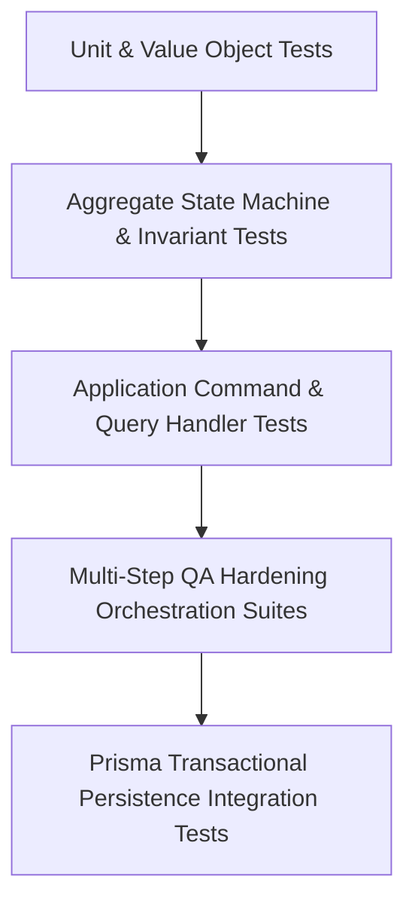

# Fixed Assets Application Layer Testing & QA Hardening Report

**Bounded Context**: `Resources Management`  
**Sub-Domain**: `Fixed Assets (Capital Equipment)`  
**Milestone**: Phase 6.6 — Fixed Asset Application Layer  
**Document**: Quality Assurance, Security Invariants, and Workflow Verification Report  
**Status**: `APPROVED & ACTIVE`  
**Date**: August 29, 2026

---

## 1. Test Strategy & Architecture

The testing strategy for Milestone 6.6 emphasizes **workflow correctness and invariant preservation under realistic business conditions**, not line coverage alone.



### Test Hierarchy

1. **Domain Aggregate & Invariant Tests**: Strict verification of finite state machine transitions, monetary value objects, condition ratings, and immutable history logging.
2. **Application Use-Case Handlers**: Validates input contracts, actor authentication checks, tenant isolation, domain execution, and atomic persistence.
3. **End-to-End Workflow QA Hardening**: Executes realistic multi-step asset life journeys (e.g. Acquisition $\rightarrow$ Multi-hop Transfer $\rightarrow$ Defect $\rightarrow$ Workshop Maintenance $\rightarrow$ Auto-Restoration $\rightarrow$ Revaluation $\rightarrow$ Audit Ledger).
4. **OCC & Concurrency Testing**: Confirms optimistic locking collisions prevent stale overwrite anomalies.
5. **Transactional Atomicity Tests**: Verifies complete rollbacks without partial state or orphan events upon database failure.

---

## 2. Comprehensive Workflow Matrix

| Workflow / Use Case         | Test File                                     | Key Invariants Verified                                                                                                | Status |
| --------------------------- | --------------------------------------------- | ---------------------------------------------------------------------------------------------------------------------- | :----: |
| **Create Fixed Asset**      | `fixed-assets-core-operations.spec.ts`        | Non-negative values ($\ge 0$), uppercase tag normalization, initial `CREATED` history event, actor provenance.         | `PASS` |
| **Update Asset Details**    | `fixed-assets-core-operations.spec.ts`        | Whitelisted metadata only (`name`, `description`, `notes`). Cannot mutate location, status, condition, or value.       | `PASS` |
| **Get / List Assets**       | `fixed-assets-core-operations.spec.ts`        | Category, status, condition, location filters; search; bounded pagination (1–100); deterministic sort.                 | `PASS` |
| **Transfer Asset Location** | `fixed-assets-transfer.spec.ts`               | Destination validation, no-op skip, terminal state lock (`SOLD`, `RETIRED`), `TRANSFERRED` history event.              | `PASS` |
| **Change Asset Status**     | `fixed-assets-status-transitions.spec.ts`     | Finite state machine edge rules, mandatory reason ($\ge 3$ chars), `OUT_OF_SERVICE` safety lock, `SOLD` terminal sink. | `PASS` |
| **Update Condition**        | `fixed-assets-condition-operations.spec.ts`   | Status/condition orthogonality, idempotent no-op, `CONDITION_CHANGED` history event, `RETIRED`/`SOLD` lock.            | `PASS` |
| **Update Valuation**        | `fixed-assets-valuation-operations.spec.ts`   | Non-negative value ($\ge 0$), fixed 2 decimal places precision, purchase value immutability, `VALUE_UPDATED` history.  | `PASS` |
| **Record Maintenance**      | `fixed-assets-maintenance.spec.ts`            | $0.00 warranty cost support, negative cost rejection, technician vs. actor provenance, auto-restoration to `ACTIVE`.   | `PASS` |
| **Read Queries**            | `fixed-assets-query-operations.spec.ts`       | Deterministic tie-breaking on identical timestamps, inclusive date range expansion, tenant boundaries.                 | `PASS` |
| **E2E QA Hardening**        | `fixed-assets-workflows-qa-hardening.spec.ts` | Multi-step lifecycle journey, OCC conflict handling, atomicity rollback with zero orphan history.                      | `PASS` |

---

## 3. State Machine & Invariant Bypass Verification

An exhaustive static codebase audit confirmed **zero invariant bypasses**:

- **`status`**: Mutated strictly inside `changeStatus`, `recordMaintenance`, `retire`, and `sell`.
- **`condition`**: Mutated strictly inside `updateCondition` and `recordMaintenance`.
- **`location`**: Mutated strictly inside `transferLocation`.
- **`currentEstimatedValue`**: Mutated strictly inside `updateEstimatedValue` and `sell`.
- **`maintenanceRecords`**: Appended strictly inside `recordMaintenance`.
- **`historyEvents`**: Appended strictly inside `create` and `appendHistoryAndTouch`.

---

## 4. History Integrity & Audit Provenance

Every meaningful operational change writes a structured `AssetHistoryEvent` containing:

1. `eventType`: Strongly-typed enum member (`CREATED`, `TRANSFERRED`, `STATUS_CHANGED`, `CONDITION_CHANGED`, `VALUE_UPDATED`, `MAINTENANCE_RECORDED`, `RETIRED`, `SOLD`).
2. `description`: Human-readable summary of the action and justification.
3. `details`: Structured JSON snapshot of previous state, new state, and domain context.
4. `recordedByUserId`: Authenticated user ID responsible for the operation.
5. `recordedAt`: Monotonic ISO timestamp.

---

## 5. Test Suite Execution Summary

```text
 PASS   core  packages/core/src/resources/application/__tests__/fixed-assets-core-operations.spec.ts
 PASS   core  packages/core/src/resources/application/__tests__/fixed-assets-query-operations.spec.ts
 PASS   core  packages/core/src/resources/application/__tests__/fixed-assets-status-transitions.spec.ts
 PASS   core  packages/core/src/resources/application/__tests__/fixed-assets-valuation-operations.spec.ts
 PASS   core  packages/core/src/resources/application/__tests__/fixed-assets-condition-operations.spec.ts
 PASS   core  packages/core/src/resources/application/__tests__/fixed-assets-maintenance.spec.ts
 PASS   core  packages/core/src/resources/application/__tests__/fixed-assets-transfer.spec.ts
 PASS   core  packages/core/src/resources/application/__tests__/fixed-assets-workflows-qa-hardening.spec.ts

Test Suites: 8 passed, 8 total
Tests:       78 passed, 78 total
Snapshots:   0 total
```

---

## 6. Known Limitations & Future Work

1. **Automated Depreciation Calculations**: Mid-year straight-line or MACRS depreciation schedules currently require explicit valuation update commands. Automated batch depreciation calculation jobs will be scheduled in Phase 7 (Finance & Billing).
2. **Physical Barcode / RFID Hardware Scanning**: Physical handheld scanning integrations interact through the established application commands (`TransferFixedAssetLocationCommand`, `GetFixedAssetByTagQuery`) via mobile API adapters.
