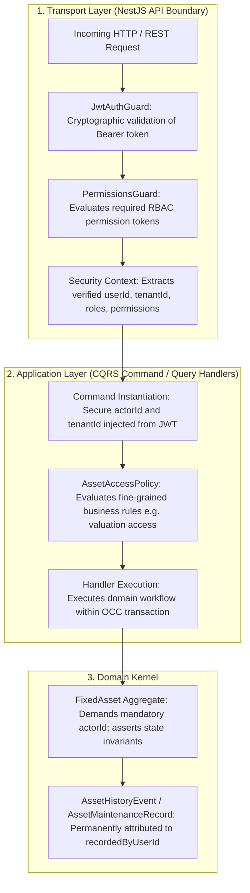

# Fixed Assets Authentication, Authorization & Security Architecture

**Bounded Context**: `Resources Management`  
**Sub-Domain**: `Fixed Assets (Capital Equipment)`  
**Milestone**: Phase 6.6 — Fixed Asset Application Layer  
**Document**: Authoritative Security, RBAC Permissions Matrix & Actor Provenance Specification  
**Status**: `APPROVED & ACTIVE`  
**Date**: August 29, 2026

---

## 1. Existing Authorization Architecture & Layering

The **Kinergy Platform** implements a multi-tiered **Defense-in-Depth** authorization model. Fixed asset operations participate directly in this model without introducing a secondary or parallel authorization system.



### 1.1 Defense-in-Depth Principles

1. **Pre-Execution Transport Guards**: API controllers/resolvers enforce coarse-grained RBAC permissions before invoking application handlers (`@RequirePermissions('assets.write')`).
2. **Application Policy Enforcement**: Handlers enforce multi-tenant isolation (`tenantId`) and fine-grained financial permissions (e.g. requiring `billing.read` or `finance.read` to query capital valuations).
3. **Domain Actor Provenance**: Aggregate methods require a non-empty `actorId` for all state mutations, ensuring 100% of historical lifecycle events are permanently attributed.
4. **Zero Body-Supplied Actor Trust**: Client request bodies cannot supply or override `actorId` or `tenantId`. These are strictly injected by transport controllers from verified JWT authentication claims.

---

## 2. Fixed Assets Permissions Matrix

| Asset Operation              | Use Case / Command                               | Required Permission(s)                                        | Default Allowed Roles                                  | Risk Level & Governance Rationale                                                           |
| ---------------------------- | ------------------------------------------------ | ------------------------------------------------------------- | ------------------------------------------------------ | ------------------------------------------------------------------------------------------- |
| **Register Asset**           | `CreateFixedAssetCommand`                        | `assets.write` or `assets.admin`                              | `Owner`, `Admin`, `FacilityManager`                    | **High**: Commissions new capital equipment and records purchase invoice value.             |
| **Update Details**           | `UpdateFixedAssetDetailsCommand`                 | `assets.write` or `assets.admin`                              | `Owner`, `Admin`, `FacilityManager`, `InventoryClerk`  | **Medium**: Updates descriptive metadata (`name`, `description`, `notes`).                  |
| **Transfer Location**        | `TransferFixedAssetLocationCommand`              | `assets.transfer` or `assets.write` or `assets.admin`         | `Owner`, `Admin`, `FacilityManager`, `OperationsLead`  | **High**: Alters physical placement across rooms and facilities.                            |
| **Change Status**            | `ChangeFixedAssetStatusCommand`                  | `assets.status` or `assets.write` or `assets.admin`           | `Owner`, `Admin`, `FacilityManager`, `MaintenanceLead` | **High**: Takes equipment offline (`UNDER_MAINTENANCE`, `DAMAGED`) or restores to `ACTIVE`. |
| **Update Condition**         | `UpdateFixedAssetConditionCommand`               | `assets.condition` or `assets.write` or `assets.admin`        | `Owner`, `Admin`, `FacilityInspector`, `Technician`    | **Medium**: Adjusts physical grading (`EXCELLENT` $\rightarrow$ `OUT_OF_SERVICE`).          |
| **Record Maintenance**       | `RecordAssetMaintenanceCommand`                  | `assets.maintenance` or `assets.write` or `assets.admin`      | `Owner`, `Admin`, `FacilityManager`, `Technician`      | **High**: Logs servicing costs and technician identity; may restore status to `ACTIVE`.     |
| **Update Valuation**         | `UpdateFixedAssetValuationCommand`               | `assets.revalue` or `assets.admin` (requires `finance.write`) | `Owner`, `Admin`, `FinanceManager`                     | **Critical**: Revalues capital asset book value for financial balance sheets.               |
| **Retire Asset**             | `RetireFixedAssetCommand`                        | `assets.admin`                                                | `Owner`, `Admin`                                       | **Critical**: Permanently decommissions asset; halts operational usage.                     |
| **Sell Asset**               | `SellFixedAssetCommand`                          | `assets.admin` or `finance.admin`                             | `Owner`, `Admin`, `ExecutiveDirector`                  | **Critical**: Irreversible terminal liquidation ([AST-INV-1]).                              |
| **View Asset / List**        | `GetFixedAssetByIdQuery`, `ListFixedAssetsQuery` | `assets.read`                                                 | `Owner`, `Admin`, `Staff`, `Clinician`, `Trainer`      | **Low**: Reads asset specifications, current location, and condition.                       |
| **View Asset History**       | `GetFixedAssetHistoryQuery`                      | `assets.read` or `assets.audit`                               | `Owner`, `Admin`, `FacilityManager`, `Auditor`         | **Medium**: Reads immutable chronological audit trail.                                      |
| **View Maintenance Log**     | `GetFixedAssetMaintenanceHistoryQuery`           | `assets.read`                                                 | `Owner`, `Admin`, `FacilityManager`, `Technician`      | **Medium**: Reads servicing history and repair invoices.                                    |
| **View Portfolio Valuation** | `GetFixedAssetsValuationQuery`                   | `assets.read` **AND** (`billing.read` or `finance.read`)      | `Owner`, `Admin`, `FinanceManager`                     | **Critical**: Aggregates total acquisition cost and current book value.                     |

---

## 3. Actor Identity & Provenance Strategy

### 3.1 Prevention of Actor Spoofing

- HTTP request DTOs submitted by web clients **never contain** `actorId` or `tenantId` fields.
- The NestJS controller extracts `req.user.userId` and `req.user.tenantId` from the verified `JwtAuthGuard` context and constructs the internal Command object:

```typescript
// Exemplary Controller Binding:
@Post(':id/transfer')
@RequirePermissions('assets.transfer')
async transferLocation(
  @Param('id') id: string,
  @Body() dto: TransferLocationDto,
  @CurrentUser() user: AuthUser,
) {
  const command = new TransferFixedAssetLocationCommand({
    id,
    tenantId: user.tenantId, // Trusted from JWT
    location: dto.location,
    reason: dto.reason,
    actorId: user.userId,   // Trusted from JWT
  });
  return this.transferHandler.execute(command);
}
```

### 3.2 System Actors & Background Jobs

When scheduled maintenance or depreciation calculation jobs execute autonomously:

- **System Actor Convention**: Background processes utilize reserved system identifiers (e.g. `system:depreciation_job`, `system:migration_runner`).
- **Audit Traceability**: The aggregate root accepts system actor strings, ensuring batch revaluations or automated transitions are attributed with full clarity.

---

## 4. History Actor Attribution Strategy

1. **Mandatory Actor Assertion**:
   - The aggregate root enforces `assertActor(actorId)`:
   ```typescript
   private assertActor(actorId: string): void {
     if (!actorId || actorId.trim().length === 0) {
       throw new InvalidAssetStateException('Authenticated actor ID is mandatory for asset mutations.');
     }
   }
   ```
2. **Immutable Persistence**:
   - Every `AssetHistoryEvent` captures `recordedByUserId = actorId`.
   - Every `AssetMaintenanceRecord` captures `recordedByUserId = actorId` and `performedBy = params.performedBy`.
   - Database tables `asset_history_events` and `asset_maintenance_records` enforce `NOT NULL` on `recorded_by_user_id`.

---

## 5. Generic Update Bypass Prevention

### 5.1 Security Problem

If a generic `UpdateAsset` endpoint allows mutating arbitrary JSON fields, an attacker or unauthorized user with only `assets.write` could:

1. Move an expensive MRI machine to an unmonitored location without triggering `assets.transfer` guards.
2. Reactivate a decommissioned (`RETIRED`) or permanently `SOLD` asset, bypassing `AssetLifecycleStateMachine`.
3. Alter `currentEstimatedValue` from `$50,000` to `$1.00`, bypassing `finance.write` revaluation controls.
4. Tamper with historical maintenance costs without logging a `MAINTENANCE_RECORDED` event.

### 5.2 Architectural Defense

`UpdateFixedAssetDetailsCommand` strictly whitelists only non-financial descriptive fields:

- `name`
- `description`
- `notes`

Any attempt to supply `status`, `condition`, `location`, `purchaseValue`, `currentEstimatedValue`, or `purchaseDate` to `UpdateFixedAssetDetailsHandler` is rejected at compile-time and runtime. Those mutations **must** execute via their respective dedicated use-case handlers.

---

## 6. Rejected Alternatives

1. **Generic `PATCH /assets/:id` with arbitrary field updates**:
   - _Rejected_: Violates the no-silent-corrections principle, bypasses state machine transitions, and circumvents specific RBAC permissions (`assets.transfer`, `assets.revalue`, `assets.status`).
2. **Client-Supplied `actorId` in Request Body**:
   - _Rejected_: Introduces critical impersonation vulnerabilities. Actor identity must originate strictly from verified session/JWT tokens.
3. **Coupling Domain Kernel to HTTP Request Context (`AsyncLocalStorage` / `@Inject(REQUEST)`)**:
   - _Rejected_: Violates Clean Architecture by leaking web server transport concepts into pure domain entities.
