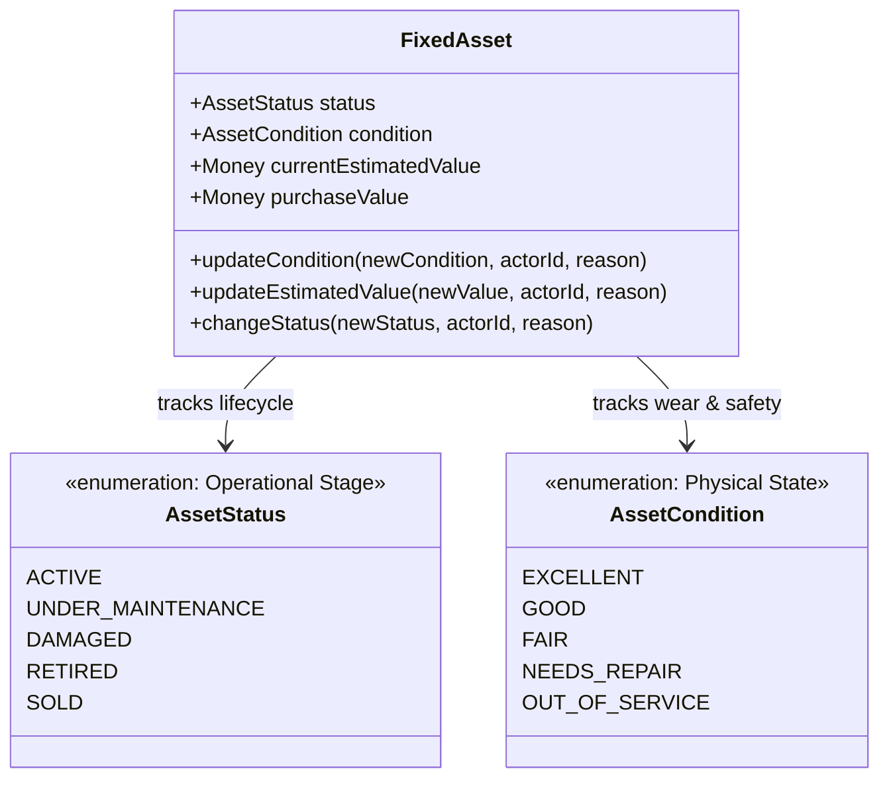

# Fixed Assets Condition Rating & Economic Valuation Operations

**Bounded Context**: `Resources Management`  
**Sub-Domain**: `Fixed Assets (Capital Equipment)`  
**Milestone**: Phase 6.6 — Fixed Asset Application Layer  
**Document**: Authoritative Specification for Physical Condition Changes and Asset Book Valuation  
**Status**: `APPROVED & ACTIVE`  
**Date**: August 29, 2026

---

## 1. Condition Rating vs. Operational Status Separation

In the **Kinergy Platform**, `AssetCondition` and `AssetStatus` represent separate domain concepts with strict orthogonal boundaries.



### 1.1 Conceptual Distinction

- **`AssetStatus` (Operational Lifecycle)**: Controls operational scheduling, room assignment, availability for kinesiology/gym sessions, and accounting decommissioning.
- **`AssetCondition` (Physical Rating)**: Quantifies mechanical wear, cosmetic degradation, safety compliance, and technician inspection grading.

### 1.2 Coupling & Invariant Precedence

1. **Zero Silent Status Mutations**: Updating `AssetCondition` (e.g. from `GOOD` to `NEEDS_REPAIR`) does **not** automatically mutate `AssetStatus` to `DAMAGED` or `UNDER_MAINTENANCE`. Operational status decisions remain explicit administrative/technician actions.
2. **Safety Invariant [AST-INV-4]**: A physical safety guard prevents restoring an asset's status to `ACTIVE` while its condition remains `OUT_OF_SERVICE`. The equipment must be repaired and its condition upgraded prior to operational reactivation.
3. **Servicing Restoration Exception**: When a maintenance servicing record is logged via `recordMaintenance()`, if the resulting condition is serviceable (`EXCELLENT`, `GOOD`, `FAIR`), the aggregate automatically restores `UNDER_MAINTENANCE` or `DAMAGED` equipment to `ACTIVE`.

---

## 2. Change Asset Condition Operation

Executed via `UpdateFixedAssetConditionHandler`:

```typescript
export interface UpdateFixedAssetConditionInput {
  id: string; // AssetId UUID
  tenantId?: string; // Tenant boundary isolation
  condition: AssetCondition; // EXCELLENT | GOOD | FAIR | NEEDS_REPAIR | OUT_OF_SERVICE
  reason?: string; // Optional inspection summary
  actorId: string; // Mandatory authenticated actor identifier
}
```

### 2.1 Lifecycle Invariants & Business Rules

- **Terminal State Lock [AST-INV-1]**: Cannot update condition on `SOLD` assets.
- **Decommissioned Freeze [AST-INV-1]**: Cannot update condition on `RETIRED` assets.
- **Idempotency**: If `newCondition === currentCondition`, the operation is an idempotent no-op (no version bump, zero spurious history records).
- **History Provenance**: Appends `AssetHistoryEventType.CONDITION_CHANGED` capturing `priorCondition`, `newCondition`, `reason`, and `recordedByUserId`.
- **Integration Event**: Emits `AssetConditionChangedDomainEvent`.

---

## 3. Update Asset Valuation Operation

Executed via `UpdateFixedAssetValuationHandler`:

```typescript
export interface UpdateFixedAssetValuationInput {
  id: string; // AssetId UUID
  tenantId?: string; // Tenant boundary isolation
  estimatedValue: {
    amount: number; // Mandatory non-negative finite number (>= 0.00)
    currency?: string; // Defaults to current asset currency (e.g. USD)
  };
  reason?: string; // Mandatory for accounting audits (e.g. annual straight-line depreciation)
  actorId: string; // Mandatory authenticated actor identifier (requires finance.write)
}
```

### 3.1 Financial Invariants & Arithmetic Precision

1. **Non-Negative Value Constraint**: `currentEstimatedValue >= 0.00`. An asset can be written down to `$0.00` (fully depreciated scrap), but negative valuations are strictly rejected.
2. **Deterministic Rounding & Currency Safety**: `Money` Value Object enforces rounding to exactly 2 decimal places (`Math.round(amount * 100) / 100`) and validates 3-letter ISO-4217 currency format. Floating-point errors are eliminated.
3. **Purchase Value Immutability**: Historical acquisition cost (`purchaseValue`) is permanently immutable and is **never** altered by `UpdateAssetValuation`.
4. **Terminal State Lock [AST-INV-1]**: Valuation cannot be adjusted on `SOLD` assets. (The realization sale price on liquidation is set strictly via `sell()`).
5. **Idempotency**: If `newEstimatedValue.equals(currentEstimatedValue)`, the operation completes without modifying version or writing redundant history records.
6. **History Provenance**: Appends `AssetHistoryEventType.VALUE_UPDATED` capturing `priorValue`, `newValue`, `reason`, and `recordedByUserId`.
7. **Integration Event**: Emits `AssetValuationUpdatedDomainEvent`.

---

## 4. Transactional Atomicity & History Guarantees

| Operation         | Persisted Entities (Inside Atomic Prisma `$transaction`)                          | Emitted Domain Event               | Rollback Guarantee                                                               |
| ----------------- | --------------------------------------------------------------------------------- | ---------------------------------- | -------------------------------------------------------------------------------- |
| `UpdateCondition` | `fixed_assets.condition` + `asset_history_events (CONDITION_CHANGED)`             | `AssetConditionChangedDomainEvent` | Entire transaction rolls back on DB failure; no partial state or orphan history. |
| `UpdateValuation` | `fixed_assets.current_estimated_value_*` + `asset_history_events (VALUE_UPDATED)` | `AssetValuationUpdatedDomainEvent` | Entire transaction rolls back on DB failure; no partial state or orphan history. |
