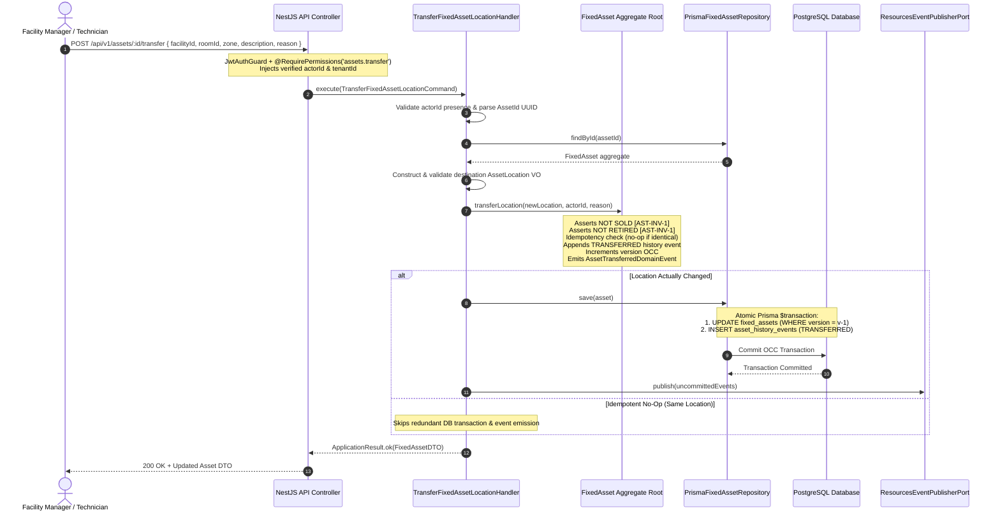

# Fixed Assets Location Transfer Specification & Transaction Architecture

**Bounded Context**: `Resources Management`  
**Sub-Domain**: `Fixed Assets (Capital Equipment)`  
**Milestone**: Phase 6.6 — Fixed Asset Application Layer  
**Document**: Authoritative Specification for Physical Asset Location Transfers  
**Status**: `APPROVED & ACTIVE`  
**Date**: August 29, 2026

---

## 1. Transfer Contract

Physical equipment movement is an explicit, authorized business mutation executed via `TransferFixedAssetLocationHandler`.



### 1.1 Command Input Contract

```typescript
export interface TransferFixedAssetLocationInput {
  id: string; // Mandatory UUID v4
  tenantId?: string; // Multi-tenant isolation boundary
  location: {
    facilityId: string; // Mandatory non-empty string
    roomId?: string; // Optional non-empty string
    zone?: string; // Optional non-empty string
    description?: string; // Optional, max 255 chars
  };
  reason?: string; // Optional business explanation
  actorId: string; // Mandatory authenticated actor identifier
}
```

---

## 2. Lifecycle Restrictions

Physical transfers are governed by domain state machine invariants:

| State               | Transfer Allowed? | Invariant Rule & Rationale                                                                                               |
| ------------------- | ----------------- | ------------------------------------------------------------------------------------------------------------------------ |
| `ACTIVE`            | **YES**           | Standard operational transfer between rooms, zones, or facilities.                                                       |
| `UNDER_MAINTENANCE` | **YES**           | Allowed (e.g. moving equipment to technician workshop or repair bay).                                                    |
| `DAMAGED`           | **YES**           | Allowed (e.g. moving damaged equipment to quarantine area or repair depot).                                              |
| `RETIRED`           | **PROHIBITED**    | Invariant [AST-INV-1]: Decommissioned assets are frozen and cannot be reassigned without administrative recommissioning. |
| `SOLD`              | **PROHIBITED**    | Invariant [AST-INV-1]: Liquidated salvage assets are in a terminal state and no longer exist in the company inventory.   |

---

## 3. Destination Validation & Idempotency

### 3.1 Validation Rules

- **`facilityId`**: Required, non-empty trimmed string (max 100 chars).
- **`roomId`**: If provided, cannot be empty or whitespace-only (max 100 chars).
- **`zone`**: If provided, cannot be empty or whitespace-only (max 100 chars).
- **`description`**: If provided, max 255 characters.

### 3.2 Idempotency Strategy (Same-Location Transfer)

If `asset.location.equals(targetLocation)` evaluates to `true`:

- The aggregate root returns immediately without mutating state.
- `asset.version` is **not** incremented.
- **Zero** spurious history records are created.
- Database writes and event publications are safely skipped.
- The handler returns `ApplicationResult.ok(currentAssetDTO)`.

---

## 4. Atomicity Guarantees

All database operations execute inside a single database transaction (`prisma.$transaction`):

1. **Aggregate Root Update**: Updates `location` JSON payload and bumps `version = v + 1` with OCC check (`WHERE id = :id AND version = :priorVersion`).
2. **History Event Insertion**: Appends the immutable `AssetHistoryEvent` with `eventType = 'TRANSFERRED'`.

### 4.1 Forbidden Inconsistencies Blocked

- ❌ **Location changed, but history missing**: Blocked by transactional atomicity.
- ❌ **History created, but location unchanged**: Blocked by transactional atomicity.
- ❌ **Concurrent conflicting transfer overwrite**: Blocked by optimistic concurrency control (`OptimisticLockException`).

---

## 5. History Semantics & Audit Payload

The `AssetHistoryEvent` generated on transfer contains complete provenance:

- **`eventType`**: `AssetHistoryEventType.TRANSFERRED`
- **`recordedByUserId`**: Verified JWT `actorId`
- **`recordedAt`**: High-precision UTC timestamp
- **`description`**: Human-readable summary (e.g. `Location transferred from [Facility: fac_north | Room: room_1] to [Facility: fac_south | Room: room_main]: Department expansion`)
- **`details`**: Structured JSON payload:
  ```json
  {
    "priorLocation": {
      "facilityId": "fac_clinic_north",
      "roomId": "room_assessment_1",
      "zone": "Clinical Suite A",
      "description": "North Wing 2nd Floor"
    },
    "newLocation": {
      "facilityId": "fac_clinic_south",
      "roomId": "room_rehab_main",
      "zone": "Treatment Floor",
      "description": "South Campus Pavilion"
    },
    "reason": "Department expansion and facility realignment"
  }
  ```

---

## 6. Failure & Rollback Behavior

| Failure Scenario               | Outcome                                                                             | System State                          |
| ------------------------------ | ----------------------------------------------------------------------------------- | ------------------------------------- |
| Missing Asset                  | Fails with `Fixed asset with ID '<id>' was not found.`                              | No changes made.                      |
| Tenant Boundary Mismatch       | Fails with not-found error (prevents tenant leakage).                               | No changes made.                      |
| Missing Actor ID               | Fails with `Authenticated actor ID is required...`                                  | No changes made.                      |
| Invalid Destination            | Fails with validation exception (e.g. `Facility ID is mandatory`).                  | No changes made.                      |
| Terminal State Violation       | Fails with `Cannot transfer fixed asset '<tag>' in terminal state 'SOLD'.`          | No changes made.                      |
| Decommissioned State Violation | Fails with `Cannot transfer decommissioned fixed asset '<tag>' in state 'RETIRED'.` | No changes made.                      |
| DB Connection Timeout          | Transaction rolls back completely; returns failure result.                          | In-memory & DB remain at version $v$. |
