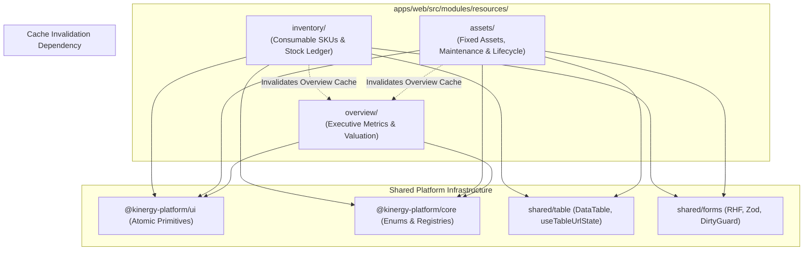
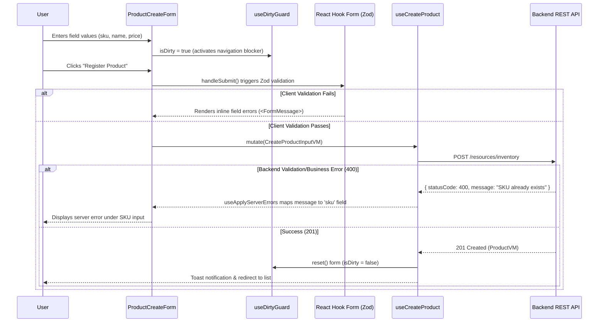
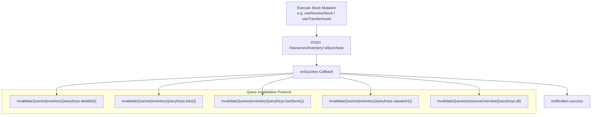
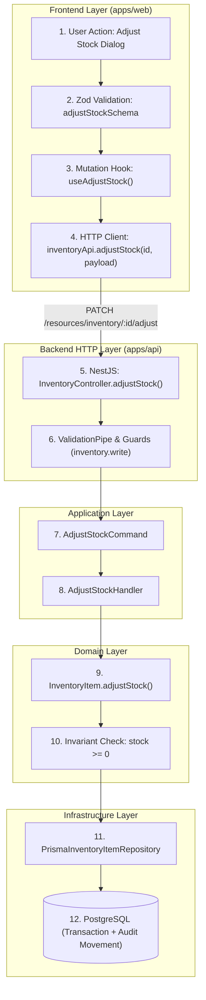

# Phase 6: Resources Management — Frontend Architecture Specification

## 1. Executive Overview & System Topology

The **Phase 6 Resources Management** frontend is engineered as a **Composite Domain Module** within the Kinergy Platform's React 18 single-page application (`apps/web`). It provides operational and financial visibility into consumable inventory items and physical fixed capital assets.

The architecture strictly complies with Kinergy's enterprise frontend principles:

- **Clean Architecture & Hexagonal Frontend**: Segregation of ViewModels, API clients, presentation components, state machines, and routing shells.
- **Strict Module Encapsulation**: Sub-domains (`inventory`, `assets`, `overview`) live in isolated directories with explicit public API boundaries (`index.ts` barrels).
- **Five-Pillar State Separation**: Discrete boundaries between Server State, URL State, Ephemeral UI State, Form State, and Validation.
- **Design System Fidelity**: Full leverage of `@kinergy-platform/ui` atomic primitives and `@kinergy-platform/core` shared domain contracts.
- **Zero Business Logic in Shared UI**: Strict isolation preventing domain leaks into generic UI components.

```
apps/web/src/
├── app/
│   ├── routes/
│   │   ├── app-router.tsx             # Central route shell & module sub-router mounting
│   │   └── permission-guard.tsx       # <RequirePermission> route gate
│   └── navigation/
│       └── navigation.config.ts       # Main sidebar navigation items
├── modules/
│   └── resources/                     # Bounded Context Composite Module Root
│       ├── inventory/                 # Sub-domain: Consumable Inventory & Stock Ledger
│       ├── assets/                    # Sub-domain: Fixed Capital Assets & Lifecycle
│       ├── overview/                  # Sub-domain: Executive Governance & Valuation
│       └── index.ts                   # Root barrel export for Resources
└── shared/
    ├── crud/                          # CrudListLayout, CrudListHeader layouts
    ├── forms/                         # Form, FormField, useDirtyGuard, validation summary
    ├── query/                         # QueryClient configuration, error envelopes
    └── table/                         # DataTable, DataTableColumnHeader, useTableUrlState
```

---

## 2. Module Boundaries & Feature Ownership

The `resources` module is partitioned into three distinct sub-features, mirroring backend bounded context boundaries:



### 2.1. Consumable Inventory Sub-Module (`resources/inventory/`)

- **Domain Purpose**: Manages fungible consumable items, catalog registration, unit costs, selling prices, stock levels, reorder thresholds, and the auditable double-entry movement ledger.
- **Directory Layout**:
  - `api/`: `inventory-api.ts` (REST client calls) and `inventory-query-keys.ts` (TanStack Query key factory).
  - `components/`: List tables, filter bars, action dialogs (`receive`, `sell`, `consume`, `scrap`, `adjust`, `archive`), badges (`InventoryStatusBadge`), and gauges (`StockLevelGauge`).
  - `hooks/`: Query hooks (`useInventoryList`, `useInventoryProduct`), mutation hooks (`useCreateProduct`, `useReceiveStock`, `useAdjustStock`), and URL state hooks (`useInventoryFilters`, `useMovementFilters`).
  - `routes/`: Page views (`InventoryOverviewPage`, `InventoryListPage`, `InventoryCreatePage`, `InventoryDetailPage`, `InventoryEditPage`, `InventoryMovementsPage`, `LowStockPage`).
  - `schemas/`: Zod validation schemas (`createProductSchema`, `editProductFormSchema`, `receiveStockSchema`, `adjustStockSchema`).
  - `types/`: Frontend ViewModels (`InventoryProductVM`, `StockMovementVM`), input types, and filter params.
  - `index.ts`: Strict public barrel exporting only approved external surfaces.

### 2.2. Fixed Assets Sub-Module (`resources/assets/`)

- **Domain Purpose**: Manages physical non-fungible capital equipment, serial numbers, asset tags, location tracking, maintenance work orders, condition ratings, and 5x5 lifecycle status transitions.
- **Directory Layout**:
  - `api/`: `assets-api.ts` and `assets-query-keys.ts`.
  - `components/`: `AssetListTable`, `AssetFilterBar`, action dialogs (`asset-status-dialog`, `asset-condition-dialog`, `asset-transfer-dialog`, `asset-maintenance-dialog`), and badges (`AssetStatusBadge`, `AssetConditionBadge`).
  - `hooks/`: `useAssetsList`, `useAssetDetail`, `useAssetsMutations`, `useAssetsFilters`, `useAssetHistoryFilters`.
  - `routes/`: `AssetOverviewPage`, `AssetsListPage`, `AssetCreatePage`, `AssetDetailPage`, `AssetEditPage`, `AssetHistoryPage`, `AssetMaintenancePage`.
  - `schemas/`: Zod schemas (`createAssetSchema`, `updateAssetSchema`, `transferAssetSchema`, `recordMaintenanceSchema`).
  - `types/`: ViewModels (`FixedAssetVM`, `AssetHistoryRecordVM`, `MaintenanceRecordVM`).
  - `index.ts`: Public barrel export.

### 2.3. Resource Overview Sub-Module (`resources/overview/`)

- **Domain Purpose**: Synthesizes cross-subdomain executive data. Aggregates total working capital inventory valuation, capital asset valuation, low-stock attention counts, active maintenance counts, and operational health.
- **Directory Layout**:
  - `api/`: `resource-overview-api.ts` and `resource-overview-query-keys.ts`.
  - `components/`: `OverallResourceValueCard`, `ConsumableInventorySection`, `FixedAssetsSection`, `ResourceMetricCard`.
  - `hooks/`: `useResourceOverview`.
  - `routes/`: `ResourceOverviewPage`.
  - `types/`: `ResourceOverviewVM` and filter params.
  - `index.ts`: Public barrel export.

### 2.4. Cross-Sub-Feature Boundaries & Anti-Patterns

- **Encapsulation Rule**: `inventory/` code cannot import internal components from `assets/` (e.g. `import { AssetStatusBadge } from '../assets/components/asset-status-badge'` is prohibited). Cross-feature consumption must pass through public barrels (`../assets`).
- **Zero Circular Dependencies**: Sub-features do not directly depend on each other's state or components. When the overview dashboard displays inventory or asset data, it queries the backend executive endpoint (`/resources/overview`) or consumes read-only ViewModels via public exports.

---

## 3. Routes & Navigation Hierarchy

The resources routing tree is mounted under `/resources/*` via the `ResourcesSubRouter` in [apps/web/src/app/routes/app-router.tsx](file:///c:/Projects/kinergy-platform/apps/web/src/app/routes/app-router.tsx#L195-L333). Each route is guarded by declarative RBAC permissions via `<RequirePermission>`.

| Route Path                           | Page Component           | Permission Gate                     | Purpose                                              |
| :----------------------------------- | :----------------------- | :---------------------------------- | :--------------------------------------------------- |
| `/resources`                         | `ResourceOverviewPage`   | `['inventory.read', 'assets.read']` | Default executive overview dashboard                 |
| `/resources/overview`                | `ResourceOverviewPage`   | `['inventory.read', 'assets.read']` | Explicit executive overview dashboard route          |
| `/resources/inventory/overview`      | `InventoryOverviewPage`  | `inventory.read`                    | Consumable inventory domain dashboard                |
| `/resources/inventory`               | `InventoryListPage`      | `inventory.read`                    | Paginated, filterable consumable catalog             |
| `/resources/inventory/new`           | `InventoryCreatePage`    | `inventory.write`                   | Product registration form                            |
| `/resources/inventory/low-stock`     | `LowStockPage`           | `inventory.read`                    | Operational low-stock triage queue                   |
| `/resources/inventory/:id`           | `InventoryDetailPage`    | `inventory.read`                    | Product details, stock actions, movements preview    |
| `/resources/inventory/:id/edit`      | `InventoryEditPage`      | `inventory.write`                   | Product metadata & pricing edit form                 |
| `/resources/inventory/:id/movements` | `InventoryMovementsPage` | `inventory.read`                    | Full auditable movement history ledger               |
| `/resources/assets/overview`         | `AssetOverviewPage`      | `assets.read`                       | Fixed assets estate summary & metrics                |
| `/resources/assets`                  | `AssetsListPage`         | `assets.read`                       | Paginated, filterable capital assets catalog         |
| `/resources/assets/new`              | `AssetCreatePage`        | `assets.write`                      | Asset commissioning form                             |
| `/resources/assets/:id`              | `AssetDetailPage`        | `assets.read`                       | Asset details, lifecycle actions, location transfers |
| `/resources/assets/:id/edit`         | `AssetEditPage`          | `assets.write`                      | Asset metadata & estimated value edit form           |
| `/resources/assets/:id/history`      | `AssetHistoryPage`       | `assets.read`                       | Chronological lifecycle event audit ledger           |
| `/resources/assets/:id/maintenance`  | `AssetMaintenancePage`   | `assets.read`                       | Service work orders and maintenance logs             |

---

## 4. The Five-Pillar State Architecture

The frontend architecture strictly enforces single-responsibility state management across 5 distinct mechanisms:

```
┌────────────────────────────────────────────────────────────────────────┐
│                   FIVE-PILLAR STATE ARCHITECTURE                       │
├──────────────────────┬─────────────────────────────────────────────────┤
│ State Type           │ Mechanism & Implementation                      │
├──────────────────────┼─────────────────────────────────────────────────┤
│ 1. Server State      │ TanStack Query v5 (Query Key Factories & Hooks) │
│ 2. URL State         │ React Router searchParams + useTableUrlState   │
│ 3. Ephemeral UI State│ React useState (Modals, Dialogs, Dropdowns)     │
│ 4. Form State        │ React Hook Form (Uncontrolled inputs, isDirty)  │
│ 5. Validation State  │ Zod Schemas via @hookform/resolvers/zod         │
└──────────────────────┴─────────────────────────────────────────────────┘
```

### 4.1. Server State $\longrightarrow$ TanStack Query v5

Server state is owned exclusively by TanStack Query. Components never mirror server state in `useState` or `useEffect`.

- **Hierarchical Query Key Factories**:
  ```typescript
  // inventoryQueryKeys
  inventoryQueryKeys = {
    all: ['resources', 'inventory'] as const,
    categories: () => [...inventoryQueryKeys.all, 'categories'] as const,
    lowStock: () => [...inventoryQueryKeys.all, 'low-stock'] as const,
    valuation: () => ['resources', 'valuation', 'inventory'] as const,
    lists: () => [...inventoryQueryKeys.all, 'list'] as const,
    list: (params?: ListInventoryFilterParams) =>
      [...inventoryQueryKeys.lists(), params ?? {}] as const,
    details: () => [...inventoryQueryKeys.all, 'detail'] as const,
    detail: (id: string) => [...inventoryQueryKeys.details(), id] as const,
    stock: (id: string) => [...inventoryQueryKeys.detail(id), 'stock'] as const,
    movements: (id: string, params?: ListStockMovementsFilterParams) =>
      [...inventoryQueryKeys.detail(id), 'movements', params ?? {}] as const,
  };
  ```
- **Query Caching Rules**:
  - `staleTime`: Default 30–60 seconds for list views; 0 seconds for mutation-critical stock checks.
  - Queries are strongly typed to return camelCase ViewModels (`InventoryProductVM`, `FixedAssetVM`).
  - Read-only data transformations (e.g., computing `isLowStock`, total valuation) are colocated in `useMemo` or API mappers, never in shared UI.

### 4.2. URL State $\longrightarrow$ Filter, Search, Pagination & Sorting

Table controls and faceted search are serialized directly to the browser URL using the platform's `useTableUrlState` hook:

```typescript
export function useInventoryFilters() {
  const { state, actions } = useTableUrlState<InventoryFiltersState>({
    paramNames: { q: 'search', page: 'page', limit: 'limit', sort: 'sort' },
    defaultLimit: 10,
    allowedLimits: [5, 10, 20, 50],
    filterParsers: {
      category: (val) => (val as InventoryCategory) || undefined,
      status: (val) => (val as InventoryItemStatus) || undefined,
      stockStatus: (val) => (val as 'ALL' | 'IN_STOCK' | 'LOW_STOCK' | 'OUT_OF_STOCK') || undefined,
      includeArchived: (val) => (val === 'true' ? true : undefined),
    },
    filterSerializers: {
      category: (val) => val ?? undefined,
      status: (val) => val ?? undefined,
      stockStatus: (val) => val ?? undefined,
      includeArchived: (val) => (val ? 'true' : undefined),
    },
  });
  // ... returns memoized params and setter actions
}
```

- **Deep Linking Actions**: Detail views leverage URL search parameters (e.g., `/resources/inventory/:id?action=receive` or `?action=sell`) to automatically open contextual action modals. When closed, the query parameter is removed via `{ replace: true }`, preserving clean browser navigation history.

### 4.3. Ephemeral UI State $\longrightarrow$ React Local State (`useState`)

UI transient state that has no value across page reloads is held in local component state:

- Modal/dialog open status: `const [receiveDialogOpen, setReceiveDialogOpen] = useState(false);`
- Active drawer or preview selection: `const [productToArchive, setProductToArchive] = useState<InventoryProductVM | null>(null);`
- Tab selection within a view (when not requiring deep-linkable URLs).

### 4.4. Form State $\longrightarrow$ React Hook Form

Forms avoid re-rendering entire component trees by utilizing uncontrolled inputs managed by React Hook Form:

- Tracks `isDirty`, `isValid`, `isSubmitting`, and field errors.
- Unsaved changes protection via `useDirtyGuard(form.formState.isDirty)` and `<ConfirmDiscardDialog />`.

### 4.5. Validation $\longrightarrow$ Zod

Input validation is defined authoritatively using Zod schemas matching backend DTO constraints:

- Schemas are defined in `schemas/` and integrated via `zodResolver(schema)`.
- Reusable enum validations derive directly from `@kinergy-platform/core`:
  ```typescript
  export const createProductSchema = z.object({
    sku: z
      .string()
      .trim()
      .min(3)
      .max(50)
      .regex(/^[A-Z0-9_-]+$/i),
    name: z.string().trim().min(3).max(120),
    category: z.nativeEnum(InventoryCategory),
    unitCost: z.number().min(0),
    sellingPrice: z.number().min(0),
    quantityOnHand: z.number().int().min(0).default(0),
    reorderThreshold: z.number().int().min(0).default(5),
    unitOfMeasure: z.nativeEnum(UnitOfMeasure).default(UnitOfMeasure.UNITS),
  });
  ```

---

## 5. Form Architecture, Dirty Guards & Error Binding

Phase 6 forms follow a standardized, accessible pattern integrating layout, validation, dirty-state protection, and API error binding:



### Standard Form Implementation Template

```tsx
export const ProductCreateForm: React.FC<ProductCreateFormProps> = ({
  onSubmit,
  onCancel,
  isSubmitting = false,
  serverError,
}) => {
  const form = useForm<CreateProductFormData>({
    resolver: zodResolver(createProductSchema),
    defaultValues: { sku: '', name: '', unitCost: 0, sellingPrice: 0, quantityOnHand: 0 },
    mode: 'onTouched',
  });

  // 1. Navigation Guard for unsaved changes
  const { isBlocked, confirmDiscard, cancelDiscard } = useDirtyGuard(form.formState.isDirty);

  // 2. Map server errors to specific fields
  useApplyServerErrors(form.setError, serverError);

  return (
    <>
      <Form {...form}>
        <form onSubmit={form.handleSubmit(onSubmit)} className="space-y-6">
          <FormValidationSummary errors={form.formState.errors} />

          <FormLayout>
            <FormSection title="Catalog Identification" description="SKU and product naming">
              <FormField
                control={form.control}
                name="sku"
                render={({ field }) => (
                  <FormItem>
                    <FormLabel>Stock Keeping Unit (SKU)</FormLabel>
                    <FormControl>
                      <Input placeholder="e.g. SUP-PROT-WHEY" {...field} />
                    </FormControl>
                    <FormDescription>Unique identifier across the catalog.</FormDescription>
                    <FormMessage />
                  </FormItem>
                )}
              />
            </FormSection>
          </FormLayout>

          <FormActions>
            <FormCancelButton onClick={onCancel} disabled={isSubmitting} />
            <FormSubmitButton loading={isSubmitting}>Register Product</FormSubmitButton>
          </FormActions>
        </form>
      </Form>

      <ConfirmDiscardDialog open={isBlocked} onConfirm={confirmDiscard} onCancel={cancelDiscard} />
    </>
  );
};
```

---

## 6. Permission Model & Progressive Disclosure (RBAC)

The frontend enforces authorization at both the **route boundary** and the **component interaction boundary** using `useAuth()`:

### 6.1. Route Guards

Defined in `apps/web/src/app/routes/app-router.tsx` using `<RequirePermission>`:

- Read access requires `inventory.read` or `assets.read`.
- Executive overview requires composition: `<RequirePermission permissions={['inventory.read', 'assets.read']}>`.
- Write/creation routes require `inventory.write` or `assets.write`.

### 6.2. Progressive UI Disclosure

Components selectively reveal or disable actions based on the active user's permissions:

```tsx
const { hasPermission, hasRole } = useAuth();

// Permission evaluation
const canWriteInventory =
  hasPermission('inventory.write') ||
  hasRole('ADMIN') ||
  hasRole('SUPER_ADMIN') ||
  hasRole('OWNER') ||
  hasRole('KITCHEN_STAFF');

const canViewValuation =
  hasPermission('valuation.read') ||
  hasPermission('billing.read') ||
  hasRole('ADMIN') ||
  hasRole('OWNER');

// Progressive rendering:
return (
  <div>
    {canWriteInventory && (
      <Button onClick={() => setReceiveDialogOpen(true)}>
        <PackagePlus className="mr-2 h-4 w-4" /> Receive Stock
      </Button>
    )}

    {/* Financial Shielding: Hide cost from general staff */}
    {canViewValuation ? (
      <div>Unit Cost: ${product.unitCost.toFixed(2)}</div>
    ) : (
      <div className="text-muted-foreground italic">Restricted financial data</div>
    )}
  </div>
);
```

---

## 7. Mutation Handling & Cross-Module Cache Invalidation

Mutations follow a deterministic lifecycle that updates local notifications and coordinates cross-module cache invalidations:



### Invalidation Hierarchy Example

When an inventory mutation executes (e.g. `useReceiveStock`):

1. **Target Item Detail**: `inventoryQueryKeys.detail(id)` is invalidated so the current page refreshes stock levels.
2. **Item Stock Sub-key**: `inventoryQueryKeys.stock(id)`.
3. **Inventory Catalog Lists**: `inventoryQueryKeys.lists()` is invalidated so table pagination and search reflect new stock.
4. **Low Stock Alerts**: `inventoryQueryKeys.lowStock()` is invalidated to recalculate threshold alerts.
5. **Inventory Valuation**: `inventoryQueryKeys.valuation()` is invalidated to re-sum total inventory value.
6. **Executive Overview Dashboard**: `resourceOverviewQueryKeys.all` is invalidated so the high-level dashboard (`/resources/overview`) updates its working capital card immediately.

---

## 8. The 4-State UI Contract

Every data-driven view, table, and dashboard component strictly implements the **4-State UI Contract**:

| UI State         | Trigger Condition                    | Visual Presentation                                                                     | Interaction                                                                                           |
| :--------------- | :----------------------------------- | :-------------------------------------------------------------------------------------- | :---------------------------------------------------------------------------------------------------- |
| **1. Loading**   | `isLoading === true` (initial fetch) | Skeleton placeholders (`<Skeleton className="h-48 w-full" />` or table skeleton rows)   | Interactive controls disabled; prevents layout shift                                                  |
| **2. Empty**     | `data.length === 0`                  | `<EmptyState>` with descriptive icon, title, message, and contextual primary action     | If user has write permission, renders "Register First Item" CTA; if filtered, renders "Reset Filters" |
| **3. Error**     | `isError === true`                   | `<Alert variant="destructive">` displaying error message, accompanied by a retry button | Clicking "Retry" triggers `refetch()`; prevents white-screen crashes                                  |
| **4. Populated** | `data.length > 0`                    | High-fidelity interactive UI: Sortable `DataTable`, responsive cards, action menus      | Full sorting, pagination, row actions, status badges, and deep-link dialogs                           |

### Table Implementation Reference (`InventoryListTable`)

```tsx
<DataTable
  columns={columns}
  data={products}
  totalCount={totalCount}
  page={page}
  pageSize={pageSize}
  onPageChange={setPage}
  onPageSizeChange={setLimit}
  sorting={sorting}
  onSortingChange={handleSortingChange}
  isLoading={isLoading}
  isFetching={isFetching}
  isError={isError}
  errorMessage={error?.message}
  onRetry={() => refetch()}
  isFiltered={isFiltered}
  onResetFilters={resetFilters}
  emptyTitle={isFiltered ? 'No products match your search.' : 'No products exist'}
  emptyDescription={isFiltered ? 'Try clearing filters.' : 'Register your first product.'}
  emptyAction={
    !isFiltered && canWrite ? (
      <Button onClick={onCreateClick}>Register First Product</Button>
    ) : undefined
  }
/>
```

---

## 9. Reusable Primitives & Shared Code Boundaries

The frontend code follows a three-tier reusability hierarchy:

```
┌────────────────────────────────────────────────────────────────────────┐
│                      REUSABILITY HIERARCHY                             │
├──────────────────────┬─────────────────────────────────────────────────┤
│ Tier 1: UI Primitives│ @kinergy-platform/ui                            │
│                      │ Button, Input, Select, Card, Badge, Dialog      │
├──────────────────────┼─────────────────────────────────────────────────┤
│ Tier 2: Shared Libs  │ apps/web/src/shared/                            │
│                      │ DataTable, FormField, useTableUrlState          │
├──────────────────────┼─────────────────────────────────────────────────┤
│ Tier 3: Feature Libs │ apps/web/src/modules/resources/                 │
│                      │ StockLevelGauge, InventoryStatusBadge           │
└──────────────────────┴─────────────────────────────────────────────────┘
```

1. **`@kinergy-platform/ui` (Design System Primitives)**:
   - Zero business knowledge. Generic, accessible, token-driven Radix/Tailwind components.
   - Examples: `Button`, `Input`, `Card`, `Badge`, `Dialog`, `Skeleton`, `Alert`.
2. **`apps/web/src/shared/` (Cross-Module Infrastructure)**:
   - Generic business patterns (tables, form layouts, URL state synchronization, auth providers).
   - Must remain agnostic to domain entities. Operates on generic types (`<TData>`, `<TFilters>`).
3. **`apps/web/src/modules/resources/<sub-module>/components/` (Feature Components)**:
   - Fully domain-aware. Knows about `InventoryProductVM`, `FixedAssetVM`, movement types, and state machines.
   - Examples: `StockLevelGauge`, `InventoryStatusBadge`, `AssetConditionBadge`, `AdjustStockDialog`.

---

## 10. Architectural Boundary Rule: Why Business Logic Must Never Leak Into Shared UI

> [!CAUTION]
> **STRICT ARCHITECTURAL PROHIBITION**: Business logic, domain rules, state machine transitions, and entity-specific formatting MUST NEVER be placed in `@kinergy-platform/ui` or `src/shared/`.

### The Five Architectural Reasons:

1. **Domain Boundary Leakage & Coupling**:
   - If a generic `<Badge />` or `<DataTable />` contains code like `if (item.currentStock <= item.reorderThreshold) return 'destructive'`, the generic UI package now depends on the Inventory domain model.
   - Modifying inventory business rules risks breaking the Gym, Kinesiology, or Client modules.

2. **Circular Dependency Hazards**:
   - Shared packages sit at the bottom of the dependency graph (`packages/ui` $\leftarrow$ `apps/web/src/shared` $\leftarrow$ `apps/web/src/modules`).
   - If a shared component imports from `modules/resources/types`, a circular dependency is created, breaking Vite build chunking and test isolation.

3. **Destruction of Reusability**:
   - A table component coupled to `InventoryProductVM` cannot be reused for gym attendance, client timelines, or billing invoices.
   - Generic components must receive presentation props (`status: 'success' | 'warning' | 'destructive'`) or render callbacks (`renderCell: (item) => ...`), leaving the domain evaluation to the feature module.

4. **Tree-Shaking & Bundle Bloat**:
   - Placing domain logic in shared libraries causes consumers to pull in unnecessary dependencies, increasing bundle sizes across all entry points.

5. **Single Source of Truth Violation**:
   - The authoritative source for domain invariants is the Domain/Application layer on the backend and the feature module's schemas/ViewModels on the frontend. Duplicating rules into shared UI creates synchronization drift.

---

## 11. End-to-End Lineage: Feature to Backend Use Case

Every frontend interaction traces through an explicit, unbroken architecture pipeline:

$$\text{User Interaction} \longrightarrow \text{Zod Validation} \longrightarrow \text{TanStack Mutation} \longrightarrow \text{API Client} \longrightarrow \text{NestJS Controller} \longrightarrow \text{Application Handler} \longrightarrow \text{Domain Aggregate} \longrightarrow \text{Database}$$



### Trace Example: Adjust Stock

1. **User Action**: Warehouse manager opens `AdjustStockDialog`, enters new quantity `25` and reason `"Physical count discrepancy"`.
2. **Frontend Validation**: `adjustStockSchema` ensures `quantityOnHand >= 0` and reason is provided.
3. **Frontend Mutation**: `useAdjustStock()` invokes `inventoryApi.adjustStock(id, payload)`.
4. **Backend Route**: `PATCH /resources/inventory/:id/adjust` received by `InventoryController`.
5. **Authorization & DTO**: `JwtAuthGuard` + `AuthorizationGuard` checks `inventory.write`; `AdjustStockDto` validated.
6. **Command Handler**: `AdjustStockHandler` executes within a Prisma transaction.
7. **Domain Aggregate**: `InventoryItem.adjustStock(newQuantity, reason, actorId)` verifies item is active, calculates delta, mutates `currentStock`, and appends an `ADJUSTMENT_IN` or `ADJUSTMENT_OUT` `InventoryMovement`.
8. **Persistence**: Atomic database commit with incremented `version` (OCC).
9. **Frontend Invalidation**: Query keys `detail(id)`, `lists()`, `lowStock()`, `valuation()`, and `resourceOverview` are invalidated. The UI automatically displays the new stock level and appends the adjustment to the movements ledger.

---

## 12. Screen Addition Playbook: Step-by-Step Guide for Senior Engineers

To add a new Phase 6 view (e.g., an "Asset Warranty Tracking" screen) without violating existing architecture, follow this exact 8-step playbook:

### Step 1: Define ViewModels & Input Types

Create or extend interfaces in `src/modules/resources/<sub-module>/types/`:

```typescript
export interface AssetWarrantyVM {
  readonly assetId: string;
  readonly assetTag: string;
  readonly provider: string;
  readonly expiresAt: string;
  readonly isExpired: boolean;
}
```

### Step 2: Define Zod Validation Schema

In `src/modules/resources/<sub-module>/schemas/`:

```typescript
export const assetWarrantySchema = z.object({
  provider: z.string().trim().min(2, 'Provider is required'),
  expiresAt: z.string().min(1, 'Expiration date is required'),
});
export type AssetWarrantyFormData = z.infer<typeof assetWarrantySchema>;
```

### Step 3: Extend Query Key Factory & API Client

In `api/`:

- Add key factory method: `warranty: (id: string) => [...assetsQueryKeys.detail(id), 'warranty'] as const`
- Add API method in `assets-api.ts`: `getWarranty: (id: string) => http.get(...)`

### Step 4: Create Query / Mutation Hooks

In `hooks/`:

- Use `useQuery` for fetching.
- Use `useMutation` for writes, ensuring `onSuccess` invalidates `assetsQueryKeys.detail(id)` and `resourceOverviewQueryKeys.all`.

### Step 5: Implement Presentation Components

In `components/`:

- Build UI using `@kinergy-platform/ui` primitives (`Card`, `Badge`, `Button`).
- Implement the **4-State UI Contract** (Loading, Empty, Error, Populated).
- Do NOT place domain logic in shared directories.

### Step 6: Create the Route Page Component

In `routes/`:

- Create `AssetWarrantyPage.tsx`.
- Connect URL state via `useTableUrlState` if the screen includes a list/table.
- Connect server queries and pass data/callbacks to presentation components.

### Step 7: Mount Route in `ResourcesSubRouter`

In `apps/web/src/app/routes/app-router.tsx`:

```tsx
<Route
  path="assets/:id/warranty"
  element={
    <RequirePermission permission="assets.read">
      <AssetWarrantyPage />
    </RequirePermission>
  }
/>
```

### Step 8: Verification & Automated Testing

- Add unit tests in `src/modules/resources/__tests__/`.
- Verify the 4-state contract, form validation, permission gating, and cache invalidation.
- Run `pnpm validate` to ensure 100% compliance across formatting, linting, typechecking, and tests.
