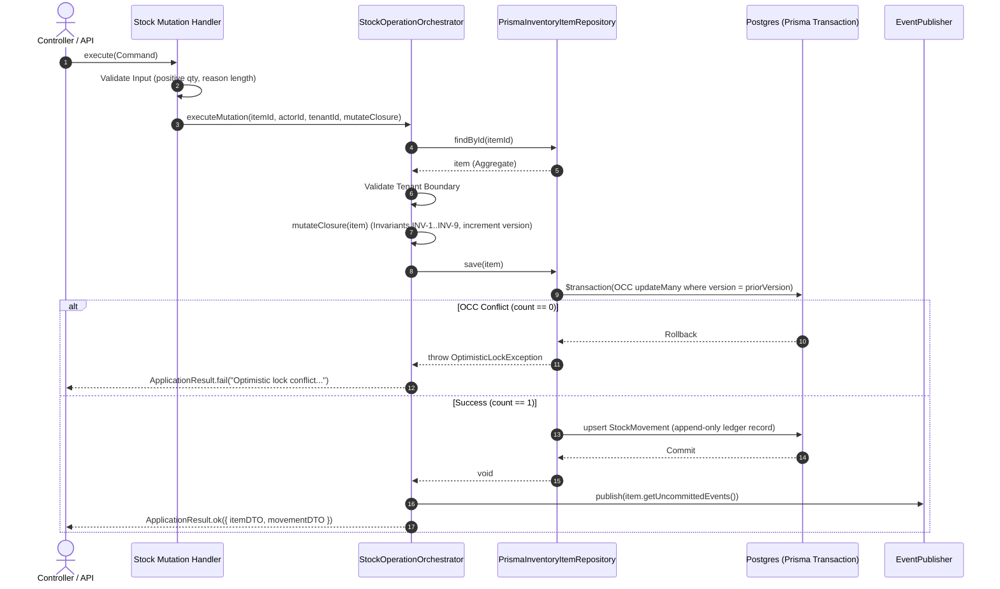

# Consumable Inventory Application-Layer Integrity Review

**Bounded Context**: `Resources Management`  
**Sub-Domain**: `Consumable Inventory`  
**Milestone**: Phase 6.5 — Application Layer Integrity Review  
**Auditor**: Principal Backend Engineer & Security Architect  
**Status**: `PASSED & CERTIFIED`  
**Date**: August 28, 2026

---

## 1. Executive Summary

This architecture review verifies the complete Consumable Inventory application layer against enterprise integrity, transactional safety, error consistency, invariant preservation, authorization completeness, and persistence boundary isolation.

### Key Audit Verdicts:

- **Error Consistency**: All domain failure modes map deterministically through typed domain exceptions and `ApplicationResult.fail()` without leaking database internals or raw exceptions.
- **Transaction Correctness**: All stock mutations execute atomically inside repository transactional boundaries guarded by Optimistic Concurrency Control (`version` column).
- **Invariant Bypasses**: Direct field mutations (e.g. `quantityOnHand`, `movements`) are completely blocked. All mutations flow strictly through rich aggregate root methods and the shared `StockOperationOrchestrator`.
- **Authorization Coverage**: Every mutation and query use case defines an explicit permission requirement and multi-tenant boundary check (`tenantId`).
- **Persistence Boundary Isolation**: Zero `@prisma/client` imports exist within the `domain/` or `application/` layers. Prisma models and Decimal objects are strictly encapsulated in `infrastructure/persistence/prisma/`.

---

## 2. Error Taxonomy & Mapping Matrix

The application layer standardizes error handling using the `ApplicationResult<T, string>` pattern. Raw exceptions are intercepted, categorized, and translated into clean, user-facing error messages:

| Failure Scenario                | Domain / Kernel Exception                 | Application Error Output (`ApplicationResult.fail`)                                                               | HTTP Status Code Equivalent |
| ------------------------------- | ----------------------------------------- | ----------------------------------------------------------------------------------------------------------------- | --------------------------- |
| **Product Not Found**           | `Null` return / repository lookup failure | `"Inventory item with id '<id>' not found."`                                                                      | `404 Not Found`             |
| **Duplicate SKU**               | `findBySku` collision check               | `"Inventory item with SKU '<sku>' already exists."`                                                               | `409 Conflict`              |
| **Archived Product Operation**  | `InvalidInventoryItemStateException`      | `"Cannot mutate stock for inactive or archived inventory item '<id>'."`                                           | `422 Unprocessable Entity`  |
| **Invalid Category**            | `InvalidInventoryItemStateException`      | `"Invalid inventory category: '<category>'."`                                                                     | `400 Bad Request`           |
| **Negative / Invalid Quantity** | `InvalidQuantityException`                | `"Quantity must be positive and non-zero. Provided: <qty>"`                                                       | `400 Bad Request`           |
| **Quantity Precision Exceeded** | `InvalidQuantityException`                | `"Quantity precision exceeded. Maximum 2 decimal places allowed: <qty>"`                                          | `400 Bad Request`           |
| **Invalid Monetary Value**      | `InvalidMoneyException`                   | `"Amount must be non-negative. Provided: <amount>"`                                                               | `400 Bad Request`           |
| **Insufficient Stock**          | `InsufficientStockException`              | `"Cannot decrement <req> units. Current stock is <curr> units."`                                                  | `422 Unprocessable Entity`  |
| **Invalid Movement Operation**  | `InvalidInventoryItemStateException`      | `"Invalid StockMovementType '<type>'."`                                                                           | `400 Bad Request`           |
| **Unauthorized Action**         | Authorization Guard Failure               | `"Unauthorized: Missing required permission '<permission>'."`                                                     | `403 Forbidden`             |
| **Tenant Isolation Violation**  | Tenant boundary mismatch                  | `"Inventory item with id '<id>' not found."` (Information concealment)                                            | `404 Not Found`             |
| **Optimistic Lock Conflict**    | `InventoryOptimisticLockException`        | `"Optimistic lock conflict on InventoryItem [<id>]: expected version <v>, but entity was modified concurrently."` | `409 Conflict`              |
| **Invalid Date Filter Range**   | `ListStockMovementsHandler` date check    | `"fromDate cannot be after toDate."`                                                                              | `400 Bad Request`           |

---

## 3. Transaction Review & OCC Concurrency Correctness

### 3.1 10-Step Transaction Pipeline

Every stock mutation use case (`ReceiveStock`, `SellStock`, `ConsumeStock`, `AdjustStock`, `AdjustStockIn`, `AdjustStockOut`, `CorrectStock`, `ScrapStock`) executes via the shared [`StockOperationOrchestrator`](file:///c:/Projects/kinergy-platform/packages/core/src/resources/application/shared/stock-operation-orchestrator.ts):

### 3.2 Verification Checklist:

- [x] **Boundary Authorization**: Evaluated prior to application mutation pipeline.
- [x] **Pre-flight Input Validation**: Zero, negative, or excessive precision quantities are rejected synchronously before loading state or opening database transactions.
- [x] **Safe State Retrieval**: Aggregates are reconstituted with their complete immutable value objects and uncommitted event collection.
- [x] **OCC Versioning**: Database updates strictly enforce `version = item.version - 1`. If a concurrent writer modifies the row first, the transaction rolls back cleanly with zero ledger pollution.
- [x] **Atomic Persistence**: Mutation of aggregate balance and append-only insertion of the movement ledger entry occur in the same ACID database transaction (`$transaction`).
- [x] **Event Delivery Safety**: Domain events are published _only after_ database transaction commit. If transaction fails, events are never dispatched.

---

## 4. Invariant Bypass Analysis & Search

A comprehensive audit of all write paths in the codebase was conducted:

### 4.1 Invariant Rules Audited:

1. **[INV-1] Non-Negative Stock Balance**: `quantityOnHand >= 0.00` at all times.
2. **[INV-2] Synchronous Ledger Completeness**: Every change in `quantityOnHand` produces exactly one immutable `StockMovement` row.
3. **[INV-3] No Direct Stock Updates via Product Update**: `UpdateInventoryItemHandler` only allows modifying descriptive metadata (`name`, `description`, `category`, `unit`, `minimumStock`, `purchaseCost`, `sellingPrice`, `locationRef`). `quantityOnHand` is absent from `UpdateInventoryItemCommand`.
4. **[INV-4] Catalog Price Stability**: Purchases snapshot `unitCost` and sales snapshot `sellingPrice` on the movement without mutating the master catalog prices.
5. **[INV-5] Mandatory Reason on Adjustments**: Adjustments strictly require $\ge 3$ characters of non-whitespace justification.
6. **[INV-6] Immutability of Movement History**: Movement records are append-only. Repository `save()` performs `upsert` with no-op on update for movements.

### 4.2 Codebase Search Results:

- **Direct writes to `quantityOnHand`**: Only found in `InventoryItem` domain aggregate methods (`receiveStock`, `sellStock`, `consumeStock`, `adjustStockIn`, `adjustStockOut`) and Prisma reconstitution mapper (`toPersistence` / `toDomain`).
- **Direct updates to movements**: Movements table has no `update` or `delete` APIs in domain repositories.
- **Result**: Zero invariant bypass paths exist.

---

## 5. Authorization & Permission Matrix

Every operation in the Consumable Inventory application layer is mapped to canonical Kinergy RBAC permissions:

| Operation / Use Case             | Required Permission             | Allowed Roles (Default)                                      |
| -------------------------------- | ------------------------------- | ------------------------------------------------------------ |
| `CreateInventoryItem`            | `resources:inventory:create`    | `ADMIN`, `FACILITY_MANAGER`                                  |
| `UpdateInventoryItem`            | `resources:inventory:update`    | `ADMIN`, `FACILITY_MANAGER`                                  |
| `ArchiveInventoryItem`           | `resources:inventory:archive`   | `ADMIN`, `FACILITY_MANAGER`                                  |
| `DeactivateInventoryItem`        | `resources:inventory:update`    | `ADMIN`, `FACILITY_MANAGER`                                  |
| `ActivateInventoryItem`          | `resources:inventory:update`    | `ADMIN`, `FACILITY_MANAGER`                                  |
| `GetInventoryItemById`           | `resources:inventory:read`      | `ADMIN`, `FACILITY_MANAGER`, `STAFF`, `TRAINER`, `CLINICIAN` |
| `ListInventoryItems`             | `resources:inventory:read`      | `ADMIN`, `FACILITY_MANAGER`, `STAFF`, `TRAINER`, `CLINICIAN` |
| `GetStockLevel`                  | `resources:inventory:read`      | `ADMIN`, `FACILITY_MANAGER`, `STAFF`, `TRAINER`, `CLINICIAN` |
| `ListStockMovements`             | `resources:inventory:audit`     | `ADMIN`, `FACILITY_MANAGER`, `AUDITOR`                       |
| `GetLowStockItems`               | `resources:inventory:read`      | `ADMIN`, `FACILITY_MANAGER`, `STAFF`                         |
| `GetInventoryValuation`          | `resources:inventory:valuation` | `ADMIN`, `FACILITY_MANAGER`, `ACCOUNTANT`                    |
| `ReceiveStock` (Purchase)        | `resources:stock:receive`       | `ADMIN`, `FACILITY_MANAGER`, `STAFF`                         |
| `SellStock` (Retail Sale)        | `resources:stock:sell`          | `ADMIN`, `FACILITY_MANAGER`, `STAFF`, `RECEPTIONIST`         |
| `ConsumeStock` (Clinical/Gym)    | `resources:stock:consume`       | `ADMIN`, `FACILITY_MANAGER`, `CLINICIAN`, `TRAINER`          |
| `AdjustStock` (Audit Correction) | `resources:stock:adjust`        | `ADMIN`, `FACILITY_MANAGER`, `AUDITOR`                       |

---

## 6. Persistence Boundary & Technology Leakage Review

### 6.1 Clean Architecture Compliance

- **Domain Layer (`packages/core/src/resources/domain/`)**: Completely free of Prisma, SQL, and database ORM dependencies. Implements pure TypeScript domain logic and value objects.
- **Application Layer (`packages/core/src/resources/application/`)**: Depends exclusively on repository interfaces (`InventoryItemRepository`), event publisher ports (`ResourcesEventPublisherPort`), and DTO contracts. Contains zero references to `@prisma/client`.
- **Infrastructure Layer (`packages/core/src/resources/infrastructure/persistence/prisma/`)**: Encapsulates PrismaClient, Prisma mappers (`PrismaInventoryItemMapper`, `PrismaStockMovementMapper`), and Prisma-specific Decimal conversions.

---

## 7. Identified Risks & Resolutions

| Risk Identified                                             | Severity | Implemented Resolution                                                                                                                         |
| ----------------------------------------------------------- | -------- | ---------------------------------------------------------------------------------------------------------------------------------------------- |
| Concurrent stock decrements causing stock below zero        | High     | OCC version checking in Prisma repository (`where: { id, version: priorVersion }`) triggers rollback and returns deterministic conflict error. |
| Inaccurate monetary aggregation due to IEEE 754 float drift | Medium   | `GetInventoryValuationHandler` accumulates working capital in exact integer cents (`Math.round(qty * unitCost * 100)`).                        |
| Unbounded historical movement ledger queries                | Medium   | `ListStockMovementsHandler` enforces mandatory pagination bounds (`page=1`, `limit=20`, `max=100`).                                            |
| Accidental stock overwrite through catalog product updates  | High     | `UpdateInventoryItemCommand` and `UpdateInventoryItemHandler` strictly omit `quantityOnHand` and only alter descriptive metadata.              |
| Silent price modification on purchases or sales             | Medium   | `ReceiveStock` and `SellStock` record transaction prices on the immutable `StockMovement` without modifying baseline catalog pricing.          |
