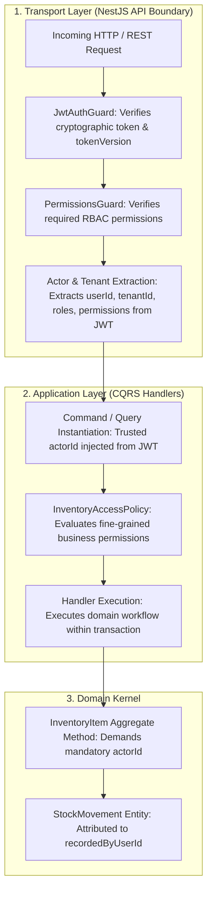

# Consumable Inventory Authentication, Authorization & Security Architecture

**Bounded Context**: `Resources Management`  
**Sub-Domain**: `Consumable Inventory`  
**Milestone**: Phase 6.5 — Consumable Inventory Application Layer  
**Document**: Authoritative Security, RBAC/ABAC Permissions Matrix & Actor Provenance Specification  
**Status**: `APPROVED & ACTIVE`  
**Date**: August 28, 2026

---

## 1. Existing Authorization Architecture & Layering

The **Kinergy Platform** implements a **multi-tiered Defense-in-Depth authorization model** established in Phase 1 (IAM & Security Architecture) and expanded across Phases 2 through 5.



### 1.1 Defense-in-Depth Principles

1. **Pre-Execution Guard Enforcement**: API controllers/resolvers enforce base permissions before invoking application handlers.
2. **Application Policy Enforcement**: Handlers utilize deterministic policy evaluation (`InventoryAccessPolicy`) to verify actor permissions (such as `billing.read` for purchase cost access).
3. **Domain Actor Provenance**: Aggregate methods require a non-empty `actorId` for all state mutations, ensuring 100% of historical movements are permanently attributed.
4. **Zero Body-Supplied Actor Trust**: Client request payloads cannot supply or override `actorId` or `tenantId`. These are strictly extracted from verified JWT security claims.

---

## 2. Inventory Permissions Matrix

| Inventory Operation               | Use Case / Command                                                           | Required Permission(s)                                     | Allowed Default Roles                                  | Purpose & Risk Level                                              |
| :-------------------------------- | :--------------------------------------------------------------------------- | :--------------------------------------------------------- | :----------------------------------------------------- | :---------------------------------------------------------------- |
| **Create Product**                | `CreateInventoryItemCommand`                                                 | `inventory.write` or `inventory.admin`                     | `Owner`, `Admin`, `InventoryManager`                   | High: Introduces new catalog SKUs and opening stock.              |
| **Update Product**                | `UpdateInventoryItemCommand`                                                 | `inventory.write` or `inventory.admin`                     | `Owner`, `Admin`, `InventoryManager`                   | Medium: Modifies catalog metadata and pricing.                    |
| **Archive Product**               | `ArchiveInventoryItemCommand`                                                | `inventory.admin`                                          | `Owner`, `Admin`                                       | High: Discontinues product; requires depleted stock.              |
| **Deactivate Product**            | `DeactivateInventoryItemCommand`                                             | `inventory.write` or `inventory.admin`                     | `Owner`, `Admin`, `InventoryManager`                   | Medium: Temporarily suspends product from sales/consumption.      |
| **Activate Product**              | `ActivateInventoryItemCommand`                                               | `inventory.write` or `inventory.admin`                     | `Owner`, `Admin`, `InventoryManager`                   | Medium: Re-activates suspended product.                           |
| **Record Purchase**               | `ReceiveStockCommand`                                                        | `inventory.write` or `inventory.admin`                     | `Owner`, `Admin`, `InventoryManager`, `InventoryClerk` | High: Increases stock on hand and logs purchase cost.             |
| **Record Sale**                   | `SellStockCommand`                                                           | `inventory.write` or `sales.write` or `inventory.admin`    | `Owner`, `Admin`, `Receptionist`, `POS`                | High: Decrements stock on hand upon retail purchase.              |
| **Record Consumption**            | `ConsumeStockCommand`                                                        | `inventory.write` or `treatment.write` or `clinical.write` | `Owner`, `Admin`, `Clinician`, `Therapist`, `Trainer`  | High: Decrements stock consumed during treatment sessions.        |
| **Adjust Stock (In/Out/Correct)** | `AdjustStockIn/Out/CorrectCommand`                                           | `inventory.adjust` or `inventory.admin`                    | `Owner`, `Admin`, `InventoryManager`                   | Critical: Manual inventory count adjustments and reconciliations. |
| **Scrap Stock**                   | `ScrapStockCommand`                                                          | `inventory.adjust` or `inventory.admin`                    | `Owner`, `Admin`, `InventoryManager`                   | Critical: Writes off spoiled/expired inventory.                   |
| **View Catalog / Stock**          | `ListInventoryItemsQuery`, `GetInventoryItemByIdQuery`, `GetStockLevelQuery` | `inventory.read`                                           | `Owner`, `Admin`, `Staff`, `Clinician`, `Trainer`      | Low: Reads public catalog items and stock levels.                 |
| **View Movements**                | `ListStockMovementsQuery`                                                    | `inventory.read`                                           | `Owner`, `Admin`, `InventoryManager`                   | Medium: Reads chronological stock audit ledger.                   |
| **View Low Stock**                | `GetLowStockInventoryItemsQuery`                                             | `inventory.read`                                           | `Owner`, `Admin`, `InventoryManager`                   | Medium: Views items requiring replenishment.                      |
| **View Inventory Valuation**      | `GetInventoryValuationQuery`                                                 | `inventory.read` **AND** `billing.read`                    | `Owner`, `Admin`, `FinanceManager`                     | Critical: Computes total monetary asset valuation.                |

---

## 3. Actor Identity & Provenance Strategy

### 3.1 Prevention of Actor Spoofing

- In the REST transport layer, HTTP request DTOs (e.g. `CreateProductDto`, `ReceiveStockDto`) **do not contain** `actorId` or `tenantId` fields.
- The NestJS controller extracts `req.user.userId` and `req.user.tenantId` from the verified `JwtAuthGuard` context and constructs the internal Command object:

```typescript
// Controller pattern (Phase 6.6+):
@Post('receive')
@RequirePermissions('inventory.write')
async receiveStock(@Param('id') id: string, @Body() dto: ReceiveStockDto, @CurrentUser() user: AuthUser) {
  const command = new ReceiveStockCommand({
    id,
    tenantId: user.tenantId,
    quantity: dto.quantity,
    unitCost: dto.unitCost,
    referenceId: dto.referenceId,
    reason: dto.reason,
    actorId: user.userId, // Extracted from verified JWT
  });
  return this.receiveStockHandler.execute(command);
}
```

---

## 4. Stock Operation Security & Invariant Protection

Stock operations are **business-critical financial events**. The following invariants are strictly enforced:

1. **Authorization Precedes Domain Mutation**: Access policies verify actor permission before aggregate loading and mutation.
2. **Tenant Boundary Enforcement**: An actor from Tenant A cannot view or mutate inventory belonging to Tenant B (`tenantId` check in repository queries).
3. **Mandatory Justification for Adjustments**: `AdjustStockIn`, `AdjustStockOut`, `CorrectStock`, and `ScrapStock` commands require non-empty `reason` strings; requests with blank reasons are rejected immediately.
4. **Commercial Pricing Masking**: If an actor querying products lacks `billing.read` permission, `purchaseCostAmount` is sanitized/masked from the presentation DTO.

---

## 5. System & Automated Actors Strategy

The Kinergy platform supports automated background tasks (e.g., recurring inventory audits, automated replenishment notifications, or batch expiration):

- **System Principal Identification**: Automated background cron jobs and event handlers execute with a designated system actor identity:
  - `actorId = 'system:replenishment-engine'` or `'system:batch-sync'`
  - `tenantId = targetTenantId`
- **System Actor Authorization**: Internal event handlers running in trusted worker processes bypass HTTP JWT guards but execute through the same application command handlers, preserving 100% aggregate invariant checks and movement ledger creation.

---

## 6. Rejected Alternatives

1. **Relying Exclusively on Controller Guards**:
   - _Rejected_: Fails defense-in-depth. If internal application services are invoked across bounded contexts or via queue workers, unauthorized actions could occur without domain awareness.
2. **Passing Raw Request Bodies Containing `actorId`**:
   - _Rejected_: Severe security vulnerability allowing malicious clients to forge audit entries under another user's identity.
3. **Creating a Separate Inventory Roles Database**:
   - _Rejected_: Redundant. Kinergy's Phase 1 IAM RBAC system already provides fine-grained permission evaluation across all bounded contexts.
