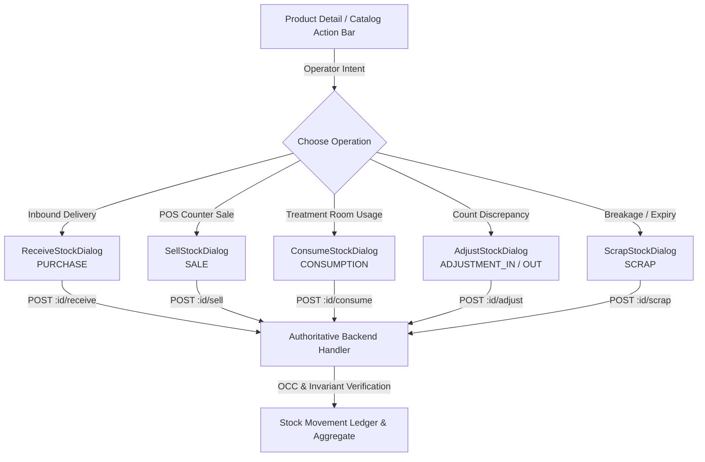

# Consumable Inventory Stock Mutation Frontend Interaction Architecture & UX Specification

**Bounded Context**: `Resources Management`  
**Sub-Domain**: `Consumable Inventory`  
**Milestone**: Phase 6.12 — Inventory Frontend Implementation  
**Document**: Frontend Interaction Architecture for High-Consistency Stock Mutations  
**Status**: `APPROVED & ACTIVE`  
**Date**: September 2, 2026

---

## 1. Executive Summary & Core Quality Rule

> **Quality Rule**:  
> _The frontend records inventory intent. The backend performs the authoritative stock transition._

Stock mutations represent physical and financial reality in Kinergy. Unlike descriptive metadata (such as a product name or category), stock changes directly impact:

- Real-time clinical treatment availability.
- Point-of-sale customer fulfillment.
- Double-entry movement audit ledgers.
- Balance sheet working capital valuation.

When two staff members attempt to sell, consume, or adjust stock on the same product near-simultaneously, the frontend cannot guarantee correctness through client-side arithmetic. The backend's database transaction, Optimistic Concurrency Control (OCC) versioning, and non-negative domain invariants are the sole operational source of truth.

This specification establishes the frontend interaction architecture for all stock mutations across Kinergy Web.

---

## 2. Operation Model: Intent-Driven Workflows vs Generic Quantity Modifiers

### Architectural Decision: Intent-Driven Explicit Operation Dialogs

Kinergy strictly rejects a generic _"Change Stock by Delta"_ or _"Set Stock to X"_ field. Arbitrary delta inputs obscure operator intent, encourage sloppy bookkeeping, and bypass mandatory business metadata (such as supplier PO numbers, treatment session IDs, or damage explanations).

Instead, Kinergy adopts **Intent-Driven Transactional Modal Dialogs**:



### Benefits of the Intent-Driven Model

1. **Business Clarity**: Operators select their concrete real-world task (e.g., "Receive Delivery" vs "Scrap Damaged Item") rather than guessing arithmetic signs.
2. **Context-Specific Auditing**: Each operation requires strictly its relevant business context (e.g., supplier PO for receipts, session ID for treatment, reason for scrap).
3. **Role & Permission Alignment**: Actions are selectively exposed according to Kinergy's operational security matrix (e.g., trainers see consumption; cashiers see sales; auditors see count adjustments).
4. **Prevention of Accidental Overdrafts**: UI prevents negative inputs on receipts and clearly visualizes projected balances prior to submission.

---

## 3. Approved Movement Types & API Alignment

The frontend adheres strictly to the backend `StockMovementType` domain enum. No synthetic or client-only movement types exist:

| Movement Type    | Business Meaning                        | Quantity Sign Impact   | Endpoint                                                     | Permitted Roles                                                  |
| :--------------- | :-------------------------------------- | :--------------------- | :----------------------------------------------------------- | :--------------------------------------------------------------- |
| `PURCHASE`       | Inbound supplier delivery               | Stock Increases ($+q$) | `POST /api/v1/resources/inventory/:id/receive`               | `ADMIN`, `SUPER_ADMIN`, `OWNER`, `KITCHEN_STAFF`                 |
| `SALE`           | Retail POS transaction                  | Stock Decreases ($-q$) | `POST /api/v1/resources/inventory/:id/sell`                  | `ADMIN`, `SUPER_ADMIN`, `OWNER`, `KITCHEN_STAFF`, `RECEPTIONIST` |
| `CONSUMPTION`    | Clinical treatment session usage        | Stock Decreases ($-q$) | `POST /api/v1/resources/inventory/:id/consume`               | `ADMIN`, `SUPER_ADMIN`, `OWNER`, `KITCHEN_STAFF`, `TRAINER`      |
| `ADJUSTMENT_IN`  | Cycle count discrepancy (found stock)   | Stock Increases ($+q$) | `POST /api/v1/resources/inventory/:id/adjust` ($\Delta > 0$) | `ADMIN`, `SUPER_ADMIN`, `OWNER`, `KITCHEN_STAFF`                 |
| `ADJUSTMENT_OUT` | Cycle count discrepancy (missing stock) | Stock Decreases ($-q$) | `POST /api/v1/resources/inventory/:id/adjust` ($\Delta < 0$) | `ADMIN`, `SUPER_ADMIN`, `OWNER`, `KITCHEN_STAFF`                 |
| `SCRAP`          | Disposal of damaged/expired inventory   | Stock Decreases ($-q$) | `POST /api/v1/resources/inventory/:id/scrap`                 | `ADMIN`, `SUPER_ADMIN`, `OWNER`, `KITCHEN_STAFF`                 |

---

## 4. Type-Specific Input Requirements & Validation Schemas

Every operation requires a tailored Zod schema ensuring zero extraneous or silently discarded fields:

### 4.1 Inbound Receipt (`ReceiveStockDialog` / `receiveStockSchema`)

- **Quantity** (`quantity`, integer $> 0$, required): Discrete counting units received.
- **Batch Unit Cost** (`unitCost`, number $\ge 0$, optional): Specific invoice acquisition cost for this receipt batch.
- **PO / Invoice Reference** (`referenceNumber`, string $2\text{--}100$ chars, required): Supplier delivery slip or purchase order tracking code.
- **Delivery Notes** (`notes`, string $\le 255$ chars, optional): Packaging condition, storage bay, or carrier details.

### 4.2 Retail Point-of-Sale (`SellStockDialog` / `sellStockSchema`)

- **Quantity** (`quantity`, integer $> 0$, required): Discrete counting units sold.
- **Unit Price** (`unitPrice`, number $\ge 0$, optional): Overridden customer price (defaults to product retail selling price).
- **POS / Invoice Reference** (`referenceId`, string $\le 100$ chars, optional): Front-desk receipt or billing invoice ID.
- **Transaction Notes** (`notes`, string $\le 255$ chars, optional): Staff reference notes.

### 4.3 Treatment Consumption (`ConsumeStockDialog` / `consumeStockSchema`)

- **Quantity** (`quantity`, integer $> 0$, required): Discrete counting units consumed in session.
- **Treatment Session ID** (`treatmentSessionId`, string $\le 100$ chars, optional): Clinical appointment or SOAP note cross-reference.
- **Clinical Notes** (`notes`, string $\le 255$ chars, optional): Patient protocol or application details.

### 4.4 Damaged / Expired Scrap (`ScrapStockDialog` / `scrapStockSchema`)

- **Quantity** (`quantity`, integer $> 0$, required): Units physically disposed.
- **Audit Explanation** (`reason`, string $5\text{--}255$ chars, required): Explicit cause for disposal (e.g., "Seal broken in storage", "Expired on batch audit").

### 4.5 Audit Count Adjustment (`AdjustStockDialog` / `adjustStockSchema`)

- **Delta Units** (`deltaQuantity`, integer $\ne 0$, required): Difference between counted stock and current system balance ($+X$ or $-X$).
- **Audit Explanation** (`reason`, string $5\text{--}255$ chars, required): Mandatory justification for discrepancy.
- **Projected Balance Preview**: Displays live comparison:
  $$\text{Projected} = \text{Current Stock} + \text{Delta}$$
  Submissions resulting in negative projected stock are disabled on the client prior to dispatch.

---

## 5. Current Stock Display: Informational Context vs Client Authority

### Informational Context Tenet

The current stock rendered in dialogs (`product.currentStock`) is strictly **informational context** to assist the operator.

### Non-Authoritative Client State

The client **must never** assume the rendered stock is guaranteed true at the exact moment of execution:

1. Between the moment the modal opens and the operator clicks Submit, another terminal may have sold or consumed stock.
2. The frontend does not send `expectedNewStock`. It sends only the operational payload (`quantity`, `deltaQuantity`, `referenceId`, `reason`).
3. The backend independently verifies stock balances under a database write lock and Optimistic Concurrency Control aggregate version check.

---

## 6. Concurrency Strategy & Pessimistic UI Decision

### The Race Condition Vector

Consider two front-desk terminals simultaneously attempting to sell stock:

- Product A has `10 units` on hand.
- Staff 1 attempts to sell `7 units`.
- Staff 2 attempts to sell `6 units`.

```
Timeline:
T0: Both terminals display "10 units available".
T1: Staff 1 clicks "Record Sale" (7 units).
T2: Staff 2 clicks "Record Sale" (6 units).
T3: Backend commits Staff 1 (Stock drops to 3 units).
T4: Backend evaluates Staff 2 (3 - 6 = -3 -> REJECTED: InsufficientStockException).
```

### Decision: Pessimistic Mutation Execution (No Optimistic Balance Drift)

- **Why No Optimistic Updates?**  
  Optimistically decrementing client state creates dangerous false impressions of fulfillment for adjacent users, desynchronizes double-entry balance-after ledgers, and forces complex rollback transitions when backend OCC or overdraft rejections occur.
- **Pessimistic Invariant**:  
  Stock mutations execute **pessimistically**. The client displays pending progress, awaits authoritative backend completion, and reconciles state through query invalidation upon success.

---

## 7. Lifecycle States: Pending, Success, Failure & Insufficient Stock

### 7.1 Pending Behavior

- Submit button enters loading state with spinner and descriptive label (`"Recording Receipt..."`, `"Processing Sale..."`, `"Adjusting Stock..."`).
- Inputs and Cancel buttons are disabled to prevent duplicate submissions or accidental dialog dismissals.
- Modal backdrop is locked.

### 7.2 Success Behavior

1. Toast notification announces authoritative outcome:
   - Example: _"Received 24 units into inventory"_, _"Recorded retail sale of 2 units"_, _"Inventory balance adjusted"_.
2. Modal dialog closes cleanly.
3. Form values reset to baseline defaults.
4. **Authoritative Cache Reconciliation**:
   - `inventoryQueryKeys.detail(id)` (updates product card & stock hero)
   - `inventoryQueryKeys.stock(id)` (updates live stock level metrics)
   - `inventoryQueryKeys.movements(id)` (prepends new ledger movement)
   - `inventoryQueryKeys.lists()` (updates catalog table rows)
   - `inventoryQueryKeys.lowStock()` (updates restock alert queues)
   - `inventoryQueryKeys.valuation()` (updates balance sheet valuation)

### 7.3 Failure Behavior (General Server Errors)

- Toast notification displays standard error message.
- Dialog remains open.
- Operator's entered values (notes, quantities, references) are **fully preserved** to avoid re-entry frustration.
- Action button re-enables for retry.

### 7.4 Insufficient-Stock & Concurrency Rejection Behavior

When the backend rejects an operation with `InsufficientStockException` (HTTP 400 with message `"Insufficient stock on hand"`):

1. **No False Success**: The modal does not close; no success message is emitted.
2. **Actionable In-Modal Feedback**: An error alert appears directly above the form actions explaining:
   > _"Transaction Aborted: Insufficient stock on hand to fulfill this operation. Another user or session may have modified available inventory."_
3. **Immediate Cache Refetch**:
   - `inventoryQueryKeys.detail(id)` and `inventoryQueryKeys.stock(id)` are immediately invalidated and refetched in the background.
   - The informational current balance in the modal updates to the newly loaded authoritative server quantity, allowing the operator to see the actual remaining units.

---

## 8. Adjustments: Explicit In / Out vs "Set Stock to X"

### The Audit Risk of "Set Stock to X"

In legacy systems, typing an absolute quantity (e.g. changing `10` to `8`) hides whether `2` units were sold, consumed, stolen, damaged, or miscounted.

### Explicit Delta & Reason Enforcement

In Kinergy:

- Adjustments require an explicit **delta** ($+X$ or $-X$) and a **mandatory written audit reason** (min 5 characters).
- If an operator counts `8` units when the system shows `10`, the dialog asks for $\Delta = -2$ and prompts for an audit explanation (e.g., _"Physical count audit identified 2 missing units during weekly inventory reconciliation"_).
- The backend automatically categorizes $\Delta > 0$ as `ADJUSTMENT_IN` and $\Delta < 0$ as `ADJUSTMENT_OUT`, preserving exact double-entry auditability.

---

## 9. Accessibility (a11y) & UX Considerations

1. **Focus Trapping**: Dialogs use Radix UI `<Dialog>` primitives to trap keyboard focus and support `Escape` key dismissal.
2. **Numeric Input Steppers**: Quantity inputs declare `type="number"`, `min="1"`, `step="1"` for mobile and accessibility steppers.
3. **High-Contrast Badges**: Movement types use semantic contrast variants (`default` for additions, `secondary` for sales/consumption, `destructive` for scrap and negative adjustments).
4. **Live Balance Projection**: Calculations like `currentStock + delta` use `aria-live="polite"` text containers so screen readers announce resulting balances.
5. **Clear Error Association**: Form validation errors link to their respective inputs via `aria-describedby`.
