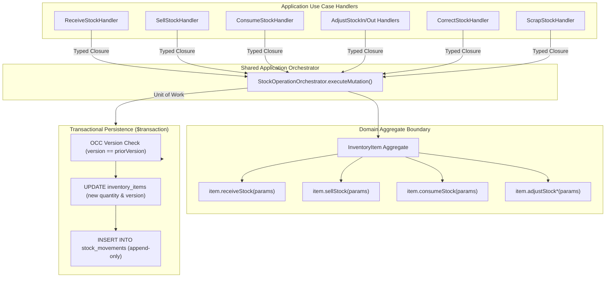

# Consumable Inventory Stock Operations & Transactional Foundation Specification

**Bounded Context**: `Resources Management`  
**Sub-Domain**: `Consumable Inventory`  
**Milestone**: Phase 6.5 — Consumable Inventory Application Layer  
**Document**: Authoritative Transactional Foundation, Concurrency Control, and Stock Mutation Orchestration Specification  
**Status**: `APPROVED & ACTIVE`  
**Date**: August 28, 2026

---

## 1. Executive Summary & Objective

Stock operations represent the financial and physical reality of clinical and gym operations within Kinergy. Every stock mutation—whether incoming supplier purchases, retail point-of-sale customer orders, clinical treatment consumption, or auditing corrections—directly impacts asset valuation, ledger consistency, and operational replenishment.

This specification establishes the application-layer transactional foundation across the four core stock mutation operations:

1. **RecordPurchase** (`ReceiveStockHandler` / `StockMovementType.PURCHASE`)
2. **RecordSale** (`SellStockHandler` / `StockMovementType.SALE`)
3. **RecordConsumption** (`ConsumeStockHandler` / `StockMovementType.CONSUMPTION`)
4. **AdjustStock** (`AdjustStockInHandler`, `AdjustStockOutHandler`, `CorrectStockHandler`, `ScrapStockHandler`)

The objective is to guarantee **absolute failure atomicity**, **deterministic concurrency safety**, and **zero stock/movement drift** without duplicating transactional orchestration across independent use cases.

---

## 2. Core Business Invariants

For every inventory stock mutation without exception, the following mathematical and domain invariants are enforced:

### Invariant 1: Non-Negative Stock on Hand

$$\text{quantityOnHand} \ge 0.00 \quad \land \quad \text{stock\_after\_movement} \ge 0.00$$
Negative inventory balances (overdrafts) are strictly prohibited. Any transaction attempting to decrement stock below `0.00` is aborted immediately with `InsufficientStockException`.

### Invariant 2: Immutable Ledger & Balance-After Integrity

$$\text{balanceAfter}_k = \text{balanceAfter}_{k-1} + \Delta q_k$$
Stock movements are strictly append-only. The stored `balanceAfter` on each movement must equal the exact resulting `quantityOnHand` of the item immediately following the mutation. Existing movement records are immutable and cannot be updated or deleted.

### Invariant 3: Atomic Stock Balance & Movement Synchronization

No stock balance mutation may occur without recording a corresponding `StockMovement` entity, and no `StockMovement` may exist without updating the aggregate stock balance in the same atomic database transaction.

### Invariant 4: Catalog Lifecycle Guard (Inactive/Archived Rejection)

Stock mutations are permitted **only** when the aggregate status is `ACTIVE`. If an item is `INACTIVE` (temporarily suspended) or `ARCHIVED` (permanently discontinued), all stock mutations are rejected with `InvalidInventoryItemStateException`.

---

## 3. Shared Transaction & Orchestration Strategy

### 3.1 Architectural Decision: Internal Orchestrator Pattern

To avoid duplicating the 10-step transactional boilerplate across four use case families while preventing dangerous generic mutations (such as `adjustStock(id, delta)` that bypass domain intent), Kinergy adopts a specialized internal abstraction: **`StockOperationOrchestrator`**.



### 3.2 Key Design Tenets of `StockOperationOrchestrator`

1. **No Generic Public Deltas**: The orchestrator accepts a domain mutation closure `(item: InventoryItem) => StockMovement`. Handlers invoke explicit aggregate methods (`item.sellStock(...)`, `item.receiveStock(...)`), preserving domain vocabulary and type safety.
2. **Standardized Error Translation**: Automatically catches and maps domain exceptions (`InsufficientStockException`, `InvalidInventoryItemStateException`, `OptimisticLockException`) into uniform `ApplicationResult.fail()` responses.
3. **Outbox Event Dispatch**: Dispatches uncommitted aggregate events via `ResourcesEventPublisherPort` only after successful database commit, ensuring zero ghost events if persistence fails.

---

## 4. Authoritative 10-Step Operation Sequence

Every stock mutation follows this deterministic 10-step lifecycle:

```mermaid
sequenceDiagram
    autonumber
    actor Actor as Client / System
    participant Handler as CommandHandler
    participant Orchestrator as StockOperationOrchestrator
    participant Repo as InventoryItemRepository
    participant Aggregate as InventoryItem Aggregate
    participant DB as Postgres ($transaction)
    participant Bus as EventPublisher

    Actor->>Handler: execute(command)
    Handler->>Handler: 1. Validate Command Input (syntax, non-empty IDs, positive quantities)
    Handler->>Orchestrator: 2. executeMutation(itemId, actorId, mutationClosure)
    Orchestrator->>Repo: 3. findById(itemId) (Load aggregate state)
    Repo-->>Orchestrator: return InventoryItem | null
    Orchestrator->>Orchestrator: 4. Validate Aggregate Existence (return 404 if missing)
    Orchestrator->>Aggregate: 5. Invoke Mutation Closure (item.sellStock / receiveStock / etc.)
    Aggregate->>Aggregate: 6. Validate Domain Invariants (Active status, Sufficient stock, Non-negative delta)
    Aggregate->>Aggregate: 7. Create StockMovement & Increment Version & Register Domain Event
    Orchestrator->>Repo: 8. save(item) (Enter atomic persistence boundary)
    Repo->>DB: 9. BEGIN $transaction: UPDATE inventory_items WHERE version = v_prior; INSERT INTO stock_movements; COMMIT;
    DB-->>Repo: Success (count = 1)
    Orchestrator->>Bus: 10. publish(uncommittedEvents) & clearEvents()
    Orchestrator-->>Handler: return ApplicationResult.ok(StockMutationResultDTO)
    Handler-->>Actor: return Result (item DTO, movement DTO)
```

---

## 5. Concurrency Strategy & Lost Update / Overdraft Prevention

### 5.1 Optimistic Concurrency Control (OCC) Architecture

Kinergy implements Optimistic Concurrency Control backed by an integer `version` field on the `InventoryItem` table and aggregate root.

#### The Race Condition Scenario: Concurrent Sales

- Initial Stock: `10 units` (Version `1`)
- **Requester A**: Attempts to sell `7 units`
- **Requester B**: Attempts to sell `6 units` simultaneously

```
Time | Requester A (Sell 7)              | Requester B (Sell 6)
---------------------------------------------------------------------------------------------
T1   | Reads item (qty=10, version=1)     | Reads item (qty=10, version=1)
T2   | Domain: newQty=3, newVer=2         | Domain: newQty=4, newVer=2
T3   | UPDATE item SET qty=3, ver=2       |
     | WHERE id=X AND ver=1 (Succeeds!)   |
T4   | INSERT stock_movement (qty=-7)     |
T5   | COMMITS TRANSACTION                |
T6   |                                    | UPDATE item SET qty=4, ver=2
     |                                    | WHERE id=X AND ver=1 (Rows affected: 0)
T7   |                                    | Throws OptimisticLockException!
T8   |                                    | Transaction ABORTED. Rollback.
```

### 5.2 Mathematical Proof of Overdraft Impossibility

1. Both requests read `version = 1`.
2. Requester A acquires the write lock first, updating `version = 2` and committing stock `3`.
3. Requester B attempts `UPDATE inventory_items WHERE id = X AND version = 1`. Because `version` is now `2`, PostgreSQL matches `0` rows.
4. `PrismaInventoryItemRepository` evaluates `result.count === 0` and throws `OptimisticLockException`.
5. Requester B's entire `$transaction` rolls back immediately.
6. **Result**: Total committed sales = `7 units`. Remaining stock = `3 units`. Overdraft is mathematically impossible.

---

## 6. Archived & Inactive Product Behavior

Catalog lifecycle rules strictly regulate when inventory movements can occur:

| Item Status | Receive Stock | Sell Stock  | Consume Stock | Adjust In/Out | Correct Stock | Scrap Stock |
| :---------- | :-----------: | :---------: | :-----------: | :-----------: | :-----------: | :---------: |
| `ACTIVE`    |  ✅ Allowed   | ✅ Allowed  |  ✅ Allowed   |  ✅ Allowed   |  ✅ Allowed   | ✅ Allowed  |
| `INACTIVE`  |  ❌ Rejected  | ❌ Rejected |  ❌ Rejected  |  ❌ Rejected  |  ❌ Rejected  | ❌ Rejected |
| `ARCHIVED`  |  ❌ Rejected  | ❌ Rejected |  ❌ Rejected  |  ❌ Rejected  |  ❌ Rejected  | ❌ Rejected |

### Rejection Rationale

- **`INACTIVE`**: An inactive item is suspended from clinic use. No transactions may occur until an authorized user explicitly calls `ActivateInventoryItem`.
- **`ARCHIVED`**: An archived item is permanently discontinued and guaranteed to have `quantityOnHand == 0.00`. Modifying stock on an archived item is forbidden.

---

## 7. Movement Consistency Guarantees & Audit Provenance

Every stock movement persisted by the shared foundation captures an indelible snapshot:

- **`id`**: Unique movement UUID (`StockMovementId`).
- **`inventoryItemId`**: Foreign key to catalog item.
- **`movementType`**: Explicit business operation (`PURCHASE`, `SALE`, `CONSUMPTION`, `ADJUSTMENT_IN`, `ADJUSTMENT_OUT`, `CORRECTION`, `SCRAP`, `OPENING_BALANCE`).
- **`quantityDelta`**: Signed decimal quantity ($+q$ for additions, $-q$ for deductions).
- **`balanceAfter`**: Absolute snapshot of aggregate stock balance immediately following the change.
- **`unitCost` / `unitPrice`**: Financial snapshot at time of movement.
- **`reason`**: Mandatory human-readable operational justification.
- **`recordedByUserId`**: Un-spoofable actor ID from authenticated security context.
- **`referenceId`**: Optional external correlation identifier (e.g. Purchase Order, Treatment Session ID, Receipt ID).
- **`recordedAt`**: High-precision UTC timestamp.

---

## 8. Failure Atomicity & Partial Rollback Guarantees

If any error occurs during the operation:

1. **Domain Invariant Failure** (e.g. insufficient stock): Aborts before database transaction; 0 database queries executed.
2. **Database Write Failure** (e.g. constraint violation or connection error): Prisma rolls back the entire `$transaction`. Neither `inventory_items` nor `stock_movements` are modified.
3. **OCC Version Conflict**: `OptimisticLockException` triggers transaction rollback.
4. **Event Dispatch Failure**: Uncommitted domain events are only dispatched _after_ the database transaction commits. If persistence fails, no false events are published to external listeners.

---

## 9. Operation Workflow Specifics & Pricing Semantics

### 9.1 Record Purchase (`ReceiveStockHandler`)

- **Intent**: Ingestion of physical supplies from distributors, vendors, or manufacturers.
- **Stock Delta**: Positive ($+q$).
- **Pricing & Valuation**: Captures procurement invoice `unitCost` on the resulting `StockMovement` record. Does **not** silently overwrite the catalog's baseline `purchaseCost` unless an explicit catalog update command is executed.
- **Provenance**: Captures vendor PO numbers or delivery batch codes via `referenceId`.

### 9.2 Record Sale (`SellStockHandler`)

- **Intent**: Point-of-sale customer and patient retail purchases.
- **Stock Delta**: Negative ($-q$).
- **Pricing & Revenue**: Snapshots realized `sellingPrice` on the movement record.
- **Invariant Enforcement**: Rejects any attempt to sell more than `quantityOnHand` with `InsufficientStockException`.
- **Provenance**: Captures POS receipt or invoice numbers via `referenceId`.

### 9.3 Record Consumption (`ConsumeStockHandler`)

- **Intent**: Internal operational usage during kinesiology, physiotherapy, or gym facility services (e.g. kinesiology tape, sanitizing sprays, resistance bands used during clinical sessions).
- **Distinction from Sale**: Does not involve commercial revenue, customer invoicing, or retail pricing.
- **Context & Clinical Correlation**: Requires mandatory descriptive reason (minimum 3 characters) and supports linking directly to `TreatmentSession.id` via `referenceId`.
- **Invariant Enforcement**: Rejects any attempt to consume more than `quantityOnHand`.

---

## 10. Idempotency Evaluation & Natural Reference Tokens

### 10.1 Architectural Pattern Review

In accordance with Kinergy's bounded context idempotency patterns (e.g. ADR 0066/0067 for Gym Check-in Anti-Passback and Scheduling Booking Tokens):

- Stock mutations are transactional state transitions protected by Optimistic Concurrency Control (`version`).
- Each command supports optional natural business correlation tokens (`referenceId`), such as Purchase Order numbers (`PO-2026-XXXX`), Sales Invoices (`POS-REC-XXXX`), or Clinical Treatment Sessions (`TX-SESSION-XXXX`).

### 10.2 Milestone Decision & Risk Assessment

- **Current Standard**: The application relies on natural `referenceId` tracking, OCC version checks, and actor audit logging.
- **No Speculative Infrastructure**: We do not introduce a dedicated synthetic idempotency key cache/table solely for Phase 6.5, adhering strictly to Kinergy's design principles.
- **Operational Risk & Mitigation**: Duplicate network submissions with distinct versions could potentially execute twice if the client resubmits after reloading state. The natural `referenceId` and immutable ledger allow full audit trace and programmatic reconciliation if client-side retries occur.

---

## 11. Handler & Orchestrator Implementation Matrix

| Operation             | Command                 | Orchestrator Method Invoked      | Domain Aggregate Method    |
| :-------------------- | :---------------------- | :------------------------------- | :------------------------- |
| **RecordPurchase**    | `ReceiveStockCommand`   | `orchestrator.executeMutation()` | `item.receiveStock(...)`   |
| **RecordSale**        | `SellStockCommand`      | `orchestrator.executeMutation()` | `item.sellStock(...)`      |
| **RecordConsumption** | `ConsumeStockCommand`   | `orchestrator.executeMutation()` | `item.consumeStock(...)`   |
| **AdjustStock (In)**  | `AdjustStockInCommand`  | `orchestrator.executeMutation()` | `item.adjustStockIn(...)`  |
| **AdjustStock (Out)** | `AdjustStockOutCommand` | `orchestrator.executeMutation()` | `item.adjustStockOut(...)` |
| **CorrectStock**      | `CorrectStockCommand`   | `orchestrator.executeMutation()` | `item.correctStock(...)`   |
| **ScrapStock**        | `ScrapStockCommand`     | `orchestrator.executeMutation()` | `item.scrapStock(...)`     |
