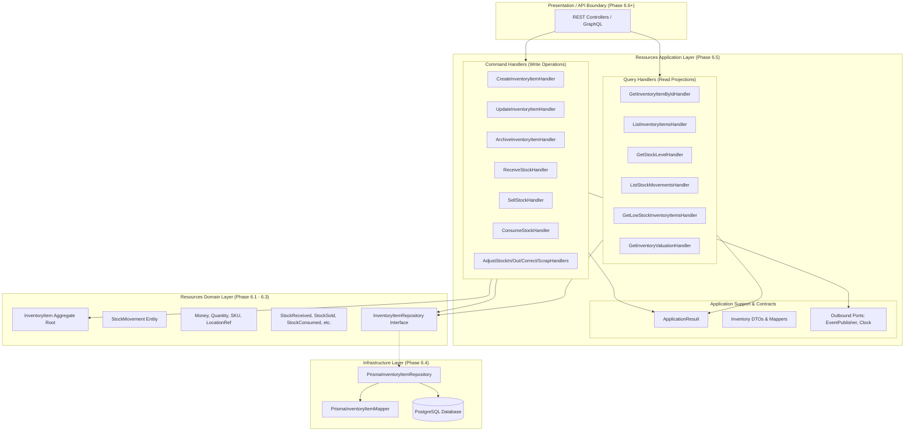

# Consumable Inventory Use Case Contracts & Application Architecture Specification

**Bounded Context**: `Resources Management`  
**Sub-Domain**: `Consumable Inventory`  
**Milestone**: Phase 6.5 — Consumable Inventory Application Layer  
**Document**: Authoritative Application Contracts, CQRS Invariants & Boundary Specification  
**Status**: `APPROVED & ACTIVE`  
**Date**: August 28, 2026

---

## 1. Application Layer Dependency Architecture

The application layer orchestrates domain aggregates, enforces actor authorization, manages transactional boundaries, and maps to/from presentation-agnostic Data Transfer Objects (DTOs).

---

## 2. Product Lifecycle Use Case Contracts

### 2.1 Use Case: `CreateProduct` (`CreateInventoryItemCommand`)

1. **Purpose**: Registers a new product SKU in the tenant catalog with optional initial opening stock.
2. **Actor**: Inventory Manager, Clinic Administrator.
3. **Required Authorization**: `inventory.write` or `inventory.admin`.
4. **Input**:
   - `tenantId` (string, required)
   - `sku` (string, required, uppercase alphanumeric formatted)
   - `name` (string, required, non-empty)
   - `description` (string, optional)
   - `category` (enum `InventoryCategory`, required)
   - `unit` (enum `UnitOfMeasure`, required)
   - `minimumStock` (number, non-negative, default `0.00`)
   - `initialStock` (number, non-negative, default `0.00`)
   - `purchaseCost` (`{ amount: number, currency: string }`, non-negative)
   - `sellingPrice` (`{ amount: number, currency: string }`, non-negative)
   - `locationRef` (`{ facilityId: string, roomRef?: string, binCode?: string }`, optional)
   - `actorId` (string, required)
5. **Validation Rules**: SKU format, string trimming, positive/zero price/cost, valid unit enum.
6. **Required State**: No existing product with identical SKU within the same tenant.
7. **Business Invariants**: If `initialStock > 0`, an initial `OPENING_BALANCE` movement is automatically created.
8. **Transaction Requirement**: Single unit-of-work `$transaction` (saving aggregate + initial movement).
9. **Persistence Operations**: `inventory_items` INSERT, optional `stock_movements` INSERT.
10. **Result**: `ApplicationResult<InventoryItemDTO>`.
11. **Expected Failures**: `SKU_ALREADY_EXISTS`, `INVALID_SKU_FORMAT`, `NEGATIVE_STOCK_VALUE`.
12. **Side Effects**: Emits `InventoryItemCreatedEvent`.
13. **Audit / Movement Behavior**: Initial stock logged with `movementType: OPENING_BALANCE` and `recordedByUserId: actorId`.

---

### 2.2 Use Case: `UpdateProduct` (`UpdateInventoryItemCommand`)

1. **Purpose**: Updates mutable catalog metadata (description, pricing, reorder thresholds, location).
2. **Actor**: Inventory Manager, Clinic Administrator.
3. **Required Authorization**: `inventory.write` or `inventory.admin`.
4. **Input**:
   - `id` (string, required)
   - `tenantId` (string, required)
   - `name` (string, optional)
   - `description` (string, optional)
   - `minimumStock` (number, optional, non-negative)
   - `purchaseCost` (`{ amount: number, currency: string }`, optional)
   - `sellingPrice` (`{ amount: number, currency: string }`, optional)
   - `locationRef` (`{ facilityId: string, roomRef?: string, binCode?: string }`, optional)
   - `actorId` (string, required)
5. **Validation Rules**: Non-empty ID, non-negative numbers, valid currencies.
6. **Required State**: Item must exist and not be `ARCHIVED`.
7. **Business Invariants**: SKU and historical movement records cannot be modified via update product.
8. **Transaction Requirement**: Single unit-of-work `$transaction` with OCC version verification.
9. **Persistence Operations**: `inventory_items` UPDATE (version increment).
10. **Result**: `ApplicationResult<InventoryItemDTO>`.
11. **Expected Failures**: `ITEM_NOT_FOUND`, `ITEM_ARCHIVED`, `OPTIMISTIC_LOCK_CONFLICT`.
12. **Side Effects**: Emits `InventoryItemUpdatedEvent`.
13. **Audit / Movement Behavior**: Zero stock movements generated (stock level untouched).

---

### 2.3 Use Case: `ArchiveProduct` (`ArchiveInventoryItemCommand`)

1. **Purpose**: Terminates an inventory catalog item when permanently discontinued.
2. **Actor**: Clinic Administrator.
3. **Required Authorization**: `inventory.admin`.
4. **Input**:
   - `id` (string, required)
   - `tenantId` (string, required)
   - `actorId` (string, required)
   - `reason` (string, required)
5. **Validation Rules**: Mandatory reason string.
6. **Required State**: Item must be `ACTIVE` or `INACTIVE`.
7. **Business Invariants**: Product cannot be archived if `quantityOnHand > 0.00` (must be depleted/scrapped first).
8. **Transaction Requirement**: Single unit-of-work `$transaction`.
9. **Persistence Operations**: `inventory_items` UPDATE (`status = 'ARCHIVED'`).
10. **Result**: `ApplicationResult<InventoryItemDTO>`.
11. **Expected Failures**: `ITEM_NOT_FOUND`, `ACTIVE_STOCK_REMAINS`, `ALREADY_ARCHIVED`.
12. **Side Effects**: Emits `InventoryItemArchivedEvent`.
13. **Audit / Movement Behavior**: Status change logged; existing historical movement ledger retained permanently.

---

## 3. Stock Mutation Use Case Contracts

### 3.1 Use Case: `RecordPurchase` (`ReceiveStockCommand`)

1. **Purpose**: Records incoming stock from a supplier delivery or procurement order.
2. **Actor**: Inventory Clerk, Facility Manager.
3. **Required Authorization**: `inventory.write` or `inventory.admin`.
4. **Input**:
   - `id` (string, required)
   - `tenantId` (string, required)
   - `quantity` (number, strictly positive `> 0.00`)
   - `unitCost` (`{ amount: number, currency: string }`, optional override)
   - `referenceId` (string, optional, e.g. PO number)
   - `reason` (string, optional)
   - `actorId` (string, required)
5. **Validation Rules**: `quantity > 0.00`, non-empty `actorId`.
6. **Required State**: Item must exist and have status `ACTIVE`.
7. **Business Invariants**: `quantityOnHand = previousStock + quantity`, `balanceAfter = quantityOnHand`.
8. **Transaction Requirement**: Atomic `$transaction` (Item update + StockMovement insertion).
9. **Persistence Operations**: `inventory_items` UPDATE, `stock_movements` INSERT.
10. **Result**: `ApplicationResult<StockMutationResultDTO>`.
11. **Expected Failures**: `ITEM_NOT_FOUND`, `ITEM_NOT_ACTIVE`, `INVALID_QUANTITY`, `OPTIMISTIC_LOCK_CONFLICT`.
12. **Side Effects**: Emits `StockReceivedEvent`.
13. **Audit / Movement Behavior**: Creates `movementType: 'PURCHASE'`, storing `quantityDelta: +quantity`, `balanceAfter`, and unit cost snapshot.

---

### 3.2 Use Case: `RecordSale` (`SellStockCommand`)

1. **Purpose**: Decrements stock upon retail or service point-of-sale customer order.
2. **Actor**: Receptionist, Practitioner, POS System.
3. **Required Authorization**: `inventory.write` or `sales.write`.
4. **Input**:
   - `id` (string, required)
   - `tenantId` (string, required)
   - `quantity` (number, strictly positive `> 0.00`)
   - `unitPrice` (`{ amount: number, currency: string }`, optional override)
   - `referenceId` (string, optional, e.g. Receipt/Invoice ID)
   - `reason` (string, optional)
   - `actorId` (string, required)
5. **Validation Rules**: `quantity > 0.00`, non-empty `actorId`.
6. **Required State**: Item must exist, status `ACTIVE`, and `quantityOnHand >= quantity`.
7. **Business Invariants**: Non-negative stock invariant; cannot oversell available stock.
8. **Transaction Requirement**: Atomic `$transaction` (Item update + StockMovement insertion).
9. **Persistence Operations**: `inventory_items` UPDATE, `stock_movements` INSERT.
10. **Result**: `ApplicationResult<StockMutationResultDTO>`.
11. **Expected Failures**: `INSUFFICIENT_STOCK`, `ITEM_NOT_ACTIVE`, `OPTIMISTIC_LOCK_CONFLICT`.
12. **Side Effects**: Emits `StockSoldEvent`.
13. **Audit / Movement Behavior**: Creates `movementType: 'SALE'`, storing `quantityDelta: -quantity`, `balanceAfter`, and unit price snapshot.

---

### 3.3 Use Case: `RecordConsumption` (`ConsumeStockCommand`)

1. **Purpose**: Records clinical supplies consumed during patient treatment or gym operations.
2. **Actor**: Kinesiologist, Physiotherapist, Trainer.
3. **Required Authorization**: `inventory.write` or `treatment.write`.
4. **Input**:
   - `id` (string, required)
   - `tenantId` (string, required)
   - `quantity` (number, strictly positive `> 0.00`)
   - `referenceId` (string, optional, e.g. TreatmentSession ID)
   - `reason` (string, optional, e.g. "Taping for shoulder rehab")
   - `actorId` (string, required)
5. **Validation Rules**: `quantity > 0.00`, non-empty `actorId`.
6. **Required State**: Item must exist, status `ACTIVE`, and `quantityOnHand >= quantity`.
7. **Business Invariants**: Non-negative stock invariant; consumption decrements quantity on hand.
8. **Transaction Requirement**: Atomic `$transaction`.
9. **Persistence Operations**: `inventory_items` UPDATE, `stock_movements` INSERT.
10. **Result**: `ApplicationResult<StockMutationResultDTO>`.
11. **Expected Failures**: `INSUFFICIENT_STOCK`, `ITEM_NOT_ACTIVE`, `OPTIMISTIC_LOCK_CONFLICT`.
12. **Side Effects**: Emits `StockConsumedEvent`.
13. **Audit / Movement Behavior**: Creates `movementType: 'CONSUMPTION'`, storing `quantityDelta: -quantity` and `balanceAfter`.

---

### 3.4 Use Case: `AdjustStock` (`AdjustStockIn/Out/Correct/ScrapCommands`)

1. **Purpose**: Reconciles inventory discrepancies (audit counts, found stock, theft/loss, spoilage).
2. **Actor**: Inventory Manager, Clinic Administrator.
3. **Required Authorization**: `inventory.adjust` or `inventory.admin`.
4. **Inputs**:
   - `AdjustStockIn`: `quantity > 0.00`, mandatory `reason`.
   - `AdjustStockOut`: `quantity > 0.00`, mandatory `reason`.
   - `CorrectStock`: `targetQuantity >= 0.00`, mandatory `reason` (auto-calculates delta).
   - `ScrapStock`: `quantity > 0.00`, mandatory `reason` (records disposal of expired/damaged stock).
5. **Validation Rules**: Mandatory non-empty reason string, valid quantities.
6. **Required State**: Item must exist and not be `ARCHIVED`.
7. **Business Invariants**: Resulting `quantityOnHand` cannot be negative.
8. **Transaction Requirement**: Atomic `$transaction`.
9. **Persistence Operations**: `inventory_items` UPDATE, `stock_movements` INSERT.
10. **Result**: `ApplicationResult<StockMutationResultDTO>`.
11. **Expected Failures**: `INSUFFICIENT_STOCK_FOR_ADJUSTMENT`, `MISSING_REASON`, `ITEM_ARCHIVED`.
12. **Side Effects**: Emits respective domain events (`StockAdjustedIn`, `StockAdjustedOut`, `StockCorrected`, `StockScrapped`).
13. **Audit / Movement Behavior**: Explicit movement types (`ADJUSTMENT_IN`, `ADJUSTMENT_OUT`, `CORRECTION`, `SCRAP`) with full audit provenance.

---

## 4. Inventory Query Use Case Contracts

### 4.1 Use Case: `GetProduct` (`GetInventoryItemByIdQuery`)

- **Purpose**: Returns full details for a single catalog item.
- **Authorization**: `inventory.read`.
- **Input**: `id` (string), `tenantId` (string).
- **Result**: `ApplicationResult<InventoryItemDTO>`.
- **Errors**: `ITEM_NOT_FOUND`.

---

### 4.2 Use Case: `ListProducts` (`ListInventoryItemsQuery`)

- **Purpose**: Paginated, filtered search across catalog items.
- **Authorization**: `inventory.read`.
- **Input**:
  - `page` (number, default 1), `limit` (number, default 20, max 100)
  - `category` (enum `InventoryCategory`, optional)
  - `status` (enum `InventoryItemStatus`, optional)
  - `search` (string, optional: matches name, sku, description)
  - `tenantId` (string, required)
- **Result**: `ApplicationResult<PaginatedResultDTO<InventoryItemDTO>>`.
- **Sorting**: Status `ACTIVE` first, then `name ASC`, then `id ASC`.

---

### 4.3 Use Case: `GetStockLevel` (`GetStockLevelQuery`)

- **Purpose**: Fast query returning stock balance, threshold, and reorder status.
- **Authorization**: `inventory.read`.
- **Input**: `id` (string), `tenantId` (string).
- **Result**: `ApplicationResult<StockLevelDTO>` (`{ id, sku, name, quantityOnHand, minimumStock, isLowStock, isOutOfStock }`).
- **Errors**: `ITEM_NOT_FOUND`.

---

### 4.4 Use Case: `GetInventoryMovements` (`ListStockMovementsQuery`)

- **Purpose**: Retrieves paginated chronological audit ledger of stock movements.
- **Authorization**: `inventory.read`.
- **Input**:
  - `inventoryItemId` (string, optional filter by single item)
  - `movementType` (enum `StockMovementType`, optional)
  - `page` (number, default 1), `limit` (number, default 20, max 100)
  - `tenantId` (string, required)
- **Result**: `ApplicationResult<PaginatedResultDTO<StockMovementDTO>>`.
- **Sorting**: `recordedAt DESC`, `id ASC`.

---

### 4.5 Use Case: `GetLowStockProducts` (`GetLowStockInventoryItemsQuery`)

- **Purpose**: Returns all active catalog items needing replenishment (`quantityOnHand <= minimumStock`).
- **Authorization**: `inventory.read`.
- **Input**: `tenantId` (string, required).
- **Result**: `ApplicationResult<InventoryItemDTO[]>`.
- **Sorting**: Shortfall urgency `(minimumStock - quantityOnHand) DESC`.

---

### 4.6 Use Case: `GetInventoryValue` (`GetInventoryValuationQuery`)

- **Purpose**: Calculates total inventory valuation breakdown across categories using purchase cost basis.
- **Authorization**: `inventory.read` and `billing.read`.
- **Input**: `tenantId` (string, required).
- **Result**: `ApplicationResult<InventoryValuationDTO>`:
  - `totalValueAmount`: number
  - `currency`: string
  - `categoryBreakdown`: Array of `{ category, itemCount, totalQuantity, valuationAmount }`
