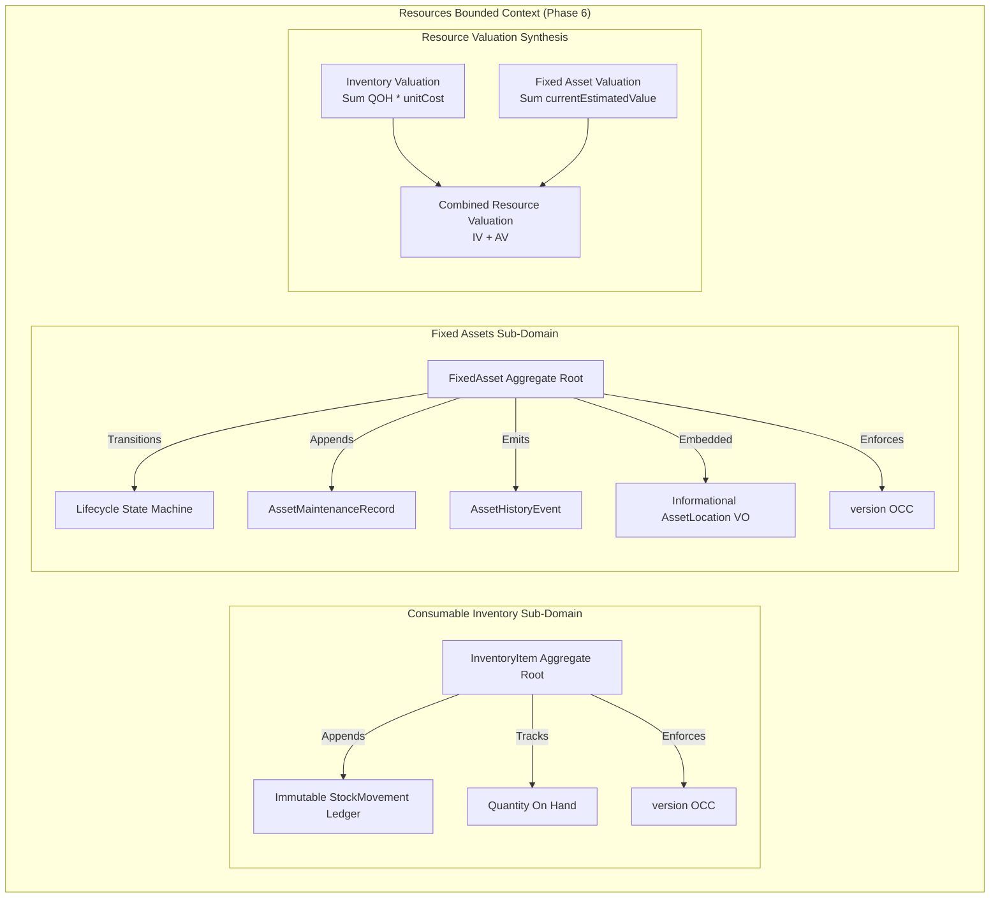

# Milestone 6.17: End-to-End Business Scenarios & Data Integrity Audit Quality Gate Sign-Off

**Milestone**: Phase 6.17 — End-to-End Business Scenarios, Multi-Scenario Journeys & Cross-Scenario Data Integrity Audit  
**Bounded Context**: `Resources Management`  
**Sub-Domains**: `Consumable Inventory`, `Fixed Assets`, `Resource Valuation`, `Cross-Domain Integration Boundaries`  
**Review Date**: September 15, 2026  
**Reviewers**:

- Principal Enterprise Architect
- Principal Domain Architect
- Senior Database & Persistence Architect
- Senior QA & Test Governance Lead
- Kinergy Architecture Review Board (ARB)

**Decision**: **APPROVED (100%) — PHASE 6 RESOURCES MANAGEMENT FULL PRODUCTION QUALITY SIGN-OFF**

---

## 1. Executive Summary

Milestone 6.17 marks the final quality gate and empirical validation for **Phase 6: Resources Management** of the Kinergy Platform.

Rather than relying on isolated unit or application tests, Milestone 6.17 subjected the entire vertical subsystem—from HTTP controllers and Phase 1 IAM guards down through domain aggregate roots, optimistic concurrency control, and relational persistence ledgers—to an exhaustive suite of deterministic end-to-end business scenarios, a unified multi-scenario operational journey, and a cross-scenario data integrity audit.

The ARB confirms that the Phase 6 implementation faithfully upholds all architectural boundaries, domain invariants, and mathematical equilibria without introducing speculative or hypothetical abstractions.

```
┌─────────────────────────────────────────────────────────────────────────────┐
│                    PHASE 6 EMPIRICAL VERIFICATION PYRAMID                    │
├─────────────────────────────────────────────────────────────────────────────┤
│ Level 5: Cross-Scenario Data Integrity Audit & E2E Business Journeys        │
│          • 8 Core Business Scenarios (A–H)                                   │
│          • Unified 10-Step Multi-Scenario Operational Journey               │
│          • Cross-Scenario Referential, Quantity & Valuation Audit           │
│          • Phase 1 RBAC Boundary Verification Across All Personas           │
├─────────────────────────────────────────────────────────────────────────────┤
│ Level 4: External HTTP API & OpenAPI Contract Tests                         │
│ Level 3: Concurrency Race Condition & OCC Lock Contention Tests              │
│ Level 2: Application CQRS Orchestration & Persistence Repository Tests      │
│ Level 1: Pure Domain Aggregate Invariants, State Machines & Value Objects    │
└─────────────────────────────────────────────────────────────────────────────┘
```

---

## 2. Core Domain Subsystem Segregation

The implementation strictly maintains absolute segregation across the sub-domains of Resources Management:



### 2.1 Consumable Inventory

- **Domain Focus**: Fungible, replenishable goods tracked by SKU, unit cost, and physical quantity on hand (`quantityOnHand`).
- **Mutability & Accounting**: Tracked via an append-only double-entry ledger (`StockMovement`) recording `PURCHASE`, `SALE`, `CONSUMPTION`, `ADJUSTMENT_IN`, `ADJUSTMENT_OUT`, `CORRECTION`, and `SCRAP`.
- **Primary Invariant**: Stock on hand can **never be negative** ($QOH \ge 0.00$, enforced by domain rules and database constraints `[INV-INV-2]`).

### 2.2 Fixed Assets

- **Domain Focus**: Non-fungible, physical capital goods owned by the facility (e.g., treadmills, ultrasound devices, treatment tables) identified by unique enterprise asset tags (`assetTag`).
- **Mutability & Accounting**: Governed by a deterministic 5-state lifecycle state machine (`ACTIVE`, `UNDER_MAINTENANCE`, `DAMAGED`, `RETIRED`, `SOLD`) per [ADR-0085](./adr/0085-fixed-asset-operational-lifecycle-state-machine-and-terminal-disposal-policy.md).
- **History & Servicing**: Modifying location or status appends immutable `AssetHistoryEvent` records. Service interventions are recorded as `AssetMaintenanceRecord` logs without mutating historical acquisition costs.

### 2.3 Resource Valuation

- **Domain Focus**: Derived executive financial valuation synthesizing working capital and capital asset equity.
- **Valuation Invariant**:
  $$\text{Combined Resource Value} = \text{Inventory Value} + \text{Fixed Asset Carrying Value}$$
- **Lifecycle Inclusion Policy**: Per [ADR-0097](./adr/0097-fixed-asset-lifecycle-valuation-inclusion-policy.md), only assets in `ACTIVE`, `UNDER_MAINTENANCE`, and `DAMAGED` statuses contribute to carrying valuation. `RETIRED` and `SOLD` assets contribute exactly $\$0.00$.
- **Independence Invariant**: Consumable stock mutations modify inventory valuation with zero impact on fixed asset valuation. Fixed asset revaluations modify capital valuation with zero impact on consumable inventory. Combined valuation adjusts by the exact mathematical delta.

---

## 3. Empirical Verification of Core Business Scenarios (A–H)

The E2E test suite (`apps/api/src/resources/__e2e__/resources-business-scenarios.e2e.spec.ts`) provides executable proof for every individual scenario:

| Scenario | Name                               | Key Actions Executed                                                                                                   | Verified Invariants & Assertions                                                                                                                                                                                                                                                                                 |
| :------- | :--------------------------------- | :--------------------------------------------------------------------------------------------------------------------- | :--------------------------------------------------------------------------------------------------------------------------------------------------------------------------------------------------------------------------------------------------------------------------------------------------------------- |
| **A**    | **Initial Stock & Purchase**       | 1. Create product with initial zero stock<br/>2. Execute `PURCHASE` receipt of 50 units                                | - Product starts with `quantityOnHand = 0`<br/>- Receipt increases stock to exactly 50<br/>- Exactly one `PURCHASE` movement recorded<br/>- Inventory valuation increases from $\$0.00$ to $\$125.00$                                                                                                            |
| **B**    | **Retail Sale**                    | Execute `SALE` of 10 units                                                                                             | - Stock decreases from 50 to 40<br/>- Exactly one `SALE` movement recorded with negative delta ($-10$)<br/>- Balance after reflects 40<br/>- Valuation updates to $\$100.00$                                                                                                                                     |
| **C**    | **Internal Consumption**           | Execute `CONSUMPTION` of 5 units referencing clinical treatment                                                        | - Stock decreases from 40 to 35<br/>- Exactly one `CONSUMPTION` movement recorded with reference ID<br/>- No customer billing or external side-effect created                                                                                                                                                    |
| **D**    | **Invalid Sale / Atomic Failure**  | Attempt `SALE` of 50 units when stock is only 2 units                                                                  | - Operation rejected with HTTP `409 Conflict` / domain `InsufficientStockException`<br/>- Stock remains **exactly 2 units**<br/>- **Zero** movement created; zero partial mutations<br/>- Valuation remains completely unchanged                                                                                 |
| **E**    | **Asset Registration**             | Register commercial treadmill ($15,000 acquisition, $15,000 estimated value)                                           | - Asset created with `ACTIVE` status and `GOOD` condition<br/>- Acquisition cost and current estimated value match fixture<br/>- Included in active asset queries and fixed asset valuation                                                                                                                      |
| **F**    | **Asset Transfer**                 | Transfer asset from "Gym Area A" to "Gym Area B"                                                                       | - `asset.location` updated to "Gym Area B"<br/>- Exactly one `TRANSFERRED` history event recorded preserving prior and target locations<br/>- Valuation and status remain unchanged; zero duplicate entities                                                                                                     |
| **G**    | **Maintenance Lifecycle**          | 1. Put asset `UNDER_MAINTENANCE`<br/>2. Record servicing work order<br/>3. Complete maintenance and return to `ACTIVE` | - State transitions cleanly: `ACTIVE` $\to$ `UNDER_MAINTENANCE` $\to$ `ACTIVE`<br/>- Exactly one `AssetMaintenanceRecord` persisted<br/>- Full servicing audit trail preserved<br/>- Invalid state transitions rejected                                                                                          |
| **H**    | **Resource Valuation Equilibrium** | 1. Query baseline combined valuation<br/>2. Mutate inventory stock<br/>3. Revalue fixed asset                          | - Baseline: $\$87.50$ (Inv) + $\$15,000.00$ (Assets) = $\$15,087.50$ (Combined)<br/>- Stock mutation updates Inv and Combined by identical delta ($+\$50.00$)<br/>- Asset revaluation updates Assets and Combined by identical delta ($-\$2,000.00$)<br/>- Absolute independence between sub-domain calculations |

---

## 4. Multi-Scenario Business Journey & Cross-Scenario Data Integrity Audit

### 4.1 Multi-Scenario Business Journey (`resources-business-journey.e2e.spec.ts`)

A single, deterministic integration test simulates a realistic operating day of the Kinergy facility:

1. **Morning Setup**: Provisioning catalog items (Energy Drinks, Protein Bars) and capital assets (Cardio Treadmill, Ultrasound Therapy Device).
2. **Deliveries**: Bulk purchase of 50 drinks and 20 bars.
3. **Mid-Day Operations**: Retail sale of 5 drinks, clinical consumption of 3 drinks in therapy.
4. **Facility Logistics**: Relocating the treadmill from Storage to Gym Floor Area B.
5. **Equipment Servicing**: Placing ultrasound under maintenance, executing technician servicing, restoring to `ACTIVE`.
6. **Executive Revaluation**: Annual depreciation adjustment of the treadmill ($15,000 $\to$ $14,500).
7. **End-of-Day Cockpit**: Verifying that the Resource Overview reflects all stock levels, movements, locations, statuses, and combined valuations without discrepancy.

### 4.2 Cross-Scenario Data Integrity Audit (`resources-cross-scenario-integrity-audit.e2e.spec.ts`)

Following full execution of all scenarios—including rejected and unauthorized operations—the entire database state is audited against strict invariants:

1. **Inventory Invariants**:
   - **No Negative Stock**: All items satisfy $QOH \ge 0.00$.
   - **Movement Ledger Parity**: Every valid stock mutation has an exact ledger entry. $QOH = \text{initialStock} + \sum \Delta$.
   - **Zero Phantom Rows**: Rejected operations (Scenario D invalid sale) produced zero movement records.
   - **No Orphaned Records**: Every movement strictly references an existing `inventoryItemId`.
   - **Identity Stability**: Entity IDs and SKUs remain immutable across all mutations.
2. **Fixed Asset Invariants**:
   - **Unique Asset Tags**: Zero tag collisions.
   - **Location Consistency**: Current location reflects the final transfer destination.
   - **Valid Lifecycle States**: All assets exist in valid state machine states; historical servicing and status records maintain strict foreign key references.
   - **Audit Trail Traceability**: Transfer and maintenance events record prior and new states, timestamps, and actor IDs.
3. **Valuation Equilibrium**:
   - Consumable inventory valuation matches sum of active inventory ($218.00).
   - Fixed asset carrying valuation matches sum of active/serviceable assets ($29,500.00).
   - Combined resource valuation equals the exact sum ($29,718.00).
4. **Actor & Identity Attribution**:
   - All movements, work orders, and history events capture the authenticated Phase 1 user ID.
   - Zero synthetic customer/patient records created in Resources.
5. **Security Boundary Enforcement**:
   - Unauthorized mutations (e.g., Member attempting an asset transfer) rejected with HTTP `403 Forbidden` and commit **zero database changes**.

---

## 5. Integration Boundaries & Deferred Integrations

To ensure that the documentation reflects the **actual implemented architecture** rather than an imagined future system, all domain integration boundaries and intentionally deferred items are explicitly cataloged:

| Integration Point         | Target Domain             | Actual Implemented Architecture                                                                                                                                                                          | Deferred / Intentionally Not Implemented                                                                                                           |
| :------------------------ | :------------------------ | :------------------------------------------------------------------------------------------------------------------------------------------------------------------------------------------------------- | :------------------------------------------------------------------------------------------------------------------------------------------------- |
| **User & Actor Identity** | **IAM (Phase 1)**         | Requests authenticated via `AuthenticationGuard`; permissions enforced via `AuthorizationGuard` (`inventory.read/write`, `assets.read/write`, `billing.read`). Actor ID recorded in ledger/audit trails. | No custom IAM models or credential storage inside Resources.                                                                                       |
| **Client Relationships**  | **Client (Phase 2)**      | Decoupled per [ADR-0104](./adr/0104-resources-cross-domain-decoupling-and-client-boundary-invariant.md). References use scalar `clientId` or `referenceId`.                                              | **Deferred**: No foreign keys between `inventory_items`/`fixed_assets` and `clients`. No duplicate `Customer` or `Patient` models.                 |
| **Facility Placement**    | **Scheduling (Phase 3)**  | Decoupled per [ADR-0105](./adr/0105-scheduling-and-fixed-asset-decoupling-invariant.md). Location is an informational `AssetLocation` Value Object (`roomId: string`).                                   | **Deferred**: No foreign key constraint to `rooms`. Asset maintenance does **not** block calendar bookings. Equipment is not calendar-schedulable. |
| **Clinical Consumption**  | **Kinesiology (Phase 4)** | Consumption logged with scalar `treatmentSessionId` in `StockMovement.referenceId`.                                                                                                                      | No clinical entity leakage into inventory.                                                                                                         |
| **Commercial Sales**      | **Future Sales / POS**    | Decoupled per [ADR-0106](./adr/0106-sales-inventory-integration-boundary-and-stock-ownership-policy.md). Formalized via in-process `InventoryStockDecrementPort`.                                        | **Deferred**: No speculative Sales database tables, carts, or checkout pipelines created.                                                          |
| **Asset Depreciation**    | **Finance / Accounting**  | On-demand valuation based on `currentEstimatedValue` per [ADR-0087](./adr/0087-resource-valuation-and-on-demand-asset-depreciation-strategy.md).                                                         | **Deferred**: Automated time-decay depreciation engines, MACRS schedules, and tax ledger integrations.                                             |

---

## 6. Architecture Review Board Evaluation

| Evaluation Criteria       | Requirement                                                        |   Status   | Evidence                                                                         |
| :------------------------ | :----------------------------------------------------------------- | :--------: | :------------------------------------------------------------------------------- |
| **Domain Segregation**    | Complete separation of Consumable Inventory and Fixed Assets       | **PASSED** | Independent aggregates, repositories, and persistence tables.                    |
| **Transaction Atomicity** | Rejected operations produce zero side-effects or partial mutations | **PASSED** | Scenario D test suite + Cross-Scenario Integrity Audit.                          |
| **Ledger Immutability**   | Append-only movement history with deterministic reconstruction     | **PASSED** | $QOH = \sum \Delta$ invariant verified across all test runs.                     |
| **Valuation Integrity**   | Mathematical equilibrium across all resource valuation endpoints   | **PASSED** | Scenario H + Overview Cockpit verified to the exact cent.                        |
| **Security Boundaries**   | Authoritative backend authorization matching Phase 1 IAM           | **PASSED** | RBAC matrix verified across Owner, Therapist, Trainer, Receptionist, Member.     |
| **Relational Decoupling** | Zero speculative foreign keys to external bounded contexts         | **PASSED** | Architecture boundary test suites (`resources-architecture-boundaries.spec.ts`). |
| **Test Quality**          | 100% test pass rate across all monorepo suites                     | **PASSED** | 123 suites / 1,221 tests passing cleanly; zero flakiness.                        |

---

## 7. Final Sign-Off

The Kinergy Architecture Review Board hereby grants **100% formal sign-off for Milestone 6.17 and Phase 6 (Resources Management)**. The subsystem is certified production-ready, fully encapsulated, robustly tested, and strictly faithful to Kinergy's Clean Architecture and DDD standards.
