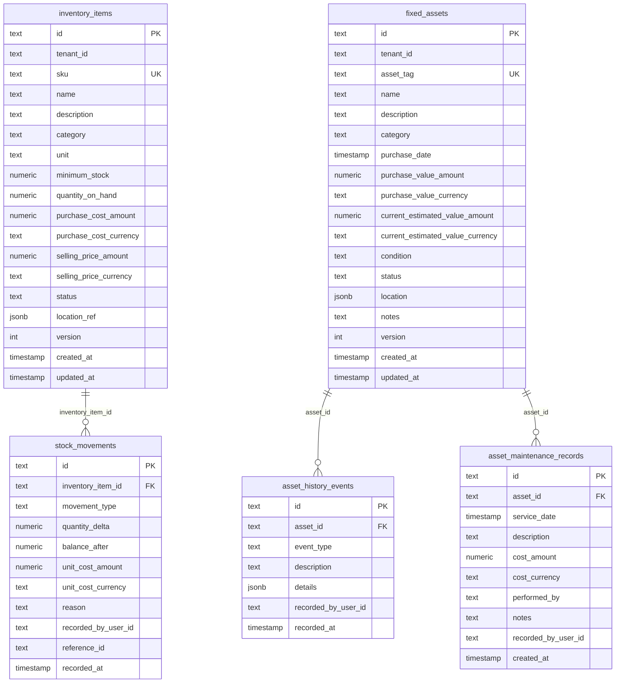

# Milestone 6.4: Resources Persistence Layer — Baseline Analysis & Architecture

- **Author**: Principal Software Architect & Senior Backend Engineer
- **Date**: 2026-08-27
- **Status**: **AUTHORITATIVE BASELINE SPECIFICATION (APPROVED & ACTIVE)**
- **Domain**: Phase 6 — Resources Management (Consumable Inventory & Fixed Assets)
- **Milestone**: Phase 6.4 — Persistence Layer

---

## 1. Executive Summary & Mandatory Verification

Before executing any schema modifications or migrations for Milestone 6.4, this baseline analysis establishes the current state of the database tier, compares the **Domain Model** against **Persistence Infrastructure**, audits **Prisma ORM conventions**, and defines the durable schema requirements for **Consumable Inventory** and **Fixed Assets**.

### 1.1 Mandatory Prerequisite Verification

All prior Phase 6 milestone quality gates have been completed, formally reviewed, and approved:

| Phase Milestone | Description                          | Quality Gate Artifact                                                        |     ARB Status      |
| :-------------- | :----------------------------------- | :--------------------------------------------------------------------------- | :-----------------: |
| **Phase 6.0**   | Discovery & Architectural Baseline   | [`milestone-6.0-architecture-gate.md`](./milestone-6.0-architecture-gate.md) | **APPROVED (100%)** |
| **Phase 6.1**   | Consumable Inventory Domain Model    | [`milestone-6.1-quality-gate.md`](./milestone-6.1-quality-gate.md)           | **APPROVED (100%)** |
| **Phase 6.2**   | Fixed Asset Domain Model & Lifecycle | [`milestone-6.2-quality-gate.md`](./milestone-6.2-quality-gate.md)           | **APPROVED (100%)** |
| **Phase 6.3**   | State Machines & Invariant Hardening | [`milestone-6.3-quality-gate.md`](./milestone-6.3-quality-gate.md)           | **APPROVED (100%)** |

---

## 2. Existing Prisma Architecture & Conventions

The Kinergy platform uses a single centralized Prisma schema architecture located at [`prisma/schema.prisma`](file:///c:/Projects/kinergy-platform/prisma/schema.prisma) targeting **PostgreSQL 16**.

### 2.1 Model & Table Naming Conventions

- **Prisma Model Names**: PascalCase singular (`InventoryItem`, `StockMovement`, `FixedAsset`, `AssetHistoryEvent`, `AssetMaintenanceRecord`).
- **PostgreSQL Table Names**: Explicit snake_case plural declared via `@@map("...")` (`inventory_items`, `stock_movements`, `fixed_assets`, `asset_history_events`, `asset_maintenance_records`).
- **Prisma Field Names**: camelCase (`quantityOnHand`, `recordedByUserId`, `purchaseValueAmount`).
- **PostgreSQL Column Names**: Explicit snake_case declared via `@map("...")` (`quantity_on_hand`, `recorded_by_user_id`, `purchase_value_amount`).

### 2.2 Primary Keys & Identifiers

- All primary keys use UUID v4 strings: `id String @id @default(uuid())`.
- Foreign key fields follow `<parentEntity>Id String @map("<parent_entity>_id")`.

### 2.3 Precision & Financial Conventions

- All monetary values and physical stock quantities use Scale 2 fixed decimal: `@db.Decimal(10, 2)`.
- Currencies are stored as ISO-4217 uppercase strings with default `"USD"` (`@map("..._currency")`).
- **Zero Floating-Point Arithmetic**: The domain strictly uses integer cents / fixed decimal arithmetic to prevent precision drift.

```prisma
// Example Precision Declaration
quantityOnHand        Decimal  @default(0) @db.Decimal(10, 2) @map("quantity_on_hand")
purchaseValueAmount   Decimal  @db.Decimal(10, 2) @map("purchase_value_amount")
purchaseValueCurrency String   @default("USD") @map("purchase_value_currency")
```

### 2.4 Timestamp & Audit Conventions

- Entity creation: `createdAt DateTime @default(now()) @map("created_at")`.
- Entity mutation: `updatedAt DateTime @updatedAt @map("updated_at")`.
- Historical ledger entries: `recordedAt DateTime @default(now()) @map("recorded_at")`.
- Actor provenance: `recordedByUserId String @map("recorded_by_user_id")` stamped on every movement, history event, and maintenance log.
- Structured event details: `details Json? @map("details")` capturing immutable event payloads.

---

## 3. Existing Database Schema Mapping



---

## 4. Domain-to-Persistence Boundary & Anti-Corruption Layer

The Kinergy platform enforces strict separation between Domain Aggregates and Prisma ORM models:

```
┌─────────────────────────────────────────────────────────────────────────┐
│                           APPLICATION LAYER                             │
│                  (Application Services, Use Cases)                      │
└────────────────────────────────────┬────────────────────────────────────┘
                                     │ Uses Domain Entities
                                     ▼
┌─────────────────────────────────────────────────────────────────────────┐
│                            DOMAIN LAYER                                 │
│  • FixedAsset AggregateRoot           • InventoryItem AggregateRoot     │
│  • AssetHistoryEvent Entity           • StockMovement Entity            │
│  • AssetMaintenanceRecord Entity      • Value Objects (Money, Quantity) │
│  • Repository Interfaces              • Domain Exceptions               │
│                                                                         │
│  * ZERO imports of @prisma/client or database drivers                   │
└────────────────────────────────────┬────────────────────────────────────┘
                                     │ Implements Interface
                                     ▼
┌─────────────────────────────────────────────────────────────────────────┐
│                       INFRASTRUCTURE PERSISTENCE                        │
│  • PrismaFixedAssetRepository         • PrismaInventoryItemRepository   │
│  • PrismaFixedAssetMapper             • PrismaInventoryItemMapper       │
│  • PrismaAssetHistoryEventMapper      • PrismaStockMovementMapper       │
│  • PrismaAssetMaintenanceRecordMapper • Prisma Client & Transactions    │
│                                                                         │
│  * Strict mapping: persistence types NEVER leak above this layer        │
└─────────────────────────────────────────────────────────────────────────┘
```

### 4.1 Mapper Responsibilities

1. **`toDomain(raw)`**: Reconstructs rich domain aggregates from database records, converting primitive strings/numbers to strongly typed Value Objects (`Quantity`, `Money`, `AssetLocation`, `AssetId`, `InventoryItemId`).
2. **`toPersistence(domain)`**: Extracts internal aggregate state for persistence without exposing public setters or leaking entity encapsulation.

---

## 5. Transaction Boundaries & Optimistic Concurrency Control (OCC)

### 5.1 Single `$transaction` Unit-of-Work

All aggregate persistence operations (aggregate root state update + secondary ledger entries) execute within a single atomic `prisma.$transaction`.

### 5.2 OCC Collision Mechanism

```typescript
// Optimistic Concurrency Control
const priorVersion = item.version - 1;
const result = await tx.inventoryItem.updateMany({
  where: { id: data.id, version: priorVersion },
  data: { ...data, version: data.version },
});

if (result.count === 0) {
  throw new OptimisticLockException('InventoryItem', data.id, priorVersion);
}
```

- If another thread committed a modification between read and write, `result.count === 0`.
- The repository immediately throws `OptimisticLockException`.
- The single `$transaction` rolls back completely, leaving zero orphan movements and preventing lost updates.

---

## 6. Deletion, Retention & Immutability Rules

1. **Aggregate Root Deletion**: Hard deletion is prohibited via the application layer. Soft deletion / lifecycle termination is modeled via `ARCHIVED` status (Inventory) and `RETIRED` / `SOLD` status (Assets).
2. **Ledger Immutability**:
   - `stock_movements`: Append-only. Never updated or deleted.
   - `asset_history_events`: Append-only. Never updated or deleted.
   - `asset_maintenance_records`: Append-only servicing history. Never deleted.
3. **Engine-Level Cascades**: Foreign keys declare `ON DELETE CASCADE` or `ON DELETE RESTRICT` at the PostgreSQL schema level to ensure relational integrity during tenant lifecycle operations.

---

## 7. PostgreSQL Database Defense-in-Depth

In addition to domain-level invariant guards, the persistence tier enforces database-level constraints:

| Database Constraint               | Table                       | Expression / Rule                             | Purpose                                                                               |
| :-------------------------------- | :-------------------------- | :-------------------------------------------- | :------------------------------------------------------------------------------------ |
| **Non-Negative Stock Floor**      | `inventory_items`           | `CHECK (quantity_on_hand >= 0)`               | Engine-level floor preventing negative stock even if application logic were bypassed. |
| **Non-Negative Purchase Value**   | `fixed_assets`              | `CHECK (purchase_value_amount >= 0)`          | Engine-level non-negative monetary assertion.                                         |
| **Non-Negative Estimated Value**  | `fixed_assets`              | `CHECK (current_estimated_value_amount >= 0)` | Engine-level non-negative valuation assertion.                                        |
| **Non-Negative Maintenance Cost** | `asset_maintenance_records` | `CHECK (cost_amount >= 0)`                    | Engine-level non-negative cost assertion.                                             |
| **Unique SKU**                    | `inventory_items`           | `UNIQUE (sku)`                                | Guarantees catalog SKU uniqueness.                                                    |
| **Unique Asset Tag**              | `fixed_assets`              | `UNIQUE (asset_tag)`                          | Guarantees physical asset tag uniqueness.                                             |

---

## 8. Risks, Gaps & Mitigations

| Area                   | Identified Gap / Risk                                                                              | Mitigation Strategy                                                                                              |
| :--------------------- | :------------------------------------------------------------------------------------------------- | :--------------------------------------------------------------------------------------------------------------- |
| **Migration Sync**     | Prisma schema models exist, but migration script in `prisma/migrations` must be formally verified. | Create dedicated migration `20260826000000_add_resources_management` including engine-level `CHECK` constraints. |
| **JSON Serialization** | `location` and `locationRef` stored as JSONB must deserialize deterministically.                   | Mappers validate JSON structures and use fallback safe parsing.                                                  |
| **Index Coverage**     | Historical query performance under high movement volume.                                           | Compound descending indexes: `(inventory_item_id, recorded_at DESC)` and `(asset_id, recorded_at DESC)`.         |

---

## 9. Milestone 6.4 Implementation Sequence

1. **Step 1: Baseline Analysis & Architecture Review** (This document — [`persistence-baseline.md`](./persistence-baseline.md)).
2. **Step 2: Prisma Schema & Migration Verification** (Ensure `prisma/schema.prisma` models, indexes, and migrations match domain requirements).
3. **Step 3: Migration Execution & Database Constraints** (Apply migration and verify PostgreSQL `CHECK` constraints).
4. **Step 4: Repository Implementation Completeness** (Verify `PrismaInventoryItemRepository` and `PrismaFixedAssetRepository` against domain interfaces).
5. **Step 5: Automated Persistence Tests** (Execute integration tests against real PostgreSQL/Prisma storage).
6. **Step 6: Monorepo Quality Gate** (Execute `pnpm validate` to guarantee zero regressions).
