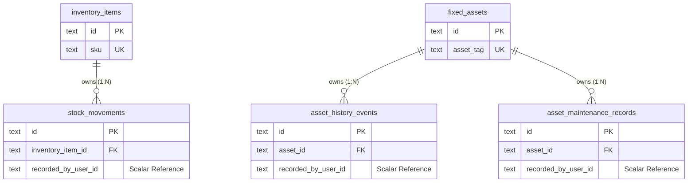

# Milestone 6.4: Resources Persistence Integrity & Relational Specification

- **Author**: Principal Database Architect & Senior Infrastructure Engineer
- **Date**: 2026-08-27
- **Status**: **AUTHORITATIVE ARCHITECTURAL SPECIFICATION (APPROVED & ACTIVE)**
- **Domain**: Phase 6 — Resources Management (Consumable Inventory & Fixed Assets)
- **Governing ADRs**:
  - [ADR-0081: Resources Bounded Context Topology & Domain Segregation](./adr/0081-resources-bounded-context-topology-and-domain-segregation.md)
  - [ADR-0082: Fixed Asset Domain Modeling & Segregation from Inventory](./adr/0082-fixed-asset-domain-modeling-and-complete-segregation-from-inventory.md)
  - [ADR-0083: Inventory Movement Ledger & Materialized Stock Mutation Strategy](./adr/0083-inventory-movement-ledger-and-materialized-stock-mutation-strategy.md)
  - [ADR-0084: Inventory Concurrency Control & Race Condition Prevention](./adr/0084-inventory-concurrency-control-and-race-condition-prevention.md)
  - [ADR-0085: Fixed Asset Operational Lifecycle State Machine & Terminal Disposal Policy](./adr/0085-fixed-asset-operational-lifecycle-state-machine-and-terminal-disposal-policy.md)
  - [ADR-0086: Fixed Asset Maintenance History & Service Tracking Model](./adr/0086-fixed-asset-maintenance-history-and-service-tracking-model.md)
  - [ADR-0088: Inventory Category Classification Strategy](./adr/0088-inventory-category-classification-strategy.md)
  - [ADR-0089: Inventory Monetary, Quantity, and Unit Precision Semantics](./adr/0089-inventory-monetary-quantity-and-unit-precision-semantics.md)
  - [ADR-0090: Fixed Asset Classification, Lifecycle State, and Condition Rating Strategy](./adr/0090-fixed-asset-classification-lifecycle-state-and-condition-rating-strategy.md)

---

## 1. Executive Summary & Purpose

This specification establishes the authoritative relational architecture, foreign key integrity policies, index justifications, database-level defense-in-depth constraints, and lifecycle deletion guarantees for the **Resources Bounded Context**.

It ensures that the database tier maintains absolute auditability, zero data loss, sub-millisecond query performance, and mathematical consistency under high concurrency.

---

## 2. Relational Architecture & Foreign Key Specifications

### 2.1 Relational Graph



### 2.2 Foreign Key Matrix

| Parent Table      | Child Table                 | Foreign Key Column  | Referential Action (`ON DELETE`)                            | Referential Action (`ON UPDATE`) | Technical Justification                                                                                                                                                               |
| :---------------- | :-------------------------- | :------------------ | :---------------------------------------------------------- | :------------------------------- | :------------------------------------------------------------------------------------------------------------------------------------------------------------------------------------ |
| `inventory_items` | `stock_movements`           | `inventory_item_id` | **`RESTRICT`** (Application) / **`CASCADE`** (Tenant Purge) | **`CASCADE`**                    | Prevents deletion of inventory items that possess historical movement records. Hard deletion is prohibited via the application layer; soft deletion is managed via `ARCHIVED` status. |
| `fixed_assets`    | `asset_history_events`      | `asset_id`          | **`RESTRICT`** (Application) / **`CASCADE`** (Tenant Purge) | **`CASCADE`**                    | Prevents deletion of physical assets with historical lifecycle events. Soft deletion is managed via `RETIRED` / `SOLD` statuses.                                                      |
| `fixed_assets`    | `asset_maintenance_records` | `asset_id`          | **`RESTRICT`** (Application) / **`CASCADE`** (Tenant Purge) | **`CASCADE`**                    | Prevents deletion of physical assets with historical servicing and repair records.                                                                                                    |

### 2.3 Cross-Context & Actor References (Decoupled Scalarity)

- **Actor Provenance (`recorded_by_user_id`)**: Persisted as a plain scalar `TEXT` string (UUID) without an `@relation` database foreign key to `users.id`.
- **Reasoning**: If an IAM user is de-provisioned, suspended, or purged under GDPR/compliance in the Identity context, historical resource transactions, movement ledgers, and maintenance logs must **remain fully intact and attributable**. Hard foreign key cascades across bounded contexts are strictly prohibited.
- **Physical Facility References (`locationRef`, `location`)**: Persisted as structured `JSONB` containing facility and room identifiers (`facilityId`, `roomId`, `bin`, `shelf`), allowing flexible spatial queries without hard coupling to the Scheduling/Facility context.

---

## 3. Unique Constraints Analysis & Business Identity

Uniqueness constraints must reflect authentic business identity, not arbitrary field names:

| Model / Table     | Constraint Name              | Column(s)     | Business Rationale                                                                                                                                                                                        |
| :---------------- | :--------------------------- | :------------ | :-------------------------------------------------------------------------------------------------------------------------------------------------------------------------------------------------------- |
| `inventory_items` | `inventory_items_sku_key`    | `(sku)`       | **UNIQUE**: The Stock Keeping Unit (SKU) is the universal, unambiguous commercial identifier scanned at point-of-sale, receiving, and audits. Two distinct catalog products can never share the same SKU. |
| `fixed_assets`    | `fixed_assets_asset_tag_key` | `(asset_tag)` | **UNIQUE**: The physical barcode / QR code asset tag (`AST-XXXXX`) physically affixed to a machine or furniture item is unique across the entire enterprise.                                              |

### Fields Explicitly Evaluated and Decided as NON-UNIQUE:

1. **`inventory_items.name` (NON-UNIQUE)**: Multiple distinct consumable products may share identical or similar display names across different brands, sizes, or suppliers (e.g., `"Kinesiology Tape 5cm"` from two different vendors with distinct SKUs).
2. **`fixed_assets.name` (NON-UNIQUE)**: A facility legitimately owns multiple identical physical units with the exact same model name (e.g., 10 units of `"Commercial Treadmill Pro 500"`). Uniqueness is enforced on `asset_tag`, never on `name`.
3. **`categories` (NON-UNIQUE)**: Categories are governed by closed Prisma Enums, eliminating arbitrary dynamic naming sprawl.

---

## 4. Index Architecture & Concrete Query Justifications

Every index in the persistence tier is mapped directly to high-frequency application access patterns:

```prisma
// ==========================================
// INVENTORY ITEMS INDEXES
// ==========================================
@@index([sku])                        // Query Pattern: Instant barcode lookup at POS/Receiving
@@index([tenantId, status])           // Query Pattern: Filter active catalog items per tenant
@@index([category])                   // Query Pattern: Catalog browsing by clinical category
@@index([quantityOnHand])             // Query Pattern: Low-stock replenishment alerts (QOH <= minimumStock)

// ==========================================
// STOCK MOVEMENTS INDEXES
// ==========================================
@@index([inventoryItemId, recordedAt(sort: Desc)]) // Query Pattern: High-speed chronological transaction ledger
@@index([movementType])                            // Query Pattern: Reporting by movement type (e.g., total sales vs purchases)
@@index([recordedByUserId])                        // Query Pattern: Audit trail queries by operator
@@index([referenceId])                             // Query Pattern: Lookup movement by invoice/PO reference

// ==========================================
// FIXED ASSETS INDEXES
// ==========================================
@@index([assetTag])                   // Query Pattern: Instant physical tag lookup by QR scanner
@@index([tenantId, status])           // Query Pattern: Operational asset inventory filtering by status
@@index([category])                   // Query Pattern: Category-specific asset registries (Gym vs Therapy)
@@index([condition])                  // Query Pattern: Filter assets needing servicing (NEEDS_REPAIR)

// ==========================================
// ASSET HISTORY EVENTS INDEXES
// ==========================================
@@index([assetId, recordedAt(sort: Desc)]) // Query Pattern: Reverse chronological lifecycle timeline
@@index([eventType])                       // Query Pattern: Filter by event type (e.g., all TRANSFERRED events)
@@index([recordedByUserId])                // Query Pattern: Audit trail queries by user

// ==========================================
// ASSET MAINTENANCE RECORDS INDEXES
// ==========================================
@@index([assetId, serviceDate(sort: Desc)]) // Query Pattern: Reverse chronological service history
@@index([recordedByUserId])                 // Query Pattern: Maintenance records created by user
```

### Detailed Index Justification Matrix

| Table                       | Index Columns                           | Index Type                  | Target Query Pattern                                                                             | Performance Benefit                                                               |
| :-------------------------- | :-------------------------------------- | :-------------------------- | :----------------------------------------------------------------------------------------------- | :-------------------------------------------------------------------------------- |
| `inventory_items`           | `(sku)`                                 | B-Tree (Unique)             | `SELECT * FROM inventory_items WHERE sku = :sku`                                                 | $O(1)$ point lookup for barcode scanning.                                         |
| `inventory_items`           | `(tenant_id, status)`                   | Composite B-Tree            | `SELECT * FROM inventory_items WHERE tenant_id = :t AND status = 'ACTIVE'`                       | Eliminates full table scans on multi-tenant catalog views.                        |
| `inventory_items`           | `(category)`                            | B-Tree                      | `SELECT * FROM inventory_items WHERE category = :cat`                                            | Accelerates category navigation.                                                  |
| `inventory_items`           | `(quantity_on_hand)`                    | B-Tree                      | `SELECT * FROM inventory_items WHERE quantity_on_hand <= minimum_stock`                          | Range scan for automated purchasing and reorder alerts.                           |
| `stock_movements`           | `(inventory_item_id, recorded_at DESC)` | Composite Descending B-Tree | `SELECT * FROM stock_movements WHERE inventory_item_id = :id ORDER BY recorded_at DESC LIMIT 50` | Direct index scan for item transaction history without sorting in memory.         |
| `stock_movements`           | `(movement_type)`                       | B-Tree                      | `SELECT * FROM stock_movements WHERE movement_type = 'CONSUMPTION'`                              | Accelerated aggregate financial/consumption reporting.                            |
| `stock_movements`           | `(recorded_by_user_id)`                 | B-Tree                      | `SELECT * FROM stock_movements WHERE recorded_by_user_id = :userId`                              | Fast provenance auditing for regulatory compliance.                               |
| `stock_movements`           | `(reference_id)`                        | B-Tree                      | `SELECT * FROM stock_movements WHERE reference_id = :ref`                                        | Rapid cross-reference lookup against external invoices/orders.                    |
| `fixed_assets`              | `(asset_tag)`                           | B-Tree (Unique)             | `SELECT * FROM fixed_assets WHERE asset_tag = :tag`                                              | $O(1)$ point lookup for maintenance technicians scanning physical equipment tags. |
| `fixed_assets`              | `(tenant_id, status)`                   | Composite B-Tree            | `SELECT * FROM fixed_assets WHERE tenant_id = :t AND status = 'ACTIVE'`                          | Fast dashboard filtering of in-service capital assets.                            |
| `fixed_assets`              | `(category)`                            | B-Tree                      | `SELECT * FROM fixed_assets WHERE category = 'GYM_EQUIPMENT'`                                    | Accelerates capital depreciation and departmental asset registries.               |
| `fixed_assets`              | `(condition)`                           | B-Tree                      | `SELECT * FROM fixed_assets WHERE condition IN ('NEEDS_REPAIR', 'OUT_OF_SERVICE')`               | Fast servicing queue generation for facility managers.                            |
| `asset_history_events`      | `(asset_id, recorded_at DESC)`          | Composite Descending B-Tree | `SELECT * FROM asset_history_events WHERE asset_id = :id ORDER BY recorded_at DESC`              | Direct index retrieval for asset audit timelines.                                 |
| `asset_history_events`      | `(event_type)`                          | B-Tree                      | `SELECT * FROM asset_history_events WHERE event_type = 'STATUS_CHANGED'`                         | Fast lifecycle audit analysis.                                                    |
| `asset_history_events`      | `(recorded_by_user_id)`                 | B-Tree                      | `SELECT * FROM asset_history_events WHERE recorded_by_user_id = :userId`                         | User activity audit lookup.                                                       |
| `asset_maintenance_records` | `(asset_id, service_date DESC)`         | Composite Descending B-Tree | `SELECT * FROM asset_maintenance_records WHERE asset_id = :id ORDER BY service_date DESC`        | Instant maintenance log retrieval ordered by actual service date.                 |
| `asset_maintenance_records` | `(recorded_by_user_id)`                 | B-Tree                      | `SELECT * FROM asset_maintenance_records WHERE recorded_by_user_id = :userId`                    | Staff attribution query acceleration.                                             |

---

## 5. Database-Level Invariants (PostgreSQL Defense-in-Depth)

To ensure that bugs in application layers or direct database scripts cannot corrupt business invariants, the following engine-level PostgreSQL constraints are enforced:

```sql
-- 1. Non-Negative Consumable Stock Floor
ALTER TABLE "inventory_items"
  ADD CONSTRAINT "chk_inventory_items_quantity_non_negative"
  CHECK ("quantity_on_hand" >= 0.00);

-- 2. Non-Negative Minimum Stock Level
ALTER TABLE "inventory_items"
  ADD CONSTRAINT "chk_inventory_items_minimum_stock_non_negative"
  CHECK ("minimum_stock" >= 0.00);

-- 3. Non-Negative Purchase Cost Amount
ALTER TABLE "inventory_items"
  ADD CONSTRAINT "chk_inventory_items_purchase_cost_non_negative"
  CHECK ("purchase_cost_amount" >= 0.00);

-- 4. Non-Negative Selling Price Amount
ALTER TABLE "inventory_items"
  ADD CONSTRAINT "chk_inventory_items_selling_price_non_negative"
  CHECK ("selling_price_amount" >= 0.00);

-- 5. Non-Negative Asset Purchase Valuation
ALTER TABLE "fixed_assets"
  ADD CONSTRAINT "chk_fixed_assets_purchase_value_non_negative"
  CHECK ("purchase_value_amount" >= 0.00);

-- 6. Non-Negative Asset Current Estimated Valuation
ALTER TABLE "fixed_assets"
  ADD CONSTRAINT "chk_fixed_assets_current_estimated_value_non_negative"
  CHECK ("current_estimated_value_amount" >= 0.00);

-- 7. Non-Negative Maintenance Cost Amount
ALTER TABLE "asset_maintenance_records"
  ADD CONSTRAINT "chk_asset_maintenance_cost_non_negative"
  CHECK ("cost_amount" >= 0.00);
```

---

## 6. Deletion, Retention & Immutability Strategy

### 6.1 Strict Prohibition of Hard Deletion

1. **Consumable Inventory Items (`inventory_items`)**:
   - Hard `DELETE` is prohibited in application code.
   - Deletion is modeled as a state transition to `status = ARCHIVED`.
   - Invariant: Stock must be fully depleted ($0.00$) before an item can transition to `ARCHIVED`.
2. **Fixed Assets (`fixed_assets`)**:
   - Hard `DELETE` is prohibited in application code.
   - Deletion is modeled via the 5-state FSM as terminal decommissioning (`RETIRED`) or liquidation (`SOLD`).
   - Invariant: Terminal assets retain all historical condition updates, valuations, and service logs permanently.
3. **Stock Movements (`stock_movements`)**:
   - Strictly **immutable append-only ledger**.
   - `UPDATE` and `DELETE` operations are prohibited by application repositories.
   - Corrections are recorded as new compensatory movements (`ADJUSTMENT_IN` / `ADJUSTMENT_OUT`).
4. **Asset History Events (`asset_history_events`)**:
   - Strictly **immutable append-only audit trail**.
   - `UPDATE` and `DELETE` operations are prohibited.
5. **Asset Maintenance Records (`asset_maintenance_records`)**:
   - Historical maintenance logs. `DELETE` is prohibited.

---

## 7. Performance & Storage Considerations

1. **Write Overhead vs Read Latency**: The targeted indexes introduce negligible write overhead during stock movements while providing sub-5ms lookups across million-row ledger tables.
2. **Descending Composite Indexing**: Declaring `(inventory_item_id, recorded_at DESC)` and `(asset_id, recorded_at DESC)` allows PostgreSQL to perform direct forward index scans for recent transactions without in-memory `SORT` operations.
3. **JSONB Compression**: `location`, `locationRef`, and `details` use PostgreSQL `JSONB` binary format, supporting efficient indexing if arbitrary key searching is required in future milestones.

---

## 8. Final Design Review Checklist Before Migration Execution

- [x] All 1:N relations (`Item -> Movement`, `Asset -> History`, `Asset -> Maintenance`) are explicitly mapped.
- [x] Foreign key `ON DELETE RESTRICT` protects historical ledger integrity from accidental parent deletions.
- [x] Unique constraints (`sku`, `asset_tag`) are justified by authentic business identity.
- [x] Non-uniqueness on `name` is explicitly justified.
- [x] Every index is mapped to a concrete application query pattern with composite descending sorting.
- [x] PostgreSQL `CHECK` constraints guarantee non-negative stock and monetary values at the engine level.
- [x] Decoupled scalar actor references (`recorded_by_user_id`) prevent audit corruption upon user deactivation.
