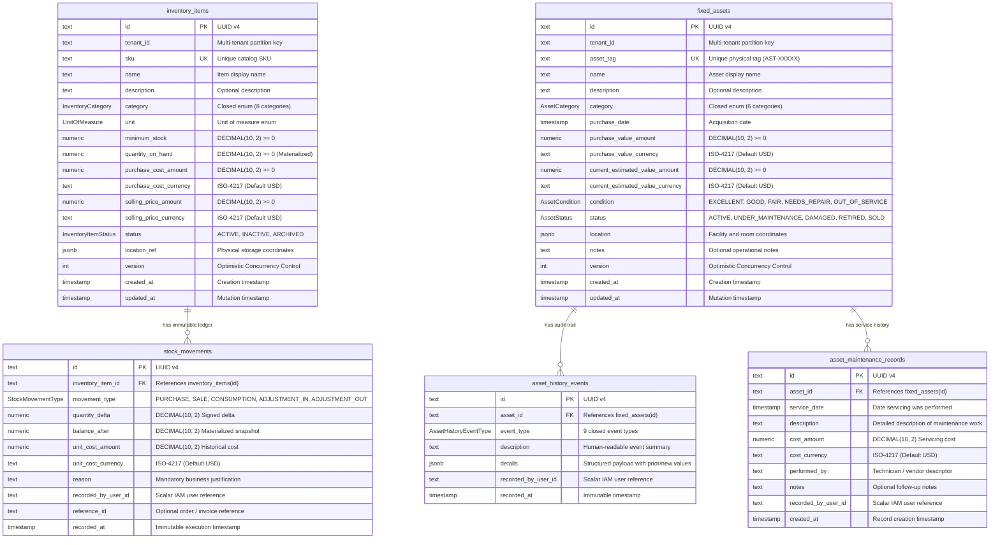

# Milestone 6.4: Resources Persistence Model Specification

- **Author**: Principal Domain Architect & Senior Database Architect
- **Date**: 2026-08-27
- **Status**: **AUTHORITATIVE DESIGN SPECIFICATION (APPROVED & ACTIVE)**
- **Domain**: Phase 6 — Resources Management (Consumable Inventory & Fixed Assets)
- **Governing ADRs**:
  - [ADR-0081: Resources Bounded Context Topology & Domain Segregation](./adr/0081-resources-bounded-context-topology-and-domain-segregation.md)
  - [ADR-0082: Fixed Asset Domain Modeling & Segregation from Inventory](./adr/0082-fixed-asset-domain-modeling-and-complete-segregation-from-inventory.md)
  - [ADR-0083: Inventory Movement Ledger & Materialized Stock Mutation Strategy](./adr/0083-inventory-movement-ledger-and-materialized-stock-mutation-strategy.md)
  - [ADR-0084: Inventory Concurrency Control & Race Condition Prevention](./adr/0084-inventory-concurrency-control-and-race-condition-prevention.md)
  - [ADR-0085: Fixed Asset Operational Lifecycle State Machine & Terminal Disposal Policy](./adr/0085-fixed-asset-operational-lifecycle-state-machine-and-terminal-disposal-policy.md)
  - [ADR-0086: Fixed Asset Maintenance History & Service Tracking Model](./adr/0086-fixed-asset-maintenance-history-and-service-tracking-model.md)
  - [ADR-0088: Inventory Category Classification Strategy](./adr/0088-inventory-category-classification-strategy.md)
  - [ADR-0089: Inventory Monetary, Quantity, and Unit Precision Semantics](./adr/0089-inventory-monetary-quantity-and-unit-precision-semantics.md)
  - [ADR-0090: Fixed Asset Classification, Lifecycle State, and Condition Rating Strategy](./adr/0090-fixed-asset-classification-lifecycle-state-and-condition-rating-strategy.md)

---

## 1. Executive Summary & Design Principles

This specification defines the authoritative database persistence model for the **Resources Bounded Context**, translating the pure Domain Model into a high-performance, transactionally safe PostgreSQL + Prisma relational schema.

### Core Architectural Axioms

1. **Strict Aggregate Segregation**: Fixed Assets and Consumable Inventory are distinct business domains with discrete tables, schemas, and life cycles ([ADR-0082](./adr/0082-fixed-asset-domain-modeling-and-complete-segregation-from-inventory.md)).
2. **Double-Entry Historical Permanence**: Inventory stock and Asset state mutations generate immutable, append-only ledger entries that preserve full historical context even if parent catalog details change.
3. **Decoupled Actor & Cross-Context Provenance**: User identities (`recordedByUserId`) and room references (`roomId`) are stored as scalar strings without database-level `@relation` foreign key cascades to external bounded contexts.
4. **Scale 2 Fixed Decimal Precision**: All monetary values and inventory stock quantities are persisted as `@db.Decimal(10, 2)` (Scale 2 fixed point).
5. **Database Defense-in-Depth**: Engine-level PostgreSQL `CHECK` constraints prevent negative stock and invalid monetary figures regardless of application execution path.

---

## 2. Domain to Persistence Mapping Matrix

| Domain Concept               | Domain Type     | Persistence Representation            | PostgreSQL Table / Column                                | Technical Rationale                                                                                                                 |
| :--------------------------- | :-------------- | :------------------------------------ | :------------------------------------------------------- | :---------------------------------------------------------------------------------------------------------------------------------- |
| **`InventoryItem`**          | Aggregate Root  | Prisma Model `InventoryItem`          | Table `inventory_items`                                  | Central consumable catalog entity with materialized stock balance.                                                                  |
| **`InventoryItemId`**        | Value Object    | `String` (UUID v4)                    | Column `id` (PK)                                         | Uniform UUID primary key matching platform standard.                                                                                |
| **`SKU`**                    | Value Object    | `String`                              | Column `sku` (UNIQUE)                                    | Strict unique business identifier for barcode / inventory lookup.                                                                   |
| **`Quantity`**               | Value Object    | `Decimal` (`Decimal(10, 2)`)          | Column `quantity_on_hand`                                | Scale 2 fixed point preventing float rounding drift; non-negative.                                                                  |
| **`MinimumStock`**           | Value Object    | `Decimal` (`Decimal(10, 2)`)          | Column `minimum_stock`                                   | Threshold for reorder / low-stock alert triggers.                                                                                   |
| **`Money` (Purchase Cost)**  | Value Object    | `Decimal` + `String`                  | Columns `purchase_cost_amount`, `purchase_cost_currency` | Currency and Scale 2 decimal stored together for financial integrity.                                                               |
| **`Money` (Selling Price)**  | Value Object    | `Decimal` + `String`                  | Columns `selling_price_amount`, `selling_price_currency` | Retail POS pricing stored in fixed decimal USD.                                                                                     |
| **`InventoryCategory`**      | Domain Registry | Prisma Enum `InventoryCategory`       | Column `category`                                        | Closed taxonomy enforced at DB level ([ADR-0088](./adr/0088-inventory-category-classification-strategy.md)).                        |
| **`UnitOfMeasure`**          | Domain Enum     | Prisma Enum `UnitOfMeasure`           | Column `unit`                                            | Standard packaging units (`UNITS`, `BOXES`, `BOTTLES`, etc.).                                                                       |
| **`InventoryItemStatus`**    | Domain Enum     | Prisma Enum `InventoryItemStatus`     | Column `status`                                          | Lifecycle status (`ACTIVE`, `INACTIVE`, `ARCHIVED`).                                                                                |
| **`LocationRef`**            | Value Object    | `Json?`                               | Column `location_ref` (JSONB)                            | Flexible location coordinates (`bin`, `shelf`, `facilityId`).                                                                       |
| **`StockMovement`**          | Child Entity    | Prisma Model `StockMovement`          | Table `stock_movements`                                  | Append-only transaction ledger; immutable.                                                                                          |
| **`StockMovementType`**      | Domain Enum     | Prisma Enum `StockMovementType`       | Column `movement_type`                                   | Closed movement types (`PURCHASE`, `SALE`, `CONSUMPTION`, `ADJUSTMENT_IN`, `ADJUSTMENT_OUT`).                                       |
| **`FixedAsset`**             | Aggregate Root  | Prisma Model `FixedAsset`             | Table `fixed_assets`                                     | Non-fungible capital asset entity.                                                                                                  |
| **`AssetId`**                | Value Object    | `String` (UUID v4)                    | Column `id` (PK)                                         | Standard UUID primary key.                                                                                                          |
| **`AssetTag`**               | Value Object    | `String`                              | Column `asset_tag` (UNIQUE)                              | Unique enterprise asset barcode / QR identifier (`AST-XXXXX`).                                                                      |
| **`AssetCategory`**          | Domain Registry | Prisma Enum `AssetCategory`           | Column `category`                                        | Closed capital asset taxonomy ([ADR-0090](./adr/0090-fixed-asset-classification-lifecycle-state-and-condition-rating-strategy.md)). |
| **`AssetStatus`**            | Domain FSM      | Prisma Enum `AssetStatus`             | Column `status`                                          | 5-state operational lifecycle state machine.                                                                                        |
| **`AssetCondition`**         | Domain Registry | Prisma Enum `AssetCondition`          | Column `condition`                                       | Physical serviceability rating (`EXCELLENT` $\rightarrow$ `OUT_OF_SERVICE`).                                                        |
| **`AssetLocation`**          | Value Object    | `Json`                                | Column `location` (JSONB)                                | Structured facility, room, and shelf coordinates.                                                                                   |
| **`AssetHistoryEvent`**      | Child Entity    | Prisma Model `AssetHistoryEvent`      | Table `asset_history_events`                             | Append-only operational audit trail; immutable.                                                                                     |
| **`AssetHistoryEventType`**  | Domain Enum     | Prisma Enum `AssetHistoryEventType`   | Column `event_type`                                      | 9 closed lifecycle event types.                                                                                                     |
| **`AssetMaintenanceRecord`** | Child Entity    | Prisma Model `AssetMaintenanceRecord` | Table `asset_maintenance_records`                        | Historical servicing, inspection, and repair logs.                                                                                  |

---

## 3. Relational Topology & Conceptual Data Model



---

## 4. Category Classification Strategy Analysis

### 4.1 Evaluation of Options

We evaluated three approaches for category management in the Resources context:

| Strategy                                                               | Advantages                                                                                                                                              | Disadvantages                                                                                                                 |   Decision   |
| :--------------------------------------------------------------------- | :------------------------------------------------------------------------------------------------------------------------------------------------------ | :---------------------------------------------------------------------------------------------------------------------------- | :----------: |
| **Option A: Dynamic Database Table (`categories`)**                    | Dynamic admin category creation without code deployments.                                                                                               | High relational overhead, loss of compile-time type safety, complex domain business rules, risk of arbitrary category sprawl. | **REJECTED** |
| **Option B: String Primitive with Free Text**                          | Zero schema constraints.                                                                                                                                | High risk of typos, zero consistency, impossible to enforce category-specific workflows.                                      | **REJECTED** |
| **Option C: Prisma Enum + Domain Code Registry (ADR-0088 & ADR-0090)** | Compile-time type safety, database-level validation, zero DB joins, rich domain metadata maps (`requiresMaintenance`, `defaultInspectionIntervalDays`). | Category changes require code release (intended design for strict healthcare/fitness operations).                             | **APPROVED** |

### 4.2 Authoritative Category Registries

- **Consumable Inventory Categories** (8 Canonical): `HEALTHY_MEALS`, `HEALTHY_DRINKS`, `CLEANING_SUPPLIES`, `OFFICE_SUPPLIES`, `SUPPLEMENTS`, `CLINICAL_SUPPLIES`, `THERAPY_CONSUMABLES`, `RETAIL_PRODUCTS`.
- **Fixed Asset Categories** (6 Canonical): `GYM_EQUIPMENT`, `THERAPY_EQUIPMENT`, `KITCHEN_EQUIPMENT`, `OFFICE_FURNITURE`, `ELECTRONICS`, `CLEANING_EQUIPMENT`.

---

## 5. Historical Ledger & Immutability Specification

### 5.1 Consumable Inventory Movement Ledger (`stock_movements`)

To ensure that historical inventory stock calculations can be independently verified and audited years after catalog changes:

1. **Self-Contained Snapshotting**: Each movement persists both the signed delta (`quantity_delta`) and the resulting stock snapshot (`balance_after`).
2. **Double-Entry Reconciliation Formula**:
   $$\text{balance\_after} = \text{balance\_before} + \text{quantity\_delta}$$
3. **No In-Place Updates**: Movement records are strictly **append-only**. `UPDATE` and `DELETE` queries on `stock_movements` are prohibited by application architecture.
4. **Correction Mechanism**: Physical count discrepancies or inventory adjustments are recorded as new compensating movements (`ADJUSTMENT_IN` or `ADJUSTMENT_OUT`) with explicit business justification.

### 5.2 Fixed Asset Lifecycle History (`asset_history_events`)

The history trail must remain fully understandable even after asset attributes change:

1. **Structured Event Payloads**: The `details` JSONB column captures structured diffs:
   - Status change: `{ "priorStatus": "ACTIVE", "newStatus": "UNDER_MAINTENANCE", "reason": "Calibration" }`
   - Valuation update: `{ "priorEstimatedValue": { "amount": 15000, "currency": "USD" }, "newValue": { "amount": 12000, "currency": "USD" } }`
   - Location transfer: `{ "from": "fac_main/room_101", "to": "fac_main/room_rehab" }`
2. **Append-Only Guarantee**: `AssetHistoryEvent` instances are frozen upon instantiation (`Object.freeze(this)`) and persisted via `createMany` without update interfaces.

---

## 6. Deletion, Purging & Foreign Key Lifecycle Analysis

### 6.1 What Happens When a Product is Removed?

- **Business Behavior**: Products are **soft-deleted** by setting `status = ARCHIVED`. Active stock must be depleted ($0.00$) prior to archiving.
- **Database FK Behavior**: `stock_movements.inventory_item_id` declares `ON DELETE RESTRICT` for application-level safety, or `ON DELETE CASCADE` at the engine level strictly for complete tenant de-provisioning.
- **Audit Preservation**: Historical movements are never purged during normal business operations.

### 6.2 What Happens When an Asset is Retired or Sold?

- **Business Behavior**: Assets transition to terminal FSM states (`RETIRED` or `SOLD`). Hard deletion is blocked.
- **Database FK Behavior**: `asset_history_events` and `asset_maintenance_records` remain permanently attached to the asset record.
- **Audit Preservation**: Decommissioned assets retain their complete servicing and transfer history for financial compliance, tax audits, and warranty traceability.

### 6.3 What Happens When a User / Actor is Deactivated or Deleted?

- **Decoupled Scalar Reference**: `recorded_by_user_id` is stored as a plain `TEXT` string (UUID) without an explicit relational `@relation` foreign key constraint to `users.id`.
- **Zero Orphan Cascades**: Deleting or archiving an IAM user in the identity context does **NOT** cascade or invalidate historical resource movements, history logs, or maintenance records. The user's ID remains permanently stamped on the ledger.

---

## 7. Indexing, Performance & Constraint Architecture

### 7.1 Indexing Strategy

To ensure sub-millisecond query performance under enterprise scale:

| Table                       | Index Columns                           | Index Purpose                                                        |
| :-------------------------- | :-------------------------------------- | :------------------------------------------------------------------- |
| `inventory_items`           | `(sku)` (UNIQUE)                        | Fast SKU lookup at POS and barcode scanners.                         |
| `inventory_items`           | `(tenant_id, status)`                   | Filter active inventory catalog per tenant.                          |
| `inventory_items`           | `(quantity_on_hand)`                    | Rapid low-stock threshold queries ($QOH \le \text{minimumStock}$).   |
| `stock_movements`           | `(inventory_item_id, recorded_at DESC)` | High-speed ledger history pagination in reverse chronological order. |
| `stock_movements`           | `(recorded_by_user_id)`                 | Audit trail filtering by actor.                                      |
| `fixed_assets`              | `(asset_tag)` (UNIQUE)                  | Fast asset identification by physical tag barcode.                   |
| `fixed_assets`              | `(tenant_id, status)`                   | Operational asset inventory filtering by status.                     |
| `fixed_assets`              | `(category)`                            | Category-specific asset registry queries.                            |
| `asset_history_events`      | `(asset_id, recorded_at DESC)`          | Rapid chronological asset audit trail retrieval.                     |
| `asset_maintenance_records` | `(asset_id, service_date DESC)`         | Reverse chronological maintenance log queries.                       |

### 7.2 Database-Level Defense-in-Depth Constraints

The following PostgreSQL `CHECK` constraints are enforced at the database engine level:

```sql
-- Consumable Inventory Non-Negative Stock Floor
ALTER TABLE "inventory_items" ADD CONSTRAINT "chk_inventory_items_quantity_non_negative"
  CHECK ("quantity_on_hand" >= 0.00);

ALTER TABLE "inventory_items" ADD CONSTRAINT "chk_inventory_items_minimum_stock_non_negative"
  CHECK ("minimum_stock" >= 0.00);

ALTER TABLE "inventory_items" ADD CONSTRAINT "chk_inventory_items_purchase_cost_non_negative"
  CHECK ("purchase_cost_amount" >= 0.00);

ALTER TABLE "inventory_items" ADD CONSTRAINT "chk_inventory_items_selling_price_non_negative"
  CHECK ("selling_price_amount" >= 0.00);

-- Fixed Asset Non-Negative Valuation Constraints
ALTER TABLE "fixed_assets" ADD CONSTRAINT "chk_fixed_assets_purchase_value_non_negative"
  CHECK ("purchase_value_amount" >= 0.00);

ALTER TABLE "fixed_assets" ADD CONSTRAINT "chk_fixed_assets_current_estimated_value_non_negative"
  CHECK ("current_estimated_value_amount" >= 0.00);

-- Maintenance Record Cost Constraint
ALTER TABLE "asset_maintenance_records" ADD CONSTRAINT "chk_asset_maintenance_cost_non_negative"
  CHECK ("cost_amount" >= 0.00);
```

---

## 8. Summary Checklist Before Prisma Schema Editing & Migrations

- [x] Every required domain concept has an authoritative persistence representation.
- [x] All 1:N relations (`InventoryItem -> StockMovement`, `FixedAsset -> AssetHistoryEvent`, `FixedAsset -> AssetMaintenanceRecord`) are formally mapped.
- [x] Category strategy is finalized as compile-time typed Prisma Enum + Domain Code Registry.
- [x] Self-contained historical snapshots and double-entry formulas are specified.
- [x] Deletion, archiving, and decoupled scalar actor references are defined.
- [x] Engine-level PostgreSQL check constraints are planned for migration DDL.
