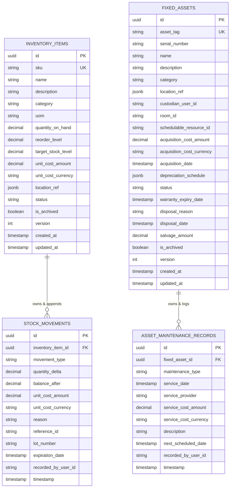
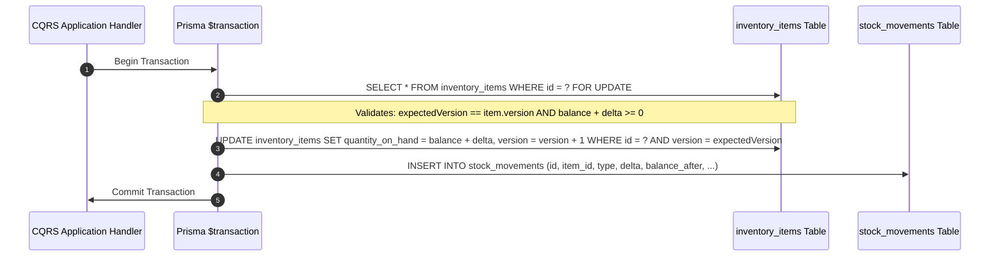
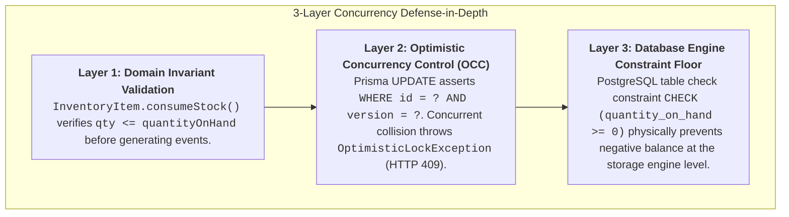
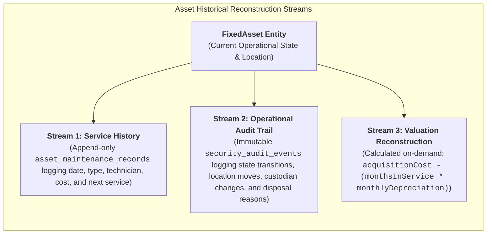
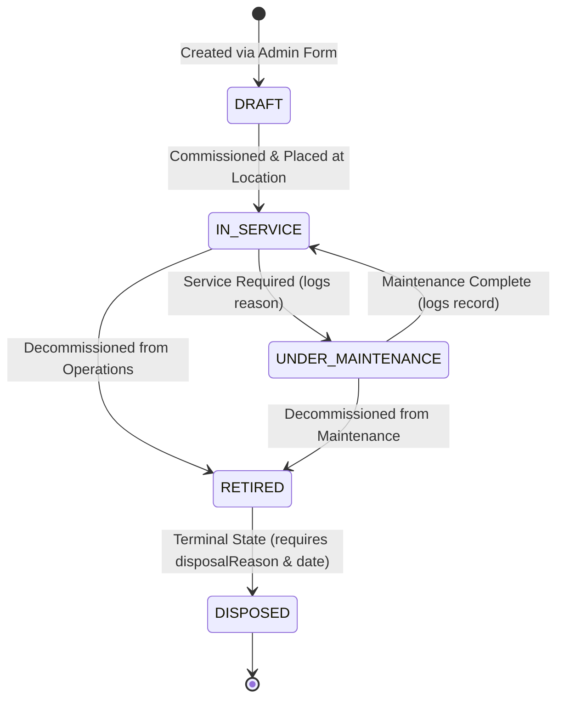

# Phase 6: Resources Management — Production Persistence Strategy

**Author**: Principal Persistence Architect & Data Platform Engineer  
**Status**: **PROPOSED / BASELINE DESIGN**  
**Domain**: Phase 6 — Resources Management (Consumable Inventory & Fixed Assets)  
**Document Version**: 1.0.0

---

## 1. Persistence Goals

The persistence tier for **Phase 6: Resources Management** must provide:

1. **Absolute Stock Balance Consistency**: Guarantee that consumable stock quantities can never drop below zero or drift out of sync with physical movements under concurrent mutations.
2. **Immutable Audit Permanence**: Provide append-only ledgers for stock movements and asset maintenance records that can never be updated or deleted.
3. **Decoupled Relational Boundaries**: Ensure zero foreign key cascades or tight schema dependencies with external contexts (`Client`, `Identity`, `Scheduling`, `Kinesiology`, `Gym`).
4. **Sub-Millisecond Query Performance**: Provide targeted composite indexes supporting rapid inventory catalog filtering, low-stock threshold queries, and asset lifecycle lookup.
5. **Exact Financial Precision**: Store all monetary values as `Decimal(10, 2)` to eliminate floating-point rounding errors across stock valuations and asset depreciation calculations.

---

## 2. Existing Prisma & Database Constraints

The Kinergy persistence foundation imposes the following hard constraints:

- **Database Engine**: PostgreSQL 16 managed via Prisma ORM 6.3.1.
- **Single Schema Rule**: All models reside in `prisma/schema.prisma`.
- **Scalar Cross-Context References**: Foreign context identifiers (such as IAM `User.id`, Scheduling `Room.id`, or Kinesiology `TreatmentSession.id`) must be persisted as simple scalar strings (`recordedByUserId: String`, `custodianUserId: String?`, `roomId: String?`, `treatmentSessionId: String?`) without relational `@relation` annotations across bounded contexts.
- **Naming Conventions**: PascalCase models, camelCase Prisma fields, `@map("snake_case")` database columns, and `@@map("snake_case_plural")` database tables.
- **Soft Deletion / Archival Pattern**: Tables implement `is_archived: Boolean @default(false)` and `archived_at: DateTime?` rather than destructive `DELETE` statements.

---

## 3. Proposed Aggregate Persistence & Conceptual Schema

The persistence model consists of four dedicated PostgreSQL tables organized under two distinct aggregate roots:



---

## 4. Entity & Table Responsibilities

### 4.1 `inventory_items` Table (Aggregate Root)

- **Primary Responsibility**: Holds the current catalog definition, active stock balance, unit pricing, reorder thresholds, and optimistic concurrency version.
- **Lifecycle**: Mutable through aggregate root methods (`receiveStock`, `consumeStock`, `adjustStock`).

### 4.2 `stock_movements` Table (Append-Only Child Entity)

- **Primary Responsibility**: Immutable journal recording every physical change in quantity.
- **Lifecycle**: **Insert-Only**. Never updated or deleted. Corrections append offsetting `CORRECTION` movements.

### 4.3 `fixed_assets` Table (Aggregate Root)

- **Primary Responsibility**: Holds discrete asset identity, operational status, physical location, financial acquisition cost, and depreciation schedule.
- **Lifecycle**: Mutable state transitions governed by the asset lifecycle state machine.

### 4.4 `asset_maintenance_records` Table (Append-Only Child Entity)

- **Primary Responsibility**: Historical service ledger recording preventive inspections, repairs, calibrations, and costs.
- **Lifecycle**: **Insert-Only**. Never updated or deleted.

---

## 5. Relationship Strategy

1. **Intra-Context Foreign Keys (Enforced in Database)**:
   - `stock_movements.inventory_item_id` $\rightarrow$ `inventory_items.id` with `onDelete: Restrict`. Prevents deleting an inventory item that contains historical movements.
   - `asset_maintenance_records.fixed_asset_id` $\rightarrow$ `fixed_assets.id` with `onDelete: Restrict`. Prevents deleting an asset that contains maintenance history.
2. **Cross-Context References (Scalar Only)**:
   - `recorded_by_user_id` $\rightarrow$ Scalar string referencing IAM `User.id`.
   - `custodian_user_id` $\rightarrow$ Scalar string referencing IAM `User.id`.
   - `room_id` $\rightarrow$ Scalar string referencing Scheduling `Room.id`.
   - `schedulable_resource_id` $\rightarrow$ Scalar string referencing Scheduling `SchedulableResource.id`.
   - `reference_id` on stock movements $\rightarrow$ Scalar string referencing clinical `TreatmentSession.id` or supplier invoice number.

---

## 6. Index Strategy

| Table                           | Index Columns                         | Index Type         | Business Purpose                                                            |
| :------------------------------ | :------------------------------------ | :----------------- | :-------------------------------------------------------------------------- |
| **`inventory_items`**           | `[sku]`                               | `UNIQUE B-Tree`    | Instant SKU lookup & uniqueness enforcement.                                |
| **`inventory_items`**           | `[status, is_archived]`               | `B-Tree`           | Fast filtering for active catalog listing views.                            |
| **`inventory_items`**           | `[quantity_on_hand, reorder_level]`   | `B-Tree`           | Instant low-stock / reorder alert queries.                                  |
| **`inventory_items`**           | `[category]`                          | `B-Tree`           | Category faceted filtering.                                                 |
| **`stock_movements`**           | `[inventory_item_id, timestamp DESC]` | `Composite B-Tree` | Rapid retrieval of recent item stock transaction history.                   |
| **`stock_movements`**           | `[movement_type, timestamp DESC]`     | `B-Tree`           | Operational reporting on consumption vs receipts.                           |
| **`stock_movements`**           | `[reference_id]`                      | `B-Tree`           | Cross-context auditing (e.g. finding movements for a `treatmentSessionId`). |
| **`fixed_assets`**              | `[asset_tag]`                         | `UNIQUE B-Tree`    | Unique physical barcode/tag lookups.                                        |
| **`fixed_assets`**              | `[status, is_archived]`               | `B-Tree`           | Active asset catalog filtering.                                             |
| **`fixed_assets`**              | `[category]`                          | `B-Tree`           | Asset category classification filtering.                                    |
| **`fixed_assets`**              | `[custodian_user_id]`                 | `B-Tree`           | Custodian asset accountability view.                                        |
| **`fixed_assets`**              | `[schedulable_resource_id]`           | `B-Tree`           | Cross-reference lookup from calendar resource.                              |
| **`asset_maintenance_records`** | `[fixed_asset_id, service_date DESC]` | `Composite B-Tree` | Asset service history timeline view.                                        |
| **`asset_maintenance_records`** | `[next_scheduled_date]`               | `B-Tree`           | Upcoming preventive maintenance schedule reports.                           |

---

## 7. Constraint Strategy

1. **Database Check Constraints**:
   - `quantity_on_hand >= 0`: Enforces invariant [INV-1] directly at the database engine level.
   - `unit_cost_amount >= 0`: Guarantees non-negative inventory valuation.
   - `acquisition_cost_amount >= 0`: Guarantees non-negative capital cost.
   - `reorder_level >= 0`: Guarantees non-negative reorder threshold.
2. **PostgreSQL Enum Types**:
   - `item_status_enum`: `'ACTIVE'`, `'INACTIVE'`, `'DISCONTINUED'`.
   - `movement_type_enum`: `'RECEIPT'`, `'CONSUMPTION'`, `'ADJUSTMENT'`, `'CORRECTION'`, `'SCRAP'`.
   - `asset_status_enum`: `'DRAFT'`, `'IN_SERVICE'`, `'UNDER_MAINTENANCE'`, `'RETIRED'`, `'DISPOSED'`.
   - `maintenance_type_enum`: `'PREVENTIVE_INSPECTION'`, `'REPAIR'`, `'CALIBRATION_CERTIFICATION'`, `'SAFETY_AUDIT'`.

---

## 8. Transaction Boundaries & Atomicity

Every stock mutation and asset status update is enclosed in a single database transaction (`prisma.$transaction`):



---

## 9. Concurrency Strategy: Answering the Critical Concurrency Question

> ### CRITICAL ARCHITECTURAL GUARANTEE:
>
> **"How can Kinergy guarantee that inventory stock cannot become inconsistent under concurrent mutations?"**

Kinergy enforces a **3-Layer Defense-in-Depth Concurrency Strategy**:



1. **Domain Layer**: The `InventoryItem` aggregate root validates that stock cannot drop below zero.
2. **Application / ORM Layer**: The repository uses OCC (`version` increment). If two users consume stock simultaneously, the second write fails with a version mismatch, preventing phantom writes.
3. **Database Engine Floor**: PostgreSQL enforces `CHECK (quantity_on_hand >= 0)`. Even if application checks were somehow bypassed, PostgreSQL aborts and rolls back the transaction.

---

## 10. History Strategy: Answering the Critical Asset History Question

> ### CRITICAL ARCHITECTURAL GUARANTEE:
>
> **"How can Kinergy reconstruct the meaningful history of a fixed asset?"**

A fixed asset's complete operational and financial history is reconstructed through **two complementary persistence streams**:



1. **Physical Maintenance Ledger (`asset_maintenance_records`)**:
   - Queries `SELECT * FROM asset_maintenance_records WHERE fixed_asset_id = ? ORDER BY service_date DESC`.
   - Reconstructs every preventive inspection, calibration certification, repair, technician name, and invoice cost.
2. **State & Custody Audit Trail (`IAuditService`)**:
   - State machine changes (e.g. `IN_SERVICE` $\rightarrow$ `UNDER_MAINTENANCE` $\rightarrow$ `RETIRED`) publish immutable audit records containing the timestamp, actor ID, old state, new state, and change reason.
3. **Valuation Timeline Reconstruction**:
   - Net book value at any historical date $T$ is reconstructed deterministically using the immutable `acquisitionDate`, `acquisitionCost`, and `DepreciationSchedule` formula:
     $$\text{BookValue}(T) = \max(\text{SalvageValue}, \text{Cost} - (\text{ElapsedMonths}(T) \times \text{MonthlyRate}))$$

---

## 11. Valuation Strategy & JSON Schema

Financial parameters are persisted using strict `Decimal` columns and structured `jsonb` payloads:

### `depreciation_schedule` JSON Structure (on `fixed_assets`):

```json
{
  "method": "STRAIGHT_LINE",
  "usefulLifeMonths": 60,
  "salvageValueAmount": "500.00",
  "salvageValueCurrency": "USD",
  "depreciationStartDate": "2026-01-15T00:00:00.000Z"
}
```

### `location_ref` JSON Structure (on `inventory_items` and `fixed_assets`):

```json
{
  "facility": "Downtown Wellness Clinic",
  "zone": "Treatment Wing",
  "room": "Room 3",
  "container": "Supply Cabinet B, Shelf 2"
}
```

---

## 12. Lifecycle State Machine Persistence

The `FixedAsset.status` column stores the strict enum state:



- When transitioning to `DISPOSED`, the database columns `disposal_reason`, `disposal_date`, and `salvage_amount` are populated.
- The state `DISPOSED` is an irreversible sink state.

---

## 13. Migration & Rollback Strategy

1. **Additive Migration Phase**:
   - `prisma migrate dev --name add_resources_inventory_and_asset_tables` creates the 4 new tables without modifying any existing Phase 0–5 tables.
2. **Zero Downtime / Zero Cross-Table Migration Risk**:
   - Because Phase 6 uses scalar identifiers for cross-context links, no foreign keys touch existing tables (`users`, `clients`, `appointments`, `treatment_sessions`, `memberships`).
3. **Rollback Plan**:
   - Reverting the migration drops only the 4 Phase 6 tables (`inventory_items`, `stock_movements`, `fixed_assets`, `asset_maintenance_records`) with zero impact on pre-existing data.

---

## 14. Future Extensibility

- **Batch / Expiration Tracking**: The `stock_movements` table includes optional `lot_number` and `expiration_date` columns ready for clinical lot tracking without schema alterations.
- **Asset Maintenance Work Orders**: If Phase 9 introduces a full maintenance management system (CMMS), `asset_maintenance_records` easily links to external work orders via `work_order_id: String?`.

---

## 15. Explicit Non-Goals

1. **No Single Table Polymorphism**: `inventory_items` and `fixed_assets` will never share a table.
2. **No General Ledger Journal Tables**: No raw double-entry accounting tables (`journal_entries`, `accounts`, `debits`, `credits`).
3. **No Direct Relational FKs Across Bounded Contexts**: Schedulable resources, users, and rooms are coupled solely via scalar strings.
4. **No Automated Cron Mutation of Asset Book Values**: Net book values are calculated on-demand via domain value objects.
