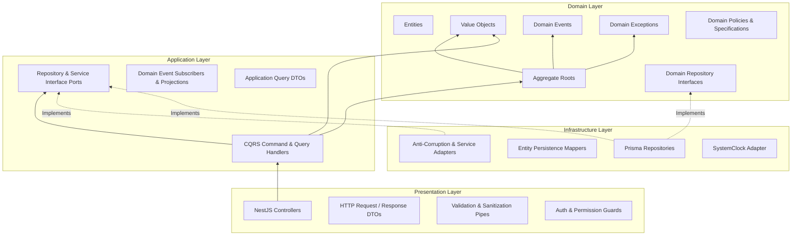
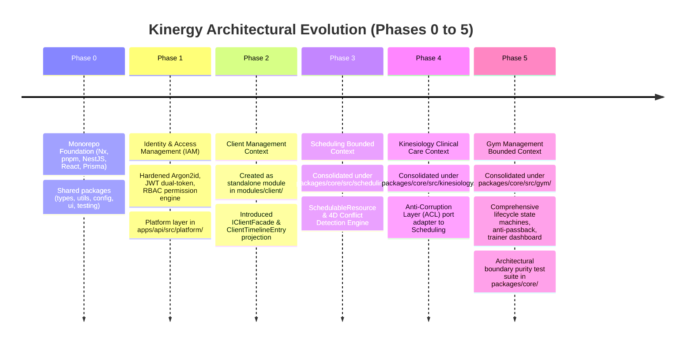

# Phase 6: Resources Management — Architectural Reconnaissance & Discovery (Phase 6.0)

- **Status**: Complete Architectural Discovery & Baseline
- **Milestone**: Phase 6.0 — Discovery & Baseline
- **Domain**: Phase 6 — Resources Management (Consumable Inventory & Fixed Assets)
- **Role**: Principal Software Architect / Staff Platform Engineer
- **Date**: 2026-08-24

---

## 1. Executive Summary

### 1.1 Objective & Context

This document establishes the authoritative architectural baseline for **Phase 6: Resources Management** of the **Kinergy Platform**. The business mandate for Phase 6 is to provide complete operational and financial visibility into **everything the business owns (Fixed Assets) and consumes (Consumable Inventory)** across clinical, fitness, and administrative operations.

Following the platform's strict engineering governance, **Milestone 6.0 is architecture discovery only**. No implementation code, database migrations, controllers, services, or frontend components have been created. This discovery systematically reviews the entire codebase across Phases 0 through 5 to ensure architectural continuity, identify reusable building blocks, document architectural constraints, catalog existing risks, and formulate precise integration boundaries for Phase 6.

### 1.2 Key Architectural Conclusions

1. **Structural Topology**: The platform operates as an Nx integrated monorepo with 10 established Nx projects (`apps/api`, `apps/web`, `modules/client`, `packages/core`, `packages/config`, `packages/testing`, `packages/types`, `packages/ui`, `packages/utils`, `packages/validation`). Core domain logic for multi-phase bounded contexts (`scheduling`, `kinesiology`, `gym`) is consolidated under `packages/core/src/<context>/`, while `modules/client/` represents an earlier standalone module package.
2. **Layering & Purity**: Strict inward Clean Architecture dependencies are enforced: **Presentation $\rightarrow$ Infrastructure $\rightarrow$ Application $\rightarrow$ Domain Kernel**. Pure domain layers forbid all external runtime dependencies (`@nestjs/*`, `@prisma/*`, Express). Automated architectural boundary tests (`gym-architecture-boundaries.spec.ts`, `kinesiology-architecture-boundaries.spec.ts`) actively verify these constraints in CI.
3. **Database & Cross-Context Decoupling**: Persistence is unified through a single PostgreSQL database via Prisma ORM (`prisma/schema.prisma`), but bounded contexts remain logically isolated. Cross-context entities are referenced strictly by scalar string identifiers (`clientId`, `therapistId`, `appointmentId`, `userId`) without relational foreign-key cascades across context boundaries.
4. **Pre-Existing SchedulableResource vs Phase 6 Assets**: Phase 3 (Scheduling) introduced `Room` and the `SchedulableResource` interface (`packages/core/src/scheduling/domain/resource/`) strictly for **calendar booking, capacity management, and turnaround buffer evaluation**. Phase 6 Fixed Assets represent **physical asset ownership, serial tracking, acquisition value, depreciation schedules, warranty tracking, and physical maintenance logs**. These two concepts must remain decoupled across bounded contexts.
5. **Existing Security & Permission Precedents**: The IAM seed catalog (`prisma/seeds/identity.seed.ts`) already provisions basic `inventory.read` and `inventory.write` permissions assigned to `Owner` and `Kitchen Staff`. Phase 6 must establish a refined, backward-compatible permission taxonomy (e.g., distinguishing consumable inventory management from capital asset depreciation and write-offs).

---

## 2. Repository Architecture

### 2.1 Workspace Structure & Project Boundaries

The codebase is structured as an **Nx integrated monorepo** managed with **pnpm** (`pnpm@11.17.0`, Node.js 24 per `.nvmrc`).

```
kinergy-platform/
├── apps/
│   ├── api/                  # NestJS 10 REST API application host
│   └── web/                  # React 18 + Vite 5 Single-Page Application host
├── modules/
│   └── client/               # Client Management Bounded Context package
├── packages/
│   ├── config/               # Zod-validated workspace environment configuration
│   ├── core/                 # Core domain bounded contexts (scheduling, kinesiology, gym)
│   ├── testing/              # Workspace-wide testing platform harnesses & fakes
│   ├── types/                # Core ambient types (Result<T, E>, Nullable<T>, EntityId)
│   ├── ui/                   # Shared UI component library & Radix design primitives
│   ├── utils/                # Shared pure utility functions
│   └── validation/           # Shared validation schemas & sanitizers
├── prisma/
│   ├── schema.prisma         # Unified database schema (PostgreSQL)
│   ├── migrations/           # Versioned migration history
│   └── seeds/                # Idempotent database seeders
├── infrastructure/           # Docker Compose, PostgreSQL 16 local environment
├── docs/                     # 80 ADRs, system architecture, and domain specifications
├── nx.json                   # Nx workspace cache, named inputs, and target defaults
├── pnpm-workspace.yaml       # pnpm monorepo package glob definitions
└── tsconfig.base.json        # Path aliases and strict TypeScript compilation settings
```

### 2.2 Project Registry Matrix (10 Projects)

| Project Name                      | Path                  | Type            | Primary Role                                        |
| :-------------------------------- | :-------------------- | :-------------- | :-------------------------------------------------- |
| `@kinergy-platform/source`        | Root                  | Root Meta       | Root scripts, dependencies, git hooks               |
| `apps/api`                        | `apps/api`            | Application     | Backend REST API host, DI composition root          |
| `apps/web`                        | `apps/web`            | Application     | Frontend SPA, routing, view composition             |
| `@kinergy-platform/client-domain` | `modules/client`      | Bounded Context | Client profile, demographic normalization, timeline |
| `@kinergy-platform/core`          | `packages/core`       | Domain Library  | Pure domain & application CQRS for Core Contexts    |
| `@kinergy-platform/config`        | `packages/config`     | Shared Lib      | Zod environment schema & typed configuration        |
| `@kinergy-platform/testing`       | `packages/testing`    | Shared Lib      | Test factories, in-memory repos, mock builders      |
| `@kinergy-platform/types`         | `packages/types`      | Shared Lib      | Common types (`Result<T, E>`, `Nullable<T>`)        |
| `@kinergy-platform/ui`            | `packages/ui`         | Shared Lib      | Radix primitives, styling tokens, button/dialog     |
| `@kinergy-platform/utils`         | `packages/utils`      | Shared Lib      | Pure string, date, object helper functions          |
| `@kinergy-platform/validation`    | `packages/validation` | Shared Lib      | Zod input sanitization & validation rules           |

### 2.3 Dependency Graph Rules

1. `packages/types`, `packages/utils`, `packages/config`, `packages/validation` are leaf packages with zero dependencies on domain or application packages.
2. `packages/core` depends only on `packages/types`, `packages/utils`, `packages/validation`, and `packages/config`.
3. `apps/api` and `apps/web` depend on shared packages and feature contexts.
4. Circular dependencies across packages or bounded contexts are strictly prohibited and prevented by Nx task graphs and TypeScript path aliases.

---

## 3. Backend Architecture

### 3.1 Layering Taxonomy

The backend implements strict **Clean Architecture / Hexagonal Architecture** with four distinct layers:



### 3.2 Backend Layer Invariants

1. **Domain Layer (`domain/`)**:
   - Must be **100% pure TypeScript**.
   - Strictly no imports of `@nestjs/*`, `@prisma/*`, `express`, or foreign bounded context domain models.
   - Encapsulates entity state; state modifications must occur through explicit domain methods (e.g., `membership.freeze()`, `treatmentSession.complete()`).
   - Every aggregate root implements optimistic concurrency control via an integer `version` field.
2. **Application Layer (`application/`)**:
   - Implements CQRS command handlers (`*Handler`) and query handlers (`*QueryHandler` / `*Handler`).
   - Declares output ports (interfaces) for persistence (`IRepository`), external bounded context queries, and event dispatchers.
   - Forbids direct database ORM access (`@prisma/client` or `PrismaService` forbidden in application files).
3. **Infrastructure Layer (`infrastructure/`)**:
   - Implements application/domain ports using Prisma ORM (`Prisma<Aggregate>Repository`).
   - Performs two-way mapping between database records and domain aggregates via dedicated mappers (`<Aggregate>Mapper.toDomain()` and `<Aggregate>Mapper.toPersistence()`).
   - Isolates database transaction logic (`$transaction`) and database error translation.
4. **Presentation Layer (`apps/api/src/<context>/` / `presentation/`)**:
   - Thin NestJS controllers mapped to HTTP routes.
   - Applies decorators for security (`@UseGuards(AuthenticationGuard)`, `@RequirePermissions(...)`).
   - Transforms incoming HTTP payloads to application command/query DTOs and delegates execution to CQRS handlers.
   - Controllers never execute business logic or access Prisma directly.

### 3.3 Backend Cross-Cutting Platform Infrastructure

Located in `apps/api/src/platform/`:

- **Identity (`apps/api/src/platform/identity/`)**: Authentication guards (`AuthenticationGuard`), permission evaluators (`AuthorizationEvaluator`), token services, request context (`ReqUser`).
- **Persistence (`apps/api/src/platform/persistence/`)**: Global `PrismaService` extending `PrismaClient` with lifecycle hooks.
- **Logging (`apps/api/src/platform/logging/`)**: Structured `ILoggerPort` and `PlatformLoggerService`.
- **Audit (`apps/api/src/platform/audit/`)**: `IAuditService` for auditable event recording.
- **Rate Limiting (`apps/api/src/platform/rate-limiting/`)**: Throttler guards protecting public and authenticated endpoints.
- **Web Security (`apps/api/src/platform/web-security/`)**: Production Helmet security headers, CORS origin resolution.

---

### 3.4 Cross-Cutting Backend Standards

Every backend module and HTTP endpoint in the Kinergy Platform follows a rigorous set of standardized cross-cutting conventions:

#### 1. Authentication Standard

- **Mechanism**: Stateless Bearer JWT token validation via `AuthenticationGuard` (`apps/api/src/platform/identity/guards/authentication.guard.ts`).
- **Identity Propagation**: Upon validating the token signature, expiry, and active status (`user.status === 'ACTIVE'`), `AuthenticationGuard` constructs an `AuthenticatedUserContext` object and binds it to `req.user`.
- **Async Execution Context**: Populates `RequestContext` via Node.js `AsyncLocalStorage` (`apps/api/src/platform/identity/request-context.ts`), allowing background operations or downstream services to read caller identity without parameter passing.
- **Controller Access**: Controllers extract identity payload via `@CurrentUser() currentUser: AuthenticatedUserPayload` (`apps/api/src/platform/identity/decorators/current-user.decorator.ts`).
- **Public Endpoints**: Public routes (e.g. login, health check) are explicitly marked with `@Public()` decorator.
- **Phase 6 Implication**: All Phase 6 endpoints (`/api/v1/resources/*`) must apply `@UseGuards(AuthenticationGuard, AuthorizationGuard)` at the controller class level.

#### 2. Authorization & Permissions Standard

- **Mechanism**: Declarative route guards via `AuthorizationGuard` (`apps/api/src/platform/identity/authorization/authorization.guard.ts`).
- **Route Metadata**: Decorated with `@Roles('Admin', 'Owner', ...)` and `@Permissions('resources.inventory.read', ...)` (`apps/api/src/platform/identity/decorators/`).
- **Policy Evaluation**: `AuthorizationGuard` delegates evaluation to `IAuthorizationEvaluator` (`DefaultAuthorizationEvaluator`).
- **Object-Level & Business Scoping**: Handlers/Controllers enforce data scoping (e.g., verifying if the caller possesses `Admin`/`Owner` roles before allowing cross-department asset reallocation or stock write-offs).
- **Forbidden Errors**: Non-authorized requests immediately throw `ForbiddenException` (HTTP 403) with descriptive failure reasons.
- **Phase 6 Implication**: Phase 6 must define hierarchical permission codes:
  - Consumable Inventory: `resources.inventory.read`, `resources.inventory.write`, `resources.inventory.adjust`, `resources.inventory.receive`.
  - Fixed Assets: `resources.assets.read`, `resources.assets.write`, `resources.assets.retire`, `resources.assets.maintain`, `resources.assets.depreciate`.

#### 3. Pagination, Filtering, Sorting & Search Standards

- **Request Format (`List<Resource>QueryDto`)**:
  - `page`: Optional integer, default `1`, `@Min(1)`, transformed via `@Type(() => Number)`.
  - `limit`: Optional integer, default `20` (max `100`), `@Min(1)`, transformed via `@Type(() => Number)`.
  - Filtering parameters: Explicit typed query fields (e.g., `category?: string`, `status?: string`, `locationId?: string`, `minQuantity?: number`, `depreciationStatus?: string`).
  - Date filtering: Standard ISO 8601 strings (`startDateFrom?: string`, `startDateTo?: string`).
  - Search queries: Optional string `query?: string` (or `search?: string`) matching SKU, asset tags, or descriptions using trigram/ILIKE indexes.
  - Sorting: Parameter `sortBy?: string` with `sortOrder?: 'asc' | 'desc'` or implicit default `orderBy: { createdAt: 'desc' }`.
- **Response Format (`PaginatedResultDto<T>` / `Paginated<Resource>ResponseDto`)**:
  ```json
  {
    "items": [...],
    "total": 120,
    "page": 1,
    "limit": 20,
    "totalPages": 6,
    "hasNextPage": true,
    "hasPreviousPage": false
  }
  ```
  - Standard helper: `PaginatedResultDto.create(items, total, page, limit)` (`modules/client/application/dto/paginated-result.dto.ts`).
- **Phase 6 Implication**: All listing endpoints (e.g. `GET /api/v1/resources/inventory`, `GET /api/v1/resources/assets`, `GET /api/v1/resources/inventory/transactions`) must implement this exact pagination query and response envelope.

#### 4. API Response Envelopes & HTTP Status Standards

- **Single Resource Read/Update**: Returns raw DTO object with HTTP 200 OK (e.g. `InventoryItemResponseDto`, `FixedAssetResponseDto`).
- **Resource Creation**: Returns newly created DTO with HTTP 201 Created.
- **Batch / Action Mutations**: Returns structured summary DTO with HTTP 200 OK (e.g. `StockAdjustmentResponseDto`, `BatchDepreciationResponseDto`).
- **No-Content Mutations**: HTTP 204 No Content for pure deletions or state terminations.
- **Serialization & Transformation**: Enabled globally via `GlobalSanitizationValidationPipe` with `transform: true` and `enableImplicitConversion: true`.
- **Phase 6 Implication**: All Phase 6 controllers must define explicit DTO response models annotated with Swagger `@ApiResponse({ status, type: ... })`.

#### 5. Validation & Input Sanitization Standard

- **Global Sanitization Pipe**: `GlobalSanitizationValidationPipe` (`apps/api/src/common/pipes/global-sanitization-validation.pipe.ts`) is registered globally on `APP_PIPE`.
- **Sanitization Pipeline**: Incoming string inputs are automatically trimmed, control characters stripped, and XSS vectors neutralized via `InputSanitizer`.
- **Strict DTO Validation**:
  - `whitelist: true` (strips undeclared properties).
  - `forbidNonWhitelisted: true` (rejects requests containing unapproved properties with HTTP 400).
- **Validation Decorators**: All request DTOs must use `class-validator` (`@IsString()`, `@IsNotEmpty()`, `@IsOptional()`, `@IsNumber()`, `@Min()`, `@IsDateString()`, `@IsEnum()`).
- **Phase 6 Implication**: All Phase 6 request DTOs must declare explicit `class-validator` and `class-transformer` rules on every property.

#### 6. Error Handling & Exception Mapping Standard

- **Exception Strategy**: `GlobalExceptionFilter` (`apps/api/src/common/filters/global-exception.filter.ts`) catches unhandled exceptions and maps domain/HTTP errors:
  - `400 Bad Request`: Payload validation failures or invalid query parameters.
  - `401 Unauthorized`: Missing, expired, or invalid JWT access tokens.
  - `403 Forbidden`: Insufficient user roles or permissions.
  - `404 Not Found`: Target entity ID not found (`NotFoundException`).
  - `409 Conflict`: `OptimisticLockException` (OCC version conflict) or unique constraint violations (duplicate SKU / Asset Tag).
  - `422 Unprocessable Entity`: Domain business rule violations (e.g. attempting to decrement stock below zero, transitioning asset from `DISPOSED` to `OPERATIONAL`).
  - `500 Internal Server Error`: Unhandled errors with masked user-safe message and logged stack trace.
- **Error Response Shape**:
  ```json
  {
    "statusCode": 400,
    "timestamp": "2026-08-25T11:40:00.000Z",
    "path": "/api/v1/resources/inventory/adjust",
    "error": {
      "message": "Stock quantity cannot be reduced below zero."
    }
  }
  ```
- **Phase 6 Implication**: Domain exceptions in `packages/core/src/resources/domain/exceptions/` must map cleanly to standard HTTP status codes in controllers or via a dedicated `ResourcesExceptionFilter`.

#### 7. Logging, Audit & Request Correlation Standard

- **Logger Port**: Injected via `ILoggerPort` / `PlatformLoggerService` (`apps/api/src/platform/logging/`).
- **Structured Error Logging**: Catches format `Http Status: ${status} Error Message: ${JSON.stringify(message)} Path: ${request.url}`.
- **Audit Service**: Security, permission changes, and high-impact administrative actions publish audit events via `IAuditService` (`apps/api/src/platform/audit/`).
- **Actor Attribution**: All write commands must capture caller ID (`recordedByUserId: currentUser.id`) in stock ledger records and asset maintenance histories.
- **Phase 6 Implication**: Every stock movement, inventory count reconciliation, asset purchase, maintenance log, and asset disposal must persist `recordedByUserId` and emit audit log events.

#### 8. API Documentation (Swagger / OpenAPI) Standard

- Every controller must declare `@ApiTags('Resources - <SubDomain>')` and `@ApiBearerAuth()`.
- Every route handler must declare `@ApiOperation({ summary, description })`.
- All response codes (200, 201, 400, 401, 403, 404, 409, 422) must be documented via `@ApiResponse({ status, description, type })`.
- Route parameters must declare `@ApiParam()`; Query filters must declare `@ApiQuery()`.
- **Phase 6 Implication**: Full Swagger OpenAPI coverage for all Phase 6 routes under `/api/docs`.

---

### 3.5 Phase 6 API Contract Constraints

Phase 6 API implementations must inherit and adhere to the following contract rules:

1. **Inventory Adjustment (`POST /api/v1/resources/inventory/adjust`)**:
   - Requires `resources.inventory.adjust` permission.
   - Must accept `itemId`, `quantityDelta` (integer, non-zero), `type` (enum: `PURCHASE`, `USAGE`, `SPOILAGE`, `CORRECTION`, `TRANSFER`), `reason` (non-empty string), and optional `batchNumber`/`expirationDate`.
   - Must execute in an atomic transaction updating `currentQuantityOnHand` with OCC `version` check and inserting an immutable `stock_transactions` record capturing `recordedByUserId`.
   - Must reject adjustments that would cause negative inventory with HTTP 422 Unprocessable Entity unless backorders are explicitly configured.
2. **Stock Inbound Receipt (`POST /api/v1/resources/inventory/receive`)**:
   - Requires `resources.inventory.receive` permission.
   - Accepts batch receiving payload with purchase order reference, vendor ID, unit purchase price, and received quantities.
   - Updates moving average unit cost or lot cost and increments stock balance.
3. **Asset Registration (`POST /api/v1/resources/assets`)**:
   - Requires `resources.assets.write` permission.
   - Enforces unique natural keys (`assetTag` and `serialNumber`) returning HTTP 409 on duplicates.
   - Initial status must be `DRAFT` or `OPERATIONAL`.
4. **Asset Maintenance Logging (`POST /api/v1/resources/assets/:id/maintenance`)**:
   - Requires `resources.assets.maintain` permission.
   - Appends an immutable maintenance record (`serviceDate`, `cost`, `performedBy`, `workDetails`, `nextServiceDue`).
   - If maintenance is active, transitions asset status to `MAINTENANCE`.
5. **Asset Retirement / Disposal (`POST /api/v1/resources/assets/:id/retire`)**:
   - Requires `resources.assets.retire` permission (restricted to `Admin` / `Owner`).
   - Requires mandatory disposal reason, disposal method (`SOLD`, `SCRAPPED`, `DONATED`, `RECYCLED`), and final salvage amount.
   - Terminal state transition to `DISPOSED` preventing further maintenance or allocation.
6. **Asset Valuation & Depreciation (`GET /api/v1/resources/assets/valuation` / `POST /api/v1/resources/assets/depreciate`)**:
   - Requires `resources.assets.depreciate` permission.
   - Computes book value based on purchase cost, salvage value, useful life (months), and elapsed periods using exact `Decimal(10, 2)` calculations.

---

### 3.6 Cross-Cutting Gaps & Ambiguities Identified

The discovery revealed several minor cross-cutting inconsistencies across existing modules:

1. **Error Response Schema Inconsistency**:
   - `GlobalExceptionFilter` formats errors as: `{ statusCode, timestamp, path, error: { message } }`.
   - `SchedulingExceptionFilter` formats errors as: `{ statusCode, error, code, message }` without `timestamp` or `path`.
   - _Resolution for Phase 6_: Phase 6 should use a dedicated `ResourcesExceptionFilter` or rely on the root `GlobalExceptionFilter` ensuring consistent `{ statusCode, timestamp, path, error: { message, code } }` response format.
2. **Controller Unwrapping vs Result Envelope**:
   - Domain and application use cases return `Result<T, E>` / `ApplicationResult<T>`.
   - Controllers currently unwrap `result.getValue()` directly or throw NestJS exceptions (`BadRequestException(result.getError())`).
   - _Resolution for Phase 6_: Preserve this existing pattern: CQRS handlers return `Result<T, E>`, and controllers unpack success values to HTTP DTOs or map failures to NestJS HTTP exceptions.
3. **Permission Namespacing Granularity**:
   - Legacy permissions in `identity.seed.ts` use single dot `inventory.read` and `inventory.write`.
   - Newer Phase 4/5 permissions use module sub-namespaces (e.g. `kinesiology.sessions.treat`, `memberships.create`).
   - _Resolution for Phase 6_: Adopt clean hierarchical naming (`resources.inventory.read`, `resources.inventory.adjust`, `resources.assets.read`, `resources.assets.write`) while aliasing legacy `inventory.*` permissions for backward compatibility.

---

## 4. Frontend Architecture

### 4.1 Framework & Core Technologies

- **Host**: React 18.3.1 Single-Page Application bundled with Vite 5.4.11 (`apps/web`).
- **Styling**: Tailwind CSS 3.4.17 with CSS variables and `@kinergy-platform/ui` design tokens.
- **Component Primitives**: Radix UI primitives (`@radix-ui/react-dialog`, `@radix-ui/react-slot`), Lucide React icons.
- **Data Fetching & Server State**: TanStack React Query 5.62.0.
- **Forms & Validation**: React Hook Form 7.54.0 with `@hookform/resolvers/zod` and Zod 3.24.1.
- **Routing**: React Router DOM 6.28.0 using hybrid feature routing.

### 4.2 Frontend Module Organization

Frontend feature code is strictly partitioned by bounded context under `apps/web/src/modules/`:

```
apps/web/src/modules/
├── analytics/         # Cross-context reporting & KPI dashboards
├── attendance/        # Gym check-in reception workstation (ADR-0069)
├── auth/              # Login, token recovery, session lifecycle (ADR-0041/42)
├── client/            # Client registration, profile management, timeline
├── dashboard/         # Role-based workspace home views
├── energy/            # Energy & utility tracking
├── gym/               # Membership plans, client memberships, trainer dashboard
├── identity/          # User administration, role & permission management
├── kinesiology/       # Clinical treatment sessions & SOAP workspace
└── settings/          # Facility configuration & system preferences
```

### 4.3 Standardized Frontend Contracts (ADR-0071 & ADR-0072)

1. **4-State UI Contract**: Every list and detail view must explicitly handle all 4 lifecycle states:
   - `LOADING`: Render standardized skeleton loaders (`CrudLoading`).
   - `ERROR`: Render structured error banners with retry action (`CrudError`).
   - `EMPTY`: Render contextual empty states with actionable primary buttons (`CrudEmpty`).
   - `DATA`: Render populated data tables or detail cards.
2. **Unified CRUD Composition**: Standardized layout wrappers in `apps/web/src/shared/crud/` (`CrudListLayout`, `CrudListHeader`, `CrudFormLayout`, `CrudFormHeader`).
3. **Query Key Factory Pattern**: All TanStack Query keys must be centralized in typed factory objects per feature module (e.g., `resourceKeys.all`, `resourceKeys.lists()`, `resourceKeys.detail(id)`).
4. **Optimistic UX Decision Policy (ADR-0072)**: Optimistic mutations are strictly reserved for low-risk, reversible operations (e.g., toggling tags, UI preferences). High-stakes state transitions, stock adjustments, financial transactions, and asset disposals require **pessimistic UI mutations** with loading indicators.

---

## 5. Shared Infrastructure

### 5.1 Shared Libraries (`packages/`)

| Library                            | Key Exports                                                           | Usage Rule                                   |
| :--------------------------------- | :-------------------------------------------------------------------- | :------------------------------------------- |
| **`@kinergy-platform/types`**      | `Result<T, E>`, `Nullable<T>`, `Optional<T>`, `EntityId`, `ThemeMode` | Workspace-wide universal type primitives     |
| **`@kinergy-platform/utils`**      | `formatDate`, `isNonEmptyString`                                      | Pure, side-effect-free helper functions      |
| **`@kinergy-platform/validation`** | `InputSanitizer`, Zod sanitizers                                      | Shared validation schemas and sanitization   |
| **`@kinergy-platform/config`**     | `envSchema`, configuration parsers                                    | Typed environment variable validation        |
| **`@kinergy-platform/ui`**         | `Button`, `Dialog`, `Card`, `Badge`, `Input`, `Table`                 | Shared Radix/Tailwind component primitives   |
| **`@kinergy-platform/testing`**    | `TestDatabaseHelper`, `MockFactory`, `AssertionHelpers`               | Standardized test fixtures and mock builders |

### 5.2 Persistence & Database Architecture (`prisma/`)

The persistence tier of the Kinergy Platform is built on **PostgreSQL 16** managed through **Prisma ORM 6.3.1**.

#### 5.2.1 Schema Topology & Model Organization

- **Unified Physical Schema**: All platform models reside in a single schema file (`prisma/schema.prisma`).
- **Context Partitioning**: Models are grouped into explicit bounded-context sections using header banners:
  1. _Identity & Access Management (IAM)_: `User`, `RefreshToken`, `Role`, `Permission`, `RolePermission`.
  2. _Client Management_: `Client`, `ClientTimelineEntry`.
  3. _Scheduling_: `RecurrenceSeries`, `RecurrenceException`, `Appointment`, `AppointmentNote`, `Room`, `MaintenanceWindow`.
  4. _Kinesiology_: `TreatmentSession`.
  5. _Gym Management_: `MembershipPlan`, `Membership`, `AttendanceRecord`.
- **Primary Key & ID Strategy**: All entity IDs use client-generated or default string UUIDs (`id String @id @default(uuid())`) mapped to PostgreSQL `TEXT` columns.
- **Naming Conventions**:
  - Models: PascalCase singular (`MembershipPlan`, `AttendanceRecord`, `Room`).
  - Tables: snake_case plural with explicit `@@map("table_names")` (e.g., `@@map("membership_plans")`, `@@map("attendance_records")`, `@@map("rooms")`).
  - Columns: camelCase in TypeScript, snake_case in PostgreSQL with explicit `@map("column_name")` (e.g., `@map("created_at")`, `@map("price_amount")`, `@map("start_time")`).
  - Enums: PascalCase enum types (`MembershipStatus`, `RoomStatus`, `AccessResult`, `ResourceType`), UPPER_SNAKE_CASE values (`PENDING_ACTIVATION`, `DENIED_DUPLICATE_CHECKIN`, `QR_CODE`).

#### 5.2.2 Temporal & Audit Fields

- **Standard Timestamps**: Every mutable business entity declares `createdAt DateTime @default(now()) @map("created_at")` and `updatedAt DateTime @updatedAt @map("updated_at")`.
- **Append-Only Immutable Logs**: Pure log models (`AttendanceRecord`, `ClientTimelineEntry`) declare only `createdAt` (and business occurrence times `checkInTime`, `occurredAt`), deliberately omitting `updatedAt`.
- **Terminal State Auditing**: Terminal lifecycle state changes require dedicated audit reason fields (e.g., `cancellationReason String? @map("cancellation_reason")`, `terminationReason String? @map("termination_reason")`, `maintenanceReason String? @map("maintenance_reason")`).
- **Lifecycle & History JSON**: Historical transition arrays (such as `freezeHistory Json @default("[]")` on `Membership` or `metadata Json @default("{}")` on `ClientTimelineEntry`) store immutable chronological objects without requiring bloated relation tables.

#### 5.2.3 Monetary & Precision Conventions

- **Monetary Values**: All financial amounts are stored as exact decimal types (`Decimal @db.Decimal(10, 2)` @map("price_amount")), paired with ISO currency codes (`priceCurrency String @default("USD") @map("price_currency")`). Floating-point types (`Float`) are strictly forbidden for pricing, costs, or asset valuations.

#### 5.2.4 Relation & Foreign Key Conventions

- **Intra-Context Relations**: Hard database foreign keys (`@relation`) are strictly confined to parent-child aggregate hierarchies within a single bounded context (e.g., `Room` $\rightarrow$ `MaintenanceWindow` with `onDelete: Cascade`, `RecurrenceSeries` $\rightarrow$ `RecurrenceException` with `onDelete: Cascade`, `MembershipPlan` $\rightarrow$ `Membership` with `onDelete: Restrict`).
- **Cross-Context References**: Strictly stored as scalar string UUIDs (`clientId: string`, `therapistId: string`, `userId: string`, `roomId: string`). Cross-context `@relation` foreign keys are prohibited to prevent cascading deletes and tight coupling across context boundaries.

#### 5.2.5 Indexing Strategy

- **Scalar Foreign Key Indexes**: Every scalar foreign identifier has a dedicated B-tree index (`@@index([clientId])`, `@@index([therapistId])`, `@@index([roomId])`, `@@index([planId])`).
- **Compound Temporal Indexes**: Fast range queries rely on compound indexes: `@@index([clientId, startTime, endTime])`, `@@index([roomId, startTime, endTime])`, `@@index([status, endDate])`.
- **Chronological Sorting Indexes**: Descending index scans for activity feeds and logs: `@@index([clientId, checkInTime(sort: Desc)])`, `@@index([clientId, occurredAt(sort: Desc)])`.
- **Trigram GIN Indexes**: Fast text search indexes using PostgreSQL `pg_trgm` extension (established in migration `20260730000000_add_client_search_trgm_indexes` for `normalized_search_name`, `email`, `phone`).
- **Business Idempotency Constraints**: Compound unique constraints protecting business invariants (e.g., `@@unique([seriesId, occurrenceIndex])`, `@@unique([roleId, permissionId])`).

#### 5.2.6 Concurrency & Transaction Conventions

- **Optimistic Concurrency Control (OCC)**: Every mutable aggregate table declares an integer `version Int @default(1) @map("version")`. Repositories execute updates with atomic version checks:
  ```typescript
  const result = await this.prisma.entity.updateMany({
    where: { id: entity.id, version: priorVersion },
    data: { ...data, version: { increment: 1 } },
  });
  if (result.count === 0) throw new OptimisticLockException(entityName, id, priorVersion);
  ```
- **Unit of Work & Ambient Transaction Context**: `PrismaUnitOfWork` implements `IUnitOfWork`. `PrismaService` uses Node.js `AsyncLocalStorage<Prisma.TransactionClient>` (`runInTransaction`) allowing repository operations to automatically join the ambient transaction without passing database handles across layer boundaries.

#### 5.2.7 Relevant Existing Database Migrations

- `20260730000000_add_client_search_trgm_indexes`: Enabled `pg_trgm` extension and GIN trigram indexes for text search.
- `20260730000001_add_client_timeline_entries`: Established append-only client activity timeline projection table with JSONB metadata.
- `20260815000000_add_room_and_maintenance_windows`: Created `rooms` and `maintenance_windows` with OCC versioning, `RoomStatus`, and `ResourceType` enums.

---

### 5.3 Answers to Core Persistence Questions

| #      | Architectural Question                                                                 | Evidence-Backed Finding & Repository Reference                                                                                                                                                                                                                                                                                                                                                                                                                                                                                                                                                                                                                       |
| :----- | :------------------------------------------------------------------------------------- | :------------------------------------------------------------------------------------------------------------------------------------------------------------------------------------------------------------------------------------------------------------------------------------------------------------------------------------------------------------------------------------------------------------------------------------------------------------------------------------------------------------------------------------------------------------------------------------------------------------------------------------------------------------------- |
| **1**  | **How should a Resource relate to existing business entities?**                        | **Strictly via scalar string UUID identifiers.** Entities in Phase 6 must reference `recordedByUserId: string` (IAM `User.id`), `roomId?: string` (Scheduling `Room.id`), `clientId?: string` (Client `Client.id`), or `treatmentSessionId?: string` (Kinesiology `TreatmentSession.id`) without cross-context Prisma `@relation` foreign keys.                                                                                                                                                                                                                                                                                                                      |
| **2**  | **Should consumable inventory and fixed assets share a persistence abstraction?**      | **They should share common primitive value objects (Money, Location, VendorId) but use distinct, dedicated database tables and aggregate roots.** Consumables require ledger-based stock balances, batches, and reorder thresholds; Fixed Assets require serial numbers, depreciation schedules, warranty periods, and maintenance histories. Sharing a single table would cause column nullability pollution and aggregate confusion. _(See Strategy Analysis in 5.6)._                                                                                                                                                                                             |
| **3**  | **Are stock mutations currently modeled as direct updates or ledger/history records?** | **Existing operational records use append-only ledgers.** In Gym Management, `AttendanceRecord` is an append-only log (`prisma.attendanceRecord.create()`). For Consumable Inventory, updating a single quantity field directly without a ledger creates untraceable stock drift. Stock movements must be modeled as an **append-only stock movement ledger** (`stock_transactions` / `inventory_movements`) alongside an aggregated stock balance.                                                                                                                                                                                                                  |
| **4**  | **Are historical business records immutable?**                                         | **Yes, historical platform records are strictly immutable.** `AttendanceRecord` and `ClientTimelineEntry` lack `updatedAt` and have no update operations in their repositories. Clinical SOAP notes in `TreatmentSession` become read-only upon completion (ADR-0051). `Membership.freezeHistory` is an append-only JSON history log. Phase 6 asset maintenance histories and stock transaction records must be equally immutable.                                                                                                                                                                                                                                   |
| **5**  | **How are state transitions currently represented?**                                   | **Via PostgreSQL/Prisma Enums coupled with Pure Domain State Machines.** State fields (`UserStatus`, `AppointmentStatus`, `SessionStatus`, `MembershipStatus`, `PlanStatus`, `RoomStatus`) use Prisma enums. Valid transitions are enforced by domain methods throwing domain exceptions (e.g., `InvalidMembershipTransitionException`), with terminal states capturing mandatory audit reasons (`cancellationReason`, `terminationReason`).                                                                                                                                                                                                                         |
| **6**  | **How are concurrent writes handled?**                                                 | **Via integer `version` field Optimistic Concurrency Control (OCC) and atomic compound uniqueness constraints.** Repositories verify `version: priorVersion` during updates (`PrismaRoomRepository.ts`, `PrismaClientRepository.ts`). Idempotency keys (`@@unique([seriesId, occurrenceIndex])`) prevent duplicate concurrent creations.                                                                                                                                                                                                                                                                                                                             |
| **7**  | **What transaction boundaries are already established?**                               | **Local, single-context database transactions managed via `PrismaUnitOfWork` and `PrismaService.runInTransaction()`.** Ambient transaction clients are propagated seamlessly via `AsyncLocalStorage`. Distributed transactions across bounded contexts are strictly prohibited.                                                                                                                                                                                                                                                                                                                                                                                      |
| **8**  | **What database constraints are used to protect business invariants?**                 | **Unique constraints** (`@@unique([code])`, `@@unique([email])`, `@@unique([reference_number])`), **foreign keys within aggregates** (`onDelete: Cascade` / `Restrict`), **exact decimal column constraints** (`@db.Decimal(10, 2)`), and **check/enum constraints** on operational state columns.                                                                                                                                                                                                                                                                                                                                                                   |
| **9**  | **What audit/history mechanisms already exist?**                                       | 1. `ClientTimelineEntry` for client-facing longitudinal event projections.<br>2. `IAuditService` (`PlatformLoggerService`) for system security and admin audit events.<br>3. Actor ID attribution (`recordedByUserId`, `authorId`, `receptionistId`) on domain records.<br>4. JSON historical audit logs (`freezeHistory`).                                                                                                                                                                                                                                                                                                                                          |
| **10** | **Which existing patterns should Phase 6 reuse?**                                      | 1. 4-Layer Clean Architecture structure (`domain` $\rightarrow$ `application` $\rightarrow$ `infrastructure` $\rightarrow$ `presentation`).<br>2. `Decimal(10, 2)` precision for asset costs, purchase prices, and depreciation values.<br>3. Append-only transaction ledger for stock adjustments, receipts, and clinical usage logs.<br>4. OCC `version` counter on `InventoryItem` and `FixedAsset` aggregate tables.<br>5. Explicit enum state machines (`AssetStatus`, `InventoryStatus`).<br>6. Two-way persistence mappers (`<Aggregate>Mapper.toDomain()` / `toPersistence()`).<br>7. In-memory repository fakes for deterministic unit/integration testing. |

---

### 5.4 Phase 6 Persistence Constraints

Phase 6 database schema and repository implementations must strictly obey the following rules:

1. **No Cross-Context Foreign Keys**: Phase 6 models in `prisma/schema.prisma` must NOT declare `@relation` references to `clients`, `users`, `appointments`, `treatment_sessions`, or `memberships`. References must use scalar strings (`client_id String?`, `user_id String`, `room_id String?`).
2. **Exact Decimal Monetary Storage**: Purchase prices, unit costs, replacement values, accumulated depreciation, and salvage values must use `Decimal @db.Decimal(10, 2)` mapped to snake_case columns with a companion ISO currency string column (`currency String @default("USD")`).
3. **Mandatory OCC Versioning**: All mutable aggregate tables (`inventory_items`, `fixed_assets`) must include `version Int @default(1) @map("version")`.
4. **Append-Only Stock Ledger**: Stock quantities must never be mutated via arbitrary overwrites. Every increase, decrease, transfer, or clinical consumption must create an immutable `stock_transactions` (or `inventory_movements`) record containing `quantityDelta`, `resultingQuantity`, `reason`, `occurredAt`, `recordedByUserId`, and optional `batchNumber` / `expirationDate`.
5. **Immutable Asset Maintenance & Valuation History**: Asset service records and periodic depreciation entries must be modeled as append-only records referencing the parent asset.
6. **Unique Natural Business Keys**: Unique SKU/Barcode codes on inventory items (`@@unique([sku])`) and Unique Asset Tags / Serial Numbers on fixed assets (`@@unique([asset_tag])`, `@@unique([serial_number])`) must be enforced at the database level.
7. **Snake_Case Table & Column Mappings**: All models must use `@@map("table_names")` and `@map("column_names")` preserving PostgreSQL snake_case naming conventions.

---

### 5.5 Persistence Anti-Patterns to Avoid

| Anti-Pattern                            | Description                                                                                                                                                                               | Why It Is Dangerous for Phase 6                                                                                                                          | Recommended Alternative                                                                                                                                                    |
| :-------------------------------------- | :---------------------------------------------------------------------------------------------------------------------------------------------------------------------------------------- | :------------------------------------------------------------------------------------------------------------------------------------------------------- | :------------------------------------------------------------------------------------------------------------------------------------------------------------------------- |
| **Direct Stock Overwrite**              | Executing `UPDATE inventory_items SET quantity = quantity - 5` without recording a movement record.                                                                                       | Destroys auditability; impossible to reconcile inventory shrinkage, clinical supply usage, or supplier discrepancies; susceptible to race conditions.    | **Append-only stock ledger**: Every mutation creates an immutable transaction record within an atomic unit of work updating the aggregate balance.                         |
| **Float Precision for Asset Valuation** | Using `Float` or Javascript `number` for purchase cost, book value, or depreciation schedules.                                                                                            | Floating-point IEEE 754 rounding errors produce cumulative financial discrepancies in depreciation accounting and audit logs.                            | **Prisma `Decimal(10, 2)`** paired with pure `Money` domain value objects.                                                                                                 |
| **Polymorphic "Mega-Resource" Table**   | Forcing Consumables and Fixed Assets into a single `resources` table with dozens of nullable columns (e.g., `batch_number`, `depreciation_rate`, `warranty_expiry`, `reorder_threshold`). | Violates Single Responsibility, pollutes database schema with nullable fields, complicates OCC, and entangles distinct domain invariants.                | **Dedicated Aggregate Tables**: `inventory_items` for consumables, `fixed_assets` for capital equipment.                                                                   |
| **Cross-Context Relational Cascades**   | Adding `@relation` foreign keys from `fixed_assets` to `rooms` or `users` with `onDelete: Cascade`.                                                                                       | Deleting or archiving a user or room in Scheduling could inadvertently trigger cascading deletions of physical assets or historical maintenance records. | **Scalar ID references** (`roomId String?`, `assignedToUserId String?`) with application-level integrity checks.                                                           |
| **Blind In-Memory Stock Calculations**  | Fetching all historical stock transactions and summing them in memory for every stock lookup without an aggregate balance.                                                                | Causes severe O(N) performance degradation as transaction history grows into tens of thousands of records.                                               | **Materialized Stock Balance with OCC**: Maintain `currentQuantityOnHand` on the item aggregate root, updated atomically alongside ledger inserts in the same transaction. |
| **Mutable Asset Service History**       | Overwriting a single `last_service_date` column on the asset table instead of preserving past maintenance history.                                                                        | Eliminates warranty proof, regulatory compliance records for clinical equipment, and total cost of ownership (TCO) tracking.                             | **Append-only maintenance records**: Each service event is an immutable `asset_maintenance_records` entry.                                                                 |

---

### 5.6 Viable Persistence Strategies Analysis

The architectural discovery identified two viable persistence strategies for Phase 6. Both are documented below for formal evaluation in Milestone 6.1:

```mermaid
graph TD
    subgraph "Strategy A: Dedicated Aggregate Tables (Recommended)"
        A_INV[inventory_items<br/>sku, name, category, current_stock, min_threshold, unit_cost]
        A_TX[stock_transactions<br/>item_id, delta, resulting_qty, type, batch, actor_id, occurred_at]
        A_ASSET[fixed_assets<br/>asset_tag, serial_no, category, status, purchase_price, salvage_val]
        A_MAINT[asset_maintenance_records<br/>asset_id, service_date, cost, performed_by, notes]
        A_INV --> A_TX
        A_ASSET --> A_MAINT
    end

    subgraph "Strategy B: Shared Resource Base Table"
        B_RES[resources<br/>id, type: CONSUMABLE | FIXED_ASSET, name, code, category, status]
        B_INV_EXT[consumable_details<br/>resource_id, min_threshold, unit_cost]
        B_ASSET_EXT[asset_details<br/>resource_id, serial_no, purchase_price, depreciation_rate]
        B_RES --> B_INV_EXT
        B_RES --> B_ASSET_EXT
    end
```

#### Strategy Comparison Matrix

| Attribute                     | Strategy A: Dedicated Aggregate Tables (Recommended)                                                                                  | Strategy B: Shared Resource Base Table                                                                |
| :---------------------------- | :------------------------------------------------------------------------------------------------------------------------------------ | :---------------------------------------------------------------------------------------------------- |
| **Schema Design**             | Two clean, distinct table hierarchies (`inventory_items` + `stock_transactions`, `fixed_assets` + `asset_maintenance_records`).       | Single `resources` master table with 1:1 extension tables (`consumable_details`, `asset_details`).    |
| **Domain Boundary Alignment** | **100% aligned** with tactical DDD aggregate roots (`InventoryItem` vs `FixedAsset`).                                                 | Artificially unites two distinct lifecycles under a shared persistence model.                         |
| **Nullability & Constraints** | Zero nullable column pollution; non-null database constraints protect all mandatory fields directly.                                  | Requires either nullable columns on the base table or mandatory $1:1$ joins to fetch core attributes. |
| **Query Performance**         | Direct queries on specific indexes (`sku`, `asset_tag`, `status`); no multi-table polymorphic joins.                                  | Requires joining base and detail tables for every operational query.                                  |
| **Cross-Context Clarity**     | Unambiguous distinction: Scheduling links to `assetId`, Clinical sessions consume `inventoryItemId`.                                  | Ambiguous `resourceId` could reference either a bottle of massage oil or an MRI machine.              |
| **Recommendation**            | **Architectural Recommendation for Milestone 6.1**: Adopt Strategy A for maximum boundary purity, type safety, and query performance. | Documented as alternative; not recommended due to join overhead and schema dilution.                  |

---

## 6. Phase 0–5 Architectural Evolution

To ensure Phase 6 adopts current best practices while avoiding historical detours, the evolutionary path across previous phases was analyzed:



### 6.1 Evolution Observations

1. **Module Placement Transition**:
   - Phase 2 created `modules/client/` with its own `package.json` and Nx project.
   - Phases 3, 4, and 5 placed domain/application logic inside subdirectories of `packages/core` (`packages/core/src/scheduling/`, `packages/core/src/kinesiology/`, `packages/core/src/gym/`).
   - _Implication for Phase 6_: Core domain logic for Resources Management should be placed in `packages/core/src/resources/` (or `packages/core/src/inventory/` and `packages/core/src/assets/`), matching the mature Phase 3–5 pattern.
2. **Facade & ACL Evolution**:
   - Phase 2 established in-process synchronous facades (`IClientFacade`).
   - Phase 4 formalized Customer-Supplier Anti-Corruption Ports (`ISchedulingAppointmentLookupPort` $\rightarrow$ `SchedulingAppointmentLookupAdapter`).
   - Phase 5 established comprehensive boundary purity tests (`gym-architecture-boundaries.spec.ts`) asserting zero foreign imports in domain layers.

---

## 7. Existing Reusable Patterns

The following mature patterns must be reused in Phase 6:

### 7.1 Pattern Catalog

| Pattern                                         | Description                                                                                                                                          | Proven Reference in Codebase                                                                                                                            |
| :---------------------------------------------- | :--------------------------------------------------------------------------------------------------------------------------------------------------- | :------------------------------------------------------------------------------------------------------------------------------------------------------ |
| **Pure Domain Aggregate with Versioning**       | Domain entity with private constructor, static `create()`/`reconstitute()`, and integer `_version` counter for Optimistic Concurrency Control (OCC). | `Membership` (`packages/core/src/gym/domain/membership/membership.aggregate.ts`), `Room` (`packages/core/src/scheduling/domain/room/room.aggregate.ts`) |
| **Strongly-Typed Value Objects**                | Immutable value objects with self-contained validation returning domain instances or throwing domain exceptions.                                     | `Money`, `FreezeWindow`, `TimeRange`, `ResourceId`                                                                                                      |
| **In-Process Interface Ports & Tokens**         | Decoupling application handlers from infrastructure adapters via TypeScript interfaces and string injection tokens.                                  | `CLIENT_LOOKUP_PORT_TOKEN`, `MEMBERSHIP_REPOSITORY_TOKEN`                                                                                               |
| **Anti-Corruption Layer (ACL)**                 | Translating external upstream query models into consumer-specific internal DTOs.                                                                     | `SchedulingAppointmentLookupAdapter` (`packages/core/src/kinesiology/infrastructure/`)                                                                  |
| **Client Activity Timeline Integration Events** | Emitting immutable integration events with `schemaVersion: 1 as const` to project activity onto client timelines.                                    | `TreatmentSessionCompletedEvent` (`packages/core/src/kinesiology/domain/events/`)                                                                       |
| **Boundary Purity Automated Tests**             | Jest test suite using file system inspection to verify zero prohibited imports in domain and application layers.                                     | `gym-architecture-boundaries.spec.ts` (`packages/core/src/gym/`)                                                                                        |
| **4-State UI & CRUD Layout Components**         | Unified React wrappers for loading, error, empty, and data states.                                                                                   | `CrudListLayout`, `CrudStateView` (`apps/web/src/shared/crud/`)                                                                                         |
| **In-Memory Repository Test Harnesses**         | Standalone Map-based in-memory repository fakes allowing instant, isolated unit and handler testing.                                                 | `DefaultGymMembershipRepository`, `packages/testing/src/database/`                                                                                      |

---

## 8. Existing Architectural Constraints

The repository strictly enforces the following hard constraints that govern Phase 6 design:

1. **Pure Domain Isolation**:
   - `domain/` code must never import `@nestjs/*`, `@prisma/*`, Express, Fastify, or external HTTP clients.
2. **Zero Cross-Context Aggregate Nesting**:
   - An Aggregate Root in Phase 6 must never embed instances of aggregates from Client, Identity, Scheduling, or Gym. Foreign references must be scalar strings (`clientId: string`, `recordedByUserId: string`, `roomId: string`).
3. **Zero Distributed Transactions**:
   - Transactions must remain local to individual database repositories or single-bounded-context units of work. No 2-phase commits ($2\text{PC}$) or cross-context database locking.
4. **Decoupled Schedulable Resource Identity**:
   - Schedulable physical spaces and equipment evaluated by Scheduling (`SchedulableResource`) must not be duplicated or tightly bound to Fixed Asset accounting models. If an asset is schedulable, the connection must be established via scalar reference (`resourceId: string` $\leftrightarrow$ `assetId: string`).
5. **Role & Permission Matrix Alignment**:
   - Route handlers and UI actions must map to the platform permission framework (`@RequirePermissions(...)`).
6. **No Direct Prisma in Controllers or Web Views**:
   - API controllers must delegate to CQRS handlers; Web views must communicate exclusively through API client HTTP requests.

---

## 9. Existing Architectural Risks

| #      | Risk Description                       | Root Cause                                                                                                                            | Impact                                                        | Recommended Mitigation                                                                                                                                                                  |
| :----- | :------------------------------------- | :------------------------------------------------------------------------------------------------------------------------------------ | :------------------------------------------------------------ | :-------------------------------------------------------------------------------------------------------------------------------------------------------------------------------------- |
| **R1** | **Monolithic Prisma Schema Drift**     | All bounded contexts share `prisma/schema.prisma`. Developers may add cross-context relational foreign keys.                          | Violates context boundaries, couples database migrations.     | Maintain strict schema review rule: use scalar ID fields without `@relation` across context boundaries.                                                                                 |
| **R2** | **Overlapping "Resource" Terminology** | Phase 3 defines `ResourceType` and `SchedulableResource` for scheduling; Phase 6 defines "Resources Management" (Inventory & Assets). | Domain vocabulary ambiguity and semantic confusion.           | Establish canonical vocabulary in Milestone 6.1 clearly separating `SchedulableResource` (calendar availability) from `FixedAsset` (asset lifecycle) and `InventoryItem` (consumables). |
| **R3** | **Premature Optimistic UI Mutations**  | Modifying stock levels or asset lifecycle states optimistically in the frontend UI.                                                   | Inconsistent stock state, race conditions in stock depletion. | Enforce ADR-0072: stock adjustments and asset status changes must use pessimistic mutations.                                                                                            |
| **R4** | **Legacy Permission Fragmentation**    | `prisma/seeds/identity.seed.ts` contains legacy permissions `inventory.read` and `inventory.write`.                                   | May conflict with granular asset/inventory permissions.       | Define backward-compatible permission mappings in Phase 6 IAM alignment.                                                                                                                |

---

## 10. Phase 6 Implications

### 10.1 Domain Partitioning Strategy

Phase 6 must be divided into two well-defined sub-domains under the Resources Management umbrella:

```mermaid
graph TD
    subgraph "Phase 6: Resources Management Bounded Context"
        subgraph "Sub-Domain 1: Consumable Inventory"
            INV_ITEM[InventoryItem Aggregate Root]
            STOCK_LVL[StockLevel / Location Value Objects]
            STOCK_TX[StockTransaction / Adjustment Entity]
            SUPPLIER[Supplier / Vendor Reference]
            BATCH[Batch / Lot Tracking Value Object]
        end

        subgraph "Sub-Domain 2: Fixed Assets"
            ASSET[FixedAsset Aggregate Root]
            ASSET_TAG[AssetTag / SerialNumber Value Objects]
            DEPREC[DepreciationSchedule Value Object]
            MAINT_LOG[AssetMaintenanceRecord Entity]
            ASSET_STATUS[AssetStatus: OPERATIONAL | MAINTENANCE | DECOMMISSIONED | DISPOSED]
        end
    end

    subgraph "External Bounded Contexts"
        IAM[IAM: User / Staff Actor IDs]
        SCHED[Scheduling: Room / SchedulableResource IDs]
        CLINICAL[Kinesiology: Treatment Session Supply Consumption]
    end

    INV_ITEM -->|logged by actorId| IAM
    ASSET -->|custodian / assignedTo userId| IAM
    ASSET -.->|optional scalar link to roomId / resourceId| SCHED
    CLINICAL -.->|consumes inventory via scalar itemId| INV_ITEM
```

### 10.2 Recommended Package Placement

- **Domain & Application**: `packages/core/src/resources/` (with subdirectories `inventory/` and `assets/`, or dedicated top-level directories).
- **Backend Presentation**: `apps/api/src/resources/` (with controllers `inventory.controller.ts`, `assets.controller.ts`, and `resources.module.ts`).
- **Frontend Presentation**: `apps/web/src/modules/resources/` (or `inventory/` and `assets/`).
- **Public Exports**: Re-exported through `@kinergy-platform/core` root barrel.

---

## 11. Evidence Index

Every finding and conclusion in this report is backed by direct repository evidence:

| Finding ID | Finding                                          | Concrete Repository Evidence                                                                                 | File Location                                   | Confidence      | Architectural Implication                                                                                          |
| :--------- | :----------------------------------------------- | :----------------------------------------------------------------------------------------------------------- | :---------------------------------------------- | :-------------- | :----------------------------------------------------------------------------------------------------------------- |
| **EVD-01** | Nx Integrated Monorepo with 10 projects          | `pnpm-workspace.yaml`, `nx.json`, `package.json`, `tsconfig.base.json`                                       | Root workspace config                           | **100% (FACT)** | Phase 6 must adhere to established package path mappings and project configurations.                               |
| **EVD-02** | Clean Architecture 4-Layer Purity                | `packages/core/src/gym/gym-architecture-boundaries.spec.ts`                                                  | `packages/core/src/gym/`                        | **100% (FACT)** | Phase 6 must author boundary tests ensuring zero framework/database imports in domain code.                        |
| **EVD-03** | Existing `SchedulableResource` abstraction       | `ResourceType` enum (`ROOM`, `EQUIPMENT`), `SchedulableResource` interface                                   | `packages/core/src/scheduling/domain/resource/` | **100% (FACT)** | Scheduling resource model is for calendar availability; Phase 6 Fixed Assets model is for asset lifecycle/finance. |
| **EVD-04** | Single Prisma schema with scalar references      | Models `User`, `Client`, `Appointment`, `TreatmentSession`, `Membership`, `AttendanceRecord`                 | `prisma/schema.prisma`                          | **100% (FACT)** | Phase 6 models must be added to `schema.prisma` without foreign-key cascade dependencies on foreign contexts.      |
| **EVD-05** | Pre-existing `inventory.*` permissions           | `PERMISSION_CATALOG` includes `inventory.read` and `inventory.write` assigned to `Owner` and `Kitchen Staff` | `prisma/seeds/identity.seed.ts`                 | **100% (FACT)** | Phase 6 authorization design must preserve or cleanly extend existing seeded permissions.                          |
| **EVD-06** | Standardized 4-State CRUD UI framework           | `CrudListLayout`, `CrudLoading`, `CrudError`, `CrudEmpty`, `CrudStateView`                                   | `apps/web/src/shared/crud/`                     | **100% (FACT)** | Phase 6 frontend views must implement the standard 4-state contract using shared CRUD components.                  |
| **EVD-07** | Strict TypeScript and quality gate configuration | `pnpm validate` runs `format:check`, `lint`, `typecheck`, `test`, `build`                                    | `package.json`, `.github/workflows/ci.yml`      | **100% (FACT)** | All Phase 6 additions must pass 100% of workspace quality gates.                                                   |

---

## 12. Open Questions

The following architectural and business questions must be addressed during **Milestone 6.1 (Domain Design & Aggregate Modeling)**:

### 12.1 Domain & Aggregate Boundaries

- **OQ-1 [Domain Modeling]**: Should Consumable Inventory and Fixed Assets be modeled as two separate aggregate roots within a single unified `Resources` bounded context, or as two distinct bounded contexts (`Inventory` and `Assets`)?
  - _Architectural Recommendation_: Model as two distinct aggregate roots (`InventoryItem` and `FixedAsset`) under a unified `Resources` bounded context (`packages/core/src/resources/`) sharing common supplier and location primitives.
- **OQ-2 [Location & Facility Hierarchy]**: Does the platform require a shared multi-location/facility model (e.g., Warehouse, Clinic Branch, Treatment Room Cabinet, Reception Desk) for stock distribution, or is location represented as a simple value object / string tag in Phase 6?
- **OQ-3 [Unit of Measurement & Batch Tracking]**: Does Consumable Inventory require strict batch/lot number tracking with expiration dates (crucial for clinical rehabilitation supplies, kinesiology tape, sanitizers) from day one, or is basic quantity-on-hand tracking sufficient for the initial baseline?
  - _Architectural Recommendation_: Model `LotBatch` as an optional value object collection on stock transactions to accommodate clinical compliance without overburdening simple consumables.

### 12.2 Cross-Context Integrations

- **OQ-4 [Clinical Supply Consumption Link]**: When a Kinesiology `TreatmentSession` is completed, how should supplies used during the session (e.g., electrodes, therapeutic oils, exercise bands) be recorded in Inventory?
  - _Architectural Recommendation_: Via asynchronous integration event (`TreatmentSessionCompletedEvent`) or an explicit stock consumption command referencing scalar `treatmentSessionId: string`.
- **OQ-5 [Asset Scheduling Link]**: How should a physical Fixed Asset (e.g., an advanced rehabilitation ultrasound machine) be linked to a Scheduling `SchedulableResource`?
  - _Architectural Recommendation_: Loose coupling via scalar identifier reference (`schedulableResourceId?: string` stored on `FixedAsset`), avoiding shared database tables.

### 12.3 Authorization & Roles

- **OQ-6 [Permission Granularity]**: The existing seed dataset has `inventory.read` and `inventory.write` for Kitchen Staff and Owner. Should Phase 6 introduce `assets.read`, `assets.write`, `assets.depreciate`, `assets.dispose`, and `inventory.adjust`?
  - _Architectural Recommendation_: Introduce granular permissions in the permission catalog while aliasing or including legacy `inventory.*` permissions for backward compatibility.

---

## 13. Next Steps & Milestone 6.1 Roadmap

1. **Milestone 6.0 Approval**: Complete architectural discovery review and formal sign-off.
2. **Milestone 6.1-A**: Canonical Domain Vocabulary & Ubiquitous Language definition (`docs/business/resources-vocabulary.md`).
3. **Milestone 6.1-B**: Bounded Context Ownership & Context Map Specification (`docs/architecture/contexts/resources.md`).
4. **Milestone 6.1-C**: Aggregate Discovery, Boundaries & Invariant Models (`docs/architecture/resources-aggregate-boundaries.md`).
5. **Milestone 6.1-D**: Architectural Decision Records authoring (ADR-0081 through ADR-0084+).
6. **Milestone 6.2+**: Domain Kernel implementation, persistence mapping, application CQRS handlers, REST API endpoints, and frontend CRUD views.
