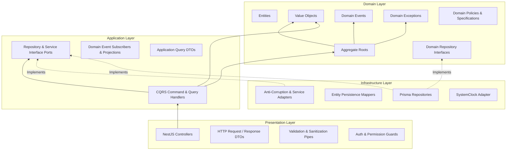
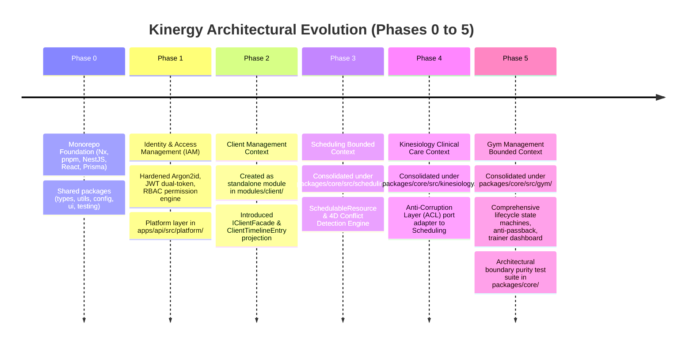

# Phase 6: Resources Management — Architectural Reconnaissance & Discovery (Phase 6.0)

- **Status**: Complete Architectural Discovery & Baseline
- **Milestone**: Phase 6.0 — Discovery & Baseline
- **Domain**: Phase 6 — Resources Management (Consumable Inventory & Fixed Assets)
- **Role**: Principal Software Architect / Staff Platform Engineer
- **Date**: 2026-08-24

---

## 1. Executive Summary

### 1.1 Objective & Context

This document establishes the authoritative architectural baseline for **Phase 6: Resources Management** of the **Kinergy Platform**. The business mandate for Phase 6 is to provide complete operational and financial visibility into **everything the business owns (Fixed Assets) and consumes (Consumable Inventory)** across clinical, fitness, and administrative operations.

Following the platform's strict engineering governance, **Milestone 6.0 is architecture discovery only**. No implementation code, database migrations, controllers, services, or frontend components have been created. This discovery systematically reviews the entire codebase across Phases 0 through 5 to ensure architectural continuity, identify reusable building blocks, document architectural constraints, catalog existing risks, and formulate precise integration boundaries for Phase 6.

### 1.2 Key Architectural Conclusions

1. **Structural Topology**: The platform operates as an Nx integrated monorepo with 10 established Nx projects (`apps/api`, `apps/web`, `modules/client`, `packages/core`, `packages/config`, `packages/testing`, `packages/types`, `packages/ui`, `packages/utils`, `packages/validation`). Core domain logic for multi-phase bounded contexts (`scheduling`, `kinesiology`, `gym`) is consolidated under `packages/core/src/<context>/`, while `modules/client/` represents an earlier standalone module package.
2. **Layering & Purity**: Strict inward Clean Architecture dependencies are enforced: **Presentation $\rightarrow$ Infrastructure $\rightarrow$ Application $\rightarrow$ Domain Kernel**. Pure domain layers forbid all external runtime dependencies (`@nestjs/*`, `@prisma/*`, Express). Automated architectural boundary tests (`gym-architecture-boundaries.spec.ts`, `kinesiology-architecture-boundaries.spec.ts`) actively verify these constraints in CI.
3. **Database & Cross-Context Decoupling**: Persistence is unified through a single PostgreSQL database via Prisma ORM (`prisma/schema.prisma`), but bounded contexts remain logically isolated. Cross-context entities are referenced strictly by scalar string identifiers (`clientId`, `therapistId`, `appointmentId`, `userId`) without relational foreign-key cascades across context boundaries.
4. **Pre-Existing SchedulableResource vs Phase 6 Assets**: Phase 3 (Scheduling) introduced `Room` and the `SchedulableResource` interface (`packages/core/src/scheduling/domain/resource/`) strictly for **calendar booking, capacity management, and turnaround buffer evaluation**. Phase 6 Fixed Assets represent **physical asset ownership, serial tracking, acquisition value, depreciation schedules, warranty tracking, and physical maintenance logs**. These two concepts must remain decoupled across bounded contexts.
5. **Existing Security & Permission Precedents**: The IAM seed catalog (`prisma/seeds/identity.seed.ts`) already provisions basic `inventory.read` and `inventory.write` permissions assigned to `Owner` and `Kitchen Staff`. Phase 6 must establish a refined, backward-compatible permission taxonomy (e.g., distinguishing consumable inventory management from capital asset depreciation and write-offs).

---

## 2. Repository Architecture

### 2.1 Workspace Structure & Project Boundaries

The codebase is structured as an **Nx integrated monorepo** managed with **pnpm** (`pnpm@11.17.0`, Node.js 24 per `.nvmrc`).

```
kinergy-platform/
├── apps/
│   ├── api/                  # NestJS 10 REST API application host
│   └── web/                  # React 18 + Vite 5 Single-Page Application host
├── modules/
│   └── client/               # Client Management Bounded Context package
├── packages/
│   ├── config/               # Zod-validated workspace environment configuration
│   ├── core/                 # Core domain bounded contexts (scheduling, kinesiology, gym)
│   ├── testing/              # Workspace-wide testing platform harnesses & fakes
│   ├── types/                # Core ambient types (Result<T, E>, Nullable<T>, EntityId)
│   ├── ui/                   # Shared UI component library & Radix design primitives
│   ├── utils/                # Shared pure utility functions
│   └── validation/           # Shared validation schemas & sanitizers
├── prisma/
│   ├── schema.prisma         # Unified database schema (PostgreSQL)
│   ├── migrations/           # Versioned migration history
│   └── seeds/                # Idempotent database seeders
├── infrastructure/           # Docker Compose, PostgreSQL 16 local environment
├── docs/                     # 80 ADRs, system architecture, and domain specifications
├── nx.json                   # Nx workspace cache, named inputs, and target defaults
├── pnpm-workspace.yaml       # pnpm monorepo package glob definitions
└── tsconfig.base.json        # Path aliases and strict TypeScript compilation settings
```

### 2.2 Project Registry Matrix (10 Projects)

| Project Name                      | Path                  | Type            | Primary Role                                        |
| :-------------------------------- | :-------------------- | :-------------- | :-------------------------------------------------- |
| `@kinergy-platform/source`        | Root                  | Root Meta       | Root scripts, dependencies, git hooks               |
| `apps/api`                        | `apps/api`            | Application     | Backend REST API host, DI composition root          |
| `apps/web`                        | `apps/web`            | Application     | Frontend SPA, routing, view composition             |
| `@kinergy-platform/client-domain` | `modules/client`      | Bounded Context | Client profile, demographic normalization, timeline |
| `@kinergy-platform/core`          | `packages/core`       | Domain Library  | Pure domain & application CQRS for Core Contexts    |
| `@kinergy-platform/config`        | `packages/config`     | Shared Lib      | Zod environment schema & typed configuration        |
| `@kinergy-platform/testing`       | `packages/testing`    | Shared Lib      | Test factories, in-memory repos, mock builders      |
| `@kinergy-platform/types`         | `packages/types`      | Shared Lib      | Common types (`Result<T, E>`, `Nullable<T>`)        |
| `@kinergy-platform/ui`            | `packages/ui`         | Shared Lib      | Radix primitives, styling tokens, button/dialog     |
| `@kinergy-platform/utils`         | `packages/utils`      | Shared Lib      | Pure string, date, object helper functions          |
| `@kinergy-platform/validation`    | `packages/validation` | Shared Lib      | Zod input sanitization & validation rules           |

### 2.3 Dependency Graph Rules

1. `packages/types`, `packages/utils`, `packages/config`, `packages/validation` are leaf packages with zero dependencies on domain or application packages.
2. `packages/core` depends only on `packages/types`, `packages/utils`, `packages/validation`, and `packages/config`.
3. `apps/api` and `apps/web` depend on shared packages and feature contexts.
4. Circular dependencies across packages or bounded contexts are strictly prohibited and prevented by Nx task graphs and TypeScript path aliases.

---

## 3. Backend Architecture

### 3.1 Layering Taxonomy

The backend implements strict **Clean Architecture / Hexagonal Architecture** with four distinct layers:



### 3.2 Backend Layer Invariants

1. **Domain Layer (`domain/`)**:
   - Must be **100% pure TypeScript**.
   - Strictly no imports of `@nestjs/*`, `@prisma/*`, `express`, or foreign bounded context domain models.
   - Encapsulates entity state; state modifications must occur through explicit domain methods (e.g., `membership.freeze()`, `treatmentSession.complete()`).
   - Every aggregate root implements optimistic concurrency control via an integer `version` field.
2. **Application Layer (`application/`)**:
   - Implements CQRS command handlers (`*Handler`) and query handlers (`*QueryHandler` / `*Handler`).
   - Declares output ports (interfaces) for persistence (`IRepository`), external bounded context queries, and event dispatchers.
   - Forbids direct database ORM access (`@prisma/client` or `PrismaService` forbidden in application files).
3. **Infrastructure Layer (`infrastructure/`)**:
   - Implements application/domain ports using Prisma ORM (`Prisma<Aggregate>Repository`).
   - Performs two-way mapping between database records and domain aggregates via dedicated mappers (`<Aggregate>Mapper.toDomain()` and `<Aggregate>Mapper.toPersistence()`).
   - Isolates database transaction logic (`$transaction`) and database error translation.
4. **Presentation Layer (`apps/api/src/<context>/` / `presentation/`)**:
   - Thin NestJS controllers mapped to HTTP routes.
   - Applies decorators for security (`@UseGuards(AuthenticationGuard)`, `@RequirePermissions(...)`).
   - Transforms incoming HTTP payloads to application command/query DTOs and delegates execution to CQRS handlers.
   - Controllers never execute business logic or access Prisma directly.

### 3.3 Backend Cross-Cutting Platform Infrastructure

Located in `apps/api/src/platform/`:

- **Identity (`apps/api/src/platform/identity/`)**: Authentication guards (`AuthenticationGuard`), permission evaluators (`AuthorizationEvaluator`), token services, request context (`ReqUser`).
- **Persistence (`apps/api/src/platform/persistence/`)**: Global `PrismaService` extending `PrismaClient` with lifecycle hooks.
- **Logging (`apps/api/src/platform/logging/`)**: Structured `ILoggerPort` and `PlatformLoggerService`.
- **Audit (`apps/api/src/platform/audit/`)**: `IAuditService` for auditable event recording.
- **Rate Limiting (`apps/api/src/platform/rate-limiting/`)**: Throttler guards protecting public and authenticated endpoints.
- **Web Security (`apps/api/src/platform/web-security/`)**: Production Helmet security headers, CORS origin resolution.

---

## 4. Frontend Architecture

### 4.1 Framework & Core Technologies

- **Host**: React 18.3.1 Single-Page Application bundled with Vite 5.4.11 (`apps/web`).
- **Styling**: Tailwind CSS 3.4.17 with CSS variables and `@kinergy-platform/ui` design tokens.
- **Component Primitives**: Radix UI primitives (`@radix-ui/react-dialog`, `@radix-ui/react-slot`), Lucide React icons.
- **Data Fetching & Server State**: TanStack React Query 5.62.0.
- **Forms & Validation**: React Hook Form 7.54.0 with `@hookform/resolvers/zod` and Zod 3.24.1.
- **Routing**: React Router DOM 6.28.0 using hybrid feature routing.

### 4.2 Frontend Module Organization

Frontend feature code is strictly partitioned by bounded context under `apps/web/src/modules/`:

```
apps/web/src/modules/
├── analytics/         # Cross-context reporting & KPI dashboards
├── attendance/        # Gym check-in reception workstation (ADR-0069)
├── auth/              # Login, token recovery, session lifecycle (ADR-0041/42)
├── client/            # Client registration, profile management, timeline
├── dashboard/         # Role-based workspace home views
├── energy/            # Energy & utility tracking
├── gym/               # Membership plans, client memberships, trainer dashboard
├── identity/          # User administration, role & permission management
├── kinesiology/       # Clinical treatment sessions & SOAP workspace
└── settings/          # Facility configuration & system preferences
```

### 4.3 Standardized Frontend Contracts (ADR-0071 & ADR-0072)

1. **4-State UI Contract**: Every list and detail view must explicitly handle all 4 lifecycle states:
   - `LOADING`: Render standardized skeleton loaders (`CrudLoading`).
   - `ERROR`: Render structured error banners with retry action (`CrudError`).
   - `EMPTY`: Render contextual empty states with actionable primary buttons (`CrudEmpty`).
   - `DATA`: Render populated data tables or detail cards.
2. **Unified CRUD Composition**: Standardized layout wrappers in `apps/web/src/shared/crud/` (`CrudListLayout`, `CrudListHeader`, `CrudFormLayout`, `CrudFormHeader`).
3. **Query Key Factory Pattern**: All TanStack Query keys must be centralized in typed factory objects per feature module (e.g., `resourceKeys.all`, `resourceKeys.lists()`, `resourceKeys.detail(id)`).
4. **Optimistic UX Decision Policy (ADR-0072)**: Optimistic mutations are strictly reserved for low-risk, reversible operations (e.g., toggling tags, UI preferences). High-stakes state transitions, stock adjustments, financial transactions, and asset disposals require **pessimistic UI mutations** with loading indicators.

---

## 5. Shared Infrastructure

### 5.1 Shared Libraries (`packages/`)

| Library                            | Key Exports                                                           | Usage Rule                                   |
| :--------------------------------- | :-------------------------------------------------------------------- | :------------------------------------------- |
| **`@kinergy-platform/types`**      | `Result<T, E>`, `Nullable<T>`, `Optional<T>`, `EntityId`, `ThemeMode` | Workspace-wide universal type primitives     |
| **`@kinergy-platform/utils`**      | `formatDate`, `isNonEmptyString`                                      | Pure, side-effect-free helper functions      |
| **`@kinergy-platform/validation`** | `InputSanitizer`, Zod sanitizers                                      | Shared validation schemas and sanitization   |
| **`@kinergy-platform/config`**     | `envSchema`, configuration parsers                                    | Typed environment variable validation        |
| **`@kinergy-platform/ui`**         | `Button`, `Dialog`, `Card`, `Badge`, `Input`, `Table`                 | Shared Radix/Tailwind component primitives   |
| **`@kinergy-platform/testing`**    | `TestDatabaseHelper`, `MockFactory`, `AssertionHelpers`               | Standardized test fixtures and mock builders |

### 5.2 Persistence & Database Architecture (`prisma/`)

- **ORM**: Prisma 6.3.1 with PostgreSQL 16.
- **Schema Topology**: Single monolithic schema file (`prisma/schema.prisma`) maintaining all platform tables.
- **Naming Conventions**: PascalCase model names (`MembershipPlan`), snake_case database table mappings (`@@map("membership_plans")`), snake_case column mappings (`@map("created_at")`).
- **Isolation Constraint**: Models belonging to different bounded contexts must not establish hard relational foreign-key constraints (`@relation`) if cross-context cascades would violate aggregate boundaries. Scalar ID columns (`client_id String`, `therapist_id String`, `user_id String`) are used instead.

---

## 6. Phase 0–5 Architectural Evolution

To ensure Phase 6 adopts current best practices while avoiding historical detours, the evolutionary path across previous phases was analyzed:



### 6.1 Evolution Observations

1. **Module Placement Transition**:
   - Phase 2 created `modules/client/` with its own `package.json` and Nx project.
   - Phases 3, 4, and 5 placed domain/application logic inside subdirectories of `packages/core` (`packages/core/src/scheduling/`, `packages/core/src/kinesiology/`, `packages/core/src/gym/`).
   - _Implication for Phase 6_: Core domain logic for Resources Management should be placed in `packages/core/src/resources/` (or `packages/core/src/inventory/` and `packages/core/src/assets/`), matching the mature Phase 3–5 pattern.
2. **Facade & ACL Evolution**:
   - Phase 2 established in-process synchronous facades (`IClientFacade`).
   - Phase 4 formalized Customer-Supplier Anti-Corruption Ports (`ISchedulingAppointmentLookupPort` $\rightarrow$ `SchedulingAppointmentLookupAdapter`).
   - Phase 5 established comprehensive boundary purity tests (`gym-architecture-boundaries.spec.ts`) asserting zero foreign imports in domain layers.

---

## 7. Existing Reusable Patterns

The following mature patterns must be reused in Phase 6:

### 7.1 Pattern Catalog

| Pattern                                         | Description                                                                                                                                          | Proven Reference in Codebase                                                                                                                            |
| :---------------------------------------------- | :--------------------------------------------------------------------------------------------------------------------------------------------------- | :------------------------------------------------------------------------------------------------------------------------------------------------------ |
| **Pure Domain Aggregate with Versioning**       | Domain entity with private constructor, static `create()`/`reconstitute()`, and integer `_version` counter for Optimistic Concurrency Control (OCC). | `Membership` (`packages/core/src/gym/domain/membership/membership.aggregate.ts`), `Room` (`packages/core/src/scheduling/domain/room/room.aggregate.ts`) |
| **Strongly-Typed Value Objects**                | Immutable value objects with self-contained validation returning domain instances or throwing domain exceptions.                                     | `Money`, `FreezeWindow`, `TimeRange`, `ResourceId`                                                                                                      |
| **In-Process Interface Ports & Tokens**         | Decoupling application handlers from infrastructure adapters via TypeScript interfaces and string injection tokens.                                  | `CLIENT_LOOKUP_PORT_TOKEN`, `MEMBERSHIP_REPOSITORY_TOKEN`                                                                                               |
| **Anti-Corruption Layer (ACL)**                 | Translating external upstream query models into consumer-specific internal DTOs.                                                                     | `SchedulingAppointmentLookupAdapter` (`packages/core/src/kinesiology/infrastructure/`)                                                                  |
| **Client Activity Timeline Integration Events** | Emitting immutable integration events with `schemaVersion: 1 as const` to project activity onto client timelines.                                    | `TreatmentSessionCompletedEvent` (`packages/core/src/kinesiology/domain/events/`)                                                                       |
| **Boundary Purity Automated Tests**             | Jest test suite using file system inspection to verify zero prohibited imports in domain and application layers.                                     | `gym-architecture-boundaries.spec.ts` (`packages/core/src/gym/`)                                                                                        |
| **4-State UI & CRUD Layout Components**         | Unified React wrappers for loading, error, empty, and data states.                                                                                   | `CrudListLayout`, `CrudStateView` (`apps/web/src/shared/crud/`)                                                                                         |
| **In-Memory Repository Test Harnesses**         | Standalone Map-based in-memory repository fakes allowing instant, isolated unit and handler testing.                                                 | `DefaultGymMembershipRepository`, `packages/testing/src/database/`                                                                                      |

---

## 8. Existing Architectural Constraints

The repository strictly enforces the following hard constraints that govern Phase 6 design:

1. **Pure Domain Isolation**:
   - `domain/` code must never import `@nestjs/*`, `@prisma/*`, Express, Fastify, or external HTTP clients.
2. **Zero Cross-Context Aggregate Nesting**:
   - An Aggregate Root in Phase 6 must never embed instances of aggregates from Client, Identity, Scheduling, or Gym. Foreign references must be scalar strings (`clientId: string`, `recordedByUserId: string`, `roomId: string`).
3. **Zero Distributed Transactions**:
   - Transactions must remain local to individual database repositories or single-bounded-context units of work. No 2-phase commits ($2\text{PC}$) or cross-context database locking.
4. **Decoupled Schedulable Resource Identity**:
   - Schedulable physical spaces and equipment evaluated by Scheduling (`SchedulableResource`) must not be duplicated or tightly bound to Fixed Asset accounting models. If an asset is schedulable, the connection must be established via scalar reference (`resourceId: string` $\leftrightarrow$ `assetId: string`).
5. **Role & Permission Matrix Alignment**:
   - Route handlers and UI actions must map to the platform permission framework (`@RequirePermissions(...)`).
6. **No Direct Prisma in Controllers or Web Views**:
   - API controllers must delegate to CQRS handlers; Web views must communicate exclusively through API client HTTP requests.

---

## 9. Existing Architectural Risks

| #      | Risk Description                       | Root Cause                                                                                                                            | Impact                                                        | Recommended Mitigation                                                                                                                                                                  |
| :----- | :------------------------------------- | :------------------------------------------------------------------------------------------------------------------------------------ | :------------------------------------------------------------ | :-------------------------------------------------------------------------------------------------------------------------------------------------------------------------------------- |
| **R1** | **Monolithic Prisma Schema Drift**     | All bounded contexts share `prisma/schema.prisma`. Developers may add cross-context relational foreign keys.                          | Violates context boundaries, couples database migrations.     | Maintain strict schema review rule: use scalar ID fields without `@relation` across context boundaries.                                                                                 |
| **R2** | **Overlapping "Resource" Terminology** | Phase 3 defines `ResourceType` and `SchedulableResource` for scheduling; Phase 6 defines "Resources Management" (Inventory & Assets). | Domain vocabulary ambiguity and semantic confusion.           | Establish canonical vocabulary in Milestone 6.1 clearly separating `SchedulableResource` (calendar availability) from `FixedAsset` (asset lifecycle) and `InventoryItem` (consumables). |
| **R3** | **Premature Optimistic UI Mutations**  | Modifying stock levels or asset lifecycle states optimistically in the frontend UI.                                                   | Inconsistent stock state, race conditions in stock depletion. | Enforce ADR-0072: stock adjustments and asset status changes must use pessimistic mutations.                                                                                            |
| **R4** | **Legacy Permission Fragmentation**    | `prisma/seeds/identity.seed.ts` contains legacy permissions `inventory.read` and `inventory.write`.                                   | May conflict with granular asset/inventory permissions.       | Define backward-compatible permission mappings in Phase 6 IAM alignment.                                                                                                                |

---

## 10. Phase 6 Implications

### 10.1 Domain Partitioning Strategy

Phase 6 must be divided into two well-defined sub-domains under the Resources Management umbrella:

```mermaid
graph TD
    subgraph "Phase 6: Resources Management Bounded Context"
        subgraph "Sub-Domain 1: Consumable Inventory"
            INV_ITEM[InventoryItem Aggregate Root]
            STOCK_LVL[StockLevel / Location Value Objects]
            STOCK_TX[StockTransaction / Adjustment Entity]
            SUPPLIER[Supplier / Vendor Reference]
            BATCH[Batch / Lot Tracking Value Object]
        end

        subgraph "Sub-Domain 2: Fixed Assets"
            ASSET[FixedAsset Aggregate Root]
            ASSET_TAG[AssetTag / SerialNumber Value Objects]
            DEPREC[DepreciationSchedule Value Object]
            MAINT_LOG[AssetMaintenanceRecord Entity]
            ASSET_STATUS[AssetStatus: OPERATIONAL | MAINTENANCE | DECOMMISSIONED | DISPOSED]
        end
    end

    subgraph "External Bounded Contexts"
        IAM[IAM: User / Staff Actor IDs]
        SCHED[Scheduling: Room / SchedulableResource IDs]
        CLINICAL[Kinesiology: Treatment Session Supply Consumption]
    end

    INV_ITEM -->|logged by actorId| IAM
    ASSET -->|custodian / assignedTo userId| IAM
    ASSET -.->|optional scalar link to roomId / resourceId| SCHED
    CLINICAL -.->|consumes inventory via scalar itemId| INV_ITEM
```

### 10.2 Recommended Package Placement

- **Domain & Application**: `packages/core/src/resources/` (with subdirectories `inventory/` and `assets/`, or dedicated top-level directories).
- **Backend Presentation**: `apps/api/src/resources/` (with controllers `inventory.controller.ts`, `assets.controller.ts`, and `resources.module.ts`).
- **Frontend Presentation**: `apps/web/src/modules/resources/` (or `inventory/` and `assets/`).
- **Public Exports**: Re-exported through `@kinergy-platform/core` root barrel.

---

## 11. Evidence Index

Every finding and conclusion in this report is backed by direct repository evidence:

| Finding ID | Finding                                          | Concrete Repository Evidence                                                                                 | File Location                                   | Confidence      | Architectural Implication                                                                                          |
| :--------- | :----------------------------------------------- | :----------------------------------------------------------------------------------------------------------- | :---------------------------------------------- | :-------------- | :----------------------------------------------------------------------------------------------------------------- |
| **EVD-01** | Nx Integrated Monorepo with 10 projects          | `pnpm-workspace.yaml`, `nx.json`, `package.json`, `tsconfig.base.json`                                       | Root workspace config                           | **100% (FACT)** | Phase 6 must adhere to established package path mappings and project configurations.                               |
| **EVD-02** | Clean Architecture 4-Layer Purity                | `packages/core/src/gym/gym-architecture-boundaries.spec.ts`                                                  | `packages/core/src/gym/`                        | **100% (FACT)** | Phase 6 must author boundary tests ensuring zero framework/database imports in domain code.                        |
| **EVD-03** | Existing `SchedulableResource` abstraction       | `ResourceType` enum (`ROOM`, `EQUIPMENT`), `SchedulableResource` interface                                   | `packages/core/src/scheduling/domain/resource/` | **100% (FACT)** | Scheduling resource model is for calendar availability; Phase 6 Fixed Assets model is for asset lifecycle/finance. |
| **EVD-04** | Single Prisma schema with scalar references      | Models `User`, `Client`, `Appointment`, `TreatmentSession`, `Membership`, `AttendanceRecord`                 | `prisma/schema.prisma`                          | **100% (FACT)** | Phase 6 models must be added to `schema.prisma` without foreign-key cascade dependencies on foreign contexts.      |
| **EVD-05** | Pre-existing `inventory.*` permissions           | `PERMISSION_CATALOG` includes `inventory.read` and `inventory.write` assigned to `Owner` and `Kitchen Staff` | `prisma/seeds/identity.seed.ts`                 | **100% (FACT)** | Phase 6 authorization design must preserve or cleanly extend existing seeded permissions.                          |
| **EVD-06** | Standardized 4-State CRUD UI framework           | `CrudListLayout`, `CrudLoading`, `CrudError`, `CrudEmpty`, `CrudStateView`                                   | `apps/web/src/shared/crud/`                     | **100% (FACT)** | Phase 6 frontend views must implement the standard 4-state contract using shared CRUD components.                  |
| **EVD-07** | Strict TypeScript and quality gate configuration | `pnpm validate` runs `format:check`, `lint`, `typecheck`, `test`, `build`                                    | `package.json`, `.github/workflows/ci.yml`      | **100% (FACT)** | All Phase 6 additions must pass 100% of workspace quality gates.                                                   |

---

## 12. Open Questions

The following architectural and business questions must be addressed during **Milestone 6.1 (Domain Design & Aggregate Modeling)**:

### 12.1 Domain & Aggregate Boundaries

- **OQ-1 [Domain Modeling]**: Should Consumable Inventory and Fixed Assets be modeled as two separate aggregate roots within a single unified `Resources` bounded context, or as two distinct bounded contexts (`Inventory` and `Assets`)?
  - _Architectural Recommendation_: Model as two distinct aggregate roots (`InventoryItem` and `FixedAsset`) under a unified `Resources` bounded context (`packages/core/src/resources/`) sharing common supplier and location primitives.
- **OQ-2 [Location & Facility Hierarchy]**: Does the platform require a shared multi-location/facility model (e.g., Warehouse, Clinic Branch, Treatment Room Cabinet, Reception Desk) for stock distribution, or is location represented as a simple value object / string tag in Phase 6?
- **OQ-3 [Unit of Measurement & Batch Tracking]**: Does Consumable Inventory require strict batch/lot number tracking with expiration dates (crucial for clinical rehabilitation supplies, kinesiology tape, sanitizers) from day one, or is basic quantity-on-hand tracking sufficient for the initial baseline?
  - _Architectural Recommendation_: Model `LotBatch` as an optional value object collection on stock transactions to accommodate clinical compliance without overburdening simple consumables.

### 12.2 Cross-Context Integrations

- **OQ-4 [Clinical Supply Consumption Link]**: When a Kinesiology `TreatmentSession` is completed, how should supplies used during the session (e.g., electrodes, therapeutic oils, exercise bands) be recorded in Inventory?
  - _Architectural Recommendation_: Via asynchronous integration event (`TreatmentSessionCompletedEvent`) or an explicit stock consumption command referencing scalar `treatmentSessionId: string`.
- **OQ-5 [Asset Scheduling Link]**: How should a physical Fixed Asset (e.g., an advanced rehabilitation ultrasound machine) be linked to a Scheduling `SchedulableResource`?
  - _Architectural Recommendation_: Loose coupling via scalar identifier reference (`schedulableResourceId?: string` stored on `FixedAsset`), avoiding shared database tables.

### 12.3 Authorization & Roles

- **OQ-6 [Permission Granularity]**: The existing seed dataset has `inventory.read` and `inventory.write` for Kitchen Staff and Owner. Should Phase 6 introduce `assets.read`, `assets.write`, `assets.depreciate`, `assets.dispose`, and `inventory.adjust`?
  - _Architectural Recommendation_: Introduce granular permissions in the permission catalog while aliasing or including legacy `inventory.*` permissions for backward compatibility.

---

## 13. Next Steps & Milestone 6.1 Roadmap

1. **Milestone 6.0 Approval**: Complete architectural discovery review and formal sign-off.
2. **Milestone 6.1-A**: Canonical Domain Vocabulary & Ubiquitous Language definition (`docs/business/resources-vocabulary.md`).
3. **Milestone 6.1-B**: Bounded Context Ownership & Context Map Specification (`docs/architecture/contexts/resources.md`).
4. **Milestone 6.1-C**: Aggregate Discovery, Boundaries & Invariant Models (`docs/architecture/resources-aggregate-boundaries.md`).
5. **Milestone 6.1-D**: Architectural Decision Records authoring (ADR-0081 through ADR-0084+).
6. **Milestone 6.2+**: Domain Kernel implementation, persistence mapping, application CQRS handlers, REST API endpoints, and frontend CRUD views.
