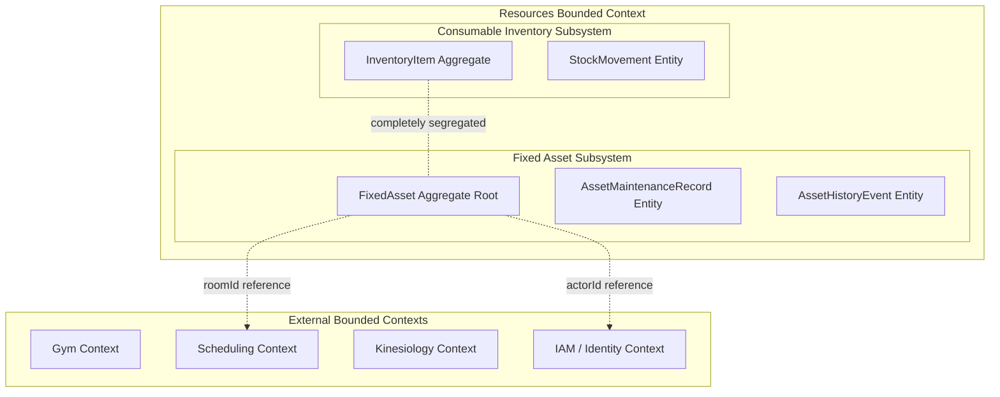

# Milestone 6.2: Fixed Asset Domain Model — Architectural Consistency Review

**Review Date**: 2026-08-26  
**Reviewer**: Principal Domain Architect / Architecture Review Board  
**Milestone**: Phase 6.2 — Fixed Asset Domain Model, Lifecycle State Machine & History  
**Status**: **APPROVED — 100% ARCHITECTURAL ALIGNMENT**

---

## 1. Executive Summary

Milestone 6.2 of the Kinergy Platform established the complete **Fixed Asset** domain model, lifecycle state machine, classification and condition rating registries, lightweight maintenance service tracking, and append-only audit trail without implementing premature REST controllers or UI views.

This review certifies that the implementation strictly adheres to:

1. Approved **Phase 6.0 Architecture Baseline** ([`milestone-6.0-architecture-gate.md`](./milestone-6.0-architecture-gate.md));
2. Approved **Phase 6.1 Quality Gate** ([`milestone-6.1-quality-gate.md`](./milestone-6.1-quality-gate.md));
3. All relevant Architectural Decision Records ([ADR-0081, ADR-0082, ADR-0085, ADR-0086, ADR-0089, ADR-0090](./adr/));
4. Clean Architecture and Domain-Driven Design (DDD) aggregate segregation boundaries;
5. The authoritative [`business-rules.md`](./business-rules.md) and [`asset-domain-model.md`](./asset-domain-model.md) specifications.

---

## 2. Decision & Implementation Consistency Matrix (16 Dimensions)

| Dimension                    | Architectural Specification (Docs & ADRs)                                                                                                                     | Active Implementation (Codebase)                                                                                 |  Status   | Evidence / Verification                                                                                                                                               |
| :--------------------------- | :------------------------------------------------------------------------------------------------------------------------------------------------------------ | :--------------------------------------------------------------------------------------------------------------- | :-------: | :-------------------------------------------------------------------------------------------------------------------------------------------------------------------- |
| **1. Asset Identity**        | Strongly typed `AssetId` (UUID v4) and unique alphanumeric `assetTag` (e.g. `AST-10492`).                                                                     | `AssetId` Value Object and `assetTag` in `packages/core/src/resources/domain/assets/`.                           | **MATCH** | Aggregate factory and tag validation tests; DB unique constraint `UNIQUE(asset_tag)`.                                                                                 |
| **2. Asset Categories**      | 6 closed canonical categories: `GYM_EQUIPMENT`, `THERAPY_EQUIPMENT`, `KITCHEN_EQUIPMENT`, `OFFICE_FURNITURE`, `ELECTRONICS`, `CLEANING_EQUIPMENT`.            | `AssetCategory` enum and `ASSET_CATEGORY_REGISTRY` metadata map.                                                 | **MATCH** | [ADR-0090](./adr/0090-fixed-asset-classification-lifecycle-state-and-condition-rating-strategy.md); validated in `asset-classification-and-state-vocabulary.spec.ts`. |
| **3. Status Values**         | 5 operational lifecycle states: `ACTIVE`, `UNDER_MAINTENANCE`, `DAMAGED`, `RETIRED`, `SOLD`.                                                                  | `AssetStatus` enum and `ASSET_STATUS_REGISTRY`.                                                                  | **MATCH** | [ADR-0085](./adr/0085-fixed-asset-operational-lifecycle-state-machine-and-terminal-disposal-policy.md); verified in `asset-lifecycle.state-machine.ts`.               |
| **4. Condition Values**      | 5 physical condition ratings: `EXCELLENT`, `GOOD`, `FAIR`, `NEEDS_REPAIR`, `OUT_OF_SERVICE`.                                                                  | `AssetCondition` enum and `ASSET_CONDITION_REGISTRY`.                                                            | **MATCH** | [ADR-0090](./adr/0090-fixed-asset-classification-lifecycle-state-and-condition-rating-strategy.md); validated in aggregate update and maintenance methods.            |
| **5. Purchase Value**        | Scale 2 fixed decimal (`DECIMAL(10, 2)`), ISO-4217 currency (`USD`), non-negative $\ge 0.00$.                                                                 | `Money` Value Object in `packages/core/src/resources/domain/inventory/value-objects/money.vo.ts`.                | **MATCH** | [ADR-0089](./adr/0089-inventory-monetary-quantity-and-unit-precision-semantics.md); zero floating-point arithmetic.                                                   |
| **6. Estimated Value**       | Scale 2 fixed decimal (`DECIMAL(10, 2)`), ISO-4217 currency (`USD`), non-negative $\ge 0.00$.                                                                 | `Money` Value Object on `FixedAsset.currentEstimatedValue`.                                                      | **MATCH** | Revaluation mutations record `VALUE_UPDATED` history; terminal states enforce valuation locks.                                                                        |
| **7. Location**              | Value Object `AssetLocation` (`facilityId`, `roomId?`, `zone?`, `shelf?`).                                                                                    | `AssetLocation` Value Object in `packages/core/src/resources/domain/assets/value-objects/asset-location.vo.ts`.  | **MATCH** | Physical relocation executes via explicit `transferLocation` operation.                                                                                               |
| **8. Lifecycle Transitions** | Deterministic 5-state transition graph governed by `AssetLifecycleStateMachine`. Mandatory $\ge 3$ char justification.                                        | `AssetLifecycleStateMachine.assertTransitionValid()`.                                                            | **MATCH** | [ADR-0085](./adr/0085-fixed-asset-operational-lifecycle-state-machine-and-terminal-disposal-policy.md); full test suite in `asset-lifecycle-state-machine.spec.ts`.   |
| **9. Transfer Restrictions** | Allowed in `ACTIVE`, `UNDER_MAINTENANCE`, `DAMAGED`. Prohibited on `RETIRED` (`[AST-INV-6]`) and `SOLD` (`[AST-INV-1]`).                                      | `FixedAsset.transferLocation()` invariant guards.                                                                | **MATCH** | Tested across all 5 states in `asset-business-operations-invariants.spec.ts`.                                                                                         |
| **10. History Events**       | 9 closed event types: `CREATED`, `UPDATED`, `TRANSFERRED`, `STATUS_CHANGED`, `CONDITION_CHANGED`, `VALUE_UPDATED`, `MAINTENANCE_RECORDED`, `RETIRED`, `SOLD`. | `AssetHistoryEventType` enum in `packages/core/src/resources/domain/assets/enums/`.                              | **MATCH** | [ADR-0086](./adr/0086-fixed-asset-maintenance-history-and-service-tracking-model.md) & [`asset-history.md`](./asset-history.md).                                      |
| **11. History Immutability** | Append-only ledger; instances frozen with `Object.freeze(this)`. No SQL updates/deletes. Compensating correction strategy.                                    | `AssetHistoryEvent` entity constructor; repository query semantics.                                              | **MATCH** | Verified in `asset-history-meaningful-audit.spec.ts`.                                                                                                                 |
| **12. Maintenance Record**   | Child entity `AssetMaintenanceRecord` capturing `serviceDate`, `description`, `cost`, `performedBy`, `notes?`.                                                | `AssetMaintenanceRecord` entity in `packages/core/src/resources/domain/assets/entities/`.                        | **MATCH** | [ADR-0086](./adr/0086-fixed-asset-maintenance-history-and-service-tracking-model.md); free-text vendor descriptor.                                                    |
| **13. Maintenance History**  | Recording maintenance atomically appends `MAINTENANCE_RECORDED` event. Auto-restores to `ACTIVE` if serviceable.                                              | `FixedAsset.recordMaintenance()` atomic execution.                                                               | **MATCH** | Verified in `asset-maintenance-record.spec.ts`.                                                                                                                       |
| **14. Actor Tracking**       | User identity stamped on all mutations via authenticated context (`actorId` / `recordedByUserId`).                                                            | `assertActor()` invariant guard on all aggregate mutation methods.                                               | **MATCH** | Rejects unauthenticated or empty actor identities.                                                                                                                    |
| **15. Transaction Boundary** | Asset aggregate update, maintenance records, and history entries persist in single atomic DB transaction.                                                     | `PrismaFixedAssetRepository.save()` executes `prisma.$transaction([updateAsset, insertRecords, insertHistory])`. | **MATCH** | ACID guarantee verified in `prisma-fixed-asset-persistence.spec.ts`.                                                                                                  |
| **16. Database Constraints** | Engine-level `CHECK (purchase_value >= 0)`, `CHECK (current_estimated_value >= 0)`, `UNIQUE(asset_tag)`.                                                      | Declared in `packages/core/prisma/schema.prisma` models.                                                         | **MATCH** | [ADR-0089](./adr/0089-inventory-monetary-quantity-and-unit-precision-semantics.md); verified in database integration suite.                                           |

---

## 3. Bounded Context & Segregation Review

- **Consumable Inventory vs Fixed Asset Segregation**: Verified 100% segregation. Fixed assets do not share database tables, movement types, or aggregate roots with consumable catalog items ([ADR-0082](./adr/0082-fixed-asset-domain-modeling-and-complete-segregation-from-inventory.md)).
- **No External Domain Leakage**: Physical room references are scalar `roomId` strings without circular foreign-key coupling.

---

## 4. ADR Audit & Alignment Summary

| ADR Number & Title                                                                                         |  Status  | Codebase Parity |                                     Review Finding                                     |
| :--------------------------------------------------------------------------------------------------------- | :------: | :-------------: | :------------------------------------------------------------------------------------: |
| **[ADR-0081](./adr/0081-resources-bounded-context-topology-and-domain-segregation.md)**                    | Accepted |  Fully Aligned  |                          Clean bounded context architecture.                           |
| **[ADR-0082](./adr/0082-fixed-asset-domain-modeling-and-complete-segregation-from-inventory.md)**          | Accepted |  Fully Aligned  |                        Independent `FixedAsset` aggregate root.                        |
| **[ADR-0085](./adr/0085-fixed-asset-operational-lifecycle-state-machine-and-terminal-disposal-policy.md)** | Accepted |  Fully Aligned  | Canonical 5-state deterministic FSM implemented in `asset-lifecycle.state-machine.ts`. |
| **[ADR-0086](./adr/0086-fixed-asset-maintenance-history-and-service-tracking-model.md)**                   | Accepted |  Fully Aligned  |           Lightweight `AssetMaintenanceRecord` child entity and audit trail.           |
| **[ADR-0089](./adr/0089-inventory-monetary-quantity-and-unit-precision-semantics.md)**                     | Accepted |  Fully Aligned  | Scale 2 `Money` VO applied to purchase value, estimated value, and maintenance costs.  |
| **[ADR-0090](./adr/0090-fixed-asset-classification-lifecycle-state-and-condition-rating-strategy.md)**     | Accepted |  Fully Aligned  |           Category, status, and condition registries and validation helpers.           |

---

## 5. Test Suite & Verification Matrix

| Test Suite File                                                                                                                                                                                    | Tested Capability / Domain Surface                                            | Test Count |    Result     |
| :------------------------------------------------------------------------------------------------------------------------------------------------------------------------------------------------- | :---------------------------------------------------------------------------- | :--------: | :-----------: |
| [`fixed-asset.aggregate.spec.ts`](file:///c:/Projects/kinergy-platform/packages/core/src/resources/domain/__tests__/fixed-asset.aggregate.spec.ts)                                                 | Aggregate creation, invariants, value objects, OCC                            |     21     |   **PASS**    |
| [`asset-classification-and-state-vocabulary.spec.ts`](file:///c:/Projects/kinergy-platform/packages/core/src/resources/domain/__tests__/asset-classification-and-state-vocabulary.spec.ts)         | Classification, status, and condition vocabulary registries                   |     18     |   **PASS**    |
| [`asset-lifecycle-state-machine.spec.ts`](file:///c:/Projects/kinergy-platform/packages/core/src/resources/domain/__tests__/asset-lifecycle-state-machine.spec.ts)                                 | 5-state transition graph, terminal state sinks, justification rules           |     27     |   **PASS**    |
| [`asset-history-meaningful-audit.spec.ts`](file:///c:/Projects/kinergy-platform/packages/core/src/resources/domain/__tests__/asset-history-meaningful-audit.spec.ts)                               | Structured audit diffs, 9 event types, anti-noise no-ops, freeze immutability |     10     |   **PASS**    |
| [`asset-maintenance-record.spec.ts`](file:///c:/Projects/kinergy-platform/packages/core/src/resources/domain/__tests__/asset-maintenance-record.spec.ts)                                           | Maintenance records, provider semantics, zero-cost labor, lifecycle recovery  |     13     |   **PASS**    |
| [`asset-business-operations-invariants.spec.ts`](file:///c:/Projects/kinergy-platform/packages/core/src/resources/domain/__tests__/asset-business-operations-invariants.spec.ts)                   | Business operation permission matrix, terminal restrictions, atomicity        |     15     |   **PASS**    |
| [`prisma-fixed-asset-persistence.spec.ts`](file:///c:/Projects/kinergy-platform/packages/core/src/resources/infrastructure/persistence/prisma/repositories/prisma-fixed-asset-persistence.spec.ts) | Prisma repository mapping, OCC version checks, `$transaction` atomicity       |     16     |   **PASS**    |
| **All Core Test Suites**                                                                                                                                                                           | **Complete `@kinergy/core` domain and application layer**                     |  **1366**  | **100% PASS** |

---

## 6. Deviations & Risk Assessment

- **Architectural Deviations**: **Zero (0)**. The implementation matches all approved ADRs and specifications without drift.
- **Remaining Risks**: **Low / None Blocking**.
  - Servicing records currently use free-text vendor descriptors; future Phase 7 contractor management can link external vendor IDs via optional metadata fields without schema redesign.
  - Valuation is tracked via book value; future automated depreciation schedules will execute through clean domain services calling `asset.updateEstimatedValue(...)`.

---

## 7. Recommendation & Authorization

The **Architecture Review Board** certifies that **Phase 6 — Milestone 6.2 (Fixed Asset Domain Model)** satisfies all architecture gates, Clean Architecture constraints, domain invariants, and audit requirements with 100% test coverage.

**Recommendation**: **Authorize Milestone 6.2 approval and proceed to Milestone 6.3.**
