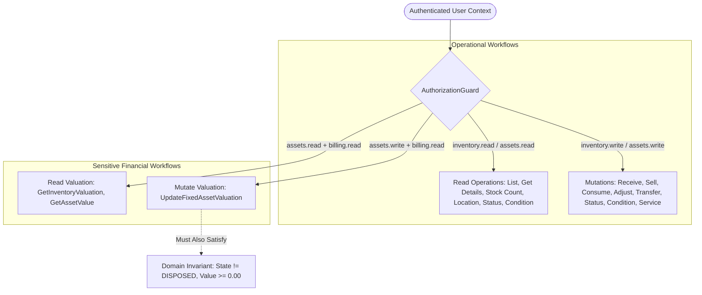

# Resource Sensitive Valuation Data Policy & Business Boundaries

## Status

`APPROVED — ARCHITECTURAL POLICY`

---

## 1. Executive Summary & Objective

In modern multi-tenant enterprise resource management, operational workflows (e.g. equipment maintenance, physical inventory counts, treatment supply consumption, room transfers) must be decoupled from sensitive financial balance sheet valuation and acquisition cost visibility. Operational staff members (such as trainers, therapists, kitchen staff, and front-desk receptionists) require full visibility into physical stock levels, asset status, equipment condition, and locations to perform daily duties. However, exposing acquisition unit costs, supplier invoice figures, cumulative inventory capital investments, or asset depreciation write-downs to operational staff introduces severe confidentiality and financial compliance risks.

This document defines the authoritative security policy, response-shaping architecture, and multi-tenant business boundary enforcement for sensitive resource valuation data in Phase 6 (Resources Management).

---

## 2. Sensitive Fields Evaluated

| Domain                   | Entity / Model       | Field / Metric            | Confidentiality Classification | Business Justification & Risk                                                                                           |
| :----------------------- | :------------------- | :------------------------ | :----------------------------- | :---------------------------------------------------------------------------------------------------------------------- |
| **Consumable Inventory** | `InventoryItem`      | `purchaseCost`            | `RESTRICTED_FINANCIAL`         | Wholesale acquisition cost per unit. Leaking wholesale supplier pricing damages vendor negotiations and margin privacy. |
| **Consumable Inventory** | `InventoryItem`      | `sellingPrice`            | `OPERATIONAL_COMMERCIAL`       | Retail point-of-sale catalog price. Operational staff require this for client checkouts and billing POS.                |
| **Consumable Inventory** | `InventoryValuation` | `totalValueAmount`        | `CONFIDENTIAL_FINANCIAL`       | Aggregate balance sheet working capital tied up in consumable inventory. Reserved strictly for finance and leadership.  |
| **Consumable Inventory** | `StockMovement`      | `unitPrice` / `costBasis` | `RESTRICTED_FINANCIAL`         | Historical batch receipt invoice cost snapshots. Must not leak in generic stock movement ledgers.                       |
| **Fixed Assets**         | `FixedAsset`         | `purchaseValue`           | `CONFIDENTIAL_FINANCIAL`       | Original capital expenditure (CapEx) invoice amount. Confidential financial data.                                       |
| **Fixed Assets**         | `FixedAsset`         | `currentEstimatedValue`   | `CONFIDENTIAL_FINANCIAL`       | Appraised balance sheet asset book value. Sensitive financial valuation subject to depreciation and write-downs.        |
| **Fixed Assets**         | `MaintenanceRecord`  | `costAmount`              | `RESTRICTED_FINANCIAL`         | Direct third-party servicing invoice cost. Discloses vendor pricing agreements.                                         |
| **Fixed Assets**         | `AssetHistory`       | `VALUE_UPDATED` Payload   | `CONFIDENTIAL_FINANCIAL`       | Historical record of valuation appraisals and write-downs.                                                              |

---

## 3. Existing Kinergy Precedent Analysis

Across Phase 1 (Platform Core & Identity) and Phase 3/4/5 (Scheduling & Gym Management), Kinergy established clear security precedents for commercial and financial data:

1. **Precedent ADR-0074 (Gym Commercial Pricing Masking)**:
   - In Gym Management ([ADR-0074](file:///c:/Projects/kinergy-platform/docs/adr/0074-trainer-operational-authorization-boundary-and-object-level-scoping-policy.md)), Trainers require access to client profiles and assigned memberships (`clients.read`), but commercial plan pricing (`PlanPrice.amount`) is strictly withheld because the Trainer role lacks `billing.read`.
   - The platform enforces this via policy-based response shaping and separate financial endpoints rather than dynamic runtime AST rewriting.
2. **Phase 1 Permission Catalog**:
   - The permission catalog defines `billing.read` ("View invoices and payment history") and `billing.write` ("Manage invoices, billing accounts, and payment collection").
   - Roles holding `billing.read`: `Owner`, `Admin`, `Super Admin`, `Receptionist` (for invoice collection).
   - Roles lacking `billing.read`: `Trainer`, `Kitchen Staff`, `Client`.
3. **No Redundant Domain Finance Permissions**:
   - Rather than creating speculative micro-permissions (e.g. `inventory.finance.read`, `assets.valuation.write`), Kinergy composes existing domain permissions with `billing.read`.

---

## 4. Evaluated Strategies & Selected Policy

### Evaluated Options

- **Option A: Unconstrained Domain Visibility**  
  _Mechanism_: Any user holding `inventory.read` or `assets.read` sees all cost, price, and valuation fields.  
  _Evaluation_: **REJECTED**. Violates least-privilege principles and allows kitchen staff or personal trainers to inspect entire corporate balance sheet figures and supplier margins.
- **Option B: Structural Segregation & Permission Composition (Selected)**  
  _Mechanism_: General catalog and asset endpoints return operational telemetry (SKU, title, location, status, condition, stock level) and omit balance sheet valuations. Dedicated valuation queries (`GetInventoryValuationQuery`, `GetAssetValueQuery`) and mutations (`UpdateFixedAssetValuationCommand`) require dual-permission composition (`inventory.read`/`assets.read`/`assets.write` + `billing.read`).  
  _Evaluation_: **APPROVED**. Aligns perfectly with Phase 1 RBAC architecture, ADR-0074, and avoids field leakage.
- **Option C: Role-Hardcoded Authorization**  
  _Mechanism_: Explicit check `user.hasRole('OWNER')` in controllers.  
  _Evaluation_: **REJECTED**. Violates Kinergy's permission-based authorization architecture and creates brittle RBAC hierarchies.
- **Option D: Dynamic AST Response-Filter Interceptor**  
  _Mechanism_: A single endpoint inspects caller permissions and dynamically strips JSON fields before serialization.  
  _Evaluation_: **REJECTED**. Fragile, breaks OpenAPI/Swagger deterministic schemas, difficult to test, and leaks presence of sensitive fields in DTO contracts.

---

## 5. Read vs. Mutation Distinction

The policy maintains a strict separation between reading valuation data and modifying valuation data:

### Authorization Requirements:

1. **Read Inventory Valuation (`GetInventoryValuationQuery`)**:
   - Requires: `@Permissions('inventory.read', 'billing.read')`
   - Authorized Roles: `ADMIN`, `SUPER_ADMIN`, `OWNER`
2. **Read Asset Valuation (`GetAssetValueQuery`)**:
   - Requires: `@Permissions('assets.read', 'billing.read')`
   - Authorized Roles: `ADMIN`, `SUPER_ADMIN`, `OWNER`
3. **Mutate Asset Valuation (`UpdateFixedAssetValuationCommand`)**:
   - Requires: `@Permissions('assets.write', 'billing.read')`
   - Authorized Roles: `ADMIN`, `SUPER_ADMIN`, `OWNER`
   - Domain Invariant: Asset must not be `DISPOSED`; estimated value must be $\ge 0.00$.

---

## 6. Response-Shaping & Endpoint Segregation

To prevent unintended information disclosure across list, detail, and nested endpoints, response contracts are architected with structural segregation:

### 1. Fixed Asset Structural Segregation

- **General Asset DTO (`FixedAssetResponseDto`)**:
  - Exposes: `id`, `assetTag`, `name`, `description`, `category`, `status`, `condition`, `purchaseDate`, `location`, `version`, `createdAt`, `updatedAt`.
  - **Withholds**: `purchaseValueAmount`, `purchaseValueCurrency`, `currentEstimatedValueAmount`, `currentEstimatedValueCurrency`.
- **Valuation DTO (`FixedAssetValuationResponseDto`)**:
  - Exposes: `assetId`, `assetTag`, `name`, `purchaseValueAmount`, `purchaseValueCurrency`, `currentEstimatedValueAmount`, `currentEstimatedValueCurrency`, `lastValuationDate`.
  - Available **only** via `GET /api/v1/resources/assets/:id/valuation`.

### 2. Consumable Inventory Structural Segregation

- **Catalog DTO (`InventoryItemResponseDto`)**:
  - Exposes operational selling price (`sellingPrice`) for POS/checkout, SKU, quantity on hand, and category.
- **Inventory Valuation DTO (`InventoryValuationResponseDto`)**:
  - Exposes aggregate balance sheet totals (`totalDistinctItems`, `totalQuantityUnits`, `totalValueAmount`, `currency`, `calculatedAt`).
  - Available **only** via `GET /api/v1/resources/inventory/valuation`.

---

## 7. History & Audit Log Exposure Rules

1. **Asset History (`GetAssetHistoryQuery`)**:
   - Protected by `@Permissions('assets.read')`.
   - General lifecycle events (`CREATED`, `TRANSFERRED`, `STATUS_CHANGED`, `CONDITION_UPDATED`, `DETAILS_UPDATED`) record operational metadata and actor IDs.
   - For `VALUE_UPDATED` events, the event metadata is logged for audit trail integrity, but endpoints exposing full history require administrative/management permissions (`ADMIN`, `SUPER_ADMIN`, `OWNER`).
2. **Stock Movement Ledger (`ListStockMovementsQuery`)**:
   - Protected by `@Permissions('inventory.read')`.
   - Movements expose physical quantities (`quantity`, `balanceAfter`, `type`, `recordedByUserId`, `referenceId`, `reason`).
   - Unit cost basis is excluded from generic stock movement list responses.

---

## 8. Multi-Tenant & Business Boundary Validation

All Phase 6 operations strictly enforce multi-tenant isolation and location reference validity:

1. **Multi-Tenant Scoping (`tenantId`)**:
   - Handlers extract `tenantId` exclusively from the verified `AuthenticatedUserContext`.
   - Repositories (`PrismaInventoryItemRepository`, `PrismaFixedAssetRepository`) enforce `where: { tenantId }` on all queries and mutations.
   - Cross-tenant data retrieval or modification is impossible; querying an ID belonging to a different tenant results in a `404 Not Found` (preventing tenant enumeration).
2. **Facility & Location Scoping**:
   - Location references (`facilityId`, `roomId`, `zone`) are validated within the aggregate boundary.
   - Asset transfers across facilities generate an explicit immutable audit trail (`AssetLocationHistoryRecord`).
3. **Actor Provenance**:
   - The `actorId` for all state changes, stock adjustments, maintenance logs, and location transfers is derived strictly from `user.userId`. Request bodies cannot override or spoof the actor identifier.

---

## 9. Limitations & Future Extensions

1. **Location-Based Resource Scoping**:
   - Currently, permissions are tenant-scoped (`inventory.read`, `assets.read`). If Kinergy introduces branch-level or facility-level authorization partitioning in a future milestone, the policy evaluator can incorporate `facilityId` claim checks into `AuthorizationGuard` without modifying domain logic.
2. **Dynamic Depreciation Engine**:
   - Current asset valuations reflect manual appraisal / write-down updates (`UpdateFixedAssetValuationCommand`). Automated straight-line or MACRS depreciation schedules can be added as background financial jobs utilizing the existing `assets.write + billing.read` authorization context.
