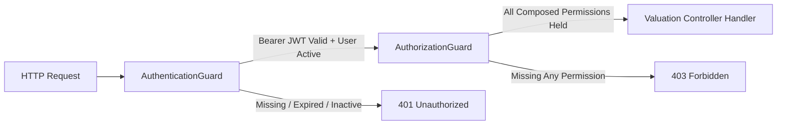

# Resource Valuation API Contracts, Security & Authorization Specification

**Bounded Context**: `Resources Management`  
**Sub-Domain**: `Resource Valuation & Financial Boundaries`  
**Milestone**: Phase 6.8 — Resource Valuation  
**Document**: Authoritative Valuation API Contracts, Security Matrix & Response-Shaping Specification  
**Status**: `APPROVED & ACTIVE`  
**Date**: August 31, 2026

---

## 1. Executive Summary & Objective

This document defines the authoritative API contracts, authorization policies, precision serialization standards, and sensitive-data protections for **Resource Valuation** operations in the Kinergy Platform.

The resource valuation endpoints expose deterministic financial insight into working capital and capital equipment assets across two independent sub-domains:

1. **Consumable Inventory Working Capital**: Acquisition cost of physical stock on hand ($\sum (\text{currentStock} \times \text{purchaseCost})$).
2. **Fixed Asset Estate Carrying Value**: Appraised balance sheet book value of active physical plant and equipment ($\sum \text{currentEstimatedValue}$).
3. **Combined Cross-Domain Resource Valuation**: Dynamically composed enterprise balance sheet summary combining consumable inventory and fixed assets without denormalized persisted totals.

---

## 2. API Endpoints & Contract Matrix

| Endpoint Route                               | HTTP Method | Target Operation                | Required Permissions                            | Allowed Roles                   | Description                                                                         |
| :------------------------------------------- | :---------- | :------------------------------ | :---------------------------------------------- | :------------------------------ | :---------------------------------------------------------------------------------- |
| `/api/v1/resources/inventory/valuation`      | `GET`       | `GetInventoryValuation`         | `inventory.read`, `billing.read`                | `ADMIN`, `SUPER_ADMIN`, `OWNER` | Working capital valuation for active consumable inventory items.                    |
| `/api/v1/resources/assets/valuation/summary` | `GET`       | `GetFixedAssetValuationSummary` | `assets.read`, `billing.read`                   | `ADMIN`, `SUPER_ADMIN`, `OWNER` | Fixed asset carrying book value summary with category/status/condition breakdowns.  |
| `/api/v1/resources/assets/:id/valuation`     | `GET`       | `GetAssetValue`                 | `assets.read`, `billing.read`                   | `ADMIN`, `SUPER_ADMIN`, `OWNER` | Item-level acquisition and fair appraisal valuation for an individual fixed asset.  |
| `/api/v1/resources/valuation/summary`        | `GET`       | `GetCombinedResourceValuation`  | `inventory.read`, `assets.read`, `billing.read` | `ADMIN`, `SUPER_ADMIN`, `OWNER` | Unified cross-domain resource valuation combining inventory and fixed asset assets. |

---

## 3. Authorization & Security Architecture

### 3.1 Defense-in-Depth & Zero Frontend Trust

Frontend route masking or UI button hiding is **never** treated as authorization. The NestJS API layer strictly enforces a two-stage security pipeline on every valuation request:



1. **`AuthenticationGuard`**:
   - Validates the HTTP `Authorization: Bearer <JWT>` header.
   - Rejects missing, invalid, or expired tokens with `401 Unauthorized`.
   - Confirms user account status is `UserStatus.ACTIVE` (rejects `INACTIVE`, `SUSPENDED`, `LOCKED` accounts).
   - Populates `AuthenticatedUserContext` from authoritative persistence.
2. **`AuthorizationGuard`**:
   - Evaluates RBAC/ABAC permission composition via `@Permissions(...)`.
   - Rejects callers missing any required permission with `403 Forbidden`.

### 3.2 Permission Composition Matrix

To prevent permission explosion while strictly enforcing least privilege, valuation endpoints compose existing domain permissions with `billing.read`:

| Endpoint                                  | `inventory.read` | `assets.read` | `billing.read` | Evaluation Logic                                                                                            |
| :---------------------------------------- | :--------------: | :-----------: | :------------: | :---------------------------------------------------------------------------------------------------------- |
| `GET /resources/inventory/valuation`      |   **Required**   |       —       |  **Required**  | Caller must have operational inventory access **and** billing clearance.                                    |
| `GET /resources/assets/valuation/summary` |        —         | **Required**  |  **Required**  | Caller must have operational asset access **and** billing clearance.                                        |
| `GET /resources/assets/:id/valuation`     |        —         | **Required**  |  **Required**  | Caller must have operational asset access **and** billing clearance.                                        |
| `GET /resources/valuation/summary`        |   **Required**   | **Required**  |  **Required**  | Caller must hold all three permissions. Lacking any single permission results in immediate `403 Forbidden`. |

### 3.3 Multi-Tenant Isolation

Every query handler extracts `tenantId` strictly from the verified `AuthenticatedUserContext`. Cross-tenant querying is mathematically and relationally impossible (`where: { tenantId }` in Prisma queries).

---

## 4. Response Contracts & Schema Semantics

### 4.1 Consumable Inventory Valuation (`InventoryValuationResponseDto`)

```typescript
export class InventoryValuationResponseDto {
  /** Total distinct catalog product SKUs evaluated */
  totalDistinctItems: number;

  /** Total physical quantity units across all eligible stock on hand */
  totalQuantityUnits: number;

  /** Total working capital value in currency units (e.g. 1250.75) */
  totalValueAmount: number;

  /** ISO 4217 Currency code (e.g. "USD") */
  currency: string;

  /** ISO 8601 calculation timestamp */
  calculatedAt: string;
}
```

### 4.2 Fixed Asset Estate Valuation Summary (`FixedAssetValuationSummaryResponseDto`)

```typescript
export class FixedAssetValuationSummaryResponseDto {
  /** Total carrying book value of active estate in dollars */
  totalCarryingValueAmount: number;

  /** Total original CAPEX purchase acquisition investment */
  totalPurchaseValueAmount: number;

  /** ISO 4217 Currency code */
  currency: string;

  /** Total count of all physical assets evaluated */
  totalAssetCount: number;

  /** Total count of active assets contributing to carrying value */
  activeAssetCount: number;

  /** ISO 8601 calculation timestamp */
  calculatedAt: string;

  /** Sub-breakdown partitioned by asset category */
  breakdownByCategory: Record<
    string,
    {
      totalCarryingValueAmount: number;
      totalPurchaseValueAmount: number;
      assetCount: number;
    }
  >;

  /** Sub-breakdown partitioned by lifecycle status */
  breakdownByStatus: Record<
    string,
    {
      count: number;
      totalCarryingValueAmount: number;
    }
  >;

  /** Sub-breakdown partitioned by physical condition rating */
  breakdownByCondition: Record<
    string,
    {
      count: number;
      totalCarryingValueAmount: number;
    }
  >;
}
```

### 4.3 Combined Resource Valuation Summary (`ResourceValuationSummaryResponseDto`)

```typescript
export class ResourceValuationSummaryResponseDto {
  /** Combined Resource Value = inventory.totalValueAmount + fixedAssets.totalCarryingValueAmount */
  totalCombinedValueAmount: number;

  /** Combined Purchase Cost = inventory.totalValueAmount + fixedAssets.totalPurchaseValueAmount */
  totalCombinedPurchaseValueAmount: number;

  /** ISO 4217 Currency code */
  currency: string;

  /** Consumable inventory working capital component */
  inventory: {
    totalValueAmount: number;
    totalDistinctItems: number;
    totalQuantityUnits: number;
    sharePercentage: number;
  };

  /** Fixed asset estate carrying value component */
  fixedAssets: {
    totalCarryingValueAmount: number;
    totalPurchaseValueAmount: number;
    totalAssetCount: number;
    activeAssetCount: number;
    sharePercentage: number;
  };

  /** ISO 8601 calculation timestamp */
  calculatedAt: string;
}
```

---

## 5. Mathematical Invariants & Precision Rules

1. **Integer Cents Arithmetic**:
   All intermediate multiplication and summation operations are computed using integer cents (`Math.round(amount * 100)`) before dividing by 100 for serialization. This guarantees zero floating-point accumulation drift:
   $$\text{valueInCents} = \sum (\text{quantityOnHand} \times \text{purchaseCostCents})$$
2. **Component Sum Invariant**:
   In the combined resource valuation contract, the combined total is guaranteed to equal the sum of the components:
   $$\text{totalCombinedValueAmount} = \text{inventory.totalValueAmount} + \text{fixedAssets.totalCarryingValueAmount}$$
3. **Share Percentage Invariant**:
   $$\text{inventory.sharePercentage} + \text{fixedAssets.sharePercentage} = 100.00\% \quad (\text{when } \text{totalCombinedValueAmount} > 0)$$
4. **Serialization Precision**:
   Monetary values are formatted as standard JSON numbers with standard decimal representation (e.g. `307.5` or `1250.75`).

---

## 6. Lifecycle Inclusion Policies

- **Consumable Inventory**:
  - Authoritative Policy: [`docs/architecture/resources/consumable-inventory-valuation-policy.md`](./consumable-inventory-valuation-policy.md)
  - Default Inclusion: `ACTIVE` catalog products with `quantityOnHand > 0`.
  - Excluded by Default: `ARCHIVED` items (unless `includeArchived=true` is supplied). Zero-stock items contribute $\$0.00$.
- **Fixed Assets**:
  - Authoritative Policy: [`docs/architecture/resources/fixed-asset-valuation-policy.md`](./fixed-asset-valuation-policy.md) (ADR-0097).
  - Carrying Value Contribution: `ACTIVE`, `UNDER_MAINTENANCE`, `DAMAGED` contribute $100\%$ of `currentEstimatedValue`.
  - Excluded from Carrying Value: `RETIRED`, `SOLD` contribute $\$0.00$ to active carrying value (tracked separately in CAPEX acquisition history).
  - Condition Ratings: Qualitative condition ratings (`EXCELLENT`, `GOOD`, `FAIR`, `POOR`, `DAMAGED`) do **not** apply artificial algorithmic percentage haircuts; book value changes require explicit revaluations (`UpdateFixedAssetValuationCommand`).

---

## 7. Sensitive Data Leakage Safeguards (ADR-0095)

To protect corporate margins, supplier pricing, and capital expenditures from operational staff (Trainers, Therapists, Kitchen Staff, Receptionists):

1. **Operational Endpoint Sanitization**:
   - `GET /api/v1/resources/assets` and `GET /api/v1/resources/assets/:id` return `FixedAssetResponseDto` which **omits** `purchaseValue` and `currentEstimatedValue`.
   - `GET /api/v1/resources/inventory/:id/stock-level` and `GET /api/v1/resources/inventory/:id/movements` omit unit purchase acquisition costs.
2. **Valuation Summary Sanitization**:
   - `GET /api/v1/resources/inventory/valuation` returns aggregate working capital totals and category summaries; it does not return individual supplier wholesale pricing.
   - `GET /api/v1/resources/valuation/summary` returns component-level summaries without disclosing itemized vendor invoices.

---

## 8. Verification & Quality Gate Reference

All contracts, permission guards, and serialization invariants are verified by the automated test suite:

- Unit & Invariant Operations: [`packages/core/src/resources/application/__tests__/resource-valuation-operations.spec.ts`](file:///c:/Projects/kinergy-platform/packages/core/src/resources/application/__tests__/resource-valuation-operations.spec.ts)
- API Security, RBAC & Multi-Permission Composition: [`apps/api/src/resources/__tests__/resource-valuation.authorization.spec.ts`](file:///c:/Projects/kinergy-platform/apps/api/src/resources/__tests__/resource-valuation.authorization.spec.ts)
