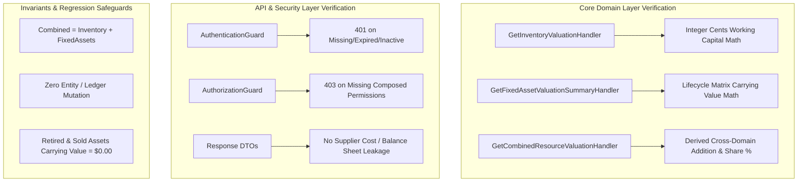

# Resource Valuation Testing, Quality Evidence & Verification Specification

**Bounded Context**: `Resources Management`  
**Sub-Domain**: `Resource Valuation Financial Boundaries`  
**Milestone**: Phase 6.8 — Resource Valuation  
**Document**: Authoritative Valuation Test Strategy, Correctness Verification & Regression Evidence  
**Status**: `APPROVED & ACTIVE`  
**Date**: August 31, 2026

---

## 1. Executive Summary & Testing Strategy

In enterprise resource management and multi-tenant financial reporting, valuation figures must be **deterministic**, **mathematically correct**, **lifecycle-consistent**, **strictly isolated**, and **reproducible**. A single happy-path test is insufficient.

### Primary Testing Principle

> **For a fixed authoritative database state, the same valuation query must always produce the exact same result according to the approved integer-cents precision and rounding policy without side effects or mutation.**

### Quality Architecture



---

## 2. Consumable Inventory Test Matrix

The consumable inventory valuation engine computes:
$$\text{Inventory Value} = \sum (\text{currentStock} \times \text{purchaseCost})$$

| Scenario / State                      | Test Input / Precondition                                              | Expected Observable Output                                                        | Verification Status |
| :------------------------------------ | :--------------------------------------------------------------------- | :-------------------------------------------------------------------------------- | :-----------------: |
| **Empty Inventory**                   | No products exist for tenant (`count = 0`).                            | `totalValueAmount = 0.00`, `totalDistinctItems = 0`, `totalQuantityUnits = 0`.    |      **PASS**       |
| **Single Product**                    | 15 units of Whey Protein @ \$20.50.                                    | `totalValueAmount = 307.50`, `totalDistinctItems = 1`, `totalQuantityUnits = 15`. |      **PASS**       |
| **Multiple Products & Categories**    | 3.33 units Energy Gel @ \$1.99 + 2.5 units Recovery Powder @ \$10.99.  | Sums to exact cents (\$6.63 + \$27.48 = \$34.11), total units = 5.83.             |      **PASS**       |
| **Zero Stock Product**                | Catalog product with `quantityOnHand = 0` @ \$4.50.                    | Contributes \$0.00 to value; `totalDistinctItems = 1`, `totalQuantityUnits = 0`.  |      **PASS**       |
| **Archived Product (Default Query)**  | Active product (10 @ \$5.00) + Archived product (10 @ \$8.00).         | Default returns \$50.00 (1 item); excludes archived product.                      |      **PASS**       |
| **Archived Product (Explicit Query)** | Same state as above with `includeArchived = true`.                     | Returns \$130.00 (2 items); incorporates archived product stock.                  |      **PASS**       |
| **Zero Purchase Cost Product**        | 100 free promotional samples @ \$0.00 purchase cost.                   | `totalValueAmount = 0.00`, `totalDistinctItems = 1`, `totalQuantityUnits = 100`.  |      **PASS**       |
| **Inactive Product with Stock**       | Seasonal catalog product (`status = INACTIVE`) with 20 units @ \$3.50. | Contributes \$70.00 to warehouse working capital; `totalDistinctItems = 1`.       |      **PASS**       |
| **Decimal / Fractional Quantity**     | Fractional bulk inventory units (e.g. 12.34 kg @ \$7.89/kg).           | `12.34 * 7.89 = 97.36` (exact integer-cents rounding without float drift).        |      **PASS**       |
| **Multi-Tenant Isolation**            | Tenant A has \$100.00 inventory; Tenant B has \$200.00 inventory.      | Querying Tenant A returns strictly \$100.00; Tenant B returns strictly \$200.00.  |      **PASS**       |

---

## 3. Fixed Asset Lifecycle & Valuation Matrix

The fixed asset valuation engine computes carrying book value according to the authoritative lifecycle inclusion matrix ([ADR-0097](file:///c:/Projects/kinergy-platform/docs/architecture/resources/adr/0097-fixed-asset-carrying-valuation-and-lifecycle-inclusion-matrix.md)):

| Lifecycle State     | Operational Status           |  Carrying Book Value Contribution   |          CAPEX Acquisition History Contribution           | Test Status |
| :------------------ | :--------------------------- | :---------------------------------: | :-------------------------------------------------------: | :---------: |
| `ACTIVE`            | In Service / Operational     | **100%** of `currentEstimatedValue` |                **100%** of `purchaseValue`                |  **PASS**   |
| `UNDER_MAINTENANCE` | Temporary Servicing / Repair | **100%** of `currentEstimatedValue` |                **100%** of `purchaseValue`                |  **PASS**   |
| `DAMAGED`           | Awaiting Assessment / Repair | **100%** of `currentEstimatedValue` |                **100%** of `purchaseValue`                |  **PASS**   |
| `RETIRED`           | Decommissioned / Scrapped    |              **$0.00**              | Included in CAPEX history if `includeDecommissioned=true` |  **PASS**   |
| `SOLD`              | Disposed / Divested          |              **$0.00**              | Included in CAPEX history if `includeDecommissioned=true` |  **PASS**   |

### Condition Independence Invariant

Qualitative physical condition ratings (`EXCELLENT`, `GOOD`, `FAIR`, `POOR`, `NEEDS_REPAIR`, `DAMAGED`) represent physical health telemetry and **do not** automatically apply algorithmic percentage markdowns to financial carrying value. Book value changes require explicit authorized appraisals via `UpdateFixedAssetValuationCommand`.

- Verified in tests: Fair asset (\$600) + Needs Repair asset (\$2,200) evaluates to exact carrying total of \$2,800.00 without double discounting.

### Zero Carrying Value Asset

- Fully depreciated or written-down assets with `currentEstimatedValue = 0.00` are safely aggregated as \$0.00 carrying value without arithmetic exceptions.

---

## 4. Combined Resource Valuation & Mathematical Invariant

The Combined Resource Valuation query derives total enterprise resource value:
$$\text{Combined Resource Value} = \text{Consumable Inventory Value} + \text{Fixed Asset Carrying Value}$$

| Domain State              | Inventory Value | Fixed Asset Carrying Value | Combined Value | Inventory Share % | Asset Share % |  Status  |
| :------------------------ | :-------------: | :------------------------: | :------------: | :---------------: | :-----------: | :------: |
| **Both Empty**            |     \$0.00      |           \$0.00           |   **\$0.00**   |       0.00%       |     0.00%     | **PASS** |
| **Inventory Only**        |    \$500.00     |           \$0.00           |  **\$500.00**  |      100.00%      |     0.00%     | **PASS** |
| **Fixed Assets Only**     |     \$0.00      |         \$1,500.00         | **\$1,500.00** |       0.00%       |    100.00%    | **PASS** |
| **Both Populated**        |    \$250.00     |          \$750.00          | **\$1,000.00** |      25.00%       |    75.00%     | **PASS** |
| **Complex Decimal Mixed** |    \$120.72     |         \$3,801.50         | **\$3,922.22** |       3.08%       |    96.92%     | **PASS** |

### Regression Invariant Coverage

Tests explicitly assert:

```typescript
expect(combinedValue).toBe(Math.round((inventoryValue + fixedAssetValue) * 100) / 100);
```

---

## 5. Precision & Serialization Invariants

1. **Integer-Cents Accumulation**:
   All intermediate multiplication ($\text{qty} \times \text{unitCost}$) and category summations use integer cents:
   ```typescript
   const lineCents = Math.round(
     item.quantityOnHand.value * Math.round(item.purchaseCost.amount * 100),
   );
   ```
2. **Zero IEEE 754 Drift**:
   Calculations with repeating binary fractions (e.g. `12.34 * 7.89 = 97.3626`, `3.33 * 1.99 = 6.6267`) round cleanly to \$97.36 and \$6.63 without producing values like `97.36000000000001`.

---

## 6. Authorization & Security Test Coverage (Phase 6.7 Matrix)

The test suite in [`apps/api/src/resources/__tests__/resource-valuation.authorization.spec.ts`](file:///c:/Projects/kinergy-platform/apps/api/src/resources/__tests__/resource-valuation.authorization.spec.ts) enforces the complete Phase 6.7 security matrix:

| Security Scenario               | Tested Endpoint                           | Actor / Permission Context                                |   Expected Result    |
| :------------------------------ | :---------------------------------------- | :-------------------------------------------------------- | :------------------: |
| **Unauthenticated Request**     | `GET /resources/inventory/valuation`      | No Bearer Authorization Header                            | **401 Unauthorized** |
| **Invalid JWT Token**           | `GET /resources/assets/valuation/summary` | Corrupt or expired JWT                                    | **401 Unauthorized** |
| **Inactive User Account**       | `GET /resources/valuation/summary`        | Valid JWT, but `status = INACTIVE`                        | **401 Unauthorized** |
| **Authorized Inventory Read**   | `GET /resources/inventory/valuation`      | `inventory.read` + `billing.read`                         |      **200 OK**      |
| **Unauthorized Inventory Read** | `GET /resources/inventory/valuation`      | `inventory.read` only (e.g. Trainer)                      |  **403 Forbidden**   |
| **Authorized Asset Summary**    | `GET /resources/assets/valuation/summary` | `assets.read` + `billing.read`                            |      **200 OK**      |
| **Unauthorized Asset Summary**  | `GET /resources/assets/valuation/summary` | `assets.read` only (e.g. Receptionist)                    |  **403 Forbidden**   |
| **Authorized Combined Summary** | `GET /resources/valuation/summary`        | `inventory.read` + `assets.read` + `billing.read`         |      **200 OK**      |
| **Partial Composed Failure 1**  | `GET /resources/valuation/summary`        | Has `inventory.read`, `billing.read`; lacks `assets.read` |  **403 Forbidden**   |
| **Partial Composed Failure 2**  | `GET /resources/valuation/summary`        | Has `assets.read`, `billing.read`; lacks `inventory.read` |  **403 Forbidden**   |
| **Partial Composed Failure 3**  | `GET /resources/valuation/summary`        | Has `inventory.read`, `assets.read`; lacks `billing.read` |  **403 Forbidden**   |

---

## 7. Read-Only Guarantees & Side-Effect Prevention

Valuation queries are strictly idempotent and read-only.

- **Unit & Integration Evidence**:
  Tests capture aggregate versions, stock quantities, and estimated values before and after executing `GetCombinedResourceValuationQuery`.
- **Verified Invariants**:
  - `InventoryItem.version` remains unchanged.
  - `InventoryItem.quantityOnHand` is never modified.
  - `FixedAsset.version` remains unchanged.
  - `FixedAsset.currentEstimatedValue` is never modified.
  - Zero `StockMovement` or `AssetHistory` records are generated during valuation queries.

---

## 8. Regression Risks & Mitigation Matrix

| Regression Risk                                        | Root Cause / Vector                                         | Implemented Mitigation & Test Defense                                                                                                                     |
| :----------------------------------------------------- | :---------------------------------------------------------- | :-------------------------------------------------------------------------------------------------------------------------------------------------------- |
| **Sold Assets Accidentally Included in Balance Sheet** | Query filters omitting status exclusions.                   | Lifecycle exclusion matrix in handler strictly filters out `AssetStatus.SOLD` and `AssetStatus.RETIRED` from active carrying value. Tested in core suite. |
| **Archived Inventory Disappearing Unexpectedly**       | Filter conflating archived products with deleted records.   | Archived products are retained in DB and included upon explicit query (`includeArchived=true`).                                                           |
| **Duplicate Aggregate Persistence Drift**              | Denormalizing valuation totals onto tenant/facility tables. | Denormalized storage is strictly prohibited (ADR-0098). All valuation totals are computed on-demand from authoritative items and assets.                  |
| **Floating-Point Drift**                               | Native JavaScript number summation (`+`).                   | Integer-cents arithmetic and rounding utility eliminate float truncation artifacts.                                                                       |
| **Supplier Cost Disclosure to Unauthorized Staff**     | Returning raw product records in general APIs.              | DTO response shaping (ADR-0095) ensures general operational endpoints omit financial costs and aggregate valuation endpoints return sanitized sums.       |

---

## 9. Known Limitations & Future Roadmap

1. **Automated Continuous Depreciation Engine**:
   - Currently, fixed asset valuations represent point-in-time carrying values updated via manual appraisals (`UpdateFixedAssetValuationCommand`).
   - A scheduled background depreciation worker (straight-line, MACRS, or declining balance) can be layered on top in a future milestone utilizing the existing `assets.write + billing.read` command pipeline.
2. **Multi-Currency Facility Partitioning**:
   - Current valuation assumes single tenant currency (default `USD`). If Kinergy introduces multi-currency facilities under a single tenant, currency conversion tables will be integrated into the valuation query handlers.
