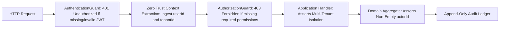

# Resources Management: Authoritative Authorization Matrix

**Bounded Context**: `Resources Management`  
**Sub-Domains**: `Consumable Inventory` & `Fixed Assets`  
**Milestone**: Phase 6.7 — Authorization & Security  
**Document**: Authoritative Use-Case Authorization Decision Matrix  
**Status**: `APPROVED & ACTIVE`  
**Date**: August 31, 2026

---

## 1. Authorization Philosophy & Security Layering

Every externally reachable operation in Phase 6 requires an explicit authorization decision. There are **zero intentionally public operations** and **zero implicit default accesses**.



### Core Security Rules

1. **No Client-Supplied Actor / Tenant Identity**: `actorId` and `tenantId` are extracted strictly from verified JWT tokens via `@CurrentUser()`. Request DTO bodies cannot supply or override them.
2. **Multi-Tenant Boundary Assertion**: Handlers verify `aggregate.tenantId === command.tenantId`. Mismatches return deterministic not-found / access failure without leaking cross-tenant existence.
3. **Domain Actor Assertion**: Aggregate roots demand `assertActor(actorId)`, guaranteeing 100% of mutations are bound to an authenticated user ID.
4. **Compositional Financial Valuation Security**: Queries and commands touching monetary valuations require dual permission composition (`billing.read` combined with domain permissions).

---

## 2. Consumable Inventory Authorization Matrix

| #          | Operation / Use Case          | Concrete Command / Query & Handler                               |    Type    | Required Permission(s)                      | Sensitive Data / Response Shaping                                         | Business Boundary & Tenant Checks                                   | Actor Provenance Requirement |                 Expected Unauthorized Behavior                  | Ledger / History Event Emitted                                             |
| ---------- | ----------------------------- | ---------------------------------------------------------------- | :--------: | ------------------------------------------- | ------------------------------------------------------------------------- | ------------------------------------------------------------------- | ---------------------------- | :-------------------------------------------------------------: | -------------------------------------------------------------------------- |
| **INV-01** | **Create Product**            | `CreateInventoryItemCommand`<br>`CreateInventoryItemHandler`     | `MUTATION` | `inventory.write`                           | Purchase unit cost and selling price validated.                           | Multi-tenant isolation (`tenantId`). Unique SKU per tenant.         | Mandatory `actorId`          | `401 Unauthorized` (no token)<br>`403 Forbidden` (missing perm) | Materializes `InventoryItem` with initial `version = 1`.                   |
| **INV-02** | **Update Product Details**    | `UpdateInventoryItemCommand`<br>`UpdateInventoryItemHandler`     | `MUTATION` | `inventory.write`                           | Updates metadata & pricing. **Blocked from modifying stock on hand.**     | `item.tenantId === command.tenantId`. OCC version check.            | Mandatory `actorId`          |              `401 Unauthorized`<br>`403 Forbidden`              | Updates catalog row; bumps `version`.                                      |
| **INV-03** | **Get Product by ID**         | `GetInventoryItemByIdQuery`<br>`GetInventoryItemByIdHandler`     |   `READ`   | `inventory.read`                            | Public item details. Excludes confidential batch purchase ledger.         | `item.tenantId === query.tenantId`.                                 | Authenticated user           |              `401 Unauthorized`<br>`403 Forbidden`              | Read-only; zero ledger impact.                                             |
| **INV-04** | **List Products**             | `ListInventoryItemsQuery`<br>`ListInventoryItemsHandler`         |   `READ`   | `inventory.read`                            | Bounded pagination (max 100). Excludes working capital valuation.         | Tenant-scoped filter.                                               | Authenticated user           |              `401 Unauthorized`<br>`403 Forbidden`              | Read-only; zero ledger impact.                                             |
| **INV-05** | **Archive / Deactivate Item** | `ArchiveInventoryItemCommand`<br>`ArchiveInventoryItemHandler`   | `MUTATION` | `inventory.write`                           | Halts subsequent sales and clinical consumption.                          | `item.tenantId === command.tenantId`. OCC version check.            | Mandatory `actorId`          |              `401 Unauthorized`<br>`403 Forbidden`              | Sets status to `ARCHIVED` or `INACTIVE`; bumps `version`.                  |
| **INV-06** | **Activate / Restore Item**   | `ActivateInventoryItemCommand`<br>`ActivateInventoryItemHandler` | `MUTATION` | `inventory.write`                           | Restores inactive product to `ACTIVE`.                                    | `item.tenantId === command.tenantId`. OCC version check.            | Mandatory `actorId`          |              `401 Unauthorized`<br>`403 Forbidden`              | Sets status to `ACTIVE`; bumps `version`.                                  |
| **INV-07** | **Record Purchase (Receive)** | `ReceiveStockCommand`<br>`ReceiveStockHandler`                   | `MUTATION` | `inventory.write`                           | Snapshots `unitCost` onto movement ledger without altering catalog.       | `item.tenantId === command.tenantId`. Positive quantity.            | Mandatory `actorId`          |              `401 Unauthorized`<br>`403 Forbidden`              | Atomically appends `StockMovement` (`PURCHASE_RECEIPT`); increments stock. |
| **INV-08** | **Record Retail Sale**        | `SellStockCommand`<br>`SellStockHandler`                         | `MUTATION` | `inventory.write`                           | Snapshots `sellingPrice` onto movement ledger.                            | `quantityOnHand >= quantity`. `item.tenantId === command.tenantId`. | Mandatory `actorId`          |              `401 Unauthorized`<br>`403 Forbidden`              | Atomically appends `StockMovement` (`SALE`); decrements stock.             |
| **INV-09** | **Record Consumption**        | `ConsumeStockCommand`<br>`ConsumeStockHandler`                   | `MUTATION` | `inventory.write`                           | Captures treatment session reference ID.                                  | `quantityOnHand >= quantity`. `item.tenantId === command.tenantId`. | Mandatory `actorId`          |              `401 Unauthorized`<br>`403 Forbidden`              | Atomically appends `StockMovement` (`CONSUMPTION`); decrements stock.      |
| **INV-10** | **Adjust Stock (Manual)**     | `AdjustStockCommand`<br>`AdjustStockHandler`                     | `MUTATION` | `inventory.write`                           | Requires mandatory reason ($\ge 3$ chars) to prevent silent tampering.    | `quantityOnHand + delta >= 0`. Multi-tenant check.                  | Mandatory `actorId`          |              `401 Unauthorized`<br>`403 Forbidden`              | Atomically appends `StockMovement` (`MANUAL_ADJUSTMENT`); updates stock.   |
| **INV-11** | **Get Stock Level**           | `GetStockLevelQuery`<br>`GetStockLevelHandler`                   |   `READ`   | `inventory.read`                            | Returns exact physical `quantityOnHand`.                                  | `item.tenantId === query.tenantId`.                                 | Authenticated user           |              `401 Unauthorized`<br>`403 Forbidden`              | Read-only; zero ledger impact.                                             |
| **INV-12** | **Get Inventory Movements**   | `ListStockMovementsQuery`<br>`ListStockMovementsHandler`         |   `READ`   | `inventory.read`                            | Full chronological audit ledger. Bounded pagination (max 100).            | `item.tenantId === query.tenantId`. Deterministic sort.             | Authenticated user           |              `401 Unauthorized`<br>`403 Forbidden`              | Read-only; zero ledger impact.                                             |
| **INV-13** | **Get Low Stock Items**       | `GetLowStockItemsQuery`<br>`GetLowStockItemsHandler`             |   `READ`   | `inventory.read`                            | Filters items where `quantityOnHand <= reorderThreshold`.                 | Tenant-scoped query.                                                | Authenticated user           |              `401 Unauthorized`<br>`403 Forbidden`              | Read-only; zero ledger impact.                                             |
| **INV-14** | **Get Inventory Valuation**   | `GetInventoryValuationQuery`<br>`GetInventoryValuationHandler`   |   `READ`   | `inventory.read`<br>_AND_<br>`billing.read` | **CONFIDENTIAL**: Total inventory working capital in exact integer cents. | Tenant-scoped aggregation.                                          | Authenticated user           |              `401 Unauthorized`<br>`403 Forbidden`              | Read-only; zero ledger impact.                                             |

---

## 3. Fixed Assets Authorization Matrix

| #          | Operation / Use Case        | Concrete Command / Query & Handler                                         |    Type    | Required Permission(s)                    | Sensitive Data / Response Shaping                                                                                                        | Business Boundary & Tenant Checks                                                  | Actor Provenance Requirement             |    Expected Unauthorized Behavior     | Ledger / History Event Emitted                                            |
| ---------- | --------------------------- | -------------------------------------------------------------------------- | :--------: | ----------------------------------------- | ---------------------------------------------------------------------------------------------------------------------------------------- | ---------------------------------------------------------------------------------- | ---------------------------------------- | :-----------------------------------: | ------------------------------------------------------------------------- |
| **AST-01** | **Register New Asset**      | `CreateFixedAssetCommand`<br>`CreateFixedAssetHandler`                     | `MUTATION` | `assets.write`                            | Non-negative purchase value ($\ge 0.00$) and estimated value.                                                                            | Multi-tenant isolation (`tenantId`). Unique asset tag per tenant.                  | Mandatory `actorId`                      | `401 Unauthorized`<br>`403 Forbidden` | Materializes `FixedAsset`; appends initial `CREATED` history event.       |
| **AST-02** | **Update Asset Details**    | `UpdateFixedAssetDetailsCommand`<br>`UpdateFixedAssetDetailsHandler`       | `MUTATION` | `assets.write`                            | **Restricted strictly to descriptive metadata (`name`, `description`, `notes`). Cannot mutate location, status, condition, or value.**   | `asset.tenantId === command.tenantId`. OCC version check.                          | Mandatory `actorId`                      | `401 Unauthorized`<br>`403 Forbidden` | Updates metadata fields; bumps `version`.                                 |
| **AST-03** | **Get Asset by ID / Tag**   | `GetFixedAssetByIdQuery`<br>`GetFixedAssetByIdHandler`                     |   `READ`   | `assets.read`                             | Public specifications and location. Purchase invoice masked for non-finance roles.                                                       | `asset.tenantId === query.tenantId`.                                               | Authenticated user                       | `401 Unauthorized`<br>`403 Forbidden` | Read-only; zero ledger impact.                                            |
| **AST-04** | **List Fixed Assets**       | `ListFixedAssetsQuery`<br>`ListFixedAssetsHandler`                         |   `READ`   | `assets.read`                             | Multi-faceted filters (category, status, condition, room). Bounded pagination (max 100).                                                 | Tenant-scoped query.                                                               | Authenticated user                       | `401 Unauthorized`<br>`403 Forbidden` | Read-only; zero ledger impact.                                            |
| **AST-05** | **Transfer Location**       | `TransferFixedAssetLocationCommand`<br>`TransferFixedAssetLocationHandler` | `MUTATION` | `assets.write`                            | Physical facility/room relocation.                                                                                                       | `asset.tenantId === command.tenantId`. Blocked on `SOLD`/`RETIRED` ([AST-INV-1]).  | Mandatory `actorId`                      | `401 Unauthorized`<br>`403 Forbidden` | Updates location; appends `TRANSFERRED` history event; bumps `version`.   |
| **AST-06** | **Change Asset Status**     | `ChangeFixedAssetStatusCommand`<br>`ChangeFixedAssetStatusHandler`         | `MUTATION` | `assets.write`                            | State machine transition (`ACTIVE` $\leftrightarrow$ `UNDER_MAINTENANCE` $\leftrightarrow$ `DAMAGED`). Mandatory reason ($\ge 3$ chars). | `asset.tenantId === command.tenantId`. `OUT_OF_SERVICE` safety lock ([AST-INV-4]). | Mandatory `actorId`                      | `401 Unauthorized`<br>`403 Forbidden` | Updates status; appends `STATUS_CHANGED` history event; bumps `version`.  |
| **AST-07** | **Update Condition Rating** | `UpdateFixedAssetConditionCommand`<br>`UpdateFixedAssetConditionHandler`   | `MUTATION` | `assets.write`                            | Physical wear grading (`EXCELLENT` $\rightarrow$ `OUT_OF_SERVICE`). Status remains orthogonal.                                           | `asset.tenantId === command.tenantId`. Blocked on `SOLD`/`RETIRED`.                | Mandatory `actorId`                      | `401 Unauthorized`<br>`403 Forbidden` | Updates condition; appends `CONDITION_CHANGED` history event.             |
| **AST-08** | **Record Maintenance**      | `RecordAssetMaintenanceCommand`<br>`RecordAssetMaintenanceHandler`         | `MUTATION` | `assets.write`                            | Servicing cost ($\ge 0.00$, supports $0.00 warranty), technician identity, work details.                                                 | `asset.tenantId === command.tenantId`. Blocked on `SOLD`/`RETIRED`.                | Mandatory `actorId` (`recordedByUserId`) | `401 Unauthorized`<br>`403 Forbidden` | Appends `AssetMaintenanceRecord`; appends `MAINTENANCE_RECORDED` history. |
| **AST-09** | **Update Asset Valuation**  | `UpdateFixedAssetValuationCommand`<br>`UpdateFixedAssetValuationHandler`   | `MUTATION` | `assets.write`<br>_AND_<br>`billing.read` | **CRITICAL**: Revalues balance sheet book value. Non-negative ($\ge 0.00$). Preserves purchase cost.                                     | `asset.tenantId === command.tenantId`. Blocked on `SOLD`.                          | Mandatory `actorId`                      | `401 Unauthorized`<br>`403 Forbidden` | Updates `currentEstimatedValue`; appends `VALUE_UPDATED` history event.   |
| **AST-10** | **Get Asset History**       | `GetAssetHistoryQuery`<br>`GetAssetHistoryHandler`                         |   `READ`   | `assets.read`                             | Structured chronological lifecycle audit ledger. Bounded pagination (max 100).                                                           | `asset.tenantId === query.tenantId`. Stable index tie-breaker.                     | Authenticated user                       | `401 Unauthorized`<br>`403 Forbidden` | Read-only; zero ledger impact.                                            |
| **AST-11** | **Get Maintenance History** | `GetMaintenanceHistoryQuery`<br>`GetMaintenanceHistoryHandler`             |   `READ`   | `assets.read`                             | Mechanical servicing ledger, parts replaced, and warranty logs.                                                                          | `asset.tenantId === query.tenantId`. Deterministic sort.                           | Authenticated user                       | `401 Unauthorized`<br>`403 Forbidden` | Read-only; zero ledger impact.                                            |
| **AST-12** | **Get Asset Valuation**     | `GetAssetValueQuery`<br>`GetAssetValueHandler`                             |   `READ`   | `assets.read`<br>_AND_<br>`billing.read`  | **CONFIDENTIAL**: Discloses historical `purchaseValue` vs `currentEstimatedValue`.                                                       | `asset.tenantId === query.tenantId`. Exact cents precision.                        | Authenticated user                       | `401 Unauthorized`<br>`403 Forbidden` | Read-only; zero ledger impact.                                            |

---

## 4. Test Matrix & Verification Coverage

Every protected use case must be verified against four security assertions:

```typescript
describe('Authoritative Security & Permission Verification', () => {
  // 1. Authorized Actor
  it('allows execution when caller holds exact required permissions');

  // 2. Authenticated Unauthorized Actor
  it('rejects execution with 403 Forbidden when caller lacks required permissions');

  // 3. Unauthenticated Caller
  it('rejects execution with 401 Unauthorized when Bearer token is missing or invalid');

  // 4. Invariant & Cross-Tenant Bypass
  it(
    'rejects execution when caller attempts cross-tenant aggregate access or generic update bypass',
  );
});
```
