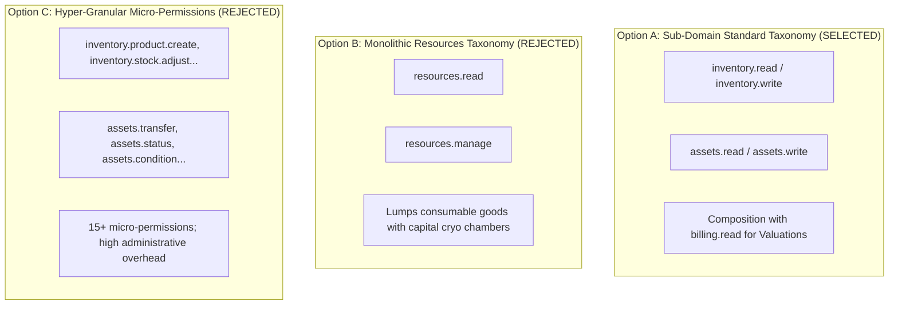

# Resources Management: Minimum Authorization & Permission Model

**Bounded Context**: `Resources Management`  
**Sub-Domains**: `Consumable Inventory` & `Fixed Assets`  
**Milestone**: Phase 6.7 — Authorization & Security  
**Document**: Authoritative Permission Model Specification  
**Status**: `APPROVED & ACTIVE`  
**Date**: August 31, 2026

---

## 1. Existing Kinergy Authorization Philosophy

The Kinergy platform security architecture (established in Phase 1) enforces a **lean, domain-aligned, coarse-grained permission taxonomy** utilizing standard hierarchical dot notation:

$$\text{<resource>}.\text{<action>}$$

### Phase 1 Precedents & Naming Standards

- **Users**: `users.read`, `users.write`, `users.delete`
- **Clients**: `clients.read`, `clients.write`, `clients.delete`
- **Appointments**: `appointments.read`, `appointments.create`, `appointments.update`, `appointments.delete`
- **Kitchen**: `kitchen.read`, `kitchen.orders.manage`
- **Inventory (Consumables)**: `inventory.read`, `inventory.write`
- **Billing**: `billing.read`, `billing.write`
- **Reports**: `reports.read`, `reports.export`
- **Settings**: `settings.read`, `settings.write`

### Core Design Rules

1. **No Permission Explosion**: Permissions represent meaningful operational domains, not 1-to-1 mappings to every HTTP route or handler method.
2. **Read/Write Segregation**: Queries require `.read`; mutations require `.write`.
3. **Permission Composition for Sensitive Operations**: Highly sensitive commercial operations (e.g. financial valuations) do not introduce speculative micro-permissions; they compose existing domain read permissions with `billing.read` (or `finance.read`).
4. **Least Privilege**: Operational roles (e.g., Kitchen Staff) are isolated to consumable stock, preventing unauthorized visibility into capital equipment or facility fixed assets.

---

## 2. Evaluation of Architectural Options

We evaluated three potential authorization models for Phase 6:

### Option A: Sub-Domain Standard Taxonomy (`inventory.*` and `assets.*`) — **SELECTED**

- **Structure**: Maintains separate permissions for `inventory` (consumable stock) and `assets` (capital fixed assets), with standard `.read` and `.write` actions.
- **Pros**:
  - 100% backward-compatible with Phase 1 `identity.seed.ts`.
  - Enforces strict least-privilege boundary between kitchen/reception consumables and facility capital equipment.
  - Aligns with Kinergy’s established coarse `<resource>.<action>` naming.
  - Zero permission explosion.
- **Cons**: Requires role assignment for two sub-domains rather than one.

### Option B: Monolithic Resources Taxonomy (`resources.read` and `resources.manage`) — **REJECTED**

- **Structure**: Collapses all inventory items and fixed assets into a single `resources.*` namespace.
- **Why Rejected**: Violates **Least Privilege**. Kitchen Staff (who need to record food supply receipts and meal ingredient usage) would inherently gain authorization to view or alter multi-thousand-dollar medical cryo chambers and gym machinery.

### Option C: Hyper-Granular Micro-Permissions (15+ Action Permissions) — **REJECTED**

- **Structure**: Defines dedicated permissions for each specific operation (`inventory.adjust`, `assets.transfer`, `assets.status`, `assets.condition`, `assets.maintenance`, `assets.revalue`, `assets.retire`, etc.).
- **Why Rejected**: Violates Kinergy’s Phase 1 architecture philosophy. Introduces extreme complexity in role configuration without demonstrated business necessity.

---

## 3. Selected Permission Model & Definitions

The Phase 6 Resources permission model defines **four core permissions**:

| Permission Code       | Description                                                                                                                                         | Module Scope | Risk Level |
| --------------------- | --------------------------------------------------------------------------------------------------------------------------------------------------- | ------------ | :--------: |
| **`inventory.read`**  | View consumable inventory catalog, current stock on hand, movement history, and replenishment alerts.                                               | Consumables  |    Low     |
| **`inventory.write`** | Create/update catalog products, record purchases, retail sales, clinical treatment consumption, and physical stock adjustments.                     | Consumables  |    High    |
| **`assets.read`**     | View fixed asset registry, specifications, physical locations, status, condition ratings, and maintenance logs.                                     | Fixed Assets |    Low     |
| **`assets.write`**    | Commission new fixed assets, update metadata, transfer physical locations, execute state machine transitions, record maintenance, and decommission. | Fixed Assets |    High    |

---

## 4. Phase 6 Capability Mapping Matrix

### 4.1 Consumable Inventory

| Use Case / Operation              | Application Handler            | Required Transport Permission(s)        | Required Roles (Default)                            |
| --------------------------------- | ------------------------------ | --------------------------------------- | --------------------------------------------------- |
| **Create Product**                | `CreateInventoryItemHandler`   | `inventory.write`                       | `Owner`, `Kitchen Staff`, `Inventory Clerk`         |
| **Update Product Details**        | `UpdateInventoryItemHandler`   | `inventory.write`                       | `Owner`, `Kitchen Staff`, `Inventory Clerk`         |
| **Get Product by ID / SKU**       | `GetInventoryItemByIdHandler`  | `inventory.read`                        | `Owner`, `Kitchen Staff`, `Receptionist`, `Trainer` |
| **List Products (Search/Filter)** | `ListInventoryItemsHandler`    | `inventory.read`                        | `Owner`, `Kitchen Staff`, `Receptionist`, `Trainer` |
| **Deactivate / Archive Item**     | `ArchiveInventoryItemHandler`  | `inventory.write`                       | `Owner`, `Kitchen Staff`                            |
| **Reactivate Item**               | `ActivateInventoryItemHandler` | `inventory.write`                       | `Owner`, `Kitchen Staff`                            |
| **Record Purchase (Receive)**     | `ReceiveStockHandler`          | `inventory.write`                       | `Owner`, `Kitchen Staff`, `Inventory Clerk`         |
| **Record Retail Sale**            | `SellStockHandler`             | `inventory.write`                       | `Owner`, `Kitchen Staff`, `Receptionist`            |
| **Record Clinical Consumption**   | `ConsumeStockHandler`          | `inventory.write`                       | `Owner`, `Kitchen Staff`, `Trainer`, `Therapist`    |
| **Manual Stock Adjustment**       | `AdjustStockHandler`           | `inventory.write`                       | `Owner`, `Kitchen Staff`, `Inventory Manager`       |
| **View Stock Level**              | `GetStockLevelHandler`         | `inventory.read`                        | `Owner`, `Kitchen Staff`, `Receptionist`, `Trainer` |
| **View Stock Movement Ledger**    | `ListStockMovementsHandler`    | `inventory.read`                        | `Owner`, `Kitchen Staff`, `Auditor`                 |
| **View Low Stock Alert List**     | `GetLowStockItemsHandler`      | `inventory.read`                        | `Owner`, `Kitchen Staff`, `Inventory Manager`       |
| **View Inventory Valuation**      | `GetInventoryValuationHandler` | `inventory.read` **AND** `billing.read` | `Owner`, `Finance Manager`                          |

### 4.2 Fixed Assets

| Use Case / Operation             | Application Handler                 | Required Transport Permission(s)      | Required Roles (Default)                                             |
| -------------------------------- | ----------------------------------- | ------------------------------------- | -------------------------------------------------------------------- |
| **Register New Asset**           | `CreateFixedAssetHandler`           | `assets.write`                        | `Owner`, `Facility Manager`                                          |
| **Update Asset Details**         | `UpdateFixedAssetDetailsHandler`    | `assets.write`                        | `Owner`, `Facility Manager`                                          |
| **Get Asset by ID / Tag**        | `GetFixedAssetByIdHandler`          | `assets.read`                         | `Owner`, `Facility Manager`, `Technician`, `Receptionist`, `Trainer` |
| **List Assets (Search/Filter)**  | `ListFixedAssetsHandler`            | `assets.read`                         | `Owner`, `Facility Manager`, `Technician`, `Receptionist`, `Trainer` |
| **Transfer Asset Location**      | `TransferFixedAssetLocationHandler` | `assets.write`                        | `Owner`, `Facility Manager`                                          |
| **Change Status**                | `ChangeFixedAssetStatusHandler`     | `assets.write`                        | `Owner`, `Facility Manager`, `Technician`                            |
| **Update Condition Rating**      | `UpdateFixedAssetConditionHandler`  | `assets.write`                        | `Owner`, `Facility Manager`, `Technician`                            |
| **Record Maintenance Servicing** | `RecordAssetMaintenanceHandler`     | `assets.write`                        | `Owner`, `Facility Manager`, `Technician`                            |
| **Update Asset Book Valuation**  | `UpdateFixedAssetValuationHandler`  | `assets.write` **AND** `billing.read` | `Owner`, `Finance Manager`                                           |
| **View Asset History Ledger**    | `GetAssetHistoryHandler`            | `assets.read`                         | `Owner`, `Facility Manager`, `Auditor`                               |
| **View Maintenance History**     | `GetMaintenanceHistoryHandler`      | `assets.read`                         | `Owner`, `Facility Manager`, `Technician`                            |
| **View Asset Financial Value**   | `GetAssetValueHandler`              | `assets.read` **AND** `billing.read`  | `Owner`, `Finance Manager`                                           |

---

## 5. Treatment of Sensitive Operations

Kinergy handles sensitive operations through **two defense layers**:

### 5.1 Sensitive Financial Valuations (Permission Composition)

- **Business Risk**: Operational staff (e.g. Receptionists checking room equipment or Kitchen Staff checking shake ingredients) must not view balance sheet capital asset valuations or aggregate stock working capital.
- **Solution**: Composition with Phase 1 `billing.read`:
  - `GetInventoryValuationQuery` requires: `@Permissions('inventory.read', 'billing.read')`
  - `GetAssetValueQuery` requires: `@Permissions('assets.read', 'billing.read')`
  - `UpdateFixedAssetValuationCommand` requires: `@Permissions('assets.write', 'billing.read')`

### 5.2 Irreversible Lifecycle Operations (Domain Invariants & Role Governance)

- **Disposal & Liquidation (`sell`, `retire`)**:
  - Protected via `assets.write` combined with domain invariant checks ([AST-INV-1]).
  - Once sold, domain aggregates irreversibly lock down against any subsequent modification or transfer.
- **Stock Reconciliation Adjustments (`adjust`)**:
  - Protected via `inventory.write` combined with mandatory audit justification ($\ge 3$ characters).

---

## 6. Least-Privilege Role-Permission Assignments

| System Role                          | `inventory.read` | `inventory.write` | `assets.read` | `assets.write` |      `billing.read` (Composition)       |
| ------------------------------------ | :--------------: | :---------------: | :-----------: | :------------: | :-------------------------------------: |
| **Owner**                            |        ✅        |        ✅         |      ✅       |       ✅       |       ✅ (Full valuation access)        |
| **Trainer**                          |        ✅        |        ❌         |      ✅       |       ❌       |        ❌ (No valuation access)         |
| **Kitchen Staff**                    |        ✅        |        ✅         |      ❌       |       ❌       |     ❌ (No asset/valuation access)      |
| **Receptionist**                     |        ✅        |        ❌         |      ✅       |       ❌       | ✅ (POS billing access, no asset write) |
| **Facility Manager** _(Future Role)_ |        ✅        |        ❌         |      ✅       |       ✅       |    ❌ (Operational asset management)    |

---

## 7. Future Extension Guidance

If future operational scale introduces specialized roles requiring narrower access:

1. **Granular Separation without Breaking Changes**: Permissions like `assets.transfer` or `inventory.adjust` can be introduced as additive aliases while keeping `assets.write` and `inventory.write` as supersets.
2. **Multi-Facility Segregation**: Facility-level boundary authorization will be enforced at the application handler tier via `facilityId` checks within the aggregate location VO.
