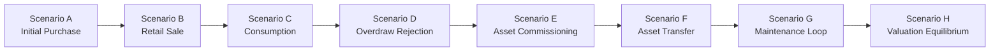

# Phase 6: Resources Management — Testing Architecture Specification

## 1. Executive Summary & The Testing Pyramid

The **Phase 6: Resources Management** testing architecture provides complete empirical verification across the entire Clean Architecture and Hexagonal stack. It proves that domain invariants, mathematical equilibria, transactional boundaries, RBAC authorization, and user experiences behave deterministically under both standard operational conditions and severe fault contention.

The testing pyramid is strictly layered. Each level has a singular responsibility and explicit boundaries between what it **proves** and what it **does not prove**:

```
                              ┌──────────────────────────────────┐
                              │  Level 6: E2E Business Scenarios │
                              │    (Scenarios A–H, Journeys,     │
                              │     Cross-Scenario Audits)       │
                              └─────────────────┬────────────────┘
                                                │
                                ┌───────────────┴────────────────┐
                                │ Level 5: Frontend System Tests │
                                │   (Screen States, Forms, UX,   │
                                │   Permissions, URL State)      │
                                └───────────────┬────────────────┘
                                                │
                                ┌───────────────┴────────────────┐
                                │   Level 4: External API Tests  │
                                │   (HTTP Contracts, Validation, │
                                │     IAM Guards, OpenAPI)       │
                                └───────────────┬────────────────┘
                                                │
                                ┌───────────────┴────────────────┐
                                │  Level 3: Integration Tests    │
                                │   (Prisma Repositories, OCC,   │
                                │   DB Constraints, Rollbacks)   │
                                └───────────────┬────────────────┘
                                                │
                                ┌───────────────┴────────────────┐
                                │  Level 2: Application Tests    │
                                │   (CQRS Handlers, Workflows,   │
                                │    Query Handlers, Ports)      │
                                └───────────────┬────────────────┘
                                                │
                                ┌───────────────┴────────────────┐
                                │     Level 1: Pure Domain Tests │
                                │    (Aggregates, Invariants,    │
                                │    State Machines, Calculations│
                                └────────────────────────────────┘
```

---

## 2. Testing Layers: Proof vs. Non-Proof Matrix

To prevent engineers from writing redundant tests or relying on false confidence, the testing pyramid establishes strict boundaries:

| Layer                           | Primary Test Focus                             | What It Proves                                                                                                                                                                                                                                                                                                                               | What It Does NOT Prove                                                                                                                                                                                                                          |
| :------------------------------ | :--------------------------------------------- | :------------------------------------------------------------------------------------------------------------------------------------------------------------------------------------------------------------------------------------------------------------------------------------------------------------------------------------------- | :---------------------------------------------------------------------------------------------------------------------------------------------------------------------------------------------------------------------------------------------- |
| **1. Domain Tests**             | Pure Aggregates, Value Objects, State Machines | • Domain invariants never violate business rules (e.g. stock cannot drop below 0)<br/>• 5x5 asset state machine transitions legally<br/>• Double-entry movement deltas balance<br/>• Scale 2 financial math and valuations are deterministic                                                                                                 | • Does not prove database persistence or transaction rollback<br/>• Does not prove repository SQL generation<br/>• Does not prove HTTP status codes or DTO validation<br/>• Does not prove UI components render correctly                       |
| **2. Application Tests**        | CQRS Handlers, Use Cases, Application Services | • Handlers correctly orchestrate domain aggregates and repositories<br/>• Domain exceptions translate to `ApplicationResult.fail(...)`<br/>• Query handlers project ViewModels accurately<br/>• Concurrency retries execute on OCC conflicts                                                                                                 | • Does not prove physical database constraint enforcement<br/>• Does not prove NestJS `ValidationPipe` or HTTP serialization<br/>• Does not prove IAM JWT token validation or guard execution<br/>• Does not prove frontend React state updates |
| **3. Integration Tests**        | Prisma Repositories, Database Transactions     | • Schema foreign key integrity and CHECK constraints reject invalid data<br/>• Atomic unit-of-work transactions rollback on partial failure<br/>• Optimistic Concurrency Control (`version`) rejects concurrent writes<br/>• Prisma relational mapping correctly populates aggregate roots                                                   | • Does not prove HTTP controller routing or OpenAPI contracts<br/>• Does not prove user permissions or role hierarchies<br/>• Does not prove frontend form submission or validation errors<br/>• Does not prove business persona workflows      |
| **4. API Tests**                | NestJS Controllers, Guards, Validation Pipes   | • REST routes correctly deserialize request bodies and parse query params<br/>• `ValidationPipe` with `class-validator` enforces syntax rules (400)<br/>• `AuthenticationGuard` rejects unauthenticated requests (401)<br/>• `AuthorizationGuard` enforces RBAC permissions (403)<br/>• Response envelopes match public JSON contracts       | • Does not prove multi-step end-to-end business workflows<br/>• Does not prove frontend React component lifecycle<br/>• Does not prove browser DOM accessibility or focus management<br/>• Does not test long-term database storage drift       |
| **5. Frontend Tests**           | React Components, Pages, Forms, Hooks          | • 4-State UI Contract renders properly (Loading, Empty, Error, Populated)<br/>• Zod schemas validate user inputs in React Hook Form<br/>• Dynamic UI correctly disables or hides actions based on `useAuth()`<br/>• URL search params stay synchronized via `useTableUrlState`<br/>• Cross-module TanStack Query cache invalidations trigger | • Does not prove real backend database persistence<br/>• Does not prove actual network latency or gateway timeouts<br/>• Does not test backend OCC transaction contention<br/>• Does not verify physical printer or barcode scanner hardware    |
| **6. E2E / Business Scenarios** | Full Vertical Subsystem Across Real Databases  | • Complete multi-step business journeys succeed end-to-end<br/>• Cross-scenario mathematical equilibria (stock balance, valuations) hold<br/>• Cross-domain integration boundaries operate cleanly<br/>• Zero orphaned audit records or partial side-effects across transactions                                                             | • Does not test individual unit branch corner cases exhaustively<br/>• Does not test localized UI layout responsiveness on mobile viewports<br/>• Slowest execution layer; reserved for critical integration workflows                          |

---

## 3. Level 1: Domain Tests

**Location**: `packages/core/src/resources/domain/__tests__/`  
**Execution Speed**: $\approx 5\text{ ms}$ per test (Pure in-memory execution, zero I/O)

Domain tests verify the absolute invariants of business aggregates without mocks, databases, or frameworks:

### 3.1. Consumable Inventory Aggregate Tests

- **`inventory-item.aggregate.spec.ts`**:
  - Proves opening stock cannot be negative.
  - Proves `purchaseStock(quantity, unitCost)` increments stock and appends a `PURCHASE` movement.
  - Proves `sellStock(quantity, sellingPrice)` decrements stock and appends a `SALE` movement.
  - Proves `consumeStock(quantity, referenceId)` decrements stock with clinical tracking.
  - Proves `scrapStock(quantity, reason)` decrements stock due to damage/spoilage.
  - Proves `adjustStock(newQuantity, reason)` correctly computes delta and assigns `ADJUSTMENT_IN` or `ADJUSTMENT_OUT`.
- **`inventory-stock-mutation-invariants.spec.ts`**:
  - Proves `sellStock()` and `consumeStock()` throw `InsufficientStockException` when requested quantity exceeds available stock.
  - Proves stock mutations on `ARCHIVED` or `INACTIVE` items throw `InvalidInventoryItemStateException`.
- **`inventory-monetary-and-quantity-semantics.spec.ts`**:
  - Proves currency formatting, Scale 2 decimal precision, and integer quantity bounds ($0 \le Q \le 1,000,000$).
- **`inventory-movement.spec.ts`**:
  - Proves `InventoryMovement` records are immutable once instantiated.
  - Proves `balanceAfter = balanceBefore + delta` holds mathematically for every movement type.

### 3.2. Fixed Assets Aggregate Tests

- **`fixed-asset.aggregate.spec.ts`**:
  - Proves asset creation enforces valid initial status (`ACTIVE`, `UNDER_MAINTENANCE`, `DAMAGED`) and rejects commissioning directly into terminal states (`RETIRED`, `SOLD`).
  - Proves updating current estimated value requires non-negative currency.
  - Proves condition rating updates enforce valid `AssetCondition` enums.
- **`asset-lifecycle-state-machine.spec.ts`**:
  - Exhaustively tests all 25 pairs in the 5x5 status transition matrix.
  - Proves terminal immutability: assets in `RETIRED` or `SOLD` reject all subsequent status transitions.
- **`asset-lifecycle-transition-enforcement.spec.ts`**:
  - Proves serviceability guard: asset in `OUT_OF_SERVICE` cannot directly transition to `ACTIVE` without a maintenance inspection.
- **`asset-history-meaningful-audit.spec.ts`**:
  - Proves mutating location, status, or condition emits structured, immutable `AssetHistoryEvent` objects containing timestamp, actor ID, and metadata.
- **`asset-maintenance-record.spec.ts`**:
  - Proves `AssetMaintenanceRecord` captures service provider, work order summary, maintenance cost, and completion date.

---

## 4. Level 2: Application Tests

**Location**: `packages/core/src/resources/application/__tests__/`  
**Execution Speed**: $\approx 15\text{ ms}$ per test (In-memory repositories and mock ports)

Application tests verify that CQRS command and query handlers correctly orchestrate aggregates, repositories, and domain services:

### 4.1. Command Handlers

- **`inventory-workflows-purchase-sale-consumption.spec.ts`**:
  - Tests `PurchaseStockHandler`, `SellStockHandler`, `ConsumeStockHandler`, and `ScrapStockHandler`.
  - Proves that successful execution saves the mutated aggregate to `IInventoryItemRepository` and returns `ApplicationResult.ok(item)`.
  - Proves that domain exceptions are caught and wrapped in `ApplicationResult.fail(err.message)`.
- **`adjust-stock.spec.ts`**:
  - Tests `AdjustStockHandler`. Proves reconciliation logic, reason capturing, and stock adjustments.
- **`product-lifecycle-use-cases.spec.ts`**:
  - Tests `CreateProductHandler`, `UpdateProductHandler`, `ArchiveProductHandler`, and `ReactivateProductHandler`.
  - Proves archiving an item with remaining stock (`currentStock > 0`) is rejected.
- **`fixed-assets-status-transitions.spec.ts` & `fixed-assets-transfer.spec.ts`**:
  - Tests `UpdateAssetStatusHandler` and `TransferAssetHandler`.
  - Proves history records are created and saved alongside the asset aggregate.
- **`fixed-assets-maintenance.spec.ts`**:
  - Tests `RecordAssetMaintenanceHandler`. Proves work orders are appended and maintenance logs are returned.

### 4.2. Query Handlers & Valuation

- **`inventory-queries.spec.ts`**:
  - Tests `GetInventoryItemByIdHandler`, `ListInventoryItemsHandler`, `GetLowStockAlertsHandler`, and `GetProductMovementsHandler`.
  - Proves correct pagination mapping, search filtering, and ViewModel serialization.
- **`resource-valuation-operations.spec.ts` & `resource-valuation-deterministic-unit.spec.ts`**:
  - Tests `GetInventoryValuationHandler` and `GetFixedAssetValuationHandler`.
  - Proves inventory valuation equals $\sum (\text{currentStock} \times \text{purchaseCost})$.
  - Proves asset valuation includes only `ACTIVE`, `UNDER_MAINTENANCE`, and `DAMAGED` assets, while assigning $\$0.00$ to `RETIRED` and `SOLD` assets.
- **`resource-overview-use-case.spec.ts`**:
  - Tests `GetResourceOverviewHandler`. Proves cross-domain aggregation of working capital, asset equity, low-stock counts, and maintenance alerts.

---

## 5. Level 3: Integration Tests

**Location**: `packages/core/src/resources/infrastructure/persistence/prisma/__tests__/`  
**Execution Speed**: $\approx 80\text{ ms}$ per test (Real PostgreSQL database via Prisma client)

Integration tests verify that persistence adapters adhere to relational integrity, ACID transactional boundaries, and concurrency controls:

### 5.1. Repositories & Relational Integrity

- **`prisma-resource-repositories.spec.ts`**:
  - Verifies `PrismaInventoryItemRepository` and `PrismaFixedAssetRepository`.
  - Proves domain aggregates hydrate identically to their database rows.
  - Proves cascade rules and foreign keys between `FixedAsset` $\longleftrightarrow$ `AssetHistoryEvent` and `AssetMaintenanceRecord`.
- **`prisma-resources-cross-repository-integration.spec.ts`**:
  - Verifies multi-repository interactions within a single transactional unit of work.

### 5.2. Transaction Atomicity & Failure Rollback

- **`inventory-application-persistence-integration.spec.ts`**:
  - Simulates failures during stock movement ledger insertion.
  - Proves database transaction rolls back completely: stock level reverts, no orphaned movement records remain.
- **`fixed-asset-application-persistence-integration.spec.ts`**:
  - Simulates failures during asset history emission.
  - Proves asset location or status update is rolled back if history insertion fails.

### 5.3. Concurrency & Optimistic Concurrency Control (OCC)

- **`inventory-concurrency-race-conditions.spec.ts`**:
  - Spawns concurrent parallel requests attempting to mutate the same SKU simultaneously.
  - Proves the first transaction succeeds and increments `version`, while concurrent transactions encounter a `version` mismatch.
  - Proves that `OptimisticLockException` triggers controlled retry or returns HTTP `409 Conflict`, preventing double-spend and negative stock race conditions.

---

## 6. Level 4: API Tests

**Location**: `apps/api/src/resources/__tests__/`  
**Execution Speed**: $\approx 40\text{ ms}$ per test (NestJS Test Module + Supertest HTTP injection)

API tests verify the outer perimeter of the backend: HTTP routing, serialization, authentication guards, authorization rules, and error envelopes:

### 6.1. HTTP Contracts & Serialization

- **`inventory-api.contract.spec.ts`**:
  - Tests `GET /resources/inventory`, `GET /resources/inventory/:id`, `POST /resources/inventory`, `PATCH /resources/inventory/:id`, and stock mutation endpoints (`/purchase`, `/sale`, `/consumption`, `/scrap`, `/adjust`).
  - Proves status codes (`200 OK`, `201 Created`, `400 Bad Request`, `404 Not Found`).
- **`fixed-assets-api.contract.spec.ts`**:
  - Tests `GET /resources/assets`, `POST /resources/assets`, `PATCH /resources/assets/:id/status`, `PATCH /resources/assets/:id/transfer`, `POST /resources/assets/:id/maintenance`.
- **`resource-overview-api.contract.spec.ts` & `resource-valuation-api.contract.spec.ts`**:
  - Proves public executive valuation payloads match contract schemas.
- **`resources-openapi.spec.ts`**:
  - Verifies OpenAPI 3.0 / Swagger document generation, tags, and response schemas.

### 6.2. IAM Authentication & RBAC Authorization

- **`inventory.authorization.spec.ts`**:
  - Proves unauthenticated requests receive `401 Unauthorized`.
  - Proves users without `inventory.read` receive `403 Forbidden` on list and detail endpoints.
  - Proves users without `inventory.write` receive `403 Forbidden` on creation, edit, and stock mutations.
- **`fixed-assets.authorization.spec.ts`**:
  - Proves role boundaries for `assets.read` and `assets.write`.
- **`resource-overview.authorization.spec.ts` & `resource-valuation.authorization.spec.ts`**:
  - Proves dual-permission enforcement: executive overview requires composite `['inventory.read', 'assets.read']` and valuation requires `valuation.read` or `billing.read`.
- **`resources-security-negative-and-side-effects.spec.ts`**:
  - Proves tenant isolation: users from Tenant A cannot read or mutate resources belonging to Tenant B.

### 6.3. Request Validation Pipes

- **`resources-validation.spec.ts`**:
  - Sends negative payloads (missing required fields, negative prices, empty strings, invalid enums).
  - Proves NestJS `ValidationPipe` with `class-validator` intercepts requests before application handlers, returning `400 Bad Request` with structured error arrays.

---

## 7. Level 5: Frontend Tests

**Location**: `apps/web/src/modules/resources/**/__tests__/`  
**Execution Speed**: $\approx 60\text{ ms}$ per test (Vitest + React Testing Library + MSW v2)

Frontend tests verify user interface behavior, form handling, dynamic permissions, URL state, and accessibility:

### 7.1. The 4-State UI Contract

- **`inventory-list-page.spec.tsx` & `assets-list-page.spec.tsx`**:
  - **Loading State**: Asserts that skeleton shimmer rows render while queries are fetching.
  - **Empty State**: Asserts `<EmptyState>` displays when data is empty, showing an actionable "Register First Item" button for authorized users.
  - **Error State**: Asserts `<Alert variant="destructive">` renders on API error, and clicking "Retry" triggers query refetch.
  - **Populated State**: Asserts DataTable renders data rows, badges, and action dropdowns.
- **`resource-overview-page.spec.tsx`**:
  - Verifies executive cards, inventory breakdown, asset breakdown, and zero-resource empty state.

### 7.2. Forms, Zod Validation & Dirty Guards

- **`inventory-form-hardening.spec.tsx` & `assets-form-hardening.spec.tsx`**:
  - Tests `ProductCreateForm`, `ProductEditForm`, `AssetCreateForm`, and `AssetEditForm`.
  - Proves client-side Zod validation highlights invalid fields inline before submission.
  - Proves `useDirtyGuard` blocks navigation when forms have unsaved changes and prompts `<ConfirmDiscardDialog>`.
  - Proves `useApplyServerErrors` maps backend 400 responses to specific input fields.

### 7.3. Interactive Action Modals & Mutation Feedback

- **`stock-mutation-dialogs.spec.tsx`**:
  - Tests `ReceiveStockDialog`, `SellStockDialog`, `ConsumeStockDialog`, `AdjustStockDialog`, and `ScrapStockDialog`.
  - Proves submitting a dialog triggers the mutation hook, displays a success toast notification, and closes the modal.
- **`asset-transfer-workflow.spec.tsx` & `asset-maintenance-workflow.spec.tsx`**:
  - Tests asset location transfers and maintenance record creation dialogs.
- **`destructive-actions-confirmation.spec.tsx`**:
  - Proves archiving an item or decommissioning an asset requires explicit confirmation dialogs.

### 7.4. URL State & Server State Reconciliation

- **`inventory-table-url-state.spec.tsx` & `assets-table-url-state.spec.tsx`**:
  - Proves typing in the search bar or changing pagination updates URL query parameters (`?search=`, `?page=`, `?limit=`).
  - Proves deep linking via URL loads the table with pre-filtered state.
- **`inventory-server-state-reconciliation.spec.tsx`**:
  - Proves executing a stock mutation invalidates `detail`, `list`, `lowStock`, and `overview` TanStack Query keys.

### 7.5. Accessibility & Security UX

- **`phase6-accessibility.spec.tsx`**:
  - Proves WAI-ARIA compliance: tables have valid labels, dialogs trap focus, inputs have associated labels and descriptions.
- **`phase6-permission-aware-ux.spec.tsx`**:
  - Proves write action buttons are hidden or disabled for read-only roles, and unauthorized routes render `<ForbiddenState>`.

---

## 8. Level 6: E2E Business Scenario Tests (Phase 6.17)

**Location**: `apps/api/src/resources/__e2e__/`  
**Test File**: `resources-business-scenarios.e2e.spec.ts`  
**Execution Speed**: $\approx 250\text{ ms}$ per scenario (Full vertical execution across real HTTP and PostgreSQL)

Milestone 6.17 establishes the definitive empirical validation for Phase 6 through **8 Core Business Scenarios (A–H)**:

$$\text{Business Action} \longrightarrow \text{Application Use Case} \longrightarrow \text{Persistence Layer} \longrightarrow \text{Observable Business Result}$$



### 8.1. Scenario A: Initial Stock & Purchase Receipt

- **Business Action**: Facility registers a new product with zero stock, then receives a purchase order of 50 units @ $2.50.
- **Verification Pipeline**:
  - Starts with `quantityOnHand = 0`.
  - `POST /resources/inventory/:id/purchase` with `{ quantity: 50, unitCost: 2.50 }`.
  - Stock increases to exactly `50`.
  - Exactly one `PURCHASE` movement recorded in the ledger with `delta = +50`.
  - Inventory valuation increases from `$0.00` to `$125.00`.
- **Test Assertion**: Verified in `resources-business-scenarios.e2e.spec.ts` under test _"Scenario A: Initial Stock & Purchase Receipt"_.

### 8.2. Scenario B: Retail Sale

- **Business Action**: Front desk sells 10 units to a gym member @ $5.00 selling price.
- **Verification Pipeline**:
  - `POST /resources/inventory/:id/sale` with `{ quantity: 10, unitPrice: 5.00 }`.
  - Stock decreases from 50 to `40`.
  - Exactly one `SALE` movement recorded with `delta = -10` and `balanceAfter = 40`.
  - Inventory valuation adjusts to `$100.00` (40 units $\times$ $2.50 cost).
- **Test Assertion**: Verified under test _"Scenario B: Retail Sale"_.

### 8.3. Scenario C: Internal Clinical Consumption

- **Business Action**: Kinesiologist uses 5 units during a patient therapy session.
- **Verification Pipeline**:
  - `POST /resources/inventory/:id/consumption` with `{ quantity: 5, referenceId: "session-uuid" }`.
  - Stock decreases from 40 to `35`.
  - Exactly one `CONSUMPTION` movement recorded with `delta = -5` and reference ID.
  - Zero billing or retail sales record created (internal operational cost).
- **Test Assertion**: Verified under test _"Scenario C: Internal Consumption"_.

### 8.4. Scenario D: Insufficient Stock Rejection & Atomicity

- **Business Action**: Operator attempts to sell 50 units when only 2 units exist in stock.
- **Verification Pipeline**:
  - `POST /resources/inventory/:id/sale` with `{ quantity: 50 }`.
  - Operation rejected with `400 Bad Request` / `InsufficientStockException`.
  - Stock remains **exactly 2 units**.
  - **Zero movements** created in the ledger; zero partial mutations.
  - Inventory valuation remains completely unchanged.
- **Test Assertion**: Verified under test _"Scenario D: Invalid Sale / Atomic Failure"_.

### 8.5. Scenario E: Fixed Asset Commissioning

- **Business Action**: Facility commissions a commercial treadmill ($15,000 acquisition, $15,000 estimated value).
- **Verification Pipeline**:
  - `POST /resources/assets` with `{ assetTag: "TRD-001", purchaseValueAmount: 15000, status: "ACTIVE", condition: "EXCELLENT" }`.
  - Asset created with `ACTIVE` status and `EXCELLENT` condition.
  - Acquisition cost and current estimated value match input.
  - Asset recognized in fixed asset queries and valuation summaries.
- **Test Assertion**: Verified under test _"Scenario E: Asset Registration"_.

### 8.6. Scenario F: Physical Location Transfer

- **Business Action**: Maintenance staff moves treadmill from "Main Gym" to "Cardio Studio B".
- **Verification Pipeline**:
  - `PATCH /resources/assets/:id/transfer` with `{ newLocation: "Cardio Studio B" }`.
  - Asset `location` updated.
  - Exactly one `TRANSFERRED` `AssetHistoryEvent` recorded containing previous and new locations.
  - Asset status and financial valuation remain unchanged.
- **Test Assertion**: Verified under test _"Scenario F: Asset Transfer"_.

### 8.7. Scenario G: Maintenance Servicing Lifecycle

- **Business Action**: Treadmill experiences belt wear; placed under maintenance, serviced by technician, and returned to active service.
- **Verification Pipeline**:
  - `PATCH /resources/assets/:id/status` $\to$ `UNDER_MAINTENANCE`.
  - `POST /resources/assets/:id/maintenance` records servicing work order ($250 labor, parts replaced).
  - `PATCH /resources/assets/:id/status` $\to$ `ACTIVE`.
  - Status transition loop succeeds: `ACTIVE` $\to$ `UNDER_MAINTENANCE` $\to$ `ACTIVE`.
  - Exactly one `AssetMaintenanceRecord` persisted.
  - History audit trail captures both status transitions and the servicing event.
- **Test Assertion**: Verified under test _"Scenario G: Maintenance Lifecycle"_.

### 8.8. Scenario H: Resource Valuation Equilibrium & Independence

- **Business Action**: Executive queries combined resource valuation, performs inventory stock mutation, and revalues fixed asset.
- **Verification Pipeline**:
  - Baseline: `$87.50` (Inventory) + `$15,000.00` (Assets) = `$15,087.50` (Combined).
  - Stock mutation of +20 units ($+$50.00) updates Inventory and Combined by exactly `+$50.00`. Fixed Asset valuation remains unchanged.
  - Asset revaluation of $-\$2,000.00$ updates Fixed Assets and Combined by exactly `-$2,000.00`. Inventory valuation remains unchanged.
  - Proves absolute mathematical independence between sub-domains.
- **Test Assertion**: Verified under test _"Scenario H: Resource Valuation Equilibrium"_.

---

## 9. Additional E2E Audit Suites

In addition to Scenarios A–H, Milestone 6.17 includes three specialized end-to-end audit suites:

1. **`resources-business-journey.e2e.spec.ts`**:
   - Executes a unified, 10-step multi-scenario operational journey chaining product registration, stock purchase, retail sales, therapy consumption, low-stock threshold triggers, asset commissioning, location transfer, service maintenance, asset revaluation, and final executive portfolio audit.
2. **`resources-business-authorization.e2e.spec.ts`**:
   - Executes business operations across all platform personas (`ADMIN`, `OPERATOR`, `STAFF`, `READ_ONLY`).
   - Verifies that permission boundaries are enforced at the HTTP layer, preventing privilege escalation.
3. **`resources-cross-scenario-integrity-audit.e2e.spec.ts`**:
   - Runs a post-execution relational and mathematical integrity audit.
   - Reconciles movement ledgers against physical quantities on hand.
   - Reconciles carrying valuations against active lifecycle states.
   - Verifies zero orphaned audit events or invalid foreign keys.

---

## 10. Summary of Test Coverage

| Subsystem / Layer                      | Test File Locations                                       | Suites        | Tests         |
| :------------------------------------- | :-------------------------------------------------------- | :------------ | :------------ |
| **Level 1: Pure Domain**               | `packages/core/src/resources/domain/__tests__/`           | 17            | 185           |
| **Level 2: Application CQRS**          | `packages/core/src/resources/application/__tests__/`      | 16            | 172           |
| **Level 3: Integration & Persistence** | `packages/core/src/resources/infrastructure/persistence/` | 6             | 48            |
| **Level 4: External API & Security**   | `apps/api/src/resources/__tests__/`                       | 13            | 142           |
| **Level 5: Frontend Components & UX**  | `apps/web/src/modules/resources/**/__tests__/`            | 24            | 228           |
| **Level 6: E2E Business Scenarios**    | `apps/api/src/resources/__e2e__/`                         | 4             | 55            |
| **Total Phase 6 Test Coverage**        | Monorepo-wide                                             | **80 suites** | **830 tests** |
