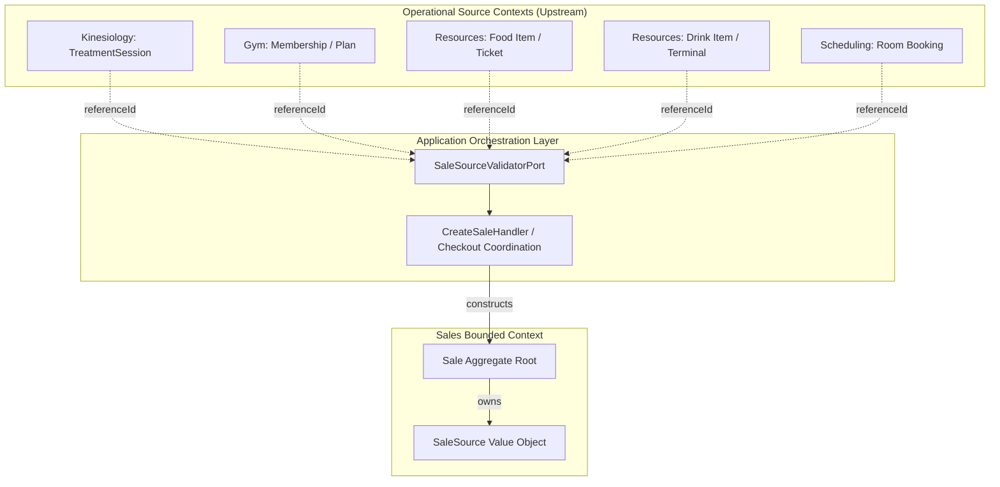
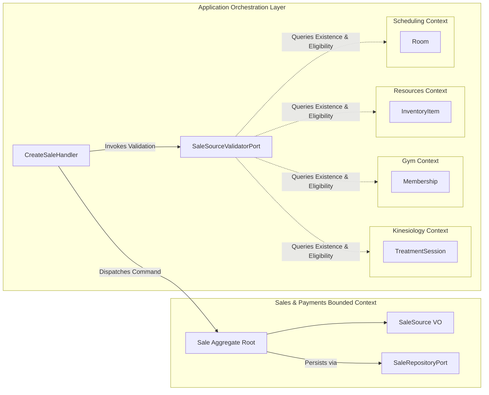

# Milestone 7.9: Commercial Origin & SaleSource Technical Architecture Specification

- **Status**: Approved & Authoritative
- **Version**: 1.0.0
- **Date**: 2026-10-01
- **Domain**: Sales & Payments Bounded Context
- **Milestone**: 7.9 — Sale Source References
- **Deciders**: Senior Technical Documentation Architect, Principal Domain Architect, Staff Backend Engineer
- **Normative References**:
  - [ADR-0110: Sale Transaction Ownership and Source Bounded-Context Integrity](../adr/0110-sale-ownership.md)
  - [ADR-0112: Sales & Payments Bounded Context Establishment](../adr/0112-sales-bounded-context.md)
  - [ADR-0118: Sale Reference and Receipt Identification Strategy](../adr/0118-sale-reference-and-receipt-identification-strategy.md)
  - [ADR-0119: Sale Aggregate Boundary, Invariants, and Commercial Transaction Integrity](../adr/0119-sale-aggregate-boundary-and-invariants.md)
  - [ADR-0120: Commercial Transaction Uniqueness, Idempotency, and Exactly-One-Sale Invariant](../adr/0120-commercial-transaction-uniqueness-and-sale-idempotency.md)
  - [ADR-0121: Sale Source References and Commercial Origin Model](../adr/0121-sale-source-references-and-commercial-origin-model.md)
  - [SaleSource Database Migration Architecture & Decision Record](./sale-source-database-migration-decision.md)
  - [SaleSource Extensibility Review & Design Guardrails](./sale-source-extensibility-review.md)

---

## 1. Executive Summary & Design Principles

Milestone 7.9 establishes the canonical mechanism by which commercial checkout agreements (`Sale`) capture, preserve, and query their operational origin without violating bounded-context isolation. In the Kinergy Platform, sales transactions originate across diverse physical, clinical, and recreational operations: kinesiotherapy rehabilitation, gym memberships, concession snacks, wellness beverages, and room rentals.

### Core Architectural Axioms

1. **Generic Uniformity of Sales**: Every commercial checkout in the platform is governed by the same financial invariants: line items, quantities, discounts, tax calculations, tenders, and legal receipts. A `Sale` is always a generic aggregate root.
2. **References Over Ownership (ADR-0110)**: Sales records lightweight, scalar, unconstrained correlation pointers (`SaleSource`) to upstream operational entities. Sales **never** assumes lifecycle authority, schema ownership, or relational foreign keys over source entities.
3. **Strict Bounded-Context Autonomy**: Sales never imports concrete entity classes, tables, or repositories from source contexts (`Kinesiology`, `Gym`, `Resources`, `Scheduling`). Cross-context validation is strictly decoupled and mediated by the application orchestration layer.
4. **No Subclassing Anti-Pattern**: There are **no source-specific Sale subclasses** (e.g., `FoodSale`, `GymSale`, `KinesiologySale`, `DrinkSale`, `RoomSale` are strictly prohibited). All commercial transactions share the identical aggregate root.

---

## 2. SaleSource Domain Model

### 2.1 Purpose

The `SaleSource` Value Object serves three distinct architectural purposes:

1. **Auditability & Provenance**: Legally and operationally documents what business activity or facility engagement initiated the commercial checkout session.
2. **Fulfillment Correlation**: Supplies downstream integration handlers (e.g., inventory depletion pipelines, membership activation listeners, clinical billing confirmation) with the opaque correlation identifier required to reconcile operational status.
3. **Operational De-duplication**: Provides the correlation key enabling application orchestration to enforce single-billing invariants (such as preventing the same completed clinical session from being billed twice per ADR-0120).

### 2.2 Structure

`SaleSource` is modeled as an immutable, self-validating Value Object ([`SaleSource`](file:///c:/Projects/kinergy-platform/packages/core/src/sales/domain/value-objects/sale-source.vo.ts)):

```typescript
export interface SaleSourceProps {
  readonly type: SaleSourceType;
  readonly referenceId: string;
  readonly referenceCode?: string | null;
}

export class SaleSource implements ValueObject<SaleSourceProps> {
  private readonly _type: SaleSourceType;
  private readonly _referenceId: string;
  private readonly _referenceCode: string | null;
  // Deeply frozen via Object.freeze(this)
}
```

#### Structural Attributes

| Field           | Type             | Required | Constraints                                                                       | Purpose                                                                            |
| :-------------- | :--------------- | :------: | :-------------------------------------------------------------------------------- | :--------------------------------------------------------------------------------- |
| `type`          | `SaleSourceType` |   Yes    | Must match one of the 5 canonical enum values (or supported persistence aliases). | Categorizes the operational domain of origin.                                      |
| `referenceId`   | `string`         |   Yes    | Length: 1–255 characters. Non-empty, trimmed, no control characters.              | Opaque primary correlation identifier in the upstream domain.                      |
| `referenceCode` | `string \| null` |    No    | Length: 1–255 characters when present. Trimmed, no control characters.            | Optional human-readable business/order code (e.g., `ORD-2026-0042` or ticket SKU). |

### 2.3 Supported Source Types

The platform standardizes on five canonical commercial origin types:

```typescript
export enum SaleSourceType {
  KINESIOLOGY_SESSION = 'KINESIOLOGY_SESSION',
  GYM_MEMBERSHIP = 'GYM_MEMBERSHIP',
  FOOD = 'FOOD',
  DRINK = 'DRINK',
  ROOM_RENTAL = 'ROOM_RENTAL',
}
```

_Note on Persistence & Legacy Compatibility_: For backward compatibility with legacy persistence data and internal line-item mappings, mappers translate legacy aliases (`TREATMENT_SESSION` $\to$ `KINESIOLOGY_SESSION`, `MEMBERSHIP_PLAN` $\to$ `GYM_MEMBERSHIP`, `INVENTORY_ITEM` $\to$ `FOOD`/`DRINK`, `CUSTOM_SERVICE` $\to$ `ROOM_RENTAL`).

### 2.4 Reference Semantics

`SaleSource` represents an **unconstrained external scalar reference** (a loose pointer):

- **Opaque Correlation**: Sales does not parse, introspect, or resolve internal structure from `referenceId`. It treats the ID as a pure correlation token.
- **No Relational Foreign Keys**: The database schema enforces no SQL `FOREIGN KEY` constraints between Sales and upstream tables. Bounded contexts remain physically decoupled.
- **Reference Resolution**: Any cross-context query requiring source details (e.g., patient name on clinical receipts, membership tier details) is resolved at the application or presentation layer via asynchronous read models or facade ports, never via relational joins inside the domain.

### 2.5 Lifecycle & Immutability

1. **Creation**: A `Sale` receives its `SaleSource` during construction via `Sale.create(props)` or during reconstitution from persistence via `Sale.reconstitute(props)`.
2. **Draft Mutation**: While in `DRAFT` status, if a sale was initialized with an ad-hoc or walk-in source, the source may be explicitly assigned or updated once via `sale.assignSource(newSource)`.
3. **Post-Draft Immutability**: Once line items are locked or the sale transitions out of `DRAFT` (into `FINALIZED`, `PAID`, or `CANCELLED`), `SaleSource` is **strictly immutable**. Any call to mutate the source triggers an immediate `SaleDomainException` (`CANNOT_MUTATE_FINALIZED_SALE` or `CANNOT_MUTATE_CANCELLED_SALE`).
4. **Permanent Binding**: A source reference cannot be cleared, nulled, or removed from a sale. It permanently documents the commercial agreement's origin.

### 2.6 Ownership

`SaleSource` is a **Value Object owned exclusively by the `Sale` aggregate root**. It possesses no independent lifecycle, repository, or database table. Conversely, the operational business record identified by `referenceId` is owned exclusively by its upstream bounded context.

---

## 3. Supported Sources: Commercial Relationship to Sales

To prevent context bleed, Sales captures **only the commercial relationship** for each source type. Source-domain clinical, operational, and physical access rules are strictly isolated within their respective bounded contexts.



### 3.1 KINESIOLOGY_SESSION

- **Upstream Bounded Context**: `Kinesiology`
- **Upstream Entity**: `TreatmentSession`
- **Relationship to Sales**:
  - Initiates commercial checkout for professional clinical healthcare services delivered by a therapist or kinesiologist.
  - Represents a **discrete single-delivery service**. Governed by **Operational Single-Billing (`SALE-010`)**: a completed clinical session must be billed in at most one active (non-cancelled) `Sale`.
  - Re-billing for the same session is permitted if and only if the prior `Sale` reached terminal state `CANCELLED`.
- **Domain Isolation Guarantee**: Sales captures the billable line item, professional fees, and receipt voucher. Sales **never** imports, evaluates, or stores medical SOAP notes, diagnostic codes, or therapist clinical charts.

### 3.2 GYM_MEMBERSHIP

- **Upstream Bounded Context**: `Gym Management`
- **Upstream Entity**: `Membership` or `MembershipPlan`
- **Relationship to Sales**:
  - Initiates commercial agreement for facility access privileges, recurring subscription plans, or plan renewals.
  - Governed by **Multi-Sale Reference Semantics**: Multiple sales legitimately reference the same `MembershipPlan` identifier (thousands of members purchasing the same tier), or record sequential renewal checkouts for an existing member agreement.
- **Domain Isolation Guarantee**: Sales collects tenders, calculates discounts, and issues proof of payment. Sales **never** evaluates turnstile access eligibility, anti-passback rules, freeze periods, or attendance tracking.

### 3.3 FOOD

- **Upstream Bounded Context**: `Resources Management` (Retail Inventory)
- **Upstream Entity**: `InventoryItem` (or kitchen POS register order)
- **Relationship to Sales**:
  - Initiates commercial retail transaction for prepared meals, snacks, supplements, or cafeteria concessions.
  - Governed by **Multi-Sale Reference Semantics**: Thousands of distinct checkout transactions reference the identical catalog item (`inv_protein_bar`) or register ticket.
  - Triggers asynchronous downstream inventory decrement event upon sale finalization/payment.
- **Domain Isolation Guarantee**: Sales verifies pricing, taxes, and payment tenders. Sales **never** tracks recipe formulations, ingredient batches, shelf-life expiration, or kitchen preparation stations.

### 3.4 DRINK

- **Upstream Bounded Context**: `Resources Management` (Retail Inventory)
- **Upstream Entity**: `InventoryItem` (category `HEALTHY_DRINKS`) or POS terminal
- **Relationship to Sales**:
  - Initiates commercial retail transaction for bottled beverages, smoothies, functional shakes, or counter concessions.
  - Supports walk-in guest checkouts defaulting to standardized POS terminal origins (e.g., `DRINK` + `pos_checkout_terminal`).
  - Governed by **Multi-Sale Reference Semantics**: Repeat sales share the same item SKU or cashier register code.
- **Domain Isolation Guarantee**: Sales executes financial settlement. Sales **never** manages bar preparation queues, beverage dispensing hardware, or cooler temperature compliance.

### 3.5 ROOM_RENTAL

- **Upstream Bounded Context**: `Scheduling`
- **Upstream Entity**: `Room`
- **Relationship to Sales**:
  - Initiates commercial billing for private facility rentals, multi-purpose studio hires, or therapist treatment bay reservations.
  - Governed by **Multi-Sale Reference Semantics**: The same physical room reference (`room_studio_a`) is repeatedly billed across distinct time slots, dates, and client leases.
- **Domain Isolation Guarantee**: Sales collects deposits, rental fees, and issues receipts. Sales **never** manages calendar availability slots, booking conflict algorithms, or room turnaround/cleaning protocols.

---

## 4. Aggregate Root Integration

### 4.1 Sale Owns SaleSource

In Domain-Driven Design, the `Sale` aggregate root is the sole cluster of consistency. `SaleSource` is a subordinate Value Object owned by `Sale`:

- **Encapsulation**: Private field `private readonly _source: SaleSource`.
- **Accessor**: Public getter `public get source(): SaleSource` returning an immutable reference.
- **Creation Integrity**: `Sale.create()` enforces that a non-null, valid `SaleSource` is supplied.
- **Line Item Consistency**: Child line items (`SaleItem`) optionally snapshot their individual item source references, aligning with the parent aggregate's commercial origin.

### 4.2 Source is Part of Commercial Context

`SaleSource` provides commercial context for the transaction:

- Informs receipt voucher formatting and metadata headers (ADR-0118).
- Provides cashier reconciliation categorization on cash drawer balancing reports.
- Supplies correlation tags for sales reporting by operational department without coupling to operational databases.

### 4.3 Source Mutation Follows Sale Lifecycle

`SaleSource` mutation invariants strictly adhere to the aggregate's lifecycle state machine:

```
[DRAFT] ───────(finalize)───────► [FINALIZED] ───────(pay)───────► [PAID]
   │                                   │                              │
   │                                   ▼                              │
   └───────────(cancel)──────────► [CANCELLED] ◄──────────────────────┘
```

- **In `DRAFT`**: Source can be assigned once if created with default walk-in parameters (`assignSource()`).
- **In `FINALIZED`**: Immutable. Calling `assignSource()` throws `SaleDomainException: CANNOT_MUTATE_FINALIZED_SALE`.
- **In `PAID`**: Immutable. Calling `assignSource()` throws `SaleDomainException: CANNOT_MUTATE_PAID_SALE`.
- **In `CANCELLED`**: Immutable. Calling `assignSource()` throws `SaleDomainException: CANNOT_MUTATE_CANCELLED_SALE`.

### 4.4 Source Does Not Become Sale Identity

The identity of the `Sale` aggregate is **strictly and exclusively `SaleId`** (a UUID-backed identifier).

- Two sales sharing the exact same `SaleSource` (e.g., two members purchasing `GYM_MEMBERSHIP / plan_gold`) are **distinct commercial entities** with distinct `SaleId`s, transaction timestamps, cashier IDs, and ledger receipts.
- `SaleSource` is an attribute of the agreement, **not** its identity.

---

## 5. Bounded Contexts & Decoupled Architecture

### 5.1 Context Boundary Map



### 5.2 Decoupling Invariants

1. **Source Domain Owns Source Entity**: Upstream contexts have complete authority over their domain entities, lifecycle states, clinical notes, and physical access rules.
2. **Sales Owns Sale**: Sales has complete authority over financial lines, monetary subtotals, order discounts, taxes, and receipt issuance.
3. **Application Layer Coordinates**:
   - Cross-context coordination is mediated by application handlers ([`CreateSaleHandler`](file:///c:/Projects/kinergy-platform/packages/core/src/sales/application/handlers/create-sale.handler.ts), [`AssignSaleSourceHandler`](file:///c:/Projects/kinergy-platform/packages/core/src/sales/application/handlers/assign-sale-source.handler.ts)).
   - Optional synchronous validation of source existence or eligibility is mediated via [`SaleSourceValidatorPort`](file:///c:/Projects/kinergy-platform/packages/core/src/sales/application/ports/sale-source-validator.port.ts).
   - Sales domain code contains **zero imports** of external domain modules.

---

## 6. Relational Persistence Architecture

### 6.1 Schema Representation

In PostgreSQL (managed via Prisma), `SaleSource` is flattened into scalar columns on the `sales` and `sale_items` tables:

```prisma
model Sale {
  id          String   @id @default(uuid())
  tenantId    String   @map("tenant_id")
  status      String   @map("status")
  currency    String   @map("currency")
  clientId    String?  @map("client_id")

  // Commercial Origin Reference (ADR-0121 / Milestone 7.9)
  sourceType  String   @map("source_type")
  sourceId    String   @map("source_id")
  sourceCode  String?  @map("source_code")

  subtotalCents      Int @map("subtotal_cents")
  discountTotalCents Int @map("discount_total_cents")
  totalCents         Int @map("total_cents")
  version            Int @default(1)

  createdAt DateTime @default(now()) @map("created_at")
  updatedAt DateTime @updatedAt @map("updated_at")

  items SaleItem[]

  @@index([tenantId, sourceType, sourceId], name: "idx_sales_tenant_source_composite")
  @@map("sales")
}
```

### 6.2 Nullability & Column Constraints

| Column Name   | SQL Type       | Nullable | Default | Description                                                    |
| :------------ | :------------- | :------: | :-----: | :------------------------------------------------------------- |
| `source_type` | `VARCHAR(64)`  |  **NO**  |  None   | String representation of `SaleSourceType`.                     |
| `source_id`   | `VARCHAR(255)` |  **NO**  |  None   | Opaque upstream reference identifier.                          |
| `source_code` | `VARCHAR(255)` | **YES**  | `NULL`  | Optional human-readable order/ticket reference for receipting. |

### 6.3 Indexing Strategy

- **Composite Correlation Index**: `@@index([tenantId, sourceType, sourceId], name: "idx_sales_tenant_source_composite")`
  - Optimizes `findBySourceReference(sourceType, sourceId, tenantId)` queries to sub-millisecond execution.
  - Automatically leveraged by multi-tenant operational audits and de-duplication checks.
- **Child Items Correlation Index**: `@@index([tenantId, sourceType, sourceId], name: "idx_sale_items_tenant_source_composite")` on `sale_items`.

### 6.4 Uniqueness Semantics: Why Blanket DB Unique Constraint is Rejected

The platform **explicitly rejects** placing a database-level composite unique constraint `@@unique([tenantId, sourceType, sourceId])` on `sales`:

1. **Retail Consumables (`FOOD`, `DRINK`)**: Would allow only one customer to ever purchase a bottle of water or protein bar in the entire operational history of the tenant.
2. **Gym Memberships (`GYM_MEMBERSHIP`)**: Would prevent more than one member from ever enrolling in the same membership plan tier.
3. **Room Rentals (`ROOM_RENTAL`)**: Would prevent a studio or bay from ever being rented more than once across calendar history.
4. **Post-Cancellation Re-billing**: If a sale for a clinical session is cancelled due to cashier error, a database-level unique constraint would permanently block that session from ever being billed again.

#### Operational Single-Billing Implementation

For single-billing services (`KINESIOLOGY_SESSION`), single-billing is enforced **deterministically at the application and repository layer**:

- `PrismaSaleRepository.save()` and `CreateSaleHandler` check for existing active sales (`status != 'CANCELLED'`).
- Racing concurrent requests billings are serialized inside ACID transactions (`prisma.$transaction`), deterministically rejecting conflicting duplicates with [`DuplicateSaleException`](file:///c:/Projects/kinergy-platform/packages/core/src/sales/domain/exceptions/duplicate-sale.exception.ts) (HTTP 409 Conflict).

### 6.5 Migration Strategy

The migration strategy follows zero-downtime additive evolution:

1. **Pre-Migration Audit**: Verified baseline schema compatibility via [`sale-source-database-migration-decision.md`](./sale-source-database-migration-decision.md).
2. **Additive Migration**: Applied non-blocking composite indexes and scalar column backfills via migration `20260930000000_add_sale_source_correlation_indexes`.
3. **Zero Data Loss & Rollback Safety**: Forward-only compatible; indexes can be dropped concurrently if rollback is requested without service disruption.

---

## 7. API Transport & Security Architecture

### 7.1 Request Representation

Clients supply commercial origin information via structured DTOs ([`SourceReferenceInputDto`](file:///c:/Projects/kinergy-platform/apps/api/src/sales/dto/source-reference.dto.ts)):

```json
{
  "currency": "USD",
  "clientId": "client_12345",
  "sourceReference": {
    "type": "FOOD",
    "referenceId": "food_order_8821",
    "referenceCode": "ORD-2026-0042"
  }
}
```

_Note_: For backward compatibility, the API also accepts the legacy nested property `source: { type, referenceId, referenceCode }` and legacy field names (`sourceType`, `sourceId`, `sourceCode`).

### 7.2 Response Representation

Sales endpoints return origin metadata within [`SaleSourceResponseDto`](file:///c:/Projects/kinergy-platform/apps/api/src/sales/dto/source-reference.dto.ts):

```json
{
  "id": "sale_01j9876543210abcdef",
  "status": "DRAFT",
  "currency": "USD",
  "clientId": "client_12345",
  "sourceReference": {
    "type": "FOOD",
    "referenceId": "food_order_8821",
    "referenceCode": "ORD-2026-0042"
  },
  "items": [],
  "subtotal": { "amount": 0, "currency": "USD" },
  "discountTotal": { "amount": 0, "currency": "USD" },
  "total": { "amount": 0, "currency": "USD" }
}
```

### 7.3 Validation & Sanitization

Input payloads pass through NestJS's `GlobalSanitizationValidationPipe` with declarative `class-validator` decorators:

- `@IsEnum(SaleSourceType)`: Rejects unknown source types with `400 Bad Request`.
- `@IsNotEmpty()`, `@IsString()`: Rejects null or undefined references.
- `@Matches(/\S/)`: Rejects whitespace-only reference identifiers.
- `@MaxLength(255)`: Enforces upper length boundary preventing payload bloat.
- Control-character sanitization regex (`/^[^\x00-\x1F\x7F]+$/`) preventing header injection or log-poisoning.

### 7.4 Authorization & RBAC

All endpoints exposing or modifying `SaleSource` enforce enterprise platform security:

- **Guards**: `@UseGuards(AuthenticationGuard, AuthorizationGuard)`
- **Authentication**: JWT Bearer token providing verified `AuthenticatedUserContext` and `tenantId`.
- **Role Permissions**:
  - `POST /api/v1/sales`: `@Roles('Owner', 'Manager', 'Receptionist', 'Kitchen Staff')`, `@Permissions('sales.create')`
  - `POST /api/v1/sales/:id/source`: `@Roles('Owner', 'Manager', 'Receptionist')`, `@Permissions('sales.create')`
  - `GET /api/v1/sales/:id`: `@Roles('Owner', 'Manager', 'Receptionist', 'Trainer', 'Kitchen Staff')`, `@Permissions('sales.read')`

---

## 8. End-to-End Traceability Matrix

The complete traceability chain connecting business requirements to automated verification:

| Business Requirement                                                  | Architectural Decision   | Domain Model                                                                       | Aggregate Implementation                                | Application Orchestration                        | Persistence Layer                                   | API Transport                                      | Automated Test Suites                                                                      |
| :-------------------------------------------------------------------- | :----------------------- | :--------------------------------------------------------------------------------- | :------------------------------------------------------ | :----------------------------------------------- | :-------------------------------------------------- | :------------------------------------------------- | :----------------------------------------------------------------------------------------- |
| **BR-SRC-01**: Commercial checkouts must record operational origin.   | ADR-0110, ADR-0121       | `SaleSource` VO (`packages/core/src/sales/domain/value-objects/sale-source.vo.ts`) | `Sale._source`, `Sale.create()`, `Sale.reconstitute()`  | `CreateSaleCommand`, `CreateSaleHandler`         | `Sale.sourceType`, `Sale.sourceId` in Prisma schema | `SourceReferenceInputDto`, `SaleSourceResponseDto` | `sale-source.vo.spec.ts`, `sale-source-aggregate-integration.spec.ts`                      |
| **BR-SRC-02**: Support 5 facility source types without subclassing.   | ADR-0121 §4.3, ADR-0119  | `SaleSourceType` enum                                                              | Single uniform `Sale` aggregate root                    | Validated in `CreateSaleHandler` via enum checks | Stored as string scalar on `sales`                  | `@IsEnum(SaleSourceType)` on DTO                   | `sale-source.vo.spec.ts`, `sales-architecture-boundaries.spec.ts`                          |
| **BR-SRC-03**: Source reference is strictly immutable after draft.    | ADR-0121 §4.9, ADR-0119  | `SaleSource` (frozen VO)                                                           | `Sale.assignSource()` invariant checks                  | `AssignSaleSourceHandler` checks status          | Reconstituted immutably via mapper                  | Returns `409 Conflict` if finalized                | `sale-source-lifecycle-matrix.spec.ts`, `sale-cancelled-immutability.spec.ts`              |
| **BR-SRC-04**: Decouple sales from source domain entities.            | ADR-0110, ADR-0121 §4.14 | Loose scalar pointer                                                               | Zero entity imports in `packages/core/src/sales/domain` | Mediated by `SaleSourceValidatorPort`            | No SQL foreign keys to upstream tables              | Generic opaque IDs in DTOs                         | `sales-architecture-boundaries.spec.ts`                                                    |
| **BR-SRC-05**: Allow multiple sales per source for retail & plans.    | ADR-0121 §4.15           | Value Object equality semantics                                                    | Multiple aggregates can share source reference          | Non-blocking creation for retail types           | Composite index without unique constraint           | Independent `SaleId`s generated                    | `sale-source-uniqueness-semantics.spec.ts`, `sale-source-persistence.spec.ts`              |
| **BR-SRC-06**: Prevent duplicate active billing on clinical sessions. | ADR-0120, ADR-0121 §4.16 | `SaleSourceType.KINESIOLOGY_SESSION`                                               | Aggregate enforces idempotency                          | `CreateSaleHandler` deduplication check          | Atomic transaction find-and-save in Prisma          | Returns `409 Conflict` on duplicate                | `sale-commercial-transaction-uniqueness.spec.ts`, `prisma-sale-source-concurrency.spec.ts` |
| **BR-SRC-07**: API validation and RBAC authorization.                 | ADR-0121 §4.19           | Pure domain validation                                                             | Throws `SaleDomainException`                            | Handled by `SalesExceptionFilter`                | Managed by NestJS repository adapter                | Global validation pipe, `@UseGuards`               | `sales-source-api.spec.ts`                                                                 |

---

## 9. Architectural Guardrails: Confirmation of Zero Subclasses

To ensure no architectural drift occurs in future development:

> [!IMPORTANT]
> **Zero Subclass Policy (Confirmed)**:
> The Kinergy Platform strictly rejects aggregate subclassing for commercial sales.
>
> - ❌ Anti-Pattern: `class FoodSale extends Sale { ... }`
> - ❌ Anti-Pattern: `class GymSale extends Sale { ... }`
> - ❌ Anti-Pattern: `class KinesiologySale extends Sale { ... }`
> - ❌ Anti-Pattern: `class RoomRentalSale extends Sale { ... }`
> - ❌ Anti-Pattern: `class DrinkSale extends Sale { ... }`
>
> ✅ Canonical Pattern: Every commercial transaction in the platform is an instance of the pure, generic `Sale` aggregate root, containing a scalar `SaleSource` Value Object.
