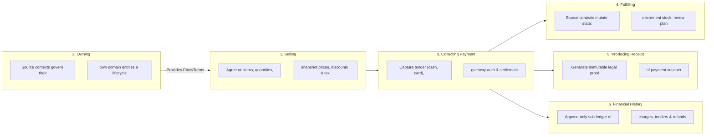
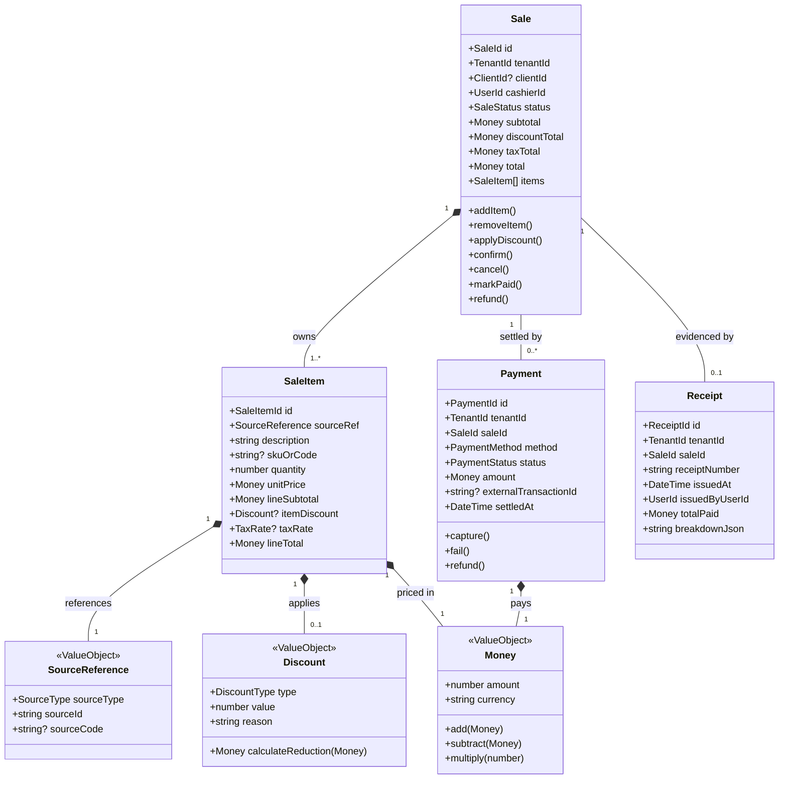
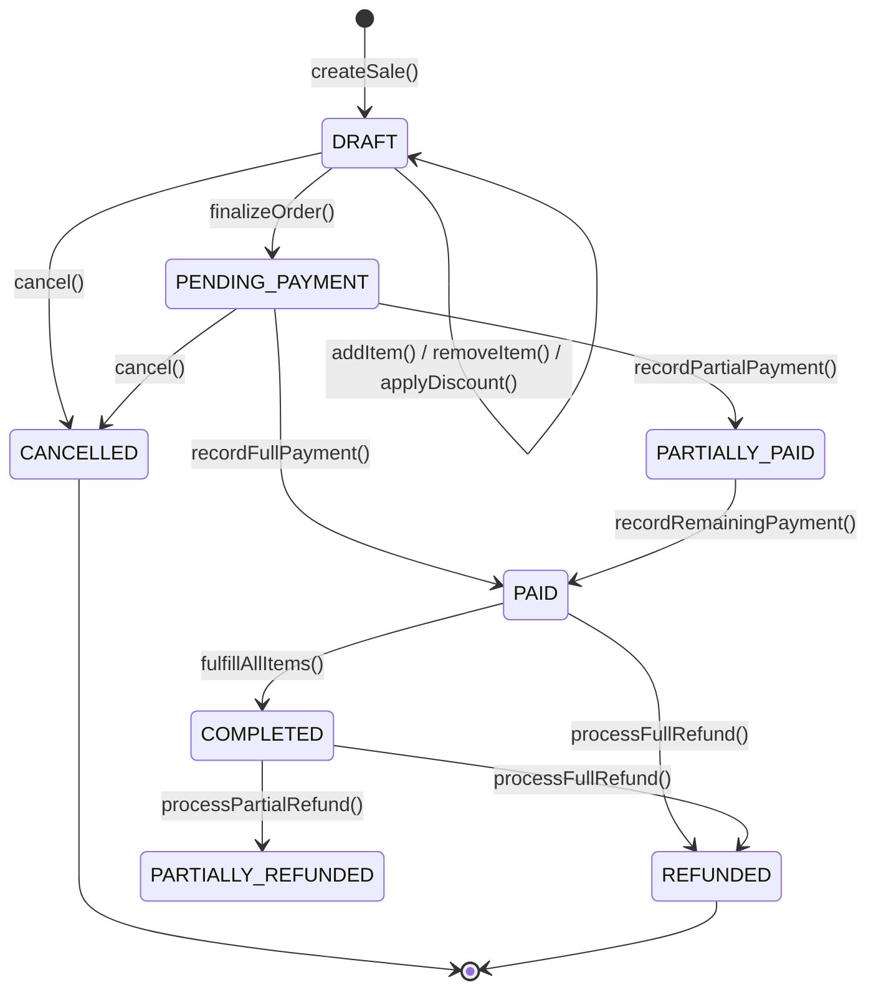
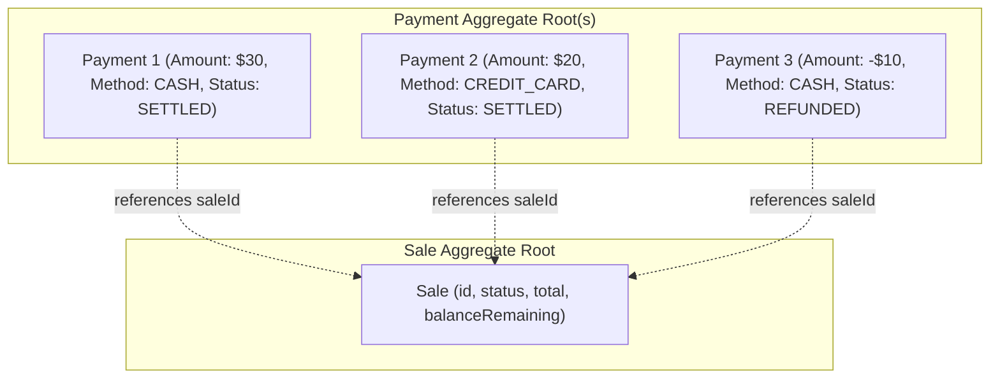
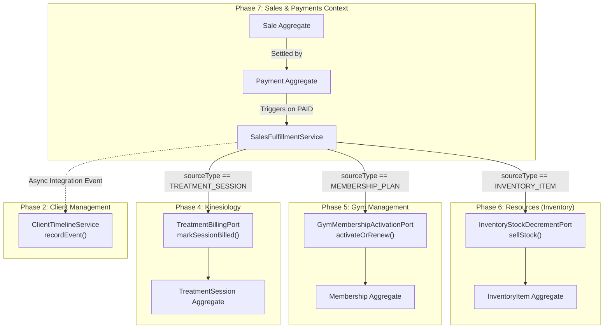
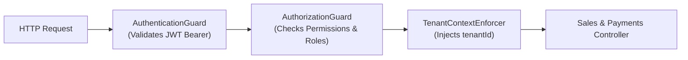

# Phase 7: Sales & Payments — Architectural Contract & Subsystem Specification

- **Document**: `docs/architecture/sales-payments.md`
- **Status**: Authoritative Architectural Contract
- **Domain**: Phase 7 — Sales & Payments
- **Role**: Principal Domain Architect / Staff Platform Engineer
- **Date**: 2026-09-17

---

## 1. Purpose

The **Sales & Payments** bounded context exists to provide a unified, authoritative commercial transaction and settlement engine for the entire Kinergy platform.

In an integrated health, wellness, and fitness business, commercial transactions originate across distinct operational areas:

- Clinical rehabilitation consultations and kinesiology therapy sessions (Phase 4)
- Gym membership plans, renewals, and visit passes (Phase 5)
- Consumable inventory purchases: supplements, protein shakes, healthy meals, and wellness drinks (Phase 6)
- Facility amenities, room rentals, workshops, and custom services (Phase 3 & Future)

Without a centralized Sales & Payments context, each operational area is forced to invent its own invoicing, tender handling, discount logic, receipt generation, and payment gateway bindings. This fragmentation leads to:

1. Inconsistent financial ledgers and fragmented client billing histories.
2. Inability to execute a single, unified point-of-sale (POS) checkout combining goods and services (e.g., a client buying a gym membership, a therapy session, and a smoothie in one transaction).
3. Leakage of payment gateway credentials, fiscal compliance, and tax calculation rules into clinical, scheduling, and inventory domain models.

### Foundational Architectural Principle

> **"References Over Ownership."**  
> The Sales context records and settles the commercial transaction. It never becomes the owner of the things being sold, the people buying them, or the physical inventory fulfilling them.

To guarantee bounded context integrity, the platform strictly delineates six distinct responsibilities:



1. **Selling Something**: The commercial agreement. Assembles line items, applies order/item discounts, calculates taxes, snapshots current prices, and determines the total payable balance. Governed by the `Sale` aggregate.
2. **Owning the Thing Being Sold**: The source bounded context remains the sole authority over the underlying business entity (e.g., Gym owns `Membership` and `MembershipPlan`; Resources owns `InventoryItem`; Kinesiology owns `TreatmentSession`). Sales holds **references**, never ownership.
3. **Collecting Payment**: The financial transfer of value. Executes tender transactions (cash drawer, credit card terminal, digital wallet, payment gateway), verifies authorizations, and tracks payment settlement status. Governed by the `Payment` aggregate.
4. **Fulfilling the Thing Being Sold**: The operational execution triggered by commercial settlement. Handled strictly by the owning source domain via established application ports (e.g., Resources decrements stock via `InventoryStockDecrementPort`; Gym extends membership periods; Kinesiology records the session as billed).
5. **Producing a Receipt**: The issuance of an immutable, tamper-evident legal voucher (`Receipt`) displaying transaction date, line item breakdown, tax details, payment method, cashier attribution, and unique receipt number.
6. **Recording Financial History**: The append-only, immutable record of every commercial charge, payment authorization, void, and refund for operational and audit reporting.

---

## 2. Bounded Context Definition

```
┌────────────────────────────────────────────────────────────────────────────────────────┐
│                        SALES & PAYMENTS BOUNDED CONTEXT                                 │
│                                                                                        │
│  WHAT IT OWNS:                                                                         │
│  ✓ Sales Orders & Checkout Sessions (Sale)                                             │
│  ✓ Snapshot Line Items (SaleItem)                                                      │
│  ✓ Discounts & Promotional Adjustments (Discount)                                      │
│  ✓ Payment Transactions & Settlement Records (Payment)                                 │
│  ✓ Payment Method Configurations (PaymentMethod)                                       │
│  ✓ Customer Receipts & Proof-of-Purchase (Receipt)                                     │
│  ✓ Commercial Order Lifecycle (DRAFT → PENDING → PAID → COMPLETED → REFUNDED)          │
│  ✓ Point-of-Sale (POS) Checkout Workflows                                              │
│                                                                                        │
│  WHAT IT DOES NOT OWN:                                                                 │
│  ✗ Master Client Profiles & Identities (Owned by Client Management)                    │
│  ✗ User Authentication & Permissions (Owned by IAM)                                    │
│  ✗ Physical Stock Balances & Movement Ledgers (Owned by Resources / Inventory)         │
│  ✗ Capital Assets & Depreciation (Owned by Resources / Fixed Assets)                   │
│  ✗ Membership Validity Dates & Turnstile Rules (Owned by Gym Management)               │
│  ✗ Clinical Notes, Diagnoses & SOAP Records (Owned by Kinesiology)                     │
│  ✗ Room Schedules & Appointment Calendars (Owned by Scheduling)                        │
│  ✗ General Ledger (GL) Double-Entry Bookkeeping & Fiscal Tax Filings (Accounting)     │
└────────────────────────────────────────────────────────────────────────────────────────┘
```

### Prevention of the "Everything Financial" Anti-Pattern

A frequent failure mode in monolithic platforms is expanding the sales module into a catch-all financial dumping ground that subsumes inventory valuation, therapist commission tracking, equipment depreciation, gym billing rules, and general ledger accounting.

Kinergy strictly prevents this anti-pattern through the following boundaries:

1. **Inventory Valuation Remains in Resources**: Consumable inventory working capital ($\sum \text{currentStock} \times \text{purchaseCost}$) and fixed asset book value ($\sum \text{currentEstimatedValue}$) are strictly governed and computed by Phase 6 Resources. Sales & Payments does not manage or recalculate asset book values.
2. **Membership Lifecycle Remains in Gym**: Whether a client is eligible to enter the facility, whether a membership is frozen, and how grace periods are evaluated are strictly governed by Gym Management (`AccessEligibilityEngine`). Sales only processes the commercial subscription fee and signals payment completion.
3. **Clinical Documentation Remains in Kinesiology**: Therapists document SOAP progress notes in Kinesiology. Sales has zero visibility into medical assessments or diagnostic details.
4. **Sales is a Commercial Sub-Ledger, Not a General Ledger**: Sales & Payments records commercial transactions and settlement events. It does not maintain a double-entry chart of accounts, debit/credit balancing, or corporate fiscal returns.

---

## 3. Core Conceptual Model

The conceptual domain model consists of the following foundational concepts:



### Conceptual Specifications

1. **`Sale`**:
   The primary commercial aggregate root representing a purchase agreement between Kinergy and a customer. Encapsulates order state, items, discounts, calculated taxes, and payment fulfillment status.
2. **`SaleItem`**:
   An entity within the `Sale` aggregate representing an individual line item. Stores a permanent commercial snapshot of the unit price, description, quantity, tax rate, and applied discount at the moment of sale.
3. **`Payment`**:
   An autonomous aggregate root representing a monetary settlement transaction. Captures tender method (`CASH`, `CREDIT_CARD`, `DEBIT_CARD`, `BANK_TRANSFER`, `DIGITAL_WALLET`), payment gateway transaction identifiers, status (`INITIATED`, `AUTHORIZED`, `SETTLED`, `FAILED`, `REFUNDED`), and timestamps.
4. **`Receipt`**:
   An autonomous, immutable legal document entity generated upon full or milestone payment. Contains a monotonically increasing receipt number (e.g. `REC-2026-000042`), timestamp, cashier attribution, and frozen summary JSON.
5. **`SourceReference`**:
   An immutable Value Object within `SaleItem` establishing the loose, typed link to the origin entity (`sourceType`: `INVENTORY_ITEM`, `MEMBERSHIP_PLAN`, `TREATMENT_SESSION`, `CUSTOM_SERVICE`, and `sourceId`: UUID string).
6. **`Money`**:
   The canonical platform Value Object (shared kernel) encapsulating an exact non-negative amount (fixed 2 decimal places / integer cents) and ISO-4217 currency code.
7. **`Discount`**:
   An immutable Value Object representing a fixed-amount or percentage reduction applied at either the line-item level or order level, with a mandatory business explanation.

---

## 4. Aggregate Boundaries & Transactional Lifecycles

### 4.1 The `Sale` Aggregate Root

```
┌────────────────────────────────────────────────────────────────────────┐
│                        SALE AGGREGATE BOUNDARY                         │
│                                                                        │
│  [Sale Root Entity]                                                    │
│  - id: SaleId                                                          │
│  - tenantId: TenantId                                                  │
│  - status: SaleStatus (DRAFT | PENDING_PAYMENT | PAID | CANCELLED...) │
│  - version: number (Optimistic Concurrency Control)                    │
│  - orderDiscount: Discount?                                            │
│                                                                        │
│  [Internal Owned Entities]                                             │
│  - items: SaleItem[]                                                   │
│    ├── id: SaleItemId                                                  │
│    ├── sourceRef: SourceReference (Value Object)                       │
│    ├── unitPrice: Money (Snapshot)                                     │
│    ├── quantity: number (Positive integer or decimal)                  │
│    └── itemDiscount: Discount?                                         │
│                                                                        │
│  TRANSACTIONAL INVARIANTS:                                             │
│  1. An item cannot be added or modified unless status == DRAFT.        │
│  2. Total = Sum(LineTotals) - OrderDiscount. Total cannot be negative. │
│  3. Currencies of all items, discounts, and totals must be identical.  │
│  4. Modifying Sale and its items commits in a single DB transaction.   │
└────────────────────────────────────────────────────────────────────────┘
```

#### Invariants & Rules

1. **Commercial Immutability**: Once a `Sale` transitions out of `DRAFT` (e.g. into `PAID` or `PARTIALLY_PAID`), line items cannot be added, edited, or deleted. The commercial terms are locked.
2. **Currency Consistency**: All items, discounts, taxes, and totals within a `Sale` must share the identical ISO-4217 currency code. Mixed-currency sales are strictly rejected.
3. **Non-Negative Valuation**: Line items and net order totals must never be negative. Promotional discounts exceeding the order total are capped at the order value (total payable $\ge 0$).
4. **Optimistic Concurrency Control (OCC)**: The `Sale` aggregate root maintains an integer `version` field incremented on every state change to prevent lost updates during concurrent cashier operations.

#### Lifecycle State Machine



### 4.2 The `Payment` Aggregate Root

#### Architectural Decision: Why `Payment` is an Autonomous Aggregate

Kinergy models `Payment` as an **autonomous aggregate root**, linked to `Sale` via scalar `saleId: string`, rather than an internal child entity of `Sale`.



#### Rationale

1. **Split-Tender Payments**: Front-desk operations frequently require split tenders (e.g., $30 paid in cash, $20 paid via credit card). Modeling payments as distinct records allows multiple tenders to settle a single sale cleanly.
2. **Asynchronous Gateway Latency**: Credit card terminal processing, online payment webhooks, and QR code transfers are asynchronous and prone to network retries. Autonomous payment aggregates allow the payment processing lifecycle (`INITIATED` $\rightarrow$ `AUTHORIZED` $\rightarrow$ `SETTLED`) to proceed without placing an exclusive database lock on the `Sale` aggregate.
3. **Independent Financial Auditing**: Payments represent concrete money movement involving external institutions (acquirers, merchant accounts, bank statements). They require their own state machines, retry policies, failure codes, and transaction references.
4. **Clean Refund Lineage**: A refund is a discrete financial movement. Modeling it as an autonomous payment transaction with negative or inverse tender links preserves an exact audit trail back to the original settlement.

### 4.3 `Receipt` Ownership & Immutability

`Receipt` is an **autonomous, immutable voucher entity**.

- **Issuance Rule**: Generated only when a `Sale` transitions to `PAID` (or receives a qualifying partial deposit).
- **Immutability Guarantee**: Once written with a unique sequential receipt number (`receiptNumber`), a `Receipt` is **read-only and immutable forever**. It can never be updated or deleted.
- **Refund Policy**: When a sale is refunded, the original receipt is **never** deleted or edited. Instead, an autonomous `RefundReceipt` (or `CreditNote`) is issued referencing the original receipt number.

---

## 5. Explicit Ownership Matrix

To eliminate any ambiguity across the engineering team, ownership is strictly established as follows:

| Conceptual Relationship                     | Ownership Status                              | Governing Authority                   | Rationale                                                                                    |
| :------------------------------------------ | :-------------------------------------------- | :------------------------------------ | :------------------------------------------------------------------------------------------- |
| **`Sale` $\rightarrow$ `SaleItem`**         | **Strict Internal Ownership**                 | `Sale` Aggregate                      | A line item has no identity or purpose outside its parent commercial order.                  |
| **`Sale` $\rightarrow$ `Payment`**          | **Decoupled Reference** (`saleId`)            | Autonomous Aggregates                 | Supports split tenders, async gateway retries, and independent financial auditing.           |
| **`Sale` $\rightarrow$ `Receipt`**          | **Immutable Downstream Voucher**              | Autonomous Entity                     | Legal receipts must remain immutable even if the sale is subsequently contested or refunded. |
| **`Sale` $\rightarrow$ `Client`**           | **Loose Scalar Reference** (`clientId?`)      | Client Management                     | Sales associates purchases with clients, but clients are owned and governed by Phase 2.      |
| **`SaleItem` $\rightarrow$ Source Product** | **Loose Typed Reference** (`SourceReference`) | Source Context (Resources, Gym, etc.) | Source domains own business entities; Sales only snapshots commercial terms.                 |
| **`Sale` $\rightarrow$ Cashier / Actor**    | **Loose Scalar Reference** (`cashierId`)      | IAM (Phase 1)                         | Sales records the acting user; IAM owns authentication and credential lifecycles.            |

---

## 6. Source References Architecture

### 6.1 The Problem

When a customer buys something at Kinergy, the item could be:

- A physical consumable product (e.g., Protein Shake, Magnesium Tablets)
- A gym membership subscription (e.g., 1-Month Standard Plan, Annual VIP)
- A clinical kinesiology therapy session (e.g., 60-min Neuromuscular Re-education)
- An ad-hoc charge (e.g., Locker Key Deposit, Guest Day Pass, Facility Rental)

If the `SaleItem` table used hardcoded relational foreign keys (e.g., `inventory_item_id`, `membership_plan_id`, `treatment_session_id`), it would:

1. Couple the relational database schema of 5 different bounded contexts into one table.
2. Require nullable columns for every new product type, causing schema bloat.
3. Break when a source product is discontinued, deleted, or altered.

### 6.2 The Solution: Typed Identifier-Based Source Reference

Kinergy establishes the **Typed Identifier-Based Source Reference pattern**:

```typescript
export enum SourceType {
  INVENTORY_ITEM = 'INVENTORY_ITEM', // Consumable goods requiring physical stock deduction
  MEMBERSHIP_PLAN = 'MEMBERSHIP_PLAN', // Gym membership contracts requiring subscription activation
  TREATMENT_SESSION = 'TREATMENT_SESSION', // Clinical treatments requiring session billing reconciliation
  CUSTOM_SERVICE = 'CUSTOM_SERVICE', // Ad-hoc commercial fees, rentals, or manual line items
}

export class SourceReference {
  readonly sourceType: SourceType;
  readonly sourceId: string; // External UUID in the owning context (or "CUSTOM")
  readonly sourceCode?: string; // Human-readable code (SKU, PlanCode, ServiceCode)

  constructor(sourceType: SourceType, sourceId: string, sourceCode?: string) {
    this.sourceType = sourceType;
    this.sourceId = sourceId;
    this.sourceCode = sourceCode;
    Object.freeze(this);
  }
}
```

### 6.3 Permanent Commercial Snapshotting Invariant

> [!IMPORTANT]
> **The Snapshotting Invariant**:  
> A `SaleItem` must **never** perform runtime database joins to retrieve current product names, prices, or taxes from source tables.  
> At the moment an item is added to a `Sale`, the application layer resolves the source item and copies its details into the `SaleItem` record:
>
> - `description`: Exact product name at checkout
> - `skuOrCode`: SKU or plan code at checkout
> - `unitPrice`: Exact unit price at checkout
> - `taxRate`: Applicable tax percentage at checkout

If an administrator subsequently changes the price of "Whey Protein Shake" from $5.00 to $6.50 in Resources, all historical sales records, receipts, and revenue reports remain **100% frozen at $5.00**.

---

## 7. Cross-Domain Integration Rules & Matrix



### Context Boundary Authority Matrix

| Bounded Context          | Owning Concept                                                      | Integration Mechanism with Sales                                 | Authoritative Invariant                                                                                                                      |
| :----------------------- | :------------------------------------------------------------------ | :--------------------------------------------------------------- | :------------------------------------------------------------------------------------------------------------------------------------------- |
| **Resources Management** | Consumable inventory items, stock on hand, physical movements       | Application Port: `InventoryStockDecrementPort`                  | **Resources strictly owns stock balances and negative-stock prevention.** Sales requests deduction via port with external `saleId`.          |
| **Gym Management**       | Memberships, membership plans, expiration dates, attendance         | Application Port: `GymMembershipActivationPort`                  | **Gym strictly owns validity periods and access eligibility.** Sales settles payment; Gym computes start/end dates.                          |
| **Kinesiology**          | Treatment sessions, clinical SOAP progress notes, assessments       | Application Port: `TreatmentBillingPort`                         | **Kinesiology strictly owns clinical encounter states.** Sales records payment; session is flagged as settled without exposing medical data. |
| **Client Management**    | Client demographic profiles, contact details, longitudinal timeline | Synchronous Port: `IClientFacade` / Async: `ClientTimelineEntry` | **Client Management strictly owns master client identity.** Sales holds optional `clientId`; emits events for client timeline projection.    |
| **Identity (IAM)**       | User accounts, credentials, system roles, permissions               | JWT Context: `AuthenticatedUserContext`                          | **IAM strictly owns authentication and authorization decisions.** Sales consumes actor identity (`cashierId`) and tenant context.            |
| **Scheduling**           | Rooms, appointment calendars, practitioner availability             | Optional Correlation Port                                        | **Scheduling strictly owns time slots and calendar capacity.** Schedulable appointments linked to treatments are settled via correlation ID. |

---

## 8. Authorization & Security Boundary

Authorization in Sales & Payments follows the established platform multi-layer security architecture:



### 8.1 Alignment with Phase 1 Permission Catalog

The platform IAM catalog (`prisma/seeds/identity.seed.ts`) already reserves the `Billing` domain namespace. Phase 7 maps directly to these established permissions and introduces fine-grained operational permissions:

| Permission Code     | Description                                                      | Role Assignments                     |
| :------------------ | :--------------------------------------------------------------- | :----------------------------------- |
| **`billing.read`**  | View sales orders, checkout history, payments, and receipts      | `Owner`, `Receptionist`, `Manager`   |
| **`billing.write`** | Create sales orders, add items, process tenders, issue receipts  | `Owner`, `Receptionist`              |
| **`sales.refund`**  | Authorize and execute transaction refunds or order cancellations | `Owner` (Restricted least-privilege) |
| **`reports.read`**  | View aggregate commercial revenue and daily register totals      | `Owner`, `Manager`                   |

### 8.2 Object-Level & Commercial Masking Policies

In accordance with Kinergy's least-privilege principles (established in ADR-0074):

1. **Clinical Staff Masking**: Kinesiologists and fitness trainers do not have access to point-of-sale checkout screens, daily cash register totals, or payment transaction histories.
2. **Payment Instrument Masking**: Cardholder payment details (credit/debit card numbers) are **never** stored in Kinergy database tables. Only non-sensitive payment metadata (card brand, last 4 digits, gateway reference ID) may be persisted.

---

## 9. Audit & Financial History Boundary

Sales & Payments must enforce a rigorous separation between three distinct categories of logging:

```
┌────────────────────────────────────────────────────────────────────────┐
│                        AUDIT TAXONOMY IN SALES                         │
│                                                                        │
│  1. COMMERCIAL BUSINESS HISTORY (Sale Lifecycle)                       │
│  - When was the order created? By which cashier?                       │
│  - Which items were added, modified, or removed in DRAFT state?        │
│  - What discounts were applied and what was the recorded justification?│
│  - When was the order finalized or cancelled?                          │
│                                                                        │
│  2. FINANCIAL SETTLEMENT AUDIT (Payment Ledger)                        │
│  - Immutable append-only log of every payment attempt.                 │
│  - Method, amount, currency, gateway authorization code.               │
│  - Timestamp, cashier identity, terminal/register identifier.          │
│  - Refund events with cross-reference to original payment.             │
│                                                                        │
│  3. TECHNICAL & SECURITY TELEMETRY (Platform Infrastructure)           │
│  - Gateway API request/response latencies and error codes.             │
│  - Security events: Unauthorized refund attempts, rate limit breaches. │
│  - Sensitive PAN/CVV data strictly sanitized/omitted per PCI-DSS.      │
└────────────────────────────────────────────────────────────────────────┘
```

### Invariant: Financial Ledgers are Append-Only

Under no circumstances may a `Payment` record or `Receipt` record be deleted (`DELETE`) or retroactively altered (`UPDATE`) in the database. Correction of an erroneously recorded payment must be executed via an explicit compensating transaction (`VOID` or `REFUND`).

---

## 10. Multi-Tenancy & Branch Scoping

1. **Strict Organization Scoping**:
   - Every `Sale`, `SaleItem`, `Payment`, and `Receipt` table includes an indexed `tenant_id` column.
   - All repository queries and mutation commands require an explicit `tenantId` parameter extracted from the verified `AuthenticatedUserContext`.
   - Direct cross-tenant data visibility is mathematically impossible at the database query level.
2. **Future Branch Support (`branchId`)**:
   - To support Kinergy's multi-branch expansion roadmap without future schema breakage, all commercial aggregates will include an optional scalar `branchId?: string` field (defaulting to the primary facility).
   - This allows independent register balancing, cash drawer accounting, and branch revenue reporting under a single unified business tenant.

---

## 11. Future Extensibility (Without Speculative Code)

The Sales & Payments architecture is intentionally designed to scale gracefully across future business requirements without modifying core domain invariants:

1. **Additional Sales Sources**:
   - Introducing new sellable goods (e.g. online wellness workshops, physical merchandise, healthy food meal plans) requires only adding a new entry to the `SourceType` enum and registering an application fulfillment port. Zero changes to the `Sale` or `Payment` aggregates.
2. **Multiple Payment Methods & Gateways**:
   - Decoupling `Payment` from `Sale` natively supports split payments (e.g. part cash, part card) and partial deposits.
   - External payment processors (Stripe, MercadoPago, local POS card terminals) integrate via a clean `PaymentGatewayPort` application interface. The core domain remains 100% agnostic to external gateway APIs.
3. **Omnichannel & Self-Checkout**:
   - The same `Sale` aggregate can be driven by a front-desk receptionist UI, a client mobile self-checkout app, or an automated e-commerce web portal.
4. **Walk-In / Anonymous Customers**:
   - By modeling `clientId` as optional (`clientId?: string`), Kinergy natively supports guest purchases (e.g. a walk-in visitor buying a bottle of water) without forcing staff to create artificial client profiles in the CRM.

---

## 12. Explicit Non-Goals for Phase 7.0

To prevent scope creep and maintain architectural purity, the following areas are explicitly declared **OUT OF SCOPE** for Phase 7.0:

1. **General Ledger (GL) Accounting**: Double-entry accounting, balance sheets, chart of accounts, and fiscal depreciation are deferred to a dedicated future corporate accounting module.
2. **Fiscal Electronic Invoicing Integrations**: Integration with national government tax agencies (e.g. SII, AFIP, SAT, IRS electronic invoice signing) is deferred to future regional localization modules.
3. **Proprietary Hardware Drivers**: Direct USB/Bluetooth serial ESC/POS thermal printer drivers or cash drawer kick cables are handled by client-side browser/terminal bridges, not by backend domain code.
4. **Production Code in Milestone 7.0**: Milestone 7.0 establishes the architectural specification only. No Prisma models, controllers, services, DTOs, or frontend components are created in this milestone.

---

## 13. The Phase 7 Architectural Contract

Every pull request, implementation task, and test suite in Phase 7 must strictly satisfy these twelve non-negotiable rules:

1. **References Over Ownership**: Sales & Payments holds scalar/typed references to external entities (`clientId`, `sourceId`, `cashierId`). It must never import, nest, or own domain entities from Client, Gym, Resources, Kinesiology, or Scheduling.
2. **No Cross-Context Foreign Keys**: In `schema.prisma`, tables in Sales & Payments must never define relational foreign keys (`references: [...]`) to tables of other bounded contexts.
3. **Permanent Price Snapshotting**: `SaleItem` must snapshot unit price, description, and tax rate at checkout. It must never dynamically query source tables for historical prices.
4. **Autonomous Payments**: `Payment` is an autonomous aggregate root linked to `Sale` via scalar `saleId`. Payments must never be embedded as mutable private arrays inside `Sale`.
5. **Immutable Receipts**: `Receipt` is write-once, read-only. Once issued with a receipt number, it can never be updated or deleted. Compensations require an explicit `RefundReceipt`.
6. **Append-Only Financial Ledgers**: Payment records and financial transaction logs are strictly append-only. Zero SQL `DELETE` operations are permitted on financial tables.
7. **Monetary Value Object Consistency**: All monetary amounts must use the canonical `Money` value object with exact integer-cents arithmetic and explicit ISO-4217 currency codes. Floating-point currency math is strictly prohibited.
8. **Negative Stock Defense**: Sales must never directly update inventory balances in the database. Stock deductions must pass through `InventoryStockDecrementPort`, respecting Resources OCC versioning and non-negative constraints.
9. **Optional Client Association**: `clientId` must remain optional on `Sale` to accommodate walk-in and guest customers without CRM pollution.
10. **Multi-Tenant Isolation**: Every database table, query, command, and handler must enforce strict `tenantId` scoping.
11. **Pure Domain Core**: The domain layer in `packages/core/src/sales/` must remain 100% pure TypeScript with zero imports of `@nestjs/*`, `@prisma/*`, or external frameworks.
12. **Aligned Permissions**: All endpoints must enforce the established platform RBAC security pipeline using `@UseGuards(AuthenticationGuard, AuthorizationGuard)` and the canonical `Billing` permission catalog.
